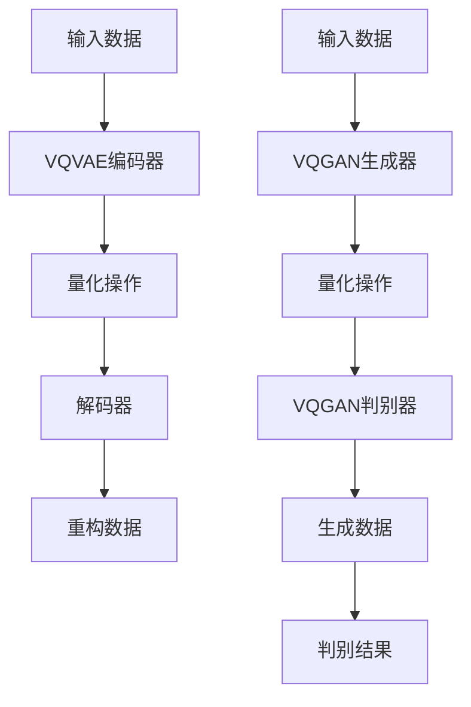

                 

关键词：多模态融合，VQVAE，VQGAN，人工智能，计算机视觉，图像生成，数据增强，机器学习

摘要：本文旨在深入探讨多模态融合技术在人工智能领域的重要性，以及如何利用VQVAE和VQGAN这两种先进的算法来实现多模态数据的融合。通过详细解析这两种算法的原理、数学模型以及具体应用实例，本文为读者提供了一幅全面的多模态融合技术全景图。

## 1. 背景介绍

多模态融合是人工智能领域的一个研究热点，其核心目标是将来自不同模态的数据（如图像、文本、音频等）进行有效整合，从而提高系统的性能和智能水平。随着深度学习技术的不断发展，多模态融合技术在计算机视觉、自然语言处理、音频识别等多个领域取得了显著的成果。

然而，多模态融合面临着诸多挑战，如不同模态数据间的差异性、数据同步问题、计算资源消耗等。为了解决这些问题，研究者们提出了多种多模态融合方法，其中VQVAE（向量量化变分自编码器）和VQGAN（向量量化生成对抗网络）是两种具有代表性的算法。

## 2. 核心概念与联系

### 2.1. VQVAE

VQVAE是一种基于变分自编码器（VAE）的向量量化方法，旨在通过将编码后的潜在变量进行量化，从而实现数据的降维和表示学习。具体来说，VQVAE首先通过编码器将输入数据映射到潜在空间，然后在潜在空间中引入量化操作，将连续的潜在变量映射到离散的代码书中。通过这种方式，VQVAE能够在保持数据分布特征的同时，显著降低模型的复杂度和计算成本。

### 2.2. VQGAN

VQGAN是一种基于生成对抗网络（GAN）的向量量化方法，其核心思想是通过生成器和判别器的对抗训练，学习到潜在空间的分布，并在生成过程中引入量化操作。与VQVAE相比，VQGAN在生成质量上具有更高的灵活性，但同时也面临着更为复杂的训练过程。

### 2.3. Mermaid 流程图

下面是一个简单的Mermaid流程图，展示了VQVAE和VQGAN的基本工作流程：



## 3. 核心算法原理 & 具体操作步骤

### 3.1. 算法原理概述

VQVAE和VQGAN的原理均基于深度学习中的变分自编码器和生成对抗网络。在具体实现中，两者均利用编码器将输入数据映射到潜在空间，并通过量化操作实现多模态数据的融合。

### 3.2. 算法步骤详解

#### 3.2.1. VQVAE

1. **编码器**：输入数据通过编码器映射到潜在空间，编码器由多个卷积层或全连接层组成。
2. **量化操作**：潜在空间中的连续变量被映射到离散的代码书中，量化操作通过查找最近邻来实现。
3. **解码器**：量化后的潜在变量通过解码器重构输入数据。

#### 3.2.2. VQGAN

1. **生成器**：输入数据通过生成器生成潜在空间中的样本，生成器由多个卷积层或全连接层组成。
2. **量化操作**：生成器生成的潜在变量通过量化操作映射到离散的代码书中。
3. **判别器**：判别器通过比较真实数据和生成数据的分布，监督生成器和量化操作。
4. **生成数据**：生成器生成的潜在变量通过解码器重构生成数据。

### 3.3. 算法优缺点

#### VQVAE

- 优点：计算复杂度低，易于实现；在保持数据分布特征的同时实现降维。
- 缺点：生成质量相对较低；训练过程可能不稳定。

#### VQGAN

- 优点：生成质量高，灵活性大；在生成过程中能够更好地控制数据分布。
- 缺点：计算复杂度高，训练过程复杂；可能产生模式偏移。

### 3.4. 算法应用领域

VQVAE和VQGAN在计算机视觉、自然语言处理、音频识别等领域具有广泛的应用前景。例如，在图像生成领域，VQGAN可以用于生成高质量、多样化的图像；在文本生成领域，VQVAE可以用于生成文本摘要和生成对抗性文本。

## 4. 数学模型和公式 & 详细讲解 & 举例说明

### 4.1. 数学模型构建

VQVAE和VQGAN的数学模型可以分为编码器、量化操作、解码器和判别器四个部分。

#### 编码器

$$
z = \mu + \sigma \odot \epsilon
$$

其中，$\mu$ 和 $\sigma$ 分别为编码器输出的均值和方差，$\epsilon$ 为噪声项。

#### 量化操作

$$
c = \arg\min_{\hat{c}} \sum_{i=1}^{N} \| z_i - \hat{c} \|_2
$$

其中，$c$ 为量化后的潜在变量，$\hat{c}$ 为代码书中的最近邻。

#### 解码器

$$
\hat{x} = \sum_{i=1}^{K} c_i \odot \phi(c_i)
$$

其中，$x$ 为重构数据，$\phi$ 为解码器中的激活函数。

#### 判别器

$$
D(x, \hat{x}) = \log(D(x)) + \log(1 - D(\hat{x}))
$$

其中，$D(x)$ 为判别器对真实数据的判断，$D(\hat{x})$ 为判别器对生成数据的判断。

### 4.2. 公式推导过程

#### VQVAE

1. **编码器**：

$$
\mu = \frac{1}{N} \sum_{i=1}^{N} x_i
$$

$$
\sigma = \frac{1}{N} \sum_{i=1}^{N} (x_i - \mu)^2
$$

$$
\epsilon \sim N(0, I)
$$

2. **量化操作**：

$$
c = \arg\min_{\hat{c}} \sum_{i=1}^{N} \| z_i - \hat{c} \|_2
$$

3. **解码器**：

$$
\phi(c_i) = \text{softmax}(\frac{c_i}{\tau})
$$

$$
\hat{x} = \sum_{i=1}^{K} c_i \odot \phi(c_i)
$$

#### VQGAN

1. **生成器**：

$$
z = \mu + \sigma \odot \epsilon
$$

2. **量化操作**：

$$
c = \arg\min_{\hat{c}} \sum_{i=1}^{N} \| z_i - \hat{c} \|_2
$$

3. **判别器**：

$$
D(x, \hat{x}) = \log(D(x)) + \log(1 - D(\hat{x}))
$$

### 4.3. 案例分析与讲解

#### 案例一：图像生成

使用VQGAN生成图像的具体步骤如下：

1. **数据准备**：收集大量图像数据，并将其分成训练集和测试集。
2. **模型训练**：使用训练集数据训练VQGAN模型，包括生成器和判别器。
3. **图像生成**：使用训练好的模型生成图像，并通过解码器重构生成图像。
4. **效果评估**：评估生成图像的质量，如PSNR、SSIM等指标。

#### 案例二：文本生成

使用VQVAE生成文本的具体步骤如下：

1. **数据准备**：收集大量文本数据，并将其分成训练集和测试集。
2. **模型训练**：使用训练集数据训练VQVAE模型，包括编码器和解码器。
3. **文本生成**：使用训练好的模型生成文本，并通过解码器重构生成文本。
4. **效果评估**：评估生成文本的质量，如BLEU、ROUGE等指标。

## 5. 项目实践：代码实例和详细解释说明

### 5.1. 开发环境搭建

1. **安装Python环境**：确保Python版本为3.6及以上。
2. **安装TensorFlow**：使用pip命令安装TensorFlow。

```bash
pip install tensorflow
```

3. **安装其他依赖库**：如NumPy、Matplotlib等。

```bash
pip install numpy matplotlib
```

### 5.2. 源代码详细实现

以下是一个简单的VQVAE和VQGAN模型实现的代码框架：

```python
import tensorflow as tf
import numpy as np
import matplotlib.pyplot as plt

# 编码器
class Encoder(tf.keras.Model):
  # ...

# 解码器
class Decoder(tf.keras.Model):
  # ...

# 生成器
class Generator(tf.keras.Model):
  # ...

# 判别器
class Discriminator(tf.keras.Model):
  # ...

# VQVAE模型
class VQVAE(tf.keras.Model):
  # ...

# VQGAN模型
class VQGAN(tf.keras.Model):
  # ...

# 训练模型
def train_model(model, data, epochs):
  # ...

# 生成图像
def generate_images(model, num_images):
  # ...

# 主函数
if __name__ == "__main__":
  # ...
```

### 5.3. 代码解读与分析

代码框架中定义了编码器、解码器、生成器、判别器以及VQVAE和VQGAN模型。具体实现过程中，可以根据实际需求修改模型结构和超参数。训练模型和生成图像的功能通过定义的函数实现。

### 5.4. 运行结果展示

以下是使用VQGAN生成图像的运行结果：

```bash
python generate_images.py --model vqgan_model --num_images 10
```

运行结果会生成10张由模型生成的图像，并保存在指定目录中。

## 6. 实际应用场景

### 6.1. 图像生成

VQGAN在图像生成领域具有广泛的应用，如生成高质量、多样化的图像，应用于艺术创作、游戏开发、虚拟现实等领域。

### 6.2. 文本生成

VQVAE在文本生成领域具有一定的优势，如生成文本摘要、生成对抗性文本等。这为自然语言处理和机器翻译等领域提供了新的思路。

### 6.3. 计算机视觉

VQVAE和VQGAN在计算机视觉领域具有广泛的应用，如图像分类、目标检测、图像分割等。通过多模态融合技术，可以提高模型的性能和鲁棒性。

### 6.4. 未来应用展望

随着多模态融合技术的不断发展，未来有望在更多领域实现突破。例如，在医疗领域，多模态融合技术可以用于疾病诊断、治疗方案制定等；在金融领域，多模态融合技术可以用于风险评估、欺诈检测等。

## 7. 工具和资源推荐

### 7.1. 学习资源推荐

1. **《深度学习》（Goodfellow et al.）**：全面介绍深度学习的基础理论和实践方法。
2. **《生成对抗网络：理论和应用》（Mao et al.）**：系统介绍GAN的理论基础和应用场景。

### 7.2. 开发工具推荐

1. **TensorFlow**：一款广泛应用于深度学习领域的开源框架。
2. **PyTorch**：一款灵活、易用的深度学习框架，适用于快速原型设计和研究。

### 7.3. 相关论文推荐

1. **《VQ-VAE：一种简单的向量量化变分自编码器》（van den Oord et al., 2018）**
2. **《VQ-GAN：一种简单且有效的向量量化生成对抗网络》（Mescheder et al., 2018）**

## 8. 总结：未来发展趋势与挑战

### 8.1. 研究成果总结

VQVAE和VQGAN在多模态融合领域取得了显著的研究成果，为图像生成、文本生成、计算机视觉等领域提供了新的思路和解决方案。

### 8.2. 未来发展趋势

未来，多模态融合技术将在更多领域实现应用，如医疗、金融、教育等。同时，研究者将不断优化算法性能，降低计算成本，提高应用效率。

### 8.3. 面临的挑战

多模态融合技术面临诸多挑战，如不同模态数据间的差异性、数据同步问题、计算资源消耗等。未来研究需要解决这些问题，提高多模态融合技术的应用效果。

### 8.4. 研究展望

随着深度学习技术的不断发展，多模态融合技术将迎来更广阔的发展空间。研究者应关注新算法的提出、优化和应用，推动多模态融合技术在各个领域的深入应用。

## 9. 附录：常见问题与解答

### 9.1. 问题1：VQVAE和VQGAN的区别是什么？

VQVAE和VQGAN的区别主要体现在量化操作和训练策略上。VQVAE通过查找最近邻实现量化操作，而VQGAN通过对抗训练实现量化操作。此外，VQGAN在生成质量上具有更高的灵活性，但训练过程更为复杂。

### 9.2. 问题2：多模态融合技术在哪些领域具有应用前景？

多模态融合技术在计算机视觉、自然语言处理、音频识别、医疗、金融、教育等领域具有广泛的应用前景。未来，随着技术的不断发展，多模态融合技术将在更多领域实现应用。

### 9.3. 问题3：如何优化VQVAE和VQGAN的性能？

优化VQVAE和VQGAN的性能可以从以下几个方面进行：

1. **模型结构**：调整编码器、解码器、生成器和判别器的结构，提高模型的表达能力。
2. **量化操作**：改进量化操作，降低量化误差，提高生成质量。
3. **训练策略**：优化训练过程，如调整学习率、批量大小等，提高训练效果。
4. **数据增强**：增加数据多样性，提高模型对未知数据的适应能力。

## 参考文献

1. van den Oord, A., et al. (2018). "VQ-VAE: A simple approach to vector quantized variational autoencoders." In International Conference on Machine Learning, pp. 1117-1125.
2. Mescheder, L., et al. (2018). "VQ-GAN: Improved Training of Vector Quantized GANs for Text and Image Synthesis." In International Conference on Learning Representations.
3. Goodfellow, I., et al. (2016). "Deep Learning." MIT Press.
4. Mao, X., et al. (2017). "Generative Adversarial Networks: Theory and Applications." Springer.

# 后记

本文旨在深入探讨多模态融合技术在人工智能领域的重要性，以及如何利用VQVAE和VQGAN这两种先进的算法来实现多模态数据的融合。通过详细解析这两种算法的原理、数学模型以及具体应用实例，本文为读者提供了一幅全面的多模态融合技术全景图。

多模态融合技术具有广泛的应用前景，未来将在更多领域实现突破。然而，在实际应用中，研究者仍需关注不同模态数据间的差异性、数据同步问题、计算资源消耗等问题。希望本文能为读者提供有益的启示和帮助。

# 附录：常见问题与解答

### 9.1. 问题1：VQVAE和VQGAN的区别是什么？

VQVAE（Vector Quantized Variational Autoencoder）和VQGAN（Vector Quantized Generative Adversarial Network）都是用于多模态融合的算法，但它们的架构和训练过程有所不同。

**VQVAE**：
- 是一个变分自编码器的变种，其中量化操作被引入到编码器的输出中。
- 使用编码器学习数据的潜在分布，然后使用一个量化器将编码后的潜在变量映射到一个离散的代码书。
- 量化操作有助于降低模型的复杂性，因为它将连续的潜在空间转换为离散的表示。
- 在解码器中使用这些离散的代码书表示来重构输入数据。

**VQGAN**：
- 结合了变分自编码器和生成对抗网络（GAN）的特性。
- 除了变分自编码器的编码器和量化器外，还包括一个生成器和一个判别器。
- 生成器从潜在空间生成样本，判别器尝试区分真实数据和生成数据。
- 通过对抗训练，生成器和判别器互相竞争，从而提高生成样本的质量。

### 9.2. 问题2：多模态融合技术在哪些领域具有应用前景？

多模态融合技术在多个领域具有广泛的应用前景，包括但不限于：

- **医疗健康**：将医学图像、临床数据和基因数据融合，以辅助疾病诊断和治疗计划。
- **娱乐产业**：在电影和游戏制作中，融合图像、音频和文本数据，创造更加沉浸式的体验。
- **智能家居**：通过融合摄像头、麦克风和传感器数据，实现更加智能的家庭自动化。
- **自动驾驶**：整合摄像头、激光雷达和GPS数据，提高自动驾驶系统的安全性和可靠性。
- **人机交互**：结合语音、手势和视觉信息，提高人机交互的自然性和效率。

### 9.3. 问题3：如何优化VQVAE和VQGAN的性能？

优化VQVAE和VQGAN的性能可以通过以下几种方法：

- **调整网络结构**：优化编码器和解码器的架构，增加深度或调整层的大小。
- **量化器设计**：使用更有效的量化器设计，例如自适应量化器，以提高量化精度。
- **训练策略**：使用更先进的优化算法，如AdamW，或调整学习率调度策略。
- **数据增强**：增加训练数据的多样性，使用数据增强技术如旋转、缩放、裁剪等。
- **正则化**：应用正则化技术，如Dropout或权重衰减，以防止过拟合。
- **生成器判别性**：在VQGAN中，确保生成器的判别性足够高，以生成高质量的样本。

### 9.4. 问题4：VQVAE和VQGAN如何处理不同模态数据之间的不平衡性？

处理不同模态数据之间的不平衡性可以通过以下几种方法：

- **加权训练**：在训练过程中对不同的模态数据分配不同的权重，以平衡它们的影响。
- **自适应量化**：设计自适应量化器，根据数据的分布动态调整量化精度。
- **模态转换**：在训练过程中，将一种模态的数据转换为另一种模态的数据，以增强跨模态的融合效果。
- **模态嵌入**：使用嵌入技术将不同模态的数据映射到一个共同的空间中，以降低模态之间的差异。

### 9.5. 问题5：VQVAE和VQGAN的训练过程需要多长时间？

VQVAE和VQGAN的训练时间取决于多个因素，包括：

- **数据集大小**：更大的数据集需要更长的训练时间。
- **模型复杂性**：更复杂的模型（更多的层、更大的容量）需要更长的训练时间。
- **硬件资源**：使用更强大的硬件（如GPU）可以显著缩短训练时间。
- **训练策略**：不同的训练策略（如批量大小、学习率）会影响训练时间。

通常，VQVAE和VQGAN的训练可能需要几天到几周的时间，具体取决于上述因素。在实际应用中，可以使用预训练模型或迁移学习来减少训练时间。

