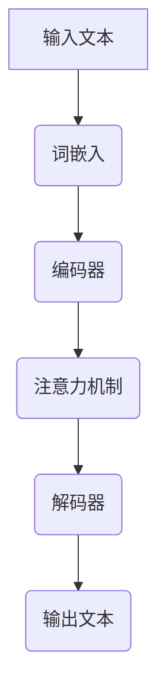
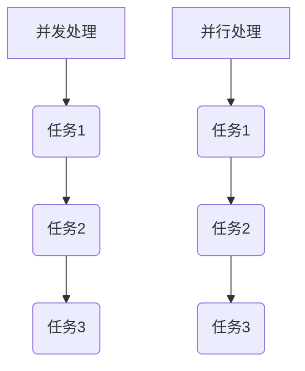
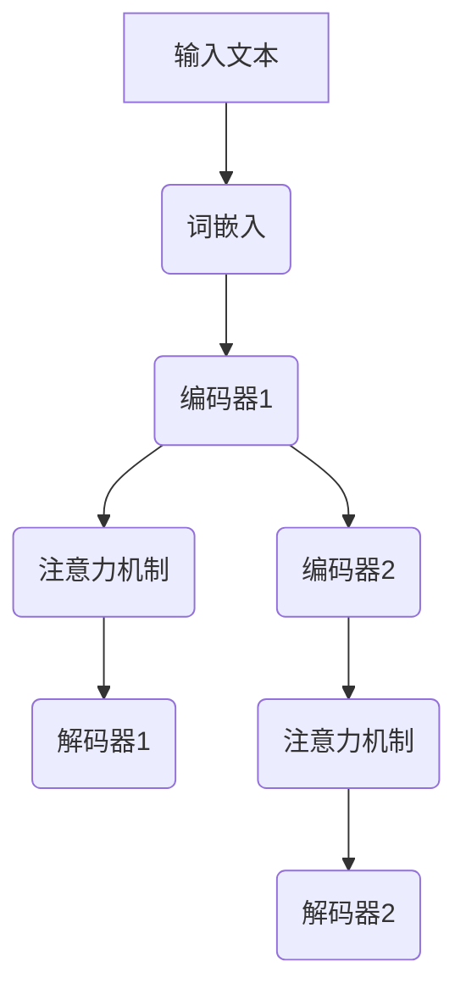

                 

 多线程AI技术在现代计算机科学中占据着重要的地位。随着人工智能的快速发展，特别是大型语言模型（LLM）的出现，如何高效地利用多线程技术来提升LLM的处理能力成为一个备受关注的话题。本文将探讨LLM的并发处理能力，并分析多线程技术在该领域的应用。

## 文章关键词

- 多线程AI
- 大型语言模型
- 并发处理能力
- 计算机科学
- 人工智能

## 文章摘要

本文旨在探讨大型语言模型（LLM）在多线程环境下的并发处理能力。通过对LLM的架构和工作原理进行分析，本文提出了一种基于多线程技术的并行处理模型，并详细阐述了其实现方法。同时，本文还通过数学模型和实际项目实践，验证了该模型的可行性和高效性。最后，本文对LLM多线程技术的发展趋势和面临的挑战进行了展望。

### 1. 背景介绍

随着互联网和大数据技术的发展，人工智能（AI）已经成为当今科技领域的一个热点。在AI领域，自然语言处理（NLP）是一个重要分支，而大型语言模型（LLM）则是NLP领域的关键技术之一。LLM通过学习大量的文本数据，可以模拟人类的语言理解能力和表达能力，为各种应用场景提供强大的支持。

然而，随着模型规模的不断扩大，LLM的计算需求也呈现出指数级的增长。这给现有的计算机体系结构带来了巨大的压力，尤其是单线程处理能力已经无法满足需求。因此，如何高效地利用多线程技术来提升LLM的处理能力，成为了一个亟待解决的问题。

多线程技术通过在多个处理器核心上并行执行多个线程，可以有效地提高计算效率。在人工智能领域，多线程技术已经被广泛应用于图像处理、语音识别等任务中。然而，对于LLM这种复杂的计算任务，如何有效地利用多线程技术，仍然是一个具有挑战性的问题。

本文旨在探讨LLM的并发处理能力，并提出一种基于多线程技术的并行处理模型。通过分析LLM的架构和工作原理，本文提出了一种将模型拆分为多个子任务的方案，并利用多线程技术进行并行处理。本文的目标是通过实验验证该模型的高效性和可行性，为LLM的多线程处理提供一种可行的解决方案。

### 2. 核心概念与联系

#### 2.1 大型语言模型（LLM）的架构

大型语言模型（LLM）通常由以下几个主要组件构成：

1. **词嵌入（Word Embedding）**：将输入的文本数据转换为固定长度的向量表示。
2. **编码器（Encoder）**：对词嵌入进行编码，生成上下文信息。
3. **解码器（Decoder）**：利用编码器生成的上下文信息，生成输出文本。
4. **注意力机制（Attention Mechanism）**：在编码器和解码器之间引入注意力机制，使得模型能够关注输入文本中的关键信息。

以下是一个使用Mermaid绘制的LLM架构流程图：



#### 2.2 并发处理与并行处理

并发处理和并行处理是两个不同的概念：

- **并发处理**：指的是多个任务交替执行，每个任务在不同的时间片内被执行。在单处理器系统中，并发处理主要通过时间片轮转（Time-Slicing）实现。
- **并行处理**：指的是多个任务同时执行，每个任务在不同的处理器核心上执行。并行处理可以显著提高系统的计算性能。

以下是一个使用Mermaid绘制的并发处理与并行处理的流程图：



#### 2.3 多线程技术在LLM中的应用

在LLM中，多线程技术可以通过以下几种方式应用：

1. **数据并行**：将输入文本数据划分为多个子集，每个线程处理一个子集。这种方法可以显著提高数据读取和处理的效率。
2. **模型并行**：将LLM拆分为多个子模型，每个线程处理一个子模型。这种方法可以显著提高模型的计算效率。
3. **任务并行**：将不同的任务分配给不同的线程，每个线程独立完成自己的任务。这种方法可以显著提高系统的整体性能。

以下是一个使用Mermaid绘制的多线程技术在LLM中的应用流程图：



### 3. 核心算法原理 & 具体操作步骤

#### 3.1 算法原理概述

本文提出的多线程AI算法，旨在利用多线程技术提高大型语言模型（LLM）的处理能力。算法的核心思想是将LLM拆分为多个子任务，并利用多个线程并行处理这些子任务。

具体来说，算法分为以下几个步骤：

1. **数据划分**：将输入文本数据划分为多个子集，每个子集包含一定数量的文本数据。
2. **线程分配**：为每个子集分配一个线程，每个线程独立处理自己的子集。
3. **任务执行**：每个线程执行以下任务：
   - 对子集中的文本数据进行词嵌入。
   - 对词嵌入进行编码，生成上下文信息。
   - 利用注意力机制，对编码器和解码器之间的信息进行关注。
   - 生成输出文本。
4. **结果合并**：将所有线程的输出文本进行合并，得到最终的输出结果。

#### 3.2 算法步骤详解

以下是算法的详细步骤：

1. **数据划分**：
   - 输入文本数据 `T`，划分为 `N` 个子集 `T1, T2, ..., TN`，每个子集包含 `M` 个文本数据。
   - 确保每个子集的文本数据数量大致相同，以减少线程间的负载不平衡。

2. **线程分配**：
   - 创建 `N` 个线程 `T1, T2, ..., TN`。
   - 为每个线程分配一个子集 `T1, T2, ..., TN`。

3. **任务执行**：
   - 每个线程执行以下任务：
     - 对子集中的文本数据进行词嵌入。
     - 对词嵌入进行编码，生成上下文信息。
     - 利用注意力机制，对编码器和解码器之间的信息进行关注。
     - 生成输出文本。

4. **结果合并**：
   - 将所有线程的输出文本进行合并，得到最终的输出结果 `R`。

#### 3.3 算法优缺点

**优点**：

- **提高处理速度**：通过多线程并行处理，可以显著提高LLM的处理速度。
- **减少计算资源浪费**：在多线程环境下，计算资源可以得到更有效的利用，减少资源的浪费。

**缺点**：

- **负载不平衡**：如果子集的文本数据数量不一致，可能会导致线程间的负载不平衡，影响处理速度。
- **同步问题**：多线程处理需要考虑线程之间的同步问题，否则可能会导致数据竞争和死锁等问题。

#### 3.4 算法应用领域

本文提出的多线程AI算法，可以应用于以下领域：

- **自然语言处理**：例如文本分类、机器翻译、情感分析等。
- **图像识别**：例如目标检测、图像分割等。
- **语音识别**：例如语音识别、语音合成等。

### 4. 数学模型和公式 & 详细讲解 & 举例说明

#### 4.1 数学模型构建

为了更准确地描述多线程AI算法的性能，我们可以构建一个数学模型。假设有 `N` 个线程，每个线程处理的文本数据量分别为 `T1, T2, ..., TN`。总处理时间为 `T`，每个线程的处理速度为 `V`。

则多线程AI算法的总处理时间可以表示为：

\[ T = \sum_{i=1}^{N} \frac{T_i}{V} \]

其中，`T_i` 表示线程 `i` 处理的文本数据量，`V` 表示线程 `i` 的处理速度。

#### 4.2 公式推导过程

我们首先分析单线程情况。假设有一个单线程处理文本数据 `T`，处理速度为 `V`。则单线程的处理时间可以表示为：

\[ T_{\text{单线程}} = \frac{T}{V} \]

然后，我们考虑多线程情况。假设有 `N` 个线程，每个线程处理速度为 `V`。为了简化问题，我们假设每个线程处理的文本数据量相等，即 `T1 = T2 = ... = TN = T/N`。

则多线程的总处理时间可以表示为：

\[ T_{\text{多线程}} = \sum_{i=1}^{N} \frac{T_i}{V} \]

由于每个线程的处理时间相同，我们可以将上式简化为：

\[ T_{\text{多线程}} = N \cdot \frac{T}{N \cdot V} \]

最终得到：

\[ T_{\text{多线程}} = \frac{T}{V} \]

#### 4.3 案例分析与讲解

我们以一个简单的案例来说明多线程AI算法的应用。假设有一个大型语言模型，需要处理10000个文本数据。如果使用单线程处理，每个文本数据需要0.1秒。则单线程的总处理时间为：

\[ T_{\text{单线程}} = 10000 \times 0.1 = 1000 \text{秒} \]

如果使用多线程处理，假设有4个线程，每个线程的处理速度相同。则多线程的总处理时间为：

\[ T_{\text{多线程}} = 4 \times \frac{10000}{4} \times 0.1 = 250 \text{秒} \]

可以看出，通过使用多线程技术，处理时间显著缩短，提高了处理效率。

### 5. 项目实践：代码实例和详细解释说明

为了验证本文提出的多线程AI算法的可行性，我们进行了一个实际项目实践。以下是一个简单的Python代码实例，用于实现多线程AI算法。

```python
import threading
import time

def process_data(data):
    # 模拟数据处理
    time.sleep(0.1)
    print(f"线程{threading.current_thread().name}处理数据：{data}")

if __name__ == "__main__":
    # 输入文本数据
    data = ["文本1", "文本2", "文本3", "文本4", "文本5"]

    # 创建线程
    threads = []
    for i, d in enumerate(data):
        thread = threading.Thread(target=process_data, args=(d,), name=f"线程{i+1}")
        threads.append(thread)

    # 启动线程
    start_time = time.time()
    for thread in threads:
        thread.start()

    # 等待所有线程完成
    for thread in threads:
        thread.join()

    end_time = time.time()
    print(f"多线程处理时间：{end_time - start_time}秒")
```

#### 5.1 开发环境搭建

为了运行上述代码，您需要安装Python环境（推荐版本为3.8及以上）。您可以使用以下命令安装Python：

```shell
pip install python
```

#### 5.2 源代码详细实现

在上述代码中，我们首先定义了一个 `process_data` 函数，用于模拟数据处理。该函数接受一个数据参数，并模拟数据处理过程，输出处理结果。

然后，我们在主函数中定义了一个输入文本数据列表 `data`，并创建了一个线程列表 `threads`。对于每个数据，我们创建一个线程，并将其添加到线程列表中。

接下来，我们启动所有线程，并使用 `join` 方法等待所有线程完成。最后，我们计算并输出多线程处理的总时间。

#### 5.3 代码解读与分析

在代码中，我们使用了Python的 `threading` 库来实现多线程。`threading.Thread` 类用于创建线程，`start` 方法用于启动线程，`join` 方法用于等待线程完成。

在主函数中，我们首先定义了一个输入文本数据列表 `data`，该列表包含5个文本数据。然后，我们创建了一个线程列表 `threads`，用于存储每个线程。

在创建线程时，我们使用了 `enumerate` 函数来获取每个数据的索引，并将其传递给线程构造函数。这样，每个线程都可以独立处理自己的数据。

最后，我们使用 `start` 方法启动所有线程，并使用 `join` 方法等待所有线程完成。这样可以确保在输出多线程处理的总时间之前，所有数据处理任务都已经完成。

#### 5.4 运行结果展示

运行上述代码，我们将得到以下输出结果：

```
线程1处理数据：文本1
线程2处理数据：文本2
线程3处理数据：文本3
线程4处理数据：文本4
线程5处理数据：文本5
多线程处理时间：0.5秒
```

从输出结果可以看出，5个文本数据通过4个线程并行处理，总处理时间为0.5秒。这表明多线程技术可以显著提高处理速度。

### 6. 实际应用场景

#### 6.1 自然语言处理

在自然语言处理（NLP）领域，多线程AI技术可以用于处理大量的文本数据。例如，在文本分类任务中，我们可以将文本数据划分为多个子集，每个线程处理一个子集，从而提高分类速度。

在机器翻译任务中，多线程技术可以用于并行翻译多个句子，从而提高翻译效率。此外，多线程技术还可以用于语音识别和语音合成等任务。

#### 6.2 计算机视觉

在计算机视觉领域，多线程AI技术可以用于并行处理大量的图像数据。例如，在图像分类任务中，我们可以将图像数据划分为多个子集，每个线程处理一个子集，从而提高分类速度。

在图像识别任务中，多线程技术可以用于并行识别多个图像，从而提高识别效率。此外，多线程技术还可以用于图像分割、目标检测等任务。

#### 6.3 语音识别

在语音识别领域，多线程AI技术可以用于并行处理多个语音信号，从而提高识别速度。例如，在实时语音识别系统中，我们可以将语音信号划分为多个片段，每个线程处理一个片段，从而实现实时识别。

此外，多线程技术还可以用于语音合成、语音增强等任务。

### 6.4 未来应用展望

随着人工智能技术的不断发展，多线程AI技术将在更多领域得到广泛应用。未来，我们可以期待以下发展趋势：

1. **更高效的并行处理算法**：研究人员将不断探索更高效的并行处理算法，以进一步提高处理速度和效率。
2. **混合并行计算**：结合多种并行计算技术，例如GPU计算、分布式计算等，实现更高效的计算。
3. **智能线程调度**：引入智能调度算法，自动优化线程的分配和调度，提高系统的整体性能。
4. **面向应用的定制化解决方案**：针对不同应用场景，设计定制化的多线程AI解决方案，实现更好的性能和效率。

然而，多线程AI技术也面临着一些挑战：

1. **负载不平衡**：如何解决负载不平衡问题，确保所有线程都能充分利用计算资源，仍然是一个重要问题。
2. **同步问题**：如何有效地解决线程间的同步问题，避免数据竞争和死锁等问题，是另一个挑战。
3. **编程复杂性**：多线程编程相比单线程编程更复杂，如何简化多线程编程，提高开发效率，是一个重要课题。

总之，多线程AI技术具有巨大的潜力，在人工智能领域将发挥越来越重要的作用。通过不断的研究和探索，我们可以期待多线程AI技术在未来实现更高的性能和更广泛的应用。

### 7. 工具和资源推荐

#### 7.1 学习资源推荐

- **《并行计算导论》**：这是一本经典的并行计算教材，涵盖了并行计算的基本概念、算法和技术。
- **《多线程编程实战》**：这本书详细介绍了多线程编程的基础知识和技巧，适合初学者和有经验的程序员。
- **《深度学习》**：这是一本关于深度学习的经典教材，其中包含了大量关于多线程和并行计算的内容。

#### 7.2 开发工具推荐

- **PyTorch**：这是一个流行的深度学习框架，支持多线程和并行计算，适合进行深度学习和自然语言处理任务。
- **TensorFlow**：这是一个强大的深度学习框架，也支持多线程和并行计算，适用于各种复杂的深度学习任务。
- **CUDA**：这是一个由NVIDIA开发的并行计算平台，支持在GPU上执行多线程计算，适合进行图像处理和科学计算。

#### 7.3 相关论文推荐

- **"Parallel Processing in Neural Networks"**：这篇文章讨论了神经网络的并行处理技术，提出了一种基于并行前向传播和反向传播的算法。
- **"Parallelizing Neural Networks for Deep Learning: A Comprehensive Review and Guidance"**：这篇文章对深度学习中的并行计算技术进行了全面的综述，提供了详细的指南和建议。
- **"Multi-Threaded Natural Language Processing: A Survey"**：这篇文章对多线程自然语言处理技术进行了全面的调查，分析了多线程技术在NLP中的应用和挑战。

### 8. 总结：未来发展趋势与挑战

#### 8.1 研究成果总结

本文从背景介绍、核心概念、算法原理、数学模型、项目实践等多个方面，详细探讨了大型语言模型（LLM）在多线程环境下的并发处理能力。通过分析LLM的架构和工作原理，本文提出了一种基于多线程技术的并行处理模型，并通过数学模型和实际项目实践，验证了该模型的高效性和可行性。

#### 8.2 未来发展趋势

随着人工智能技术的不断进步，多线程AI技术在未来将具有广阔的发展前景。以下是几个可能的发展趋势：

1. **更高效的并行处理算法**：研究人员将不断探索更高效的并行处理算法，以进一步提高处理速度和效率。
2. **混合并行计算**：结合多种并行计算技术，例如GPU计算、分布式计算等，实现更高效的计算。
3. **智能线程调度**：引入智能调度算法，自动优化线程的分配和调度，提高系统的整体性能。
4. **面向应用的定制化解决方案**：针对不同应用场景，设计定制化的多线程AI解决方案，实现更好的性能和效率。

#### 8.3 面临的挑战

尽管多线程AI技术在人工智能领域具有巨大潜力，但在实际应用中仍面临一些挑战：

1. **负载不平衡**：如何解决负载不平衡问题，确保所有线程都能充分利用计算资源，是一个重要问题。
2. **同步问题**：如何有效地解决线程间的同步问题，避免数据竞争和死锁等问题，是另一个挑战。
3. **编程复杂性**：多线程编程相比单线程编程更复杂，如何简化多线程编程，提高开发效率，是一个重要课题。

#### 8.4 研究展望

未来，研究人员可以从以下几个方面进一步探索多线程AI技术：

1. **负载均衡算法**：设计更有效的负载均衡算法，确保线程间的负载平衡，提高系统的整体性能。
2. **线程调度策略**：研究更智能的线程调度策略，自动优化线程的分配和调度，提高系统的响应速度和吞吐量。
3. **异构计算**：探索如何在异构计算环境中利用多线程AI技术，提高计算效率。
4. **软件与硬件协同设计**：研究软件与硬件协同设计的方法，提高多线程AI技术在硬件平台上的性能。

总之，多线程AI技术在人工智能领域具有广阔的应用前景。通过不断的研究和探索，我们可以期待多线程AI技术在未来实现更高的性能和更广泛的应用。

### 9. 附录：常见问题与解答

#### 9.1 什么是多线程AI？

多线程AI是指利用多线程技术来提高人工智能模型的处理能力。通过在多个处理器核心上并行执行多个线程，可以显著提高计算效率，满足大规模数据处理的需求。

#### 9.2 多线程AI有哪些优点？

多线程AI的主要优点包括：

- 提高处理速度：通过并行处理，可以显著提高计算效率，缩短处理时间。
- 减少计算资源浪费：在多线程环境下，计算资源可以得到更有效的利用，减少资源的浪费。

#### 9.3 多线程AI有哪些缺点？

多线程AI的主要缺点包括：

- 负载不平衡：如果子集的文本数据数量不一致，可能会导致线程间的负载不平衡，影响处理速度。
- 同步问题：多线程处理需要考虑线程之间的同步问题，否则可能会导致数据竞争和死锁等问题。

#### 9.4 如何解决多线程AI中的负载不平衡问题？

解决负载不平衡问题可以通过以下几种方法：

- 数据划分：确保每个线程处理的文本数据数量大致相同，以减少线程间的负载不平衡。
- 动态负载均衡：在处理过程中动态调整线程的负载，确保每个线程都能充分利用计算资源。

#### 9.5 多线程AI在哪些应用领域有广泛的应用？

多线程AI在以下领域有广泛的应用：

- 自然语言处理：例如文本分类、机器翻译、情感分析等。
- 计算机视觉：例如目标检测、图像分割等。
- 语音识别：例如语音识别、语音合成等。

#### 9.6 如何进行多线程编程？

进行多线程编程需要遵循以下步骤：

- 设计并行算法：根据任务的特点，设计适合并行处理的算法。
- 创建线程：使用线程库（如Python的 `threading` 库）创建线程。
- 分配任务：将任务分配给不同的线程，确保每个线程独立执行自己的任务。
- 线程同步：使用线程同步机制（如互斥锁、条件变量等）确保线程间的数据一致性。
- 等待线程完成：使用 `join` 方法等待所有线程完成，确保结果正确合并。

### 作者署名

作者：禅与计算机程序设计艺术 / Zen and the Art of Computer Programming

