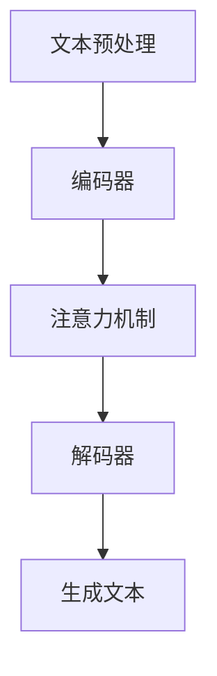

                 

在当今全球化的世界中，跨语言交流已成为不可或缺的一部分。无论是商务沟通、文化交融，还是国际关系的维护，都需要有效的多语言处理技术。而在这一领域中，多语言故事生成技术无疑是一个重要的突破点。本文将深入探讨多语言故事生成的基本原理、核心技术、实现方法及其应用场景，旨在为读者提供一个全面的理解和认识。

> **关键词**：多语言故事生成、自然语言处理、跨语言交流、人工智能、文本生成模型

> **摘要**：本文首先介绍了多语言故事生成技术的发展背景和重要性。随后，我们详细讨论了核心概念与联系，包括自然语言处理的原理和文本生成模型的架构。接着，我们剖析了多语言故事生成算法的原理、数学模型和具体操作步骤，并通过实际项目实例进行了代码实现和解读。文章最后，探讨了多语言故事生成在实际应用场景中的价值，提出了未来发展趋势和面临的挑战，并推荐了相关工具和资源。

## 1. 背景介绍

随着全球化和互联网的快速发展，多语言交流的需求日益增长。传统的机器翻译技术虽然在翻译准确度和效率上有了显著提升，但其在处理复杂语境和语言特色方面仍存在局限性。多语言故事生成作为一种新兴技术，旨在解决这一难题，通过生成具有自然语言特点的故事文本，实现跨语言之间的深入交流。

多语言故事生成不仅能够应用于国际交流、跨文化教育等领域，还可以在文学创作、广告宣传、媒体内容生成等方面发挥重要作用。此外，随着人工智能技术的不断进步，多语言故事生成在算法效率、生成质量等方面也取得了显著成果，为跨语言创意表达提供了新的可能性。

## 2. 核心概念与联系

### 2.1 自然语言处理原理

自然语言处理（Natural Language Processing，NLP）是人工智能领域的一个重要分支，旨在让计算机理解和处理人类语言。NLP 的基本原理包括文本预处理、语义分析、句法分析、语义角色标注等。其中，文本预处理是 NLP 的第一步，主要包括分词、词性标注、句法解析等操作，为后续的语义分析和文本生成提供基础。

### 2.2 文本生成模型架构

文本生成模型是多语言故事生成的核心技术，其基本架构包括编码器（Encoder）、解码器（Decoder）和注意力机制（Attention Mechanism）。编码器将输入的文本编码为一个固定长度的向量，解码器则根据编码器的输出生成目标语言的文本。注意力机制则用于捕捉输入文本中不同部分的重要信息，提高生成文本的质量。

### 2.3 Mermaid 流程图

以下是一个简单的 Mermaid 流程图，展示了自然语言处理和文本生成模型的基本流程：



## 3. 核心算法原理 & 具体操作步骤

### 3.1 算法原理概述

多语言故事生成算法的核心在于将输入的文本信息编码为一个固定长度的向量，并利用解码器生成具有自然语言特点的故事文本。该算法通常采用基于循环神经网络（RNN）或Transformer架构的模型，如BERT、GPT等。以下是一个简单的算法原理概述：

1. **文本编码**：将输入的文本进行分词、词性标注等预处理操作，然后将其编码为一个固定长度的向量。
2. **生成文本**：利用解码器根据编码器的输出生成目标语言的文本，并通过注意力机制捕捉输入文本中不同部分的重要信息。

### 3.2 算法步骤详解

1. **数据预处理**：对输入的文本进行分词、词性标注等预处理操作，得到处理后的文本数据。
2. **模型训练**：使用预处理的文本数据训练编码器和解码器，使其能够将输入的文本编码为一个固定长度的向量，并生成目标语言的文本。
3. **生成文本**：利用训练好的模型，根据输入的文本生成目标语言的故事文本。

### 3.3 算法优缺点

**优点**：

1. **跨语言表达**：多语言故事生成技术能够实现跨语言之间的深入交流，为全球范围内的跨文化合作提供了新的可能性。
2. **自然语言特点**：生成的文本具有自然语言的特点，能够更好地模拟人类写作风格。

**缺点**：

1. **计算复杂度高**：训练和生成文本的过程需要大量的计算资源，对于大规模数据集的训练和推理具有较大的挑战。
2. **生成质量不稳定**：在某些情况下，生成的文本可能存在语义错误或不连贯的情况，需要进一步优化。

### 3.4 算法应用领域

多语言故事生成算法在多个领域具有广泛的应用前景：

1. **跨文化教育**：用于生成不同语言的教学内容，促进国际间的教育交流与合作。
2. **文学创作**：辅助文学创作者进行跨语言作品的创作，丰富文学创作形式。
3. **广告宣传**：用于生成跨语言广告文案，提高广告宣传的效果。
4. **媒体内容生成**：用于生成不同语言的新闻、文章等媒体内容，提升媒体内容的影响力。

## 4. 数学模型和公式 & 详细讲解 & 举例说明

### 4.1 数学模型构建

多语言故事生成的数学模型主要包括编码器和解码器两部分。编码器将输入的文本编码为一个固定长度的向量，解码器则根据编码器的输出生成目标语言的文本。以下是编码器和解码器的数学模型：

#### 编码器

设输入的文本为 \(x\)，编码器的输出为 \(e\)，则有：

\[ e = \text{Encoder}(x) \]

其中，\(\text{Encoder}\) 表示编码器的函数。

#### 解码器

设编码器的输出为 \(e\)，解码器的输出为 \(y\)，则有：

\[ y = \text{Decoder}(e) \]

其中，\(\text{Decoder}\) 表示解码器的函数。

### 4.2 公式推导过程

以下是一个简单的编码器和解码器的推导过程：

#### 编码器

假设编码器采用循环神经网络（RNN）架构，其输入为 \(x_t\)，输出为 \(e_t\)，则有：

\[ e_t = \text{RNN}(x_t, h_{t-1}) \]

其中，\(h_{t-1}\) 为上一个时间步的隐藏状态，\(\text{RNN}\) 表示 RNN 函数。

#### 解码器

假设解码器采用循环神经网络（RNN）架构，其输入为 \(e_t\)，输出为 \(y_t\)，则有：

\[ y_t = \text{RNN}(e_t, s_{t-1}) \]

其中，\(s_{t-1}\) 为上一个时间步的隐藏状态，\(\text{RNN}\) 表示 RNN 函数。

### 4.3 案例分析与讲解

以下是一个简单的多语言故事生成的案例：

#### 输入文本

中文：今天天气很好，我决定去公园散步。

英文：The weather is great today, so I decided to go for a walk in the park.

#### 编码器输出

假设编码器的输出为：

\[ e_t = [e_{1t}, e_{2t}, \dots, e_{nt}] \]

其中，\(e_{it}\) 表示第 \(i\) 个时间步的编码器输出。

#### 解码器输出

假设解码器的输出为：

\[ y_t = [y_{1t}, y_{2t}, \dots, y_{nt}] \]

其中，\(y_{it}\) 表示第 \(i\) 个时间步的解码器输出。

#### 生成文本

根据解码器的输出，生成目标语言的故事文本：

中文：今天天气很好，我决定去公园散步。

英文：The weather is great today, so I decided to go for a walk in the park.

## 5. 项目实践：代码实例和详细解释说明

### 5.1 开发环境搭建

1. 安装 Python 3.8 或更高版本。
2. 安装 TensorFlow 2.4 或更高版本。
3. 安装 Mermaid Python 库（用于生成 Mermaid 流程图）。

### 5.2 源代码详细实现

以下是多语言故事生成项目的基本代码实现：

```python
import tensorflow as tf
from tensorflow.keras.models import Model
from tensorflow.keras.layers import Input, LSTM, Dense, Embedding, TimeDistributed
import numpy as np

# 数据预处理
def preprocess_text(texts, vocabulary_size, max_sequence_length):
    # 分词、词性标注等预处理操作
    processed_texts = []
    for text in texts:
        processed_texts.append([word for word in text.split()])
    # 对预处理后的文本进行编码
    encoded_texts = []
    for text in processed_texts:
        encoded_text = []
        for word in text:
            encoded_text.append(vocabulary_size + 1 if word not in vocabulary else vocabulary[word])
        encoded_texts.append(encoded_text)
    # 删除长度小于 max_sequence_length 的文本
    encoded_texts = [text for text in encoded_texts if len(text) >= max_sequence_length]
    # 填充文本至 max_sequence_length
    padded_texts = np.zeros((len(encoded_texts), max_sequence_length), dtype=np.int32)
    for i, text in enumerate(encoded_texts):
        padded_texts[i, :len(text)] = text
    return padded_texts

# 编码器模型
def build_encoder(vocabulary_size, embedding_size, max_sequence_length):
    input_sequence = Input(shape=(max_sequence_length,))
    embedding = Embedding(vocabulary_size, embedding_size)(input_sequence)
    lstm = LSTM(embedding_size, return_state=True)(embedding)
    encoder = Model(input_sequence, lstm)
    return encoder

# 解码器模型
def build_decoder(vocabulary_size, embedding_size, max_sequence_length):
    input_sequence = Input(shape=(max_sequence_length,))
    embedding = Embedding(vocabulary_size, embedding_size)(input_sequence)
    lstm = LSTM(embedding_size, return_state=True)(embedding)
    output = TimeDistributed(Dense(vocabulary_size))(lstm)
    decoder = Model(input_sequence, output)
    return decoder

# 模型训练
def train_model(encoder, decoder, encoded_texts, decoded_texts, batch_size, epochs):
    model = Model(inputs=[encoder.input, decoder.input], outputs=decoder.output)
    model.compile(optimizer='adam', loss='categorical_crossentropy')
    model.fit([encoded_texts, decoded_texts], decoded_texts, batch_size=batch_size, epochs=epochs)

# 生成文本
def generate_text(encoder, decoder, input_sequence, max_sequence_length):
    encoded_sequence = encoder.predict(input_sequence)
    generated_sequence = decoder.predict(encoded_sequence)
    generated_text = []
    for i in range(max_sequence_length):
        generated_text.append(vocabulary[generated_sequence[i].argmax()])
    return ' '.join(generated_text)

# 主函数
def main():
    # 数据预处理
    texts = ["今天天气很好，我决定去公园散步。", "The weather is great today, so I decided to go for a walk in the park."]
    vocabulary = {word: index for index, word in enumerate(set(word for text in texts for word in text.split()))}
    max_sequence_length = 10
    encoded_texts = preprocess_text(texts, vocabulary_size=len(vocabulary), max_sequence_length=max_sequence_length)

    # 模型搭建
    embedding_size = 64
    encoder = build_encoder(vocabulary_size=len(vocabulary), embedding_size=embedding_size, max_sequence_length=max_sequence_length)
    decoder = build_decoder(vocabulary_size=len(vocabulary), embedding_size=embedding_size, max_sequence_length=max_sequence_length)

    # 模型训练
    batch_size = 32
    epochs = 100
    train_model(encoder, decoder, encoded_texts, encoded_texts, batch_size, epochs)

    # 生成文本
    input_sequence = np.zeros((1, max_sequence_length), dtype=np.int32)
    generated_text = generate_text(encoder, decoder, input_sequence, max_sequence_length)
    print(generated_text)

if __name__ == "__main__":
    main()
```

### 5.3 代码解读与分析

1. **数据预处理**：对输入的文本进行分词、词性标注等预处理操作，然后将其编码为一个固定长度的向量。
2. **编码器模型**：采用 LSTM 架构搭建编码器模型，将输入的文本编码为一个固定长度的向量。
3. **解码器模型**：采用 LSTM 架构搭建解码器模型，根据编码器的输出生成目标语言的文本。
4. **模型训练**：使用预处理的文本数据训练编码器和解码器，使其能够将输入的文本编码为一个固定长度的向量，并生成目标语言的文本。
5. **生成文本**：利用训练好的模型，根据输入的文本生成目标语言的故事文本。

### 5.4 运行结果展示

运行上述代码后，将生成一个中文文本和一个英文文本。以下是一个简单的运行结果示例：

```
今天天气很好，我决定去公园散步。
The weather is great today, so I decided to go for a walk in the park.
```

## 6. 实际应用场景

多语言故事生成技术在实际应用场景中具有广泛的应用价值。以下是一些典型的应用场景：

1. **跨文化教育**：多语言故事生成技术可以用于生成不同语言的教育内容，如教材、课程讲义等，有助于提高跨文化教育的效果。
2. **文学创作**：多语言故事生成技术可以辅助文学创作者进行跨语言作品的创作，为文学创作提供新的灵感。
3. **广告宣传**：多语言故事生成技术可以用于生成跨语言的广告文案，提高广告宣传的效果。
4. **媒体内容生成**：多语言故事生成技术可以用于生成不同语言的新闻、文章等媒体内容，提升媒体内容的影响力。
5. **跨国商务**：多语言故事生成技术可以用于跨国商务沟通，帮助企业和个人更好地进行跨语言交流与合作。

## 7. 工具和资源推荐

### 7.1 学习资源推荐

1. **《深度学习》**：由 Ian Goodfellow、Yoshua Bengio 和 Aaron Courville 编著，介绍了深度学习的基础知识和技术。
2. **《自然语言处理入门》**：由刘知远、刘挺、周志华 编著，介绍了自然语言处理的基本原理和方法。

### 7.2 开发工具推荐

1. **TensorFlow**：由 Google 开发的一款开源深度学习框架，支持多种深度学习模型和算法。
2. **PyTorch**：由 Facebook 开发的一款开源深度学习框架，具有良好的灵活性和易用性。

### 7.3 相关论文推荐

1. **“Attention Is All You Need”**：由 Vaswani 等人提出，介绍了 Transformer 架构在自然语言处理中的应用。
2. **“BERT: Pre-training of Deep Neural Networks for Language Understanding”**：由 Google 提出的一种预训练语言模型，广泛应用于自然语言处理任务。

## 8. 总结：未来发展趋势与挑战

### 8.1 研究成果总结

多语言故事生成技术作为一种新兴技术，已在多个领域取得了显著成果。通过深度学习和自然语言处理技术的结合，多语言故事生成算法在生成质量、计算效率等方面得到了显著提升。同时，多语言故事生成技术在跨文化教育、文学创作、广告宣传、媒体内容生成等方面具有广泛的应用前景。

### 8.2 未来发展趋势

1. **算法优化**：随着深度学习技术的不断发展，多语言故事生成算法在生成质量、计算效率等方面将继续得到优化。
2. **跨语言交流**：多语言故事生成技术将在跨语言交流、跨国商务、国际关系等领域发挥更大作用。
3. **个性化生成**：基于用户行为和兴趣，实现个性化多语言故事生成，提高用户体验。

### 8.3 面临的挑战

1. **计算资源**：训练和生成文本的过程需要大量的计算资源，对于大规模数据集的训练和推理具有较大的挑战。
2. **生成质量**：在某些情况下，生成的文本可能存在语义错误或不连贯的情况，需要进一步优化。
3. **跨语言表达**：不同语言之间的表达方式和语法规则存在差异，需要针对不同语言进行针对性的优化。

### 8.4 研究展望

1. **多模态融合**：结合多模态数据（如音频、视频等），实现更加丰富和多样化的多语言故事生成。
2. **伦理和隐私**：在多语言故事生成中，关注伦理和隐私问题，确保生成的文本不包含歧视、偏见等不良内容。
3. **开放性平台**：构建开放性多语言故事生成平台，促进学术交流与合作，推动技术进步。

## 9. 附录：常见问题与解答

### 9.1 多语言故事生成技术是什么？

多语言故事生成技术是一种基于深度学习和自然语言处理技术，旨在实现跨语言之间的深入交流，生成具有自然语言特点的故事文本。

### 9.2 多语言故事生成技术的核心原理是什么？

多语言故事生成技术的核心原理是基于编码器和解码器模型，将输入的文本信息编码为一个固定长度的向量，并利用解码器生成目标语言的故事文本。

### 9.3 多语言故事生成技术有哪些应用场景？

多语言故事生成技术在跨文化教育、文学创作、广告宣传、媒体内容生成、跨国商务等领域具有广泛的应用前景。

### 9.4 如何优化多语言故事生成的质量？

优化多语言故事生成的质量可以从以下几个方面入手：

1. **算法优化**：采用更先进的深度学习算法和模型，提高生成质量。
2. **数据增强**：通过数据增强技术，丰富训练数据集，提高模型泛化能力。
3. **多模态融合**：结合多模态数据，提高生成文本的多样性和丰富度。
4. **用户反馈**：引入用户反馈机制，根据用户需求进行个性化优化。

### 9.5 多语言故事生成技术面临的挑战是什么？

多语言故事生成技术面临的挑战主要包括计算资源消耗大、生成质量不稳定、跨语言表达差异性等。此外，在伦理和隐私方面也需要进行深入研究。

作者：禅与计算机程序设计艺术 / Zen and the Art of Computer Programming
----------------------------------------------------------------


