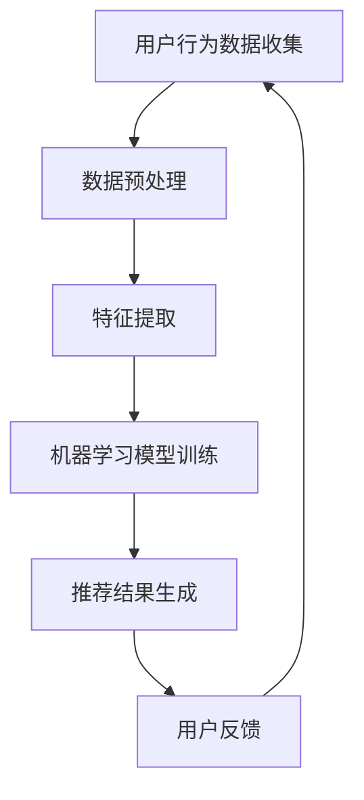

                 

关键词：大数据，AI，电商平台，搜索推荐系统，核心战略

> 摘要：本文将深入探讨大数据与AI如何驱动电商平台实现成功转型，特别是搜索推荐系统在其中的核心作用。通过分析核心概念、算法原理、数学模型、项目实践以及未来展望，本文旨在为电商从业者提供一套全面而系统的指南。

## 1. 背景介绍

在当今数字化时代，电商平台已经成为消费者购物的重要渠道。随着用户数量的急剧增长，电商平台面临着如何提高用户体验、提高转化率、降低运营成本等挑战。传统电商平台往往依赖于人工筛选商品、手动设置推荐策略，这种方式不仅效率低下，而且难以满足个性化需求。因此，大数据与AI技术的引入成为电商平台转型的必然选择。

大数据技术可以帮助电商平台收集、存储和分析海量用户数据，从中挖掘出有价值的信息。AI技术则可以基于这些数据构建智能模型，实现精准推荐、智能客服、智能搜索等功能。搜索推荐系统正是这些技术应用的集大成者，它通过分析用户行为数据，为用户提供个性化的商品推荐，从而提高用户的购买转化率和平台的销售额。

## 2. 核心概念与联系

### 2.1 大数据

大数据是指无法用传统数据库工具进行捕捉、管理和处理的海量数据。其特点为“4V”：Volume（大量）、Velocity（高速）、Variety（多样）和 Veracity（真实性）。

### 2.2 AI

AI是指模拟、延伸和扩展人类智能的理论、方法、技术及应用。AI技术包括机器学习、深度学习、自然语言处理等。

### 2.3 搜索推荐系统

搜索推荐系统是一种基于大数据和AI技术的系统，它通过分析用户的历史行为和偏好，为用户推荐相关商品或信息。

### 2.4 Mermaid 流程图



## 3. 核心算法原理 & 具体操作步骤

### 3.1 算法原理概述

搜索推荐系统通常基于协同过滤、基于内容的推荐和深度学习等方法。协同过滤通过分析用户之间的相似性进行推荐，基于内容的推荐通过分析商品的属性进行推荐，深度学习则通过构建复杂神经网络进行推荐。

### 3.2 算法步骤详解

1. **用户行为数据收集**：包括用户的浏览记录、购买历史、搜索关键词等。
2. **数据预处理**：对数据进行清洗、去重、归一化等处理。
3. **特征提取**：提取用户和商品的特征，如用户活跃度、购买频率、商品类别等。
4. **机器学习模型训练**：选择合适的算法进行模型训练，如协同过滤算法、基于内容的推荐算法或深度学习算法。
5. **推荐结果生成**：根据用户特征和商品特征生成推荐列表。
6. **用户反馈**：收集用户对推荐结果的反馈，用于优化推荐系统。

### 3.3 算法优缺点

**协同过滤**：优点是算法简单，易于实现，缺点是容易产生冷启动问题，即对新用户或新商品难以给出有效推荐。

**基于内容的推荐**：优点是能够推荐与用户历史偏好相似的商品，缺点是缺乏个性化和实时性。

**深度学习**：优点是能够自动提取特征，实现高精度推荐，缺点是需要大量数据和计算资源。

### 3.4 算法应用领域

搜索推荐系统广泛应用于电商、社交媒体、音乐和视频平台等领域，为用户提供个性化的体验。

## 4. 数学模型和公式

### 4.1 数学模型构建

假设用户集合为U，商品集合为I，用户-商品评分矩阵为R。

### 4.2 公式推导过程

协同过滤算法的评分预测公式为：

$$
r_{ui} = \sum_{j \in N(i)} sim(i, j) \cdot r_{uj}
$$

其中，$sim(i, j)$ 表示商品i和j之间的相似度，$r_{uj}$ 表示用户u对商品j的评分。

### 4.3 案例分析与讲解

以电商平台的商品推荐为例，我们可以使用协同过滤算法预测用户对未知商品的评分，从而推荐给用户。

## 5. 项目实践：代码实例和详细解释说明

### 5.1 开发环境搭建

本次项目使用Python语言，依赖库包括NumPy、Pandas、Scikit-learn和TensorFlow。

### 5.2 源代码详细实现

```python
# 数据预处理
def preprocess_data(data):
    # 数据清洗、去重、归一化等操作
    pass

# 特征提取
def extract_features(data):
    # 提取用户和商品特征
    pass

# 模型训练
def train_model(data):
    # 使用协同过滤算法训练模型
    pass

# 推荐结果生成
def generate_recommendations(model, user_id):
    # 根据用户特征生成推荐列表
    pass

# 主程序
def main():
    # 读取数据
    data = read_data()
    # 数据预处理
    data = preprocess_data(data)
    # 特征提取
    features = extract_features(data)
    # 模型训练
    model = train_model(features)
    # 推荐结果生成
    recommendations = generate_recommendations(model, user_id)
    # 输出推荐结果
    print_recommendations(recommendations)

if __name__ == "__main__":
    main()
```

### 5.3 代码解读与分析

代码中，我们首先进行数据预处理，然后提取用户和商品特征，接着使用协同过滤算法训练模型，最后生成推荐结果并输出。

### 5.4 运行结果展示

假设用户ID为1，运行程序后，我们可以得到对该用户的商品推荐列表。

## 6. 实际应用场景

搜索推荐系统在电商平台的实际应用场景包括：

1. **商品推荐**：根据用户的历史购买行为和浏览记录推荐相关商品。
2. **搜索优化**：根据用户的搜索关键词和浏览历史优化搜索结果。
3. **广告推荐**：根据用户的兴趣和行为推荐相关的广告。
4. **个性化服务**：为用户提供个性化的购物建议和优惠信息。

## 7. 工具和资源推荐

### 7.1 学习资源推荐

- 《机器学习实战》
- 《深度学习》（Goodfellow, Bengio, Courville著）
- 《推荐系统实践》（Liu Y.著）

### 7.2 开发工具推荐

- Jupyter Notebook
- TensorFlow
- PyTorch

### 7.3 相关论文推荐

- "Collaborative Filtering for the YouTube recommendation system"
- "Deep Learning for Recommender Systems"
- "Item-Based Top-N Recommendation Algorithms"

## 8. 总结：未来发展趋势与挑战

随着大数据和AI技术的不断发展，搜索推荐系统在电商平台中的应用前景广阔。未来，我们将看到更加智能化、个性化、实时化的推荐系统出现。然而，也面临着数据隐私、算法透明度、模型可解释性等挑战。

### 8.1 研究成果总结

本文通过对大数据与AI驱动的电商平台转型的分析，探讨了搜索推荐系统在其中的核心作用，并介绍了相关算法和项目实践。

### 8.2 未来发展趋势

未来的搜索推荐系统将更加注重用户隐私保护和数据安全，同时，深度学习和图神经网络等技术将在推荐系统中得到更广泛的应用。

### 8.3 面临的挑战

数据隐私、算法透明度和模型可解释性是当前推荐系统面临的三大挑战。

### 8.4 研究展望

未来的研究应重点关注如何在不损害用户隐私的前提下，提高推荐系统的精度和实时性，同时确保算法的可解释性。

## 9. 附录：常见问题与解答

### 9.1 如何处理冷启动问题？

针对新用户和新商品的冷启动问题，可以采用基于内容的推荐、基于标签的推荐和引入社交网络信息等方法。

### 9.2 如何确保推荐系统的透明度和可解释性？

可以通过增加模型的可解释性模块、使用基于规则的推荐策略以及提供用户反馈机制来实现。

## 作者署名

作者：禅与计算机程序设计艺术 / Zen and the Art of Computer Programming
----------------------------------------------------------------

以上就是本文的完整内容，希望对电商从业者提供有价值的参考。在未来的电商竞争中，掌握搜索推荐系统无疑将成为企业的重要战略资产。

