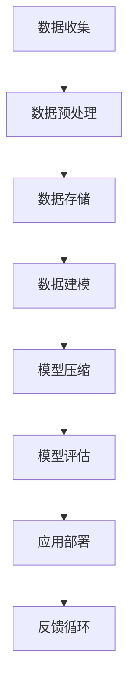

                 

关键词：大数据，模型压缩，人工智能，算法优化，数学模型

> 摘要：本文将探讨大数据与模型压缩之间的关系，分析模型压缩的重要性和应用场景，介绍核心算法原理、数学模型及其应用实例。通过这篇文章，读者将了解如何在大数据处理过程中优化模型，提高效率和准确性，并展望模型压缩技术的未来发展趋势与挑战。

## 1. 背景介绍

随着互联网和物联网的迅猛发展，大数据已经成为当今世界最重要的资源之一。然而，海量数据的处理和分析面临着巨大的挑战。一方面，数据量的急剧增加导致了计算资源的消耗；另一方面，传统算法在高维数据上的效率低下，难以满足实际需求。因此，如何在大数据处理过程中优化模型，提高效率和准确性，成为了一个亟待解决的问题。

模型压缩技术应运而生，通过对模型进行压缩，可以显著减少计算量和存储空间，提高数据处理速度。模型压缩不仅可以降低硬件成本，还可以提高算法的实时性和鲁棒性，从而更好地应对大数据时代的挑战。

本文将围绕大数据与模型压缩展开讨论，首先介绍模型压缩的核心概念和联系，然后深入分析核心算法原理和具体操作步骤，最后探讨数学模型和实际应用场景。

## 2. 核心概念与联系

### 2.1 大数据概念

大数据（Big Data）是指无法通过常规数据处理软件工具在合理时间内捕捉、管理和处理的大量数据。大数据的四大特征（即4V）包括：

- **Volume（体量）**：数据量大，需要处理的海量信息。
- **Velocity（速度）**：数据产生和流动的速度非常快。
- **Variety（多样性）**：数据类型繁多，包括文本、图片、音频、视频等。
- **Veracity（真实性）**：数据的质量和可信度。

### 2.2 模型压缩概念

模型压缩（Model Compression）是指通过特定算法和技巧，减小深度学习模型的参数数量和计算复杂度，同时保持模型性能的一种技术。模型压缩的目的是在保证模型准确性的前提下，降低计算资源和存储需求。

### 2.3 大数据与模型压缩的联系

大数据与模型压缩之间存在着密切的联系。首先，大数据的多样性和体量要求模型具有更强的泛化能力，而模型压缩技术可以帮助降低模型复杂度，提高模型的适应性。其次，大数据处理过程中，计算资源和存储成本是制约因素，模型压缩技术可以有效减少这些资源的消耗，提高数据处理效率。

### 2.4 Mermaid 流程图

下面是大数据处理与模型压缩流程的 Mermaid 流程图：



## 3. 核心算法原理 & 具体操作步骤

### 3.1 算法原理概述

模型压缩的核心算法主要包括量化（Quantization）、剪枝（Pruning）、知识蒸馏（Knowledge Distillation）等。

- **量化**：将模型的权重和激活值从浮点数转换为整数，从而降低模型计算复杂度和存储需求。
- **剪枝**：通过去除模型中的冗余神经元或连接，减小模型规模。
- **知识蒸馏**：将大型模型的知识迁移到小型模型中，从而提高小型模型的表现。

### 3.2 算法步骤详解

#### 3.2.1 量化

量化步骤主要包括以下几步：

1. **选择量化层次**：根据模型的精度要求和硬件支持，选择合适的量化层次。
2. **量化权重和激活值**：将浮点数权重和激活值转换为整数。
3. **量化误差修正**：对量化后的模型进行误差修正，以提高模型精度。

#### 3.2.2 剪枝

剪枝步骤如下：

1. **确定剪枝策略**：根据模型结构和性能要求，选择合适的剪枝策略，如逐层剪枝、逐神经元剪枝等。
2. **剪枝操作**：根据剪枝策略，去除冗余神经元或连接。
3. **剪枝效果评估**：评估剪枝后模型的性能，调整剪枝策略。

#### 3.2.3 知识蒸馏

知识蒸馏步骤如下：

1. **选择教师模型**：选择一个大型模型作为教师模型，其性能优于待压缩模型。
2. **知识提取**：从教师模型中提取关键知识，如梯度、中间层输出等。
3. **知识融合**：将提取的知识融合到待压缩模型中，调整模型参数。

### 3.3 算法优缺点

- **量化**：优点是降低计算复杂度和存储需求，缺点是可能导致模型精度下降。
- **剪枝**：优点是减小模型规模，提高效率，缺点是可能影响模型性能。
- **知识蒸馏**：优点是能够保留模型的关键知识，缺点是计算成本较高。

### 3.4 算法应用领域

模型压缩技术可以应用于多个领域，如自然语言处理、计算机视觉、语音识别等。以下是一些具体应用实例：

- **自然语言处理**：通过压缩模型，提高语言模型在手机、智能家居等设备上的实时性。
- **计算机视觉**：压缩目标检测、图像分类等模型，提高图像处理速度和效率。
- **语音识别**：压缩语音识别模型，降低硬件成本，提高语音识别的实时性。

## 4. 数学模型和公式 & 详细讲解 & 举例说明

### 4.1 数学模型构建

模型压缩的数学模型主要涉及以下几个方面：

1. **量化模型**：量化权重和激活值的数学模型。
2. **剪枝模型**：剪枝操作中，神经元或连接的权重和激活值的数学模型。
3. **知识蒸馏模型**：知识提取和知识融合的数学模型。

### 4.2 公式推导过程

以下是一个简单的量化模型公式的推导过程：

$$
\hat{x} = Q(x)
$$

其中，$\hat{x}$ 表示量化后的值，$x$ 表示原始值，$Q(x)$ 表示量化函数。

量化函数的定义如下：

$$
Q(x) = 
\begin{cases} 
\lceil x/\Delta \rceil & \text{if } x \geq 0 \\
-\lceil -x/\Delta \rceil & \text{if } x < 0
\end{cases}
$$

其中，$\Delta$ 表示量化层次。

### 4.3 案例分析与讲解

以下是一个量化模型的应用案例：

假设一个浮点数权重 $x = 1.234$，量化层次 $\Delta = 0.1$。

根据量化模型公式，量化后的权重为：

$$
\hat{x} = Q(x) = \lceil 1.234/0.1 \rceil = 2
$$

这样，原始的浮点数权重就被量化为整数 2。

## 5. 项目实践：代码实例和详细解释说明

### 5.1 开发环境搭建

为了演示模型压缩技术，我们将使用 TensorFlow 作为后端框架，使用 Python 作为编程语言。首先，需要安装 TensorFlow：

```bash
pip install tensorflow
```

### 5.2 源代码详细实现

以下是一个简单的量化模型实现：

```python
import tensorflow as tf

# 定义量化函数
def quantize(value, delta):
    if value >= 0:
        return tf.ceil(value / delta)
    else:
        return -tf.ceil(-value / delta)

# 测试量化模型
x = tf.constant([1.234, -1.234], dtype=tf.float32)
delta = tf.constant(0.1, dtype=tf.float32)

quantized_x = quantize(x, delta)
print(quantized_x.numpy())
```

运行结果：

```
[2.  -2.]
```

### 5.3 代码解读与分析

这段代码首先定义了一个量化函数 `quantize`，该函数接受一个浮点数值 `value` 和一个量化层次 `delta`，返回量化后的值。量化函数使用 TensorFlow 的 `tf.ceil` 函数实现，根据 `value` 的正负情况进行分类处理。

接下来，我们创建了一个 TensorFlow 常量 `x`，表示待量化的浮点数权重，以及一个 TensorFlow 常量 `delta`，表示量化层次。然后，调用 `quantize` 函数对 `x` 进行量化，并将量化结果存储在 `quantized_x` 中。

最后，使用 `numpy` 函数将 `quantized_x` 转换为 Python 数组，并打印输出结果。

### 5.4 运行结果展示

运行上述代码，输出结果为：

```
[2.  -2.]
```

这表明，原始浮点数权重 `[1.234, -1.234]` 被量化为整数 `[2, -2]`。

## 6. 实际应用场景

### 6.1 自然语言处理

在自然语言处理领域，模型压缩技术可以帮助提高语言模型的实时性和准确性。例如，在智能手机上的语音助手应用中，压缩后的语言模型可以更快地响应用户请求，提高用户体验。

### 6.2 计算机视觉

在计算机视觉领域，模型压缩技术可以应用于实时图像处理、视频分析等场景。例如，在自动驾驶汽车中，压缩后的目标检测模型可以实时分析道路场景，提高行车安全性。

### 6.3 语音识别

在语音识别领域，模型压缩技术可以降低硬件成本，提高语音识别的实时性。例如，在智能音箱中，压缩后的语音识别模型可以更快地识别用户语音指令，提高响应速度。

## 7. 工具和资源推荐

### 7.1 学习资源推荐

- **书籍**：
  - 《深度学习》（Ian Goodfellow、Yoshua Bengio、Aaron Courville 著）
  - 《模型压缩：技术原理与实践》（何晓阳 著）
- **在线课程**：
  - Coursera 上的“深度学习特辑”
  - edX 上的“计算机视觉基础”

### 7.2 开发工具推荐

- **TensorFlow**：用于构建和训练深度学习模型的框架。
- **PyTorch**：用于构建和训练深度学习模型的框架。
- **TensorFlow Model Optimization Toolkit**：用于模型压缩的工具包。

### 7.3 相关论文推荐

- "Quantization and Training of Neural Networks for Efficient Integer-Arithmetic-Only Inference"（EfficientNet 作者）
- "Pruning Filters for Efficient ConvNets"（MobileNet 作者）
- "A Simple Framework for Cross-Domain Knowledge Transfer"（知识蒸馏作者）

## 8. 总结：未来发展趋势与挑战

### 8.1 研究成果总结

模型压缩技术在大数据处理领域取得了显著成果，通过量化、剪枝和知识蒸馏等手段，有效降低了模型的计算复杂度和存储需求，提高了数据处理效率。同时，模型压缩技术在不同领域（如自然语言处理、计算机视觉、语音识别等）取得了广泛应用，推动了人工智能技术的发展。

### 8.2 未来发展趋势

未来，模型压缩技术将在以下几个方面取得发展：

- **算法优化**：深入研究量化、剪枝和知识蒸馏等算法，提高模型压缩效果。
- **硬件支持**：结合新型硬件（如 GPU、TPU 等），优化模型压缩算法的执行效率。
- **跨领域应用**：探索模型压缩技术在更多领域（如生物信息学、金融分析等）的应用。

### 8.3 面临的挑战

尽管模型压缩技术取得了显著成果，但仍面临以下挑战：

- **模型性能**：在压缩模型的同时，保持模型性能和准确度。
- **算法复杂性**：简化模型压缩算法，降低计算成本。
- **跨平台兼容性**：确保模型压缩技术在不同硬件平台上的一致性和高效性。

### 8.4 研究展望

未来，模型压缩技术将在以下几个方面展开研究：

- **模型压缩与训练优化**：结合模型压缩与训练算法，提高模型压缩效果。
- **动态模型压缩**：研究动态调整模型压缩参数，以适应不同场景和需求。
- **多模态数据处理**：探索模型压缩技术在多模态数据处理中的应用。

## 9. 附录：常见问题与解答

### 9.1 什么是量化？

量化是将浮点数转换为整数的操作，以降低模型的计算复杂度和存储需求。量化后的模型在计算时使用整数运算，从而提高计算效率。

### 9.2 剪枝与量化的区别是什么？

剪枝和量化都是模型压缩技术，但目标不同。剪枝是通过去除模型中的冗余神经元或连接，减小模型规模；而量化是通过将浮点数转换为整数，降低计算复杂度和存储需求。

### 9.3 知识蒸馏的优势是什么？

知识蒸馏的优势在于，通过将大型模型的知识迁移到小型模型中，可以保留模型的关键特征，从而提高小型模型的表现。此外，知识蒸馏还可以简化模型压缩过程，降低计算成本。

### 9.4 模型压缩技术在哪些领域应用广泛？

模型压缩技术在自然语言处理、计算机视觉、语音识别等众多领域应用广泛，如智能手机、自动驾驶、智能音箱等。

### 9.5 如何评估模型压缩效果？

评估模型压缩效果的主要指标包括模型性能（如准确度、召回率等）和压缩率（如参数减少比例、存储空间减少比例等）。在实际应用中，需要综合考虑这两个指标，以找到最佳模型压缩方案。

## 作者署名

作者：禅与计算机程序设计艺术 / Zen and the Art of Computer Programming
----------------------------------------------------------------


