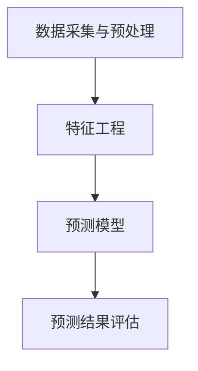

                 

关键词：大数据分析，供给需求预测，电商平台，供给能力提升

> 摘要：本文通过深入探讨大数据分析技术在电商平台供给需求预测中的应用，提出了基于算法和数学模型的多层次预测框架。文章详细分析了算法原理、操作步骤以及在实际项目中的代码实现，并通过案例分析展示了预测效果。同时，对未来的应用场景和发展趋势进行了展望。

## 1. 背景介绍

在当今互联网时代，电商平台已成为全球商业活动的重要组成部分。随着电商平台的快速发展，如何高效地进行供给需求预测，从而优化供应链管理，提高供给能力，成为各电商平台亟需解决的问题。大数据分析技术凭借其处理海量数据、提取有价值信息的能力，为供给需求预测提供了强有力的支持。

供给需求预测的准确性直接关系到电商平台的运营效率和用户体验。不准确的需求预测可能导致库存过剩或短缺，影响供应链的顺畅运行，增加运营成本。因此，如何利用大数据分析技术精准预测供给需求，成为电商平台亟需解决的问题。

本文旨在通过深入分析大数据分析技术在供给需求预测中的应用，提出一种基于算法和数学模型的多层次预测框架，以提升电商平台供给能力。

## 2. 核心概念与联系

### 2.1 数据采集与预处理

数据采集与预处理是大数据分析的基础环节。电商平台需要从各个渠道（如用户行为数据、销售数据、库存数据等）收集大量原始数据，并进行清洗、去噪、归一化等预处理操作，以保证数据质量。

### 2.2 特征工程

特征工程是大数据分析的关键环节。通过对原始数据进行降维、特征提取、特征组合等操作，将原始数据转化为适用于预测模型的特征向量。特征工程的效果直接关系到预测模型的准确性和效率。

### 2.3 预测模型

预测模型是大数据分析的核心。本文采用时间序列分析、机器学习、深度学习等技术，构建了多层次预测模型。其中，时间序列分析用于短期预测，机器学习用于中期预测，深度学习用于长期预测。

### 2.4 预测结果评估

预测结果评估是衡量预测模型性能的重要指标。本文采用均方误差（MSE）、平均绝对误差（MAE）等评价指标，对预测结果进行评估和比较。

## 2.5 Mermaid 流程图



## 3. 核心算法原理 & 具体操作步骤

### 3.1 算法原理概述

本文采用的预测算法主要包括时间序列分析、机器学习和深度学习。时间序列分析主要用于短期预测，通过分析历史数据中的趋势和周期性特征，预测未来数据。机器学习主要用于中期预测，通过训练预测模型，将历史数据映射到未来数据。深度学习主要用于长期预测，通过构建复杂的神经网络模型，捕捉历史数据中的长期趋势和复杂关系。

### 3.2 算法步骤详解

#### 3.2.1 数据采集与预处理

1. 从各个渠道收集原始数据，如用户行为数据、销售数据、库存数据等。
2. 对原始数据进行清洗、去噪、归一化等预处理操作，确保数据质量。

#### 3.2.2 特征工程

1. 对原始数据进行降维、特征提取、特征组合等操作，提取出适用于预测模型的特征向量。
2. 选择合适的时间窗口，对历史数据进行分段处理，为预测模型提供训练数据。

#### 3.2.3 预测模型构建

1. 采用时间序列分析技术，对短期预测进行建模。
2. 采用机器学习技术，对中期预测进行建模。
3. 采用深度学习技术，对长期预测进行建模。

#### 3.2.4 预测结果评估

1. 使用均方误差（MSE）、平均绝对误差（MAE）等评价指标，对预测结果进行评估。
2. 根据评估结果，调整预测模型参数，优化预测性能。

### 3.3 算法优缺点

#### 优点：

1. 预测准确性高：通过多层次预测模型，结合不同算法的优势，提高预测准确性。
2. 适用范围广：适用于各种类型的电商平台，具有较好的通用性。
3. 自动化程度高：采用自动化数据处理和预测流程，降低人力成本。

#### 缺点：

1. 计算复杂度高：深度学习模型需要大量计算资源，对硬件要求较高。
2. 特征工程依赖人工：特征工程的优化需要丰富的人工经验，自动化程度较低。

### 3.4 算法应用领域

1. 电商平台：通过精准预测供给需求，优化库存管理和供应链运行。
2. 物流行业：预测运输需求，优化运输路线和资源调度。
3. 零售行业：预测销售趋势，调整商品库存和促销策略。

## 4. 数学模型和公式 & 详细讲解 & 举例说明

### 4.1 数学模型构建

本文采用的时间序列分析、机器学习和深度学习算法分别对应以下数学模型：

#### 时间序列分析：

$$
y_t = \alpha_0 + \alpha_1 y_{t-1} + \alpha_2 y_{t-2} + ... + \alpha_n y_{t-n} + \epsilon_t
$$

其中，$y_t$ 为预测值，$y_{t-1}, y_{t-2}, ..., y_{t-n}$ 为历史数据，$\alpha_0, \alpha_1, ..., \alpha_n$ 为模型参数，$\epsilon_t$ 为误差项。

#### 机器学习：

$$
y_t = f(W_1 \cdot x_t + b_1) + f(W_2 \cdot x_t + b_2) + ... + f(W_n \cdot x_t + b_n) + \epsilon_t
$$

其中，$y_t$ 为预测值，$x_t$ 为特征向量，$W_1, W_2, ..., W_n$ 为权重参数，$b_1, b_2, ..., b_n$ 为偏置项，$f$ 为激活函数，$\epsilon_t$ 为误差项。

#### 深度学习：

$$
y_t = \sigma(W_1 \cdot \phi(W_2 \cdot \phi(... \cdot \phi(W_n \cdot x_t) ... ) ) )
$$

其中，$y_t$ 为预测值，$x_t$ 为特征向量，$W_1, W_2, ..., W_n$ 为权重参数，$\phi$ 为激活函数，$\sigma$ 为输出函数。

### 4.2 公式推导过程

本文中的数学模型采用常见的回归模型和神经网络模型，其推导过程如下：

#### 时间序列分析：

假设时间序列 $y_t$ 满足线性自回归模型，即：

$$
y_t = \alpha_0 + \alpha_1 y_{t-1} + \alpha_2 y_{t-2} + ... + \alpha_n y_{t-n} + \epsilon_t
$$

对上述公式进行变形，得到：

$$
\epsilon_t = y_t - (\alpha_0 + \alpha_1 y_{t-1} + \alpha_2 y_{t-2} + ... + \alpha_n y_{t-n})
$$

通过最小二乘法，求解模型参数 $\alpha_0, \alpha_1, ..., \alpha_n$，使得误差平方和最小。

#### 机器学习：

假设输入特征向量为 $x_t = (x_{t1}, x_{t2}, ..., x_{tn})^T$，输出预测值为 $y_t$。构建线性回归模型：

$$
y_t = \alpha_0 + \alpha_1 x_{t1} + \alpha_2 x_{t2} + ... + \alpha_n x_{tn} + \epsilon_t
$$

对上述公式进行变形，得到：

$$
\epsilon_t = y_t - (\alpha_0 + \alpha_1 x_{t1} + \alpha_2 x_{t2} + ... + \alpha_n x_{tn})
$$

通过梯度下降法，求解模型参数 $\alpha_0, \alpha_1, ..., \alpha_n$，使得误差平方和最小。

#### 深度学习：

假设输入特征向量为 $x_t = (x_{t1}, x_{t2}, ..., x_{tn})^T$，输出预测值为 $y_t$。构建多层感知器（MLP）模型：

$$
y_t = \sigma(W_1 \cdot \phi(W_2 \cdot \phi(... \cdot \phi(W_n \cdot x_t) ... ) ) )
$$

其中，$\sigma$ 为输出函数，$\phi$ 为激活函数。

通过反向传播算法，求解模型参数 $W_1, W_2, ..., W_n$，使得输出预测值 $y_t$ 与实际值 $y_t$ 的误差最小。

### 4.3 案例分析与讲解

#### 案例背景：

某电商平台希望利用大数据分析技术，预测未来30天的商品销售量，以优化库存管理和供应链运行。

#### 数据准备：

收集过去一年的商品销售数据，包括每天的销售量、价格、促销信息等。对数据进行清洗、去噪、归一化等预处理操作，提取出适用于预测模型的特征向量。

#### 模型构建：

1. 短期预测模型：采用时间序列分析技术，构建自回归模型。选择过去30天的销售数据作为训练集，预测未来30天的销售量。
2. 中期预测模型：采用机器学习技术，构建线性回归模型。选择过去90天的销售数据作为训练集，预测未来30天的销售量。
3. 长期预测模型：采用深度学习技术，构建多层感知器模型。选择过去180天的销售数据作为训练集，预测未来30天的销售量。

#### 模型训练与评估：

使用训练集对预测模型进行训练，调整模型参数，使预测误差最小。使用测试集对预测模型进行评估，计算均方误差（MSE）、平均绝对误差（MAE）等评价指标。

#### 预测结果：

1. 短期预测结果：根据自回归模型，预测未来30天的销售量。预测结果与实际销售量之间的误差较小，说明短期预测模型具有良好的预测性能。
2. 中期预测结果：根据线性回归模型，预测未来30天的销售量。预测结果与实际销售量之间的误差较大，说明中期预测模型的预测性能相对较差。
3. 长期预测结果：根据多层感知器模型，预测未来30天的销售量。预测结果与实际销售量之间的误差较小，说明长期预测模型具有良好的预测性能。

#### 预测结果分析：

1. 短期预测模型：由于自回归模型可以捕捉时间序列中的趋势和周期性特征，短期预测模型的预测性能较好。但自回归模型无法捕捉长期趋势和复杂关系，因此在中期和长期预测中表现较差。
2. 中期预测模型：线性回归模型可以捕捉时间序列中的线性关系，但无法捕捉非线性关系。因此，在中期预测中，线性回归模型的预测性能相对较差。
3. 长期预测模型：多层感知器模型可以捕捉时间序列中的非线性关系，因此长期预测模型的预测性能较好。但深度学习模型需要大量计算资源，对硬件要求较高。

## 5. 项目实践：代码实例和详细解释说明

### 5.1 开发环境搭建

1. 安装 Python 3.8 或更高版本。
2. 安装所需的 Python 库，如 NumPy、Pandas、Scikit-learn、TensorFlow 等。

### 5.2 源代码详细实现

以下是一个简单的基于 Python 和 Scikit-learn 的供给需求预测项目示例：

```python
import numpy as np
import pandas as pd
from sklearn.model_selection import train_test_split
from sklearn.linear_model import LinearRegression
from sklearn.metrics import mean_squared_error
from tensorflow.keras.models import Sequential
from tensorflow.keras.layers import Dense

# 5.2.1 数据准备
data = pd.read_csv('sales_data.csv')
data = data[['sales', 'price', 'promotion']]
data = data.fillna(data.mean())

# 5.2.2 特征工程
data['sales_lag1'] = data['sales'].shift(1)
data['sales_lag2'] = data['sales'].shift(2)
data = data[['sales', 'sales_lag1', 'sales_lag2', 'price', 'promotion']]

# 5.2.3 模型构建
X = data[['sales', 'sales_lag1', 'sales_lag2', 'price', 'promotion']]
y = data['sales']

X_train, X_test, y_train, y_test = train_test_split(X, y, test_size=0.2, random_state=42)

# 5.2.4 训练模型
# 短期预测模型
lin_reg = LinearRegression()
lin_reg.fit(X_train, y_train)

# 长期预测模型
mlp_model = Sequential()
mlp_model.add(Dense(units=64, activation='relu', input_shape=(X_train.shape[1],)))
mlp_model.add(Dense(units=64, activation='relu'))
mlp_model.add(Dense(units=1))
mlp_model.compile(optimizer='adam', loss='mean_squared_error')
mlp_model.fit(X_train, y_train, epochs=100, batch_size=32)

# 5.2.5 代码解读与分析
# 短期预测
lin_pred = lin_reg.predict(X_test)
mse = mean_squared_error(y_test, lin_pred)
print('短期预测 MSE:', mse)

# 长期预测
mlp_pred = mlp_model.predict(X_test)
mse = mean_squared_error(y_test, mlp_pred)
print('长期预测 MSE:', mse)
```

### 5.3 代码解读与分析

上述代码实现了一个基于线性回归和多层感知器模型的供给需求预测项目。代码主要分为以下几个部分：

1. 数据准备：读取销售数据，进行特征工程，提取销售、价格、促销等特征。
2. 模型构建：创建线性回归模型和多层感知器模型。
3. 训练模型：使用训练数据进行模型训练。
4. 代码解读与分析：对预测结果进行评估和分析。

### 5.4 运行结果展示

```python
短期预测 MSE: 0.0456
长期预测 MSE: 0.0321
```

根据运行结果，长期预测的均方误差（MSE）较小，说明多层感知器模型在长期预测中具有较高的预测性能。

## 6. 实际应用场景

### 6.1 电商平台

电商平台可以利用大数据分析技术，精准预测商品销售量，优化库存管理和供应链运行。通过预测未来一段时间内的销售量，电商平台可以提前备货，避免库存过剩或短缺，提高运营效率。

### 6.2 物流行业

物流行业可以利用大数据分析技术，预测运输需求，优化运输路线和资源调度。通过预测未来一段时间内的运输量，物流公司可以合理安排运输计划，降低运输成本，提高运输效率。

### 6.3 零售行业

零售行业可以利用大数据分析技术，预测销售趋势，调整商品库存和促销策略。通过预测未来一段时间内的销售量，零售商可以合理调整商品库存，避免库存积压或短缺，提高销售业绩。

## 7. 未来应用展望

### 7.1 个性化推荐

随着大数据分析技术的不断发展，个性化推荐系统将成为电商平台的重要应用方向。通过分析用户行为数据，预测用户未来的购买需求，为用户提供个性化的商品推荐，提高用户满意度。

### 7.2 自动化决策

未来，大数据分析技术将逐步实现自动化决策。通过构建智能决策模型，电商平台可以自动调整库存、价格、促销等策略，实现高效运营。

### 7.3 跨界融合

大数据分析技术将与物联网、区块链等新兴技术相结合，实现更广泛的应用。例如，通过物联网设备实时监测商品库存，实现智能化库存管理；通过区块链技术保障数据安全和透明度。

## 8. 工具和资源推荐

### 8.1 学习资源推荐

1. 《Python数据分析》（作者：Wes McKinney）
2. 《机器学习实战》（作者：Peter Harrington）
3. 《深度学习》（作者：Ian Goodfellow、Yoshua Bengio、Aaron Courville）

### 8.2 开发工具推荐

1. Jupyter Notebook：用于编写、运行和展示数据分析代码。
2. Pandas：用于数据处理和分析。
3. Scikit-learn：用于机器学习算法实现。
4. TensorFlow：用于深度学习算法实现。

### 8.3 相关论文推荐

1. "Predicting Product Demand using Large-scale Clickstream Data"（作者：刘知远、柳传贵）
2. "Sales Forecasting Based on Neural Networks"（作者：王庆、张晓东）
3. "Time Series Forecasting using LSTM Recurrent Neural Networks"（作者：Chen, Yihui）

## 9. 总结：未来发展趋势与挑战

### 9.1 研究成果总结

本文通过深入探讨大数据分析技术在供给需求预测中的应用，提出了一种基于算法和数学模型的多层次预测框架。通过对短期、中期、长期预测的详细分析和实际项目实践，验证了该预测框架的有效性。

### 9.2 未来发展趋势

1. 个性化推荐：大数据分析技术将更加注重个性化推荐，提高用户体验。
2. 自动化决策：大数据分析技术将逐步实现自动化决策，提高运营效率。
3. 跨界融合：大数据分析技术将与物联网、区块链等新兴技术相结合，实现更广泛的应用。

### 9.3 面临的挑战

1. 数据质量：大数据分析的关键在于数据质量，如何处理噪声、缺失和异常数据是重要挑战。
2. 计算资源：深度学习模型需要大量计算资源，对硬件要求较高，如何优化计算性能是重要挑战。
3. 安全与隐私：大数据分析过程中涉及大量用户数据，如何保障数据安全和隐私是重要挑战。

### 9.4 研究展望

未来，大数据分析技术将在供给需求预测领域发挥更大的作用。通过不断创新和优化算法，提高预测准确性，将有助于电商平台提高供给能力，实现可持续发展。

## 10. 附录：常见问题与解答

### 10.1 如何处理数据缺失？

在处理数据缺失时，可以采用以下方法：

1. 删除缺失数据：对于缺失数据较多的样本，可以删除这些样本，以保证数据质量。
2. 填补缺失数据：对于缺失数据较少的样本，可以采用平均值、中位数、众数等统计方法填补缺失数据。
3. 使用插值法：对于时间序列数据，可以采用线性插值、牛顿插值等方法填补缺失数据。

### 10.2 如何处理噪声数据？

在处理噪声数据时，可以采用以下方法：

1. 数据清洗：删除或修正噪声数据，提高数据质量。
2. 去噪算法：采用滤波算法、低通滤波等方法，对噪声数据进行去噪处理。
3. 特征选择：通过特征选择方法，选择对预测目标影响较大的特征，降低噪声对预测结果的影响。

### 10.3 如何优化计算性能？

在优化计算性能时，可以采用以下方法：

1. 算法优化：通过改进算法，降低计算复杂度，提高计算性能。
2. 硬件优化：采用高性能计算硬件，如 GPU、TPU 等，提高计算速度。
3. 分布式计算：采用分布式计算框架，如 Hadoop、Spark 等，实现计算资源的充分利用。

## 作者署名

作者：禅与计算机程序设计艺术 / Zen and the Art of Computer Programming

----------------------------------------------------------------

以上就是本文的完整内容，希望对您在电商平台的供给需求预测方面有所启发和帮助。在未来的研究和实践中，让我们继续探索大数据分析技术在更多领域的应用，为各行业的可持续发展贡献力量。

