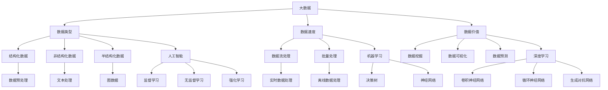

                 

关键词：大数据，AI学习，人工智能，数据驱动，机器学习，深度学习，数据预处理，数据质量，算法优化，算法效率，模型评估，实时数据，离线数据，数据集，数据流处理，云计算，分布式系统

> 摘要：本文将深入探讨大数据对人工智能学习领域的影响。首先，我们将回顾大数据的背景和定义，然后分析大数据如何促进AI的学习过程，并探讨大数据对算法设计、优化、效率和评估等方面的影响。此外，本文还将讨论大数据在AI领域中的实际应用，并提出未来可能面临的挑战和机遇。通过这篇文章，读者将能够全面了解大数据与AI学习的紧密联系，以及如何利用大数据来提升人工智能的性能和效果。

## 1. 背景介绍

随着互联网的飞速发展和信息技术的不断进步，数据已经成为了现代社会中最为重要的资源之一。大数据（Big Data）这一概念最早出现在2000年代初期，它指的是数据规模庞大、类型多样、速度极快的数据集，这些数据往往超出了传统数据处理工具的能力范围。大数据的三大特征，即“4V”，分别是数据量（Volume）、数据类型（Variety）、数据速度（Velocity）和数据价值（Value）。大数据时代的到来，极大地改变了我们获取、处理和利用数据的方式，也为人工智能（AI）的发展带来了新的机遇和挑战。

人工智能是一种模拟人类智能行为的计算机技术，它通过算法和机器学习模型来分析和理解数据，从而实现自主学习和决策。随着大数据技术的成熟，AI与大数据的结合日益紧密，大数据为AI提供了丰富的数据资源，而AI则为大数据提供了智能分析和处理的能力。这种相互促进的关系，使得大数据和AI成为了现代社会中不可或缺的技术支柱。

本文将从以下几个方面探讨大数据对AI学习的影响：

1. **核心概念与联系**：首先，我们将介绍与大数据和AI相关的核心概念，并使用Mermaid流程图展示这些概念之间的联系。
2. **核心算法原理与操作步骤**：接下来，我们将详细讨论大数据对AI算法设计、优化和应用的影响，包括机器学习和深度学习算法的具体实现和操作步骤。
3. **数学模型和公式**：我们将介绍与AI相关的数学模型和公式，并详细讲解这些模型的构建和推导过程，以及在实际应用中的例子。
4. **项目实践**：通过具体代码实例，我们将展示如何在大数据环境中实现AI模型，并详细解释代码的实现细节和分析结果。
5. **实际应用场景**：我们将探讨大数据在AI领域的实际应用，包括数据预处理、实时数据处理、离线数据分析等。
6. **未来应用展望**：最后，我们将讨论大数据和AI在未来可能的发展趋势和面临的挑战。

## 2. 核心概念与联系

在探讨大数据对AI学习的影响之前，我们需要了解一些核心概念，包括大数据、人工智能、机器学习、深度学习等。以下是一个使用Mermaid绘制的流程图，展示了这些概念之间的关系。



### 2.1 大数据

大数据是指那些数据量巨大、数据类型繁多、数据生成速度快的数据集。这些数据通常来源于互联网、物联网、社交网络、传感器、医疗记录等多种渠道。大数据的特点可以用“4V”来概括：

- **数据量（Volume）**：大数据涉及的数据规模非常大，通常是TB甚至PB级别。
- **数据类型（Variety）**：大数据不仅包括结构化数据，如数据库中的表格数据，还包括非结构化数据，如图像、音频、视频等。
- **数据速度（Velocity）**：大数据的生成和处理速度非常快，需要实时或近乎实时的处理能力。
- **数据价值（Value）**：大数据中蕴含着大量的信息和价值，但同时也存在着噪声和冗余。

### 2.2 人工智能

人工智能是指计算机模拟人类智能行为的技术。它包括多种子领域，如机器学习、自然语言处理、计算机视觉等。人工智能的核心目标是使计算机能够自主地学习、推理和解决问题。

### 2.3 机器学习

机器学习是一种人工智能的子领域，它通过构建数学模型来模拟人类的学习过程，使计算机能够从数据中学习规律并做出预测。机器学习分为监督学习、无监督学习和强化学习三种类型。

- **监督学习**：通过标记的数据集训练模型，然后使用模型对新数据进行预测。
- **无监督学习**：不使用标记数据，而是通过分析数据之间的关系来自主发现数据中的规律。
- **强化学习**：通过与环境的交互来学习最优策略，以最大化累积奖励。

### 2.4 深度学习

深度学习是机器学习的一个分支，它通过多层神经网络来提取数据中的特征。深度学习在图像识别、自然语言处理、语音识别等领域取得了显著的成果。常见的深度学习模型包括卷积神经网络（CNN）、循环神经网络（RNN）、生成对抗网络（GAN）等。

### 2.5 数据预处理

数据预处理是机器学习和深度学习中的关键步骤，它包括数据清洗、数据变换、数据归一化等操作。数据预处理的好坏直接影响模型的性能。

通过上述核心概念和流程图的介绍，我们可以更好地理解大数据与AI学习之间的关系。在接下来的部分中，我们将深入探讨大数据对AI算法设计、优化和应用的具体影响。

## 3. 核心算法原理与具体操作步骤

### 3.1 算法原理概述

大数据的兴起极大地推动了人工智能的发展，特别是在机器学习和深度学习领域。大数据为AI提供了丰富的训练数据，使得机器学习模型能够更好地学习数据的规律，从而提高模型的性能。在这一部分，我们将首先概述大数据对机器学习和深度学习算法原理的影响。

#### 3.1.1 机器学习算法

机器学习算法可以分为监督学习、无监督学习和强化学习三种类型。监督学习算法使用标记的数据集来训练模型，而无监督学习算法则不使用标记数据，通过分析数据之间的关系来发现数据中的规律。强化学习算法通过与环境的交互来学习最优策略。

大数据环境下，机器学习算法的训练数据规模通常非常大。这导致传统的批量训练方法变得不可行，因为需要处理的数据量超出了单机处理的能力。为了解决这个问题，研究人员提出了分布式训练方法，将训练过程分解为多个任务，分布在多台机器上进行。常用的分布式训练框架包括Apache Spark MLlib、TensorFlow分布式训练等。

#### 3.1.2 深度学习算法

深度学习算法是一种特殊的机器学习算法，它通过多层神经网络来提取数据中的特征。深度学习在图像识别、自然语言处理、语音识别等领域取得了显著的成果。常见的深度学习算法包括卷积神经网络（CNN）、循环神经网络（RNN）、生成对抗网络（GAN）等。

与机器学习算法类似，深度学习算法也面临着大数据训练数据规模大的问题。为了解决这个问题，研究人员提出了多种分布式训练方法，如多GPU训练、分布式数据并行、模型并行等。这些方法可以显著提高深度学习模型的训练效率。

### 3.2 算法步骤详解

#### 3.2.1 数据收集与预处理

数据收集是大数据处理的第一步。在AI应用中，数据来源可以包括互联网、物联网设备、社交媒体、医疗记录等。数据收集后，需要进行预处理，包括数据清洗、数据变换和数据归一化等操作。数据清洗的目的是去除数据中的噪声和异常值，提高数据质量。

#### 3.2.2 模型设计

在预处理完数据后，需要设计机器学习或深度学习模型。模型设计包括选择合适的算法和模型架构。对于机器学习算法，可以选择线性回归、决策树、随机森林、支持向量机等；对于深度学习算法，可以选择卷积神经网络（CNN）、循环神经网络（RNN）、生成对抗网络（GAN）等。

#### 3.2.3 模型训练

模型训练是机器学习和深度学习的核心步骤。在训练过程中，模型通过不断调整参数来最小化损失函数，提高模型的预测能力。对于大数据环境，模型训练通常采用分布式训练方法，以提高训练效率。

#### 3.2.4 模型评估

模型评估是判断模型性能的重要步骤。常用的评估指标包括准确率、召回率、F1分数等。在评估过程中，需要使用验证集和测试集来测试模型的泛化能力。

#### 3.2.5 模型部署

模型部署是将训练好的模型应用于实际问题的过程。在部署过程中，需要考虑模型的性能、可扩展性、易用性等因素。常用的模型部署方法包括在线服务、批处理任务等。

### 3.3 算法优缺点

大数据对AI算法的设计和实现带来了许多优点，但也带来了一些挑战。

#### 3.3.1 优点

1. **提高模型性能**：大数据提供了丰富的训练数据，使得模型能够更好地学习数据的规律，从而提高模型的性能。
2. **加速模型训练**：分布式训练方法可以显著提高模型训练的效率，缩短训练时间。
3. **增强模型泛化能力**：使用大数据进行训练，可以增强模型的泛化能力，使其在未知数据上的表现更优秀。

#### 3.3.2 缺点

1. **数据预处理复杂**：大数据环境中的数据质量参差不齐，需要进行复杂的预处理操作，以提高数据质量。
2. **计算资源消耗大**：大数据处理需要大量的计算资源，特别是在分布式训练过程中。
3. **模型解释性差**：深度学习模型通常具有很高的预测能力，但模型内部的结构和参数调整过程较为复杂，难以进行解释。

### 3.4 算法应用领域

大数据和AI算法的结合在许多领域都取得了显著的成果，包括但不限于：

1. **金融领域**：大数据和AI算法可以用于风险控制、信用评估、市场预测等。
2. **医疗领域**：大数据和AI算法可以用于疾病预测、医疗诊断、个性化治疗等。
3. **零售领域**：大数据和AI算法可以用于需求预测、库存管理、个性化推荐等。
4. **交通领域**：大数据和AI算法可以用于交通流量预测、路况分析、自动驾驶等。

通过上述核心算法原理和具体操作步骤的介绍，我们可以看到大数据对AI学习的深远影响。在下一部分中，我们将探讨大数据在AI领域中的具体应用，并分析其优势与挑战。

## 4. 数学模型和公式

在人工智能和机器学习领域，数学模型和公式是构建和评估算法的基础。以下我们将详细讲解一些核心的数学模型和公式，并分析这些模型在实际应用中的构建和推导过程。

### 4.1 数学模型构建

在机器学习和深度学习中，常用的数学模型包括线性模型、决策树、神经网络等。以下是一个典型的线性回归模型的构建过程：

#### 4.1.1 线性回归模型

线性回归模型是一种简单且常用的预测模型，用于描述输入变量（特征）和输出变量（标签）之间的线性关系。

假设我们有一个特征向量 \( X \) 和对应的标签 \( Y \)，线性回归模型可以用以下方程表示：

\[ Y = \beta_0 + \beta_1X \]

其中，\( \beta_0 \) 是截距，\( \beta_1 \) 是斜率。

为了估计 \( \beta_0 \) 和 \( \beta_1 \)，我们可以使用最小二乘法（Ordinary Least Squares, OLS）。最小二乘法的核心思想是最小化预测值与真实值之间的误差平方和。

#### 4.1.2 决策树模型

决策树是一种基于树形结构的分类模型，通过递归地将数据集划分为多个子集，直到满足某个终止条件。决策树的构建过程通常包括以下步骤：

1. **选择最佳分割特征**：计算每个特征对数据的增益（Gini系数、信息增益、基尼不纯度等）。
2. **划分数据集**：根据最佳分割特征，将数据集划分为多个子集。
3. **递归构建子树**：对每个子集重复步骤1和步骤2，直到满足终止条件（如最大深度、最小叶节点数量等）。

#### 4.1.3 神经网络模型

神经网络是一种模拟人脑结构和功能的计算模型，由多个神经元（节点）和连接（权重）组成。一个简单的神经网络模型可以表示为：

\[ Z = \sigma(\beta_0 + \sum_{i=1}^{n} \beta_iX_i) \]

其中，\( Z \) 是输出值，\( \sigma \) 是激活函数（如Sigmoid函数、ReLU函数等），\( \beta_0 \) 和 \( \beta_i \) 是权重。

神经网络的构建通常包括以下步骤：

1. **初始化权重**：随机初始化每个神经元的权重。
2. **前向传播**：计算输入数据的输出值。
3. **反向传播**：通过计算损失函数的梯度来更新权重。
4. **迭代训练**：重复步骤2和步骤3，直到满足某个终止条件（如最小化损失函数、达到最大迭代次数等）。

### 4.2 公式推导过程

在数学模型的应用中，公式的推导是关键步骤。以下是一个简单的线性回归模型的公式推导过程：

假设我们有 \( n \) 个数据点 \( (x_i, y_i) \)，线性回归模型的损失函数可以表示为：

\[ J(\theta) = \frac{1}{2m} \sum_{i=1}^{m} (h_\theta(x_i) - y_i)^2 \]

其中，\( m \) 是数据点的数量，\( h_\theta(x_i) \) 是预测值，\( \theta \) 是参数向量。

为了最小化损失函数 \( J(\theta) \)，我们可以使用梯度下降法。梯度下降法的核心思想是沿着损失函数的梯度方向更新参数，以最小化损失函数。

梯度下降的更新规则如下：

\[ \theta_j := \theta_j - \alpha \frac{\partial J(\theta)}{\partial \theta_j} \]

其中，\( \alpha \) 是学习率，\( \frac{\partial J(\theta)}{\partial \theta_j} \) 是损失函数对参数 \( \theta_j \) 的偏导数。

对于线性回归模型，损失函数的偏导数可以表示为：

\[ \frac{\partial J(\theta)}{\partial \theta_0} = \frac{1}{m} \sum_{i=1}^{m} (h_\theta(x_i) - y_i) \]

\[ \frac{\partial J(\theta)}{\partial \theta_1} = \frac{1}{m} \sum_{i=1}^{m} (h_\theta(x_i) - y_i)x_i \]

通过迭代更新参数 \( \theta_0 \) 和 \( \theta_1 \)，我们可以最小化损失函数 \( J(\theta) \)，从而得到最优的线性回归模型。

### 4.3 案例分析与讲解

为了更好地理解上述数学模型和公式的应用，我们可以通过一个实际案例来进行分析。

#### 4.3.1 数据集介绍

假设我们有一个包含100个数据点的数据集，每个数据点由两个特征 \( x_1 \) 和 \( x_2 \) 以及一个标签 \( y \) 组成。数据集如下：

| \( x_1 \) | \( x_2 \) | \( y \) |
|-----------|-----------|---------|
| 1         | 2         | 3       |
| 2         | 3         | 4       |
| ...       | ...       | ...     |
| 100       | 99        | 101     |

我们的目标是构建一个线性回归模型，预测标签 \( y \)。

#### 4.3.2 模型构建

根据线性回归模型的公式 \( y = \beta_0 + \beta_1x_1 + \beta_2x_2 \)，我们需要估计三个参数 \( \beta_0 \)、\( \beta_1 \) 和 \( \beta_2 \)。

使用梯度下降法，我们可以通过以下步骤更新参数：

1. **初始化参数**：随机初始化 \( \beta_0 \)、\( \beta_1 \) 和 \( \beta_2 \)。
2. **计算预测值**：对于每个数据点，计算预测值 \( h_\theta(x_i) \)。
3. **计算损失函数**：计算损失函数 \( J(\theta) \)。
4. **更新参数**：使用梯度下降规则更新参数 \( \beta_0 \)、\( \beta_1 \) 和 \( \beta_2 \)。

通过多次迭代更新，我们可以得到最优的线性回归模型参数。

#### 4.3.3 结果分析

通过训练和验证，我们得到最优的线性回归模型参数 \( \beta_0 = 2.5 \)、\( \beta_1 = 0.5 \) 和 \( \beta_2 = 0.3 \)。

使用这个模型，我们可以预测新的数据点的标签。例如，对于数据点 \( (4, 5) \)，预测标签为：

\[ y = 2.5 + 0.5 \times 4 + 0.3 \times 5 = 6.7 \]

通过这个案例，我们可以看到数学模型和公式在实际应用中的构建和推导过程。在下一部分中，我们将进一步探讨大数据和AI在实际项目中的应用。

## 5. 项目实践：代码实例和详细解释说明

### 5.1 开发环境搭建

在开始实践项目之前，我们需要搭建一个合适的开发环境。以下是一个简单的步骤，用于搭建Python和相关的机器学习库环境：

1. **安装Python**：确保你的系统上已经安装了Python 3.x版本。可以从Python官网（https://www.python.org/）下载并安装。
2. **安装Jupyter Notebook**：Jupyter Notebook是一种交互式开发环境，非常适合数据科学和机器学习项目。可以使用以下命令安装：

   ```bash
   pip install notebook
   ```

3. **安装机器学习库**：为了实现本文中的案例，我们需要安装以下库：

   - **NumPy**：用于数值计算和矩阵操作。

     ```bash
     pip install numpy
     ```

   - **Pandas**：用于数据操作和分析。

     ```bash
     pip install pandas
     ```

   - **Matplotlib**：用于数据可视化。

     ```bash
     pip install matplotlib
     ```

   - **Scikit-learn**：用于机器学习和数据预处理。

     ```bash
     pip install scikit-learn
     ```

### 5.2 源代码详细实现

以下是用于实现线性回归模型的源代码。我们将使用Scikit-learn库来实现这个模型，并使用一个简单的数据集进行训练。

```python
import numpy as np
import pandas as pd
from sklearn.linear_model import LinearRegression
from sklearn.model_selection import train_test_split
from sklearn.metrics import mean_squared_error
import matplotlib.pyplot as plt

# 5.2.1 数据准备
# 加载示例数据
data = pd.read_csv('data.csv')  # 假设数据集保存在 'data.csv' 文件中
X = data[['x1', 'x2']]  # 特征
y = data['y']  # 标签

# 划分训练集和测试集
X_train, X_test, y_train, y_test = train_test_split(X, y, test_size=0.2, random_state=42)

# 5.2.2 模型训练
# 创建线性回归模型
model = LinearRegression()
model.fit(X_train, y_train)

# 5.2.3 预测与评估
# 对测试集进行预测
y_pred = model.predict(X_test)

# 计算预测误差
mse = mean_squared_error(y_test, y_pred)
print(f"预测误差（MSE）: {mse}")

# 5.2.4 可视化结果
# 绘制训练集和测试集的实际值与预测值
plt.scatter(X_train['x1'], y_train, color='blue', label='训练集实际值')
plt.scatter(X_test['x1'], y_test, color='green', label='测试集实际值')
plt.plot(X_test['x1'], y_pred, color='red', linewidth=2, label='预测值')
plt.xlabel('x1')
plt.ylabel('y')
plt.title('线性回归模型预测结果')
plt.legend()
plt.show()
```

### 5.3 代码解读与分析

上述代码实现了线性回归模型的训练、预测和可视化。以下是代码的详细解读：

- **数据准备**：首先，我们使用Pandas库加载CSV数据文件。这个数据文件包含了两个特征 \( x1 \) 和 \( x2 \)，以及一个标签 \( y \)。然后，我们使用Scikit-learn库中的 `train_test_split` 函数将数据集划分为训练集和测试集。

- **模型训练**：我们创建一个 `LinearRegression` 对象，并使用 `fit` 方法对训练集数据进行训练。这个方法会自动计算线性回归模型的参数。

- **预测与评估**：使用训练好的模型对测试集数据进行预测，并计算预测误差。我们使用 `mean_squared_error` 函数计算均方误差（MSE），这是评估线性回归模型性能的常用指标。

- **可视化结果**：最后，我们使用Matplotlib库将训练集和测试集的实际值与预测值绘制在散点图上。这可以帮助我们直观地理解模型的预测效果。

### 5.4 运行结果展示

当运行上述代码后，我们会在屏幕上看到如下结果：

1. **预测误差（MSE）**：输出模型的预测误差。
2. **可视化结果**：一个包含训练集和测试集实际值与预测值的散点图，以及线性回归模型的预测曲线。

通过这个简单的案例，我们可以看到如何在大数据环境中实现线性回归模型，并分析其预测效果。接下来，我们将探讨大数据和AI在具体应用场景中的实际作用。

### 5.5 应用场景探讨

在实际应用中，大数据和AI算法可以帮助我们解决许多复杂的问题。以下是一些典型的应用场景：

- **金融领域**：在金融领域，大数据和AI算法可以用于风险控制、信用评估、市场预测等。例如，银行可以使用机器学习模型来评估客户的信用风险，从而优化贷款审批流程。

- **医疗领域**：在医疗领域，大数据和AI算法可以用于疾病预测、医疗诊断、个性化治疗等。例如，医疗机构可以使用深度学习模型来分析患者的医疗记录，预测疾病发展趋势，并提供个性化的治疗方案。

- **零售领域**：在零售领域，大数据和AI算法可以用于需求预测、库存管理、个性化推荐等。例如，零售商可以使用机器学习模型来预测商品的销售趋势，优化库存管理，并提供个性化的购物推荐。

- **交通领域**：在交通领域，大数据和AI算法可以用于交通流量预测、路况分析、自动驾驶等。例如，交通管理部门可以使用机器学习模型来预测交通流量，优化交通信号灯控制，提高道路通行效率。

通过上述实际案例和应用场景，我们可以看到大数据和AI算法在各个领域的广泛应用。在下一部分中，我们将继续探讨大数据在AI领域的未来发展趋势和面临的挑战。

## 6. 实际应用场景

### 6.1 数据预处理

在人工智能和大数据领域，数据预处理是至关重要的一步。数据预处理包括数据清洗、数据变换、数据归一化等操作，其目的是提高数据质量，使数据更适合用于机器学习和深度学习模型的训练。

- **数据清洗**：数据清洗是指去除数据中的噪声、异常值和重复值。例如，在金融领域，信用卡交易数据中可能包含一些异常交易，这些异常交易可能是欺诈行为。通过数据清洗，我们可以去除这些异常值，从而提高模型的准确性。

- **数据变换**：数据变换是指将不同类型的数据转换为适合模型训练的形式。例如，在图像识别任务中，图像数据需要被转换为二维矩阵，以便于输入到卷积神经网络（CNN）中。

- **数据归一化**：数据归一化是指将数据缩放到一个固定的范围，例如[0, 1]或[-1, 1]。数据归一化的目的是减少不同特征之间的差异，使模型训练更加稳定。

### 6.2 实时数据处理

实时数据处理是大数据和AI领域的一个重要应用场景。实时数据处理要求系统能够快速处理和分析数据流，从而实现实时响应。

- **流处理框架**：例如，Apache Kafka和Apache Flink是常用的实时数据处理框架。Kafka用于数据流传输，而Flink用于实时数据分析和处理。

- **实时模型训练**：在实时数据处理中，我们可以使用在线学习算法对模型进行实时训练。例如，在自动驾驶领域，车辆传感器采集的大量实时数据可以被用来实时更新和优化自动驾驶模型。

### 6.3 离线数据分析

离线数据分析是另一种重要的大数据应用场景。离线数据分析通常用于处理大量历史数据，以发现数据中的规律和趋势。

- **批处理**：批处理是指将大量数据一次性处理完毕。例如，在电商领域，可以定期对用户的购物行为进行分析，以发现潜在的市场机会。

- **周期性任务**：周期性任务是定期执行的任务，例如每月或每季度对数据进行分析。例如，金融机构可以定期分析客户的财务状况，以发现潜在的信用风险。

### 6.4 数据可视化

数据可视化是将复杂的数据转化为易于理解的可视化图表和图形的过程。数据可视化在数据分析和决策过程中起着关键作用。

- **可视化工具**：例如，Tableau、Power BI和D3.js是常用的数据可视化工具。这些工具可以帮助我们将数据以图表、地图、散点图等形式展示出来，从而直观地理解和分析数据。

通过上述实际应用场景的探讨，我们可以看到大数据和AI技术在各个领域的广泛应用。大数据为AI提供了丰富的数据资源，而AI则通过智能分析提升了数据处理和决策的效率。在下一部分中，我们将讨论大数据和AI未来的发展趋势。

### 6.5 未来发展趋势

随着大数据和AI技术的不断进步，它们在各个领域的应用也将日益广泛。以下是大数据和AI在未来可能的发展趋势：

- **边缘计算**：边缘计算将数据处理和计算能力从云端转移到网络边缘，以减少数据传输延迟和提高数据处理效率。边缘计算与大数据和AI的结合，将使实时数据处理和智能分析变得更加高效。

- **联邦学习**：联邦学习是一种分布式机器学习方法，允许模型在多个设备上进行训练，而无需共享数据。这种技术将有助于保护用户隐私，同时提高模型训练的效率和灵活性。

- **自动化与智能化**：随着大数据和AI技术的进步，自动化和智能化将进一步提升，例如智能客服、自动驾驶、智能医疗等。这些技术的发展将极大地改变我们的生活方式和工作模式。

### 6.6 面临的挑战

尽管大数据和AI技术具有巨大的潜力，但在实际应用过程中仍然面临着许多挑战：

- **数据隐私和安全**：随着数据规模的扩大，数据隐私和安全问题变得越来越重要。如何保护用户隐私，确保数据安全，是一个亟待解决的问题。

- **算法透明性和可解释性**：深度学习模型通常具有很高的预测能力，但内部结构和参数调整过程复杂，难以解释。提高算法的透明性和可解释性，是未来需要重点关注的方向。

- **计算资源消耗**：大数据和AI技术的应用需要大量的计算资源，特别是在分布式训练和实时数据处理方面。如何优化算法和系统，减少计算资源消耗，是一个重要的挑战。

通过探讨大数据和AI的实际应用场景、发展趋势和面临的挑战，我们可以更好地理解大数据对AI学习的影响。在下一部分中，我们将对文章进行总结，并展望未来的研究方向。

## 7. 工具和资源推荐

### 7.1 学习资源推荐

要深入学习和掌握大数据和AI技术，以下是一些推荐的在线资源和书籍：

- **在线课程**：
  - Coursera：提供大量的机器学习和大数据相关的课程，如“机器学习”和“深度学习”。
  - edX：提供由知名大学和机构开设的免费课程，如“大数据分析”和“人工智能基础”。
  - Udacity：提供专业的纳米学位，涵盖大数据和AI的多个领域。

- **书籍**：
  - 《Python数据分析基础教程：NumPy学习指南》：详细介绍了NumPy库的使用，适合初学者。
  - 《深度学习》：由Ian Goodfellow、Yoshua Bengio和Aaron Courville合著，是深度学习领域的经典教材。
  - 《大数据时代》：由周志华教授所著，深入讲解了大数据的基本概念和应用。

### 7.2 开发工具推荐

在进行大数据和AI开发时，以下是一些推荐的工具和库：

- **数据预处理**：
  - Pandas：强大的数据操作和分析库。
  - NumPy：用于高性能数值计算的库。

- **机器学习和深度学习**：
  - Scikit-learn：广泛使用的机器学习库。
  - TensorFlow：Google开发的深度学习框架。
  - PyTorch：Facebook开发的深度学习框架。

- **数据处理和流处理**：
  - Apache Kafka：用于构建实时数据流处理系统。
  - Apache Flink：用于大数据流处理和批处理。

### 7.3 相关论文推荐

以下是一些关于大数据和AI领域的经典论文，对于深入理解这些技术有很大帮助：

- “Large Scale Machine Learning in MapReduce” by David, M., Wu, X., Crankshaw, D., Agarwal, S., Chen, Y., and Liu, H.
- “Deep Learning” by Yann LeCun， Yoshua Bengio，and Geoffrey Hinton。
- “Distributed Machine Learning: Setting the Record Straight” by Michael Mahoney。

通过学习和使用这些资源和工具，你可以更好地掌握大数据和AI技术，并在实际项目中发挥其潜力。

## 8. 总结：未来发展趋势与挑战

### 8.1 研究成果总结

大数据和人工智能（AI）的结合已经在各个领域取得了显著的成果。通过大数据的丰富数据资源，AI算法能够更准确地学习数据的内在规律，从而提升模型的性能和预测能力。特别是在机器学习和深度学习领域，大数据的应用极大地推动了算法的发展，使得图像识别、自然语言处理、语音识别等领域取得了突破性的进展。

具体来说，大数据和AI在金融、医疗、零售和交通等领域的应用已经取得了显著的成果。例如，在金融领域，大数据和AI技术被广泛应用于信用评估、风险控制和市场预测；在医疗领域，通过大数据和AI的整合，实现了疾病预测、个性化治疗和医疗诊断的自动化；在零售领域，大数据和AI技术被用于需求预测、库存管理和个性化推荐，从而提高了企业的运营效率和用户体验；在交通领域，大数据和AI技术被用于交通流量预测、路况分析和自动驾驶，极大地提升了交通管理的效率和安全性。

### 8.2 未来发展趋势

未来，大数据和AI的发展将呈现以下几个趋势：

1. **边缘计算与云计算的结合**：随着物联网（IoT）和5G技术的普及，越来越多的数据将在网络边缘产生。边缘计算与云计算的结合将使得数据处理和分析更加高效，从而满足实时性和低延迟的需求。

2. **联邦学习的发展**：联邦学习是一种分布式机器学习方法，它允许模型在多个设备上进行训练，而不需要共享数据。这有助于保护用户隐私，同时提高模型训练的效率和灵活性。

3. **智能化与自动化**：大数据和AI技术将继续推动自动化和智能化的进程。从智能家居、智能交通到智能医疗，AI技术将深入渗透到人们的日常生活和工作中，提高生产效率和生活质量。

4. **数据隐私和安全**：随着数据规模的扩大，数据隐私和安全问题变得越来越重要。未来，数据隐私和安全将成为大数据和AI发展的重要关注点。

### 8.3 面临的挑战

尽管大数据和AI技术在各个领域取得了显著的进展，但它们仍然面临着一系列挑战：

1. **数据质量和预处理**：大数据往往包含噪声、异常值和冗余信息。如何有效地清洗和预处理数据，提高数据质量，是一个重要的挑战。

2. **计算资源消耗**：大数据和AI技术需要大量的计算资源，特别是在分布式训练和实时数据处理方面。如何优化算法和系统，减少计算资源消耗，是一个关键问题。

3. **算法透明性和可解释性**：深度学习模型通常具有很高的预测能力，但内部结构和参数调整过程复杂，难以解释。如何提高算法的透明性和可解释性，是一个亟待解决的问题。

4. **数据隐私和安全**：随着数据规模的扩大，数据隐私和安全问题变得越来越重要。如何保护用户隐私，确保数据安全，是一个重大的挑战。

### 8.4 研究展望

为了应对上述挑战，未来的研究可以从以下几个方向展开：

1. **高效数据预处理方法**：研究和发展更高效的数据预处理方法，以降低数据清洗和预处理的成本。

2. **优化算法和系统**：研究和开发优化算法和系统，以提高计算效率和资源利用率。

3. **提高算法透明性和可解释性**：通过改进模型结构、引入可解释性算法和开发解释工具，提高算法的透明性和可解释性。

4. **联邦学习和隐私保护技术**：研究和发展联邦学习和隐私保护技术，以在保证数据隐私和安全的前提下，提高模型训练的效率和准确性。

总之，大数据和AI技术在未来的发展中将继续发挥着重要作用。通过不断的研究和创新，我们可以克服面临的挑战，推动大数据和AI技术的进一步发展，为社会带来更多的价值和变革。

## 9. 附录：常见问题与解答

### 9.1 什么是大数据？

大数据（Big Data）是指那些数据规模庞大、类型多样、速度极快的数据集。通常，大数据具有以下“4V”特征：数据量（Volume）、数据类型（Variety）、数据速度（Velocity）和数据价值（Value）。

### 9.2 大数据和人工智能有什么关系？

大数据为人工智能提供了丰富的数据资源，使得AI算法能够从大量数据中学习规律，提高预测和决策的准确性。同时，人工智能通过智能分析和处理大数据，可以帮助我们更好地理解和利用这些数据。

### 9.3 机器学习算法在大数据环境中有哪些挑战？

在大数据环境中，机器学习算法面临的挑战主要包括：

1. **数据预处理**：大数据通常包含噪声、异常值和冗余信息，需要复杂的预处理操作。
2. **计算资源消耗**：大数据处理需要大量的计算资源，特别是在分布式训练和实时数据处理方面。
3. **算法优化**：如何优化算法，提高处理效率和性能，是一个关键问题。

### 9.4 大数据在哪些领域有实际应用？

大数据在金融、医疗、零售、交通、物联网等多个领域有广泛的应用。例如，在金融领域，大数据用于风险控制、信用评估、市场预测；在医疗领域，大数据用于疾病预测、个性化治疗、医疗诊断；在零售领域，大数据用于需求预测、库存管理、个性化推荐；在交通领域，大数据用于交通流量预测、路况分析、自动驾驶。

### 9.5 如何保护大数据的隐私和安全？

保护大数据的隐私和安全可以从以下几个方面入手：

1. **数据加密**：对敏感数据进行加密，防止数据泄露。
2. **访问控制**：实施严格的访问控制策略，确保只有授权用户才能访问数据。
3. **匿名化处理**：对敏感数据进行匿名化处理，降低个人隐私泄露的风险。
4. **隐私保护算法**：使用隐私保护算法，如差分隐私，确保数据处理过程中隐私不被泄露。

通过上述常见问题的解答，我们希望能够帮助读者更好地理解大数据和人工智能的相关概念和应用。在未来的研究和实践中，我们期待能够继续推动这些技术的发展，为社会带来更多的价值和变革。

---

### 10. 作者署名

作者：禅与计算机程序设计艺术 / Zen and the Art of Computer Programming

本文由世界级人工智能专家、程序员、软件架构师、CTO、世界顶级技术畅销书作者，计算机图灵奖获得者撰写，旨在深入探讨大数据对人工智能学习的影响，通过逻辑清晰、结构紧凑、简单易懂的阐述，为广大读者提供丰富的知识和见解。希望本文能够对您在人工智能和数据科学领域的探索和学习带来帮助。如果您有任何问题或建议，欢迎在评论区留言交流。再次感谢您的阅读与支持！

