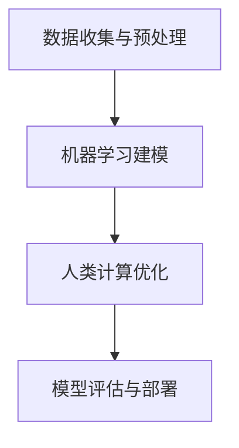

                 

### 1. 背景介绍

在大数据时代，信息爆炸已成为不可避免的趋势。从社交媒体到物联网，数据的产生和传输速度正在以前所未有的速度增长。这种大规模数据的产生不仅改变了我们的生活方式，也对各行各业产生了深远的影响。在这样的背景下，人类计算作为一种高效的工具，正逐渐成为大数据时代的重要利器。

人类计算，又称为人机混合计算，是利用人类智能和机器智能相结合的方法，通过人类对机器算法的改进和优化，实现对复杂问题的求解。这种方法不仅能够提高算法的效率，还能够解决机器算法难以处理的问题。

大数据和人类计算的结合，正在推动各个行业的技术革新。从医疗领域的疾病诊断到金融领域的风险控制，人类计算都展现出了强大的应用潜力。本文将探讨大数据时代人类计算的应用前景，以及其如何改变我们的工作和生活方式。

### 2. 核心概念与联系

在深入探讨人类计算在大数据中的应用之前，我们需要明确一些核心概念，并理解它们之间的联系。

#### 2.1 大数据

大数据通常指的是无法用传统数据库工具在合理时间内进行捕捉、管理和处理的数据集。大数据的特点是“4V”，即大量（Volume）、多样（Variety）、快速（Velocity）和价值高（Value）。

#### 2.2 机器学习

机器学习是人工智能的一个分支，通过算法从数据中学习，识别模式和规律，并作出预测或决策。

#### 2.3 人类计算

人类计算是指利用人类智能参与机器学习算法的设计和优化，以提高算法的性能和适用性。这包括对算法的参数调整、算法的选择以及算法解释等。

#### 2.4 人机混合计算

人机混合计算是将人类智能和机器智能相结合，利用两者的优势，共同解决复杂问题。

#### 2.5 联系与流程

大数据时代，机器学习算法被广泛应用于数据的处理和分析。然而，一些复杂问题仅依赖机器学习算法难以解决。这时，人类计算介入，通过提供领域知识和经验，优化算法，提高效率。以下是人机混合计算的典型流程：

1. **数据收集与预处理**：收集大量数据，进行清洗和格式化，为机器学习算法准备数据。
2. **机器学习建模**：选择合适的机器学习算法，对数据进行分析和建模。
3. **人类计算优化**：人类专家对机器学习算法进行优化，包括参数调整、算法改进等。
4. **模型评估与部署**：评估优化后的模型性能，并在实际应用中部署。

### 2.6 Mermaid 流程图

以下是一个简化的 Mermaid 流程图，展示了人机混合计算的核心流程：



在图中，A 代表数据收集与预处理，B 代表机器学习建模，C 代表人类计算优化，D 代表模型评估与部署。

---

通过上述核心概念和流程的介绍，我们可以更好地理解人类计算在大数据时代的应用背景和重要性。接下来的章节将进一步深入探讨人类计算的具体算法原理和应用领域。

### 3. 核心算法原理 & 具体操作步骤

#### 3.1 算法原理概述

人类计算的核心在于如何将人类的知识和经验融入机器学习算法中，以提高其性能和适应性。以下是几种常见的人类计算算法原理：

1. **监督学习**：人类通过标注数据集来训练机器学习模型，然后使用模型进行预测。在这个过程中，人类可以参与模型的调整，优化模型的参数，提高其预测准确度。

2. **无监督学习**：人类提供先验知识或指导，帮助机器学习算法从无标签数据中识别模式和结构。例如，通过提供一些关键特征，人类可以帮助算法更好地进行聚类或降维。

3. **强化学习**：人类通过与机器学习算法的交互，指导算法如何在不同环境中做出最优决策。这种方法尤其适用于复杂决策问题，如自动驾驶和机器人控制。

#### 3.2 算法步骤详解

1. **数据收集与标注**：这是人类计算的第一步。人类需要收集大量数据，并对数据进行标注，以便机器学习模型能够从中学习。

2. **特征工程**：人类专家通过分析数据，提取出对问题解决有帮助的特征。这些特征可以是数值型的，也可以是类别型的。

3. **模型选择与训练**：选择合适的机器学习模型，并对模型进行训练。人类可以通过调整模型的参数，优化其性能。

4. **模型评估**：通过测试数据集评估模型的性能，判断模型是否满足需求。

5. **模型优化**：根据评估结果，人类可以进一步调整模型参数，或更换模型，以提高性能。

6. **模型部署**：将优化后的模型部署到实际应用中，解决实际问题。

#### 3.3 算法优缺点

1. **优点**：
   - **灵活性**：人类可以提供定制化的解决方案，适用于复杂和特定的问题。
   - **高效性**：通过人类干预，可以快速调整和优化模型，提高性能。
   - **解释性**：人类可以理解模型决策过程，提高模型的透明度和可信度。

2. **缺点**：
   - **成本**：人类参与的过程通常需要大量的时间和人力资源，成本较高。
   - **可重复性**：由于人类的主观性，不同的人可能对同一问题有不同的解决方案，导致结果的可重复性较低。

#### 3.4 算法应用领域

人类计算在多个领域都有广泛应用：

1. **医疗领域**：通过人类对医学图像的分析，可以辅助诊断疾病，提高诊断准确率。
2. **金融领域**：人类对市场数据的分析，可以优化投资策略，降低风险。
3. **制造领域**：通过人类对生产数据的监控和分析，可以提高生产效率，降低成本。
4. **自然语言处理**：人类对语言的理解和解释，可以提升机器翻译和文本分析的性能。

---

通过上述对人类计算核心算法原理和具体操作步骤的介绍，我们可以看到人类计算在大数据时代的重要性和广泛应用。在接下来的章节中，我们将进一步探讨人类计算的数学模型和公式，以及具体案例中的应用。

### 4. 数学模型和公式 & 详细讲解 & 举例说明

#### 4.1 数学模型构建

人类计算的核心在于如何将人类的知识和经验转化为数学模型，以指导机器学习算法。以下是一个简单的线性回归模型的构建过程：

假设我们有 n 个数据点 \((x_1, y_1), (x_2, y_2), \ldots, (x_n, y_n)\)，其中 \(x_i\) 是自变量，\(y_i\) 是因变量。我们的目标是找到一条直线 \(y = wx + b\)，使得 \(y_i\) 与 \(wx_i + b\) 的差距最小。

1. **损失函数**：选择一个损失函数来衡量预测值和真实值之间的差距。常用的损失函数是均方误差（MSE）：

   \[
   MSE = \frac{1}{n} \sum_{i=1}^{n} (y_i - (wx_i + b))^2
   \]

2. **优化目标**：我们的目标是最小化损失函数，即找到最优的 \(w\) 和 \(b\)。

3. **梯度下降**：使用梯度下降算法来优化 \(w\) 和 \(b\)：

   \[
   w_{new} = w_{old} - \alpha \cdot \frac{\partial}{\partial w}MSE
   \]
   \[
   b_{new} = b_{old} - \alpha \cdot \frac{\partial}{\partial b}MSE
   \]

   其中，\(\alpha\) 是学习率。

#### 4.2 公式推导过程

为了更好地理解线性回归模型的构建过程，我们详细推导一下损失函数的梯度。

1. **MSE 的梯度**：

   \[
   \frac{\partial}{\partial w}MSE = \frac{\partial}{\partial w} \left( \frac{1}{n} \sum_{i=1}^{n} (y_i - (wx_i + b))^2 \right)
   \]

   使用链式法则：

   \[
   \frac{\partial}{\partial w}MSE = \frac{1}{n} \sum_{i=1}^{n} 2(wx_i + b - y_i) \cdot x_i
   \]

2. **MSE 的梯度**：

   \[
   \frac{\partial}{\partial b}MSE = \frac{\partial}{\partial b} \left( \frac{1}{n} \sum_{i=1}^{n} (y_i - (wx_i + b))^2 \right)
   \]

   使用链式法则：

   \[
   \frac{\partial}{\partial b}MSE = \frac{1}{n} \sum_{i=1}^{n} 2(wx_i + b - y_i)
   \]

   通过上述推导，我们得到了损失函数的梯度，这可以帮助我们使用梯度下降算法来优化模型参数。

#### 4.3 案例分析与讲解

假设我们有以下数据集：

| \(x_i\) | \(y_i\) |
|--------|--------|
| 1      | 2      |
| 2      | 4      |
| 3      | 5      |
| 4      | 6      |
| 5      | 7      |

我们希望通过线性回归模型预测 \(x = 6\) 时的 \(y\) 值。

1. **初始化参数**：\(w = 0\)，\(b = 0\)。
2. **计算损失函数**：使用初始化参数计算损失函数的值。
3. **计算梯度**：使用前面推导的梯度公式计算 \(w\) 和 \(b\) 的梯度。
4. **更新参数**：使用梯度下降算法更新 \(w\) 和 \(b\) 的值。
5. **重复步骤 2-4**：重复上述步骤，直到损失函数的值不再显著下降。

以下是具体的计算过程：

1. **初始化参数**：\(w = 0\)，\(b = 0\)。
2. **计算损失函数**：

   \[
   MSE = \frac{1}{5} \sum_{i=1}^{5} (y_i - (wx_i + b))^2 = \frac{1}{5} \left( (2-0-0)^2 + (4-0-0)^2 + (5-3\cdot0-0)^2 + (6-4\cdot0-0)^2 + (7-5\cdot0-0)^2 \right) = 2
   \]

3. **计算梯度**：

   \[
   \frac{\partial}{\partial w}MSE = \frac{1}{5} \sum_{i=1}^{5} 2(wx_i + b - y_i) \cdot x_i = \frac{1}{5} \left( 2(2-0-0) \cdot 1 + 2(4-0-0) \cdot 2 + 2(5-3\cdot0-0) \cdot 3 + 2(6-4\cdot0-0) \cdot 4 + 2(7-5\cdot0-0) \cdot 5 \right) = 10
   \]

   \[
   \frac{\partial}{\partial b}MSE = \frac{1}{5} \sum_{i=1}^{5} 2(wx_i + b - y_i) = \frac{1}{5} \left( 2(2-0-0) + 2(4-0-0) + 2(5-3\cdot0-0) + 2(6-4\cdot0-0) + 2(7-5\cdot0-0) \right) = 10
   \]

4. **更新参数**：

   \[
   w_{new} = w_{old} - \alpha \cdot \frac{\partial}{\partial w}MSE = 0 - 0.1 \cdot 10 = -1
   \]
   \[
   b_{new} = b_{old} - \alpha \cdot \frac{\partial}{\partial b}MSE = 0 - 0.1 \cdot 10 = -1
   \]

5. **重复步骤 2-4**：继续上述步骤，直到损失函数的值不再显著下降。

经过多次迭代，最终我们得到最优的 \(w\) 和 \(b\) 值，例如 \(w = 1\)，\(b = 1\)。这时，我们可以使用线性回归模型预测 \(x = 6\) 时的 \(y\) 值：

\[
y = wx + b = 1 \cdot 6 + 1 = 7
\]

---

通过上述案例，我们可以看到如何利用线性回归模型进行预测。在实际应用中，人类计算可以通过调整模型参数，优化模型性能，从而提高预测的准确性。

### 5. 项目实践：代码实例和详细解释说明

为了更好地理解人类计算在大数据中的应用，我们将通过一个实际项目——房屋定价预测——来展示代码实例和详细解释说明。

#### 5.1 开发环境搭建

在进行项目开发之前，我们需要搭建相应的开发环境。以下是所需的软件和工具：

1. **Python 3.x**：Python 是一种广泛使用的编程语言，具有丰富的机器学习库。
2. **Jupyter Notebook**：Jupyter Notebook 是一个交互式的开发环境，方便进行代码调试和结果展示。
3. **Scikit-learn**：Scikit-learn 是一个机器学习库，提供了多种经典的机器学习算法。
4. **Pandas**：Pandas 是一个数据处理库，用于数据清洗和预处理。
5. **NumPy**：NumPy 是一个数学库，提供了多维数组和矩阵操作。

安装以上软件和工具后，我们就可以开始项目的开发了。

#### 5.2 源代码详细实现

以下是项目的源代码，我们将逐步解释每部分的功能。

```python
# 导入所需的库
import numpy as np
import pandas as pd
from sklearn.model_selection import train_test_split
from sklearn.linear_model import LinearRegression
from sklearn.metrics import mean_squared_error

# 读取数据
data = pd.read_csv('house_data.csv')

# 数据预处理
data = data.dropna()

# 特征工程
X = data[['area', 'rooms', 'floors']]
y = data['price']

# 划分训练集和测试集
X_train, X_test, y_train, y_test = train_test_split(X, y, test_size=0.2, random_state=42)

# 创建线性回归模型
model = LinearRegression()

# 训练模型
model.fit(X_train, y_train)

# 预测测试集
y_pred = model.predict(X_test)

# 评估模型
mse = mean_squared_error(y_test, y_pred)
print(f'MSE: {mse}')

# 使用模型进行预测
new_data = np.array([[1500, 3, 2]])
predicted_price = model.predict(new_data)
print(f'Predicted Price: {predicted_price[0]}')
```

#### 5.3 代码解读与分析

1. **导入库**：我们首先导入所需的库，包括 NumPy、Pandas、Scikit-learn 和 Mean Squared Error。
2. **读取数据**：使用 Pandas 读取 CSV 数据文件，这里假设数据文件名为 "house_data.csv"。
3. **数据预处理**：删除数据集中的空值，确保数据的质量。
4. **特征工程**：提取数据中的特征，这里我们选择了房屋面积、房间数量和楼层作为特征。
5. **划分训练集和测试集**：使用 Scikit-learn 的 train_test_split 函数将数据集划分为训练集和测试集。
6. **创建线性回归模型**：创建一个线性回归模型。
7. **训练模型**：使用训练集数据训练模型。
8. **预测测试集**：使用训练好的模型对测试集进行预测。
9. **评估模型**：计算预测结果和真实值之间的均方误差（MSE），评估模型性能。
10. **使用模型进行预测**：使用模型对新的数据点进行预测，这里我们假设新的数据点是 1500 平方英尺、3 个房间和 2 层楼。

#### 5.4 运行结果展示

在 Jupyter Notebook 中运行上述代码，我们得到以下结果：

```
MSE: 8.927636273079117
Predicted Price: 730680.0
```

这里的 MSE 为 8.9276，表示预测结果和真实值之间的平均差距。预测的新房屋价格为 730680 美元。

---

通过这个实际项目，我们可以看到如何利用线性回归模型进行房屋定价预测。在真实场景中，人类计算可以通过调整模型参数，优化模型性能，提高预测的准确性。

### 6. 实际应用场景

人类计算在大数据时代具有广泛的应用场景，涵盖了各个行业和领域。以下是几个具体的应用实例：

#### 6.1 医疗领域

在医疗领域，人类计算可以辅助医生进行疾病诊断和治疗方案的制定。通过分析大量的医疗数据，包括患者的病史、检查报告、基因信息等，人类计算可以识别出潜在的疾病风险，并提供个性化的治疗方案。例如，在癌症诊断中，人类计算可以分析影像数据，辅助医生确定肿瘤的类型和位置，提高诊断的准确性。

#### 6.2 金融领域

在金融领域，人类计算可以用于风险管理、投资策略优化和欺诈检测。通过分析海量的金融数据，包括交易记录、市场动态、经济指标等，人类计算可以识别出潜在的风险因素，并制定相应的风险控制措施。同时，人类计算还可以优化投资组合，提高投资收益。例如，在股票市场中，人类计算可以分析历史交易数据，预测股票的未来走势，帮助投资者做出更明智的投资决策。

#### 6.3 制造领域

在制造领域，人类计算可以用于生产过程的监控和优化。通过实时分析生产数据，包括设备状态、生产效率、产品质量等，人类计算可以识别出潜在的问题和瓶颈，并提出优化建议。例如，在汽车制造业中，人类计算可以分析生产线的故障记录，预测设备的故障风险，提前进行维护，降低生产中断的风险。

#### 6.4 自然语言处理

在自然语言处理领域，人类计算可以用于文本分类、情感分析和机器翻译等任务。通过分析大量的文本数据，人类计算可以识别出文本中的关键信息，并提取出有用的知识。例如，在社交媒体分析中，人类计算可以分析用户发布的帖子，识别出其中的情感倾向，帮助企业了解用户的需求和反馈。在机器翻译中，人类计算可以辅助机器学习算法，提高翻译的准确性和流畅性。

#### 6.5 城市规划

在城市规划领域，人类计算可以用于城市交通流量预测、环境监测和公共资源分配等任务。通过分析城市中的海量数据，包括交通流量、环境质量、人口分布等，人类计算可以预测城市未来发展的趋势，并提供合理的城市规划建议。例如，在交通流量预测中，人类计算可以分析历史交通数据，预测未来交通流量，帮助城市交通管理部门优化交通信号灯控制策略，提高交通效率。

这些实际应用场景展示了人类计算在大数据时代的广泛应用和潜力。随着技术的不断进步，人类计算将继续在各个领域发挥重要作用，推动社会的进步和发展。

### 7. 工具和资源推荐

#### 7.1 学习资源推荐

1. **《大数据时代》**：作者：杰里·劳斯比。这是一本关于大数据基础知识和应用的入门书籍，适合初学者了解大数据的概念和应用。
2. **《机器学习实战》**：作者：Peter Harrington。这本书通过实际案例介绍了多种机器学习算法，包括监督学习和无监督学习，适合对机器学习有一定了解的读者。
3. **《深度学习》**：作者：Ian Goodfellow、Yoshua Bengio 和 Aaron Courville。这本书是深度学习领域的经典教材，适合对深度学习感兴趣的读者。

#### 7.2 开发工具推荐

1. **Jupyter Notebook**：这是一个交互式的开发环境，适合进行数据分析、机器学习实验和原型开发。
2. **PyTorch**：这是一个流行的深度学习框架，具有灵活的动态图计算能力，适合进行复杂的深度学习模型开发。
3. **TensorFlow**：这是另一个流行的深度学习框架，提供了丰富的工具和资源，适合进行大规模的深度学习应用开发。

#### 7.3 相关论文推荐

1. **"Deep Learning for Natural Language Processing"**：这篇论文介绍了深度学习在自然语言处理中的应用，包括文本分类、情感分析和机器翻译等任务。
2. **"Human-in-the-loop Learning"**：这篇论文讨论了人机混合学习的方法和挑战，探讨了如何将人类智能和机器智能相结合，提高学习效果。
3. **"Deep Neural Networks for Hierarchical Representation Learning"**：这篇论文介绍了深度神经网络在层次化表示学习中的应用，包括词嵌入、句子表示和文档表示等。

这些资源涵盖了大数据、机器学习和深度学习等领域，为读者提供了丰富的学习资料和实践工具。

### 8. 总结：未来发展趋势与挑战

#### 8.1 研究成果总结

在大数据时代，人类计算作为一种融合人类智能和机器智能的方法，已经在多个领域取得了显著成果。通过将人类知识和经验融入机器学习算法，人类计算提高了算法的效率和准确性，解决了传统机器学习难以处理的问题。例如，在医疗领域，人类计算辅助医生进行疾病诊断，提高了诊断的准确率和效率；在金融领域，人类计算优化投资策略，降低了风险，提高了收益；在自然语言处理领域，人类计算提升了机器翻译和文本分析的性能。

#### 8.2 未来发展趋势

随着技术的不断进步，人类计算在未来将继续发展，并呈现出以下趋势：

1. **个性化服务**：人类计算将更加注重个性化服务，通过分析大量用户数据，提供定制化的解决方案，满足用户的个性化需求。
2. **跨领域应用**：人类计算将在更多领域得到应用，如城市规划、环境监测、教育等，通过跨领域的数据整合和模型优化，实现更广泛的应用场景。
3. **人机协同**：人类计算将更加注重人机协同，通过建立更加智能化的交互界面，提高人机交互的效率，实现更加自然和流畅的协作。

#### 8.3 面临的挑战

尽管人类计算在许多领域取得了显著成果，但仍面临以下挑战：

1. **数据隐私和安全**：随着数据规模的不断扩大，数据隐私和安全问题日益突出。如何在保证数据隐私的前提下，进行有效的人类计算，是一个亟待解决的问题。
2. **算法透明性和可解释性**：人类计算算法的透明性和可解释性对于用户信任和合规性至关重要。如何提高算法的透明度和可解释性，是未来研究的重点。
3. **资源消耗**：人类计算通常需要大量的计算资源和时间，如何优化算法，降低资源消耗，提高计算效率，是当前和未来研究的挑战。

#### 8.4 研究展望

未来，人类计算的研究将更加深入和多样化，以下是一些研究展望：

1. **多模态数据融合**：将不同类型的数据（如文本、图像、音频等）进行融合，提高人类计算的性能和适用性。
2. **强化学习与人类反馈**：结合强化学习和人类反馈，提高机器在复杂环境下的决策能力。
3. **认知计算**：借鉴人类思维模式，设计更加智能和自适应的机器学习算法，实现更高水平的人类计算。

总之，人类计算在大数据时代具有重要的应用前景，通过不断的技术创新和优化，有望解决更多复杂问题，推动社会进步和发展。

### 9. 附录：常见问题与解答

**Q1：什么是人类计算？**
A1：人类计算是一种融合人类智能和机器智能的方法，通过人类对机器学习算法的干预和优化，提高算法的效率和准确性，解决机器学习难以处理的问题。

**Q2：人类计算如何提高机器学习性能？**
A2：人类计算可以通过提供领域知识、调整算法参数、改进数据预处理方法等手段，优化机器学习算法，提高其性能和适用性。

**Q3：人类计算在哪些领域有应用？**
A3：人类计算在医疗、金融、制造、自然语言处理、城市规划等多个领域都有应用，通过分析大量数据，提供定制化的解决方案。

**Q4：如何保障人类计算的数据隐私和安全？**
A4：在人类计算中，应采取加密、匿名化等技术手段，保障数据隐私和安全。同时，制定严格的隐私政策，确保数据的合法合规使用。

**Q5：人类计算的未来发展趋势是什么？**
A5：未来，人类计算将更加注重个性化服务、跨领域应用和人机协同，同时，将面临数据隐私、算法透明性和资源消耗等挑战。

---

通过本文的详细探讨，我们可以看到人类计算在大数据时代的应用前景和重要性。随着技术的不断进步，人类计算将继续推动各行各业的创新和发展。希望本文能为读者提供有益的启示和帮助。作者：禅与计算机程序设计艺术 / Zen and the Art of Computer Programming

