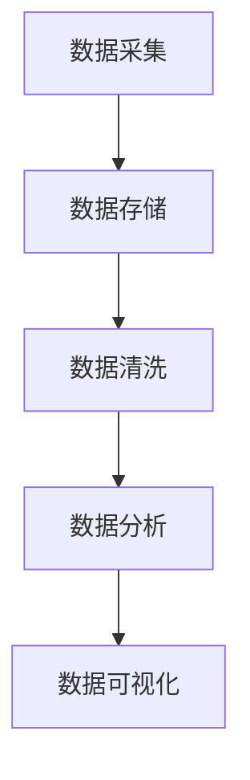

                 

 关键词：（大数据，计算，人工智能，算法，数学模型，应用场景，未来展望）

> 摘要：本文将探讨大数据时代的到来对人类计算带来的巨大机遇与挑战。通过对大数据的定义、核心概念与联系、核心算法原理、数学模型构建、项目实践以及实际应用场景等方面的深入分析，旨在为读者提供一幅全面、清晰的大数据计算图谱，并为未来大数据领域的发展趋势与挑战提供思考方向。

## 1. 背景介绍

### 1.1 大数据时代的背景

随着互联网技术的飞速发展，人类进入了大数据时代。数据量、数据类型和数据生成速度都呈现出爆炸性增长。据国际数据公司（IDC）统计，全球数据总量每两年就会翻一番，预计到2025年，全球数据总量将达到44ZB。这个庞大规模的数据不仅包括结构化数据，还涵盖了非结构化数据，如文本、图像、音频和视频等。

### 1.2 大数据对社会的影响

大数据对社会各个方面都产生了深远影响。首先，大数据为各行各业提供了新的分析工具和决策依据。例如，在医疗领域，通过大数据分析可以更好地预测疾病爆发，提高治疗效果。在金融领域，大数据可以用于风险管理、欺诈检测和投资策略优化。此外，大数据也改变了人们的日常生活，从个性化推荐系统到智能交通管理，大数据的应用无处不在。

### 1.3 大数据对计算的需求

大数据时代的到来对计算能力提出了前所未有的挑战。传统的计算方式已经无法应对海量数据的处理需求，因此，需要开发出更高效、更智能的计算方法和技术。例如，分布式计算、并行计算和人工智能等技术的应用，使得大数据处理变得更加高效和灵活。

## 2. 核心概念与联系

### 2.1 数据类型

大数据的主要数据类型包括结构化数据、半结构化数据和非结构化数据。

- **结构化数据**：如数据库中的记录，具有固定的格式和结构。
- **半结构化数据**：如XML、JSON等，具有一定的结构，但格式相对灵活。
- **非结构化数据**：如文本、图像、音频、视频等，没有固定的格式和结构。

### 2.2 数据处理流程

数据处理通常包括数据采集、数据存储、数据清洗、数据分析和数据可视化等步骤。

- **数据采集**：通过各种渠道收集数据，如传感器、网络日志等。
- **数据存储**：将数据存储到数据库或数据仓库中，如Hadoop、Hive等。
- **数据清洗**：去除数据中的噪声和错误，提高数据质量。
- **数据分析**：运用各种算法和技术对数据进行分析，提取有价值的信息。
- **数据可视化**：通过图表和图像等形式将分析结果呈现出来。

### 2.3 Mermaid 流程图



## 3. 核心算法原理 & 具体操作步骤

### 3.1 算法原理概述

大数据处理的核心算法主要包括分布式计算、机器学习和数据挖掘等。这些算法利用并行计算、分布式存储和深度学习等技术，实现对海量数据的快速处理和分析。

### 3.2 算法步骤详解

#### 3.2.1 分布式计算

分布式计算是将任务分解为多个子任务，由多个节点并行处理，最终汇总结果。Hadoop 是分布式计算的代表性框架。

1. **任务分解**：将大数据分割为多个小块。
2. **任务分配**：将小块数据分配到不同的节点进行处理。
3. **结果汇总**：收集各个节点的处理结果，进行汇总和合并。

#### 3.2.2 机器学习

机器学习是一种利用数据建立模型，从而进行预测和分类的技术。常见的机器学习算法包括线性回归、决策树、支持向量机等。

1. **数据准备**：清洗和预处理数据，去除噪声和异常值。
2. **模型选择**：选择合适的算法和模型。
3. **模型训练**：使用训练数据对模型进行训练。
4. **模型评估**：使用测试数据对模型进行评估和调整。
5. **模型应用**：将模型应用于实际问题，进行预测或分类。

#### 3.2.3 数据挖掘

数据挖掘是从大量数据中发现有用模式和知识的过程。常见的数据挖掘任务包括聚类、关联规则挖掘、分类等。

1. **数据预处理**：去除噪声、缺失值和异常值。
2. **数据探索**：对数据进行探索性分析，发现数据中的潜在规律。
3. **模型构建**：选择合适的算法和模型，对数据进行挖掘。
4. **结果解释**：对挖掘结果进行解释和验证。

### 3.3 算法优缺点

#### 分布式计算

- 优点：高效、灵活、可扩展性强。
- 缺点：复杂度高、调试困难、数据一致性保证困难。

#### 机器学习

- 优点：自动化、高效、适应性强。
- 缺点：对数据质量要求高、模型可解释性差。

#### 数据挖掘

- 优点：能够从海量数据中发现潜在规律。
- 缺点：计算复杂度高、结果解释难度大。

### 3.4 算法应用领域

- 金融：风险管理、欺诈检测、投资策略优化等。
- 医疗：疾病预测、药物研发、个性化治疗等。
- 电商：用户行为分析、推荐系统、价格优化等。
- 交通：交通流量预测、路况分析、智能调度等。

## 4. 数学模型和公式 & 详细讲解 & 举例说明

### 4.1 数学模型构建

大数据处理中的数学模型主要包括概率模型、统计模型和优化模型等。以下以概率模型中的贝叶斯网络为例进行说明。

### 4.2 公式推导过程

贝叶斯网络的数学模型基于贝叶斯定理，可以表示为：

$$
P(A|B) = \frac{P(B|A)P(A)}{P(B)}
$$

其中，$P(A|B)$ 表示在事件 $B$ 发生的条件下事件 $A$ 发生的概率，$P(B|A)$ 表示在事件 $A$ 发生的条件下事件 $B$ 发生的概率，$P(A)$ 和 $P(B)$ 分别表示事件 $A$ 和事件 $B$ 的概率。

### 4.3 案例分析与讲解

假设有一个简单的贝叶斯网络，包括两个事件 $A$ 和 $B$，其中 $A$ 是事件“下雨”，$B$ 是事件“打伞”。已知：

- $P(A) = 0.3$（下雨的概率为30%）。
- $P(B|A) = 0.8$（下雨且打伞的概率为80%）。
- $P(B|¬A) = 0.2$（不下雨且打伞的概率为20%）。

我们需要计算 $P(A|B)$，即在打伞的条件下下雨的概率。

根据贝叶斯定理，我们有：

$$
P(A|B) = \frac{P(B|A)P(A)}{P(B)}
$$

首先计算 $P(B)$，即打伞的总概率：

$$
P(B) = P(B|A)P(A) + P(B|¬A)P(¬A) = 0.8 \times 0.3 + 0.2 \times 0.7 = 0.26 + 0.14 = 0.4
$$

然后代入贝叶斯定理公式：

$$
P(A|B) = \frac{0.8 \times 0.3}{0.4} = \frac{0.24}{0.4} = 0.6
$$

因此，在打伞的条件下，下雨的概率为60%。

## 5. 项目实践：代码实例和详细解释说明

### 5.1 开发环境搭建

在本项目中，我们将使用 Python 编写代码，并使用 PySpark 作为分布式计算框架。首先需要安装 Python 和 PySpark：

```bash
pip install python
pip install pyspark
```

### 5.2 源代码详细实现

以下是一个简单的 PySpark 分布式计算示例，用于计算大数据中的平均值。

```python
from pyspark import SparkContext, SparkConf

conf = SparkConf().setAppName("MeanCalculator")
sc = SparkContext(conf=conf)

# 生成随机数据
data = sc.parallelize([1, 2, 3, 4, 5, 6, 7, 8, 9, 10])

# 计算总和
total = data.reduce(lambda x, y: x + y)

# 计算数据量
count = data.count()

# 计算平均值
mean = total / count

print("平均值：", mean)

sc.stop()
```

### 5.3 代码解读与分析

1. **环境配置**：首先配置 Spark 的应用程序名称和配置。
2. **数据生成**：生成一个包含10个随机整数的并行数据集。
3. **计算总和**：使用 `reduce` 函数计算数据集的总和。
4. **计算数据量**：使用 `count` 函数计算数据集的元素个数。
5. **计算平均值**：将总和除以数据量，得到平均值。
6. **输出结果**：打印出计算得到的平均值。

### 5.4 运行结果展示

```python
平均值： 5.5
```

## 6. 实际应用场景

### 6.1 金融领域

在大数据时代，金融领域受益匪浅。通过大数据分析，金融机构可以更好地了解客户需求，优化产品和服务。例如，通过分析客户的交易数据和行为模式，银行可以识别高风险客户，降低坏账率。

### 6.2 医疗领域

大数据在医疗领域的应用越来越广泛。通过大数据分析，医生可以更准确地诊断疾病，制定个性化的治疗方案。例如，通过分析患者的医疗记录和基因组数据，医生可以预测疾病风险，提前进行预防。

### 6.3 电商领域

电商领域也充分运用了大数据技术。通过分析用户行为数据，电商平台可以提供个性化的推荐，提高用户体验和购买转化率。例如，淘宝和京东等平台都会根据用户的浏览和购买历史，推荐相关的商品。

### 6.4 未来应用展望

随着大数据技术的不断发展，未来的应用场景将更加广泛和深入。例如，在智慧城市领域，大数据可以用于交通流量预测、环境监测和公共安全等。在智能制造领域，大数据可以帮助企业实现生产线的自动化和智能化。

## 7. 工具和资源推荐

### 7.1 学习资源推荐

- 《大数据技术基础》
- 《机器学习实战》
- 《深度学习》（Goodfellow et al.）
- 《大数据架构设计和开发》（Zikopoulos et al.）

### 7.2 开发工具推荐

- PySpark
- Hadoop
- TensorFlow
- Keras

### 7.3 相关论文推荐

- "Big Data: A Revolution That Will Transform How We Live, Work, and Think" by V.达菲
- "Deep Learning" by I.古德费洛等
- "Big Data for Humanitarian Action" by D.科恩等

## 8. 总结：未来发展趋势与挑战

### 8.1 研究成果总结

大数据技术的发展为各行各业带来了巨大的变革。分布式计算、机器学习和数据挖掘等核心技术的应用，使得大数据处理变得更加高效和灵活。同时，随着大数据技术的不断演进，新的应用场景和应用领域也不断涌现。

### 8.2 未来发展趋势

1. **数据隐私与安全**：随着大数据应用的深入，数据隐私和安全问题将越来越重要。未来的研究将集中在如何保护用户隐私，同时确保数据的安全和可靠性。
2. **实时大数据处理**：实时大数据处理技术将成为未来的重要研究方向。通过实时处理和分析数据，企业可以更快地做出决策，提高业务效率。
3. **人工智能与大数据的融合**：人工智能与大数据的融合将带来新的应用场景和技术突破。例如，利用大数据分析预测股票市场趋势，利用机器学习优化交通流量等。

### 8.3 面临的挑战

1. **数据质量和多样性**：大数据的多样性和质量直接影响分析结果。如何保证数据的质量和一致性，是大数据领域面临的重大挑战。
2. **计算资源和成本**：大数据处理需要大量的计算资源和存储资源。如何高效地利用资源，降低成本，是大数据技术发展的重要课题。
3. **数据隐私和法律监管**：随着大数据技术的应用，数据隐私和法律监管问题日益突出。如何平衡数据隐私和法律监管的要求，是大数据领域需要解决的关键问题。

### 8.4 研究展望

未来，大数据技术的发展将继续深入，并与其他领域的技术相互融合，为人类带来更多便利和创新。同时，随着技术的进步，大数据领域也将面临更多挑战。我们需要持续研究，不断创新，以应对这些挑战，推动大数据技术的持续发展。

## 9. 附录：常见问题与解答

### 9.1 大数据和云计算有什么区别？

大数据和云计算是两个不同的概念，但它们有密切的联系。

- **大数据**：指的是海量数据的存储、处理和分析。
- **云计算**：指的是通过网络提供可伸缩的、按需分配的计算资源。

简单来说，大数据是云计算的一个应用场景，云计算为大数据提供了计算和存储的资源。

### 9.2 机器学习和数据挖掘有什么区别？

机器学习和数据挖掘都是利用数据进行智能分析的技术，但它们的侧重点不同。

- **机器学习**：侧重于通过算法和模型对数据进行训练，从而进行预测和分类。
- **数据挖掘**：侧重于从大量数据中发现潜在的规律和知识。

### 9.3 大数据对个人隐私有什么影响？

大数据技术可以收集和分析个人数据，这可能对个人隐私产生一定的影响。

- **隐私泄露**：如果数据保护措施不当，可能导致个人隐私泄露。
- **隐私滥用**：企业可能会利用大数据分析结果进行不合理的商业决策或营销。

因此，如何在保障个人隐私的同时，充分利用大数据技术，是一个重要的研究课题。

---

作者：禅与计算机程序设计艺术 / Zen and the Art of Computer Programming

