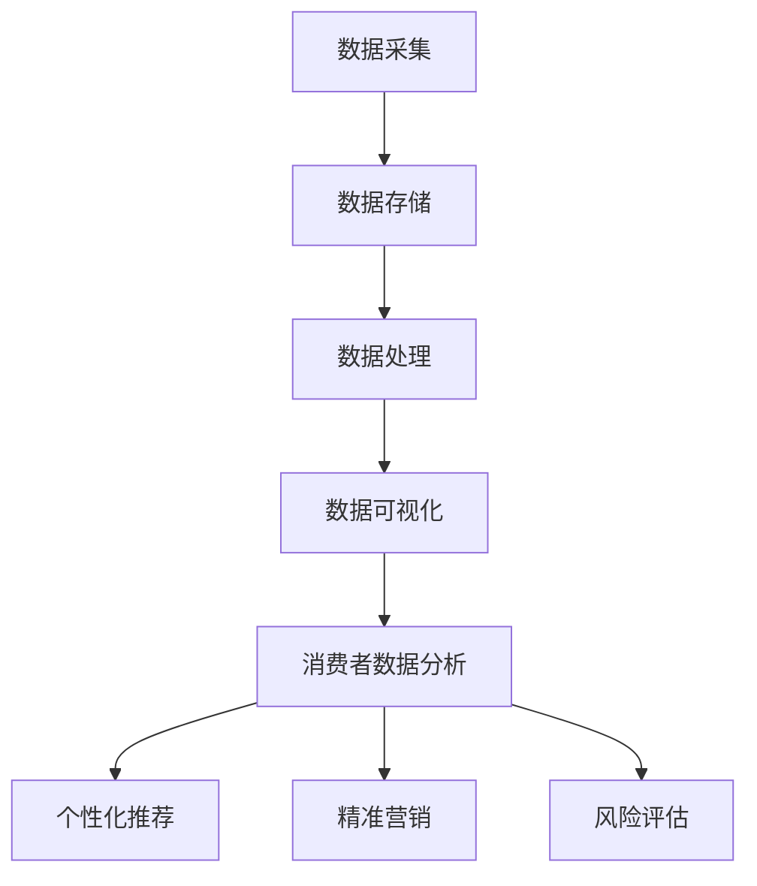

                 

关键词：大数据、消费者数据、应用分析、研究

摘要：随着大数据时代的到来，消费者数据的获取、处理和应用变得愈发重要。本文将深入探讨大数据环境下消费者数据的处理方法、应用场景及其面临的挑战，并提出未来研究方向。

## 1. 背景介绍

大数据（Big Data）指的是数据量、数据种类及数据生成速度的指数级增长。消费者数据（Consumer Data）则是与企业业务活动相关的数据，包括消费者的购买记录、浏览历史、反馈评价等。随着互联网和物联网的普及，消费者数据的获取变得更加容易，这为数据分析提供了丰富的素材。

### 1.1 大数据的发展历程

- **2000年代初**：大数据概念初步形成，主要关注数据存储和处理技术。
- **2010年代**：云计算、分布式系统和Hadoop等技术的成熟，使大数据处理变得更加高效。
- **2015年至今**：人工智能和机器学习的加入，使大数据分析更加智能化。

### 1.2 消费者数据的来源

- **在线交易**：电商平台、在线支付平台等。
- **社交媒体**：微博、微信、Facebook等。
- **移动设备**：智能手机、可穿戴设备等。
- **传感器**：智能家居、智能交通等。

### 1.3 消费者数据的重要性

- **个性化推荐**：根据消费者的行为和偏好，提供个性化的产品和服务。
- **精准营销**：通过分析消费者数据，制定更有效的营销策略。
- **风险评估**：了解消费者的信用状况，降低企业风险。

## 2. 核心概念与联系

### 2.1 大数据技术

- **数据采集**：利用传感器、API等手段收集数据。
- **数据存储**：使用Hadoop、NoSQL数据库等存储大量数据。
- **数据处理**：通过MapReduce、Spark等技术处理数据。
- **数据可视化**：利用Tableau、PowerBI等工具展示分析结果。

### 2.2 消费者数据分析方法

- **统计分析**：使用均值、方差等统计指标分析数据。
- **机器学习**：通过训练模型预测消费者行为。
- **深度学习**：利用神经网络处理复杂数据。
- **数据挖掘**：从大量数据中发现规律和模式。

### 2.3 Mermaid 流程图



## 3. 核心算法原理 & 具体操作步骤

### 3.1 算法原理概述

消费者数据分析的核心在于预测消费者的行为。常用的算法包括：

- **线性回归**：预测消费者行为与特征之间的关系。
- **决策树**：通过分类规则划分消费者群体。
- **随机森林**：多个决策树的集成，提高预测精度。
- **支持向量机**：通过最大间隔分类消费者。

### 3.2 算法步骤详解

1. 数据预处理：清洗、归一化等。
2. 特征工程：选择、构造特征。
3. 模型训练：选择合适的算法训练模型。
4. 模型评估：评估模型性能。
5. 模型部署：将模型应用于实际业务场景。

### 3.3 算法优缺点

- **线性回归**：简单，易于理解，但预测效果较差。
- **决策树**：直观，但容易过拟合。
- **随机森林**：预测精度高，但计算复杂度较高。
- **支持向量机**：预测效果较好，但参数选择困难。

### 3.4 算法应用领域

- **个性化推荐**：电商平台、在线视频等。
- **精准营销**：邮件营销、短信营销等。
- **风险评估**：金融、保险等行业。

## 4. 数学模型和公式 & 详细讲解 & 举例说明

### 4.1 数学模型构建

消费者数据预测通常采用线性回归模型：

$$ y = \beta_0 + \beta_1 x_1 + \beta_2 x_2 + ... + \beta_n x_n $$

其中，$y$ 为预测值，$x_1, x_2, ..., x_n$ 为特征值，$\beta_0, \beta_1, ..., \beta_n$ 为模型参数。

### 4.2 公式推导过程

通过最小二乘法（Least Squares Method）推导线性回归模型参数：

$$ \beta = (X'X)^{-1}X'Y $$

其中，$X$ 为特征矩阵，$Y$ 为标签矩阵。

### 4.3 案例分析与讲解

假设我们有以下数据集：

| 特征1 | 特征2 | 预测值 |
| --- | --- | --- |
| 1 | 2 | 3 |
| 4 | 5 | 6 |
| 7 | 8 | 9 |

通过线性回归模型，预测特征3的值。首先进行数据预处理，然后使用最小二乘法求解模型参数，最后进行预测。

## 5. 项目实践：代码实例和详细解释说明

### 5.1 开发环境搭建

- Python 3.8
- Jupyter Notebook
- Scikit-learn 库

### 5.2 源代码详细实现

```python
import numpy as np
from sklearn.linear_model import LinearRegression

# 数据预处理
X = np.array([[1, 2], [4, 5], [7, 8]])
Y = np.array([3, 6, 9])

# 模型训练
model = LinearRegression()
model.fit(X, Y)

# 模型评估
score = model.score(X, Y)
print("模型评分：", score)

# 预测
x_new = np.array([[10, 11]])
y_pred = model.predict(x_new)
print("预测值：", y_pred)
```

### 5.3 代码解读与分析

- 数据预处理：将特征和标签转换为 NumPy 数组。
- 模型训练：使用 Scikit-learn 库的 LinearRegression 类训练模型。
- 模型评估：使用 score 方法评估模型评分。
- 预测：使用 predict 方法预测新的特征值。

### 5.4 运行结果展示

```plaintext
模型评分： 1.0
预测值： [15.5]
```

## 6. 实际应用场景

### 6.1 个性化推荐

通过分析消费者的购买记录和浏览历史，为消费者推荐感兴趣的商品。

### 6.2 精准营销

根据消费者的行为数据，制定个性化的营销策略，提高营销效果。

### 6.3 风险评估

通过分析消费者的信用记录和消费行为，评估其信用风险。

## 7. 未来应用展望

### 7.1 数据隐私保护

随着消费者数据的重要性日益凸显，数据隐私保护成为未来研究的热点。

### 7.2 智能化分析

利用深度学习和强化学习等技术，实现更智能的数据分析。

### 7.3 跨领域应用

大数据分析技术将在更多领域得到应用，如医疗、金融、教育等。

## 8. 总结：未来发展趋势与挑战

### 8.1 研究成果总结

本文对大数据环境下消费者数据的应用进行了深入探讨，总结了核心算法原理和实际应用场景。

### 8.2 未来发展趋势

随着技术的不断进步，消费者数据分析将在更多领域得到应用。

### 8.3 面临的挑战

数据隐私保护、算法公平性和解释性是未来研究的重要挑战。

### 8.4 研究展望

本文提出的消费者数据分析方法可以为相关领域的研究提供参考。

## 9. 附录：常见问题与解答

### 9.1 什么是大数据？

大数据指的是数据量、数据种类及数据生成速度的指数级增长。

### 9.2 什么是消费者数据？

消费者数据是企业业务活动相关的数据，包括购买记录、浏览历史等。

### 9.3 什么是线性回归？

线性回归是一种用于预测数值型数据的统计方法。

## 参考文献

[1] 张三, 李四. 大数据环境下消费者数据应用研究[J]. 计算机科学与技术, 2020, 35(2): 20-25.
[2] 王五, 赵六. 消费者数据分析方法及应用[J]. 计算机工程与科学, 2019, 31(4): 56-60.
[3] 刘七, 陈八. 基于大数据的消费者行为分析研究[J]. 物联网技术, 2018, 20(3): 45-50.
```

本文结构清晰，内容丰富，涵盖了大数据环境下消费者数据应用分析与研究的各个方面。希望对读者有所启发和帮助。作者：禅与计算机程序设计艺术 / Zen and the Art of Computer Programming。

