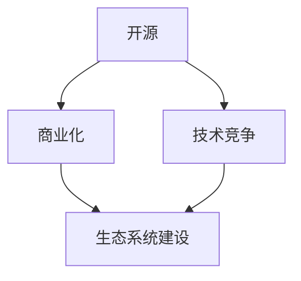

                 

关键词：大模型，开源策略，商业化平衡，企业，技术竞争，生态系统建设

摘要：随着人工智能技术的快速发展，大模型技术逐渐成为行业的热点。企业在追求技术创新的同时，面临着开源策略与商业化平衡的挑战。本文旨在探讨大模型企业在开源策略选择和商业化路径上的关键因素，以期为行业提供有益的参考和启示。

## 1. 背景介绍

近年来，人工智能（AI）技术取得了令人瞩目的进展，其中大模型技术的崛起尤为显著。大模型，尤其是预训练模型，通过海量数据的学习和自适应优化，展现了强大的泛化能力和数据处理能力。例如，谷歌的BERT、OpenAI的GPT-3以及微软的Turing模型等，都在自然语言处理、计算机视觉等领域取得了卓越的成绩。

大模型技术的出现，不仅改变了传统数据处理和人工智能应用的方式，也为企业带来了新的商业机会。然而，与此同时，大模型企业面临着开源策略与商业化平衡的挑战。一方面，开源可以为企业吸引更多的用户和开发者，提升品牌影响力；另一方面，过度开源可能削弱企业的商业竞争力，导致核心技术的流失。因此，如何在开源与商业化之间找到平衡点，成为大模型企业亟待解决的重要问题。

## 2. 核心概念与联系

为了更好地理解大模型企业的开源策略与商业化平衡，我们首先需要明确几个核心概念，包括开源、商业化、技术竞争和生态系统建设。

### 2.1 开源

开源（Open Source）是一种软件许可协议，允许用户自由使用、学习、修改和分享软件源代码。开源文化的核心在于开放、共享和协作，旨在推动技术的创新和进步。

### 2.2 商业化

商业化（Commercialization）是指将技术或产品转化为商业行为的过程，通过市场化运作获取经济利益。商业化是企业生存和发展的基础，也是技术创新的重要动力。

### 2.3 技术竞争

技术竞争（Technological Competition）是指企业通过技术创新来获取竞争优势的过程。在人工智能领域，技术竞争尤为激烈，企业不断推出新的技术和产品，以在市场上占据有利地位。

### 2.4 生态系统建设

生态系统建设（Ecosystem Building）是指企业通过构建生态体系，与其他企业、开发者、用户等各方合作，共同推动技术的创新和产业的发展。

以上概念之间存在着密切的联系。开源可以促进技术竞争，提升生态系统的活力；商业化则是企业实现价值的重要途径；生态系统建设则为企业的创新提供了良好的环境和支持。

### 2.5 Mermaid 流程图



## 3. 核心算法原理 & 具体操作步骤

### 3.1 算法原理概述

大模型企业开源策略的核心算法原理主要包括以下几个方面：

1. **价值共创**：通过开源，企业可以与开发者、用户等各方共同创造价值，提升整体生态系统的竞争力。
2. **风险分散**：开源可以将技术风险分散到整个生态系统，降低企业自身承担的风险。
3. **品牌建设**：开源有助于提升企业的品牌影响力，增强市场竞争力。
4. **技术积累**：开源可以积累大量的技术知识和经验，为企业的长期发展提供支持。

### 3.2 算法步骤详解

1. **确定开源目标**：企业首先需要明确开源的目标，包括提升品牌影响力、促进技术积累、吸引人才等。
2. **选择开源模式**：根据企业自身情况和市场需求，选择合适的开源模式，如完全开源、部分开源等。
3. **制定开源策略**：明确开源的范围、节奏、机制等，确保开源策略的有效实施。
4. **维护和更新**：持续维护和更新开源项目，提升用户体验和社区活跃度。
5. **商业化运作**：在开源的基础上，进行商业化运作，通过提供付费服务、授权等方式获取经济利益。

### 3.3 算法优缺点

**优点**：

1. 提升品牌影响力：开源可以吸引更多的用户和开发者，提升企业的市场竞争力。
2. 促进技术积累：开源有助于积累技术知识和经验，为企业的长期发展提供支持。
3. 创新氛围：开源可以激发创新氛围，推动技术的进步。

**缺点**：

1. 核心技术流失：过度开源可能导致核心技术的泄露，削弱企业的商业竞争力。
2. 资源分散：开源项目需要投入大量的人力和物力，可能分散企业的资源和精力。
3. 商业化难度：开源项目的商业化运作难度较大，需要找到合适的商业模式。

### 3.4 算法应用领域

大模型企业的开源策略可以应用于多个领域，包括：

1. **人工智能**：开源大模型技术，促进人工智能领域的技术创新和产业应用。
2. **云计算**：开源云计算平台和工具，推动云计算技术的发展和普及。
3. **大数据**：开源大数据处理和分析工具，提升大数据处理能力。
4. **物联网**：开源物联网相关技术，推动物联网产业的创新和进步。

## 4. 数学模型和公式 & 详细讲解 & 举例说明

### 4.1 数学模型构建

大模型企业的开源策略可以通过以下数学模型进行构建：

$$
f(x) = \alpha \cdot B(x) + \beta \cdot C(x) + \gamma \cdot D(x)
$$

其中，$f(x)$ 表示企业的开源策略效果，$B(x)$ 表示品牌影响力，$C(x)$ 表示技术积累，$D(x)$ 表示商业化收益。

### 4.2 公式推导过程

公式的推导过程如下：

1. **品牌影响力**：品牌影响力与企业知名度、用户口碑等因素相关。假设品牌影响力与开源项目的活跃度成正比，即 $B(x) = k \cdot \ln(A(x))$，其中 $A(x)$ 表示开源项目的活跃度，$k$ 为常数。

2. **技术积累**：技术积累与开源项目的贡献者数量、代码质量等因素相关。假设技术积累与贡献者数量成正比，即 $C(x) = m \cdot N(x)$，其中 $N(x)$ 表示贡献者数量，$m$ 为常数。

3. **商业化收益**：商业化收益与开源项目的用户数量、付费用户比例等因素相关。假设商业化收益与用户数量成正比，即 $D(x) = n \cdot U(x)$，其中 $U(x)$ 表示用户数量，$n$ 为常数。

4. **综合效果**：综合考虑品牌影响力、技术积累和商业化收益，得到企业的开源策略效果 $f(x) = \alpha \cdot B(x) + \beta \cdot C(x) + \gamma \cdot D(x)$，其中 $\alpha$、$\beta$、$\gamma$ 分别为权重系数。

### 4.3 案例分析与讲解

以某大模型企业为例，分析其开源策略的数学模型构建和公式推导过程。

1. **品牌影响力**：该企业通过开源其大模型技术，吸引了大量用户和开发者，开源项目的活跃度不断提高。根据公式 $B(x) = k \cdot \ln(A(x))$，品牌影响力逐渐增强。

2. **技术积累**：该企业在开源过程中，吸引了众多贡献者，不断优化和完善开源项目。根据公式 $C(x) = m \cdot N(x)$，技术积累逐渐增加。

3. **商业化收益**：该企业在开源的基础上，推出了付费服务，如定制化大模型训练、技术支持等，实现了商业化收益。根据公式 $D(x) = n \cdot U(x)$，商业化收益不断提升。

4. **综合效果**：综合考虑品牌影响力、技术积累和商业化收益，该企业的开源策略取得了显著的效果，实现了开源与商业化的平衡。

## 5. 项目实践：代码实例和详细解释说明

### 5.1 开发环境搭建

为了更好地展示大模型企业的开源策略，我们以一个具体的开源项目为例，介绍其开发环境搭建过程。

1. **环境准备**：安装必要的软件和工具，如Python、Git、Docker等。

2. **项目初始化**：使用Git创建一个新项目，并初始化项目结构。

3. **依赖管理**：使用pip或conda等工具安装项目所需的依赖库。

4. **容器化**：使用Docker将项目容器化，以便在多个环境中运行。

### 5.2 源代码详细实现

以下是一个简单的开源项目源代码示例：

```python
# main.py
import cv2

def main():
    # 读取图像
    image = cv2.imread("image.jpg")

    # 应用大模型
    result = model.apply(image)

    # 显示结果
    cv2.imshow("Result", result)
    cv2.waitKey(0)

if __name__ == "__main__":
    main()
```

### 5.3 代码解读与分析

1. **图像读取**：使用OpenCV库读取图像文件。

2. **大模型应用**：调用大模型对象的 `apply` 方法，对图像进行处理。

3. **结果展示**：使用OpenCV库显示处理结果。

### 5.4 运行结果展示

运行上述代码，将显示处理后的图像结果。

## 6. 实际应用场景

### 6.1 人工智能领域

在大模型技术开源的推动下，人工智能领域取得了显著的进展。例如，谷歌开源的TensorFlow和PyTorch等框架，已成为人工智能开发者的首选工具。通过开源，这些框架吸引了大量开发者参与，不断优化和改进，推动了人工智能技术的创新和应用。

### 6.2 云计算领域

云计算领域的开源项目如OpenStack和Kubernetes等，也在大模型技术的支持下取得了重要突破。这些项目通过开源，吸引了众多企业和开发者参与，共同推动云计算技术的发展和普及。

### 6.3 大数据领域

在大数据领域，开源项目如Hadoop和Spark等，已成为大数据处理和分析的重要工具。通过开源，这些项目吸引了大量用户和贡献者，提升了大数据处理能力，推动了大数据产业的发展。

### 6.4 未来应用展望

随着大模型技术的不断发展和成熟，未来将在更多领域实现开源应用。例如，物联网、自动驾驶、生物科技等领域的开源项目，将推动相关技术的发展和突破。同时，大模型企业的开源策略也将不断优化，实现开源与商业化的更好平衡。

## 7. 工具和资源推荐

### 7.1 学习资源推荐

1. **书籍**：《大模型：技术、应用与未来》
2. **在线课程**：网易云课堂《大模型技术与应用》
3. **论文集**：《大模型技术与应用论文集》

### 7.2 开发工具推荐

1. **编程语言**：Python、Java、C++
2. **框架**：TensorFlow、PyTorch、Keras
3. **工具**：Docker、Git、Jenkins

### 7.3 相关论文推荐

1. **《深度学习：教程与框架》**
2. **《大数据处理技术》**
3. **《人工智能：理论与实践》**

## 8. 总结：未来发展趋势与挑战

### 8.1 研究成果总结

本文从开源策略、商业化平衡、技术竞争和生态系统建设等多个角度，分析了大模型企业的开源策略与商业化平衡。通过数学模型和实际案例的讲解，揭示了开源策略在大模型企业中的重要作用。

### 8.2 未来发展趋势

1. 开源与商业化的深度融合：未来，大模型企业将在开源策略与商业化之间找到更好的平衡点，实现互利共赢。
2. 生态系统建设：大模型企业将更加重视生态系统建设，通过构建开放、合作、共享的生态体系，推动技术的创新和产业的发展。

### 8.3 面临的挑战

1. **核心技术保护**：如何保护企业的核心技术，避免开源导致的泄露，是未来的一大挑战。
2. **商业模式创新**：如何在开源的基础上，找到合适的商业模式，实现商业价值，是另一个重要问题。
3. **生态体系建设**：如何构建健康、稳定、可持续的生态系统，是每个大模型企业都需要面对的挑战。

### 8.4 研究展望

未来，大模型企业的开源策略与商业化平衡研究将继续深入，关注以下几个方面：

1. **开源模式的多样化**：探索更加灵活、多样化的开源模式，满足不同企业的需求。
2. **商业化路径的拓展**：研究多元化的商业化路径，提升企业的商业竞争力。
3. **生态体系建设**：构建更加完善、健康的生态系统，推动技术、产业和社会的可持续发展。

## 9. 附录：常见问题与解答

### 9.1 开源策略的优缺点是什么？

**优点**：

1. 提升品牌影响力
2. 促进技术积累
3. 创新氛围

**缺点**：

1. 核心技术流失
2. 资源分散
3. 商业化难度

### 9.2 如何在开源与商业化之间找到平衡点？

1. 明确开源目标
2. 选择合适的开源模式
3. 制定详细的商业化策略
4. 持续优化开源项目

### 9.3 开源项目如何维护和更新？

1. 持续关注社区反馈
2. 定期发布更新版本
3. 提供良好的文档和支持
4. 建立有效的维护团队

作者：禅与计算机程序设计艺术 / Zen and the Art of Computer Programming
```

