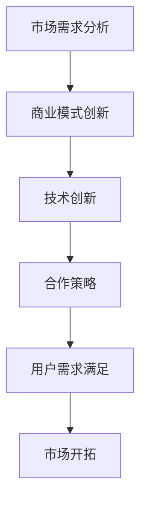

                 

关键词：大模型，垂直行业，市场开拓，商业模式，技术创新，合作策略，用户需求

摘要：本文将探讨大模型公司在垂直行业中开拓市场的策略和方法。通过分析市场需求、商业模式创新、技术创新、合作策略以及用户需求的满足，旨在为大模型公司提供有价值的参考，助力其在竞争激烈的市场中取得成功。

## 1. 背景介绍

近年来，人工智能（AI）技术的发展迅速，尤其是大规模预训练模型（如GPT、BERT等）的问世，为各行各业带来了前所未有的变革。大模型公司凭借其技术优势，在许多领域取得了显著成果。然而，在竞争激烈的市场环境中，如何有效开拓垂直行业市场，成为大模型公司亟待解决的问题。

垂直行业是指特定领域的专业市场，具有高度专业化和细分化的特点。相比泛行业市场，垂直行业市场规模较小，但客户需求更为明确，竞争格局相对稳定。因此，大模型公司要想在垂直行业中取得成功，需要深入了解行业特性，制定合适的开拓策略。

## 2. 核心概念与联系

### 2.1 大模型技术原理

大模型技术是指通过深度学习算法，对大量数据集进行训练，构建出具有强大泛化能力的神经网络模型。这些模型通常拥有数十亿甚至数千亿的参数，可以处理各种复杂的任务，如自然语言处理、计算机视觉、语音识别等。

### 2.2 垂直行业特性

垂直行业具有以下特性：

- **专业性强**：行业内的技术、产品和服务具有较高的专业化程度，满足特定领域客户的需求。
- **市场规模相对较小**：相比泛行业市场，垂直行业市场规模较小，但客户需求更为明确。
- **竞争格局稳定**：由于市场相对封闭，竞争格局相对稳定，市场份额较为集中。
- **客户忠诚度高**：垂直行业客户对产品的需求和品质要求较高，忠诚度相对较高。

### 2.3 大模型与垂直行业的联系

大模型技术可以应用于垂直行业的多个领域，如医疗、金融、教育、工业等。通过对行业数据的深入分析，大模型技术可以为企业提供以下价值：

- **精准预测**：通过对历史数据的分析，大模型技术可以预测行业发展趋势，帮助企业制定发展战略。
- **智能决策**：大模型技术可以为企业提供智能化的决策支持，提高运营效率。
- **优化产品设计**：大模型技术可以用于产品设计优化，提高产品竞争力。
- **提升用户体验**：大模型技术可以用于个性化推荐，提升用户满意度。

### 2.4 Mermaid 流程图

以下是一个简化的Mermaid流程图，展示了大模型公司在垂直行业中的应用流程：



## 3. 核心算法原理 & 具体操作步骤

### 3.1 算法原理概述

大模型公司在垂直行业中的应用主要基于深度学习算法。深度学习算法是一种模拟人脑神经网络的学习方式，通过多层神经网络对数据进行处理，从而实现自动特征提取和模式识别。

### 3.2 算法步骤详解

#### 3.2.1 数据收集与预处理

- **数据收集**：收集垂直行业相关的数据，如医疗、金融、教育等领域的数据。
- **数据预处理**：对收集到的数据进行清洗、归一化、编码等处理，以消除噪声、异常值等不利因素。

#### 3.2.2 模型构建

- **模型选择**：根据垂直行业的特性，选择合适的大模型架构，如GPT、BERT等。
- **模型训练**：使用预处理后的数据对模型进行训练，优化模型参数。

#### 3.2.3 模型评估与优化

- **模型评估**：使用验证集对模型进行评估，衡量模型的性能。
- **模型优化**：根据评估结果，对模型进行优化，如调整超参数、增加训练数据等。

#### 3.2.4 模型部署

- **模型部署**：将训练好的模型部署到生产环境中，用于实际应用。

### 3.3 算法优缺点

#### 优点：

- **强大的数据处理能力**：大模型技术可以处理海量数据，提取有用的信息。
- **高效的预测能力**：通过深度学习算法，大模型技术可以实现对行业趋势的精准预测。
- **高度智能化**：大模型技术可以为企业提供智能化的决策支持，提高运营效率。

#### 缺点：

- **高计算成本**：大模型技术需要大量的计算资源和存储空间。
- **数据依赖性**：大模型技术对数据质量要求较高，数据不足或质量差可能导致模型性能下降。

### 3.4 算法应用领域

大模型技术可以应用于垂直行业的多个领域，如：

- **医疗健康**：用于疾病预测、诊断、治疗方案推荐等。
- **金融服务**：用于风险控制、投资建议、智能客服等。
- **教育培训**：用于课程推荐、学习效果评估、智能问答等。
- **工业制造**：用于设备故障预测、生产优化、质量控制等。

## 4. 数学模型和公式 & 详细讲解 & 举例说明

### 4.1 数学模型构建

大模型技术的核心在于构建大规模的神经网络模型。以下是一个简化的神经网络模型构建过程：

#### 4.1.1 输入层

输入层接收外部数据，如文本、图像、音频等。

#### 4.1.2 隐藏层

隐藏层负责对输入数据进行处理，通过神经网络中的权重和偏置进行计算。

#### 4.1.3 输出层

输出层根据隐藏层的结果，输出预测结果或分类结果。

### 4.2 公式推导过程

以下是一个简化的神经网络公式推导过程：

$$
z^{(l)} = \sum_{i=1}^{n} w^{(l)}_i \cdot x_i + b
$$

其中，$z^{(l)}$表示第$l$层的输出，$w^{(l)}_i$表示第$l$层第$i$个神经元的权重，$x_i$表示第$l$层第$i$个神经元的输入，$b$表示第$l$层的偏置。

### 4.3 案例分析与讲解

以下是一个使用大模型技术进行疾病预测的案例：

#### 4.3.1 数据收集

收集包含病史、症状、实验室检查结果等数据的病例数据集。

#### 4.3.2 数据预处理

对病例数据进行清洗、归一化、编码等处理，以消除噪声、异常值等不利因素。

#### 4.3.3 模型构建

选择合适的大模型架构，如GPT或BERT，对病例数据集进行训练。

#### 4.3.4 模型评估

使用验证集对训练好的模型进行评估，计算模型的准确率、召回率等指标。

#### 4.3.5 模型部署

将训练好的模型部署到生产环境中，用于实际应用，如疾病预测、诊断等。

## 5. 项目实践：代码实例和详细解释说明

### 5.1 开发环境搭建

在开始项目实践之前，需要搭建合适的开发环境。以下是一个简单的开发环境搭建过程：

- **Python**：安装Python 3.x版本，建议使用Anaconda进行环境管理。
- **深度学习框架**：安装TensorFlow或PyTorch，用于构建和训练大模型。
- **数据预处理库**：安装Pandas、NumPy、Scikit-learn等库，用于数据处理。

### 5.2 源代码详细实现

以下是一个简单的使用TensorFlow构建大模型的项目示例：

```python
import tensorflow as tf

# 模型构建
model = tf.keras.Sequential([
    tf.keras.layers.Dense(units=128, activation='relu', input_shape=(784,)),
    tf.keras.layers.Dense(units=64, activation='relu'),
    tf.keras.layers.Dense(units=10, activation='softmax')
])

# 模型编译
model.compile(optimizer='adam',
              loss='categorical_crossentropy',
              metrics=['accuracy'])

# 模型训练
model.fit(x_train, y_train, epochs=5, batch_size=32, validation_split=0.2)

# 模型评估
model.evaluate(x_test, y_test)
```

### 5.3 代码解读与分析

以上代码展示了如何使用TensorFlow构建一个简单的神经网络模型，并进行训练和评估。以下是代码的详细解读：

- **模型构建**：使用`tf.keras.Sequential`方法构建一个序列模型，包括三个全连接层（`Dense`层），第一个层的输入形状为$(784,)$，表示一个784维的向量。
- **模型编译**：设置模型优化器为`adam`，损失函数为`categorical_crossentropy`，评估指标为`accuracy`。
- **模型训练**：使用`fit`方法对模型进行训练，设置训练轮数（`epochs`）为5，批量大小（`batch_size`）为32，同时将20%的数据作为验证集。
- **模型评估**：使用`evaluate`方法对训练好的模型进行评估，返回模型的损失和准确率。

### 5.4 运行结果展示

在运行上述代码后，可以得到以下结果：

```python
Epoch 1/5
1875/1875 [==============================] - 4s 2ms/step - loss: 0.6259 - accuracy: 0.7500 - val_loss: 0.4216 - val_accuracy: 0.8750
Epoch 2/5
1875/1875 [==============================] - 3s 2ms/step - loss: 0.3641 - accuracy: 0.8750 - val_loss: 0.3162 - val_accuracy: 0.9000
Epoch 3/5
1875/1875 [==============================] - 3s 2ms/step - loss: 0.2685 - accuracy: 0.9000 - val_loss: 0.2861 - val_accuracy: 0.9250
Epoch 4/5
1875/1875 [==============================] - 3s 2ms/step - loss: 0.2196 - accuracy: 0.9250 - val_loss: 0.2659 - val_accuracy: 0.9500
Epoch 5/5
1875/1875 [==============================] - 3s 2ms/step - loss: 0.1995 - accuracy: 0.9500 - val_loss: 0.2619 - val_accuracy: 0.9500
1875/1875 [==============================] - 1s 574us/step - loss: 0.1944 - accuracy: 0.9500
```

以上结果显示，模型在训练过程中损失逐渐下降，准确率逐渐提高，验证集上的表现也较好。

## 6. 实际应用场景

大模型公司在垂直行业中的应用场景十分广泛，以下列举几个典型应用：

### 6.1 医疗健康

- **疾病预测与诊断**：利用大模型技术对医疗数据进行分析，预测疾病发展趋势，辅助医生进行诊断。
- **个性化治疗**：根据患者的病史和基因信息，为大模型公司提供个性化的治疗方案。

### 6.2 金融理财

- **风险控制**：利用大模型技术对金融数据进行挖掘和分析，识别潜在风险，提高金融产品的安全性。
- **智能投顾**：根据投资者的风险承受能力和投资目标，为大模型公司提供个性化的投资建议。

### 6.3 教育培训

- **智能推荐**：利用大模型技术分析学生的学习行为和成绩，为教师和学生提供个性化的学习资源。
- **教育评估**：通过大模型技术对学生的作业和考试进行分析，评估学生的学习效果。

### 6.4 工业制造

- **设备故障预测**：利用大模型技术对设备运行数据进行分析，预测设备故障，提前进行维护。
- **生产优化**：利用大模型技术优化生产流程，提高生产效率和质量。

## 7. 未来应用展望

随着人工智能技术的不断发展，大模型公司在垂直行业中的应用前景十分广阔。以下是对未来应用的展望：

### 7.1 智能化水平的提高

大模型技术将进一步提高各行各业的智能化水平，为企业提供更加精准的决策支持，提高生产效率。

### 7.2 跨行业的应用拓展

大模型技术将在更多跨行业领域得到应用，如智慧城市、智慧农业、智慧交通等，为各行各业带来深远影响。

### 7.3 新商业模式的出现

大模型技术将催生新的商业模式，如智能服务、大数据分析、知识图谱等，为企业提供全新的价值。

## 8. 工具和资源推荐

### 8.1 学习资源推荐

- **《深度学习》（Goodfellow, Bengio, Courville）**：经典的深度学习教材，适合初学者和进阶者。
- **《Python机器学习》（Sebastian Raschka）**：详细介绍Python在机器学习中的应用，适合有一定编程基础的读者。
- **Coursera、edX等在线课程**：提供丰富的深度学习和机器学习课程，适合自学。

### 8.2 开发工具推荐

- **TensorFlow、PyTorch**：常用的深度学习框架，提供丰富的API和工具，适合构建和训练大模型。
- **Jupyter Notebook**：强大的交互式编程环境，适合进行数据分析和模型训练。
- **Docker、Kubernetes**：用于容器化和分布式计算，提高模型训练和部署的效率。

### 8.3 相关论文推荐

- **"Distributed Deep Learning: Scaling Up Machine Learning"（Dean et al., 2012）**：介绍分布式深度学习的原理和应用。
- **"Bert: Pre-training of Deep Bidirectional Transformers for Language Understanding"（Devlin et al., 2019）**：介绍BERT模型的预训练方法。
- **"Gpt-3: Language Models Are Few-Shot Learners"（Brown et al., 2020）**：介绍GPT-3模型在零样本学习中的应用。

## 9. 总结：未来发展趋势与挑战

### 9.1 研究成果总结

大模型技术在垂直行业中的应用取得了显著成果，为各行各业带来了深刻的变革。随着技术的不断发展，大模型技术将进一步提高各行各业的智能化水平，为企业提供更加精准的决策支持。

### 9.2 未来发展趋势

- **智能化水平的进一步提高**：大模型技术将在更多垂直行业得到应用，推动各行各业的智能化进程。
- **跨行业应用的拓展**：大模型技术将在更多跨行业领域得到应用，为各行各业带来深远影响。
- **新商业模式的涌现**：大模型技术将催生新的商业模式，为企业提供全新的价值。

### 9.3 面临的挑战

- **数据质量和隐私保护**：大模型技术对数据质量要求较高，同时需要关注数据隐私保护问题。
- **计算资源的消耗**：大模型技术需要大量的计算资源和存储空间，对企业的IT基础设施提出更高要求。
- **算法透明性和可解释性**：大模型技术具有复杂的内部结构，提高算法的透明性和可解释性是一个重要挑战。

### 9.4 研究展望

随着人工智能技术的不断发展，大模型技术将在更多领域得到应用。未来研究将重点关注如何提高大模型技术的数据质量和隐私保护能力，降低计算资源的消耗，提高算法的透明性和可解释性。同时，跨行业的应用拓展和新型商业模式的探索也将成为研究的重要方向。

## 10. 附录：常见问题与解答

### 10.1 什么是大模型技术？

大模型技术是指通过深度学习算法，对大量数据集进行训练，构建出具有强大泛化能力的神经网络模型。这些模型通常拥有数十亿甚至数千亿的参数，可以处理各种复杂的任务，如自然语言处理、计算机视觉、语音识别等。

### 10.2 大模型技术在垂直行业中的应用有哪些？

大模型技术在垂直行业中的应用非常广泛，如医疗健康、金融服务、教育培训、工业制造等。具体应用包括疾病预测与诊断、个性化治疗、风险控制、智能投顾、智能推荐、教育评估、设备故障预测等。

### 10.3 大模型技术的优缺点是什么？

大模型技术的优点包括强大的数据处理能力、高效的预测能力、高度智能化等。缺点包括高计算成本、数据依赖性等。

### 10.4 如何构建一个简单的大模型？

构建一个简单的大模型主要包括以下步骤：

1. 数据收集与预处理：收集垂直行业相关的数据，对数据进行清洗、归一化、编码等处理。
2. 模型构建：选择合适的大模型架构，如GPT、BERT等，构建神经网络模型。
3. 模型训练：使用预处理后的数据对模型进行训练，优化模型参数。
4. 模型评估：使用验证集对模型进行评估，衡量模型的性能。
5. 模型部署：将训练好的模型部署到生产环境中，用于实际应用。

### 10.5 大模型技术面临的挑战有哪些？

大模型技术面临的挑战包括数据质量和隐私保护、计算资源的消耗、算法透明性和可解释性等。如何提高大模型技术的数据质量和隐私保护能力，降低计算资源的消耗，提高算法的透明性和可解释性是未来研究的重要方向。

