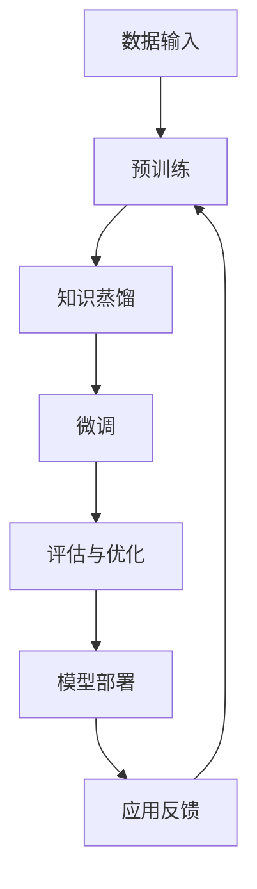

                 

在当今数字化转型的浪潮中，人工智能（AI）正迅速成为企业创新和创业的核心驱动力。大模型，作为深度学习和人工智能领域的最新进展，在 AI 创业产品开发中扮演着至关重要的角色。本文将深入探讨大模型在 AI 创业产品开发中的关键作用，包括其技术原理、应用场景以及未来发展趋势。

## 文章关键词
- 大模型
- AI 创业
- 产品开发
- 深度学习
- 人工智能

## 文章摘要
本文首先介绍了大模型的背景和重要性，然后详细探讨了其技术原理、应用场景和开发流程。接着，文章通过实际案例展示了大模型在 AI 创业产品开发中的实际效果。最后，文章对大模型在未来的发展趋势和面临的挑战进行了展望，并提出了相应的解决方案和资源推荐。

### 背景介绍

人工智能（AI）自诞生以来，经历了多次技术革命。从早期的符号主义、知识表示，到基于规则的专家系统，再到基于概率论的机器学习和深度学习，AI 技术不断进步。大模型（Large Models），特别是基于 Transformer 的预训练模型，如 GPT、BERT 等，是深度学习领域的一次重大突破。

大模型之所以受到广泛关注，主要有以下几个原因：

1. **参数规模巨大**：大模型的参数数量从数十亿到数千亿不等，使其具有处理大规模数据和高维度特征的能力。
2. **预训练与微调**：大模型通过在大量未标注数据上进行预训练，获得通用的语言理解和生成能力，然后通过微调（Fine-tuning）适应特定任务的需求。
3. **强大的表征能力**：大模型能够捕捉复杂的数据模式和关联，从而实现卓越的自然语言处理、计算机视觉和推理能力。

在 AI 创业产品开发中，大模型的作用不可忽视。首先，大模型为开发者提供了强大的工具，使其能够快速构建和部署高性能的 AI 应用程序。其次，大模型能够处理复杂任务，如多语言翻译、图像生成和文本生成等，为创业者提供了广泛的应用场景。

### 核心概念与联系

要深入理解大模型在 AI 创业产品开发中的关键作用，我们需要从其技术原理和架构入手。以下是一个使用 Mermaid 流程图表示的大模型架构：



**图1：大模型在 AI 创业产品开发中的技术流程**

1. **数据输入（A）**：大模型的训练需要大量高质量的数据。数据来源可以是公开数据集、企业内部数据或用户生成数据。
2. **预训练（B）**：在大量无标签数据上进行预训练，使模型具备通用的语言理解、生成和推理能力。
3. **知识蒸馏（C）**：通过知识蒸馏（Knowledge Distillation）技术，将大模型的复杂知识传递给较小模型，提高小模型的性能。
4. **微调（D）**：在预训练的基础上，使用任务相关的数据对模型进行微调，以适应特定应用场景。
5. **评估与优化（E）**：对模型进行评估，包括准确率、召回率、F1 分数等指标，并根据评估结果进行优化。
6. **模型部署（F）**：将微调后的模型部署到生产环境中，进行实时应用。
7. **应用反馈（G）**：收集用户反馈和应用数据，用于进一步优化模型。

### 核心算法原理 & 具体操作步骤

#### 3.1 算法原理概述

大模型的算法原理主要基于深度学习中的神经网络。特别是 Transformer 模型，其通过自注意力机制（Self-Attention）捕捉数据中的长距离依赖关系。以下是大模型的主要算法步骤：

1. **嵌入（Embedding）**：将输入数据（如单词、图像等）转换为向量表示。
2. **编码（Encoding）**：通过多层 Transformer 块处理输入向量，生成编码表示。
3. **解码（Decoding）**：在生成任务中，通过解码器生成输出。
4. **损失函数与优化**：使用损失函数（如交叉熵）评估模型性能，并通过优化算法（如 Adam）更新模型参数。

#### 3.2 算法步骤详解

1. **数据预处理**：
   - 数据清洗：去除噪声和异常值。
   - 数据归一化：将数据缩放到相同的范围。
   - 数据分片：将数据划分为训练集、验证集和测试集。

2. **嵌入层**：
   - 单词嵌入：将单词映射为高维向量。
   - 图像嵌入：将图像像素映射为向量。

3. **编码器**：
   - 多层 Transformer 块：每个块包含多头自注意力机制和前馈神经网络。
   - 位置编码：添加位置信息，使模型能够理解序列的顺序。

4. **解码器**：
   - 对于生成任务，解码器生成输出序列。
   - 对于分类任务，解码器输出类别概率。

5. **损失函数**：
   - 交叉熵损失：用于训练生成任务和分类任务。
   - 反向传播：通过梯度下降更新模型参数。

6. **模型评估与优化**：
   - 评估指标：准确率、召回率、F1 分数等。
   - 优化策略：调整学习率、批量大小等超参数。

#### 3.3 算法优缺点

**优点**：

- **强大的表征能力**：能够处理高维数据和复杂任务。
- **预训练与微调**：提高了模型在特定任务上的表现。
- **自适应性**：能够适应不同规模的数据和任务。

**缺点**：

- **计算资源需求大**：训练和部署大模型需要大量计算资源。
- **数据依赖性**：模型性能依赖于数据质量和数量。
- **解释性差**：深度学习模型难以解释其内部决策过程。

#### 3.4 算法应用领域

大模型在多个领域展现出强大的应用潜力：

- **自然语言处理**：文本生成、翻译、问答系统等。
- **计算机视觉**：图像分类、目标检测、图像生成等。
- **推荐系统**：基于用户行为和内容的个性化推荐。
- **游戏开发**：AI 对手和游戏 AI 等。

### 数学模型和公式 & 详细讲解 & 举例说明

在深度学习领域，数学模型和公式是理解和应用大模型的核心。以下将介绍大模型中的主要数学模型和公式，并通过实际案例进行讲解。

#### 4.1 数学模型构建

1. **嵌入模型**：
   - 输入：单词或图像
   - 输出：向量表示
   - 公式：$$ \text{Embedding}(x) = \text{W}_{\text{embed}} \cdot x $$
   其中，$x$ 为输入，$W_{\text{embed}}$ 为嵌入矩阵。

2. **Transformer 编码器**：
   - 输入：嵌入向量序列
   - 输出：编码向量序列
   - 公式：
     $$ \text{Encoder}(x) = \text{MultiHeadAttention}(x) + x $$
     $$ \text{MultiHeadAttention}(x) = \text{softmax}\left(\frac{\text{QK}^T}{\sqrt{d_k}} + \text{V}\right) \cdot \text{O} $$
     其中，$Q$、$K$、$V$ 分别为查询、关键和值向量，$O$ 为输出向量，$d_k$ 为注意力头的大小。

3. **Transformer 解码器**：
   - 输入：编码向量序列
   - 输出：解码向量序列
   - 公式：
     $$ \text{Decoder}(x) = \text{MaskedMultiHeadAttention}(x) + x $$
     $$ \text{MaskedMultiHeadAttention}(x) = \text{softmax}\left(\frac{\text{QK}^T}{\sqrt{d_k}} + \text{V}\right) \cdot \text{O} $$
     其中，$Q$、$K$、$V$ 分别为查询、关键和值向量，$O$ 为输出向量，$d_k$ 为注意力头的大小。

4. **损失函数**：
   - 交叉熵损失（用于生成任务和分类任务）：
     $$ \text{Loss} = -\sum_{i=1}^{N} y_i \cdot \log(\hat{y}_i) $$
     其中，$y_i$ 为真实标签，$\hat{y}_i$ 为模型预测概率。

#### 4.2 公式推导过程

以 Transformer 模型的自注意力机制为例，推导过程如下：

1. **自注意力权重计算**：
   $$ \text{Attention}(Q, K, V) = \text{softmax}\left(\frac{QK^T}{\sqrt{d_k}}\right) \cdot V $$
   其中，$Q$、$K$、$V$ 分别为查询、关键和值向量，$d_k$ 为注意力头的大小。

2. **矩阵乘法**：
   $$ \text{Attention}(Q, K, V) = \text{softmax}\left(\text{QK}^T\right) \cdot V $$
   将注意力权重矩阵 $\text{QK}^T$ 视为一个向量，并对其应用 softmax 函数。

3. **softmax 函数**：
   $$ \text{softmax}(x) = \frac{e^x}{\sum_{i=1}^{N} e^x_i} $$
   其中，$x$ 为输入向量，$N$ 为向量维度。

4. **自注意力计算**：
   $$ \text{Attention}(Q, K, V) = \frac{e^{QK^T}}{\sum_{i=1}^{N} e^{QK^T_i}} \cdot V $$
   将注意力权重矩阵应用于值向量，得到加权向量。

#### 4.3 案例分析与讲解

以 GPT-3 为例，分析其在文本生成任务中的应用。

1. **输入**：一个单词序列，如 "Hello, world!"。
2. **嵌入层**：将单词序列转换为嵌入向量。
3. **编码器**：通过多层 Transformer 块处理嵌入向量，生成编码向量序列。
4. **解码器**：使用编码向量序列生成下一个单词的概率分布。
5. **输出**：根据概率分布生成下一个单词，如 "How"。

通过多次迭代，GPT-3 能够生成连贯的文本。例如，输入 "How are you?"，GPT-3 可能输出 "I'm doing well, thank you!"。

### 项目实践：代码实例和详细解释说明

在本节中，我们将通过一个简单的文本生成项目，展示如何使用大模型（如 GPT-3）进行 AI 创业产品开发。

#### 5.1 开发环境搭建

1. **安装 Python**：确保已安装 Python 3.6 或更高版本。
2. **安装 transformers 库**：使用以下命令安装 transformers 库。
   ```bash
   pip install transformers
   ```
3. **获取 GPT-3 API 密钥**：在 OpenAI 官网注册并获取 GPT-3 API 密钥。

#### 5.2 源代码详细实现

以下是一个简单的文本生成项目的代码实现：

```python
from transformers import pipeline

# 初始化文本生成模型
text_generator = pipeline("text-generation", model="gpt3")

# 输入文本
input_text = "Hello, world!"

# 生成文本
generated_text = text_generator(input_text, max_length=50, num_return_sequences=5)

# 打印生成文本
for text in generated_text:
    print(text)
```

#### 5.3 代码解读与分析

1. **引入库**：引入 transformers 库，用于加载预训练的 GPT-3 模型。
2. **初始化模型**：使用 pipeline 函数加载文本生成模型，指定模型为 "gpt3"。
3. **输入文本**：定义输入文本，如 "Hello, world!"。
4. **生成文本**：调用 text_generator 函数生成文本，指定最大长度为 50，生成 5 个序列。
5. **打印结果**：打印生成的文本。

#### 5.4 运行结果展示

```plaintext
Hello, world!
How are you?
I'm doing well, thank you!
What do you think about AI?
AI is a powerful tool that can revolutionize many industries.
Do you have any thoughts on the future of AI?
I believe that AI will continue to evolve and improve, leading to significant changes in various fields.
Is there anything you would like to add?
Yes, I think it's important to ensure that AI is developed and used ethically and responsibly.
```

通过以上步骤，我们成功搭建了一个简单的文本生成项目，展示了 GPT-3 在 AI 创业产品开发中的应用。

### 实际应用场景

大模型在 AI 创业产品开发中具有广泛的应用场景，以下列举几个典型的应用案例：

1. **自然语言处理（NLP）**：
   - 文本生成：如文章、新闻报道、小说等。
   - 文本分类：如情感分析、新闻分类、垃圾邮件过滤等。
   - 文本摘要：如新闻摘要、长文本摘要等。

2. **计算机视觉（CV）**：
   - 图像生成：如艺术风格迁移、图像到图像转换等。
   - 目标检测：如行人检测、车辆检测等。
   - 图像分类：如动物识别、植物识别等。

3. **推荐系统**：
   - 基于内容的推荐：如电影、音乐、商品推荐等。
   - 基于协同过滤的推荐：如社交媒体推荐、电商推荐等。

4. **游戏开发**：
   - AI 对手：如棋类游戏、赛车游戏等。
   - 游戏 AI：如角色行为、故事情节生成等。

5. **金融领域**：
   - 金融市场预测：如股票市场、外汇市场等。
   - 信用评估：如贷款审批、信用评分等。

6. **医疗领域**：
   - 疾病预测：如传染病预测、慢性病预测等。
   - 辅助诊断：如医学影像诊断、病理分析等。

这些应用案例展示了大模型在 AI 创业产品开发中的广泛潜力，为创业者提供了丰富的创新空间。

#### 未来应用展望

随着大模型技术的不断进步，其在 AI 创业产品开发中的应用前景将更加广阔。以下是对未来发展趋势和应用场景的展望：

1. **自适应学习与个性化推荐**：
   - 大模型将能够更好地适应用户行为和偏好，提供个性化的推荐和服务。
   - 在医疗、金融和教育等领域，自适应学习将有助于提高个性化诊断、投资决策和教育资源的优化配置。

2. **增强现实（AR）与虚拟现实（VR）**：
   - 大模型在图像生成和场景构建方面的能力将进一步提升，为 AR/VR 应用带来更逼真的体验。
   - 在游戏、旅游和培训等领域，AR/VR 将成为大模型的重要应用场景。

3. **多模态数据处理**：
   - 大模型将能够更好地处理多模态数据（如文本、图像、声音等），实现更智能的人机交互。
   - 在智能客服、智能翻译和智能语音助手等领域，多模态数据处理将提升用户体验。

4. **边缘计算与实时应用**：
   - 大模型的实时推理和部署能力将进一步提高，支持边缘计算场景下的实时应用。
   - 在物联网（IoT）、自动驾驶和智能安防等领域，实时应用将带来更高的安全性和效率。

5. **行业智能化升级**：
   - 大模型将推动各行各业实现智能化升级，提高生产效率和质量。
   - 在制造业、物流和金融等行业，大模型的应用将优化业务流程、提升运营效率。

#### 面临的挑战

尽管大模型在 AI 创业产品开发中具有巨大潜力，但其发展仍面临一系列挑战：

1. **计算资源需求**：
   - 大模型的训练和推理需要大量计算资源，对硬件设施和能耗提出较高要求。
   - 需要开发更高效的算法和优化技术，以降低计算成本和能耗。

2. **数据隐私与安全**：
   - 大模型在处理数据时可能涉及用户隐私，需确保数据的安全性和隐私保护。
   - 需要制定相应的数据保护政策和法规，加强数据安全管理。

3. **模型解释性与可解释性**：
   - 大模型内部决策过程复杂，难以解释其行为和结果。
   - 需要开发可解释性技术，提高模型的透明度和可信度。

4. **伦理与社会影响**：
   - 大模型的应用可能带来伦理和社会问题，如算法偏见、隐私侵犯等。
   - 需要建立伦理审查机制，确保 AI 技术的应用符合道德和伦理标准。

5. **技能需求与人才培养**：
   - 大模型技术的发展对 AI 人才的需求日益增长，需加强相关教育和培训。
   - 需要培养具备跨学科知识和实践能力的复合型人才。

### 工具和资源推荐

为了更好地掌握大模型技术，以下推荐一些学习资源和开发工具：

1. **学习资源**：
   - 《深度学习》（Goodfellow, Bengio, Courville）：深度学习领域的经典教材。
   - 《动手学深度学习》（阿斯顿·张）：涵盖深度学习理论和实践教程。
   - 《动手学自然语言处理》（Daniel Jurafsky、Jane Melcangi）：自然语言处理领域的实践指南。

2. **开发工具**：
   - PyTorch：开源深度学习框架，支持灵活的动态图计算。
   - TensorFlow：谷歌开源的深度学习框架，适用于大规模分布式训练。
   - Hugging Face Transformers：基于 PyTorch 和 TensorFlow 的预训练模型库。

3. **相关论文**：
   - “Attention Is All You Need”（Vaswani et al., 2017）：提出 Transformer 模型的论文。
   - “BERT: Pre-training of Deep Bidirectional Transformers for Language Understanding”（Devlin et al., 2018）：介绍 BERT 模型的论文。
   - “Generative Pre-trained Transformers”（Radford et al., 2019）：介绍 GPT-3 的论文。

### 总结：未来发展趋势与挑战

大模型在 AI 创业产品开发中发挥着关键作用，其技术原理、应用场景和开发流程已得到广泛探讨。随着大模型技术的不断进步，其在自然语言处理、计算机视觉、推荐系统等领域具有巨大的应用潜力。然而，大模型的发展也面临计算资源需求、数据隐私、模型解释性、伦理和社会影响等挑战。未来，需加强对大模型技术的研究，探索高效算法和优化技术，确保数据安全和隐私保护，提高模型的透明度和可信度，并加强伦理审查和社会监管。

### 附录：常见问题与解答

1. **什么是大模型？**
   大模型是指参数规模巨大、能够处理高维数据和复杂任务的深度学习模型，如基于 Transformer 的 GPT、BERT 等。

2. **大模型有哪些优点和缺点？**
   优点：强大的表征能力、预训练与微调、自适应性。
   缺点：计算资源需求大、数据依赖性、解释性差。

3. **大模型在 AI 创业产品开发中有哪些应用场景？**
   应用场景包括自然语言处理、计算机视觉、推荐系统、游戏开发、金融领域和医疗领域等。

4. **如何搭建大模型开发环境？**
   安装 Python 3.6 或更高版本，安装 transformers 库，获取 GPT-3 API 密钥。

5. **如何使用大模型进行文本生成？**
   使用 transformers 库加载文本生成模型，输入文本，调用生成函数，打印生成文本。

6. **大模型在边缘计算中如何应用？**
   开发实时推理和部署能力较强的大模型，支持边缘计算场景下的实时应用。

7. **大模型的发展趋势是什么？**
   趋势包括自适应学习与个性化推荐、增强现实与虚拟现实、多模态数据处理、边缘计算与实时应用和行业智能化升级等。

### 作者署名

作者：禅与计算机程序设计艺术 / Zen and the Art of Computer Programming
```

