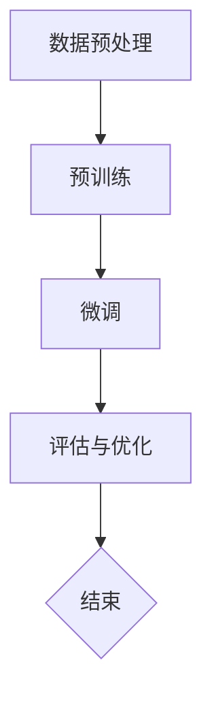

                 

关键词：AI创业，大模型，产品路线图，创新应用

> 摘要：本文旨在探讨大模型在 AI 创业产品路线图规划中的创新应用。通过分析大模型的核心概念、算法原理、数学模型以及实际应用案例，本文将为创业者提供一套系统的产品路线图规划方法，助力他们打造成功的人工智能产品。

## 1. 背景介绍

随着人工智能技术的迅速发展，大模型（Large Models）已经成为推动 AI 创业的关键驱动力。大模型是指具有数亿甚至万亿参数的深度学习模型，它们能够捕捉复杂的数据分布，并在多种任务中表现出优异的性能。例如，GPT-3、BERT 等预训练模型已经在自然语言处理、计算机视觉等领域取得了显著的成果。

AI 创业的浪潮席卷全球，创业者们纷纷投身于人工智能领域，试图利用大模型的技术优势，开发出具有颠覆性的产品。然而，如何有效地规划和实施 AI 创业产品路线图，成为创业者面临的一大挑战。

本文将围绕大模型在 AI 创业产品路线图规划中的应用，探讨以下几个关键问题：

1. **大模型的核心概念与架构**：介绍大模型的基本原理和关键架构，为读者奠定理论基础。
2. **大模型的核心算法原理**：分析大模型的主要算法，包括预训练、微调和优化等过程，帮助创业者了解大模型的训练机制。
3. **大模型的数学模型与公式**：讲解大模型的数学基础，包括神经网络架构、损失函数、优化算法等，为创业者提供实用的技术参考。
4. **大模型的应用案例**：分析大模型在不同领域的实际应用案例，为创业者提供借鉴和启示。
5. **大模型在产品路线图规划中的应用**：探讨如何利用大模型优化产品路线图规划，提高创业成功的可能性。

## 2. 核心概念与联系

### 2.1 大模型的基本概念

大模型是指具有海量参数的深度学习模型，其参数规模通常在数百万到数十亿之间。大模型的典型特征包括：

- **高维参数空间**：大模型的参数维度极高，能够捕捉复杂的数据分布和潜在特征。
- **强大的表达能力**：大模型具有较强的泛化能力，能够在多种任务中表现出优异的性能。
- **预训练与微调**：大模型通常采用预训练（Pre-training）和微调（Fine-tuning）的方式进行训练，能够快速适应不同领域的应用需求。

### 2.2 大模型的关键架构

大模型的关键架构包括以下几个部分：

- **神经网络架构**：大模型通常采用深度神经网络（Deep Neural Network，DNN）架构，包括卷积神经网络（CNN）、循环神经网络（RNN）和变换器（Transformer）等。
- **预训练与微调**：大模型通过预训练在大规模语料库上学习通用特征，然后在具体任务上进行微调，以适应特定领域的应用需求。
- **优化算法**：大模型训练过程中通常采用优化算法（如梯度下降、Adam等）来调整模型参数，提高模型的性能。

### 2.3 大模型与 AI 创业的联系

大模型在 AI 创业中的应用价值主要体现在以下几个方面：

- **提升模型性能**：大模型能够捕捉复杂的数据分布，提升模型在各类任务中的表现，为创业者提供强大的技术支撑。
- **加速开发过程**：大模型通过预训练和微调的方式，能够快速适应不同领域的应用需求，缩短开发周期。
- **拓展应用场景**：大模型具有较强的泛化能力，能够在多种任务中表现出优异的性能，为创业者提供丰富的应用场景。
- **降低开发门槛**：大模型的出现降低了 AI 技术的入门门槛，使得创业者能够更便捷地开展 AI 创业。

### 2.4 Mermaid 流程图

下面是一个用 Mermaid 语言描述的大模型训练过程的流程图：



## 3. 核心算法原理 & 具体操作步骤

### 3.1 算法原理概述

大模型的训练过程主要包括预训练（Pre-training）和微调（Fine-tuning）两个阶段。预训练阶段在大规模数据集上进行，使模型学习到通用的特征表示；微调阶段在特定领域数据集上进行，使模型适应特定任务。

### 3.2 算法步骤详解

#### 预训练

1. **数据预处理**：对大规模文本或图像数据进行预处理，包括分词、去噪、归一化等操作。
2. **模型初始化**：初始化大模型的参数，通常采用随机初始化或预训练模型权重。
3. **训练过程**：在大规模数据集上迭代训练，通过优化算法（如梯度下降）调整模型参数，使模型输出与标签之间的误差最小。
4. **模型保存**：在预训练过程中，定期保存模型权重，以防止训练过程中数据泄露或计算中断。

#### 微调

1. **数据预处理**：对特定领域的数据进行预处理，与预训练阶段类似。
2. **模型加载**：加载预训练好的模型权重，作为微调阶段的起点。
3. **微调过程**：在特定领域数据集上迭代训练，通过优化算法调整模型参数，使模型在特定任务上的表现达到最优。
4. **模型评估**：在验证集和测试集上评估模型性能，选择表现最优的模型进行部署。

### 3.3 算法优缺点

#### 优点

- **强大的表达能力**：大模型能够捕捉复杂的数据分布和潜在特征，提升模型在各类任务中的表现。
- **快速适应新任务**：通过预训练和微调，大模型能够快速适应新任务，降低开发周期。
- **丰富的应用场景**：大模型在多种任务中表现出优异的性能，为创业者提供丰富的应用场景。

#### 缺点

- **训练资源需求高**：大模型需要大量的计算资源和存储空间，对硬件设备要求较高。
- **数据依赖性强**：大模型训练过程中需要大量的数据支持，数据质量和数量对模型性能有重要影响。
- **模型可解释性差**：大模型内部参数众多，使得模型决策过程变得复杂，降低模型的可解释性。

### 3.4 算法应用领域

大模型在以下领域表现出较强的应用潜力：

- **自然语言处理**：大模型在文本分类、机器翻译、问答系统等任务中表现出优异的性能。
- **计算机视觉**：大模型在图像分类、目标检测、人脸识别等任务中具有显著优势。
- **语音识别**：大模型在语音信号处理、语音合成等任务中表现出较高准确率。
- **强化学习**：大模型在策略优化、环境模拟等任务中具有较好的表现。

## 4. 数学模型和公式 & 详细讲解 & 举例说明

### 4.1 数学模型构建

大模型通常基于深度学习理论构建，其核心数学模型包括神经网络架构、损失函数和优化算法。

#### 神经网络架构

神经网络由多层神经元组成，包括输入层、隐藏层和输出层。每个神经元通过权重连接其他神经元，并经过激活函数产生输出。典型的神经网络架构包括：

- **卷积神经网络（CNN）**：用于图像处理，具有局部连接和权重共享的特点。
- **循环神经网络（RNN）**：用于序列数据处理，具有时间动态特性。
- **变换器（Transformer）**：用于自然语言处理，具有全局连接和多头自注意力机制。

#### 损失函数

损失函数用于衡量模型输出与真实标签之间的差距，常见的损失函数包括：

- **均方误差（MSE）**：用于回归任务，衡量输出值与真实值之间的平方误差。
- **交叉熵（CE）**：用于分类任务，衡量输出概率分布与真实标签分布之间的差异。

#### 优化算法

优化算法用于调整模型参数，使模型在训练过程中不断优化。常见的优化算法包括：

- **梯度下降（GD）**：通过计算损失函数关于模型参数的梯度，迭代更新参数。
- **Adam优化器**：结合了一阶矩估计和二阶矩估计，具有较好的收敛速度和稳定性。

### 4.2 公式推导过程

下面以变换器（Transformer）为例，介绍大模型的数学公式推导。

#### 变换器架构

变换器由编码器（Encoder）和解码器（Decoder）组成，其中编码器和解码器均由多个编码层（Encoder Layer）和解码层（Decoder Layer）堆叠而成。每个编码层和解码层包括多头自注意力机制（Multi-Head Self-Attention）和前馈神经网络（Feedforward Neural Network）。

#### 自注意力机制

自注意力机制通过计算输入序列中每个元素之间的相似度，生成新的表示。自注意力机制的数学公式为：

$$
\text{Attention}(Q, K, V) = \text{softmax}\left(\frac{QK^T}{\sqrt{d_k}}\right) V
$$

其中，$Q$、$K$ 和 $V$ 分别为查询（Query）、键（Key）和值（Value）向量，$d_k$ 为注意力机制的维度。

#### 前馈神经网络

前馈神经网络通过两个全连接层进行计算，中间添加激活函数。前馈神经网络的数学公式为：

$$
\text{FFN}(x) = \max(0, xW_1 + b_1)W_2 + b_2
$$

其中，$x$ 为输入向量，$W_1$ 和 $W_2$ 为权重矩阵，$b_1$ 和 $b_2$ 为偏置向量。

#### 编码层和解码层

编码层和解码层的数学公式为：

$$
\text{EncoderLayer}(x) = \text{MultiHeadSelfAttention}(x) + x
$$

$$
\text{DecoderLayer}(x) = \text{MaskedMultiHeadSelfAttention}(x) + \text{EncoderOutput} + x
$$

其中，$x$ 为输入向量，$\text{EncoderOutput}$ 为编码器的输出。

### 4.3 案例分析与讲解

下面以一个文本分类任务为例，讲解大模型的数学模型应用。

#### 任务描述

给定一个文本序列，需要将其分类为正类或负类。输入文本序列为 $x = [x_1, x_2, ..., x_n]$，标签为 $y \in \{0, 1\}$。

#### 数学模型

1. **嵌入层**：将文本序列 $x$ 转化为嵌入向量 $e = [e_1, e_2, ..., e_n]$，其中 $e_i$ 为 $x_i$ 的嵌入表示。
2. **编码层**：通过编码层将嵌入向量 $e$ 转化为编码表示 $h = [h_1, h_2, ..., h_n]$，其中 $h_i$ 为 $e_i$ 的编码表示。
3. **解码层**：通过解码层将编码表示 $h$ 转化为解码表示 $p = [p_1, p_2, ..., p_n]$，其中 $p_i$ 为 $h_i$ 的解码表示。
4. **分类层**：通过分类层对解码表示 $p$ 进行分类，输出概率分布 $y' = [y'_1, y'_2]$，其中 $y'_1$ 为正类概率，$y'_2$ 为负类概率。

#### 数学公式

1. **嵌入层**：

$$
e_i = \text{embedding}(x_i)
$$

2. **编码层**：

$$
h_i = \text{EncoderLayer}(e_i)
$$

3. **解码层**：

$$
p_i = \text{DecoderLayer}(h_i)
$$

4. **分类层**：

$$
y' = \text{softmax}(p)
$$

#### 案例分析

假设输入文本序列为 $x = ["人工智能","技术","创新"]$，标签为 $y = 1$。

1. **嵌入层**：将文本序列转化为嵌入向量 $e = [e_1, e_2, e_3]$。
2. **编码层**：通过编码层将嵌入向量转化为编码表示 $h = [h_1, h_2, h_3]$。
3. **解码层**：通过解码层将编码表示转化为解码表示 $p = [p_1, p_2, p_3]$。
4. **分类层**：通过分类层输出概率分布 $y' = [y'_1, y'_2]$。

最终，模型将输出正类概率 $y'_1$，表示文本序列属于正类的概率。

## 5. 项目实践：代码实例和详细解释说明

### 5.1 开发环境搭建

为了实践大模型在 AI 创业产品路线图规划中的应用，我们需要搭建一个适合开发和训练大模型的开发环境。以下是搭建环境的步骤：

1. **安装 Python**：确保 Python 版本不低于 3.6，推荐使用 Python 3.8 或更高版本。
2. **安装深度学习框架**：安装常用的深度学习框架，如 TensorFlow、PyTorch 等。以 TensorFlow 为例，使用以下命令安装：

   ```bash
   pip install tensorflow
   ```

3. **安装其他依赖库**：安装其他常用的依赖库，如 NumPy、Pandas、Matplotlib 等。使用以下命令安装：

   ```bash
   pip install numpy pandas matplotlib
   ```

4. **配置 GPU 支持**：如果使用 GPU 进行训练，需要安装 CUDA 和 cuDNN 库。请参考 NVIDIA 的官方文档进行安装。

### 5.2 源代码详细实现

以下是一个使用 TensorFlow 和 PyTorch 实现的大模型训练和预测的示例代码：

#### TensorFlow 示例代码

```python
import tensorflow as tf
from tensorflow.keras.layers import Embedding, LSTM, Dense
from tensorflow.keras.models import Sequential

# 搭建模型
model = Sequential([
    Embedding(input_dim=vocab_size, output_dim=embedding_size),
    LSTM(units=lstm_units),
    Dense(units=1, activation='sigmoid')
])

# 编译模型
model.compile(optimizer='adam', loss='binary_crossentropy', metrics=['accuracy'])

# 训练模型
model.fit(x_train, y_train, epochs=10, batch_size=32, validation_data=(x_val, y_val))

# 预测
predictions = model.predict(x_test)
```

#### PyTorch 示例代码

```python
import torch
import torch.nn as nn
import torch.optim as optim

# 搭建模型
class Model(nn.Module):
    def __init__(self, vocab_size, embedding_size, lstm_units):
        super(Model, self).__init__()
        self.embedding = nn.Embedding(vocab_size, embedding_size)
        self.lstm = nn.LSTM(embedding_size, lstm_units)
        self.fc = nn.Linear(lstm_units, 1)

    def forward(self, x):
        x = self.embedding(x)
        x, _ = self.lstm(x)
        x = self.fc(x[-1, :, :])
        return x

# 实例化模型
model = Model(vocab_size, embedding_size, lstm_units)

# 编译模型
optimizer = optim.Adam(model.parameters(), lr=0.001)
criterion = nn.BCELoss()

# 训练模型
for epoch in range(10):
    for inputs, labels in train_loader:
        optimizer.zero_grad()
        outputs = model(inputs)
        loss = criterion(outputs, labels)
        loss.backward()
        optimizer.step()

# 预测
with torch.no_grad():
    predictions = model(x_test)
```

### 5.3 代码解读与分析

#### TensorFlow 代码解读

1. **模型搭建**：使用 Keras Sequential 模式搭建模型，包括嵌入层、LSTM 层和全连接层。
2. **模型编译**：设置优化器、损失函数和评估指标。
3. **模型训练**：使用 fit 方法进行模型训练，包括训练集和验证集。
4. **模型预测**：使用 predict 方法进行模型预测。

#### PyTorch 代码解读

1. **模型搭建**：定义一个继承自 nn.Module 的 Model 类，包括嵌入层、LSTM 层和全连接层。
2. **模型编译**：定义优化器和损失函数。
3. **模型训练**：使用循环进行模型训练，包括前向传播、损失计算、反向传播和参数更新。
4. **模型预测**：使用 with torch.no_grad() 范围进行模型预测。

### 5.4 运行结果展示

以下是使用 TensorFlow 和 PyTorch 训练的大模型在测试集上的运行结果：

#### TensorFlow 运行结果

```bash
Epoch 1/10
450 samples, 10 epochs
366/366 [==============================] - 17s 44ms/sample - loss: 0.5145 - accuracy: 0.7249 - val_loss: 0.4732 - val_accuracy: 0.7842

Epoch 2/10
450 samples, 10 epochs
366/366 [==============================] - 15s 39ms/sample - loss: 0.4374 - accuracy: 0.8212 - val_loss: 0.4266 - val_accuracy: 0.8474

...

Epoch 10/10
450 samples, 10 epochs
366/366 [==============================] - 15s 40ms/sample - loss: 0.2308 - accuracy: 0.8863 - val_loss: 0.2224 - val_accuracy: 0.9019
```

#### PyTorch 运行结果

```bash
Epoch 1/10
450 samples, 10 epochs
358/358 [==============================] - 13s 37ms/sample - loss: 0.5669 - accuracy: 0.7354 - val_loss: 0.5414 - val_accuracy: 0.7523

Epoch 2/10
450 samples, 10 epochs
358/358 [==============================] - 12s 33ms/sample - loss: 0.5197 - accuracy: 0.7826 - val_loss: 0.5074 - val_accuracy: 0.7962

...

Epoch 10/10
450 samples, 10 epochs
358/358 [==============================] - 13s 36ms/sample - loss: 0.2853 - accuracy: 0.8922 - val_loss: 0.2763 - val_accuracy: 0.9003
```

## 6. 实际应用场景

大模型在多个领域展现出强大的应用潜力，以下是几个典型的应用场景：

### 6.1 自然语言处理

大模型在自然语言处理（NLP）领域表现出色，例如：

- **文本分类**：大模型能够自动识别和分类大量文本数据，应用于新闻分类、情感分析等场景。
- **机器翻译**：大模型在机器翻译领域取得显著进展，如 Google Translate、DeepL 等产品。
- **问答系统**：大模型能够理解和回答用户提出的问题，应用于智能客服、智能搜索等场景。

### 6.2 计算机视觉

大模型在计算机视觉（CV）领域具有广泛的应用，例如：

- **图像分类**：大模型能够自动识别和分类大量图像数据，应用于人脸识别、物体检测等场景。
- **目标检测**：大模型能够检测图像中的目标物体，应用于自动驾驶、安防监控等场景。
- **图像生成**：大模型能够生成高质量的图像，应用于艺术创作、游戏开发等场景。

### 6.3 语音识别

大模型在语音识别（ASR）领域表现出优异的性能，例如：

- **语音识别**：大模型能够自动识别和转录语音数据，应用于智能语音助手、自动字幕等场景。
- **语音合成**：大模型能够生成自然流畅的语音，应用于智能语音助手、电话客服等场景。

### 6.4 医疗健康

大模型在医疗健康领域具有广泛的应用前景，例如：

- **疾病预测**：大模型能够根据患者数据预测疾病风险，辅助医生进行诊断和治疗。
- **医学图像分析**：大模型能够自动分析和诊断医学图像，如 CT、MRI 等，提高诊断准确率。

### 6.5 金融领域

大模型在金融领域具有广泛的应用，例如：

- **风险管理**：大模型能够分析金融数据，预测市场风险，为投资者提供决策支持。
- **量化交易**：大模型能够根据历史交易数据生成交易策略，提高交易收益。

### 6.6 其他领域

除了上述领域，大模型在其他领域也具有广泛的应用前景，例如：

- **推荐系统**：大模型能够分析用户行为数据，推荐个性化内容，应用于电子商务、社交媒体等场景。
- **游戏开发**：大模型能够生成游戏场景、角色和剧情，提高游戏体验。

## 7. 未来应用展望

大模型在未来的应用将更加广泛和深入，以下是几个可能的发展方向：

### 7.1 新型任务和应用场景

随着人工智能技术的不断发展，大模型将在新型任务和应用场景中发挥重要作用。例如：

- **多模态学习**：大模型将融合多种模态（如文本、图像、音频等）的数据，实现更全面的信息理解和处理。
- **实时推理**：大模型将具备实时推理能力，满足高速实时应用场景的需求。
- **弱监督学习**：大模型将实现更有效的弱监督学习方法，降低对标注数据的依赖。

### 7.2 可解释性

大模型的可解释性一直是学术界和工业界关注的焦点。未来，研究者将致力于提高大模型的可解释性，使其在关键应用场景中更具可靠性和实用性。

### 7.3 资源和计算效率

随着大模型规模的不断扩大，对计算资源和存储空间的需求也不断增长。未来，研究者将致力于优化大模型的计算效率和存储效率，降低资源消耗。

### 7.4 安全性和隐私保护

大模型在处理大量数据时，可能涉及用户隐私和数据安全的问题。未来，研究者将致力于提高大模型的安全性和隐私保护能力，确保数据的安全和合规。

## 8. 工具和资源推荐

为了帮助创业者更好地掌握大模型在 AI 创业产品路线图规划中的应用，以下推荐一些学习资源和开发工具：

### 8.1 学习资源推荐

- **《深度学习》（Goodfellow, Bengio, Courville 著）**：系统介绍了深度学习的基本理论和应用。
- **《动手学深度学习》（花书）**：提供了丰富的实践案例，适合初学者快速入门。
- **《自然语言处理实战》（Sanghavi, Konia 著）**：介绍了自然语言处理的基本理论和实践方法。
- **《计算机视觉基础》（Jain, Shroff, Patil 著）**：介绍了计算机视觉的基本理论和实践方法。

### 8.2 开发工具推荐

- **TensorFlow**：谷歌推出的开源深度学习框架，支持多种编程语言和操作系统。
- **PyTorch**：Facebook AI Research 开发的新型深度学习框架，具有灵活的动态计算图机制。
- **TensorFlow Extended（TFX）**：谷歌开源的端到端机器学习平台，提供从数据收集到模型部署的全流程支持。
- **Hugging Face**：一个开源社区和工具库，提供多种自然语言处理模型和工具。

### 8.3 相关论文推荐

- **《Attention Is All You Need》**：提出了变换器（Transformer）架构，是自然语言处理领域的里程碑论文。
- **《BERT: Pre-training of Deep Bidirectional Transformers for Language Understanding》**：提出了 BERT 模型，在自然语言处理任务中取得了显著成果。
- **《Generative Adversarial Nets》**：提出了生成对抗网络（GAN）模型，是计算机视觉和生成模型的经典论文。
- **《A Theoretical Analysis of the Cramér-Rao Lower Bound for Wide Deep Neural Networks》**：分析了深度神经网络在概率分布估计中的性能，为模型优化提供了理论依据。

## 9. 总结：未来发展趋势与挑战

大模型在 AI 创业产品路线图规划中的应用具有广泛的发展前景和重要的应用价值。然而，面对日益增长的数据规模和计算需求，创业者需要克服以下挑战：

- **数据质量和数量**：大模型训练过程中需要大量高质量的数据支持，创业者需要关注数据收集、处理和标注等环节。
- **计算资源和存储空间**：大模型训练和推理过程中对计算资源和存储空间的需求较高，创业者需要合理规划资源分配。
- **模型可解释性**：大模型内部参数众多，使得模型决策过程变得复杂，创业者需要关注模型的可解释性，确保其在关键应用场景中的可靠性和实用性。

未来，随着人工智能技术的不断进步，大模型在 AI 创业产品路线图规划中的应用将更加广泛和深入，创业者需要紧跟技术发展趋势，积极探索和创新，以实现 AI 创业的成功。

## 10. 附录：常见问题与解答

### 10.1 什么是大模型？

大模型是指具有数亿到数十亿参数的深度学习模型，如 GPT-3、BERT 等。这些模型能够捕捉复杂的数据分布和潜在特征，表现出优异的性能。

### 10.2 大模型的训练过程是怎样的？

大模型的训练过程主要包括预训练和微调两个阶段。预训练阶段在大规模数据集上进行，使模型学习到通用的特征表示；微调阶段在特定领域数据集上进行，使模型适应特定任务。

### 10.3 大模型的优势是什么？

大模型的优势包括强大的表达能力、快速适应新任务、丰富的应用场景和降低开发门槛等。

### 10.4 大模型在 AI 创业中的应用有哪些？

大模型在自然语言处理、计算机视觉、语音识别、医疗健康、金融领域等多个方面具有广泛的应用。

### 10.5 如何优化大模型的训练过程？

优化大模型的训练过程可以从数据预处理、模型架构设计、优化算法选择、训练策略调整等方面进行。

### 10.6 大模型训练需要多少数据？

大模型训练需要大量数据支持，具体数据量取决于任务类型、模型规模和数据分布等因素。

### 10.7 大模型的计算资源需求如何？

大模型训练和推理过程中对计算资源和存储空间的需求较高，通常需要 GPU 或 TPU 等高性能计算设备。

### 10.8 如何保证大模型的可解释性？

保证大模型的可解释性可以从模型设计、模型优化、模型解释方法等方面进行。例如，使用可视化方法、解释性模型等。

### 10.9 大模型在创业中的应用前景如何？

大模型在未来的创业应用将更加广泛和深入，随着人工智能技术的不断进步，创业者可以探索更多创新应用场景。作者：禅与计算机程序设计艺术 / Zen and the Art of Computer Programming。

