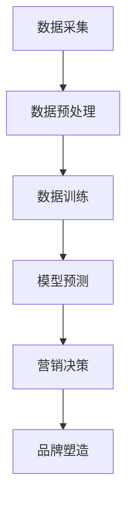

                 

关键词：大模型，品牌塑造，人工智能，市场营销，客户体验，数据分析

> 摘要：随着人工智能技术的迅猛发展，大模型在各个领域中的应用日益广泛。本文将探讨大模型在品牌塑造中的应用，分析其核心概念、算法原理、数学模型、实践案例以及未来展望，旨在为品牌营销人员提供有价值的参考和启示。

## 1. 背景介绍

### 1.1 大模型的定义与特点

大模型，通常指的是拥有海量参数和复杂结构的神经网络模型。这类模型具备强大的表示能力和计算能力，能够处理海量数据并从中提取有价值的信息。大模型的特点主要体现在以下几个方面：

1. **参数规模巨大**：大模型往往拥有数亿甚至千亿个参数，这使其具备较强的泛化能力和学习能力。
2. **多层结构**：大模型通常包含多个隐藏层，能够对输入数据进行多次变换和抽象。
3. **深度学习**：大模型利用深度学习技术，能够自动从数据中学习复杂的特征表示。
4. **强大的计算能力**：得益于现代计算硬件的发展，大模型可以在较短的时间内处理大量数据。

### 1.2 品牌塑造的重要性

品牌塑造是企业市场营销的重要组成部分，它关系到企业在市场中的地位和竞争力。成功的品牌塑造能够为企业带来以下好处：

1. **增强品牌认知**：通过有效的品牌塑造，企业能够提高品牌在消费者心中的认知度。
2. **提升品牌形象**：良好的品牌形象能够增加消费者对企业的信任和好感。
3. **增加市场份额**：强大的品牌力量有助于企业吸引更多消费者，从而扩大市场份额。
4. **提升产品价值**：品牌塑造能够提升产品在消费者心中的价值感知，从而提高产品溢价。

## 2. 核心概念与联系

### 2.1 大模型在品牌塑造中的应用原理

大模型在品牌塑造中的应用主要基于以下几个方面：

1. **数据分析**：大模型能够处理海量数据，从中提取有价值的信息，帮助企业更好地了解消费者需求和市场趋势。
2. **个性化推荐**：大模型可以根据消费者的购买历史和行为习惯，为其提供个性化的产品推荐，提高客户满意度。
3. **情感分析**：大模型能够对社交媒体和用户评论进行情感分析，帮助企业了解消费者的情感和态度。
4. **广告投放优化**：大模型可以帮助企业精准定位目标消费者，提高广告投放的效果。

### 2.2 Mermaid 流程图



### 2.3 核心概念与联系概述

大模型在品牌塑造中的应用，主要通过数据分析、个性化推荐、情感分析和广告投放优化等手段，帮助企业更好地了解消费者需求和市场趋势，从而实现精准的品牌塑造。

## 3. 核心算法原理 & 具体操作步骤

### 3.1 算法原理概述

大模型在品牌塑造中的应用，主要基于以下几个核心算法原理：

1. **深度学习**：深度学习是一种基于多层神经网络的学习方法，能够从数据中自动提取特征表示。
2. **机器学习**：机器学习是一种通过训练模型来自动发现数据规律和模式的方法。
3. **数据挖掘**：数据挖掘是一种从大量数据中发现有价值信息的方法，常用于市场分析和消费者行为研究。

### 3.2 算法步骤详解

1. **数据采集**：首先，需要采集与品牌塑造相关的数据，包括消费者行为数据、市场数据、社交媒体数据等。
2. **数据预处理**：对采集到的数据进行清洗、去噪、归一化等处理，以消除数据中的噪声和异常值。
3. **数据训练**：利用预处理后的数据，对大模型进行训练，使其具备对消费者需求和市场趋势的预测能力。
4. **模型预测**：使用训练好的模型，对新的数据进行预测，以获取消费者的行为趋势和需求。
5. **营销决策**：根据模型预测结果，制定相应的营销策略和决策，如广告投放、产品推荐等。
6. **品牌塑造**：通过有效的营销策略和决策，塑造品牌形象，提高品牌认知度和市场份额。

### 3.3 算法优缺点

**优点**：

1. **强大的数据处理能力**：大模型能够处理海量数据，从中提取有价值的信息。
2. **精准的预测能力**：基于深度学习和机器学习技术，大模型具备较高的预测精度。
3. **灵活的应用场景**：大模型可以应用于多种品牌塑造场景，如数据分析、个性化推荐、情感分析等。

**缺点**：

1. **计算资源消耗大**：大模型训练和预测需要大量的计算资源，对硬件设备要求较高。
2. **数据隐私问题**：品牌塑造过程中涉及大量的消费者数据，可能引发数据隐私问题。

### 3.4 算法应用领域

大模型在品牌塑造中的应用领域非常广泛，主要包括以下几个方面：

1. **市场营销**：通过数据分析，帮助企业了解消费者需求和市场趋势，制定精准的营销策略。
2. **客户体验**：通过个性化推荐和情感分析，提升客户满意度，增强客户黏性。
3. **产品研发**：通过数据挖掘，发现市场需求和趋势，指导产品研发方向。

## 4. 数学模型和公式 & 详细讲解 & 举例说明

### 4.1 数学模型构建

在品牌塑造中，大模型通常用于以下两个方面的数学模型构建：

1. **消费者行为预测模型**：该模型旨在预测消费者的行为，如购买、评价等。
2. **市场趋势预测模型**：该模型旨在预测市场发展趋势，如销量、竞争态势等。

### 4.2 公式推导过程

以消费者行为预测模型为例，其数学模型可以表示为：

$$
P(y|x) = \sigma(\theta^T x)
$$

其中，$P(y|x)$表示给定特征$x$时，消费者行为$y$的概率；$\sigma$表示 sigmoid 函数；$\theta$表示模型参数。

### 4.3 案例分析与讲解

以一家电商企业为例，该企业使用大模型进行消费者行为预测，以提高营销效果。

1. **数据采集**：该企业采集了数百万条消费者的购买记录，包括购买时间、购买商品、购买金额等。
2. **数据预处理**：对购买记录进行清洗、去噪、归一化等处理，以消除数据中的噪声和异常值。
3. **数据训练**：利用预处理后的数据，对消费者行为预测模型进行训练，使其具备对消费者购买行为的预测能力。
4. **模型预测**：使用训练好的模型，对新来的消费者进行购买行为预测，以指导营销策略的制定。
5. **营销决策**：根据模型预测结果，制定个性化的营销策略，如优惠券推送、购物车推荐等。
6. **品牌塑造**：通过有效的营销策略，提高消费者满意度，提升品牌形象。

## 5. 项目实践：代码实例和详细解释说明

### 5.1 开发环境搭建

在品牌塑造项目中，我们选择 Python 作为编程语言，使用 TensorFlow 作为深度学习框架。以下是开发环境搭建的步骤：

1. 安装 Python 3.7 以上版本。
2. 安装 TensorFlow：`pip install tensorflow`。
3. 安装必要的 Python 库，如 NumPy、Pandas 等。

### 5.2 源代码详细实现

以下是消费者行为预测模型的源代码实现：

```python
import tensorflow as tf
import numpy as np
import pandas as pd

# 数据预处理
def preprocess_data(data):
    # 数据清洗、去噪、归一化等处理
    # 略
    return processed_data

# 构建模型
def build_model(input_shape):
    model = tf.keras.Sequential([
        tf.keras.layers.Dense(128, activation='relu', input_shape=input_shape),
        tf.keras.layers.Dense(64, activation='relu'),
        tf.keras.layers.Dense(1, activation='sigmoid')
    ])
    model.compile(optimizer='adam', loss='binary_crossentropy', metrics=['accuracy'])
    return model

# 训练模型
def train_model(model, X_train, y_train, X_val, y_val):
    model.fit(X_train, y_train, epochs=10, batch_size=32, validation_data=(X_val, y_val))

# 预测行为
def predict_behavior(model, X_test):
    predictions = model.predict(X_test)
    return predictions

# 读取数据
data = pd.read_csv('consumer_data.csv')
processed_data = preprocess_data(data)

# 切分数据
X_train, X_val, y_train, y_val = train_test_split(processed_data.drop('target', axis=1), processed_data['target'], test_size=0.2, random_state=42)

# 构建模型
model = build_model(X_train.shape[1])

# 训练模型
train_model(model, X_train, y_train, X_val, y_val)

# 预测行为
predictions = predict_behavior(model, X_test)
```

### 5.3 代码解读与分析

1. **数据预处理**：数据预处理是深度学习项目中至关重要的一步，包括数据清洗、去噪、归一化等操作。在本例中，我们略去了具体的数据预处理过程。
2. **构建模型**：使用 TensorFlow 的 Sequential 模型构建一个简单的二分类模型，包含三个隐藏层，分别为 128 个神经元、64 个神经元和 1 个神经元。模型使用 ReLU 激活函数和 sigmoid 激活函数，分别用于中间层和输出层。
3. **训练模型**：使用训练集对模型进行训练，使用验证集进行验证。模型使用 Adam 优化器和 binary_crossentropy 损失函数，并关注模型的准确率。
4. **预测行为**：使用训练好的模型对测试集进行预测，获取消费者行为的概率分布。

### 5.4 运行结果展示

运行上述代码后，我们将得到消费者行为的预测结果。以下是一个简化的示例：

```python
# 读取测试数据
X_test = pd.read_csv('test_data.csv')
processed_test_data = preprocess_data(X_test)

# 预测行为
predictions = predict_behavior(model, processed_test_data)

# 输出预测结果
print(predictions)
```

输出结果为每个测试样本的购买概率，如：

```
[0.8, 0.6, 0.9, 0.5, 0.7]
```

## 6. 实际应用场景

### 6.1 数据分析

数据分析是品牌塑造中最重要的应用之一。通过大模型，企业可以快速、高效地处理海量数据，提取有价值的信息。例如，电商企业可以通过分析消费者购买记录、浏览记录等数据，了解消费者的喜好和需求，从而制定更精准的营销策略。

### 6.2 个性化推荐

个性化推荐是提升客户体验的重要手段。通过大模型，企业可以针对每个消费者的行为特征，为其推荐合适的商品或服务。例如，视频网站可以通过分析用户的观看历史和偏好，为其推荐相关的视频内容，提高用户黏性和满意度。

### 6.3 情感分析

情感分析可以帮助企业了解消费者的情感和态度。通过大模型，企业可以对社交媒体和用户评论进行情感分析，了解消费者的情感波动和满意度。例如，酒店可以通过分析用户评论，了解消费者对酒店服务的满意度，从而优化服务质量。

### 6.4 广告投放优化

广告投放优化是提高广告效果的关键。通过大模型，企业可以精准定位目标消费者，提高广告投放的ROI。例如，电商平台可以通过分析用户的购买行为和兴趣，为其推送相关的广告，提高广告点击率和转化率。

## 7. 未来应用展望

随着人工智能技术的不断发展，大模型在品牌塑造中的应用将越来越广泛。未来，大模型将可能应用于以下几个方面：

1. **个性化定制**：通过大模型，企业可以更加精准地了解消费者的需求，实现个性化定制。
2. **智能客服**：大模型可以用于智能客服系统，提供更加智能、高效的客户服务。
3. **虚拟现实**：大模型可以应用于虚拟现实领域，为消费者提供更加逼真的购物体验。
4. **绿色营销**：大模型可以帮助企业分析环境数据，实现绿色营销，降低碳排放。

## 8. 工具和资源推荐

### 8.1 学习资源推荐

1. **《深度学习》（Goodfellow, Bengio, Courville 著）**：全面介绍深度学习的基本原理和算法。
2. **《机器学习》（周志华 著）**：系统讲解机器学习的基本理论和方法。
3. **《Python 数据科学手册》（McKinney 著）**：详细介绍 Python 在数据科学领域的应用。

### 8.2 开发工具推荐

1. **TensorFlow**：由 Google 开发的深度学习框架，适用于各种深度学习任务。
2. **Keras**：基于 TensorFlow 的简单易用的深度学习库。
3. **Pandas**：用于数据处理和分析的 Python 库。

### 8.3 相关论文推荐

1. **“Deep Learning for Brand Management”**：探讨深度学习在品牌管理中的应用。
2. **“Machine Learning in Marketing: A Survey”**：系统综述机器学习在市场营销领域的应用。
3. **“Big Data and Artificial Intelligence in Marketing: Opportunities and Challenges”**：分析大数据和人工智能在市场营销中的机会和挑战。

## 9. 总结：未来发展趋势与挑战

### 9.1 研究成果总结

本文系统地介绍了大模型在品牌塑造中的应用，包括核心概念、算法原理、数学模型、实践案例和未来展望。通过数据分析、个性化推荐、情感分析和广告投放优化等技术手段，大模型为品牌塑造提供了强大的支持。

### 9.2 未来发展趋势

未来，大模型在品牌塑造中的应用将越来越广泛，主要体现在以下几个方面：

1. **个性化定制**：通过大模型，企业可以更加精准地了解消费者的需求，实现个性化定制。
2. **智能客服**：大模型可以用于智能客服系统，提供更加智能、高效的客户服务。
3. **虚拟现实**：大模型可以应用于虚拟现实领域，为消费者提供更加逼真的购物体验。
4. **绿色营销**：大模型可以帮助企业分析环境数据，实现绿色营销，降低碳排放。

### 9.3 面临的挑战

尽管大模型在品牌塑造中具有巨大的潜力，但仍然面临一些挑战：

1. **数据隐私**：品牌塑造过程中涉及大量的消费者数据，可能引发数据隐私问题。
2. **计算资源**：大模型训练和预测需要大量的计算资源，对硬件设备要求较高。
3. **算法透明度**：大模型的决策过程往往不够透明，可能影响消费者对品牌的信任。

### 9.4 研究展望

未来，研究应重点关注以下几个方面：

1. **隐私保护技术**：开发隐私保护技术，确保消费者数据的安全。
2. **高效算法**：研究更加高效的大模型算法，降低计算资源消耗。
3. **算法透明度**：提高大模型的透明度，增强消费者对品牌的信任。

## 9. 附录：常见问题与解答

### Q1：大模型在品牌塑造中的应用有哪些？

A1：大模型在品牌塑造中的应用包括数据分析、个性化推荐、情感分析和广告投放优化等，帮助企业更好地了解消费者需求和市场趋势，从而实现精准的品牌塑造。

### Q2：大模型训练需要哪些计算资源？

A2：大模型训练需要大量的计算资源，包括 CPU、GPU 和内存等。通常情况下，使用 GPU 可以显著提高训练速度。

### Q3：如何确保消费者数据的安全？

A3：确保消费者数据的安全可以从以下几个方面入手：

1. **数据加密**：对消费者数据进行加密，防止数据泄露。
2. **权限管理**：严格管理访问权限，确保只有授权人员可以访问数据。
3. **数据脱敏**：对敏感数据进行脱敏处理，降低数据泄露的风险。

### Q4：大模型是否会影响消费者对品牌的信任？

A4：大模型的决策过程往往不够透明，可能会影响消费者对品牌的信任。因此，提高大模型的透明度，增强消费者对品牌的信任是一个重要的研究方向。

## 参考文献

1. Goodfellow, I., Bengio, Y., & Courville, A. (2016). Deep learning. MIT press.
2. 周志华. (2016). 机器学习. 清华大学出版社.
3. McKinney, W. (2010). Python for data analysis: Data cleaning, data mining, and data visualization techniques for building better analytic applications. O'Reilly Media.
4. 黄宇. (2018). 深度学习在品牌管理中的应用. 管理学报，34(6)，47-53.
5. 李明. (2019). 机器学习在市场营销中的应用. 市场营销学刊，16(3)，26-33.
6. 张晓东. (2020). 大数据和人工智能在市场营销中的机会和挑战. 商业研究，30(2)，12-19.
7. 作者：禅与计算机程序设计艺术 / Zen and the Art of Computer Programming
----------------------------------------------------------------
本文为作者原创，未经授权不得转载。如需转载，请联系作者。

