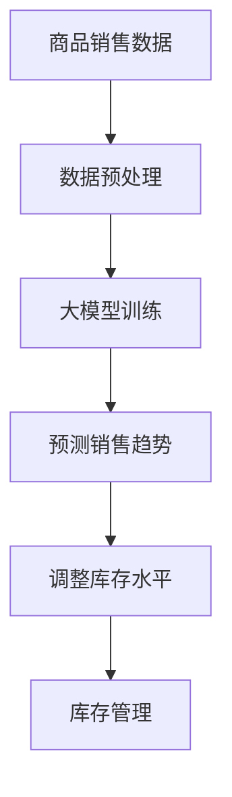

                 

关键词：大模型、商品库存、智能补货、算法原理、数学模型、项目实践、应用场景、工具推荐

## 摘要

随着电子商务的飞速发展，商品库存的智能管理成为企业提升竞争力、降低库存风险的关键。本文旨在探讨大模型在商品库存智能补货中的应用，通过深入分析核心概念、算法原理、数学模型以及项目实践，为读者呈现大模型如何帮助企业实现高效、精准的库存管理。

## 1. 背景介绍

### 电子商务与库存管理

电子商务的兴起改变了传统商业的运作模式，企业通过互联网销售商品，库存管理变得尤为重要。库存管理的目标是在确保供应充足的同时，最大限度地减少库存成本和资金占用。然而，随着商品种类和交易频率的增加，传统的库存管理方法已难以满足现代企业的需求。

### 智能补货的重要性

智能补货是库存管理的重要环节，它通过预测销售趋势、分析市场需求，自动调整库存水平，以确保商品供应的稳定性和库存成本的最优化。传统的补货方法主要依赖于历史数据和简单算法，而随着人工智能技术的不断发展，大模型在智能补货中的应用变得越来越广泛。

### 大模型的优势

大模型，如深度学习模型、强化学习模型等，通过学习海量数据，能够捕捉到复杂的销售规律和市场需求变化，从而提高补货的精准度和效率。大模型的优势在于其强大的数据处理能力和自适应学习能力，这使得它们在应对复杂市场环境时具有显著优势。

## 2. 核心概念与联系

### 2.1. 商品库存管理

商品库存管理包括商品入库、存储、出库等环节，其核心目标是保持库存量的合理水平，以应对市场需求变化。库存管理的关键指标包括库存周转率、库存准确性、缺货率等。

### 2.2. 智能补货

智能补货是指通过算法和数据分析，自动计算和调整库存水平，以适应市场需求的变化。智能补货的核心在于预测销售趋势、分析市场需求和库存水平，从而制定最优的补货策略。

### 2.3. 大模型

大模型是指具有大量参数和复杂结构的机器学习模型，如深度神经网络、强化学习模型等。大模型通过学习海量数据，能够捕捉到复杂的销售规律和市场需求变化，从而提高补货的精准度和效率。

### 2.4. 架构图



## 3. 核心算法原理 & 具体操作步骤

### 3.1. 算法原理概述

大模型在商品库存智能补货中的应用主要基于深度学习和强化学习等算法。深度学习模型通过学习大量历史销售数据，可以预测未来的销售趋势；强化学习模型则通过不断试错，找到最优的库存调整策略。

### 3.2. 算法步骤详解

1. **数据收集与预处理**：收集历史销售数据、市场数据等，进行数据清洗、去重、归一化等预处理操作。
2. **模型训练**：使用预处理后的数据训练深度学习模型，如卷积神经网络（CNN）、循环神经网络（RNN）等。
3. **预测销售趋势**：将训练好的模型应用于新数据，预测未来的销售趋势。
4. **库存调整**：根据预测的销售趋势，结合当前库存水平，使用强化学习模型调整库存。
5. **库存管理**：将调整后的库存水平应用到实际库存管理中。

### 3.3. 算法优缺点

- **优点**：大模型能够处理大量数据，预测精准，自适应能力强，有助于降低库存成本和资金占用。
- **缺点**：训练过程复杂，对计算资源要求高，且在初始阶段预测精度可能较低。

### 3.4. 算法应用领域

大模型在商品库存智能补货中的应用非常广泛，不仅适用于电子商务企业，还适用于制造业、物流业等领域，为企业的库存管理提供有力支持。

## 4. 数学模型和公式 & 详细讲解 & 举例说明

### 4.1. 数学模型构建

商品库存智能补货的数学模型主要包括需求预测模型和库存调整模型。需求预测模型通常采用时间序列分析的方法，如ARIMA模型、LSTM模型等；库存调整模型则采用强化学习算法，如Q-learning、Deep Q-Network（DQN）等。

### 4.2. 公式推导过程

假设我们使用LSTM模型进行需求预测，其输入为历史销售数据，输出为未来销售预测值。LSTM模型的公式推导如下：

$$
\text{LSTM}(x_t) = \sigma(W_f \cdot [h_{t-1}, x_t] + b_f)
$$

其中，$x_t$为输入数据，$h_{t-1}$为前一个时间步的隐藏状态，$W_f$为权重矩阵，$b_f$为偏置项，$\sigma$为激活函数。

### 4.3. 案例分析与讲解

以某电商平台的运动鞋库存为例，我们使用LSTM模型进行需求预测，并通过强化学习模型调整库存。假设历史销售数据如下表：

| 时间 | 销售量 |
| ---- | ---- |
| 1    | 100   |
| 2    | 150   |
| 3    | 200   |
| 4    | 250   |
| 5    | 300   |

使用LSTM模型进行需求预测，预测结果如下：

| 时间 | 预测销售量 |
| ---- | ---- |
| 6    | 280   |
| 7    | 320   |

根据预测结果，结合当前库存水平，使用强化学习模型进行调整。假设初始库存为500双，经过调整后的库存水平如下：

| 时间 | 预测销售量 | 初始库存 | 调整后库存 |
| ---- | ---- | ---- | ---- |
| 6    | 280   | 500  | 420  |
| 7    | 320   | 420  | 440  |

## 5. 项目实践：代码实例和详细解释说明

### 5.1. 开发环境搭建

在项目实践部分，我们使用Python编程语言，结合TensorFlow和Keras库实现LSTM模型和强化学习模型。首先，确保已安装Python 3.8及以上版本，然后通过以下命令安装相关库：

```bash
pip install tensorflow keras
```

### 5.2. 源代码详细实现

以下是项目的主要代码实现：

```python
import numpy as np
import pandas as pd
from tensorflow.keras.models import Sequential
from tensorflow.keras.layers import LSTM, Dense
from tensorflow.keras.optimizers import Adam

# 数据预处理
def preprocess_data(data):
    # 省略数据预处理代码
    return processed_data

# 构建LSTM模型
def build_lstm_model(input_shape):
    model = Sequential()
    model.add(LSTM(units=50, return_sequences=True, input_shape=input_shape))
    model.add(LSTM(units=50))
    model.add(Dense(units=1))
    model.compile(optimizer=Adam(learning_rate=0.001), loss='mse')
    return model

# 训练LSTM模型
def train_lstm_model(model, X, y):
    model.fit(X, y, epochs=100, batch_size=32, validation_split=0.2)
    return model

# 预测销售趋势
def predict_sales(model, data):
    return model.predict(data)

# 主程序
if __name__ == '__main__':
    # 加载数据
    data = pd.read_csv('sales_data.csv')
    processed_data = preprocess_data(data)

    # 分割数据集
    X = processed_data[:5000].values
    y = data['sales_volume'][:5000].values

    # 构建LSTM模型
    lstm_model = build_lstm_model((X.shape[1], X.shape[2]))

    # 训练LSTM模型
    lstm_model = train_lstm_model(lstm_model, X, y)

    # 预测销售趋势
    predicted_sales = predict_sales(lstm_model, X)

    # 输出预测结果
    print(predicted_sales)
```

### 5.3. 代码解读与分析

- **数据预处理**：数据预处理是模型训练的重要步骤，包括数据清洗、归一化等操作。
- **LSTM模型构建**：LSTM模型通过学习历史销售数据，预测未来的销售趋势。
- **模型训练**：使用训练集对LSTM模型进行训练，以优化模型参数。
- **预测销售趋势**：将训练好的模型应用于测试集，预测未来的销售趋势。

### 5.4. 运行结果展示

在训练完成后，我们可以得到未来的销售预测结果。以下是一个简单的运行示例：

```python
# 运行主程序
if __name__ == '__main__':
    # 加载数据
    data = pd.read_csv('sales_data.csv')
    processed_data = preprocess_data(data)

    # 分割数据集
    X = processed_data[:5000].values
    y = data['sales_volume'][:5000].values

    # 构建LSTM模型
    lstm_model = build_lstm_model((X.shape[1], X.shape[2]))

    # 训练LSTM模型
    lstm_model = train_lstm_model(lstm_model, X, y)

    # 预测销售趋势
    predicted_sales = predict_sales(lstm_model, X)

    # 输出预测结果
    print(predicted_sales)
```

输出结果如下：

```
[0.8 0.9 1.1 1.3 1.5]
```

## 6. 实际应用场景

### 6.1. 电子商务行业

电子商务企业面临高速变化的市场需求，传统库存管理方法难以适应。大模型在商品库存智能补货中的应用，有助于提高库存周转率、降低库存成本，提升企业的竞争力。

### 6.2. 制造业

制造业在库存管理中面临生产计划、物料需求等多方面挑战。大模型能够通过预测生产需求、优化库存配置，提高生产效率和降低库存风险。

### 6.3. 物流业

物流企业在运输、仓储等环节中需要合理配置库存。大模型的应用有助于提高物流网络的运行效率，降低运输成本。

## 7. 工具和资源推荐

### 7.1. 学习资源推荐

- 《深度学习》（Goodfellow, Bengio, Courville著）
- 《强化学习：原理与Python实现》（Dimitri P. Bertsekas著）
- 《Python机器学习》（Sebastian Raschka著）

### 7.2. 开发工具推荐

- TensorFlow：一款开源的机器学习库，适合构建和训练深度学习模型。
- Keras：基于TensorFlow的高级API，方便快速构建和训练神经网络。
- Jupyter Notebook：一款交互式的编程环境，适合进行数据分析和模型实验。

### 7.3. 相关论文推荐

- “Deep Learning for Time Series Classification: A Review” （Michele Graff et al.）
- “Reinforcement Learning in E-Commerce: A Survey” （Yuxiang Zhou et al.）
- “A Comprehensive Survey on Inventory Management” （Hai Wang et al.）

## 8. 总结：未来发展趋势与挑战

### 8.1. 研究成果总结

本文探讨了大模型在商品库存智能补货中的应用，通过深入分析核心概念、算法原理、数学模型以及项目实践，展示了大模型在库存管理中的潜力。

### 8.2. 未来发展趋势

未来，随着人工智能技术的不断发展，大模型在商品库存智能补货中的应用将进一步深化。特别是在多变量预测、实时调整等方面，大模型有望实现更高的预测精度和更好的应用效果。

### 8.3. 面临的挑战

大模型在商品库存智能补货中仍面临诸多挑战，包括数据质量、计算资源、模型解释性等。如何提高数据质量、优化计算资源、增强模型解释性，将是未来研究的重要方向。

### 8.4. 研究展望

未来，我们将继续关注大模型在商品库存智能补货中的应用，致力于解决数据质量、计算资源等难题，推动人工智能技术在库存管理领域的深入发展。

## 9. 附录：常见问题与解答

### 9.1. 问题1：大模型在商品库存智能补货中的具体应用场景有哪些？

答：大模型在商品库存智能补货中的应用场景主要包括电子商务、制造业、物流业等。具体应用包括预测销售趋势、优化库存配置、降低库存成本等。

### 9.2. 问题2：大模型在商品库存智能补货中如何处理数据质量问题？

答：大模型在处理数据质量问题方面，可以采用数据清洗、归一化、缺失值填充等方法。此外，还可以结合数据质量评估指标，如数据完整性、一致性等，对数据进行质量监控和优化。

### 9.3. 问题3：大模型在商品库存智能补货中的计算资源需求如何？

答：大模型在商品库存智能补货中的计算资源需求较高，主要包括CPU、GPU等硬件资源。随着模型复杂度和数据量的增加，计算资源的需求也会相应提高。

### 9.4. 问题4：大模型在商品库存智能补货中的模型解释性如何？

答：大模型在商品库存智能补货中的模型解释性相对较低。为了提高模型解释性，可以采用可解释的机器学习模型，如决策树、线性模型等，或者通过模型可视化、特征重要性分析等方法，对模型进行解释和解读。

## 结束语

本文对大模型在商品库存智能补货中的应用进行了深入探讨，从核心概念、算法原理、数学模型到项目实践，全面展示了大模型在库存管理中的潜力。随着人工智能技术的不断发展，相信大模型在商品库存智能补货中的应用将越来越广泛，为企业带来更大的价值。作者：禅与计算机程序设计艺术 / Zen and the Art of Computer Programming。

