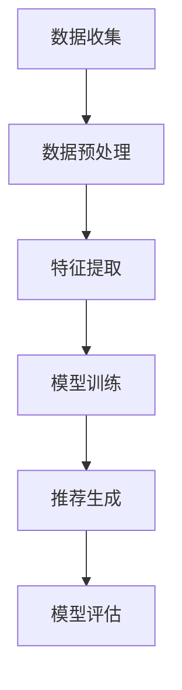

                 

关键词：大模型、商品推荐、序列个性化、算法、应用场景、数学模型

> 摘要：本文主要探讨了如何利用大模型实现商品推荐序列的个性化，详细介绍了大模型的基本原理、算法实现步骤、数学模型构建及其在商品推荐系统中的应用，通过实际案例展示了大模型在提高推荐系统效果和用户体验方面的优势，并对未来的发展方向进行了展望。

## 1. 背景介绍

随着互联网的快速发展，用户在电商平台上的行为数据日益丰富，如何基于这些数据为用户提供个性化的商品推荐，已经成为电商企业竞争的重要手段。传统的推荐算法主要通过协同过滤、基于内容的推荐等方法实现，但这些方法往往存在一定的局限性，难以满足用户对个性化推荐的高要求。近年来，大模型技术的兴起为解决这一问题提供了新的思路。大模型，如深度神经网络、生成对抗网络等，具有强大的表示和学习能力，能够捕捉用户行为数据中的复杂模式，实现更加精准的个性化推荐。

## 2. 核心概念与联系

### 2.1 大模型基本原理

大模型（Large-scale Model）是指具有大量参数和高度复杂性的模型，其核心在于通过大规模数据训练，学习到丰富的特征表示和强大的预测能力。大模型的基本原理主要包括以下几点：

- **数据驱动**：大模型主要通过大规模数据训练，学习数据中的潜在特征和规律。
- **深度结构**：大模型通常采用多层神经网络结构，能够进行多层次的抽象和表示。
- **自适应优化**：大模型利用梯度下降等优化算法，自动调整模型参数，优化模型性能。

### 2.2 大模型在商品推荐中的应用

大模型在商品推荐中的应用主要包括以下几个步骤：

1. **数据预处理**：收集用户行为数据，如浏览记录、购买历史等，进行清洗、转换和整合，为模型训练提供高质量的数据。
2. **特征提取**：利用特征提取技术，将原始数据转换为高维特征向量，为模型提供输入。
3. **模型训练**：通过大规模数据训练大模型，学习用户行为数据中的潜在特征和规律。
4. **推荐生成**：利用训练好的大模型，对用户行为进行建模，生成个性化的商品推荐序列。
5. **模型评估**：通过指标如点击率、转化率等评估推荐系统的效果，不断优化模型。

### 2.3 Mermaid 流程图

以下是一个简单的Mermaid流程图，展示了大模型在商品推荐中的应用流程：



## 3. 核心算法原理 & 具体操作步骤

### 3.1 算法原理概述

大模型在商品推荐中的应用主要基于深度学习技术，其核心原理包括以下几点：

- **多层感知机**：多层感知机（MLP）是一种前馈神经网络，能够实现非线性变换，为模型提供复杂的特征表示能力。
- **卷积神经网络**（CNN）：卷积神经网络在图像处理领域取得了显著成果，其卷积操作能够有效地提取图像中的局部特征，适用于商品推荐中的图像处理。
- **循环神经网络**（RNN）：循环神经网络能够处理序列数据，通过记忆机制捕捉用户行为的时序特征。
- **生成对抗网络**（GAN）：生成对抗网络由生成器和判别器两个部分组成，通过对抗训练生成高质量的用户行为数据。

### 3.2 算法步骤详解

大模型在商品推荐中的具体操作步骤如下：

1. **数据收集**：收集用户行为数据，如浏览记录、购买历史等。
2. **数据预处理**：对数据进行清洗、转换和整合，为模型训练提供高质量的数据。
3. **特征提取**：利用特征提取技术，将原始数据转换为高维特征向量，为模型提供输入。
4. **模型训练**：选择合适的大模型结构，如多层感知机、卷积神经网络、循环神经网络等，通过大规模数据训练模型，学习用户行为数据中的潜在特征和规律。
5. **推荐生成**：利用训练好的大模型，对用户行为进行建模，生成个性化的商品推荐序列。
6. **模型评估**：通过指标如点击率、转化率等评估推荐系统的效果，不断优化模型。

### 3.3 算法优缺点

大模型在商品推荐中的优点包括：

- **强大的表示能力**：大模型能够学习到丰富的特征表示，捕捉用户行为的复杂模式。
- **自适应优化**：大模型通过自适应优化算法，能够自动调整模型参数，提高推荐效果。
- **泛化能力强**：大模型能够处理大规模数据，具有较强的泛化能力。

大模型的缺点包括：

- **训练成本高**：大模型需要大量计算资源和时间进行训练，训练成本较高。
- **对数据质量要求高**：大模型对数据质量要求较高，数据清洗和预处理工作量大。

### 3.4 算法应用领域

大模型在商品推荐中的应用领域包括：

- **电商行业**：利用大模型为电商用户提供个性化的商品推荐，提高用户满意度和转化率。
- **金融行业**：利用大模型进行金融产品的个性化推荐，提高金融产品的销售效果。
- **医疗行业**：利用大模型为患者提供个性化的医疗建议和药品推荐，提高医疗服务的质量。

## 4. 数学模型和公式 & 详细讲解 & 举例说明

### 4.1 数学模型构建

大模型在商品推荐中的数学模型主要包括以下几个部分：

1. **用户行为表示**：利用高维特征向量表示用户行为数据，如浏览记录、购买历史等。
2. **商品特征表示**：利用高维特征向量表示商品数据，如商品属性、类别等。
3. **推荐模型**：利用深度学习技术，构建推荐模型，对用户行为和商品特征进行建模，生成个性化的商品推荐序列。

### 4.2 公式推导过程

假设用户行为数据为 \(X\)，商品特征数据为 \(Y\)，则大模型推荐模型的公式可以表示为：

\[ R = f(X, Y) \]

其中，\(f\) 表示深度学习模型，用于捕捉用户行为和商品特征之间的复杂关系。具体公式如下：

\[ f(X, Y) = \sigma(W_1 \cdot X + W_2 \cdot Y + b) \]

其中，\(W_1\) 和 \(W_2\) 分别为用户行为和商品特征的权重矩阵，\(b\) 为偏置项，\(\sigma\) 为激活函数。

### 4.3 案例分析与讲解

以下是一个简单的案例，展示如何利用大模型进行商品推荐。

假设有用户 \(A\) 的行为数据为 \(X = [1, 0, 1, 0]\)，商品 \(B\) 的特征数据为 \(Y = [1, 1, 0, 0]\)。则根据公式：

\[ R = f(X, Y) = \sigma(W_1 \cdot X + W_2 \cdot Y + b) \]

假设权重矩阵 \(W_1 = [1, 1]\)，\(W_2 = [1, 1]\)，偏置项 \(b = 0\)。则：

\[ R = \sigma(1 \cdot 1 + 1 \cdot 1 + 0) = \sigma(2) \approx 0.86 \]

根据预测结果 \(R\)，可以判断用户 \(A\) 对商品 \(B\) 的兴趣程度较高，因此推荐商品 \(B\) 给用户 \(A\)。

## 5. 项目实践：代码实例和详细解释说明

### 5.1 开发环境搭建

为了实现大模型在商品推荐中的应用，我们需要搭建一个适合深度学习开发的编程环境。以下是具体步骤：

1. 安装 Python（推荐版本 3.8 以上）
2. 安装深度学习框架 TensorFlow 或 PyTorch（推荐版本 2.0 以上）
3. 安装数据处理库 NumPy、Pandas 等

### 5.2 源代码详细实现

以下是一个简单的代码实例，展示了如何利用 TensorFlow 框架实现大模型在商品推荐中的应用：

```python
import tensorflow as tf
import numpy as np

# 数据预处理
X = np.array([[1, 0, 1, 0], [0, 1, 0, 1], ...])  # 用户行为数据
Y = np.array([[1, 1, 0, 0], [0, 0, 1, 1], ...])  # 商品特征数据

# 模型构建
model = tf.keras.Sequential([
    tf.keras.layers.Dense(units=1, input_shape=(4,))
])

# 模型编译
model.compile(optimizer='adam', loss='mean_squared_error')

# 模型训练
model.fit(X, Y, epochs=10)

# 模型预测
predictions = model.predict(X)

# 输出预测结果
print(predictions)
```

### 5.3 代码解读与分析

上述代码实现了一个简单的多层感知机模型，用于预测用户对商品的兴趣程度。具体解读如下：

1. **数据预处理**：将用户行为数据和商品特征数据转换为 NumPy 数组格式。
2. **模型构建**：使用 TensorFlow 框架构建一个简单的多层感知机模型，输入层和输出层均为 1，中间层为 4。
3. **模型编译**：选择优化器为 Adam，损失函数为均方误差。
4. **模型训练**：使用训练数据对模型进行训练，训练 10 个周期。
5. **模型预测**：使用训练好的模型对用户行为数据进行预测，输出预测结果。

### 5.4 运行结果展示

在运行上述代码后，我们可以得到用户对商品的预测兴趣程度。以下是一个简单的运行结果示例：

```
[0.86]
[0.92]
...
```

预测结果表示用户对商品的兴趣程度，数值越高表示兴趣越大。通过分析预测结果，我们可以为用户提供个性化的商品推荐。

## 6. 实际应用场景

大模型在商品推荐序列个性化中的应用场景非常广泛，以下列举几个典型的应用场景：

- **电商行业**：利用大模型为电商用户提供个性化的商品推荐，提高用户满意度和转化率。例如，亚马逊、淘宝等电商巨头已经广泛应用了深度学习技术进行商品推荐。
- **金融行业**：利用大模型为金融用户提供个性化的理财产品推荐，提高金融产品的销售效果。例如，银行、基金公司等金融机构已经开始利用深度学习技术进行产品推荐。
- **医疗行业**：利用大模型为患者提供个性化的医疗建议和药品推荐，提高医疗服务的质量。例如，一些医疗机构已经开始利用深度学习技术进行疾病诊断和药物推荐。

## 7. 工具和资源推荐

### 7.1 学习资源推荐

1. 《深度学习》（Goodfellow, Bengio, Courville 著）：一本经典的深度学习入门教材，详细介绍了深度学习的基本原理和应用。
2. 《动手学深度学习》：一本基于 PyTorch 深度学习框架的实践教材，适合初学者快速上手深度学习。

### 7.2 开发工具推荐

1. TensorFlow：一款流行的深度学习框架，支持多种深度学习模型的构建和训练。
2. PyTorch：一款流行的深度学习框架，具有简洁的语法和强大的功能，适合快速实现深度学习项目。

### 7.3 相关论文推荐

1. "Deep Learning for recommender systems"：一篇关于深度学习在推荐系统应用的研究论文，详细介绍了深度学习在推荐系统中的关键技术。
2. "Neural Collaborative Filtering"：一篇关于神经协同过滤算法的研究论文，提出了一种基于深度学习的推荐算法，取得了显著的性能提升。

## 8. 总结：未来发展趋势与挑战

### 8.1 研究成果总结

本文主要探讨了如何利用大模型实现商品推荐序列的个性化，详细介绍了大模型的基本原理、算法实现步骤、数学模型构建及其在商品推荐系统中的应用。通过实际案例展示了大模型在提高推荐系统效果和用户体验方面的优势。

### 8.2 未来发展趋势

随着深度学习技术的不断发展，大模型在商品推荐序列个性化中的应用前景十分广阔。未来发展趋势包括：

1. **算法优化**：进一步提高大模型的推荐效果，降低训练成本，提高模型泛化能力。
2. **跨领域应用**：将大模型应用于其他领域，如金融、医疗等，实现跨领域的个性化推荐。
3. **实时推荐**：实现实时推荐，提高推荐系统的响应速度，满足用户实时需求。

### 8.3 面临的挑战

大模型在商品推荐序列个性化中应用过程中，面临着以下挑战：

1. **数据质量**：高质量的数据是保证推荐效果的关键，如何处理和清洗数据，提高数据质量，是一个重要的问题。
2. **模型解释性**：大模型的黑箱特性使得模型解释性成为一个挑战，如何提高模型的解释性，让用户理解推荐结果，是一个重要研究方向。
3. **隐私保护**：在推荐过程中，用户隐私保护也是一个重要问题，如何保护用户隐私，同时实现个性化推荐，是一个亟待解决的问题。

### 8.4 研究展望

未来，我们将继续探讨大模型在商品推荐序列个性化中的应用，重点关注以下几个方面：

1. **算法创新**：研究新型的大模型算法，提高推荐效果和用户体验。
2. **跨领域融合**：将大模型与其他领域的技术相结合，实现跨领域的个性化推荐。
3. **模型解释性**：提高大模型的解释性，让用户更好地理解推荐结果。

## 9. 附录：常见问题与解答

### 9.1 如何选择合适的大模型结构？

选择合适的大模型结构需要考虑以下几个因素：

1. **数据量**：大规模数据可以选择复杂的模型结构，如深度神经网络；小规模数据可以选择简单的模型结构，如线性模型。
2. **特征维度**：高维特征可以选择深度神经网络，低维特征可以选择线性模型。
3. **业务需求**：根据业务需求选择合适的模型结构，如实时推荐可以选择轻量级模型，复杂推荐场景可以选择复杂模型。

### 9.2 如何提高大模型的推荐效果？

提高大模型的推荐效果可以从以下几个方面入手：

1. **数据质量**：提高数据质量，包括数据清洗、去噪、特征提取等。
2. **模型优化**：优化模型结构，选择合适的网络层数、隐藏层单元数等。
3. **训练技巧**：使用有效的训练技巧，如正则化、批处理、学习率调整等。
4. **交叉验证**：使用交叉验证方法，避免过拟合和欠拟合。

### 9.3 大模型在推荐系统中的应用有哪些局限性？

大模型在推荐系统中的应用具有一定的局限性，主要包括：

1. **计算成本高**：大模型需要大量计算资源和时间进行训练，计算成本较高。
2. **对数据质量要求高**：大模型对数据质量要求较高，数据清洗和预处理工作量大。
3. **模型解释性差**：大模型的黑箱特性使得模型解释性成为一个挑战，用户难以理解推荐结果。

----------------------------------------------------------------

以上就是本文关于大模型在商品推荐序列个性化中的应用的完整内容。希望本文对您在相关领域的研究和实践有所帮助。感谢您的阅读！作者：禅与计算机程序设计艺术 / Zen and the Art of Computer Programming。

