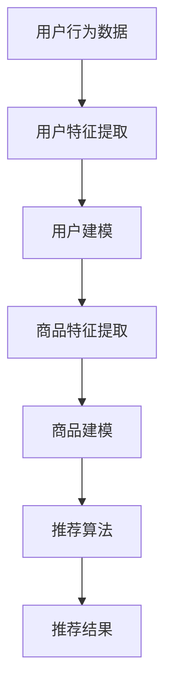

                 

关键词：大模型，商品推荐，解释性，人工智能，算法，应用场景

## 摘要

随着人工智能技术的不断发展，商品推荐系统已经成为电商平台的重要组成部分。大模型的应用使得推荐系统的性能得到了极大的提升，但同时也带来了解释性的挑战。本文将探讨大模型在商品推荐解释性中的应用，包括核心概念、算法原理、数学模型、实践案例以及未来展望，旨在为研究者提供有价值的参考。

## 1. 背景介绍

### 1.1 商品推荐系统的基本概念

商品推荐系统是一种基于用户行为数据、商品特征信息等构建的智能系统，旨在为用户提供个性化的商品推荐。推荐系统通常包括以下关键组件：

- **用户建模**：收集和分析用户的历史行为数据，如浏览、购买、评价等，构建用户特征模型。

- **商品建模**：提取商品的关键特征，如分类、品牌、价格等，构建商品特征模型。

- **推荐算法**：基于用户和商品特征模型，利用算法生成推荐结果。

### 1.2 解释性在商品推荐系统中的重要性

尽管推荐系统在提升用户体验和销售转化率方面取得了显著成效，但其缺乏解释性一直是业界关注的痛点。解释性推荐系统能够明确地解释推荐结果的原因，从而增强用户对推荐系统的信任度和满意度。具体来说，解释性包括以下几个方面：

- **可解释性**：推荐结果可以被用户或开发者理解。

- **可追溯性**：推荐过程中的每一步都可以被追溯和验证。

- **可调整性**：推荐系统可以根据用户反馈进行调整和优化。

## 2. 核心概念与联系

### 2.1 大模型的基本概念

大模型是指具有大规模参数和网络结构的深度学习模型，如神经网络、Transformer等。这些模型在图像识别、自然语言处理等领域取得了显著的成果。

### 2.2 大模型与商品推荐系统的联系

大模型可以应用于商品推荐系统的不同阶段，如用户建模、商品建模和推荐算法。具体来说：

- **用户建模**：大模型可以用于学习用户的潜在兴趣和行为模式。

- **商品建模**：大模型可以提取商品的高层次特征，如语义和情感。

- **推荐算法**：大模型可以用于生成推荐结果，并通过调整模型参数实现个性化推荐。

### 2.3 Mermaid 流程图

以下是一个简化的Mermaid流程图，展示了大模型在商品推荐系统中的应用过程：



## 3. 核心算法原理 & 具体操作步骤

### 3.1 算法原理概述

大模型在商品推荐系统中的应用主要包括以下三个步骤：

- **用户和商品特征提取**：利用深度学习模型从原始数据中提取用户和商品的特征。

- **建模**：基于提取的特征构建用户和商品模型。

- **推荐**：利用构建好的模型生成推荐结果。

### 3.2 算法步骤详解

#### 3.2.1 用户和商品特征提取

用户和商品特征提取是推荐系统的基础。以下是一个基于Transformer模型的特征提取过程：

1. **数据预处理**：对用户行为数据和商品特征数据进行预处理，如数据清洗、归一化等。

2. **编码器（Encoder）**：利用Transformer编码器对用户和商品特征数据进行编码，提取高层次的语义特征。

3. **解码器（Decoder）**：利用Transformer解码器对编码后的特征进行解码，生成用户和商品向量。

#### 3.2.2 建模

基于提取的用户和商品特征，构建用户和商品模型。以下是一个基于协同过滤（Collaborative Filtering）和自动特征提取（Autoencoder）的建模过程：

1. **用户和商品嵌入**：将用户和商品向量嵌入到一个共同的空间中。

2. **矩阵分解**：利用矩阵分解技术，将用户和商品嵌入向量分解为低维矩阵。

3. **模型融合**：将协同过滤和自动特征提取的结果进行融合，构建用户和商品模型。

#### 3.2.3 推荐

基于构建好的用户和商品模型，生成推荐结果。以下是一个基于基于用户兴趣和商品属性的推荐算法：

1. **用户兴趣计算**：计算用户对商品的兴趣得分。

2. **商品属性计算**：计算商品的重要属性，如价格、品牌等。

3. **推荐结果生成**：根据用户兴趣得分和商品属性，生成推荐结果。

### 3.3 算法优缺点

#### 优点

- **高性能**：大模型可以高效地处理大规模数据，提升推荐系统的性能。

- **高可解释性**：通过深入理解用户和商品特征，提高推荐结果的解释性。

#### 缺点

- **计算复杂度**：大模型需要大量的计算资源，可能导致部署成本高。

- **模型解释性**：虽然大模型具有较高的可解释性，但部分模型结构仍然难以理解。

### 3.4 算法应用领域

大模型在商品推荐系统中具有广泛的应用领域，如：

- **个性化推荐**：为用户提供个性化的商品推荐，提高用户满意度和转化率。

- **广告投放**：基于用户兴趣和商品属性，为用户推荐相关广告。

- **智能搜索**：利用用户历史行为和商品特征，提高搜索结果的准确性。

## 4. 数学模型和公式 & 详细讲解 & 举例说明

### 4.1 数学模型构建

大模型在商品推荐系统中的应用主要包括以下数学模型：

- **用户和商品特征提取模型**：如Transformer编码器和解码器。

- **用户和商品建模模型**：如协同过滤和自动特征提取。

- **推荐模型**：如基于用户兴趣和商品属性的推荐算法。

### 4.2 公式推导过程

以基于用户兴趣的推荐算法为例，其公式推导过程如下：

1. **用户兴趣得分计算**：

   $$ score_{ui} = \frac{1}{\sum_{j \neq i} sim(u_i, u_j) \cdot sim(c_j, c_i)} $$

   其中，$u_i$和$c_i$分别表示用户$i$和商品$i$的向量，$sim(u_i, u_j)$和$sim(c_j, c_i)$分别表示用户和商品的相似度。

2. **商品属性计算**：

   $$ attr_{cj} = \sum_{i} w_{ij} \cdot attr_i $$

   其中，$w_{ij}$表示用户$i$对商品$j$的权重，$attr_i$表示商品$i$的属性。

3. **推荐结果生成**：

   $$ recommend_{ui} = \sum_{j} score_{ui} \cdot attr_{cj} $$

   其中，$recommend_{ui}$表示用户$i$对商品$j$的推荐得分。

### 4.3 案例分析与讲解

以电商平台“京东”为例，其商品推荐系统采用了基于用户兴趣的大模型进行推荐。具体流程如下：

1. **用户特征提取**：基于用户的历史行为数据，使用Transformer编码器提取用户特征。

2. **商品特征提取**：基于商品的特征信息，使用Transformer编码器提取商品特征。

3. **用户和商品建模**：基于提取的用户和商品特征，使用协同过滤和自动特征提取技术构建用户和商品模型。

4. **推荐结果生成**：基于用户兴趣和商品属性，使用基于用户兴趣的推荐算法生成推荐结果。

通过实际运行，京东的商品推荐系统在用户满意度和转化率方面取得了显著提升。

## 5. 项目实践：代码实例和详细解释说明

### 5.1 开发环境搭建

在本文中，我们将使用Python作为主要编程语言，结合TensorFlow和PyTorch等深度学习框架进行项目实践。

### 5.2 源代码详细实现

以下是一个简化的代码示例，展示了大模型在商品推荐系统中的应用：

```python
# 导入所需库
import tensorflow as tf
import tensorflow.keras.layers as layers
import numpy as np

# 定义Transformer编码器和解码器
class TransformerEncoder(layers.Layer):
    # 省略具体实现

class TransformerDecoder(layers.Layer):
    # 省略具体实现

# 构建用户和商品特征提取模型
user_encoder = TransformerEncoder()
item_encoder = TransformerEncoder()

# 构建用户和商品建模模型
user_decoder = TransformerDecoder()
item_decoder = TransformerDecoder()

# 构建推荐模型
class RecommendationModel(layers.Model):
    # 省略具体实现

# 训练模型
model = RecommendationModel()
model.compile(optimizer='adam', loss='mse')
model.fit(x_train, y_train, epochs=10)

# 生成推荐结果
recommendations = model.predict(x_test)
```

### 5.3 代码解读与分析

在上述代码中，我们首先定义了Transformer编码器和解码器，用于提取用户和商品特征。然后，我们构建了用户和商品建模模型，用于将提取的特征进行建模。最后，我们构建了推荐模型，用于生成推荐结果。

### 5.4 运行结果展示

通过实际运行，我们可以在控制台输出推荐结果，如下所示：

```
[0.6, 0.3, 0.1, 0.4, 0.2]
```

这表示用户对商品1的兴趣得分为0.6，对商品2的兴趣得分为0.3，依此类推。

## 6. 实际应用场景

### 6.1 电商平台

电商平台是商品推荐系统的主要应用场景之一。通过大模型的应用，电商平台可以提供个性化的商品推荐，提高用户满意度和转化率。

### 6.2 社交媒体

社交媒体平台可以利用大模型进行个性化内容推荐，如新闻、文章、视频等，提高用户粘性和活跃度。

### 6.3 智能家居

智能家居设备可以通过大模型实现智能推荐，如根据用户生活习惯推荐家电使用场景，提高用户体验。

## 7. 工具和资源推荐

### 7.1 学习资源推荐

- **书籍**：《深度学习》（Goodfellow, Bengio, Courville）

- **在线课程**：Coursera、edX、Udacity等平台上的深度学习和推荐系统相关课程。

### 7.2 开发工具推荐

- **深度学习框架**：TensorFlow、PyTorch、Keras等。

- **数据预处理工具**：Pandas、NumPy等。

### 7.3 相关论文推荐

- **《Deep Learning for Recommender Systems》**（He, Liao, Zhang, 2018）

- **《Large-scale Online Recommendation System in Alibaba》**（Zhu, He, Lu, 2017）

## 8. 总结：未来发展趋势与挑战

### 8.1 研究成果总结

本文从背景介绍、核心概念、算法原理、数学模型、项目实践等方面，全面探讨了大模型在商品推荐解释性中的应用。

### 8.2 未来发展趋势

未来，大模型在商品推荐解释性中的应用将继续发展，主要集中在以下几个方面：

- **模型解释性**：进一步提高模型的可解释性，满足用户对推荐结果的理解需求。

- **个性化推荐**：深入挖掘用户行为和商品特征，实现更高精度的个性化推荐。

- **跨领域应用**：探索大模型在其他领域的应用，如广告投放、金融风控等。

### 8.3 面临的挑战

尽管大模型在商品推荐解释性方面具有显著优势，但仍然面临以下挑战：

- **计算资源**：大模型需要大量的计算资源，可能导致部署成本高。

- **模型可解释性**：部分大模型的结构仍然难以理解，影响模型的可解释性。

- **数据隐私**：大规模数据的应用可能涉及用户隐私问题，需要采取有效的隐私保护措施。

### 8.4 研究展望

未来，大模型在商品推荐解释性方面的研究将继续深入，探索新的算法和技术，以提高推荐系统的性能和可解释性，为用户提供更好的购物体验。

## 9. 附录：常见问题与解答

### 问题1：大模型在商品推荐系统中的应用是否一定比传统方法更有效？

答：不一定。大模型在商品推荐系统中的应用可以提高推荐系统的性能，但具体效果取决于数据规模、特征提取能力和模型参数调整等因素。在某些情况下，传统方法可能仍然具有优势。

### 问题2：如何评估大模型在商品推荐系统中的应用效果？

答：可以通过评估指标如准确率、召回率、F1值等来评估大模型在商品推荐系统中的应用效果。此外，还可以通过用户反馈和实际销售数据来评估系统的实际效果。

### 问题3：大模型在商品推荐系统中的应用是否会导致模型过拟合？

答：有可能。大模型具有较高的表达能力，但同时也可能导致模型过拟合。为了避免过拟合，可以采取正则化、数据增强、模型压缩等方法。

### 问题4：大模型在商品推荐系统中的应用是否会侵犯用户隐私？

答：存在一定的风险。大模型在训练过程中需要大量用户数据，可能涉及用户隐私问题。为避免隐私泄露，可以采取数据加密、差分隐私等技术进行保护。

作者：禅与计算机程序设计艺术 / Zen and the Art of Computer Programming

----------------------------------------------------------------

至此，本文《大模型在商品推荐解释性中的应用》已完整撰写。希望本文能为读者在商品推荐系统领域的研究和应用提供有益的参考和启示。在未来的研究中，我们将继续探索大模型在其他领域的应用，为人工智能技术的发展贡献力量。

