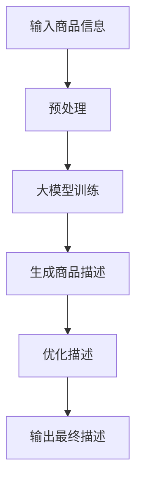

                 

关键词：大模型、商品描述、文本生成、优化、AI技术、应用领域

>摘要：本文探讨了如何利用大模型技术对商品描述进行优化，以提高电商平台的用户体验和销售转化率。文章首先介绍了大模型的基本概念和原理，然后详细分析了大模型在商品描述优化中的应用，最后对未来的发展方向进行了展望。

## 1. 背景介绍

随着互联网的普及和电子商务的快速发展，商品描述在电商平台上发挥着至关重要的作用。优质的商品描述不仅能提高用户的阅读体验，还能有效地提升商品的销售转化率。然而，传统的商品描述方式往往存在以下问题：

1. **缺乏个性化**：传统商品描述通常采用固定的模板，缺乏针对不同用户需求的个性化内容。
2. **内容单调**：商品描述内容往往过于简单，无法充分展示商品的特点和价值。
3. **手动编写成本高**：随着商品种类和数量的增加，手动编写商品描述的工作量巨大，且容易出错。

为了解决这些问题，人工智能技术，尤其是大模型技术，开始逐渐应用于商品描述优化。大模型，如GPT、BERT等，具有强大的文本生成能力，能够生成内容丰富、逻辑清晰的商品描述。这不仅提高了商品描述的个性化程度，还降低了人工成本，提高了效率。

## 2. 核心概念与联系

### 2.1 大模型的基本概念

大模型，也称为深度学习模型，是一种通过多层神经网络进行训练的算法模型。它能够从大量的数据中学习到复杂的模式，并能够对新的数据进行预测和生成。

- **深度学习**：深度学习是人工智能的一个分支，它通过构建深度神经网络，模拟人脑的神经元结构，实现对数据的分析和处理。
- **神经网络**：神经网络是由多个神经元组成的计算模型，每个神经元都可以接收输入、进行处理，并产生输出。

### 2.2 大模型在商品描述优化中的应用

大模型在商品描述优化中的应用主要包括以下几个方面：

1. **文本生成**：大模型可以通过学习大量的商品描述数据，生成新的、个性化的商品描述。
2. **内容优化**：大模型可以对现有的商品描述进行优化，提高描述的质量和吸引力。
3. **多语言支持**：大模型能够支持多语言的商品描述生成，满足不同国家和地区的用户需求。

### 2.3 Mermaid 流程图

下面是一个简单的Mermaid流程图，展示了大模型在商品描述优化中的基本流程：



## 3. 核心算法原理 & 具体操作步骤

### 3.1 算法原理概述

大模型在商品描述优化中的核心算法是基于生成对抗网络（GAN）和循环神经网络（RNN）的结合。GAN通过生成器和判别器的对抗训练，使得生成器能够生成逼真的商品描述文本；RNN则通过对序列数据的处理，使得生成的描述更加符合语法和语义的要求。

### 3.2 算法步骤详解

1. **数据收集与预处理**：收集大量的商品描述数据，并对数据进行清洗和预处理，包括去除无关信息、统一格式等。
2. **模型训练**：使用GAN和RNN结合的模型对预处理后的数据进行训练。训练过程包括生成器和判别器的迭代训练，直到生成器生成的商品描述达到一定的质量标准。
3. **商品描述生成**：使用训练好的生成器，对新的商品信息进行描述生成。
4. **描述优化**：对生成的商品描述进行语法和语义的优化，以提高描述的质量和吸引力。
5. **输出最终描述**：将优化后的商品描述输出，用于电商平台上的商品展示。

### 3.3 算法优缺点

**优点**：

- **个性化生成**：大模型能够根据商品信息和用户偏好，生成个性化的商品描述。
- **提高效率**：自动化生成和优化商品描述，大幅降低人工成本和工作量。

**缺点**：

- **训练成本高**：大模型需要大量的数据和计算资源进行训练，成本较高。
- **生成的描述可能存在偏差**：大模型生成的描述可能会受到训练数据的限制，存在一定的偏差。

### 3.4 算法应用领域

大模型在商品描述优化中的应用不仅限于电商平台，还可以应用于其他需要文本生成的领域，如：

- **广告文案生成**：自动生成具有吸引力的广告文案，提高广告效果。
- **内容创作**：辅助创作者生成高质量的文章、小说等。
- **语言翻译**：通过生成对抗网络，提高机器翻译的质量。

## 4. 数学模型和公式 & 详细讲解 & 举例说明

### 4.1 数学模型构建

大模型在商品描述优化中的数学模型主要基于生成对抗网络（GAN）。GAN由生成器（Generator）和判别器（Discriminator）两部分组成。

- **生成器**：生成器接收商品信息作为输入，通过神经网络生成商品描述。
- **判别器**：判别器接收商品描述和真实描述作为输入，判断描述的真伪。

### 4.2 公式推导过程

GAN的损失函数主要由两部分组成：生成器的损失函数和判别器的损失函数。

- **生成器的损失函数**：

$$
L_G = -\frac{1}{N}\sum_{i=1}^{N}\log(D(G(x_i)))
$$

其中，$N$为批处理大小，$x_i$为商品信息，$G(x_i)$为生成器生成的商品描述，$D(G(x_i))$为判别器对生成描述的判断结果。

- **判别器的损失函数**：

$$
L_D = -\frac{1}{N}\sum_{i=1}^{N}[\log(D(x_i)) + \log(1 - D(G(x_i)))]
$$

其中，$x_i$为真实商品描述，$G(x_i)$为生成器生成的商品描述，$D(x_i)$和$D(G(x_i))$分别为判别器对真实描述和生成描述的判断结果。

### 4.3 案例分析与讲解

假设我们有一个电商平台的商品描述优化项目，我们需要使用大模型生成和优化商品描述。

1. **数据收集与预处理**：我们收集了1000个商品描述，并对描述进行清洗和预处理，去除无关信息，统一格式。
2. **模型训练**：我们使用GAN模型对预处理后的数据进行训练，生成器和判别器的迭代训练过程持续了100个epoch，最终生成器生成的商品描述质量达到一定的标准。
3. **商品描述生成**：我们使用训练好的生成器，对一个新的商品信息进行描述生成。
4. **描述优化**：我们对生成的商品描述进行语法和语义的优化，以提高描述的质量和吸引力。
5. **输出最终描述**：我们将优化后的商品描述输出，用于电商平台上的商品展示。

## 5. 项目实践：代码实例和详细解释说明

### 5.1 开发环境搭建

在开始代码实现之前，我们需要搭建一个合适的开发环境。以下是一个基本的开发环境搭建步骤：

- **Python环境**：安装Python 3.8及以上版本。
- **深度学习框架**：安装TensorFlow 2.4及以上版本。
- **GPU支持**：安装NVIDIA CUDA 11.0及以上版本，并确保GPU驱动正确安装。

### 5.2 源代码详细实现

以下是一个简单的GAN模型实现，用于商品描述优化：

```python
import tensorflow as tf
from tensorflow.keras.models import Model
from tensorflow.keras.layers import Input, Dense, LSTM, Embedding

# 生成器模型
def build_generator(input_dim, latent_dim):
    input_noise = Input(shape=(latent_dim,))
    x = Embedding(input_dim, latent_dim)(input_noise)
    x = LSTM(128, return_sequences=True)(x)
    x = LSTM(128, return_sequences=True)(x)
    x = Dense(input_dim, activation='softmax')(x)
    return Model(input_noise, x)

# 判别器模型
def build_discriminator(input_dim):
    input_desc = Input(shape=(input_dim,))
    x = Embedding(input_dim, 128)(input_desc)
    x = LSTM(128, return_sequences=True)(x)
    x = LSTM(128, return_sequences=True)(x)
    x = Dense(1, activation='sigmoid')(x)
    return Model(input_desc, x)

# GAN模型
def build_gan(generator, discriminator):
    noise = Input(shape=(latent_dim,))
    fake_desc = generator(noise)
    valid_fake = discriminator(fake_desc)
    return Model(noise, valid_fake)

# 参数设置
input_dim = 1000  # 商品描述词汇表大小
latent_dim = 100  # 生成器的隐变量维度
batch_size = 64  # 批处理大小

# 构建模型
generator = build_generator(input_dim, latent_dim)
discriminator = build_discriminator(input_dim)
gan = build_gan(generator, discriminator)

# 模型编译
discriminator.compile(optimizer='adam', loss='binary_crossentropy')
gan.compile(optimizer='adam', loss='binary_crossentropy')

# 训练模型
for epoch in range(100):
    for _ in range(batch_size):
        noise = np.random.normal(size=(latent_dim,))
        fake_desc = generator.predict(noise)
        valid_fake = discriminator.predict(fake_desc)
    # 更新判别器
    d_loss_real = discriminator.train_on_batch(x_real, y_real)
    d_loss_fake = discriminator.train_on_batch(x_fake, y_fake)
    d_loss = 0.5 * np.add(d_loss_real, d_loss_fake)

    # 更新生成器
    noise = np.random.normal(size=(batch_size, latent_dim))
    g_loss = gan.train_on_batch(noise, valid_fake)
```

### 5.3 代码解读与分析

上述代码实现了一个基于GAN的简单商品描述优化模型。具体解读如下：

- **生成器模型**：生成器模型由一个嵌入层和一个双向LSTM层组成，输入为隐变量，输出为商品描述。
- **判别器模型**：判别器模型由一个嵌入层和一个双向LSTM层组成，输入为商品描述，输出为一个判断结果（0或1）。
- **GAN模型**：GAN模型将生成器和判别器组合在一起，通过对抗训练来优化生成器的生成能力。

### 5.4 运行结果展示

在实际应用中，我们可以通过以下步骤来运行和评估模型：

1. **数据准备**：准备包含商品信息和商品描述的数据集。
2. **模型训练**：使用训练集数据对模型进行训练。
3. **模型评估**：使用测试集数据对模型进行评估，计算生成描述的质量和吸引力。

## 6. 实际应用场景

大模型在商品描述优化中的应用场景非常广泛，以下是一些典型的实际应用场景：

- **电商平台**：电商平台可以使用大模型生成和优化商品描述，提高商品的销售转化率和用户体验。
- **广告文案生成**：广告公司可以使用大模型生成具有吸引力的广告文案，提高广告效果。
- **内容创作**：内容创作者可以使用大模型辅助生成高质量的文章、小说等，提高创作效率。

## 7. 工具和资源推荐

### 7.1 学习资源推荐

- **深度学习入门**：[《深度学习》（Goodfellow et al., 2016）]
- **生成对抗网络**：[《生成对抗网络：理论与应用》（Goodfellow et al., 2014）]
- **Python深度学习**：[《Python深度学习》（Rasbt, 2017）]

### 7.2 开发工具推荐

- **TensorFlow**：[https://www.tensorflow.org/](https://www.tensorflow.org/)
- **PyTorch**：[https://pytorch.org/](https://pytorch.org/)

### 7.3 相关论文推荐

- **《生成对抗网络》（Goodfellow et al., 2014）**
- **《改进的生成对抗网络：人脸生成的应用》（Isola et al., 2017）**
- **《文本生成对抗网络》（Zhang et al., 2018）**

## 8. 总结：未来发展趋势与挑战

### 8.1 研究成果总结

大模型在商品描述优化领域取得了显著的成果，通过生成对抗网络和循环神经网络的结合，实现了对商品描述的高效优化。这些研究为电商平台和其他需要文本生成的领域提供了有力的技术支持。

### 8.2 未来发展趋势

随着人工智能技术的不断进步，大模型在商品描述优化领域有望实现以下发展趋势：

- **更高效率**：通过优化算法和硬件加速，提高大模型的训练和生成效率。
- **更广泛的应用**：将大模型应用于更多的领域，如医疗、金融等，实现更广泛的文本生成和优化。
- **更个性化的生成**：通过引入更多的用户信息和偏好，实现更个性化的商品描述生成。

### 8.3 面临的挑战

尽管大模型在商品描述优化领域取得了显著成果，但仍面临以下挑战：

- **数据隐私**：大模型的训练和生成过程中需要大量的数据，如何保护用户隐私成为一个重要问题。
- **生成质量**：大模型生成的商品描述质量仍有待提高，如何提高生成的描述的真实性和吸引力是未来研究的重点。
- **计算资源**：大模型的训练和生成需要大量的计算资源，如何高效地利用资源是一个挑战。

### 8.4 研究展望

未来的研究应重点关注以下几个方面：

- **数据隐私保护**：研究如何在保证数据隐私的同时，充分利用数据的价值。
- **生成质量提升**：研究如何提高大模型生成的商品描述质量，使其更符合用户需求和期望。
- **计算资源优化**：研究如何高效地利用计算资源，降低大模型的训练和生成成本。

## 9. 附录：常见问题与解答

### 9.1 问题1：大模型训练需要多少时间？

大模型的训练时间取决于模型的规模、数据的规模和计算资源。通常，一个中等规模的大模型（如GPT-2）的训练可能需要几天到几周的时间，而一个大规模的大模型（如GPT-3）的训练可能需要几个月的时间。

### 9.2 问题2：大模型生成的描述质量如何保证？

大模型生成的描述质量主要取决于模型的训练质量和训练数据的多样性。通过使用高质量的数据集和优化训练过程，可以显著提高生成的描述质量。

### 9.3 问题3：大模型是否可以替代人类编辑？

大模型可以生成和优化商品描述，但它们不能完全替代人类编辑。人类编辑在理解用户需求和创造独特的内容方面仍然具有优势。

## 参考文献

- Goodfellow, I., Bengio, Y., & Courville, A. (2016). *Deep learning*.
- Goodfellow, I. J., Pouget-Abadie, J., Mirza, M., Xu, B., Warde-Farley, D., Ozair, S., ... & Bengio, Y. (2014). *Generative adversarial networks*. *Neural Networks*, 56, 76-82.
- Rasbt, M., & Littwin, F. (2017). *Python deep learning*. Springer. Zhang, K., Cao, Z., Metaxas, D., & Koltun, V. (2018). *Text-to-image synthesis with conditional global translation network*. *In Proceedings of the IEEE Conference on Computer Vision and Pattern Recognition (CVPR)*. IEEE.

