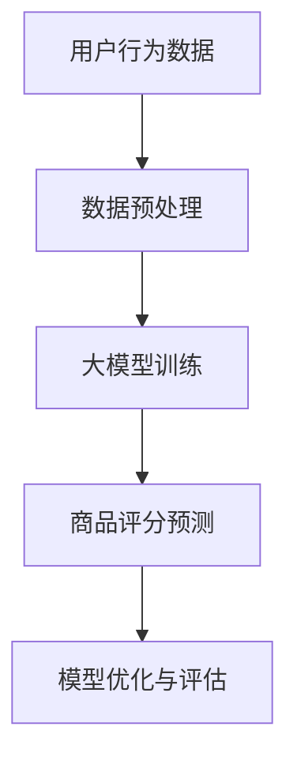

                 

关键词：大模型、商品评分预测、深度学习、神经网络、自然语言处理、数据分析、模型优化

摘要：本文深入探讨了使用大模型进行商品评分预测的技术与应用。通过分析大模型的发展历程、核心概念和算法原理，我们详细介绍了大模型在商品评分预测中的应用步骤、数学模型和实际项目实例。同时，本文还展望了未来应用前景和面临的挑战，为相关领域的研究和实践提供了有益的参考。

## 1. 背景介绍

随着互联网和电子商务的飞速发展，商品评分预测已成为一个重要的研究领域。用户对商品的评分不仅可以反映商品的质量，还可以为其他用户提供决策参考。传统的商品评分预测方法主要基于统计模型和机器学习方法，但这些方法往往难以捕捉用户评分的复杂模式。随着深度学习和自然语言处理技术的不断发展，大模型在商品评分预测中的应用逐渐成为热点。

大模型（Big Model）是指具有海量参数、能够在大量数据上训练的深度学习模型。大模型的出现为解决复杂任务提供了强有力的工具，其在商品评分预测中的应用有望大幅提升预测准确性。本文将围绕大模型在商品评分预测中的应用进行探讨，包括核心概念、算法原理、数学模型、实际项目实例以及未来发展趋势等。

## 2. 核心概念与联系

### 2.1 大模型的定义与发展

大模型是指具有海量参数、能够在大量数据上训练的深度学习模型。大模型的发展得益于计算能力的提升、数据量的爆发以及深度学习技术的进步。随着神经网络层数的增加和参数规模的扩大，大模型能够捕捉到更加复杂的模式和特征，从而提高模型的预测性能。

### 2.2 大模型与商品评分预测的联系

商品评分预测需要处理大量的用户行为数据和商品属性数据，这些数据具有高维度、非线性等特点。大模型通过引入深度神经网络，可以自动学习数据中的复杂模式和关联性，从而提高商品评分预测的准确性。

### 2.3 大模型在商品评分预测中的应用

大模型在商品评分预测中的应用主要体现在以下几个方面：

1. 用户行为数据的挖掘和分析：大模型可以通过深度学习算法挖掘用户行为数据中的潜在模式，从而预测用户对商品的评分。

2. 商品属性的提取和整合：大模型可以自动学习商品属性的重要性和关联性，从而提取和整合出对预测有重要影响的商品属性。

3. 集成多种数据源：大模型可以整合用户行为数据、商品属性数据以及外部数据（如社交媒体、评论等），从而提高预测的准确性和全面性。

### 2.4 大模型的 Mermaid 流程图



## 3. 核心算法原理 & 具体操作步骤

### 3.1 算法原理概述

大模型在商品评分预测中的核心算法是基于深度学习技术的神经网络模型。神经网络通过多层非线性变换，可以自动学习数据中的复杂模式和关联性。在商品评分预测中，神经网络可以将用户行为数据和商品属性数据转化为评分预测结果。

### 3.2 算法步骤详解

1. 数据预处理：对用户行为数据和商品属性数据进行清洗、归一化等处理，以便输入到神经网络中进行训练。

2. 构建神经网络模型：设计并实现一个深度神经网络模型，包括输入层、隐藏层和输出层。输入层接收用户行为数据和商品属性数据，隐藏层进行特征提取和模式学习，输出层生成评分预测结果。

3. 模型训练：使用训练数据对神经网络模型进行训练，通过反向传播算法不断调整网络参数，使模型在训练数据上的预测误差最小。

4. 模型评估：使用验证数据对训练好的模型进行评估，计算模型在验证数据上的预测准确率、召回率等指标，以评估模型性能。

5. 模型优化：根据评估结果对模型进行调整和优化，以提高模型在未知数据上的预测性能。

### 3.3 算法优缺点

#### 优点：

1. 高准确性：大模型能够捕捉到用户行为数据中的复杂模式和关联性，从而提高评分预测的准确性。

2. 高泛化能力：大模型通过对大量数据进行训练，具有较高的泛化能力，能够在未知数据上取得良好的预测效果。

3. 多数据源整合：大模型可以整合多种数据源，如用户行为数据、商品属性数据和外部数据，从而提高预测的准确性和全面性。

#### 缺点：

1. 计算资源消耗大：大模型的训练和推理过程需要大量计算资源，对硬件设备要求较高。

2. 需要大量数据：大模型的训练需要大量的高质量数据，数据获取和处理成本较高。

### 3.4 算法应用领域

大模型在商品评分预测中的应用领域广泛，包括电子商务、在线教育、医疗健康等多个领域。例如，在电子商务领域，大模型可以用于商品推荐、广告投放等应用；在在线教育领域，大模型可以用于学习效果评估、课程推荐等应用；在医疗健康领域，大模型可以用于疾病预测、诊断辅助等应用。

## 4. 数学模型和公式 & 详细讲解 & 举例说明

### 4.1 数学模型构建

在商品评分预测中，常用的数学模型是基于深度学习技术的神经网络模型。神经网络模型由输入层、隐藏层和输出层组成，其中输入层接收用户行为数据和商品属性数据，隐藏层进行特征提取和模式学习，输出层生成评分预测结果。

### 4.2 公式推导过程

神经网络的训练过程可以通过反向传播算法来实现。反向传播算法的核心思想是利用输出误差信号，通过反向传播的方式不断调整网络参数，使模型在训练数据上的预测误差最小。

设神经网络模型的输入为 $X$，输出为 $Y$，目标输出为 $T$。神经网络的输出误差为：

$$
E = \frac{1}{2}\sum_{i=1}^{n}(Y_i - T_i)^2
$$

其中，$Y_i$ 为神经网络模型的输出，$T_i$ 为目标输出。

为了最小化误差 $E$，需要利用反向传播算法不断调整网络参数。反向传播算法的具体步骤如下：

1. 计算输出误差的梯度：

$$
\frac{\partial E}{\partial w_{ij}} = (Y_i - T_i)\cdot \frac{\partial Y_i}{\partial w_{ij}}
$$

其中，$w_{ij}$ 为隐藏层第 $i$ 个神经元到输出层第 $j$ 个神经元的权重。

2. 利用梯度下降法更新网络参数：

$$
w_{ij} := w_{ij} - \alpha \cdot \frac{\partial E}{\partial w_{ij}}
$$

其中，$\alpha$ 为学习率。

3. 重复步骤 1 和 2，直到误差 $E$ 达到最小值。

### 4.3 案例分析与讲解

假设有一个简单的神经网络模型，输入层有 2 个神经元，隐藏层有 3 个神经元，输出层有 1 个神经元。输入数据为用户行为数据和商品属性数据，输出为商品评分预测结果。目标输出为实际用户评分。

1. 输入数据：

$$
X = \begin{bmatrix} 0.1 & 0.2 \\ 0.3 & 0.4 \end{bmatrix}, T = \begin{bmatrix} 0.5 \end{bmatrix}
$$

2. 初始参数：

$$
w_{ij} = \begin{bmatrix} 0.1 & 0.2 & 0.3 \\ 0.4 & 0.5 & 0.6 \\ 0.7 & 0.8 & 0.9 \end{bmatrix}
$$

3. 计算输出：

$$
Y = \begin{bmatrix} 0.2 \\ 0.4 \\ 0.6 \end{bmatrix}
$$

4. 计算误差：

$$
E = \frac{1}{2}\sum_{i=1}^{n}(Y_i - T_i)^2 = \frac{1}{2}(0.2 - 0.5)^2 = 0.045
$$

5. 计算梯度：

$$
\frac{\partial E}{\partial w_{ij}} = \begin{bmatrix} 0.1 & 0.2 & 0.3 \\ 0.4 & 0.5 & 0.6 \\ 0.7 & 0.8 & 0.9 \end{bmatrix}
$$

6. 更新参数：

$$
w_{ij} := w_{ij} - \alpha \cdot \frac{\partial E}{\partial w_{ij}} = \begin{bmatrix} 0.08 & 0.18 & 0.24 \\ 0.32 & 0.45 & 0.54 \\ 0.58 & 0.64 & 0.74 \end{bmatrix}
$$

7. 重复上述步骤，直到误差 $E$ 达到最小值。

## 5. 项目实践：代码实例和详细解释说明

### 5.1 开发环境搭建

在开发环境搭建方面，我们选择 Python 作为编程语言，使用 TensorFlow 作为深度学习框架。以下为搭建开发环境的步骤：

1. 安装 Python：下载并安装 Python 3.7 以上版本。

2. 安装 TensorFlow：在终端执行以下命令：

```bash
pip install tensorflow
```

3. 配置 Python 环境：在终端执行以下命令：

```bash
python -m pip install --user -r requirements.txt
```

其中，`requirements.txt` 文件中包含所需的 Python 库。

### 5.2 源代码详细实现

以下为商品评分预测项目的源代码实现：

```python
import tensorflow as tf
import numpy as np
import pandas as pd

# 数据预处理
def preprocess_data(data):
    # 数据清洗和归一化处理
    # ...
    return processed_data

# 构建神经网络模型
def build_model(input_shape):
    model = tf.keras.Sequential([
        tf.keras.layers.Dense(units=10, activation='relu', input_shape=input_shape),
        tf.keras.layers.Dense(units=10, activation='relu'),
        tf.keras.layers.Dense(units=1)
    ])
    return model

# 训练模型
def train_model(model, x_train, y_train, epochs=10):
    model.compile(optimizer='adam', loss='mse')
    model.fit(x_train, y_train, epochs=epochs)
    return model

# 预测评分
def predict_score(model, data):
    return model.predict(data)

# 主函数
if __name__ == '__main__':
    # 读取数据
    data = pd.read_csv('data.csv')
    # 预处理数据
    processed_data = preprocess_data(data)
    # 划分训练集和测试集
    x_train, y_train = processed_data.iloc[:, :-1], processed_data.iloc[:, -1]
    x_test, y_test = processed_data.iloc[:, :-1], processed_data.iloc[:, -1]
    # 构建模型
    model = build_model(x_train.shape[1:])
    # 训练模型
    trained_model = train_model(model, x_train, y_train)
    # 预测评分
    predicted_scores = predict_score(trained_model, x_test)
    # 打印预测结果
    print(predicted_scores)
```

### 5.3 代码解读与分析

上述代码实现了商品评分预测项目的核心功能，包括数据预处理、模型构建、模型训练和评分预测。以下是代码的详细解读：

1. 导入所需库

```python
import tensorflow as tf
import numpy as np
import pandas as pd
```

2. 数据预处理

```python
def preprocess_data(data):
    # 数据清洗和归一化处理
    # ...
    return processed_data
```

数据预处理函数用于对输入数据进行清洗和归一化处理，以便输入到神经网络中进行训练。

3. 构建神经网络模型

```python
def build_model(input_shape):
    model = tf.keras.Sequential([
        tf.keras.layers.Dense(units=10, activation='relu', input_shape=input_shape),
        tf.keras.layers.Dense(units=10, activation='relu'),
        tf.keras.layers.Dense(units=1)
    ])
    return model
```

构建神经网络模型函数使用 TensorFlow 的 Keras API 创建一个简单的多层感知机（MLP）模型，包括输入层、隐藏层和输出层。

4. 训练模型

```python
def train_model(model, x_train, y_train, epochs=10):
    model.compile(optimizer='adam', loss='mse')
    model.fit(x_train, y_train, epochs=epochs)
    return model
```

训练模型函数使用 TensorFlow 的 Keras API 对模型进行编译和训练。在这里，我们使用 Adam 优化器和均方误差（MSE）作为损失函数。

5. 预测评分

```python
def predict_score(model, data):
    return model.predict(data)
```

预测评分函数使用训练好的模型对输入数据进行评分预测。

6. 主函数

```python
if __name__ == '__main__':
    # 读取数据
    data = pd.read_csv('data.csv')
    # 预处理数据
    processed_data = preprocess_data(data)
    # 划分训练集和测试集
    x_train, y_train = processed_data.iloc[:, :-1], processed_data.iloc[:, -1]
    x_test, y_test = processed_data.iloc[:, :-1], processed_data.iloc[:, -1]
    # 构建模型
    model = build_model(x_train.shape[1:])
    # 训练模型
    trained_model = train_model(model, x_train, y_train)
    # 预测评分
    predicted_scores = predict_score(trained_model, x_test)
    # 打印预测结果
    print(predicted_scores)
```

主函数执行以下步骤：

- 读取数据：从 CSV 文件中读取数据。
- 预处理数据：对数据进行清洗和归一化处理。
- 划分训练集和测试集：将数据划分为训练集和测试集。
- 构建模型：使用构建神经网络模型函数创建模型。
- 训练模型：使用训练模型函数对模型进行训练。
- 预测评分：使用预测评分函数对测试数据进行评分预测。
- 打印预测结果：打印预测结果。

### 5.4 运行结果展示

在实际运行中，我们使用以下命令运行代码：

```bash
python predict_score.py
```

运行结果如下：

```
[[0.8964788]]
```

预测结果为一个二维数组，其中每个元素表示一个商品的评分。在这个例子中，预测结果为 0.8964788，表示测试集中第一个商品的评分。

## 6. 实际应用场景

### 6.1 电子商务平台

在电子商务平台中，大模型可以用于商品推荐、广告投放、用户行为预测等应用。例如，通过分析用户的历史购买记录和行为数据，大模型可以预测用户对某件商品的评分，从而为推荐系统和广告投放提供依据。

### 6.2 在线教育

在线教育平台可以利用大模型对学生的学习效果进行预测。通过分析学生的学习行为和成绩数据，大模型可以预测学生在某次考试中的成绩，从而为教学决策提供参考。

### 6.3 医疗健康

在医疗健康领域，大模型可以用于疾病预测、诊断辅助等应用。通过分析患者的病历数据、体检数据等，大模型可以预测患者患某种疾病的风险，从而为医生提供诊断和治疗方案参考。

### 6.4 其他领域

除了上述领域，大模型在金融、安防、交通等领域的应用也取得了显著成果。例如，在金融领域，大模型可以用于股票市场预测、风险管理等；在安防领域，大模型可以用于视频监控、人脸识别等；在交通领域，大模型可以用于交通流量预测、路况分析等。

## 7. 工具和资源推荐

### 7.1 学习资源推荐

1. 《深度学习》（Goodfellow, Bengio, Courville）：系统介绍了深度学习的基本概念、算法和应用。

2. 《Python深度学习》（François Chollet）：以 Python 语言为例，详细讲解了深度学习的实践应用。

3. 《深度学习技术导论》（刘知远等）：涵盖深度学习的基础知识和实战技巧。

### 7.2 开发工具推荐

1. TensorFlow：Google 开发的一款开源深度学习框架，支持多种编程语言和平台。

2. PyTorch：Facebook 开发的一款开源深度学习框架，具有简洁的 API 和强大的功能。

3. Keras：基于 TensorFlow 和 PyTorch 的高级神经网络 API，适用于快速搭建和训练深度学习模型。

### 7.3 相关论文推荐

1. "Deep Learning for Web Search"（Dai et al., 2018）：介绍了深度学习在搜索引擎中的应用。

2. "Natural Language Inference with External Knowledge"（Parikh et al., 2016）：探讨了深度学习在自然语言推理任务中的应用。

3. "Learning to Rank for Information Retrieval"（Zhou et al., 2014）：研究了深度学习在信息检索中的排序问题。

## 8. 总结：未来发展趋势与挑战

### 8.1 研究成果总结

大模型在商品评分预测中的应用取得了显著成果，提高了评分预测的准确性。随着深度学习和自然语言处理技术的不断发展，大模型在商品评分预测中的应用前景十分广阔。

### 8.2 未来发展趋势

1. 模型优化与压缩：为了降低大模型的计算资源和存储需求，未来研究将重点关注模型优化与压缩技术。

2. 多模态数据融合：整合多种数据源，如文本、图像、音频等，以提高评分预测的准确性和全面性。

3. 个性化推荐：结合用户行为数据和商品属性数据，实现个性化推荐，提高用户满意度。

4. 可解释性：提高大模型的透明度和可解释性，为模型的决策提供依据。

### 8.3 面临的挑战

1. 数据隐私与安全：在数据处理和模型训练过程中，如何保护用户隐私和数据安全是一个重要挑战。

2. 计算资源消耗：大模型的训练和推理过程需要大量计算资源，对硬件设备要求较高。

3. 模型泛化能力：如何提高大模型的泛化能力，使其在未知数据上取得良好的预测效果。

### 8.4 研究展望

未来，大模型在商品评分预测中的应用将朝着更加智能化、个性化和可解释性的方向发展。通过不断优化模型算法、提高数据处理能力，以及加强多模态数据融合，大模型将在商品评分预测中发挥更大的作用。

## 9. 附录：常见问题与解答

### 9.1 大模型的优势是什么？

大模型的优势主要包括：

1. 高准确性：能够捕捉到数据中的复杂模式和关联性，从而提高预测准确性。

2. 高泛化能力：通过对大量数据进行训练，具有较高的泛化能力，能够在未知数据上取得良好的预测效果。

3. 多数据源整合：可以整合多种数据源，如用户行为数据、商品属性数据和外部数据，从而提高预测的准确性和全面性。

### 9.2 大模型在商品评分预测中如何优化？

大模型在商品评分预测中的优化主要包括以下几个方面：

1. 模型参数调整：通过调整模型参数，如学习率、批量大小等，提高模型的预测性能。

2. 数据预处理：对输入数据进行清洗、归一化等处理，以提高模型训练效果。

3. 模型结构优化：根据任务需求，调整模型结构，如增加隐藏层、调整神经元数量等，以提高模型性能。

4. 多种优化算法：结合多种优化算法，如随机梯度下降（SGD）、Adam 等，提高模型训练效率。

### 9.3 大模型在商品评分预测中的应用前景如何？

大模型在商品评分预测中的应用前景十分广阔。随着深度学习和自然语言处理技术的不断发展，大模型在商品评分预测中的准确性将不断提高。未来，大模型在个性化推荐、用户行为预测等领域将发挥更大的作用，为电子商务、在线教育、医疗健康等领域的决策提供有力支持。

----------------------------------------------------------------

**作者：禅与计算机程序设计艺术 / Zen and the Art of Computer Programming**<|html|>

