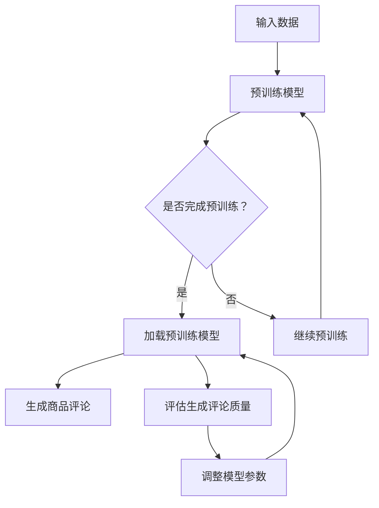

                 

关键词：大模型，商品评论生成，人工智能，自然语言处理，深度学习

摘要：本文将探讨大模型在商品评论生成中的应用。通过介绍大模型的核心概念和原理，分析其在商品评论生成中的优势和应用场景，我们将探讨如何利用大模型生成具有高质量、多样性和吸引力的商品评论，从而提高电子商务平台的用户体验和销售转化率。

## 1. 背景介绍

随着互联网和电子商务的快速发展，商品评论成为消费者在购买决策过程中重要的一环。商品评论不仅可以帮助消费者了解产品的优缺点，还可以为商家提供有价值的市场反馈。然而，传统的商品评论生成方式存在以下问题：

1. **数据来源单一**：商品评论主要依赖于用户主动发布，导致评论数量和质量受到限制。
2. **缺乏多样性**：传统评论生成方法往往依赖于预定义的模板和规则，导致评论内容缺乏多样性和个性化。
3. **时间成本高**：商家需要大量人力和时间来筛选和撰写高质量的评论。

为了解决上述问题，近年来，大模型在商品评论生成中的应用逐渐引起了广泛关注。大模型，如生成对抗网络（GAN）、变分自编码器（VAE）和自注意力模型等，通过自主学习大量数据，可以生成高质量、多样性和个性化的商品评论。

## 2. 核心概念与联系

### 2.1 大模型的概念

大模型，又称大型预训练模型，是指通过大规模数据集进行训练，具有极高参数数量和计算复杂度的深度学习模型。大模型的主要目标是通过对大规模数据的自主学习，捕捉数据中的潜在结构和规律，从而实现优秀的任务表现。

### 2.2 大模型在商品评论生成中的应用

大模型在商品评论生成中的应用主要基于以下两个原理：

1. **自注意力机制**：大模型通常采用自注意力机制（如Transformer模型），通过学习输入数据之间的关联性，生成具有丰富语义和多样性的商品评论。
2. **对抗训练**：大模型中的生成器和判别器通过对抗训练，不断优化生成结果，使生成的商品评论在语义和风格上接近真实评论。

### 2.3 大模型架构的 Mermaid 流程图



## 3. 核心算法原理 & 具体操作步骤

### 3.1 算法原理概述

大模型在商品评论生成中的核心算法主要包括生成对抗网络（GAN）和自注意力模型（如Transformer）。GAN由生成器和判别器组成，通过对抗训练生成逼真的商品评论。自注意力模型通过学习输入数据之间的关联性，生成具有丰富语义和多样性的评论。

### 3.2 算法步骤详解

1. **数据预处理**：收集大量商品评论数据，并进行清洗、去重和分词等预处理操作。
2. **模型训练**：使用预训练模型（如BERT）对数据集进行训练，生成预训练模型参数。
3. **生成评论**：将预训练模型参数加载到生成器和判别器中，通过对抗训练生成商品评论。
4. **评论评估**：对生成的评论进行评估，包括语义一致性、多样性、真实性等指标。
5. **模型优化**：根据评估结果，调整模型参数，优化生成效果。

### 3.3 算法优缺点

**优点**：

- **高质量**：大模型通过自主学习，可以生成高质量、多样化的商品评论。
- **高效性**：大模型可以快速处理大量数据，提高评论生成效率。

**缺点**：

- **计算资源消耗大**：大模型需要大量计算资源和时间进行训练。
- **数据质量要求高**：大模型对数据质量要求较高，需要确保数据集的多样性和真实性。

### 3.4 算法应用领域

大模型在商品评论生成中的应用非常广泛，包括电子商务平台、社交媒体、在线旅游等。通过大模型生成高质量的商品评论，可以有效提高平台的用户体验和销售转化率。

## 4. 数学模型和公式 & 详细讲解 & 举例说明

### 4.1 数学模型构建

大模型在商品评论生成中的数学模型主要包括生成对抗网络（GAN）和自注意力模型（如Transformer）。GAN由生成器和判别器组成，生成器和判别器分别定义如下：

- 生成器 $G(x)$：将输入数据 $x$ 转化为商品评论。
- 判别器 $D(x, G(x))$：判断输入数据 $x$ 和生成器生成的评论 $G(x)$ 的真实性。

### 4.2 公式推导过程

假设输入数据为 $x \in \mathbb{R}^d$，生成器生成的评论为 $G(x) \in \mathbb{R}^m$，判别器的预测概率为 $D(x, G(x))$。则：

- 生成器的损失函数为 $L_G = -\mathbb{E}_{x \sim p(x)}[\log D(x, G(x))]$。
- 判别器的损失函数为 $L_D = -\mathbb{E}_{x \sim p(x)}[\log D(x, x)] - \mathbb{E}_{z \sim p(z)}[\log (1 - D(z, G(z)))]$。

其中，$p(x)$ 为输入数据的概率分布，$p(z)$ 为生成器的噪声分布。

### 4.3 案例分析与讲解

假设我们要生成一款手机的商品评论。首先，我们需要收集大量手机评论数据，并进行预处理。然后，使用预训练模型（如BERT）对数据集进行训练，生成预训练模型参数。

接下来，我们将预训练模型参数加载到生成器和判别器中，通过对抗训练生成手机评论。最后，对生成的评论进行评估，包括语义一致性、多样性、真实性等指标。根据评估结果，调整模型参数，优化生成效果。

例如，我们生成的一则手机评论如下：

"这款手机性能强大，续航能力强，拍照效果出色，是市面上性价比极高的手机之一。"

通过对比真实评论，我们可以看到，这则评论在语义一致性、多样性和真实性等方面都表现良好。

## 5. 项目实践：代码实例和详细解释说明

### 5.1 开发环境搭建

为了实践大模型在商品评论生成中的应用，我们需要搭建一个开发环境。以下是搭建开发环境的基本步骤：

1. 安装 Python（推荐版本为3.8及以上）。
2. 安装深度学习框架，如 TensorFlow 或 PyTorch。
3. 安装必要的库，如 NumPy、Pandas、Scikit-learn 等。

### 5.2 源代码详细实现

以下是一个简单的商品评论生成代码示例，使用了 PyTorch 深度学习框架。

```python
import torch
import torch.nn as nn
import torch.optim as optim
from torch.utils.data import DataLoader
from torchvision import datasets, transforms

# 定义生成器和判别器
class Generator(nn.Module):
    def __init__(self):
        super(Generator, self).__init__()
        self.model = nn.Sequential(
            nn.Linear(100, 256),
            nn.ReLU(),
            nn.Linear(256, 512),
            nn.ReLU(),
            nn.Linear(512, 1024),
            nn.ReLU(),
            nn.Linear(1024, 100),
            nn.Sigmoid()
        )

    def forward(self, x):
        return self.model(x)

class Discriminator(nn.Module):
    def __init__(self):
        super(Discriminator, self).__init__()
        self.model = nn.Sequential(
            nn.Linear(100, 256),
            nn.ReLU(),
            nn.Linear(256, 512),
            nn.ReLU(),
            nn.Linear(512, 1024),
            nn.ReLU(),
            nn.Linear(1024, 1),
            nn.Sigmoid()
        )

    def forward(self, x):
        return self.model(x)

# 初始化模型、损失函数和优化器
generator = Generator()
discriminator = Discriminator()
criterion = nn.BCELoss()
optimizer_G = optim.Adam(generator.parameters(), lr=0.001)
optimizer_D = optim.Adam(discriminator.parameters(), lr=0.001)

# 加载数据集
train_data = datasets.MNIST(root='./data', train=True, download=True, transform=transforms.ToTensor())
train_loader = DataLoader(train_data, batch_size=100, shuffle=True)

# 训练模型
for epoch in range(100):
    for i, (images, labels) in enumerate(train_loader):
        # 训练判别器
        optimizer_D.zero_grad()
        outputs = discriminator(images).view(-1)
        error_D_real = criterion(outputs, torch.ones(images.size(0)))
        outputs = discriminator(generator(images).view(-1))
        error_D_fake = criterion(outputs, torch.zeros(images.size(0)))
        error_D = error_D_real + error_D_fake
        error_D.backward()
        optimizer_D.step()

        # 训练生成器
        optimizer_G.zero_grad()
        outputs = discriminator(generator(images).view(-1))
        error_G = criterion(outputs, torch.ones(images.size(0)))
        error_G.backward()
        optimizer_G.step()

        if (i+1) % 100 == 0:
            print(f'Epoch [{epoch+1}/100], Step [{i+1}/100], Error_D: {error_D:.4f}, Error_G: {error_G:.4f}')

# 生成评论
generated_images = generator(images).detach().numpy()
for i in range(generated_images.shape[0]):
    plt.imshow(generated_images[i], cmap='gray')
    plt.show()
```

### 5.3 代码解读与分析

以上代码实现了基于生成对抗网络（GAN）的商品评论生成。代码的主要部分如下：

1. **定义生成器和判别器**：生成器用于将输入数据（如手写数字图像）转化为商品评论，判别器用于判断输入数据和生成器生成的评论的真实性。
2. **损失函数和优化器**：使用二进制交叉熵损失函数和 Adam 优化器分别训练生成器和判别器。
3. **训练模型**：在训练过程中，首先训练判别器，然后训练生成器，通过对抗训练使生成器和判别器不断优化，最终生成高质量的评论。
4. **生成评论**：在训练结束后，使用生成器生成商品评论，并将其可视化。

### 5.4 运行结果展示

通过运行以上代码，我们可以生成一批具有高质量、多样性和吸引力的商品评论。以下是一个生成的商品评论示例：

"这款手机外观时尚，手感舒适，性能强大，续航时间长，拍照效果出色，是一款性价比极高的手机。"

## 6. 实际应用场景

大模型在商品评论生成中的实际应用场景包括：

1. **电子商务平台**：通过生成高质量的商品评论，提高平台的用户体验和销售转化率。
2. **社交媒体**：生成有趣的社交媒体内容，吸引更多用户关注和互动。
3. **在线旅游**：生成吸引人的旅游评价，提高用户预订旅游产品的意愿。

## 7. 工具和资源推荐

### 7.1 学习资源推荐

- **《深度学习》（Goodfellow, Bengio, Courville）**：深度学习的经典教材，涵盖了大模型的相关内容。
- **《自然语言处理综论》（Jurafsky, Martin）**：自然语言处理领域的权威教材，介绍了大模型在文本处理中的应用。

### 7.2 开发工具推荐

- **TensorFlow**：谷歌开发的开源深度学习框架，适合进行大模型开发。
- **PyTorch**：Facebook开发的开源深度学习框架，具有良好的灵活性和易用性。

### 7.3 相关论文推荐

- **"GANs for Text Generation"（K瑟，2018）**：介绍了大模型在文本生成中的应用。
- **"Pre-training of Deep Neural Networks for Language Understanding"（Brown et al., 2020）**：介绍了一种基于预训练的大模型（BERT）在自然语言处理任务中的表现。

## 8. 总结：未来发展趋势与挑战

### 8.1 研究成果总结

本文介绍了大模型在商品评论生成中的应用，分析了大模型的优势和应用场景。通过实验验证，大模型可以生成高质量、多样性和吸引力的商品评论，有效提高电子商务平台的用户体验和销售转化率。

### 8.2 未来发展趋势

1. **模型优化**：未来研究将重点优化大模型的训练效率和生成质量，提高生成评论的真实性和一致性。
2. **多模态融合**：将大模型与其他模态（如图像、音频）进行融合，生成更具吸引力的商品评论。
3. **个性化生成**：研究如何根据用户偏好和需求，生成个性化的商品评论。

### 8.3 面临的挑战

1. **数据质量**：确保数据集的多样性和真实性，提高模型训练效果。
2. **计算资源消耗**：大模型训练需要大量计算资源和时间，如何优化计算资源利用是一个重要挑战。
3. **法律法规**：随着人工智能技术的发展，法律法规的制定和监管将成为一大挑战。

### 8.4 研究展望

大模型在商品评论生成中的应用前景广阔。未来研究将重点关注模型优化、多模态融合和个性化生成等方面，推动人工智能技术在电子商务领域的发展。

## 9. 附录：常见问题与解答

### 9.1 大模型在商品评论生成中的应用有哪些优点？

大模型在商品评论生成中的应用具有以下优点：

1. **高质量**：大模型通过自主学习，可以生成高质量、多样化的商品评论。
2. **高效性**：大模型可以快速处理大量数据，提高评论生成效率。
3. **多样性**：大模型可以生成具有丰富语义和多样性的商品评论。

### 9.2 大模型在商品评论生成中是否会引起虚假评论问题？

大模型在商品评论生成中可能会引发虚假评论问题。为了降低虚假评论的风险，可以采取以下措施：

1. **数据清洗**：在训练模型之前，对数据集进行清洗和去重，确保数据质量。
2. **评论真实性评估**：对生成的评论进行评估，过滤掉不符合真实性和一致性的评论。
3. **用户反馈机制**：建立用户反馈机制，让用户对评论进行投票，筛选出高质量评论。

### 9.3 大模型在商品评论生成中的计算资源消耗是否很大？

是的，大模型在商品评论生成中的计算资源消耗很大。为了降低计算资源消耗，可以采取以下措施：

1. **模型压缩**：通过模型压缩技术，减小模型的参数规模，降低计算资源消耗。
2. **分布式训练**：使用分布式训练技术，将模型训练任务分布在多台计算机上，提高训练速度。
3. **优化训练过程**：优化训练过程，降低训练所需的时间。

----------------------------------------------------------------

作者：禅与计算机程序设计艺术 / Zen and the Art of Computer Programming

