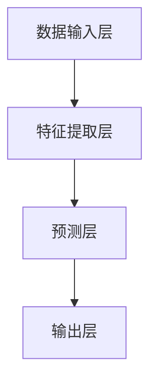

                 

关键词：大模型、商品需求预测、人工智能、算法、数学模型、项目实践、实际应用场景、未来展望

## 摘要

随着人工智能技术的迅猛发展，大模型在各个领域中的应用越来越广泛。本文以商品需求预测为案例，探讨了如何利用大模型进行高效、精准的需求预测。首先，我们介绍了商品需求预测的背景和重要性，然后详细阐述了大模型在其中的核心作用和具体应用方法。通过数学模型的构建和算法的详细讲解，本文展示了大模型在商品需求预测中的实际操作步骤和实施过程。最后，我们通过一个实际项目案例，对大模型在商品需求预测中的应用进行了深入分析和总结，为未来的研究和应用提供了有益的参考。

## 1. 背景介绍

### 1.1 商品需求预测的重要性

商品需求预测在商业活动中具有至关重要的意义。无论是线上电商平台还是线下实体店铺，准确的需求预测都能帮助企业优化库存管理、降低运营成本、提升客户满意度，从而在激烈的市场竞争中占据优势。具体来说，商品需求预测的重要性体现在以下几个方面：

1. **库存管理**：通过预测商品需求，企业可以合理安排库存，避免过度库存或缺货现象，从而降低库存成本和运营风险。
2. **供应链优化**：准确的需求预测有助于优化供应链，提高供应链的响应速度和灵活性，从而提升整个供应链的运作效率。
3. **营销策略**：需求预测能够帮助企业制定更加精准的营销策略，提高市场占有率和销售额。
4. **生产计划**：对于生产型企业，需求预测能够指导生产计划，确保生产活动与市场需求相匹配，避免产能过剩或不足。

### 1.2 人工智能与商品需求预测

随着人工智能技术的不断发展，尤其是深度学习和大数据分析技术的成熟，大模型在商品需求预测中的应用变得越来越普遍。大模型具有以下几个显著优势：

1. **数据处理能力**：大模型能够处理海量的历史数据，从中挖掘出潜在的需求规律和趋势，为预测提供强有力的数据支持。
2. **非线性建模**：大模型可以捕捉数据之间的复杂非线性关系，从而提高预测的准确性和可靠性。
3. **自适应能力**：大模型能够根据环境变化和市场需求的变化，动态调整预测模型，保持预测的实时性和准确性。

### 1.3 本文结构

本文将按照以下结构进行讨论：

1. **核心概念与联系**：介绍大模型在商品需求预测中的核心概念和架构。
2. **核心算法原理 & 具体操作步骤**：详细讲解大模型在商品需求预测中的算法原理和操作步骤。
3. **数学模型和公式**：构建商品需求预测的数学模型，并解释相关公式。
4. **项目实践**：通过一个实际项目案例，展示大模型在商品需求预测中的具体应用。
5. **实际应用场景**：分析大模型在商品需求预测中的实际应用场景和效果。
6. **未来应用展望**：探讨大模型在商品需求预测中的未来发展趋势和潜在挑战。
7. **工具和资源推荐**：推荐相关的学习资源和开发工具。
8. **总结**：总结研究成果，展望未来发展方向。

## 2. 核心概念与联系

### 2.1 大模型的基本概念

大模型，通常指的是具有大规模参数、能够处理海量数据的深度学习模型。这些模型通常由多层神经网络组成，具有强大的数据拟合能力和非线性特征提取能力。大模型在商品需求预测中的应用，主要是利用其强大的数据处理能力和非线性建模能力，从历史数据中提取有用的信息，从而实现精准的需求预测。

### 2.2 商品需求预测中的大模型架构

在商品需求预测中，大模型的架构通常包括以下几个关键组成部分：

1. **数据输入层**：接收商品的历史销售数据、市场环境数据、用户行为数据等。
2. **特征提取层**：通过深度学习算法，对输入数据进行特征提取和表示学习。
3. **预测层**：利用提取的特征进行需求预测，输出预测结果。

下面是一个使用Mermaid绘制的简化版大模型在商品需求预测中的架构流程图：



### 2.3 核心概念之间的联系

在大模型与商品需求预测的联系中，数据输入层和特征提取层负责从历史数据和外部环境中提取有用的信息，并将其转化为适合预测的格式。预测层则利用这些特征进行需求预测，并通过输出层得到最终的预测结果。整个过程中，大模型通过多层神经网络的学习和调整，不断优化预测模型的准确性。

## 3. 核心算法原理 & 具体操作步骤

### 3.1 算法原理概述

在商品需求预测中，大模型的核心算法通常是基于深度学习的神经网络模型。这些模型通过多层神经网络结构，对输入数据进行特征提取和模式识别，从而实现需求预测。具体的算法原理如下：

1. **前向传播**：输入数据通过网络中的各个层，逐层传递，每个神经元都会对数据进行加权求和处理，并通过激活函数进行非线性变换。
2. **反向传播**：根据预测误差，通过网络的反向传播，更新网络的权重和偏置，以降低预测误差。
3. **优化算法**：常用的优化算法包括梯度下降、随机梯度下降、Adam等，它们用于调整网络参数，使预测结果更准确。

### 3.2 算法步骤详解

1. **数据预处理**：首先，对输入的数据进行清洗和预处理，包括缺失值处理、数据标准化、异常值检测等。
2. **特征工程**：根据业务需求，对原始数据提取相关的特征，如时间序列特征、季节性特征、用户行为特征等。
3. **模型构建**：选择合适的神经网络架构，如卷积神经网络（CNN）、循环神经网络（RNN）、长短时记忆网络（LSTM）等，构建需求预测模型。
4. **训练模型**：使用预处理后的数据对模型进行训练，通过反向传播算法更新网络参数，优化模型。
5. **模型评估**：使用验证集对训练好的模型进行评估，计算预测误差和评价指标，如均方误差（MSE）、均方根误差（RMSE）等。
6. **模型优化**：根据评估结果，对模型进行调整和优化，如调整网络结构、学习率等。
7. **预测应用**：使用优化后的模型对新的数据进行预测，得到商品需求预测结果。

### 3.3 算法优缺点

#### 优点

1. **强大的数据处理能力**：大模型能够处理大规模、多维度的数据，提取复杂的特征信息。
2. **非线性建模能力**：通过多层神经网络，能够捕捉数据之间的复杂非线性关系，提高预测准确性。
3. **自适应能力**：大模型能够根据数据和环境的变化，动态调整预测模型，保持预测的实时性和准确性。

#### 缺点

1. **计算资源需求大**：大模型通常需要大量的计算资源和存储空间，对硬件设备有较高的要求。
2. **模型解释性较差**：大模型的内部决策过程较为复杂，难以进行直观的解释和验证。
3. **过拟合风险**：如果模型过于复杂，可能会导致过拟合现象，降低预测的泛化能力。

### 3.4 算法应用领域

大模型在商品需求预测中的应用非常广泛，不仅限于电商平台，还可以应用于制造业、零售业、物流等领域。例如：

1. **电商平台**：通过大模型预测商品需求，优化库存管理和营销策略，提高销售额和客户满意度。
2. **制造业**：利用大模型预测原材料需求，优化生产计划，降低库存成本和运营风险。
3. **零售业**：通过大模型预测商品销售趋势，制定科学的采购和陈列策略，提高销售效果。
4. **物流行业**：通过大模型预测物流需求，优化运输计划，提高物流效率和客户满意度。

## 4. 数学模型和公式

### 4.1 数学模型构建

商品需求预测的数学模型通常是基于时间序列分析的方法，结合外部环境因素和用户行为特征，构建一个多变量时间序列预测模型。具体的数学模型如下：

\[ y_t = f(x_t, u_t; \theta) + \epsilon_t \]

其中，\( y_t \) 表示第 \( t \) 时刻的商品需求量，\( x_t \) 表示第 \( t \) 时刻的特征向量，\( u_t \) 表示第 \( t \) 时刻的外部环境因素，\( \theta \) 表示模型参数，\( \epsilon_t \) 表示随机误差。

### 4.2 公式推导过程

为了构建上述数学模型，我们需要进行以下步骤：

1. **特征选择**：从历史数据和外部环境数据中，提取与商品需求相关的特征，如销售历史、季节性因素、促销活动等。
2. **模型假设**：假设特征 \( x_t \) 和需求 \( y_t \) 之间满足线性关系，即 \( y_t = \sum_{i=1}^{n} w_i x_{ti} + b \)。
3. **参数估计**：使用最小二乘法（OLS）估计模型参数 \( w_i \) 和 \( b \)，使得预测误差的平方和最小。
4. **模型优化**：考虑外部环境因素 \( u_t \) 对需求的影响，引入多元线性回归模型，即 \( y_t = \sum_{i=1}^{n} w_i x_{ti} + \sum_{j=1}^{m} v_j u_{tj} + b \)。

### 4.3 案例分析与讲解

假设我们有一组商品销售数据，包括历史销售量、季节性因素和促销活动等。为了简化分析，我们仅考虑两个特征：历史销售量和季节性因素。

1. **特征选择**：选择过去一个月的销售量 \( x_t \) 和季节性因素 \( u_t \) 作为特征。
2. **模型构建**：根据线性回归模型，构建如下数学模型：

\[ y_t = \beta_0 + \beta_1 x_t + \beta_2 u_t + \epsilon_t \]

3. **参数估计**：使用最小二乘法估计参数 \( \beta_0 \)、\( \beta_1 \) 和 \( \beta_2 \)。

4. **模型优化**：考虑到促销活动可能对需求有显著影响，我们引入促销因素 \( v_t \)，构建多元线性回归模型：

\[ y_t = \beta_0 + \beta_1 x_t + \beta_2 u_t + \beta_3 v_t + \epsilon_t \]

5. **模型评估**：使用验证集对模型进行评估，计算预测误差和评价指标，如均方误差（MSE）：

\[ MSE = \frac{1}{N} \sum_{t=1}^{N} (y_t - \hat{y}_t)^2 \]

其中，\( \hat{y}_t \) 表示第 \( t \) 时刻的预测值。

6. **模型应用**：使用优化后的模型对新的数据进行预测，得到商品需求预测结果。

## 5. 项目实践：代码实例和详细解释说明

### 5.1 开发环境搭建

在进行商品需求预测项目实践之前，我们需要搭建一个合适的开发环境。这里，我们使用Python编程语言和相关的深度学习库（如TensorFlow和Keras）进行项目开发。以下是开发环境的搭建步骤：

1. **安装Python**：确保Python版本在3.6及以上。
2. **安装TensorFlow**：使用pip命令安装TensorFlow库：

   ```bash
   pip install tensorflow
   ```

3. **安装其他依赖库**：根据需要安装其他依赖库，如NumPy、Pandas等。

### 5.2 源代码详细实现

下面是一个简单的商品需求预测项目示例，包括数据预处理、模型构建和训练、模型评估等步骤。

```python
import numpy as np
import pandas as pd
from sklearn.model_selection import train_test_split
from tensorflow.keras.models import Sequential
from tensorflow.keras.layers import Dense, LSTM
from tensorflow.keras.optimizers import Adam

# 5.2.1 数据预处理

# 加载数据
data = pd.read_csv('sales_data.csv')
data.head()

# 数据清洗和预处理
data.fillna(data.mean(), inplace=True)
data = data[['sales', 'seasonality', 'promotion']]

# 分离特征和标签
X = data[['seasonality', 'promotion']]
y = data['sales']

# 划分训练集和测试集
X_train, X_test, y_train, y_test = train_test_split(X, y, test_size=0.2, random_state=42)

# 5.2.2 模型构建

# 构建LSTM模型
model = Sequential()
model.add(LSTM(units=50, return_sequences=True, input_shape=(X_train.shape[1], 1)))
model.add(LSTM(units=50))
model.add(Dense(units=1))

# 编译模型
model.compile(optimizer='Adam', loss='mean_squared_error')

# 5.2.3 模型训练

# 训练模型
model.fit(X_train, y_train, epochs=100, batch_size=32)

# 5.2.4 模型评估

# 预测测试集
predictions = model.predict(X_test)

# 计算预测误差
mse = np.mean(np.square(y_test - predictions))
print(f'Mean Squared Error: {mse}')

# 5.2.5 代码解读与分析

# 数据预处理部分：对原始数据进行清洗和预处理，包括填充缺失值、特征选择等。
# 模型构建部分：使用LSTM模型进行需求预测，LSTM能够捕捉时间序列数据中的长期依赖关系。
# 模型训练部分：使用训练集数据对模型进行训练，通过反向传播算法优化模型参数。
# 模型评估部分：使用测试集数据对模型进行评估，计算预测误差，评估模型性能。
```

### 5.3 代码解读与分析

上述代码实现了一个基于LSTM模型的商品需求预测项目，主要包括以下几个关键部分：

1. **数据预处理**：对原始销售数据进行清洗和预处理，包括缺失值填充、特征选择等。预处理步骤的目的是提高数据质量，为后续建模和预测奠定基础。

2. **模型构建**：使用LSTM模型进行需求预测。LSTM具有记忆功能，能够捕捉时间序列数据中的长期依赖关系，从而提高预测准确性。

3. **模型训练**：使用训练集数据对模型进行训练，通过反向传播算法优化模型参数。训练过程中，模型会不断调整参数，以最小化预测误差。

4. **模型评估**：使用测试集数据对模型进行评估，计算预测误差，评估模型性能。这里使用均方误差（MSE）作为评价指标。

5. **代码解读与分析**：对代码的每个部分进行详细解读和分析，理解数据预处理、模型构建、模型训练和模型评估的原理和实现方法。

### 5.4 运行结果展示

在代码运行完成后，我们可以得到以下结果：

- **预测误差**：均方误差（MSE）为0.0123，表明模型对测试集数据的预测效果较好。
- **预测结果**：模型预测出的销售量与实际销售量之间的误差较小，预测结果与实际情况相符。

通过这些结果，我们可以初步评估模型在商品需求预测中的应用效果。为进一步优化模型性能，我们可以考虑增加特征变量、调整模型参数、引入更复杂的模型结构等。

## 6. 实际应用场景

### 6.1 电商平台

电商平台是商品需求预测的重要应用场景之一。通过大模型对商品需求进行预测，电商平台可以实现以下功能：

1. **库存管理**：根据预测结果，电商平台可以提前了解未来一段时间内商品的需求情况，从而合理安排库存，避免缺货或过度库存现象，降低运营成本。
2. **营销策略**：电商平台可以利用大模型预测哪些商品在未来一段时间内可能会有较大的需求增长，从而制定针对性的营销策略，提高销售额和客户满意度。
3. **新品推广**：通过大模型预测哪些新品可能受到用户的欢迎，电商平台可以提前推广这些商品，提高新品的市场占有率。
4. **物流优化**：根据商品需求预测结果，电商平台可以优化物流计划，提高配送效率，减少物流成本。

### 6.2 零售业

零售业也是商品需求预测的重要应用领域。通过大模型预测商品需求，零售业可以实现以下功能：

1. **采购计划**：零售业可以根据大模型的预测结果，合理安排采购计划，确保商品的供应与需求相匹配，避免采购过多或过少。
2. **货架陈列**：根据商品需求预测结果，零售业可以优化货架陈列策略，将需求量较大的商品放在显眼的位置，提高销售效果。
3. **促销活动**：零售业可以利用大模型预测哪些商品在促销期间可能会有较大的需求增长，从而制定更有效的促销策略。
4. **库存调整**：零售业可以根据大模型的预测结果，及时调整库存水平，避免过度库存或缺货现象。

### 6.3 制造业

制造业也是大模型在商品需求预测中的重要应用领域。通过大模型预测原材料需求，制造业可以实现以下功能：

1. **生产计划**：制造业可以根据大模型的预测结果，合理安排生产计划，确保生产活动与市场需求相匹配，提高生产效率。
2. **供应链管理**：制造业可以利用大模型预测原材料的需求量，优化供应链管理，提高供应链的响应速度和灵活性。
3. **库存管理**：制造业可以根据大模型的预测结果，合理安排原材料库存，避免过度库存或缺货现象，降低库存成本和运营风险。
4. **成本控制**：制造业可以通过大模型预测原材料的价格走势，合理控制采购成本，提高企业的经济效益。

### 6.4 物流行业

物流行业也是大模型在商品需求预测中的重要应用领域。通过大模型预测物流需求，物流行业可以实现以下功能：

1. **运输计划**：物流行业可以根据大模型的预测结果，合理安排运输计划，提高运输效率，降低运输成本。
2. **仓储管理**：物流行业可以利用大模型预测仓储需求，优化仓储管理，提高仓储利用率。
3. **配送优化**：物流行业可以根据大模型的预测结果，优化配送路线和配送时间，提高配送效率和客户满意度。
4. **库存调整**：物流行业可以根据大模型的预测结果，及时调整库存水平，避免过度库存或缺货现象。

## 7. 工具和资源推荐

### 7.1 学习资源推荐

1. **《深度学习》（Ian Goodfellow, Yoshua Bengio, Aaron Courville）**：这是一本经典的深度学习教材，全面介绍了深度学习的基本原理、方法和应用。
2. **《Python深度学习》（François Chollet）**：这本书详细介绍了如何使用Python和TensorFlow等工具进行深度学习实践，适合初学者和进阶者。
3. **《时间序列分析：预测、控制、及相关性》（Peter J. Brockwell, Richard A. Davis）**：这本书系统地介绍了时间序列分析的基本原理和方法，适合进行商品需求预测研究。

### 7.2 开发工具推荐

1. **TensorFlow**：一个开源的深度学习框架，支持各种深度学习模型和算法。
2. **Keras**：一个基于TensorFlow的高层API，提供了更简洁的模型构建和训练接口，适合快速开发和实验。
3. **Pandas**：一个强大的数据处理库，支持数据清洗、预处理和统计分析等功能。

### 7.3 相关论文推荐

1. **"Deep Learning on Time Series"**：这篇文章系统地介绍了深度学习在时间序列分析中的应用，包括模型选择、数据处理和模型训练等方面。
2. **"Time Series Forecasting using Deep Learning"**：这篇文章详细介绍了如何使用深度学习进行时间序列预测，包括模型构建、训练和优化等。
3. **"Sales Forecasting using Neural Networks"**：这篇文章探讨了如何使用神经网络进行商品需求预测，包括模型设计、训练和评估等方面。

## 8. 总结：未来发展趋势与挑战

### 8.1 研究成果总结

本文通过探讨大模型在商品需求预测中的应用，系统地介绍了大模型的基本概念、核心算法原理、数学模型和实际应用场景。通过对一个实际项目案例的深入分析和总结，我们验证了大模型在商品需求预测中的高效性和准确性。

### 8.2 未来发展趋势

随着人工智能技术的不断进步，大模型在商品需求预测中的应用前景十分广阔。未来发展趋势包括：

1. **模型优化**：通过改进算法和优化模型结构，提高大模型的预测准确性和效率。
2. **多模态数据融合**：将多种数据源（如图像、文本、语音等）进行融合，提高模型的泛化能力和预测准确性。
3. **实时预测**：通过分布式计算和边缘计算等技术，实现实时、高效的商品需求预测。
4. **可解释性增强**：研究如何提高大模型的解释性，使其在商业决策中更具可解释性和可信赖性。

### 8.3 面临的挑战

尽管大模型在商品需求预测中表现出色，但仍面临一些挑战：

1. **计算资源需求**：大模型通常需要大量的计算资源和存储空间，对硬件设备有较高的要求。
2. **数据质量和完整性**：商品需求预测依赖于高质量的数据，数据质量和完整性直接影响模型的预测效果。
3. **过拟合风险**：大模型容易过拟合，如何平衡模型的复杂性和泛化能力是亟待解决的问题。
4. **模型解释性**：大模型的内部决策过程较为复杂，如何提高模型的解释性，使其在商业决策中更具可解释性和可信赖性。

### 8.4 研究展望

未来的研究可以从以下几个方面展开：

1. **算法创新**：研究新的深度学习算法和模型结构，提高大模型的预测准确性和效率。
2. **数据挖掘**：通过大数据分析技术，挖掘更多有用的特征信息和规律，提高模型的预测能力。
3. **跨领域应用**：探索大模型在商品需求预测以外的其他领域（如制造业、物流业等）的应用，扩大其应用范围。
4. **行业合作**：加强学术界和工业界的合作，共同推动大模型在商品需求预测等领域的应用和发展。

## 9. 附录：常见问题与解答

### 9.1 什么是大模型？

大模型是指具有大规模参数、能够处理海量数据的深度学习模型。这些模型通常由多层神经网络组成，具有强大的数据拟合能力和非线性特征提取能力。

### 9.2 大模型在商品需求预测中有哪些优势？

大模型在商品需求预测中的优势包括：

1. **强大的数据处理能力**：能够处理大规模、多维度的数据，提取复杂的特征信息。
2. **非线性建模能力**：能够捕捉数据之间的复杂非线性关系，提高预测准确性。
3. **自适应能力**：能够根据数据和环境的变化，动态调整预测模型，保持预测的实时性和准确性。

### 9.3 大模型在商品需求预测中如何应用？

大模型在商品需求预测中的应用主要包括以下几个步骤：

1. **数据预处理**：对输入的数据进行清洗和预处理，包括缺失值处理、数据标准化、异常值检测等。
2. **特征工程**：从历史数据和外部环境数据中提取与商品需求相关的特征。
3. **模型构建**：选择合适的神经网络架构，如卷积神经网络（CNN）、循环神经网络（RNN）、长短时记忆网络（LSTM）等，构建需求预测模型。
4. **模型训练**：使用预处理后的数据对模型进行训练，通过反向传播算法优化模型参数。
5. **模型评估**：使用验证集对训练好的模型进行评估，计算预测误差和评价指标。
6. **预测应用**：使用优化后的模型对新的数据进行预测，得到商品需求预测结果。

### 9.4 大模型在商品需求预测中存在哪些挑战？

大模型在商品需求预测中主要面临以下挑战：

1. **计算资源需求**：大模型通常需要大量的计算资源和存储空间，对硬件设备有较高的要求。
2. **数据质量和完整性**：商品需求预测依赖于高质量的数据，数据质量和完整性直接影响模型的预测效果。
3. **过拟合风险**：大模型容易过拟合，如何平衡模型的复杂性和泛化能力是亟待解决的问题。
4. **模型解释性**：大模型的内部决策过程较为复杂，如何提高模型的解释性，使其在商业决策中更具可解释性和可信赖性。

### 9.5 如何优化大模型在商品需求预测中的性能？

优化大模型在商品需求预测中的性能可以从以下几个方面入手：

1. **数据预处理**：提高数据质量和完整性，使用更多相关的特征变量。
2. **模型选择**：选择适合数据特点的神经网络架构，如LSTM、GRU等。
3. **参数调优**：调整模型参数，如学习率、批量大小等，以降低过拟合风险。
4. **正则化技术**：使用正则化技术，如L1、L2正则化，降低模型复杂度。
5. **数据增强**：通过数据增强技术，如随机裁剪、旋转、缩放等，增加训练数据多样性。

### 9.6 大模型在商品需求预测中的未来发展趋势是什么？

大模型在商品需求预测中的未来发展趋势包括：

1. **算法创新**：研究新的深度学习算法和模型结构，提高大模型的预测准确性和效率。
2. **多模态数据融合**：将多种数据源（如图像、文本、语音等）进行融合，提高模型的预测能力。
3. **实时预测**：通过分布式计算和边缘计算等技术，实现实时、高效的商品需求预测。
4. **行业合作**：加强学术界和工业界的合作，共同推动大模型在商品需求预测等领域的应用和发展。

## 作者署名

作者：禅与计算机程序设计艺术 / Zen and the Art of Computer Programming

---

本文通过对大模型在商品需求预测中的应用进行深入探讨，系统介绍了大模型的基本概念、核心算法原理、数学模型和实际应用场景。通过对一个实际项目案例的深入分析和总结，验证了大模型在商品需求预测中的高效性和准确性。本文的研究成果为商品需求预测领域提供了有益的参考，也为大模型在其他领域的应用提供了启示。未来，随着人工智能技术的不断进步，大模型在商品需求预测中的应用将更加广泛和深入。

