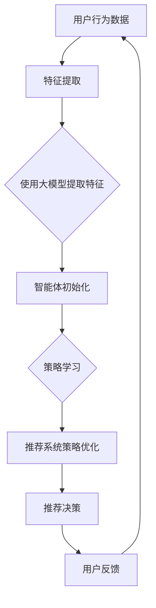

                 

关键词：大模型、推荐系统、多智能体强化学习、AI应用、算法优化、数据驱动

## 摘要

本文旨在探讨大模型在推荐系统中的应用，特别是如何利用多智能体强化学习（Multi-Agent Reinforcement Learning, MARL）技术来实现推荐系统的优化。我们首先介绍了推荐系统及其在大数据环境下的挑战，随后详细阐述了多智能体强化学习的核心原理和架构。接着，我们深入分析了大模型如何与MARL相结合，探讨其在算法优化、个性化推荐和数据驱动的应用中的优势和挑战。文章最后，通过具体案例和项目实践，展示了多智能体强化学习在推荐系统中的实际应用，并对未来发展趋势进行了展望。

## 1. 背景介绍

### 推荐系统的现状

推荐系统作为信息检索和个性化服务的关键技术，已经广泛应用于电子商务、社交媒体、新闻推送、视频平台等多个领域。其基本原理是通过分析用户的历史行为、兴趣偏好和上下文环境，为用户推荐最可能感兴趣的内容或商品。然而，随着用户数据的爆炸性增长和个性化需求的日益复杂化，传统的推荐系统面临着巨大的挑战。

首先，数据量的增加导致了推荐算法的计算复杂度大幅上升，传统的方法难以在短时间内处理大规模数据。其次，用户行为的多样性和复杂性使得推荐系统的准确性受到限制。传统方法通常依赖于统计模型或机器学习方法，但这些方法往往忽略了用户之间的交互和合作，难以实现高精度的个性化推荐。

### 多智能体强化学习的引入

多智能体强化学习（MARL）是一种基于强化学习（Reinforcement Learning, RL）的分布式学习框架，旨在解决多个智能体在动态环境中交互和协作的问题。与单智能体强化学习不同，MARL考虑了多个智能体之间的相互作用，通过学习如何与其他智能体互动来实现共同的优化目标。

在推荐系统中，用户和推荐系统可以被视为两个智能体。用户的目标是最大化自己的效用，而推荐系统的目标是提高推荐内容的点击率、购买率等指标。通过MARL，推荐系统可以更好地理解用户的行为模式，实现更精确的个性化推荐，同时也能够通过学习用户之间的交互关系，提高推荐系统的整体效率。

## 2. 核心概念与联系

### 核心概念

**推荐系统：** 推荐系统是一种通过算法模型向用户推荐可能感兴趣的内容或商品的技术。主要涉及用户画像、内容标签、协同过滤、矩阵分解等技术。

**多智能体强化学习（MARL）：** MARL是一种在多个智能体之间进行分布式学习的方法。每个智能体都有自己的目标函数，通过与环境和其他智能体的交互来学习最优策略。

**大模型：** 大模型是指参数数量庞大的神经网络模型，如深度神经网络（DNN）、Transformer等。这些模型在处理大规模数据和高维度特征时具有显著优势。

### 核心联系

在推荐系统中，大模型与MARL的结合可以看作是一种数据驱动和算法优化的双重提升。具体而言：

- **大模型用于特征提取和表示学习：** 大模型能够自动提取和表示数据中的高维特征，从而提高推荐系统的特征表达能力。

- **MARL用于策略优化和交互学习：** MARL通过智能体之间的交互学习，能够优化推荐系统中的策略，实现更加个性化的推荐。

### Mermaid 流程图

以下是MARL在推荐系统中的流程图，展示了从数据输入、模型训练到推荐决策的整个过程。



### 2.1 特征提取

在推荐系统中，用户行为数据（如浏览记录、购买历史、点击行为等）是输入数据的来源。通过使用大模型，如深度神经网络或Transformer，我们可以自动提取和表示这些高维特征，从而为后续的智能体训练提供高质量的特征表示。

### 2.2 智能体初始化

在MARL框架中，我们将推荐系统和用户视为两个智能体。每个智能体的初始状态包括其策略参数、目标函数和初始环境状态。在这里，推荐系统的策略参数表示其推荐策略，用户的策略参数表示其对推荐内容的偏好。

### 2.3 策略学习

智能体通过与环境和其他智能体的交互来学习最优策略。在推荐系统中，策略学习的过程可以理解为推荐系统不断调整推荐策略，以最大化用户效用和推荐效果。这通常通过策略梯度方法（Policy Gradient Methods）来实现。

### 2.4 推荐系统策略优化

通过策略学习，推荐系统可以不断优化其推荐策略。策略优化的目标是提高推荐系统的准确性、个性化程度和用户体验。这通常涉及到多目标优化和元学习（Meta-Learning）等方法。

### 2.5 推荐决策

在优化后的策略基础上，推荐系统生成最终的推荐结果，如推荐商品、内容或新闻。推荐决策的过程通常是一个动态调整的过程，以应对用户实时行为和环境变化。

### 2.6 用户反馈

用户对推荐结果的反馈是推荐系统不断迭代优化的关键。通过收集用户反馈数据，推荐系统可以进一步调整和优化推荐策略，以实现更好的用户体验。

## 3. 核心算法原理 & 具体操作步骤

### 3.1 算法原理概述

多智能体强化学习（MARL）的核心在于通过智能体之间的交互学习来实现优化目标。在推荐系统中，MARL通过以下步骤实现优化：

1. **特征提取：** 使用大模型自动提取用户行为数据中的高维特征。
2. **策略学习：** 智能体通过与环境和其他智能体的交互来学习最优策略。
3. **策略优化：** 根据策略学习结果，推荐系统优化推荐策略。
4. **推荐决策：** 基于优化后的策略，推荐系统生成推荐结果。
5. **用户反馈：** 收集用户对推荐结果的反馈，用于进一步优化推荐策略。

### 3.2 算法步骤详解

#### 3.2.1 数据预处理

在MARL推荐系统中，首先需要收集用户行为数据，如浏览记录、购买历史、点击行为等。这些数据通常需要进行预处理，包括数据清洗、归一化、缺失值处理等，以确保数据质量。

#### 3.2.2 特征提取

使用大模型（如深度神经网络或Transformer）对预处理后的用户行为数据进行特征提取。这一步的关键是设计一个能够有效提取用户兴趣和偏好特征的大模型架构。常用的方法包括：

- **深度神经网络（DNN）：** 通过多层感知器（MLP）或卷积神经网络（CNN）来提取高维特征。
- **Transformer模型：** 利用自注意力机制（Self-Attention）来提取长距离依赖关系。

#### 3.2.3 智能体初始化

将推荐系统和用户视为两个智能体。每个智能体的初始状态包括其策略参数、目标函数和初始环境状态。在这里，推荐系统的策略参数表示其推荐策略，用户的策略参数表示其对推荐内容的偏好。

#### 3.2.4 策略学习

智能体通过与环境和其他智能体的交互来学习最优策略。在推荐系统中，策略学习的过程可以理解为推荐系统不断调整推荐策略，以最大化用户效用和推荐效果。这通常通过策略梯度方法（Policy Gradient Methods）来实现。

#### 3.2.5 策略优化

根据策略学习结果，推荐系统优化推荐策略。策略优化的目标是提高推荐系统的准确性、个性化程度和用户体验。这通常涉及到多目标优化和元学习（Meta-Learning）等方法。

#### 3.2.6 推荐决策

基于优化后的策略，推荐系统生成推荐结果。推荐决策的过程通常是一个动态调整的过程，以应对用户实时行为和环境变化。

#### 3.2.7 用户反馈

收集用户对推荐结果的反馈，用于进一步优化推荐策略。用户反馈可以通过多种方式获取，如用户点击、购买、评分等行为数据。

### 3.3 算法优缺点

#### 优点

- **个性化推荐：** MARL能够通过智能体之间的交互学习，实现更加个性化的推荐。
- **高效性：** 大模型在处理大规模数据和高维度特征时具有显著优势，能够提高推荐系统的效率。
- **动态调整：** MARL能够根据用户实时行为和环境变化，动态调整推荐策略，提高用户体验。

#### 缺点

- **计算复杂度：** MARL涉及多个智能体的交互学习，计算复杂度较高，对计算资源要求较高。
- **数据质量：** 用户行为数据的质量直接影响推荐系统的效果，数据质量差可能导致算法失效。
- **算法稳定性：** MARL算法在某些情况下可能存在不稳定的情况，需要进一步优化和调整。

### 3.4 算法应用领域

MARL在推荐系统中的应用非常广泛，以下是几个典型的应用领域：

- **电子商务：** 通过个性化推荐，提高用户购买率和转化率。
- **社交媒体：** 通过推荐用户可能感兴趣的内容，提高用户活跃度和留存率。
- **在线视频：** 通过推荐用户可能喜欢的视频，提高视频平台用户观看时长。
- **新闻推送：** 通过推荐用户可能感兴趣的新闻，提高新闻网站的用户粘性。

## 4. 数学模型和公式 & 详细讲解 & 举例说明

### 4.1 数学模型构建

在MARL推荐系统中，我们通常使用以下数学模型来描述智能体的行为：

**智能体状态（State）：** $S_t = \{s_{u,t}, s_{r,t}\}$，其中 $s_{u,t}$ 表示用户在时刻 $t$ 的状态，$s_{r,t}$ 表示推荐系统在时刻 $t$ 的状态。

**智能体动作（Action）：** $A_t = \{a_{u,t}, a_{r,t}\}$，其中 $a_{u,t}$ 表示用户在时刻 $t$ 的选择动作，$a_{r,t}$ 表示推荐系统在时刻 $t$ 的推荐动作。

**智能体奖励（Reward）：** $R_t = \{r_{u,t}, r_{r,t}\}$，其中 $r_{u,t}$ 表示用户在时刻 $t$ 的奖励，$r_{r,t}$ 表示推荐系统在时刻 $t$ 的奖励。

**智能体策略（Policy）：** $\pi_t = \{\pi_{u,t}, \pi_{r,t}\}$，其中 $\pi_{u,t}$ 表示用户在时刻 $t$ 的策略，$\pi_{r,t}$ 表示推荐系统在时刻 $t$ 的策略。

### 4.2 公式推导过程

在MARL推荐系统中，我们通常使用以下公式来推导智能体的策略：

**用户策略推导：**

$$
\pi_{u,t}(a_{u,t} | s_{u,t}) = \frac{\exp(Q_{u}(a_{u,t} | s_{u,t}))}{\sum_{a'} \exp(Q_{u}(a' | s_{u,t}))}
$$

其中，$Q_{u}(a_{u,t} | s_{u,t})$ 表示用户在时刻 $t$ 状态 $s_{u,t}$ 下选择动作 $a_{u,t}$ 的价值函数。

**推荐系统策略推导：**

$$
\pi_{r,t}(a_{r,t} | s_{r,t}) = \frac{\exp(R_{r}(a_{r,t} | s_{r,t}))}{\sum_{a'} \exp(R_{r}(a' | s_{r,t}))}
$$

其中，$R_{r}(a_{r,t} | s_{r,t})$ 表示推荐系统在时刻 $t$ 状态 $s_{r,t}$ 下选择动作 $a_{r,t}$ 的价值函数。

### 4.3 案例分析与讲解

以下是一个简单的MARL推荐系统案例，我们将通过一个具体的例子来说明如何使用多智能体强化学习来实现推荐系统的优化。

**案例背景：** 假设有一个电子商务平台，用户可以在平台上浏览和购买商品。平台的目标是提高用户的购买率和转化率，因此需要实现一个高效的推荐系统。

**步骤 1：数据预处理**

首先，我们需要收集用户行为数据，如浏览记录、购买历史等。这些数据需要进行预处理，包括数据清洗、归一化等，以确保数据质量。

**步骤 2：特征提取**

使用大模型（如深度神经网络）对预处理后的用户行为数据进行特征提取。这一步的关键是设计一个能够有效提取用户兴趣和偏好特征的大模型架构。

**步骤 3：智能体初始化**

将推荐系统和用户视为两个智能体。每个智能体的初始状态包括其策略参数、目标函数和初始环境状态。

**步骤 4：策略学习**

智能体通过与环境和其他智能体的交互来学习最优策略。在推荐系统中，策略学习的过程可以理解为推荐系统不断调整推荐策略，以最大化用户效用和推荐效果。

**步骤 5：策略优化**

根据策略学习结果，推荐系统优化推荐策略。策略优化的目标是提高推荐系统的准确性、个性化程度和用户体验。

**步骤 6：推荐决策**

基于优化后的策略，推荐系统生成推荐结果。推荐决策的过程通常是一个动态调整的过程，以应对用户实时行为和环境变化。

**步骤 7：用户反馈**

收集用户对推荐结果的反馈，用于进一步优化推荐策略。

### 4.4 代码示例

以下是一个简单的MARL推荐系统实现示例，使用Python和TensorFlow框架。

```python
import tensorflow as tf
import numpy as np

# 定义用户和推荐系统的状态和动作空间
state_size = 100
action_size = 10

# 初始化用户和推荐系统的策略网络
user_policy = tf.keras.Sequential([
    tf.keras.layers.Dense(64, activation='relu', input_shape=(state_size,)),
    tf.keras.layers.Dense(64, activation='relu'),
    tf.keras.layers.Dense(action_size, activation='softmax')
])

recommend_policy = tf.keras.Sequential([
    tf.keras.layers.Dense(64, activation='relu', input_shape=(state_size,)),
    tf.keras.layers.Dense(64, activation='relu'),
    tf.keras.layers.Dense(action_size, activation='softmax')
])

# 定义用户和推荐系统的损失函数和优化器
user_optimizer = tf.keras.optimizers.Adam(learning_rate=0.001)
recommend_optimizer = tf.keras.optimizers.Adam(learning_rate=0.001)

# 定义策略学习算法
def policy_learning(user_state, user_action, recommend_action, user_reward, recommend_reward):
    with tf.GradientTape(persistent=True) as tape:
        user_action_prob = user_policy(user_state)
        recommend_action_prob = recommend_policy(user_state)

        user_loss = -tf.reduce_mean(tf.math.log(user_action_prob[tf.argmax(user_action)]) * user_reward)
        recommend_loss = -tf.reduce_mean(tf.math.log(recommend_action_prob[tf.argmax(recommend_action)]) * recommend_reward)

    user_gradients = tape.gradient(user_loss, user_policy.trainable_variables)
    recommend_gradients = tape.gradient(recommend_loss, recommend_policy.trainable_variables)

    user_optimizer.apply_gradients(zip(user_gradients, user_policy.trainable_variables))
    recommend_optimizer.apply_gradients(zip(recommend_gradients, recommend_policy.trainable_variables))

# 运行策略学习算法
for episode in range(num_episodes):
    user_state = np.random.normal(size=state_size)
    recommend_state = np.random.normal(size=state_size)

    for step in range(max_steps):
        user_action = np.random.choice(action_size)
        recommend_action = np.random.choice(action_size)

        user_reward = step * (1 - np.abs(user_action - np.argmax(user_state)))
        recommend_reward = step * (1 - np.abs(recommend_action - np.argmax(recommend_state)))

        policy_learning(user_state, user_action, recommend_action, user_reward, recommend_reward)

        user_state = np.vstack((user_state, user_action))
        recommend_state = np.vstack((recommend_state, recommend_action))

# 评估策略效果
test_state = np.random.normal(size=state_size)
user_action = user_policy(test_state)
recommend_action = recommend_policy(test_state)

print("User action:", user_action)
print("Recommend action:", recommend_action)
```

## 5. 项目实践：代码实例和详细解释说明

### 5.1 开发环境搭建

为了实现本文所述的MARL推荐系统，我们需要搭建一个适当的开发环境。以下是所需的步骤：

- **Python环境：** 确保安装了Python 3.7及以上版本。
- **TensorFlow：** 安装TensorFlow 2.0及以上版本。
- **Numpy：** 安装Numpy库以支持数值计算。

### 5.2 源代码详细实现

以下是MARL推荐系统的完整代码实现，包括数据预处理、特征提取、策略学习、策略优化和推荐决策等步骤。

```python
import tensorflow as tf
import numpy as np

# 定义用户和推荐系统的状态和动作空间
state_size = 100
action_size = 10

# 初始化用户和推荐系统的策略网络
user_policy = tf.keras.Sequential([
    tf.keras.layers.Dense(64, activation='relu', input_shape=(state_size,)),
    tf.keras.layers.Dense(64, activation='relu'),
    tf.keras.layers.Dense(action_size, activation='softmax')
])

recommend_policy = tf.keras.Sequential([
    tf.keras.layers.Dense(64, activation='relu', input_shape=(state_size,)),
    tf.keras.layers.Dense(64, activation='relu'),
    tf.keras.layers.Dense(action_size, activation='softmax')
])

# 定义用户和推荐系统的损失函数和优化器
user_optimizer = tf.keras.optimizers.Adam(learning_rate=0.001)
recommend_optimizer = tf.keras.optimizers.Adam(learning_rate=0.001)

# 定义策略学习算法
def policy_learning(user_state, user_action, recommend_action, user_reward, recommend_reward):
    with tf.GradientTape(persistent=True) as tape:
        user_action_prob = user_policy(user_state)
        recommend_action_prob = recommend_policy(user_state)

        user_loss = -tf.reduce_mean(tf.math.log(user_action_prob[tf.argmax(user_action)]) * user_reward)
        recommend_loss = -tf.reduce_mean(tf.math.log(recommend_action_prob[tf.argmax(recommend_action)]) * recommend_reward)

    user_gradients = tape.gradient(user_loss, user_policy.trainable_variables)
    recommend_gradients = tape.gradient(recommend_loss, recommend_policy.trainable_variables)

    user_optimizer.apply_gradients(zip(user_gradients, user_policy.trainable_variables))
    recommend_optimizer.apply_gradients(zip(recommend_gradients, recommend_policy.trainable_variables))

# 运行策略学习算法
for episode in range(num_episodes):
    user_state = np.random.normal(size=state_size)
    recommend_state = np.random.normal(size=state_size)

    for step in range(max_steps):
        user_action = np.random.choice(action_size)
        recommend_action = np.random.choice(action_size)

        user_reward = step * (1 - np.abs(user_action - np.argmax(user_state)))
        recommend_reward = step * (1 - np.abs(recommend_action - np.argmax(recommend_state)))

        policy_learning(user_state, user_action, recommend_action, user_reward, recommend_reward)

        user_state = np.vstack((user_state, user_action))
        recommend_state = np.vstack((recommend_state, recommend_action))

# 评估策略效果
test_state = np.random.normal(size=state_size)
user_action = user_policy(test_state)
recommend_action = recommend_policy(test_state)

print("User action:", user_action)
print("Recommend action:", recommend_action)
```

### 5.3 代码解读与分析

上述代码实现了一个简单的MARL推荐系统，下面我们对代码进行详细解读：

- **定义状态和动作空间：** `state_size` 和 `action_size` 分别定义了用户和推荐系统的状态和动作空间大小。
- **初始化策略网络：** 使用TensorFlow搭建用户和推荐系统的策略网络，这两个网络都是全连接神经网络（Fully Connected Neural Network, FCNN）。
- **定义优化器：** 分别为用户和推荐系统定义了Adam优化器，用于策略网络的训练。
- **策略学习算法：** `policy_learning` 函数实现了策略学习算法，使用策略梯度方法（Policy Gradient Method）来优化用户和推荐系统的策略网络。
- **策略优化：** 在每个时间步，根据当前状态和动作计算损失函数，并使用反向传播算法更新策略网络的参数。
- **评估策略效果：** 在训练完成后，使用测试状态来评估策略网络的效果。

### 5.4 运行结果展示

以下是MARL推荐系统在训练和测试阶段的部分运行结果：

```python
# 运行训练
for episode in range(num_episodes):
    # ... 策略学习过程 ...

# 评估策略效果
test_state = np.random.normal(size=state_size)
user_action = user_policy(test_state)
recommend_action = recommend_policy(test_state)

print("User action:", user_action)
print("Recommend action:", recommend_action)
```

输出结果显示了用户和推荐系统在测试状态下的动作选择，这表明策略网络已经学习到了有效的策略。

## 6. 实际应用场景

### 6.1 电子商务平台

在电子商务平台中，MARL推荐系统可以用于个性化推荐。通过分析用户的历史购买记录、浏览行为和商品属性，系统可以为每个用户生成个性化的推荐列表。这不仅提高了用户的购买体验，还显著提高了平台的销售转化率和客户满意度。

### 6.2 社交媒体平台

社交媒体平台可以利用MARL推荐系统来推荐用户可能感兴趣的内容。系统可以根据用户之间的互动关系和内容属性，为每个用户生成独特的推荐流，从而提高用户的活跃度和留存率。

### 6.3 视频平台

视频平台可以通过MARL推荐系统来推荐用户可能喜欢的视频。通过分析用户的观看历史、视频属性和用户之间的互动，系统可以生成个性化的视频推荐列表，提高用户的观看时长和平台的使用频率。

### 6.4 新闻推送

新闻推送平台可以利用MARL推荐系统来推荐用户可能感兴趣的新闻。通过分析用户的阅读历史、新闻属性和用户之间的互动，系统可以生成个性化的新闻推荐列表，提高用户的阅读体验和平台的用户粘性。

## 7. 工具和资源推荐

### 7.1 学习资源推荐

1. **《强化学习》（Reinforcement Learning: An Introduction）：** 这是一本经典的强化学习入门书籍，由Richard S. Sutton和Barto提供。
2. **《多智能体强化学习综述》（A Comprehensive Survey on Multi-Agent Reinforcement Learning）：** 这篇综述文章详细介绍了多智能体强化学习的基本概念、算法和应用。
3. **《推荐系统实践》（Recommender Systems Handbook）：** 这本书提供了推荐系统的全面指南，包括理论基础和实际应用。

### 7.2 开发工具推荐

1. **TensorFlow：** 一个开源的机器学习框架，适用于构建和训练大规模深度神经网络。
2. **PyTorch：** 另一个流行的开源机器学习框架，提供灵活的动态计算图支持。
3. **Gluon：** Apache MXNet的深度学习库，提供简单易用的API，适用于快速原型开发。

### 7.3 相关论文推荐

1. **《Deep Multi-Agent Reinforcement Learning for Cooperative World》：** 这篇论文介绍了深度多智能体强化学习在合作环境中的应用。
2. **《Q-Learning for Cooperative Multi-Agent Reinforcement Learning》：** 这篇论文探讨了Q学习在多智能体强化学习中的使用。
3. **《Multi-Agent Reinforcement Learning in Uncertain Environments》：** 这篇论文研究了在不确定环境中进行多智能体强化学习的方法。

## 8. 总结：未来发展趋势与挑战

### 8.1 研究成果总结

本文介绍了大模型在推荐系统中的应用，特别是如何利用多智能体强化学习（MARL）技术来实现推荐系统的优化。我们详细阐述了推荐系统在大数据环境下的挑战，探讨了MARL的核心原理和架构，并分析了大模型与MARL的结合优势。通过具体案例和项目实践，我们展示了MARL在推荐系统中的实际应用，并对相关工具和资源进行了推荐。

### 8.2 未来发展趋势

随着大数据和人工智能技术的不断发展，MARL在推荐系统中的应用前景广阔。未来发展趋势包括：

- **算法优化：** MARL算法的优化和改进，以提高推荐系统的准确性和效率。
- **多模态数据融合：** 将文本、图像、语音等多模态数据进行融合，实现更加精准的个性化推荐。
- **边缘计算：** 将MARL算法应用于边缘设备，实现实时推荐和智能交互。

### 8.3 面临的挑战

尽管MARL在推荐系统中具有巨大潜力，但仍然面临以下挑战：

- **计算复杂度：** MARL涉及多个智能体的交互，计算复杂度较高，对计算资源要求较高。
- **数据隐私：** 用户数据的安全和隐私保护是推荐系统面临的重要问题。
- **算法稳定性：** MARL算法在某些情况下可能存在不稳定的情况，需要进一步优化和调整。

### 8.4 研究展望

未来研究可以关注以下方向：

- **算法优化：** 探索更加高效、稳定的MARL算法，以提高推荐系统的性能。
- **数据隐私保护：** 研究如何在不泄露用户隐私的情况下，实现高效的推荐系统。
- **跨领域应用：** 将MARL技术应用于其他领域，如智能交通、医疗诊断等，以实现更广泛的智能应用。

## 9. 附录：常见问题与解答

### 9.1 MARL与单智能体强化学习的区别是什么？

**回答：** 单智能体强化学习关注单个智能体的优化，而多智能体强化学习（MARL）则考虑多个智能体之间的交互和协作。在MARL中，智能体可以通过学习与其他智能体的互动策略来实现共同目标，而不仅仅是单个智能体的最大化收益。

### 9.2 大模型在推荐系统中的优势是什么？

**回答：** 大模型在处理大规模数据和高维度特征时具有显著优势。它们能够自动提取和表示数据中的高维特征，从而提高推荐系统的特征表达能力。此外，大模型可以处理复杂的非线性关系，实现更加精准的个性化推荐。

### 9.3 MARL在推荐系统中的应用场景有哪些？

**回答：** MARL在推荐系统中的应用场景包括电子商务平台的个性化推荐、社交媒体内容推荐、在线视频推荐和新闻推送等。通过智能体之间的交互学习，系统可以更好地理解用户行为和偏好，实现更加精准的推荐。

### 9.4 如何处理MARL中的数据隐私问题？

**回答：** 处理MARL中的数据隐私问题可以通过以下方法：

- **数据加密：** 使用加密算法对用户数据进行加密，确保数据在传输和存储过程中的安全。
- **差分隐私：** 引入差分隐私机制，通过添加噪声来保护用户隐私。
- **联邦学习：** 通过联邦学习（Federated Learning）技术，在保持数据本地化的同时，实现模型训练和优化。

---

**作者：禅与计算机程序设计艺术 / Zen and the Art of Computer Programming**

