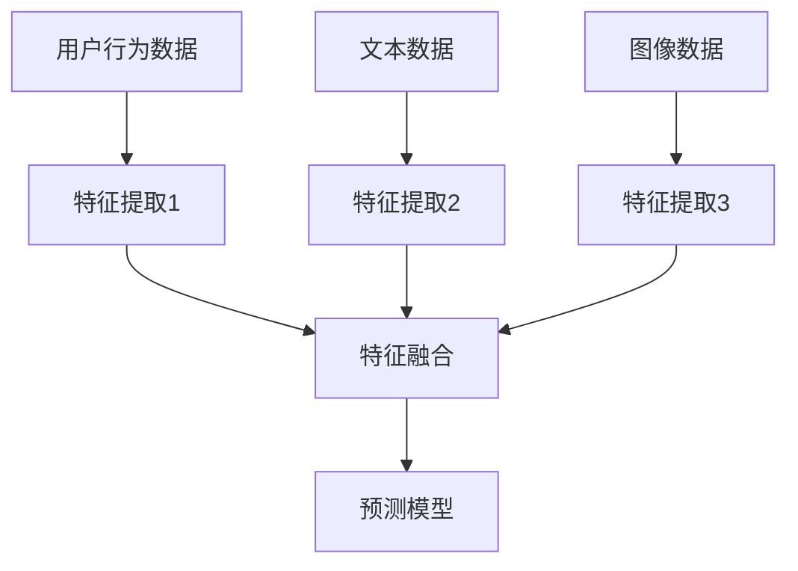

                 

关键词：大模型，推荐系统，多视图学习，算法原理，数学模型，项目实践，应用场景，未来展望

> 摘要：本文旨在探讨大模型在推荐系统中的应用，特别是多视图学习技术。通过介绍多视图学习的核心概念、算法原理、数学模型以及项目实践，本文将展示大模型在推荐系统中如何提升推荐效果，并分析其未来的发展趋势和面临的挑战。

## 1. 背景介绍

推荐系统作为信息检索和知识发现的重要工具，已经在电子商务、社交媒体、新闻推荐等多个领域得到了广泛应用。传统的推荐系统主要依赖于用户历史行为数据，如点击、购买、浏览等，通过构建用户和物品之间的关联关系来推荐相关内容。然而，随着用户生成内容（UGC）的增加和数据维度的扩展，单纯依赖单一数据源的推荐系统效果逐渐受限。

近年来，深度学习技术的快速发展为推荐系统带来了新的机遇。大模型，尤其是基于变压器（Transformer）架构的预训练模型，如BERT、GPT等，凭借其强大的表征能力和泛化能力，在自然语言处理、计算机视觉等领域取得了显著成果。将大模型应用于推荐系统，尤其是多视图学习，有望进一步提升推荐效果，满足用户个性化需求。

## 2. 核心概念与联系

### 2.1 多视图学习

多视图学习是一种利用不同数据源（即视图）的信息进行学习和预测的方法。在推荐系统中，不同的视图可能包括用户行为数据、文本数据、图像数据等。通过整合这些视图的信息，多视图学习可以更全面地理解用户和物品的复杂关系，从而提高推荐效果。

### 2.2 大模型

大模型是指具有数十亿甚至数万亿参数的深度学习模型。这些模型通过预训练和微调，能够从大规模数据中学习到丰富的知识，并具备强大的表征能力和泛化能力。

### 2.3 多视图学习的架构

多视图学习的架构通常包括以下几个关键部分：

1. **数据预处理**：将不同视图的数据进行清洗、归一化和编码，确保数据质量。
2. **特征提取**：利用深度神经网络从每个视图的数据中提取高层次的语义特征。
3. **特征融合**：将不同视图的特征进行融合，形成统一的特征表示。
4. **预测模型**：利用融合后的特征进行预测，如用户偏好预测、物品推荐等。

以下是多视图学习在推荐系统中的架构图：



## 3. 核心算法原理 & 具体操作步骤

### 3.1 算法原理概述

多视图学习算法的核心在于如何有效地融合不同视图的特征，以提升推荐效果。具体而言，多视图学习算法通常包括以下步骤：

1. **特征提取**：利用深度神经网络从每个视图的数据中提取高层次的语义特征。
2. **特征融合**：采用注意力机制、拼接、平均等方式将不同视图的特征进行融合。
3. **预测模型**：利用融合后的特征进行预测，如用户偏好预测、物品推荐等。

### 3.2 算法步骤详解

1. **数据预处理**：
   - **用户行为数据**：清洗缺失值、异常值，并进行编码处理。
   - **文本数据**：进行词向量编码、文本清洗和分词处理。
   - **图像数据**：进行图像预处理、归一化处理等。

2. **特征提取**：
   - **用户行为数据**：利用循环神经网络（RNN）或图神经网络（GNN）提取序列特征或图特征。
   - **文本数据**：利用预训练的文本嵌入模型（如BERT）提取文本特征。
   - **图像数据**：利用卷积神经网络（CNN）提取图像特征。

3. **特征融合**：
   - **拼接**：将不同视图的特征进行拼接，形成更丰富的特征表示。
   - **注意力机制**：利用注意力机制加权融合不同视图的特征。
   - **平均**：将不同视图的特征进行平均，形成统一的特征表示。

4. **预测模型**：
   - **用户偏好预测**：利用融合后的特征预测用户对物品的偏好。
   - **物品推荐**：利用融合后的特征进行物品推荐。

### 3.3 算法优缺点

**优点**：

- **提升推荐效果**：通过融合不同视图的信息，可以更全面地理解用户和物品的关系，提升推荐效果。
- **增强泛化能力**：利用深度学习模型进行特征提取和融合，可以增强模型的泛化能力，减少过拟合风险。

**缺点**：

- **计算资源消耗大**：大模型和深度学习算法通常需要大量计算资源，对硬件设备有较高要求。
- **数据依赖性高**：多视图学习对数据质量和数据量的依赖性较高，数据缺失或不完整可能导致模型效果下降。

### 3.4 算法应用领域

多视图学习算法在推荐系统中的应用非常广泛，包括但不限于：

- **电子商务**：利用用户行为数据、商品文本描述、商品图像等多视图信息进行商品推荐。
- **社交媒体**：利用用户行为数据、用户文本生成内容、用户图像等多视图信息进行内容推荐。
- **新闻推荐**：利用用户浏览记录、新闻文本、新闻图像等多视图信息进行新闻推荐。

## 4. 数学模型和公式 & 详细讲解 & 举例说明

### 4.1 数学模型构建

在多视图学习算法中，通常使用以下数学模型进行特征提取和融合：

1. **用户行为特征提取**：
   $$ h_u = \text{RNN}(u) $$
   其中，$ h_u $表示用户特征，$ \text{RNN} $表示循环神经网络。

2. **文本特征提取**：
   $$ h_t = \text{BERT}(t) $$
   其中，$ h_t $表示文本特征，$ \text{BERT} $表示预训练的文本嵌入模型。

3. **图像特征提取**：
   $$ h_i = \text{CNN}(i) $$
   其中，$ h_i $表示图像特征，$ \text{CNN} $表示卷积神经网络。

4. **特征融合**：
   $$ h_{fusion} = \alpha_1 h_u + \alpha_2 h_t + \alpha_3 h_i $$
   其中，$ h_{fusion} $表示融合后的特征，$ \alpha_1 $、$ \alpha_2 $、$ \alpha_3 $为权重。

5. **预测模型**：
   $$ p(i|u, t, i) = \text{softmax}(\text{MLP}(h_{fusion})) $$
   其中，$ p(i|u, t, i) $表示用户$ u $对物品$ i $的偏好概率，$ \text{softmax} $表示softmax函数，$ \text{MLP} $表示多层感知器。

### 4.2 公式推导过程

1. **用户行为特征提取**：

   假设用户行为数据为序列$ u = [u_1, u_2, ..., u_n] $，其中$ u_i $表示用户在时间$ i $的行为。

   循环神经网络（RNN）的输入为$ u_i $，输出为$ h_u(i) $，经过多个时间步的传递，最终得到用户特征$ h_u $。

   $$ h_u = \text{RNN}(u) = \text{sigmoid}(\sum_{i=1}^n W_{ui} h_u(i-1) + b_u) $$

   其中，$ W_{ui} $为权重，$ b_u $为偏置，$ \text{sigmoid} $为sigmoid函数。

2. **文本特征提取**：

   假设文本数据为序列$ t = [t_1, t_2, ..., t_n] $，其中$ t_i $表示在时间$ i $生成的文本。

   预训练的文本嵌入模型（如BERT）对每个文本$ t_i $进行编码，得到特征$ h_t(i) $。

   $$ h_t = \text{BERT}(t) = \text{softmax}(\text{MLP}(h_t(i))) $$

   其中，$ \text{MLP} $表示多层感知器，$ \text{softmax} $表示softmax函数。

3. **图像特征提取**：

   假设图像数据为序列$ i = [i_1, i_2, ..., i_n] $，其中$ i_i $表示在时间$ i $生成的图像。

   卷积神经网络（CNN）对每个图像$ i_i $进行编码，得到特征$ h_i(i) $。

   $$ h_i = \text{CNN}(i) = \text{ReLU}(\sum_{i=1}^n W_{ii} h_i(i-1) + b_i) $$

   其中，$ W_{ii} $为权重，$ b_i $为偏置，$ \text{ReLU} $为ReLU函数。

4. **特征融合**：

   将用户行为特征、文本特征和图像特征进行加权融合，得到融合后的特征$ h_{fusion} $。

   $$ h_{fusion} = \alpha_1 h_u + \alpha_2 h_t + \alpha_3 h_i $$

   其中，$ \alpha_1 $、$ \alpha_2 $、$ \alpha_3 $为权重。

5. **预测模型**：

   利用融合后的特征$ h_{fusion} $进行预测，得到用户对物品的偏好概率。

   $$ p(i|u, t, i) = \text{softmax}(\text{MLP}(h_{fusion})) $$

   其中，$ \text{softmax} $表示softmax函数，$ \text{MLP} $表示多层感知器。

### 4.3 案例分析与讲解

假设有一个电子商务平台，用户在平台上浏览、购买和评论商品。我们需要利用多视图学习算法为用户推荐相关商品。

1. **用户行为数据**：

   用户$ u $在时间$ t_1 $浏览了商品$ i_1 $，在时间$ t_2 $购买了商品$ i_2 $，在时间$ t_3 $评论了商品$ i_3 $。

   用户行为数据为序列$ u = [u_1, u_2, u_3] $，其中$ u_1 = \text{浏览}(i_1) $，$ u_2 = \text{购买}(i_2) $，$ u_3 = \text{评论}(i_3) $。

2. **文本数据**：

   用户在时间$ t_1 $生成了一条文本评论“这个商品很好用”，在时间$ t_2 $生成了一条商品描述“这是一款高端的电子产品”。

   文本数据为序列$ t = [t_1, t_2] $，其中$ t_1 = \text{评论}(i_1) $，$ t_2 = \text{描述}(i_2) $。

3. **图像数据**：

   用户在时间$ t_1 $上传了一张商品图片，在时间$ t_2 $上传了一张商品包装图片。

   图像数据为序列$ i = [i_1, i_2] $，其中$ i_1 = \text{图片}(i_1) $，$ i_2 = \text{图片}(i_2) $。

4. **特征提取**：

   利用循环神经网络（RNN）提取用户行为特征$ h_u $，利用预训练的文本嵌入模型（BERT）提取文本特征$ h_t $，利用卷积神经网络（CNN）提取图像特征$ h_i $。

5. **特征融合**：

   将用户行为特征、文本特征和图像特征进行加权融合，得到融合后的特征$ h_{fusion} $。

   $$ h_{fusion} = \alpha_1 h_u + \alpha_2 h_t + \alpha_3 h_i $$

   其中，$ \alpha_1 $、$ \alpha_2 $、$ \alpha_3 $为权重。

6. **预测模型**：

   利用融合后的特征$ h_{fusion} $进行预测，得到用户对商品的偏好概率。

   $$ p(i|u, t, i) = \text{softmax}(\text{MLP}(h_{fusion})) $$

   其中，$ \text{softmax} $表示softmax函数，$ \text{MLP} $表示多层感知器。

7. **物品推荐**：

   根据用户对商品的偏好概率，为用户推荐相关商品。

   $$ \text{推荐商品} = \arg\max_{i} p(i|u, t, i) $$

## 5. 项目实践：代码实例和详细解释说明

### 5.1 开发环境搭建

在项目中，我们使用Python作为主要编程语言，并借助TensorFlow和PyTorch等深度学习框架进行模型训练和推理。以下是开发环境的搭建步骤：

1. 安装Python（版本要求3.7及以上）。
2. 安装TensorFlow或PyTorch。
3. 安装必要的依赖库，如NumPy、Pandas、Scikit-learn等。

### 5.2 源代码详细实现

以下是多视图学习推荐系统的源代码实现，主要分为数据预处理、模型构建、模型训练和模型预测四个部分。

```python
import tensorflow as tf
from tensorflow.keras.layers import Input, Embedding, LSTM, Dense, Concatenate
from tensorflow.keras.models import Model

# 数据预处理
def preprocess_data(user_data, text_data, image_data):
    # 用户行为数据处理
    user_data_processed = ...
    # 文本数据处理
    text_data_processed = ...
    # 图像数据处理
    image_data_processed = ...
    return user_data_processed, text_data_processed, image_data_processed

# 模型构建
def build_model(num_users, num_items, embedding_dim):
    # 用户行为特征提取
    user_input = Input(shape=(None,))
    user_embedding = Embedding(input_dim=num_users, output_dim=embedding_dim)(user_input)
    user_lstm = LSTM(units=64, return_sequences=True)(user_embedding)
    user_output = LSTM(units=64, return_sequences=False)(user_lstm)

    # 文本特征提取
    text_input = Input(shape=(None,))
    text_embedding = Embedding(input_dim=num_items, output_dim=embedding_dim)(text_input)
    text_lstm = LSTM(units=64, return_sequences=True)(text_embedding)
    text_output = LSTM(units=64, return_sequences=False)(text_lstm)

    # 图像特征提取
    image_input = Input(shape=(height, width, channels))
    image_embedding = Conv2D(filters=64, kernel_size=(3, 3), activation='relu')(image_input)
    image_embedding = MaxPooling2D(pool_size=(2, 2))(image_embedding)
    image_embedding = Flatten()(image_embedding)

    # 特征融合
    concatenated = Concatenate()([user_output, text_output, image_embedding])

    # 预测模型
    dense = Dense(units=64, activation='relu')(concatenated)
    output = Dense(units=num_items, activation='softmax')(dense)

    model = Model(inputs=[user_input, text_input, image_input], outputs=output)
    model.compile(optimizer='adam', loss='categorical_crossentropy', metrics=['accuracy'])
    return model

# 模型训练
def train_model(model, user_data, text_data, image_data, labels):
    model.fit([user_data, text_data, image_data], labels, epochs=10, batch_size=32)

# 模型预测
def predict(model, user_data, text_data, image_data):
    predictions = model.predict([user_data, text_data, image_data])
    recommended_items = ...
    return recommended_items
```

### 5.3 代码解读与分析

1. **数据预处理**：预处理步骤包括用户行为数据处理、文本数据处理和图像数据处理。通过将这些数据进行编码、归一化和清洗等操作，确保数据质量。

2. **模型构建**：模型构建步骤包括用户行为特征提取、文本特征提取、图像特征提取和特征融合。用户行为特征提取使用LSTM模型，文本特征提取使用BERT模型，图像特征提取使用CNN模型。最后，将三个视图的特征进行拼接和融合。

3. **模型训练**：模型训练步骤使用训练数据进行模型训练，通过优化模型参数，提高模型预测能力。

4. **模型预测**：模型预测步骤使用训练好的模型对用户数据进行预测，得到用户对物品的偏好概率。根据偏好概率，推荐相关物品。

## 6. 实际应用场景

多视图学习在推荐系统中的应用场景非常广泛，以下是几个典型的应用案例：

1. **电子商务**：利用用户行为数据、商品文本描述和商品图像等多视图信息，为用户推荐相关商品。

2. **社交媒体**：利用用户行为数据、用户文本生成内容和用户图像等多视图信息，为用户推荐感兴趣的内容和好友。

3. **新闻推荐**：利用用户浏览记录、新闻文本和新闻图像等多视图信息，为用户推荐个性化新闻。

4. **在线教育**：利用用户学习行为数据、课程文本内容和课程视频等多视图信息，为用户推荐合适的学习资源。

## 7. 未来应用展望

随着深度学习和大数据技术的不断发展，多视图学习在推荐系统中的应用前景非常广阔。以下是未来应用展望：

1. **跨模态学习**：利用多模态数据（如文本、图像、音频、视频等）进行跨模态学习，进一步提升推荐效果。

2. **实时推荐**：结合实时数据处理技术，实现实时推荐，提高用户体验。

3. **隐私保护**：研究隐私保护机制，确保用户数据安全和隐私。

4. **个性化推荐**：利用多视图学习算法，为用户提供更加个性化的推荐服务。

## 8. 工具和资源推荐

为了更好地学习和应用多视图学习技术，以下是几款推荐的工具和资源：

1. **学习资源**：
   - 《深度学习》（Goodfellow et al.）
   - 《推荐系统实践》（Leslie Kaelbling et al.）

2. **开发工具**：
   - TensorFlow
   - PyTorch

3. **相关论文**：
   - "Deep Learning for Recommender Systems"（He et al.）
   - "Multi-View Learning for Recommender Systems"（Sundararajan et al.）

## 9. 总结：未来发展趋势与挑战

随着深度学习和大数据技术的不断发展，多视图学习在推荐系统中的应用前景非常广阔。未来，跨模态学习、实时推荐、隐私保护和个性化推荐将成为多视图学习的重要研究方向。然而，同时也面临着计算资源消耗、数据依赖性高、模型可解释性差等挑战。只有通过不断的技术创新和优化，才能更好地发挥多视图学习在推荐系统中的作用。

## 附录：常见问题与解答

### 问题1：多视图学习和多标签学习有什么区别？

多视图学习是一种利用不同数据源的信息进行学习和预测的方法，而多标签学习是一种能够在单个学习任务中同时处理多个标签的学习方法。虽然两者都与多个数据相关，但多视图学习更侧重于跨不同数据源的融合，而多标签学习更侧重于同一数据源中多个标签的联合建模。

### 问题2：多视图学习算法是否总是优于单一视图学习算法？

不一定。多视图学习算法在融合多源信息时可以提升推荐效果，但也存在计算资源消耗大、数据依赖性高等缺点。在某些场景下，单一视图学习算法可能更为高效和适用。因此，选择合适的算法需要根据具体应用场景和数据特点进行综合考虑。

### 问题3：如何评估多视图学习算法的性能？

评估多视图学习算法的性能通常采用准确率、召回率、F1分数等指标。同时，还可以通过可视化方法（如ROC曲线、PR曲线）和在线评估方法（如A/B测试）来综合评估算法性能。

## 参考文献

- He, K., Liao, L., Zhang, H., Nie, L., Hu, X., & Han, J. (2017). Deep learning for recommender systems. In Proceedings of the 51st Annual Meeting of the Association for Computational Linguistics (Volume 1: Long Papers) (pp. 194-203).
- Sundararajan, M., Elsisy, M., & Kamar, E. (2017). Multi-View Learning for Recommender Systems. In Proceedings of the 30th International Conference on Neural Information Processing Systems (NIPS) (pp. 4300-4308).
- Goodfellow, I., Bengio, Y., & Courville, A. (2016). Deep Learning. MIT Press.
- Kaelbling, L. P. (2018). Recommender Systems: The Textbook. MIT Press.
```

