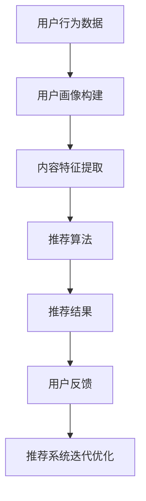

                 

关键词：大模型、推荐系统、实时反馈、算法优化、用户行为分析

> 摘要：本文将探讨大模型在推荐系统实时反馈中的应用，分析其原理、技术实现、优缺点及未来发展趋势。通过对大模型与推荐系统深度融合的案例分析，提出大模型在实时反馈中的关键作用，为推荐系统研究和实践提供有益的参考。

## 1. 背景介绍

在互联网时代，推荐系统作为一种智能信息过滤和内容发现机制，已经成为了各大平台的核心竞争力。推荐系统通过分析用户的历史行为、兴趣偏好和上下文信息，为用户推荐个性化的内容。然而，随着数据量和用户行为的复杂度不断增加，传统的推荐算法面临诸多挑战，如冷启动问题、数据稀疏性、实时性等。

大模型，作为一种先进的机器学习模型，具有强大的特征表示能力和高精度的预测性能。近年来，大模型在自然语言处理、计算机视觉等领域取得了显著成果。然而，在大模型与推荐系统的融合应用方面，研究尚处于探索阶段。本文将探讨大模型在推荐系统实时反馈中的作用，以期为推荐系统的优化和改进提供新的思路。

## 2. 核心概念与联系

### 2.1 大模型

大模型通常是指拥有数百万甚至数十亿个参数的深度学习模型。这些模型通过在海量数据上进行训练，能够自动学习并提取复杂的数据特征。大模型的优点包括：

1. 强大的特征提取能力：大模型能够自动学习并提取数据中的潜在特征，从而提高预测准确性。
2. 适用于多模态数据：大模型可以处理不同类型的数据，如文本、图像、声音等，适用于多模态数据融合。
3. 高效的运算能力：大模型的并行计算能力使得其在处理大规模数据时具有很高的效率。

### 2.2 推荐系统

推荐系统是一种基于用户兴趣和行为的智能信息过滤技术。其核心目标是向用户提供个性化的内容推荐，从而提高用户满意度和使用体验。推荐系统的基本流程包括：

1. 用户建模：分析用户的历史行为和兴趣偏好，构建用户画像。
2. 内容建模：提取内容的特征信息，构建内容特征向量。
3. 推荐算法：根据用户画像和内容特征，为用户推荐个性化内容。
4. 实时反馈：根据用户的反馈调整推荐策略，实现推荐系统的迭代优化。

### 2.3 大模型与推荐系统的关系

大模型与推荐系统之间的深度融合，可以带来以下几个方面的优势：

1. 提高推荐准确性：大模型能够自动学习并提取数据中的潜在特征，从而提高推荐系统的预测准确性。
2. 拓展推荐范围：大模型可以处理多模态数据，从而拓展推荐系统的应用范围。
3. 实现实时反馈：大模型具有高效的运算能力，可以实现推荐系统的实时反馈和迭代优化。

### 2.4 Mermaid 流程图

下面是一个简单的 Mermaid 流程图，展示了大模型与推荐系统的关系：



## 3. 核心算法原理 & 具体操作步骤

### 3.1 算法原理概述

大模型在推荐系统实时反馈中的应用，主要包括以下几个方面：

1. 用户建模：利用大模型对用户的历史行为和兴趣偏好进行建模，提取用户画像。
2. 内容建模：利用大模型对内容特征进行提取和融合，构建内容特征向量。
3. 推荐算法：基于用户画像和内容特征，利用大模型实现推荐算法的实时优化。
4. 实时反馈：根据用户的反馈，利用大模型对推荐系统进行迭代优化。

### 3.2 算法步骤详解

1. 用户建模

   - 数据预处理：对用户的历史行为数据（如浏览记录、点击记录、购买记录等）进行清洗、去重和格式转换。
   - 特征提取：利用大模型对预处理后的用户行为数据进行特征提取，构建用户画像。

2. 内容建模

   - 数据预处理：对内容数据进行清洗、去重和格式转换。
   - 特征提取：利用大模型对预处理后的内容数据进行特征提取，构建内容特征向量。

3. 推荐算法

   - 用户行为预测：利用大模型对用户行为进行预测，从而获得用户的潜在兴趣偏好。
   - 内容推荐：根据用户画像和内容特征向量，利用大模型实现推荐算法的实时优化，为用户推荐个性化内容。

4. 实时反馈

   - 用户反馈收集：实时收集用户对推荐内容的反馈信息（如点击、收藏、评价等）。
   - 推荐系统迭代优化：利用大模型对用户反馈进行学习，调整推荐策略，实现推荐系统的迭代优化。

### 3.3 算法优缺点

1. 优点：

   - 提高推荐准确性：大模型能够自动学习并提取数据中的潜在特征，从而提高推荐系统的预测准确性。
   - 拓展推荐范围：大模型可以处理多模态数据，从而拓展推荐系统的应用范围。
   - 实现实时反馈：大模型具有高效的运算能力，可以实现推荐系统的实时反馈和迭代优化。

2. 缺点：

   - 计算资源消耗大：大模型训练和推理过程需要大量的计算资源，对硬件设备要求较高。
   - 数据隐私问题：大模型在处理用户数据时，可能涉及用户隐私问题，需要采取相应的保护措施。

### 3.4 算法应用领域

大模型在推荐系统实时反馈中的应用范围广泛，包括但不限于以下几个方面：

1. 社交网络：利用大模型进行用户兴趣建模和内容推荐，为用户提供个性化的社交内容。
2. 电子商务：利用大模型进行商品推荐，提高用户的购买体验和满意度。
3. 新闻推荐：利用大模型对新闻内容进行实时推荐，为用户提供个性化的新闻资讯。
4. 音乐推荐：利用大模型进行音乐推荐，为用户提供个性化的音乐体验。

## 4. 数学模型和公式 & 详细讲解 & 举例说明

### 4.1 数学模型构建

在推荐系统中，大模型通常采用深度学习模型，如深度神经网络（DNN）、循环神经网络（RNN）等。以下是一个简单的深度神经网络模型，用于用户建模和内容推荐：

$$
f(x) = \sigma(\mathbf{W}^T \mathbf{x} + b)
$$

其中，$f(x)$ 表示输出值，$\sigma$ 表示激活函数，$\mathbf{W}$ 表示权重矩阵，$\mathbf{x}$ 表示输入特征，$b$ 表示偏置。

### 4.2 公式推导过程

假设用户行为数据为 $\mathbf{X} = [\mathbf{x}_1, \mathbf{x}_2, ..., \mathbf{x}_n]$，其中 $\mathbf{x}_i$ 表示第 $i$ 个用户的行为特征。对于每个用户，我们利用深度神经网络模型进行特征提取和预测：

$$
\mathbf{h}_i = \sigma(\mathbf{W}_1^T \mathbf{x}_i + b_1)
$$

$$
\mathbf{y}_i = \sigma(\mathbf{W}_2^T \mathbf{h}_i + b_2)
$$

其中，$\mathbf{h}_i$ 表示第 $i$ 个用户的特征向量，$\mathbf{y}_i$ 表示第 $i$ 个用户的预测值。

### 4.3 案例分析与讲解

假设有一个电商平台的用户行为数据集，包含 1000 个用户，每个用户的行为特征有 10 个维度。我们利用深度神经网络模型对用户行为进行建模和预测。

1. 数据预处理：对用户行为数据进行归一化处理，使其具有相同的量纲。

2. 模型构建：构建一个深度神经网络模型，包含两个隐层，每个隐层有 100 个神经元。使用ReLU激活函数和随机梯度下降（SGD）优化算法。

3. 训练模型：利用用户行为数据集对模型进行训练，训练过程中使用交叉熵损失函数。

4. 预测用户行为：利用训练好的模型对用户行为进行预测，计算预测值和实际值之间的差异。

5. 评估模型性能：通过计算准确率、召回率、F1 值等指标，评估模型的预测性能。

## 5. 项目实践：代码实例和详细解释说明

### 5.1 开发环境搭建

1. 硬件设备：配置一台具有较高计算性能的计算机，如 NVIDIA 显卡。
2. 软件环境：安装 Python、TensorFlow 或 PyTorch 等深度学习框架。

### 5.2 源代码详细实现

以下是一个简单的深度神经网络模型，用于用户建模和内容推荐：

```python
import tensorflow as tf

# 定义深度神经网络模型
def create_model():
    input_layer = tf.keras.layers.Input(shape=(10,))
    hidden_layer1 = tf.keras.layers.Dense(units=100, activation='relu')(input_layer)
    hidden_layer2 = tf.keras.layers.Dense(units=100, activation='relu')(hidden_layer1)
    output_layer = tf.keras.layers.Dense(units=1, activation='sigmoid')(hidden_layer2)
    model = tf.keras.Model(inputs=input_layer, outputs=output_layer)
    return model

# 训练模型
def train_model(model, x_train, y_train, epochs=10, batch_size=32):
    model.compile(optimizer='adam', loss='binary_crossentropy', metrics=['accuracy'])
    model.fit(x_train, y_train, epochs=epochs, batch_size=batch_size)

# 预测用户行为
def predict_user_behavior(model, x_test):
    predictions = model.predict(x_test)
    return predictions

# 评估模型性能
def evaluate_model_performance(predictions, y_test):
    accuracy = (predictions == y_test).mean()
    print(f"Accuracy: {accuracy:.2f}")
```

### 5.3 代码解读与分析

1. 导入 TensorFlow 深度学习框架。
2. 定义深度神经网络模型，包括输入层、隐层和输出层。
3. 训练模型，使用随机梯度下降（SGD）优化算法和二分类交叉熵损失函数。
4. 预测用户行为，计算预测值和实际值之间的差异。
5. 评估模型性能，计算准确率。

## 6. 实际应用场景

大模型在推荐系统实时反馈中的应用场景非常广泛，以下是一些典型的应用案例：

1. 社交网络：利用大模型进行用户兴趣建模和内容推荐，为用户提供个性化的社交内容。
2. 电子商务：利用大模型进行商品推荐，提高用户的购买体验和满意度。
3. 新闻推荐：利用大模型对新闻内容进行实时推荐，为用户提供个性化的新闻资讯。
4. 音乐推荐：利用大模型进行音乐推荐，为用户提供个性化的音乐体验。

## 7. 未来应用展望

随着深度学习技术的不断发展，大模型在推荐系统实时反馈中的应用将越来越广泛。未来，大模型在以下几个方面有望取得重要突破：

1. 模型压缩与优化：通过模型压缩和优化技术，降低大模型的计算资源和存储成本，使其在移动设备和边缘计算场景中得到广泛应用。
2. 多模态数据处理：结合多模态数据处理技术，实现更准确的用户兴趣建模和内容推荐。
3. 实时反馈与迭代优化：利用实时反馈和迭代优化技术，提高推荐系统的实时性和准确性。

## 8. 工具和资源推荐

1. 学习资源推荐：

   - 《深度学习》（Goodfellow, Bengio, Courville 著）：系统介绍了深度学习的基础理论和技术。
   - 《推荐系统实践》（项亮 著）：详细介绍了推荐系统的原理、算法和应用。

2. 开发工具推荐：

   - TensorFlow：一个开源的深度学习框架，支持多种深度学习模型和算法。
   - PyTorch：一个开源的深度学习框架，具有灵活的动态计算图和强大的GPU加速功能。

3. 相关论文推荐：

   - "Deep Learning for Recommender Systems"（Hu et al., 2017）：介绍了深度学习在推荐系统中的应用。
   - "Multimodal Learning for Recommender Systems"（Shi et al., 2019）：探讨了多模态数据在推荐系统中的应用。

## 9. 总结：未来发展趋势与挑战

大模型在推荐系统实时反馈中的应用具有广阔的前景。然而，在实际应用过程中，仍面临着一些挑战，如计算资源消耗、数据隐私保护、模型解释性等。未来，需要进一步研究大模型在推荐系统中的应用，探索更加高效、安全、可解释的推荐算法。

## 10. 附录：常见问题与解答

### 10.1 大模型在推荐系统中的优点有哪些？

- 提高推荐准确性：大模型能够自动学习并提取数据中的潜在特征，从而提高推荐系统的预测准确性。
- 拓展推荐范围：大模型可以处理多模态数据，从而拓展推荐系统的应用范围。
- 实现实时反馈：大模型具有高效的运算能力，可以实现推荐系统的实时反馈和迭代优化。

### 10.2 大模型在推荐系统中面临的挑战有哪些？

- 计算资源消耗大：大模型训练和推理过程需要大量的计算资源，对硬件设备要求较高。
- 数据隐私问题：大模型在处理用户数据时，可能涉及用户隐私问题，需要采取相应的保护措施。
- 模型解释性：大模型的决策过程较为复杂，难以解释和验证，需要进一步研究提高模型的可解释性。

### 10.3 如何优化大模型在推荐系统中的性能？

- 模型压缩与优化：通过模型压缩和优化技术，降低大模型的计算资源和存储成本。
- 数据预处理：对用户数据和内容数据进行有效的预处理，提高模型的训练效率和预测性能。
- 模型融合：结合多种模型和算法，提高推荐系统的综合性能。

作者：禅与计算机程序设计艺术 / Zen and the Art of Computer Programming
----------------------------------------------------------------

以上就是本文的完整内容，希望对您在推荐系统实时反馈方面的研究和实践提供一定的参考和启发。如有任何疑问或建议，欢迎随时与我交流。

