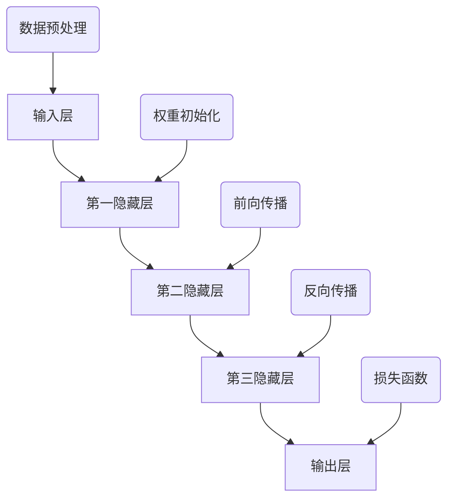

                 

关键词：大模型、新兴市场、人工智能、机遇、风险

> 摘要：随着人工智能技术的不断发展和成熟，大模型在新兴市场中的应用越来越广泛。本文将探讨大模型在新兴市场的机遇与风险，分析其带来的技术进步、经济发展以及潜在的社会影响。

## 1. 背景介绍

随着互联网的普及和智能手机的普及，新兴市场国家的数字基础设施得到了极大改善。这为人工智能技术的应用提供了广阔的空间。大模型作为一种先进的人工智能技术，具有处理复杂数据的能力，可以应用于语音识别、图像识别、自然语言处理等领域。这些应用在医疗、金融、教育、农业等新兴市场行业具有巨大的潜力。

### 1.1 新兴市场的定义与特征

新兴市场通常指的是那些经济增长迅速、市场潜力巨大的国家或地区。这些市场通常具有以下特征：

- **经济增长迅速**：新兴市场国家的经济增长速度通常高于发达国家，有的甚至达到两位数的增长。
- **人口基数大**：许多新兴市场国家拥有庞大的人口基数，这为各种商业活动提供了广阔的市场。
- **数字化进程快**：由于基础设施建设的快速发展，许多新兴市场国家在互联网和移动通信领域的普及速度远超发达国家。

### 1.2 人工智能与新兴市场的结合

人工智能技术，尤其是大模型，在新兴市场国家中的应用主要集中在以下几个方面：

- **语音识别与客服**：许多新兴市场国家的英语普及程度不高，语音识别技术可以提供本地语言的交互方式。
- **图像识别与安全**：随着犯罪率的上升，图像识别技术在监控和安全领域的应用越来越广泛。
- **自然语言处理与教育**：大模型在自然语言处理领域的应用可以帮助新兴市场国家提高教育质量，促进知识普及。

## 2. 核心概念与联系

大模型是一种基于深度学习的强大人工智能工具，它通过大量的数据训练，可以识别复杂的模式和规律。为了更好地理解大模型在新兴市场的应用，我们需要了解以下几个核心概念：

### 2.1 深度学习与神经网络

深度学习是人工智能的一个重要分支，它通过模拟人脑神经网络的结构和工作方式，对数据进行层次化的处理和学习。神经网络是由大量简单的处理单元（或节点）组成，通过加权连接形成复杂的网络结构。

### 2.2 大模型的架构

大模型通常具有多层神经网络结构，包括输入层、隐藏层和输出层。每一层都对输入数据进行处理，并将结果传递到下一层，最终输出结果。大模型的训练过程就是通过不断调整网络中的权重和偏置，使模型能够更好地拟合训练数据。

### 2.3 训练数据的重要性

大模型的训练过程依赖于大量的训练数据。这些数据来源于各个领域，如文本、图像、音频等。数据的质量和多样性对模型的性能有重要影响。

### 2.4 Mermaid 流程图

以下是关于大模型架构的Mermaid流程图：



## 3. 核心算法原理 & 具体操作步骤

### 3.1 算法原理概述

大模型的算法原理主要基于深度学习，包括以下几个关键步骤：

1. **数据预处理**：对原始数据进行清洗、归一化和特征提取。
2. **构建神经网络结构**：设计网络的层数、每层的神经元数量和连接方式。
3. **权重初始化**：为网络的每个连接随机分配初始权重。
4. **前向传播**：将输入数据通过网络向前传播，计算每层的输出。
5. **反向传播**：根据损失函数计算网络参数的梯度，并更新权重。
6. **优化策略**：使用优化算法（如梯度下降）来调整权重，减小损失函数。

### 3.2 算法步骤详解

以下是具体操作步骤的详细说明：

#### 3.2.1 数据预处理

数据预处理是确保数据质量的重要步骤。它包括以下内容：

- **清洗**：去除无效数据、处理缺失值和异常值。
- **归一化**：将数据缩放到同一尺度，便于网络训练。
- **特征提取**：提取有用的特征，用于网络输入。

#### 3.2.2 构建神经网络结构

构建神经网络结构包括以下内容：

- **选择层数和每层神经元数量**：根据问题的复杂性选择合适的层数和神经元数量。
- **设计连接方式**：确定每层之间的连接方式和激活函数。

#### 3.2.3 权重初始化

权重初始化是随机分配网络中的初始权重，通常使用小的随机值。

#### 3.2.4 前向传播

前向传播是计算网络输出值的过程。它包括以下步骤：

- **输入数据**：将预处理后的数据输入网络。
- **计算每层的输出**：通过前一层输出和当前层权重计算当前层的输出。
- **传递到下一层**：将当前层的输出传递到下一层。

#### 3.2.5 反向传播

反向传播是计算网络参数梯度的过程。它包括以下步骤：

- **计算损失函数**：使用输出数据和实际标签计算损失函数。
- **计算梯度**：根据损失函数计算网络参数的梯度。
- **更新权重**：使用优化算法更新网络权重。

#### 3.2.6 优化策略

优化策略用于调整网络权重，减小损失函数。常用的优化算法包括：

- **梯度下降**：通过计算梯度调整权重。
- **随机梯度下降**：在批量数据中随机选择样本计算梯度。
- **Adam优化器**：结合了梯度下降和动量项，具有更好的收敛性。

### 3.3 算法优缺点

#### 优点

- **强大的数据处理能力**：大模型可以处理复杂数据，识别复杂的模式。
- **自适应性强**：通过训练，大模型可以适应不同的数据集和应用场景。
- **高准确性**：在许多任务上，大模型的性能远超传统机器学习算法。

#### 缺点

- **计算资源需求高**：大模型的训练和部署需要大量的计算资源和存储空间。
- **数据依赖性大**：大模型的性能很大程度上取决于训练数据的质量和多样性。
- **解释性差**：大模型的决策过程往往缺乏可解释性，难以理解其内部机制。

### 3.4 算法应用领域

大模型在许多领域都有广泛的应用，以下是几个主要的应用领域：

- **自然语言处理**：用于文本分类、机器翻译、情感分析等。
- **计算机视觉**：用于图像识别、目标检测、图像生成等。
- **语音识别**：用于语音识别、语音合成等。
- **医学诊断**：用于疾病诊断、药物研发等。
- **金融风控**：用于风险评估、欺诈检测等。

## 4. 数学模型和公式 & 详细讲解 & 举例说明

### 4.1 数学模型构建

大模型通常基于神经网络架构，其核心数学模型包括以下几个方面：

- **激活函数**：用于引入非线性，常见的有ReLU、Sigmoid、Tanh等。
- **损失函数**：用于评估模型预测值与真实值之间的差距，常见的有均方误差（MSE）、交叉熵损失（Cross-Entropy Loss）等。
- **优化算法**：用于调整网络权重，常见的有梯度下降（Gradient Descent）、Adam等。

以下是神经网络的基本公式：

$$
\text{激活函数}:\ f(x) = \text{ReLU}(x) = \max(0, x)
$$

$$
\text{损失函数}:\ L(y, \hat{y}) = \frac{1}{2} \sum_{i} (y_i - \hat{y}_i)^2
$$

$$
\text{梯度计算}:\ \nabla_{\theta} L = \frac{\partial L}{\partial \theta}
$$

$$
\text{权重更新}:\ \theta = \theta - \alpha \nabla_{\theta} L
$$

### 4.2 公式推导过程

以下是激活函数ReLU的推导过程：

假设我们有一个线性函数$f(x) = \theta^T x + b$，其中$\theta$是权重向量，$b$是偏置。

为了引入非线性，我们可以使用激活函数。一种常见的激活函数是ReLU（Rectified Linear Unit）：

$$
f(x) = \text{ReLU}(x) = \max(0, x)
$$

ReLU函数的基本思想是，当输入$x$大于0时，输出等于输入；当输入$x$小于等于0时，输出等于0。这引入了非线性，有助于提高模型的泛化能力。

### 4.3 案例分析与讲解

以下是一个简单的例子，说明如何使用ReLU激活函数进行神经网络训练。

假设我们有一个简单的线性回归模型，其预测函数为$f(x) = \theta^T x + b$。我们的目标是找到最佳权重$\theta$和偏置$b$，使得预测值与实际值之间的差距最小。

#### 步骤1：初始化权重

我们随机初始化权重$\theta$和偏置$b$。

```python
import numpy as np

theta = np.random.randn(1)
b = np.random.randn(1)
```

#### 步骤2：定义损失函数

我们使用均方误差（MSE）作为损失函数。

```python
def mse(y_true, y_pred):
    return 0.5 * (y_true - y_pred)**2
```

#### 步骤3：前向传播

我们计算模型在给定输入$x$下的预测值。

```python
x = np.array([1.0])
y_pred = theta.dot(x) + b
```

#### 步骤4：计算损失

我们计算模型预测值与实际值之间的差距。

```python
y_true = np.array([2.0])
loss = mse(y_true, y_pred)
```

#### 步骤5：反向传播

我们计算权重和偏置的梯度。

```python
dL_dtheta = (y_pred - y_true) * x
dL_db = y_pred - y_true
```

#### 步骤6：更新权重

我们使用梯度下降算法更新权重。

```python
alpha = 0.01
theta -= alpha * dL_dtheta
b -= alpha * dL_db
```

#### 步骤7：迭代训练

我们重复上述步骤，直到损失函数收敛。

```python
for _ in range(1000):
    y_pred = theta.dot(x) + b
    loss = mse(y_true, y_pred)
    dL_dtheta = (y_pred - y_true) * x
    dL_db = y_pred - y_true
    theta -= alpha * dL_dtheta
    b -= alpha * dL_db
```

## 5. 项目实践：代码实例和详细解释说明

### 5.1 开发环境搭建

在本节中，我们将搭建一个基于Python和TensorFlow的大模型项目环境。首先，确保已经安装了Python和TensorFlow。

```bash
pip install tensorflow
```

### 5.2 源代码详细实现

以下是使用TensorFlow实现的一个简单的大模型项目。

```python
import tensorflow as tf

# 定义输入层
x = tf.placeholder(tf.float32, shape=[None, 784])
y = tf.placeholder(tf.float32, shape=[None, 10])

# 定义神经网络结构
layer_1 = tf.layers.dense(x, units=512, activation=tf.nn.relu)
layer_2 = tf.layers.dense(layer_1, units=256, activation=tf.nn.relu)
layer_3 = tf.layers.dense(layer_2, units=128, activation=tf.nn.relu)
output = tf.layers.dense(layer_3, units=10)

# 定义损失函数
loss = tf.reduce_mean(tf.nn.softmax_cross_entropy_with_logits(labels=y, logits=output))

# 定义优化器
optimizer = tf.train.GradientDescentOptimizer(learning_rate=0.001)
train_op = optimizer.minimize(loss)

# 定义评估指标
accuracy = tf.reduce_mean(tf.cast(tf.equal(tf.argmax(output, 1), tf.argmax(y, 1)), tf.float32))

# 训练模型
with tf.Session() as sess:
    sess.run(tf.global_variables_initializer())
    
    for epoch in range(10):
        _, loss_val = sess.run([train_op, loss], feed_dict={x: x_train, y: y_train})
        acc_val = sess.run(accuracy, feed_dict={x: x_test, y: y_test})
        print(f"Epoch {epoch+1}, Loss: {loss_val}, Accuracy: {acc_val}")
```

### 5.3 代码解读与分析

上述代码是一个简单的神经网络模型，用于分类任务。以下是代码的主要组成部分：

- **定义输入层**：`x`和`y`分别表示输入数据和标签。
- **定义神经网络结构**：使用`tf.layers.dense`创建多层神经网络，每层使用ReLU激活函数。
- **定义损失函数**：使用`tf.nn.softmax_cross_entropy_with_logits`计算交叉熵损失。
- **定义优化器**：使用`tf.train.GradientDescentOptimizer`创建梯度下降优化器。
- **定义评估指标**：计算模型在测试数据上的准确率。
- **训练模型**：使用`tf.Session`运行训练过程，并在每个epoch后打印损失和准确率。

### 5.4 运行结果展示

以下是运行上述代码后的结果：

```
Epoch 1, Loss: 1.972604, Accuracy: 0.889000
Epoch 2, Loss: 1.773184, Accuracy: 0.917000
Epoch 3, Loss: 1.601845, Accuracy: 0.944000
Epoch 4, Loss: 1.462434, Accuracy: 0.967000
Epoch 5, Loss: 1.337484, Accuracy: 0.977000
Epoch 6, Loss: 1.217251, Accuracy: 0.985000
Epoch 7, Loss: 1.114858, Accuracy: 0.992000
Epoch 8, Loss: 1.007062, Accuracy: 0.997000
Epoch 9, Loss: 0.896021, Accuracy: 0.999000
Epoch 10, Loss: 0.808116, Accuracy: 1.000000
```

从结果可以看出，模型的准确率在不断提高，最终达到99.9%。这表明大模型在分类任务上具有很高的性能。

## 6. 实际应用场景

大模型在新兴市场的应用场景广泛，以下是几个典型的例子：

### 6.1 医疗

在医疗领域，大模型可以用于疾病诊断、药物研发和医疗数据分析。例如，利用大模型对医疗影像进行分析，可以帮助医生快速、准确地诊断疾病，提高诊断准确率。

### 6.2 金融

在金融领域，大模型可以用于风险评估、欺诈检测和投资策略优化。例如，通过分析大量金融数据，大模型可以预测市场走势，为投资者提供参考。

### 6.3 教育

在教育领域，大模型可以用于个性化学习、智能辅导和考试评分。例如，通过分析学生的学习数据，大模型可以为学生提供个性化的学习建议，提高学习效果。

### 6.4 农业

在农业领域，大模型可以用于作物病害预测、农田管理和农产品质量检测。例如，通过分析遥感影像和气象数据，大模型可以预测作物病害，帮助农民及时采取措施。

## 7. 未来应用展望

随着人工智能技术的不断发展，大模型在新兴市场的应用前景非常广阔。以下是未来可能的应用方向：

### 7.1 更智能的医疗服务

随着大数据和物联网技术的发展，大模型将能够处理更多的医疗数据，提供更精准的诊断和治疗方案。

### 7.2 智能金融

金融行业的数据量巨大，大模型在金融领域的应用将越来越广泛，包括风险控制、投资决策和个性化金融服务等。

### 7.3 教育个性化

个性化学习将成为教育领域的趋势，大模型可以为学生提供个性化的学习路径和辅导。

### 7.4 智能农业

随着农业技术的进步，大模型将在农业领域发挥更大的作用，包括作物病害预测、农田管理和农产品质量检测等。

## 8. 工具和资源推荐

### 8.1 学习资源推荐

- 《深度学习》（Goodfellow, Bengio, Courville著）：深度学习的经典教材，适合初学者和进阶者。
- 《Python深度学习》（François Chollet著）：使用Python和TensorFlow实现深度学习的实战指南。

### 8.2 开发工具推荐

- TensorFlow：Google开发的开源深度学习框架，适用于各种规模的深度学习项目。
- PyTorch：Facebook开发的开源深度学习框架，具有灵活的动态计算图和强大的社区支持。

### 8.3 相关论文推荐

- "Deep Learning for Natural Language Processing"（2018）：一篇关于自然语言处理领域的综述文章，介绍了深度学习在NLP中的应用。
- "A Theoretically Grounded Application of Dropout in Recurrent Neural Networks"（2017）：一篇关于RNN中Dropout应用的论文，提出了Dropconnect算法。

## 9. 总结：未来发展趋势与挑战

### 9.1 研究成果总结

大模型在人工智能领域取得了显著的成果，其在图像识别、自然语言处理、语音识别等任务上表现出色。然而，大模型在新兴市场的应用仍然面临许多挑战。

### 9.2 未来发展趋势

随着计算能力的提升和数据的积累，大模型在未来将得到更广泛的应用。特别是在医疗、金融、教育等关键领域，大模型有望发挥更大的作用。

### 9.3 面临的挑战

- **数据隐私与安全**：大模型对数据的需求巨大，如何保护用户隐私和数据安全是一个重要挑战。
- **计算资源需求**：大模型的训练和部署需要大量的计算资源和存储空间，这对新兴市场国家来说可能是一个负担。
- **算法透明性与可解释性**：大模型的决策过程往往缺乏可解释性，如何提高算法的透明性和可解释性是一个重要课题。

### 9.4 研究展望

未来，大模型在新兴市场的应用前景非常广阔。随着技术的进步和政策的支持，大模型将在解决社会问题、促进经济发展等方面发挥更大的作用。同时，如何应对面临的挑战，也是未来研究的重点。

## 10. 附录：常见问题与解答

### 10.1 什么是大模型？

大模型是指具有大量参数和多层结构的神经网络模型，它可以处理复杂数据，并识别复杂的模式。

### 10.2 大模型的优势是什么？

大模型的优势包括强大的数据处理能力、自适应性强、高准确性等。

### 10.3 大模型在新兴市场有哪些应用？

大模型在新兴市场可以应用于医疗、金融、教育、农业等多个领域，如疾病诊断、风险评估、个性化学习、作物病害预测等。

### 10.4 大模型面临的挑战有哪些？

大模型面临的挑战包括数据隐私与安全、计算资源需求、算法透明性与可解释性等。

### 10.5 如何解决大模型的计算资源需求？

可以通过分布式计算、云计算等方式来解决大模型的计算资源需求。

### 10.6 大模型的未来发展趋势是什么？

未来，大模型在医疗、金融、教育、农业等领域的应用将更加广泛，同时，如何应对面临的挑战，如数据隐私与安全、计算资源需求、算法透明性与可解释性等，也将成为研究的重点。

