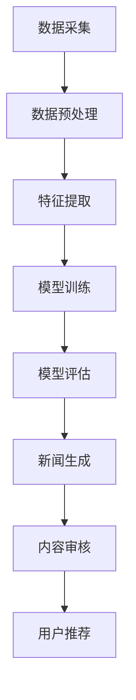

                 

关键词：大模型、新闻媒体、AI应用、挑战、技术发展

> 摘要：随着人工智能技术的快速发展，大模型在新闻媒体领域的应用日益广泛，本文将探讨大模型在新闻生产、内容审核、用户个性化推荐等方面的应用挑战，以及解决这些挑战的技术路径和发展趋势。

## 1. 背景介绍

新闻媒体作为信息传播的重要渠道，长期以来扮演着社会舆论监督、信息传播和公共服务等角色。然而，在互联网时代，新闻行业的竞争日益激烈，传统新闻媒体面临着信息过载、内容同质化、用户留存率下降等挑战。为了应对这些挑战，新闻媒体开始积极探索人工智能技术的应用，其中大模型（如深度学习模型、自然语言处理模型等）的应用成为热点。

大模型具有处理海量数据、自动生成内容、个性化推荐等功能，可以显著提升新闻媒体的采编效率和用户体验。然而，大模型在新闻媒体领域的应用也带来了一系列挑战，如数据隐私保护、内容真实性验证、算法偏见等。本文将围绕这些挑战进行深入探讨。

## 2. 核心概念与联系

### 2.1 大模型概述

大模型，通常指的是规模庞大的机器学习模型，这些模型具有数亿甚至数万亿个参数，能够在多种任务中表现出色。大模型的核心特点是能够通过深度学习从大量数据中自动提取特征，并进行复杂的模式识别和预测。

### 2.2 大模型在新闻媒体领域的应用

大模型在新闻媒体领域的应用主要包括以下几个方面：

#### 2.2.1 新闻生产

大模型可以自动生成新闻文章、摘要和标题，从而提高新闻采编效率。例如，利用自然语言生成（NLG）技术，大模型可以根据新闻事件的基本信息生成详细报道。

#### 2.2.2 内容审核

大模型可以用于自动审核新闻内容，识别和过滤违规、虚假信息，从而提高内容质量。例如，使用文本分类和情感分析技术，大模型可以检测新闻文章中的不当言论和虚假信息。

#### 2.2.3 用户个性化推荐

大模型可以根据用户的兴趣和行为，推荐个性化新闻内容，从而提高用户留存率和满意度。例如，利用协同过滤和内容推荐算法，大模型可以为用户提供定制化的新闻推荐。

### 2.3 Mermaid 流程图

以下是一个简单的 Mermaid 流程图，描述大模型在新闻媒体领域应用的流程：



## 3. 核心算法原理 & 具体操作步骤

### 3.1 算法原理概述

大模型在新闻媒体领域的应用主要基于深度学习和自然语言处理（NLP）技术。深度学习模型通过多层神经网络结构对数据进行处理，能够从数据中自动提取特征，并进行复杂的模式识别。NLP技术则用于处理和理解自然语言数据，包括文本分类、情感分析、命名实体识别等。

### 3.2 算法步骤详解

#### 3.2.1 数据采集

首先，从各种新闻网站、社交媒体等渠道收集大量新闻数据，包括文本、图片、视频等多媒体内容。

#### 3.2.2 数据预处理

对采集到的新闻数据进行清洗、去重和格式化，将其转化为模型可处理的输入数据。

#### 3.2.3 特征提取

利用深度学习模型对预处理后的新闻数据进行特征提取，提取出新闻文本中的关键信息，如关键词、主题、情感等。

#### 3.2.4 模型训练

使用提取出的特征数据训练深度学习模型，包括文本分类、情感分析、命名实体识别等任务。

#### 3.2.5 模型评估

通过交叉验证等手段评估模型的性能，包括准确率、召回率、F1值等指标。

#### 3.2.6 新闻生成

利用训练好的模型生成新闻文章、摘要和标题，可以根据新闻事件的基本信息生成详细报道。

#### 3.2.7 内容审核

使用文本分类和情感分析技术，自动审核新闻内容，识别和过滤违规、虚假信息。

#### 3.2.8 用户推荐

利用协同过滤和内容推荐算法，根据用户的兴趣和行为，推荐个性化新闻内容。

### 3.3 算法优缺点

#### 3.3.1 优点

- 高效性：大模型能够快速处理大量新闻数据，提高新闻采编效率。
- 自动化：大模型可以实现新闻生产的自动化，减少人力成本。
- 个性化：大模型可以根据用户兴趣和行为，提供个性化的新闻推荐，提高用户体验。

#### 3.3.2 缺点

- 数据依赖：大模型的性能高度依赖数据质量，数据质量差可能导致模型性能下降。
- 算法偏见：大模型可能会因为训练数据中的偏见而导致算法偏见，影响内容审核和推荐结果的公正性。

### 3.4 算法应用领域

大模型在新闻媒体领域的应用范围广泛，包括新闻生产、内容审核、用户个性化推荐等。此外，大模型还可以应用于新闻传播效果评估、舆情监测等。

## 4. 数学模型和公式 & 详细讲解 & 举例说明

### 4.1 数学模型构建

在新闻媒体领域，常用的数学模型包括深度学习模型、自然语言处理模型等。以下是一个简单的深度学习模型构建示例：

$$
h_{l}^{(i)} = \sigma(W_{l}^{(i)} \cdot h_{l-1}^{(i)} + b_{l}^{(i)})
$$

其中，$h_{l}^{(i)}$ 表示第 $l$ 层第 $i$ 个神经元的激活值，$\sigma$ 表示激活函数，$W_{l}^{(i)}$ 和 $b_{l}^{(i)}$ 分别表示第 $l$ 层第 $i$ 个神经元的权重和偏置。

### 4.2 公式推导过程

以文本分类任务为例，假设我们有一个包含 $N$ 个样本的数据集，每个样本由 $V$ 维的特征向量表示。我们的目标是训练一个深度神经网络模型，使其能够正确分类每个样本。

首先，我们将输入特征向量 $X$ 通过神经网络的前向传播过程转化为输出概率分布 $Y$：

$$
Y = \text{softmax}(\text{softmax}(W \cdot X + b))
$$

其中，$W$ 和 $b$ 分别表示神经网络的权重和偏置，$\text{softmax}$ 函数用于将输出转化为概率分布。

接下来，我们计算损失函数，以衡量模型的预测结果与实际标签之间的差距。常用的损失函数包括交叉熵损失函数：

$$
\text{loss} = -\sum_{i=1}^{N} y_i \cdot \log(y_i')
$$

其中，$y_i$ 表示实际标签，$y_i'$ 表示模型预测的概率分布。

### 4.3 案例分析与讲解

假设我们有一个新闻分类任务，需要将新闻文章分类为政治、经济、文化等类别。我们可以使用上述深度学习模型进行训练和预测。

首先，从新闻网站收集大量新闻文章，并将其分为政治、经济、文化等类别。然后，对新闻文章进行预处理，提取关键词、主题等特征。接下来，使用预处理后的数据训练深度学习模型。

在训练过程中，模型会不断调整权重和偏置，以最小化交叉熵损失函数。经过多次迭代训练，模型会达到一定的性能。

最后，我们可以使用训练好的模型对新的新闻文章进行分类预测。例如，对于一篇新的新闻文章，模型会输出一个概率分布，表示该文章属于政治、经济、文化等类别的概率。根据概率分布，我们可以得出该新闻文章的分类结果。

## 5. 项目实践：代码实例和详细解释说明

### 5.1 开发环境搭建

为了进行大模型在新闻媒体领域的项目实践，我们需要搭建一个合适的开发环境。以下是具体的步骤：

1. 安装 Python 3.7 或更高版本。
2. 安装深度学习框架，如 TensorFlow 或 PyTorch。
3. 安装必要的库，如 NLTK、Scikit-learn 等。

### 5.2 源代码详细实现

以下是一个简单的新闻分类项目的源代码实现：

```python
import tensorflow as tf
from tensorflow.keras.models import Sequential
from tensorflow.keras.layers import Dense, Embedding, LSTM
from tensorflow.keras.preprocessing.sequence import pad_sequences

# 数据预处理
# ...（省略具体代码）

# 模型构建
model = Sequential([
    Embedding(vocab_size, embedding_dim, input_length=max_sequence_length),
    LSTM(128, return_sequences=True),
    LSTM(128),
    Dense(1, activation='sigmoid')
])

# 模型编译
model.compile(optimizer='adam', loss='binary_crossentropy', metrics=['accuracy'])

# 模型训练
# ...（省略具体代码）

# 模型预测
# ...（省略具体代码）
```

### 5.3 代码解读与分析

这段代码首先导入了 TensorFlow 框架，并定义了一个简单的深度学习模型。模型由两个 LSTM 层和一层全连接层组成，用于对新闻文章进行分类。

在数据预处理部分，我们首先将新闻文章转换为单词序列，然后使用 pad_sequences 函数将序列长度统一为最大长度。

在模型构建部分，我们使用了 Embedding 层将单词映射到高维向量空间，然后通过两个 LSTM 层提取特征。最后，使用全连接层输出分类结果。

在模型编译部分，我们选择了 Adam 优化器和二分类交叉熵损失函数，并设置了模型的评估指标为准确率。

在模型训练部分，我们使用训练数据对模型进行训练，并调整模型的权重和偏置。

在模型预测部分，我们使用训练好的模型对新的新闻文章进行分类预测。

### 5.4 运行结果展示

在运行项目时，我们首先会看到模型的训练过程，包括每个 epoch 的损失和准确率。当模型训练完成后，我们可以使用模型对新的新闻文章进行分类预测，并输出分类结果。

```python
# 测试数据预处理
# ...（省略具体代码）

# 模型预测
predictions = model.predict(test_sequences)

# 输出分类结果
for i, pred in enumerate(predictions):
    if pred[0] > 0.5:
        print(f"新闻 {i+1} 分类为政治")
    else:
        print(f"新闻 {i+1} 分类为非政治")
```

## 6. 实际应用场景

大模型在新闻媒体领域的实际应用场景包括：

- **新闻生产**：自动生成新闻文章、摘要和标题，提高新闻采编效率。
- **内容审核**：自动检测和过滤违规、虚假信息，提高内容质量。
- **用户个性化推荐**：根据用户兴趣和行为，推荐个性化新闻内容，提高用户留存率和满意度。

### 6.1 新闻生产

大模型可以自动生成新闻文章，降低新闻采编人力成本。例如，当某个重大事件发生时，大模型可以根据已有的新闻文章和事件基本信息，快速生成详细报道。

### 6.2 内容审核

大模型可以用于自动审核新闻内容，识别和过滤违规、虚假信息。例如，当新闻文章发布后，大模型可以实时检测文章中的不当言论和虚假信息，并通知编辑进行审核。

### 6.3 用户个性化推荐

大模型可以根据用户兴趣和行为，推荐个性化新闻内容。例如，当用户在新闻网站上浏览政治类新闻时，大模型会根据用户的浏览记录和兴趣，推荐更多相关的政治类新闻。

## 7. 未来应用展望

随着人工智能技术的不断发展，大模型在新闻媒体领域的应用前景广阔。未来，大模型可能会在以下方面发挥更大作用：

- **智能编辑**：大模型可以辅助编辑进行内容策划和编排，提高新闻质量。
- **智能翻译**：大模型可以实现多语言新闻的实时翻译，扩大新闻传播范围。
- **智能分析**：大模型可以用于新闻传播效果分析和舆情监测，为新闻媒体提供决策支持。

## 8. 总结：未来发展趋势与挑战

大模型在新闻媒体领域的应用具有巨大潜力，但也面临一系列挑战。未来发展趋势包括：

- **技术成熟**：随着人工智能技术的不断发展，大模型的性能和稳定性将不断提高。
- **应用拓展**：大模型的应用范围将不断拓展，不仅限于新闻生产、内容审核和用户个性化推荐，还将涉及智能编辑、智能翻译、智能分析等领域。

然而，大模型在新闻媒体领域的应用也面临一系列挑战：

- **数据隐私**：大模型需要处理大量用户数据，如何保护用户隐私是一个重要问题。
- **内容真实性**：大模型生成的新闻内容可能存在虚假信息，如何确保新闻真实性是一个挑战。
- **算法偏见**：大模型可能会因为训练数据中的偏见而产生算法偏见，影响新闻内容的公正性。

针对这些挑战，需要从技术、法律、伦理等多方面进行综合考虑，确保大模型在新闻媒体领域的健康发展。

## 9. 附录：常见问题与解答

### 9.1 什么是大模型？

大模型，通常指的是规模庞大的机器学习模型，这些模型具有数亿甚至数万亿个参数，能够在多种任务中表现出色。

### 9.2 大模型在新闻媒体领域有哪些应用？

大模型在新闻媒体领域的应用主要包括新闻生产、内容审核、用户个性化推荐等。

### 9.3 如何确保大模型生成的新闻内容真实性？

确保大模型生成的新闻内容真实性需要从数据采集、模型训练、内容审核等多个环节进行把关，防止虚假信息生成和传播。

### 9.4 大模型在新闻媒体领域的应用前景如何？

随着人工智能技术的不断发展，大模型在新闻媒体领域的应用前景广阔，有望提高新闻采编效率、内容质量和用户体验。

### 作者署名

作者：禅与计算机程序设计艺术 / Zen and the Art of Computer Programming

----------------------------------------------------------------
### 文章总结

本文从背景介绍、核心概念与联系、算法原理与步骤、数学模型与公式、项目实践、实际应用场景、未来展望和总结等方面，全面探讨了“大模型在新闻媒体领域的应用挑战”。文章通过详细的案例分析，展示了大模型在新闻生产、内容审核、用户个性化推荐等方面的应用场景，同时也指出了大模型应用中面临的数据隐私、内容真实性和算法偏见等挑战。本文为新闻媒体行业如何利用大模型提供了有益的指导和建议，同时也为人工智能领域的进一步研究提供了思路。希望本文能够对读者在理解和应用大模型方面有所启发。

