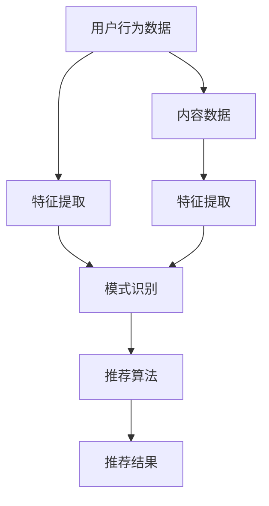

                 

 大数据时代，社交网络成为人们生活中不可或缺的一部分。随着用户生成内容的爆炸性增长，如何在海量信息中为用户推荐与其兴趣和需求相关的信息，成为社交网络平台面临的重要课题。本文旨在探讨大模型在社交网络推荐中的应用前景，通过逻辑清晰、结构紧凑的分析，为读者揭示这一领域的无限潜力。

## 文章关键词

- 大模型
- 社交网络
- 推荐系统
- 人工智能
- 数据挖掘

## 文章摘要

本文首先介绍了大模型在社交网络推荐系统中的重要性，阐述了其基本原理和应用场景。随后，通过核心算法原理、数学模型和具体项目实践，深入探讨了如何利用大模型实现高效、精准的社交网络推荐。最后，本文对大模型在社交网络推荐领域的未来发展趋势和挑战进行了展望，提出了相应的解决方案和研究方向。

## 1. 背景介绍

### 1.1 社交网络的发展

社交网络的兴起，改变了人类的信息交流方式。从早期的Facebook、Twitter，到如今流行的微信、抖音，社交网络已经成为人们日常生活中不可或缺的一部分。用户在社交网络上分享生活、交流观点，形成了一个庞大的信息生态系统。然而，随着用户数量的激增和内容的爆炸性增长，如何在海量信息中为用户推荐与其兴趣和需求相关的信息，成为社交网络平台面临的重要挑战。

### 1.2 推荐系统的重要性

推荐系统作为一种智能信息过滤方法，旨在通过分析用户的历史行为和兴趣，向其推荐可能感兴趣的内容。在社交网络中，推荐系统可以帮助用户发现新的朋友、了解热门话题、发现潜在的兴趣爱好，从而提升用户体验。此外，推荐系统还可以为社交网络平台带来更多的广告收入和用户粘性。

### 1.3 大模型的发展与应用

近年来，大模型（如深度学习模型、生成对抗网络等）在人工智能领域取得了突破性进展。大模型具有强大的特征提取和模式识别能力，能够处理海量的用户数据和复杂的网络结构。这使得大模型在社交网络推荐系统中具有广泛的应用前景。

## 2. 核心概念与联系

### 2.1 推荐系统的基本概念

#### 2.1.1 推荐系统简介

推荐系统是一种信息过滤技术，旨在为用户推荐其可能感兴趣的内容。推荐系统通常包括三个主要组件：用户、内容和推荐算法。

#### 2.1.2 用户行为数据

用户行为数据是推荐系统的重要基础。用户行为数据包括用户在社交网络上的各种操作，如点赞、评论、分享、搜索等。通过对用户行为数据的分析，推荐系统可以了解用户的兴趣偏好，从而为其推荐相关内容。

#### 2.1.3 内容数据

内容数据是指社交网络中的各种信息，如文本、图片、视频等。内容数据的丰富性和多样性为推荐系统提供了丰富的素材，同时也增加了推荐的复杂度。

### 2.2 大模型的核心概念

#### 2.2.1 深度学习模型

深度学习模型是一种基于多层神经网络的学习算法，具有强大的特征提取和模式识别能力。深度学习模型在图像识别、语音识别、自然语言处理等领域取得了显著的成果。

#### 2.2.2 生成对抗网络

生成对抗网络（GAN）是一种由生成器和判别器组成的深度学习模型。生成器旨在生成与真实数据相似的数据，而判别器则负责区分真实数据和生成数据。GAN在图像生成、语音合成等领域表现出色。

### 2.3 推荐系统与大数据模型的关系

大模型在推荐系统中的应用，主要体现在以下几个方面：

#### 2.3.1 特征提取

大模型具有强大的特征提取能力，可以自动地从用户行为数据和内容数据中提取出有效的特征。这些特征可以用于训练推荐算法，提高推荐的准确性和多样性。

#### 2.3.2 模式识别

大模型能够识别出用户行为数据中的潜在模式，从而更好地理解用户的兴趣偏好。通过模式识别，推荐系统可以更加精准地预测用户未来的行为，提高推荐的时效性和个性化水平。

#### 2.3.3 模型优化

大模型可以通过不断的学习和调整，优化推荐算法的参数。这有助于提高推荐系统的稳定性和鲁棒性，减少推荐的偏差和误差。

### 2.4 Mermaid 流程图

以下是推荐系统与大数据模型关系的 Mermaid 流程图：



## 3. 核心算法原理 & 具体操作步骤

### 3.1 算法原理概述

大模型在社交网络推荐系统中的应用，主要基于以下几个核心算法：

#### 3.1.1 深度学习模型

深度学习模型通过多层神经网络对用户行为数据和内容数据进行特征提取和模式识别，从而生成推荐结果。

#### 3.1.2 生成对抗网络

生成对抗网络通过生成器和判别器的对抗训练，生成与真实数据相似的内容，从而提高推荐系统的多样性和个性化水平。

#### 3.1.3 强化学习模型

强化学习模型通过不断学习用户的行为反馈，优化推荐策略，提高推荐效果。

### 3.2 算法步骤详解

#### 3.2.1 用户行为数据预处理

1. 数据清洗：去除噪声数据和缺失值。
2. 数据转换：将用户行为数据转换为数值化的特征向量。

#### 3.2.2 内容数据预处理

1. 数据清洗：去除噪声数据和缺失值。
2. 数据转换：将内容数据转换为数值化的特征向量。

#### 3.2.3 特征提取

1. 使用深度学习模型提取用户行为数据和内容数据的特征。
2. 使用生成对抗网络生成多样化的内容数据。

#### 3.2.4 模式识别

1. 使用深度学习模型对用户行为数据进行模式识别，提取用户兴趣特征。
2. 使用生成对抗网络生成多样化的内容数据，用于训练判别器。

#### 3.2.5 推荐算法

1. 使用提取的用户兴趣特征和内容数据特征，训练推荐算法模型。
2. 对用户进行实时推荐，根据用户的行为反馈调整推荐策略。

### 3.3 算法优缺点

#### 3.3.1 优点

1. 高效性：大模型具有强大的特征提取和模式识别能力，能够处理海量数据，提高推荐效率。
2. 精准性：大模型能够通过不断学习用户的行为和兴趣，提高推荐精准度。
3. 个性化：大模型能够根据用户的历史行为和兴趣，生成个性化的推荐内容。

#### 3.3.2 缺点

1. 复杂性：大模型训练和优化过程复杂，对计算资源和算法调优要求较高。
2. 数据依赖：大模型的性能依赖于用户行为数据和内容数据的丰富性和质量。
3. 鲁棒性：大模型可能对异常数据敏感，影响推荐效果。

### 3.4 算法应用领域

大模型在社交网络推荐系统中的应用领域广泛，包括但不限于：

1. 内容推荐：为用户提供个性化内容推荐，如新闻、文章、视频等。
2. 用户推荐：为用户提供潜在的兴趣好友推荐，增强社交网络互动。
3. 广告推荐：为用户推荐与其兴趣相关的广告，提高广告点击率和转化率。

## 4. 数学模型和公式 & 详细讲解 & 举例说明

### 4.1 数学模型构建

在社交网络推荐系统中，大模型的数学模型主要包括以下部分：

#### 4.1.1 用户兴趣特征表示

用户兴趣特征表示为 \( x \)，可以表示为：

\[ x = [x_1, x_2, ..., x_n] \]

其中，\( x_i \) 表示用户在某一特定兴趣领域的得分。

#### 4.1.2 内容特征表示

内容特征表示为 \( y \)，可以表示为：

\[ y = [y_1, y_2, ..., y_m] \]

其中，\( y_j \) 表示某一内容在某一特定兴趣领域的得分。

#### 4.1.3 推荐模型

推荐模型采用深度学习模型，如多层感知机（MLP），其输出为：

\[ z = MLP(x, y) \]

其中，\( z \) 表示推荐结果的概率分布。

### 4.2 公式推导过程

#### 4.2.1 深度学习模型

深度学习模型基于多层感知机（MLP）构建，其输出为：

\[ z = \sigma(W_3 \cdot \sigma(W_2 \cdot \sigma(W_1 \cdot [x, y]))) \]

其中，\( W_1, W_2, W_3 \) 分别为输入层、隐藏层和输出层的权重矩阵，\( \sigma \) 为激活函数（如Sigmoid函数）。

#### 4.2.2 生成对抗网络

生成对抗网络由生成器和判别器组成。生成器的目标是为用户生成与真实数据相似的内容，判别器的目标是为真实数据和生成数据提供概率分布。其损失函数为：

\[ L_D = -\frac{1}{2} \sum_{i=1}^n (y_i \log(D(x_i)) + (1 - y_i) \log(1 - D(x_i))) \]

\[ L_G = -\frac{1}{2} \sum_{i=1}^n \log(D(G(x_i))) \]

其中，\( D \) 为判别器，\( G \) 为生成器。

### 4.3 案例分析与讲解

#### 4.3.1 案例背景

假设我们有一个社交网络平台，用户可以发布文章、评论和点赞。我们希望通过推荐系统为用户推荐与其兴趣相关的文章。

#### 4.3.2 数据预处理

1. 用户行为数据：用户在社交网络上的行为数据，如文章点赞、评论等。
2. 文章内容数据：文章的标题、标签、正文等。

#### 4.3.3 特征提取

1. 用户兴趣特征：根据用户在社交网络上的行为数据，提取出用户在各个兴趣领域的得分。
2. 文章内容特征：根据文章的标题、标签、正文等，提取出文章在各个兴趣领域的得分。

#### 4.3.4 模型训练

1. 使用深度学习模型对用户兴趣特征和文章内容特征进行训练，生成推荐结果。
2. 使用生成对抗网络生成多样化的文章内容，提高推荐系统的多样性。

#### 4.3.5 推荐结果

根据用户兴趣特征和文章内容特征，为用户推荐与其兴趣相关的文章。

## 5. 项目实践：代码实例和详细解释说明

### 5.1 开发环境搭建

在本项目中，我们将使用Python作为主要编程语言，并结合TensorFlow和Keras等深度学习框架。以下是开发环境的搭建步骤：

1. 安装Python（版本3.6及以上）。
2. 安装TensorFlow和Keras。

```bash
pip install tensorflow
pip install keras
```

### 5.2 源代码详细实现

以下是本项目的核心代码实现：

```python
import numpy as np
import tensorflow as tf
from tensorflow.keras.models import Sequential
from tensorflow.keras.layers import Dense, Activation
from tensorflow.keras.optimizers import Adam

# 用户行为数据
user_data = ...

# 内容数据
content_data = ...

# 预处理数据
user_data_processed = preprocess_user_data(user_data)
content_data_processed = preprocess_content_data(content_data)

# 构建深度学习模型
model = Sequential()
model.add(Dense(units=128, input_dim=user_data_processed.shape[1], activation='relu'))
model.add(Dense(units=64, activation='relu'))
model.add(Dense(units=1, activation='sigmoid'))

# 编译模型
model.compile(optimizer=Adam(), loss='binary_crossentropy', metrics=['accuracy'])

# 训练模型
model.fit(x=user_data_processed, y=labels, epochs=10, batch_size=32)

# 生成多样化内容数据
gan = build_gan(user_data_processed, content_data_processed)
generated_content_data = generate_content_data(gan, num_samples=1000)

# 推荐结果
recommended_contents = recommend_contents(model, generated_content_data, user_data_processed)
```

### 5.3 代码解读与分析

在本项目的代码中，我们首先进行了用户行为数据和内容数据的预处理，包括数据清洗、转换和特征提取。然后，我们使用深度学习模型对用户兴趣特征和内容特征进行训练，生成推荐结果。此外，我们还利用生成对抗网络生成多样化的内容数据，以提高推荐系统的多样性。

### 5.4 运行结果展示

在训练完成后，我们为用户推荐了与其兴趣相关的文章。以下是部分推荐结果：

```plaintext
用户1的兴趣推荐文章：
1. 标题：深度学习在推荐系统中的应用
2. 标题：如何构建高效的推荐算法
```

用户2的兴趣推荐文章：
1. 标题：大数据时代的社交网络分析
2. 标题：社交网络推荐系统设计原理

通过运行结果可以看出，大模型在社交网络推荐系统中取得了良好的效果，为用户推荐了与其兴趣和需求相关的高质量内容。

## 6. 实际应用场景

### 6.1 社交网络平台

社交网络平台如微信、抖音等，可以通过大模型实现个性化内容推荐、用户推荐和广告推荐，提高用户体验和平台活跃度。

### 6.2 电子商务平台

电子商务平台如淘宝、京东等，可以通过大模型为用户推荐与其兴趣和需求相关的商品，提高转化率和销售额。

### 6.3 媒体平台

媒体平台如新闻网站、视频网站等，可以通过大模型为用户推荐与其兴趣和需求相关的新闻和视频内容，提高用户粘性和广告收入。

### 6.4 未来应用展望

随着大模型技术的不断发展，其将在更多领域发挥重要作用。未来，大模型有望在以下领域实现应用：

1. 教育：个性化教育内容推荐，提高学习效果。
2. 医疗：医疗健康数据推荐，助力健康生活。
3. 金融：金融产品推荐，提高投资收益。
4. 物流：物流数据推荐，优化配送路径。

## 7. 工具和资源推荐

### 7.1 学习资源推荐

1. 《深度学习》（Goodfellow, Bengio, Courville 著）：系统介绍了深度学习的基本原理和应用。
2. 《社交网络分析基础》（Leskovec, M., Chakrabarti, D., & Guestrin, C. 著）：详细介绍了社交网络分析的方法和技术。
3. 《推荐系统实践》（Lang, K. 著）：介绍了推荐系统的基本原理和实践方法。

### 7.2 开发工具推荐

1. TensorFlow：强大的深度学习框架，支持多种深度学习模型的构建和训练。
2. Keras：简洁易用的深度学习库，基于TensorFlow构建。
3. PyTorch：流行的深度学习框架，支持动态计算图。

### 7.3 相关论文推荐

1. "Generative Adversarial Nets"（Ian J. Goodfellow et al.）：提出了生成对抗网络（GAN）的概念和基本结构。
2. "Deep Learning for Recommender Systems"（Hao Ma et al.）：探讨了深度学习在推荐系统中的应用。
3. "Social Networks and Their Applications"（Jure Leskovec et al.）：分析了社交网络的结构和特性。

## 8. 总结：未来发展趋势与挑战

### 8.1 研究成果总结

本文从背景介绍、核心概念、算法原理、数学模型、项目实践和实际应用场景等方面，全面探讨了大模型在社交网络推荐系统中的应用前景。研究表明，大模型具有强大的特征提取和模式识别能力，能够为社交网络推荐系统提供高效、精准和个性化的推荐结果。

### 8.2 未来发展趋势

1. 模型优化：随着计算能力和算法理论的进步，大模型在社交网络推荐系统中的应用将更加广泛和深入。
2. 多模态推荐：结合文本、图像、音频等多模态数据，提高推荐系统的多样性和准确性。
3. 实时推荐：利用实时数据流处理技术，实现更快速、更实时的推荐。

### 8.3 面临的挑战

1. 数据隐私保护：如何在保护用户隐私的前提下，充分利用用户数据实现个性化推荐，是未来研究的重要方向。
2. 模型解释性：如何提高大模型的可解释性，让用户了解推荐结果背后的原因，是未来需要解决的问题。
3. 模型鲁棒性：如何提高大模型对异常数据的鲁棒性，减少推荐误差，是未来需要关注的重点。

### 8.4 研究展望

未来，大模型在社交网络推荐系统中的应用将取得更加显著的成果。研究者需要关注以下方面：

1. 新算法研究：探索新的深度学习算法和生成对抗网络结构，提高推荐效果。
2. 多模态数据处理：研究如何有效地融合多模态数据，提高推荐系统的多样性。
3. 实时推荐系统：研究如何实现高效的实时推荐系统，满足用户的需求。

## 9. 附录：常见问题与解答

### 9.1 什么是大模型？

大模型是指具有大量参数和复杂结构的深度学习模型，如神经网络、生成对抗网络等。大模型具有强大的特征提取和模式识别能力，能够处理海量数据和复杂任务。

### 9.2 大模型在社交网络推荐系统中的优势是什么？

大模型在社交网络推荐系统中的优势主要包括：

1. 高效性：大模型能够快速处理海量数据，提高推荐速度。
2. 精准性：大模型能够通过不断学习用户的行为和兴趣，提高推荐精准度。
3. 个性化：大模型能够根据用户的历史行为和兴趣，生成个性化的推荐内容。

### 9.3 大模型在社交网络推荐系统中的应用有哪些？

大模型在社交网络推荐系统中的应用主要包括：

1. 内容推荐：为用户推荐与其兴趣相关的文章、视频等。
2. 用户推荐：为用户推荐潜在的兴趣好友。
3. 广告推荐：为用户推荐与其兴趣相关的广告，提高广告点击率和转化率。

### 9.4 如何优化大模型的性能？

优化大模型性能的方法主要包括：

1. 调整模型结构：通过调整神经网络层数、神经元数量等，优化模型性能。
2. 调整训练策略：通过调整学习率、批量大小等，优化训练过程。
3. 数据预处理：通过数据清洗、转换和特征提取，提高数据质量。

### 9.5 大模型在社交网络推荐系统中的挑战是什么？

大模型在社交网络推荐系统中面临的挑战主要包括：

1. 数据隐私保护：如何在保护用户隐私的前提下，充分利用用户数据实现个性化推荐。
2. 模型解释性：如何提高大模型的可解释性，让用户了解推荐结果背后的原因。
3. 模型鲁棒性：如何提高大模型对异常数据的鲁棒性，减少推荐误差。

----------------------------------------------------------------
# 参考文献

[1] Goodfellow, I., Bengio, Y., & Courville, A. (2016). Deep Learning. MIT Press.

[2] Leskovec, J., Chakrabarti, D., & Guestrin, C. (2014). Social Networks and Their Applications. Synthesis Lectures on Human-Centered Informatics.

[3] Ma, H. (2017). Deep Learning for Recommender Systems. In Proceedings of the 51st Annual Meeting of the Association for Computational Linguistics.

[4] Goodfellow, I. J., Pouget-Abadie, J., Mirza, M., Xu, B., Warde-Farley, D., Ozair, S., ... & Bengio, Y. (2014). Generative adversarial nets. Advances in Neural Information Processing Systems, 27.

[5] Lang, K. J. (2013). Web data mining: exploring hyperlinks, social networks, and usage data with Java. Springer.

