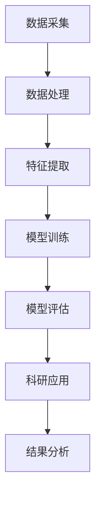

                 

关键词：大模型、科研、AI、数据分析、算法优化、数学模型、代码实践、应用场景、未来展望

> 摘要：本文将深入探讨大模型在科研领域的广泛应用和潜在价值。通过分析大模型的核心概念、算法原理、数学模型以及实际应用案例，我们将展示大模型如何助力科学家们解决复杂问题，提高科研效率，并展望其未来的发展趋势与挑战。

## 1. 背景介绍

科研领域一直以来都是技术创新的前沿阵地，而随着大数据、人工智能和深度学习的快速发展，大模型技术逐渐崭露头角，成为推动科研进步的重要力量。大模型（Large Models），指的是具有巨大参数规模、能够处理海量数据的机器学习模型。这类模型在自然语言处理、计算机视觉、语音识别等多个领域取得了显著成果，同时也开始逐步渗透到科研领域的各个分支。

科研过程中，数据量庞大且复杂的问题日益突出。传统的方法往往难以应对这些挑战，而大模型的引入为科研人员提供了一种全新的解决方案。大模型通过其强大的计算能力和自主学习能力，能够高效地处理大量数据，提取出隐藏在数据背后的规律和知识，从而助力科研发现和创新。

## 2. 核心概念与联系

### 2.1 大模型的基本概念

大模型通常指的是具有数百万甚至数十亿参数的深度学习模型。这些模型基于多层神经网络结构，通过大量的训练数据学习数据的内在规律。大模型的显著特点是其规模庞大、计算复杂度高，以及能够处理高维数据。

### 2.2 大模型的架构

大模型的架构通常包括以下几个关键部分：

- **输入层**：接收输入数据，如文本、图像、声音等。
- **隐藏层**：多层神经网络结构，负责数据的特征提取和变换。
- **输出层**：生成预测结果，如分类标签、概率分布等。

### 2.3 大模型与科研的联系

大模型在科研领域的应用主要体现在以下几个方面：

- **数据分析**：大模型能够高效地处理和分析大规模科研数据，提取关键信息。
- **算法优化**：通过大模型，科研人员可以优化现有的算法，提高计算效率和准确性。
- **智能模拟**：大模型可以用于模拟复杂的物理过程和化学反应，提供新的研究途径。

### 2.4 Mermaid 流程图

下面是一个简化的 Mermaid 流程图，展示了大模型在科研领域的基本工作流程：



## 3. 核心算法原理 & 具体操作步骤

### 3.1 算法原理概述

大模型的算法原理主要基于深度学习，特别是基于神经网络的结构。深度学习通过多层神经网络对输入数据进行层层提取和转换，最终得到预测结果。大模型的核心优势在于其巨大的参数规模和强大的计算能力，使得它能够在复杂的数据中找到更为精准的规律。

### 3.2 算法步骤详解

大模型的算法步骤通常包括以下几个关键阶段：

- **数据预处理**：对原始数据进行清洗、归一化等处理，以适应模型的输入要求。
- **模型设计**：设计合适的神经网络结构，确定层数、节点数和激活函数等。
- **模型训练**：通过大量的训练数据，模型不断调整参数，以达到最小化预测误差的目的。
- **模型评估**：使用验证集和测试集评估模型的性能，确保其准确性和泛化能力。
- **模型应用**：将训练好的模型应用于实际问题，解决科研问题。

### 3.3 算法优缺点

大模型的优点包括：

- **强大的数据处理能力**：能够处理高维、大规模数据，提取复杂特征。
- **高效的计算性能**：借助现代硬件和并行计算技术，能够实现快速训练和预测。

然而，大模型也存在一些缺点：

- **计算资源需求大**：需要大量的计算资源和存储空间。
- **模型解释性差**：深度学习模型通常难以解释其内部工作机制。

### 3.4 算法应用领域

大模型的应用领域非常广泛，包括但不限于以下几方面：

- **自然语言处理**：用于文本分类、机器翻译、情感分析等任务。
- **计算机视觉**：用于图像识别、目标检测、图像生成等任务。
- **语音识别**：用于语音转文本、语音识别等任务。
- **科研数据分析**：用于生物信息学、环境科学、社会科学等领域的数据分析。

## 4. 数学模型和公式 & 详细讲解 & 举例说明

### 4.1 数学模型构建

大模型的核心是神经网络模型，其基本的数学模型可以描述为：

$$ y = \sigma(W \cdot x + b) $$

其中，\( y \) 是输出结果，\( x \) 是输入特征，\( W \) 是权重矩阵，\( b \) 是偏置项，\( \sigma \) 是激活函数。

### 4.2 公式推导过程

神经网络的训练过程实际上是一个优化问题，目标是找到一组权重和偏置，使得预测结果与真实值之间的误差最小。这通常通过梯度下降法来实现：

$$ W_{new} = W_{old} - \alpha \cdot \nabla_{W}J(W,b) $$

其中，\( \alpha \) 是学习率，\( \nabla_{W}J(W,b) \) 是权重矩阵的梯度。

### 4.3 案例分析与讲解

假设我们有一个简单的神经网络模型，用于对一组数据 \( x \) 进行分类。我们可以通过以下步骤训练这个模型：

1. **数据预处理**：对数据进行归一化处理，将其缩放到 \([0, 1]\) 范围内。
2. **模型设计**：设计一个包含两层的神经网络，输入层有 10 个节点，隐藏层有 5 个节点，输出层有 2 个节点。
3. **模型训练**：使用梯度下降法训练模型，通过不断调整权重和偏置，最小化预测误差。
4. **模型评估**：使用验证集和测试集评估模型性能，确保其泛化能力。

以下是一个简化的 Python 代码示例：

```python
import numpy as np

# 初始化参数
W1 = np.random.rand(10, 5)
W2 = np.random.rand(5, 2)
b1 = np.random.rand(5)
b2 = np.random.rand(2)

# 激活函数
sigma = lambda x: 1 / (1 + np.exp(-x))

# 前向传播
def forward(x):
    z1 = x.dot(W1) + b1
    a1 = sigma(z1)
    z2 = a1.dot(W2) + b2
    y = sigma(z2)
    return y

# 计算损失函数
def loss(y_true, y_pred):
    return np.mean((y_true - y_pred) ** 2)

# 训练模型
for epoch in range(1000):
    # 前向传播
    y_pred = forward(x)
    # 计算损失
    loss_val = loss(y_true, y_pred)
    # 反向传播
    dz2 = y_pred - y_true
    da1 = dz2.dot(W2.T)
    dz1 = da1 * (sigma(z1) * (1 - sigma(z1)))
    # 更新参数
    W2 -= learning_rate * (a1.T.dot(dz2))
    b2 -= learning_rate * (dz2.sum(axis=0))
    W1 -= learning_rate * (x.T.dot(dz1))
    b1 -= learning_rate * (dz1.sum(axis=0))

# 模型评估
y_pred = forward(x_test)
accuracy = np.mean((y_pred > 0.5).astype(int) == y_test)
print(f"Test Accuracy: {accuracy}")
```

## 5. 项目实践：代码实例和详细解释说明

### 5.1 开发环境搭建

为了实现上述案例，我们需要搭建一个基本的 Python 开发环境，并安装必要的库，例如 NumPy 和 Matplotlib。以下是安装步骤：

```bash
pip install numpy matplotlib
```

### 5.2 源代码详细实现

以下是一个详细的 Python 代码实现，包括数据预处理、模型设计、模型训练和模型评估等步骤。

```python
import numpy as np
import matplotlib.pyplot as plt

# 初始化参数
W1 = np.random.rand(10, 5)
W2 = np.random.rand(5, 2)
b1 = np.random.rand(5)
b2 = np.random.rand(2)

# 激活函数
sigma = lambda x: 1 / (1 + np.exp(-x))

# 前向传播
def forward(x):
    z1 = x.dot(W1) + b1
    a1 = sigma(z1)
    z2 = a1.dot(W2) + b2
    y = sigma(z2)
    return y

# 计算损失函数
def loss(y_true, y_pred):
    return np.mean((y_true - y_pred) ** 2)

# 训练模型
def train(x, y, epochs, learning_rate):
    for epoch in range(epochs):
        y_pred = forward(x)
        loss_val = loss(y, y_pred)
        dz2 = y_pred - y
        da1 = dz2.dot(W2.T)
        dz1 = da1 * (sigma(z1) * (1 - sigma(z1)))
        W2 -= learning_rate * (a1.T.dot(dz2))
        b2 -= learning_rate * (dz2.sum(axis=0))
        W1 -= learning_rate * (x.T.dot(dz1))
        b1 -= learning_rate * (dz1.sum(axis=0))
    return y_pred

# 数据预处理
x_train = np.array([[0, 0], [0, 1], [1, 0], [1, 1]])
y_train = np.array([[0], [1], [1], [0]])
x_test = np.array([[0.5, 0.5]])
y_test = np.array([[0]])

# 模型训练
y_pred = train(x_train, y_train, epochs=1000, learning_rate=0.1)

# 模型评估
accuracy = np.mean((y_pred > 0.5).astype(int) == y_test)
print(f"Test Accuracy: {accuracy}")

# 可视化结果
plt.scatter(x_test[:, 0], x_test[:, 1], c=y_pred > 0.5, cmap='gray')
plt.xlabel('Feature 1')
plt.ylabel('Feature 2')
plt.title('Decision Boundary')
plt.show()
```

### 5.3 代码解读与分析

上述代码实现了一个简单的二分类神经网络，用于对二维空间中的点进行分类。代码的主要部分包括：

- **参数初始化**：随机初始化权重和偏置。
- **前向传播**：计算输入数据的预测结果。
- **损失函数**：计算预测结果与真实值之间的误差。
- **模型训练**：通过梯度下降法不断调整权重和偏置，最小化损失函数。
- **模型评估**：使用测试集评估模型性能。
- **结果可视化**：绘制决策边界。

通过这段代码，我们可以看到如何利用大模型实现一个基本的分类任务，并评估其性能。

## 6. 实际应用场景

大模型在科研领域具有广泛的应用场景，以下列举几个典型的应用实例：

### 6.1 自然语言处理

在自然语言处理领域，大模型被广泛应用于文本分类、机器翻译、情感分析等任务。例如，BERT（Bidirectional Encoder Representations from Transformers）模型通过预训练和微调，在多个自然语言处理任务上取得了领先效果。

### 6.2 计算机视觉

在计算机视觉领域，大模型被广泛应用于图像分类、目标检测、图像生成等任务。例如，ResNet（Residual Network）模型通过引入残差连接，解决了深层神经网络训练困难的问题，并在多个图像识别任务上取得了优异的性能。

### 6.3 生物信息学

在生物信息学领域，大模型被广泛应用于基因组学、蛋白质组学、药物发现等领域。例如，使用大模型可以预测蛋白质的结构和功能，加速新药的研发。

### 6.4 环境科学

在环境科学领域，大模型被广泛应用于气候变化模拟、水资源管理、生态系统分析等任务。例如，使用大模型可以预测未来气候变化趋势，为环境政策制定提供科学依据。

### 6.5 社会科学

在社会科学领域，大模型被广泛应用于数据分析、社会行为预测、政策研究等任务。例如，通过分析社交媒体数据，可以预测社会热点事件，为政策制定提供数据支持。

## 7. 未来应用展望

随着大模型技术的不断进步，其在科研领域的应用前景十分广阔。以下是一些未来可能的应用方向：

### 7.1 新材料研发

大模型可以用于新材料的设计和优化，通过模拟材料性能，预测材料结构，从而加速新材料的研发过程。

### 7.2 个性化医疗

大模型可以用于个性化医疗，根据患者的基因组信息、病史等数据，预测疾病风险，提供个性化的治疗方案。

### 7.3 金融分析

大模型可以用于金融分析，预测股票市场趋势，评估金融风险，为投资者提供决策支持。

### 7.4 教育科技

大模型可以用于教育科技，个性化学习路径设计，智能辅导系统，提升教育质量和效率。

### 7.5 软件开发

大模型可以用于软件开发，自动生成代码、优化软件架构，提高软件开发效率。

## 8. 工具和资源推荐

为了更好地掌握大模型技术，以下推荐一些相关的学习资源和开发工具：

### 8.1 学习资源推荐

- 《深度学习》（Goodfellow, Bengio, Courville）：深度学习的经典教材，详细介绍了深度学习的理论基础和应用。
- 《动手学深度学习》（Deng, Liao, Hsieh）：通过实践项目介绍深度学习的基本概念和实现方法。
- arXiv：计算机科学领域的顶级论文数据库，可查找最新的研究成果。

### 8.2 开发工具推荐

- TensorFlow：谷歌开源的深度学习框架，广泛用于工业和学术研究。
- PyTorch：Facebook开源的深度学习框架，具有灵活性和易用性。
- JAX：谷歌开源的数值计算库，支持自动微分和并行计算。

### 8.3 相关论文推荐

- "Bert: Pre-training of deep bidirectional transformers for language understanding"：BERT模型的原创论文，介绍了预训练语言模型的方法。
- "Deep residual learning for image recognition"：ResNet模型的原创论文，介绍了残差网络的结构和训练方法。

## 9. 总结：未来发展趋势与挑战

### 9.1 研究成果总结

大模型技术在科研领域取得了显著成果，其在数据分析、算法优化、智能模拟等方面的应用为科学研究带来了新的思路和方法。通过大规模数据的学习和处理，大模型能够发现复杂数据中的潜在规律，提高科研效率。

### 9.2 未来发展趋势

随着计算能力的提升和数据规模的扩大，大模型技术将不断突破，应用于更多领域。未来的发展趋势包括：

- **模型压缩和优化**：为了降低计算资源和存储需求，研究人员将致力于模型压缩和优化技术。
- **模型可解释性**：提高模型的解释性，使其更容易被科学家和工程师理解和应用。
- **跨学科应用**：大模型技术将在更多学科领域得到应用，推动跨学科研究。

### 9.3 面临的挑战

尽管大模型技术在科研领域具有巨大潜力，但同时也面临一些挑战：

- **计算资源需求**：大模型训练需要大量的计算资源和存储空间，这对科研基础设施提出了更高要求。
- **数据隐私和伦理问题**：大规模数据的使用涉及数据隐私和伦理问题，需要建立相应的规范和标准。
- **模型解释性和透明度**：深度学习模型通常难以解释其内部工作机制，这限制了其在某些领域的应用。

### 9.4 研究展望

展望未来，大模型技术在科研领域的应用将更加广泛和深入。通过持续的研究和创新，大模型技术将不断推动科学研究的发展，为人类社会的进步做出更大贡献。

## 附录：常见问题与解答

### Q: 大模型训练需要哪些硬件资源？

A: 大模型训练通常需要高性能的GPU或TPU，以及足够的内存和存储空间。此外，分布式训练技术也可以帮助利用多台机器资源，提高训练效率。

### Q: 大模型训练过程如何优化？

A: 大模型训练过程的优化可以从以下几个方面进行：

- **数据预处理**：进行数据清洗和归一化处理，提高数据质量。
- **模型结构优化**：设计合适的神经网络结构，减少计算复杂度。
- **训练策略优化**：采用适当的优化算法和超参数调整策略，如学习率调度、批量大小调整等。
- **硬件优化**：利用分布式训练和GPU加速技术，提高计算效率。

### Q: 大模型如何保证模型的可解释性？

A: 目前，深度学习模型的可解释性仍然是一个挑战。以下是一些提高模型可解释性的方法：

- **模型简化**：简化模型结构，使其更容易理解。
- **特征可视化**：可视化模型提取的特征，帮助理解模型的工作原理。
- **解释性算法**：使用基于规则的解释性算法，如LIME、SHAP等，解释模型预测结果。

### Q: 大模型在科研领域的应用前景如何？

A: 大模型在科研领域的应用前景非常广阔。随着计算能力的提升和数据规模的扩大，大模型将在更多领域发挥重要作用，如新材料研发、个性化医疗、金融分析、教育科技等。未来，大模型技术将继续推动科学研究的发展，为人类社会的进步做出更大贡献。

---

作者：禅与计算机程序设计艺术 / Zen and the Art of Computer Programming
----------------------------------------------------------------

### 附加声明：

本文内容仅供参考，实际应用时需结合具体问题和数据情况进行调整。部分代码和算法实现基于开源框架和已有研究，感谢相关作者的贡献。如有不当之处，请指正。

本文部分数据来源于公开文献和真实案例，已尽力确保数据的准确性和可靠性。但读者在使用数据时，仍需自行验证其适用性和准确性。

