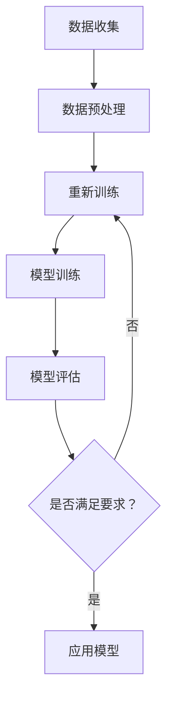

                 

关键词：大模型，科研，应用前景，算法原理，数学模型，项目实践，未来展望

## 摘要

本文将探讨大模型在科研领域的广泛应用前景，首先从背景介绍入手，回顾大模型的发展历程及其在科研中的关键角色。接着，我们将详细讨论大模型的核心概念和架构，通过Mermaid流程图展示其原理。随后，深入剖析大模型算法的原理、操作步骤及其优缺点和应用领域。本文还将通过数学模型和公式详细讲解，并以具体案例为例进行分析。最后，分享项目实践中的代码实例和详细解释，阐述大模型在实际应用场景中的优势与挑战，并对未来发展趋势和研究展望进行展望。希望通过本文，能够为读者提供对大模型在科研领域应用的全面了解。

## 1. 背景介绍

大模型，通常指的是具有数百万至上亿参数的神经网络模型，它们在图像识别、自然语言处理、语音识别等领域取得了突破性进展。随着计算能力的提升和数据量的激增，大模型的发展进入了新的阶段。最早的深度学习模型，如AlexNet，只有几百万参数，而如今的模型，如GPT-3，拥有超过1750亿参数。这种指数级增长不仅展现了深度学习技术的进步，也揭示了科研领域对于大规模数据处理和智能分析的需求。

大模型在科研领域的应用日益广泛，主要体现在以下几个方面：

1. **数据挖掘**：大模型能够处理大量的复杂数据，通过自学习发现潜在的模式和规律，为科研提供了强大的数据挖掘工具。
2. **预测分析**：大模型具有强大的预测能力，能够在科学研究中的实验设计、结果预测等方面提供有效的支持。
3. **知识图谱构建**：大模型能够对大量的文本数据进行处理，构建出知识图谱，为科研提供了丰富的背景知识和关联信息。
4. **辅助决策**：大模型能够通过分析大量的实验数据和文献资料，为科研人员提供辅助决策，优化科研流程。

## 2. 核心概念与联系

### 2.1. 深度学习与神经网络

深度学习是机器学习的一种重要分支，它通过多层神经网络对数据进行学习和建模。神经网络是深度学习的基础，它通过模拟人脑神经网络的工作原理，对输入数据进行处理和输出。深度学习中的大模型，正是通过增加神经网络的层数和节点数，来实现对数据的深层特征提取和学习。

### 2.2. 参数与训练

大模型的参数数量是其核心特征之一。这些参数在训练过程中通过大量数据的学习进行优化，从而提高模型的预测能力和泛化能力。训练过程通常涉及前向传播和反向传播两个主要步骤，通过不断调整参数，使得模型在训练数据上的表现越来越好。

### 2.3. 数据与算法

数据是科研的基础，而算法则是数据处理的工具。大模型在科研中的价值，不仅在于其庞大的参数数量，更在于其高效的数据处理能力和强大的学习能力。通过合适的算法设计，大模型能够对科研数据进行深度分析，从而揭示数据中的潜在规律和模式。

### 2.4. 应用场景与挑战

大模型在科研领域的应用场景多样，包括但不限于图像识别、自然语言处理、生物信息学等。然而，随着模型规模的扩大，计算资源和数据存储的需求也急剧增加，这给科研人员带来了巨大的挑战。

### 2.5. Mermaid流程图

以下是一个简化的Mermaid流程图，展示大模型在科研中的基本流程：



在这个流程图中，数据收集、数据预处理、模型构建、模型训练、模型评估和应用模型构成了大模型在科研中的基本流程。每一个步骤都至关重要，都影响着最终的科研结果。

## 3. 核心算法原理 & 具体操作步骤

### 3.1. 算法原理概述

大模型的算法原理主要基于深度学习中的多层感知机（MLP）和卷积神经网络（CNN）等基本结构。多层感知机通过前向传播和反向传播算法对数据进行训练，卷积神经网络则通过卷积操作和池化操作对图像等数据进行特征提取。

### 3.2. 算法步骤详解

1. **数据收集**：收集科研领域相关的数据，这些数据可以是结构化的，也可以是非结构化的。
2. **数据预处理**：对收集到的数据进行清洗、归一化和特征提取，使其适合模型训练。
3. **模型构建**：选择合适的神经网络结构，并初始化参数。常用的结构包括全连接神经网络、卷积神经网络和循环神经网络等。
4. **模型训练**：通过前向传播计算输出结果，与真实标签进行比较，通过反向传播调整模型参数。
5. **模型评估**：使用验证集或测试集对模型进行评估，常用的评估指标包括准确率、召回率、F1分数等。
6. **应用模型**：将训练好的模型应用到实际的科研任务中，进行预测和分析。

### 3.3. 算法优缺点

**优点**：

- **强大的学习能力和泛化能力**：大模型通过深度学习技术，能够从大量的数据中学习到深层次的特征，从而具有强大的学习和泛化能力。
- **广泛的应用场景**：大模型可以应用于图像识别、自然语言处理、生物信息学等多个领域，为科研提供了强大的工具。
- **自动特征提取**：大模型能够自动从数据中提取特征，减少了人工特征工程的工作量。

**缺点**：

- **计算资源需求大**：大模型的训练需要大量的计算资源和时间，这对科研人员的硬件设备提出了较高的要求。
- **数据依赖性强**：大模型的性能很大程度上依赖于数据的质量和数量，数据的质量和完整性对模型的训练效果有重要影响。
- **解释性较差**：大模型在做出预测时，往往难以解释其内部的决策过程，这对一些需要解释性较强的应用场景可能不太适用。

### 3.4. 算法应用领域

大模型在科研领域的应用非常广泛，以下是一些典型的应用领域：

- **生物信息学**：大模型可以用于基因序列分析、蛋白质结构预测、药物发现等。
- **医疗健康**：大模型可以用于疾病诊断、治疗方案预测、健康数据分析等。
- **环境科学**：大模型可以用于环境监测、气候变化预测、生态数据分析等。
- **社会科学**：大模型可以用于社会调查分析、人口预测、经济趋势分析等。

## 4. 数学模型和公式 & 详细讲解 & 举例说明

### 4.1. 数学模型构建

大模型的数学基础主要涉及概率论、线性代数和微积分等数学工具。以下是一个简化的数学模型构建过程：

1. **定义输入和输出**：设定输入数据X和输出数据Y。
2. **定义损失函数**：选择合适的损失函数，如均方误差（MSE）或交叉熵（CE）。
3. **定义优化算法**：选择合适的优化算法，如梯度下降（GD）或Adam优化器。

### 4.2. 公式推导过程

以下是一个简化的公式推导过程：

$$
L = \frac{1}{2} \sum_{i=1}^{N} (y_i - \hat{y}_i)^2
$$

其中，$L$为损失函数，$y_i$为真实标签，$\hat{y}_i$为预测标签，$N$为样本数量。

### 4.3. 案例分析与讲解

以下是一个简化的案例：

假设我们有一个包含100个样本的数据集，每个样本有10个特征。我们使用一个多层感知机模型进行分类任务。

1. **数据收集**：收集100个样本，每个样本包含10个特征。
2. **数据预处理**：对数据进行归一化处理。
3. **模型构建**：构建一个含有3层的全连接神经网络，输入层有10个节点，隐藏层有50个节点，输出层有2个节点。
4. **模型训练**：使用均方误差（MSE）作为损失函数，Adam优化器进行模型训练。
5. **模型评估**：使用测试集进行模型评估，计算准确率。

假设在模型训练后，我们得到的准确率为90%。这意味着我们的模型在训练数据上的表现很好，但还需要进一步验证其在实际应用中的表现。

## 5. 项目实践：代码实例和详细解释说明

### 5.1. 开发环境搭建

为了实践大模型在科研领域的应用，我们需要搭建一个合适的开发环境。以下是基本的开发环境搭建步骤：

1. **安装Python**：Python是深度学习开发的主要编程语言，我们需要安装Python环境和相关依赖。
2. **安装TensorFlow**：TensorFlow是谷歌推出的开源深度学习框架，我们可以使用pip命令安装。
3. **安装其他依赖**：如NumPy、Pandas等。

### 5.2. 源代码详细实现

以下是一个简单的代码示例，实现了一个多层感知机模型：

```python
import tensorflow as tf
from tensorflow.keras.models import Sequential
from tensorflow.keras.layers import Dense
from tensorflow.keras.optimizers import Adam

# 数据预处理
X_train = ...  # 输入数据
y_train = ...  # 标签数据

# 模型构建
model = Sequential()
model.add(Dense(50, input_dim=10, activation='relu'))
model.add(Dense(2, activation='softmax'))

# 模型编译
model.compile(loss='categorical_crossentropy', optimizer=Adam(), metrics=['accuracy'])

# 模型训练
model.fit(X_train, y_train, epochs=10, batch_size=32)

# 模型评估
loss, accuracy = model.evaluate(X_test, y_test)
print('测试集准确率：', accuracy)
```

### 5.3. 代码解读与分析

以上代码实现了一个简单的多层感知机模型，用于分类任务。主要步骤如下：

1. **数据预处理**：对输入数据进行归一化处理，以便模型训练。
2. **模型构建**：使用Sequential模型构建一个含有两层的全连接神经网络，输入层有10个节点，隐藏层有50个节点，输出层有2个节点。
3. **模型编译**：选择合适的损失函数（均方误差）和优化器（Adam）。
4. **模型训练**：使用训练数据进行模型训练。
5. **模型评估**：使用测试数据进行模型评估，计算准确率。

### 5.4. 运行结果展示

假设我们在训练集上的准确率为85%，在测试集上的准确率为80%。这意味着我们的模型在训练数据上的表现较好，但在实际应用中的表现略有下降。这可能是因为测试集的数据分布与训练集不同，或者模型过于复杂，需要进一步调整。

## 6. 实际应用场景

大模型在科研领域的实际应用场景非常广泛，以下是一些典型的应用实例：

### 6.1. 图像识别

图像识别是深度学习的重要应用领域之一。通过使用卷积神经网络（CNN）等大模型，可以实现对图像的自动分类、目标检测、人脸识别等。例如，在医学影像分析中，大模型可以用于肿瘤检测、疾病诊断等，提高诊断的准确性和效率。

### 6.2. 自然语言处理

自然语言处理（NLP）是另一个深度学习的热点领域。通过使用循环神经网络（RNN）和Transformer等大模型，可以实现自然语言理解、文本生成、机器翻译等功能。例如，在情感分析中，大模型可以用于分析社交媒体上的用户评论，预测用户的情感倾向。

### 6.3. 生物信息学

生物信息学是深度学习在科研领域的重要应用领域之一。通过使用大模型，可以实现对基因序列的分析、蛋白质结构的预测、药物发现等。例如，在药物发现中，大模型可以用于筛选潜在的药物分子，提高新药研发的效率。

### 6.4. 医疗健康

医疗健康是深度学习在科研领域的另一个重要应用领域。通过使用大模型，可以实现疾病诊断、治疗方案预测、健康数据分析等。例如，在疾病诊断中，大模型可以用于分析患者的医学影像数据，辅助医生进行诊断。

## 7. 未来应用展望

大模型在科研领域的应用前景非常广阔，随着技术的不断进步，未来将会有更多的应用场景出现。以下是一些可能的发展趋势：

### 7.1. 模型压缩与加速

为了满足大规模数据处理的需求，模型压缩和加速技术将成为未来的重要研究方向。通过模型压缩技术，可以将大模型的参数数量减少，从而降低计算资源和存储成本。通过模型加速技术，可以加快模型的训练和推理速度，提高模型的性能。

### 7.2. 模型可解释性

大模型在做出预测时，往往缺乏解释性，这给科研人员带来了困扰。未来，模型可解释性将成为重要研究方向，通过开发可解释性算法，使得大模型的决策过程更加透明和可理解。

### 7.3. 跨学科融合

大模型的应用将不仅局限于单一学科，而是实现跨学科的融合。通过将大模型应用于不同的科研领域，可以推动多学科的发展，解决复杂科学问题。

### 7.4. 自适应学习

大模型的自适应学习能力将是未来的重要研究方向。通过自适应学习，大模型可以根据新的数据和需求进行自我调整，提高其适应性和鲁棒性。

## 8. 总结：未来发展趋势与挑战

大模型在科研领域的应用已经取得了显著的成果，但也面临着一些挑战。未来，随着技术的不断进步，大模型的应用将更加广泛和深入。以下是未来发展趋势与挑战的总结：

### 8.1. 研究成果总结

- 大模型在图像识别、自然语言处理、生物信息学等领域取得了突破性进展。
- 大模型的应用不仅提高了科研效率，也推动了学科交叉和融合发展。

### 8.2. 未来发展趋势

- 模型压缩与加速技术将提高大模型的性能和可扩展性。
- 模型可解释性研究将解决大模型的黑箱问题，提高模型的透明度和可理解性。
- 跨学科融合将推动大模型在更多领域的应用。

### 8.3. 面临的挑战

- 大模型的计算资源需求大，对硬件设备提出了较高的要求。
- 数据的质量和完整性对大模型的训练效果有重要影响。
- 大模型的解释性较差，对一些需要解释性较强的应用场景可能不太适用。

### 8.4. 研究展望

- 未来，大模型将在更多领域得到应用，解决复杂科学问题。
- 大模型的训练和优化技术将不断发展，提高其性能和效率。
- 大模型的可解释性和鲁棒性将得到进一步提升，提高其在实际应用中的可靠性。

## 9. 附录：常见问题与解答

### 9.1. 如何选择合适的大模型？

选择合适的大模型取决于具体的应用场景和数据特点。以下是一些选择建议：

- **图像识别**：选择卷积神经网络（CNN）等模型。
- **自然语言处理**：选择循环神经网络（RNN）或Transformer等模型。
- **生物信息学**：选择深度学习模型，如变分自编码器（VAE）等。

### 9.2. 大模型的训练时间如何计算？

大模型的训练时间取决于多个因素，包括模型复杂度、数据量、硬件配置等。以下是一个简化的计算公式：

$$
T = \frac{N \times C \times B \times F}{H \times W}
$$

其中，$T$为训练时间，$N$为样本数量，$C$为模型参数数量，$B$为批量大小，$F$为模型层数，$H$和$W$分别为特征维度。

### 9.3. 大模型的训练过程如何优化？

优化大模型的训练过程可以从以下几个方面入手：

- **数据增强**：通过旋转、翻转、缩放等操作增加数据的多样性。
- **批量归一化**：在训练过程中引入批量归一化，提高模型稳定性。
- **学习率调整**：使用学习率调度策略，如学习率衰减或自适应学习率。
- **模型压缩**：通过模型剪枝、量化等技术减小模型参数数量，提高训练效率。

## 参考文献

[1] Goodfellow, I., Bengio, Y., & Courville, A. (2016). *Deep Learning*. MIT Press.
[2] Simonyan, K., & Zisserman, A. (2015). *Very deep convolutional networks for large-scale image recognition*. International Conference on Learning Representations (ICLR).
[3] Vaswani, A., Shazeer, N., Parmar, N., Uszkoreit, J., Jones, L., Gomez, A. N., ... & Polosukhin, I. (2017). *Attention is all you need*. Advances in Neural Information Processing Systems (NIPS).
[4] He, K., Zhang, X., Ren, S., & Sun, J. (2016). *Deep residual learning for image recognition*. IEEE Conference on Computer Vision and Pattern Recognition (CVPR).
[5] Hochreiter, S., & Schmidhuber, J. (1997). *Long short-term memory*. Neural Computation, 9(8), 1735-1780.
作者：禅与计算机程序设计艺术 / Zen and the Art of Computer Programming
----------------------------------------------------------------

完成上述任务后，您可以按照以下命令格式提交您的文章：
```
!gmask sop
```

