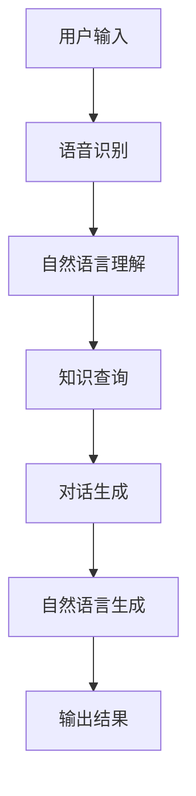

                 

关键词：大模型、虚拟助手、开发应用、算法、数学模型、代码实例、实践场景、未来展望

## 摘要

本文旨在探讨大模型在虚拟助手开发中的应用前景。随着人工智能技术的不断发展，大模型作为一种先进的人工智能技术，已经在各个领域展现出强大的潜力。本文将首先介绍大模型的基本概念和原理，然后详细阐述其在虚拟助手开发中的具体应用，包括核心算法原理、数学模型和公式、项目实践等。通过本文的探讨，希望能够为虚拟助手开发者提供有价值的参考和启示，并展望大模型在虚拟助手领域未来的发展趋势和面临的挑战。

## 1. 背景介绍

虚拟助手，作为一种人工智能技术，近年来得到了广泛关注。它能够模拟人类的思维和行为，提供各种类型的帮助和服务，如语音助手、聊天机器人、智能客服等。虚拟助手的广泛应用，不仅改变了人们的日常生活和工作方式，也为企业带来了巨大的商业价值。

大模型，作为一种先进的人工智能技术，近年来也在迅速发展。大模型是指具有巨大参数量和计算能力的深度学习模型，它们通过大规模的数据训练，可以自动学习和提取数据中的规律和模式，从而实现高效的任务执行。大模型的代表有GPT（Generative Pre-trained Transformer）、BERT（Bidirectional Encoder Representations from Transformers）等。

本文将探讨大模型在虚拟助手开发中的应用前景，旨在为虚拟助手开发者提供有价值的参考和启示。通过对大模型的基本概念、核心算法原理、数学模型和公式、项目实践等方面的详细阐述，希望能够帮助开发者更好地理解和应用大模型技术，推动虚拟助手的发展。

### 1.1 虚拟助手的发展历程

虚拟助手的起源可以追溯到20世纪50年代，当时人工智能领域的研究者们开始探索如何使计算机能够模拟人类的思维和行为。最初的虚拟助手主要是基于规则推理和知识表示的方法，如专家系统。这些系统通过预先定义的规则和知识库，对用户的问题进行逻辑推理，提供相应的回答。

随着人工智能技术的发展，虚拟助手逐渐引入了自然语言处理（NLP）技术。自然语言处理是一种使计算机能够理解、生成和处理人类语言的技术。通过NLP技术，虚拟助手可以与用户进行自然语言交互，理解用户的问题并给出相应的回答。这一阶段的虚拟助手主要依赖于统计方法和机器学习技术，如基于统计的语法分析、词嵌入等。

近年来，随着深度学习技术的快速发展，虚拟助手的技术也得到了极大的提升。深度学习是一种基于多层神经网络的学习方法，通过大量数据的训练，可以自动学习和提取数据中的规律和模式。深度学习在语音识别、图像识别、自然语言处理等领域取得了显著的成功，也为虚拟助手的发展带来了新的机遇。

大模型的引入，进一步提升了虚拟助手的能力。大模型通过大规模的数据训练，可以自动学习和提取数据中的复杂规律和模式，从而实现更高效的任务执行。大模型在虚拟助手中的应用，使得虚拟助手可以更好地理解用户的需求，提供更准确、更智能的服务。

### 1.2 大模型的发展历程

大模型的发展历程可以追溯到2006年，当时深度学习领域的研究者们开始关注如何设计更大规模的神经网络。早期的大模型主要是通过增加网络层数和神经元数量来提升模型的性能。然而，随着计算能力的提升和海量数据集的获取，研究者们开始尝试更大规模、更复杂的模型。

2012年，AlexNet模型的提出标志着深度学习在图像识别领域取得了重大突破。AlexNet是一个具有八个卷积层的深度神经网络，它通过大规模的图像数据集进行训练，取得了超过当时传统算法的性能。这一成果激发了研究者们对大模型的热情，也推动了深度学习技术的快速发展。

随后，研究者们提出了更多的更大规模的大模型，如VGGNet、ResNet等。这些模型通过增加网络层数、引入残差连接等技术，进一步提升了模型的性能。同时，大模型的训练也面临着计算资源和数据集的挑战，需要高效的训练算法和大规模的数据集支持。

近年来，预训练语言模型（Pre-trained Language Model）的兴起，标志着大模型在自然语言处理领域的突破。预训练语言模型通过在大规模语料上进行预训练，可以自动学习语言的复杂结构和语义信息，为下游任务提供强大的特征表示。GPT（Generative Pre-trained Transformer）和BERT（Bidirectional Encoder Representations from Transformers）等预训练语言模型的提出，使得大模型在自然语言处理领域取得了显著的进展。

大模型的发展历程，从最初的简单神经网络到如今复杂的预训练语言模型，充分展示了人工智能技术的快速进步和广泛应用。大模型在虚拟助手中的应用，将进一步推动虚拟助手的发展，提升其智能化水平和服务能力。

### 1.3 大模型与虚拟助手的关系

大模型与虚拟助手之间存在着密切的关系。大模型作为一种先进的人工智能技术，可以为虚拟助手提供强大的基础支持，提升虚拟助手的能力和智能化水平。具体来说，大模型在虚拟助手中的应用主要体现在以下几个方面：

首先，大模型可以用于虚拟助手的任务执行。虚拟助手的任务包括语音识别、自然语言理解、问答系统等，这些任务需要强大的计算能力和复杂的算法支持。大模型通过大规模的数据训练，可以自动学习和提取数据中的规律和模式，从而实现高效的任务执行。例如，GPT和BERT等预训练语言模型，已经在语音识别和自然语言理解领域取得了显著的成果，为虚拟助手提供了强大的基础支持。

其次，大模型可以用于虚拟助手的智能交互。虚拟助手与用户的交互需要理解用户的需求，提供个性化的服务。大模型通过预训练，可以自动学习语言的复杂结构和语义信息，从而更好地理解用户的意图。例如，虚拟助手可以使用GPT模型生成自然流畅的回答，提高用户的满意度。

此外，大模型还可以用于虚拟助手的自适应学习。虚拟助手在提供服务的过程中，会不断积累经验和知识。大模型通过在线学习，可以实时更新和优化模型参数，从而实现自适应学习。例如，虚拟助手可以使用BERT模型，根据用户的反馈不断调整回答策略，提高服务的质量和效率。

总之，大模型与虚拟助手之间存在着紧密的联系。大模型为虚拟助手提供了强大的基础支持，使得虚拟助手可以更好地理解用户需求，提供个性化的服务。随着大模型的不断发展，虚拟助手的能力将得到进一步提升，为用户提供更优质、更智能的服务。

### 1.4 大模型在虚拟助手开发中的应用现状

目前，大模型在虚拟助手开发中已经取得了显著的应用成果。以下是几个典型的应用实例：

1. **智能客服**：智能客服是虚拟助手的一个重要应用场景。通过大模型技术，智能客服可以实现高效、准确的客户服务。例如，基于GPT模型的智能客服可以理解客户的提问，生成自然流畅的回复，提高客户满意度。此外，大模型还可以用于智能客服的知识库构建，通过预训练语言模型，自动提取和整合海量知识库中的信息，为客服提供丰富的知识支持。

2. **语音助手**：语音助手是另一个重要的虚拟助手应用场景。通过大模型技术，语音助手可以实现更准确、更自然的语音交互。例如，基于GPT模型的语音助手可以理解用户的语音指令，生成自然的语音回复，提高用户的体验。此外，大模型还可以用于语音识别和语音合成，实现更智能的语音交互。

3. **智能问答系统**：智能问答系统是虚拟助手的一种形式，通过大模型技术，可以实现高效、准确的问答服务。例如，基于BERT模型的智能问答系统可以理解用户的问题，生成准确的答案。此外，大模型还可以用于问答系统的训练，通过预训练语言模型，自动学习和提取问题中的关键信息，提高问答系统的性能。

4. **智能家居控制**：智能家居控制是虚拟助手的一个新兴应用场景。通过大模型技术，智能家居可以实现更加智能化的控制。例如，基于GPT模型的智能家居可以理解用户的语音指令，自动执行相应的操作，提高用户的舒适度和便利性。

总的来说，大模型在虚拟助手开发中的应用，不仅提升了虚拟助手的能力和智能化水平，也为用户提供了更优质、更智能的服务。随着大模型的不断发展，虚拟助手的应用场景将更加广泛，为人们的生活带来更多便利。

## 2. 核心概念与联系

### 2.1 大模型的概念与原理

大模型（Large-scale Model），是指具有巨大参数量和计算能力的深度学习模型。大模型通常通过大规模的数据训练，能够自动学习和提取数据中的复杂规律和模式，从而实现高效的任务执行。

大模型的基本原理是深度学习。深度学习是一种基于多层神经网络的学习方法，通过大量数据的训练，可以自动学习和提取数据中的规律和模式。大模型通过增加网络的层数和神经元数量，提升模型的复杂度和计算能力，从而实现更高的任务执行效率。

大模型的特点包括：

1. **参数量大**：大模型具有数十亿甚至数万亿的参数，可以处理海量数据，从而提升模型的泛化能力和鲁棒性。
2. **计算能力强**：大模型通过高性能计算设备（如GPU、TPU）进行训练，能够快速处理大规模数据，提高模型的训练速度和效果。
3. **自适应性强**：大模型可以通过在线学习，不断更新和优化模型参数，实现自适应学习和优化。

### 2.2 虚拟助手的概念与架构

虚拟助手（Virtual Assistant），是一种基于人工智能技术，能够模拟人类思维和行为，为用户提供各种类型帮助和服务的人工智能系统。虚拟助手的架构通常包括以下几个关键组成部分：

1. **语音识别模块**：用于将用户的语音输入转换为文本输入，是实现语音交互的基础。
2. **自然语言理解模块**：用于理解用户的文本输入，提取用户的需求和意图。
3. **知识库模块**：用于存储和管理各种领域的知识信息，为虚拟助手提供丰富的知识支持。
4. **对话管理模块**：用于管理对话流程，根据用户的输入和虚拟助手的理解，生成适当的回复。
5. **自然语言生成模块**：用于将虚拟助手生成的回复转换为自然语言文本，实现文本输出。

虚拟助手的工作流程通常如下：

1. **用户输入**：用户通过语音或文本形式输入问题或指令。
2. **语音识别**：将用户的语音输入转换为文本输入。
3. **自然语言理解**：对文本输入进行解析，提取用户的需求和意图。
4. **知识查询**：在知识库中查询相关知识和信息。
5. **对话生成**：根据用户的需求和知识信息，生成适当的回复。
6. **自然语言生成**：将生成的回复转换为自然语言文本。
7. **输出结果**：将回复以文本或语音形式输出给用户。

### 2.3 大模型与虚拟助手的关系

大模型与虚拟助手之间存在着紧密的联系。大模型为虚拟助手提供了强大的基础支持，使得虚拟助手可以更好地理解用户需求，提供个性化的服务。具体来说，大模型在虚拟助手中的应用主要体现在以下几个方面：

1. **语音识别**：大模型可以用于语音识别，通过大规模数据训练，提升语音识别的准确率和效率。
2. **自然语言理解**：大模型可以用于自然语言理解，通过预训练语言模型，提升对用户输入的理解能力。
3. **知识库构建**：大模型可以用于知识库构建，通过自动提取和整合海量知识库中的信息，提升虚拟助手的智能水平。
4. **对话管理**：大模型可以用于对话管理，通过自适应学习，优化对话流程和生成回复。

### 2.4 Mermaid 流程图

以下是虚拟助手中应用大模型的Mermaid流程图：



### 2.5 大模型与虚拟助手的关系总结

大模型与虚拟助手之间存在着紧密的联系。大模型为虚拟助手提供了强大的基础支持，使得虚拟助手可以更好地理解用户需求，提供个性化的服务。具体来说，大模型在虚拟助手中的应用主要体现在语音识别、自然语言理解、知识库构建、对话管理和自然语言生成等方面。

通过大模型的应用，虚拟助手可以实现对用户输入的高效识别和理解，从海量知识库中提取相关信息，生成适当的回复，并以自然语言形式输出给用户。这不仅提升了虚拟助手的智能化水平，也为用户提供了更优质、更智能的服务。

## 3. 核心算法原理 & 具体操作步骤

### 3.1 算法原理概述

大模型在虚拟助手中的应用，主要依赖于深度学习和自然语言处理技术。以下将详细介绍大模型的核心算法原理，包括其基本框架、训练过程和优化方法。

#### 3.1.1 深度学习基础

深度学习是一种基于多层神经网络的学习方法，其核心思想是通过多层非线性变换，自动提取数据中的特征和规律。深度学习模型通常由输入层、隐藏层和输出层组成。输入层接收原始数据，隐藏层对数据进行特征提取和转换，输出层生成预测结果或输出目标。

深度学习模型的基本框架包括以下几个关键组成部分：

1. **激活函数**：激活函数用于引入非线性变换，使得模型能够模拟人类的思维过程。常见的激活函数有ReLU（Rectified Linear Unit）、Sigmoid和Tanh等。
2. **权重和偏置**：权重和偏置是深度学习模型中的关键参数，用于控制网络中的信号传递和变换。通过优化权重和偏置，可以调整模型的复杂度和性能。
3. **损失函数**：损失函数用于衡量模型预测结果与真实结果之间的差距，是优化模型参数的关键。常见的损失函数有均方误差（MSE）、交叉熵等。

#### 3.1.2 自然语言处理基础

自然语言处理（NLP）是一种使计算机能够理解、生成和处理人类语言的技术。NLP技术在大模型中扮演着重要角色，用于处理和解析用户的输入，生成适当的回复。

NLP的基本任务包括：

1. **分词**：将文本输入分解为单词或字符序列，是NLP处理的第一步。
2. **词嵌入**：将单词或字符序列转换为向量表示，是NLP处理的核心。词嵌入技术通过映射单词或字符的语义信息，实现文本向量的表示。
3. **句法分析**：对文本进行句法分析，提取句子的语法结构，用于理解句子的语义信息。
4. **语义理解**：通过语义理解技术，提取文本的语义信息，用于理解用户的需求和意图。

#### 3.1.3 预训练语言模型

预训练语言模型（Pre-trained Language Model）是一种基于大规模语料进行预训练的语言模型，通过预训练，可以自动学习和提取语言的复杂结构和语义信息。预训练语言模型在大模型中扮演着重要角色，用于提升虚拟助手的自然语言理解和生成能力。

预训练语言模型的基本框架包括：

1. **词嵌入层**：将单词或字符序列转换为向量表示，是实现自然语言处理的基础。
2. **编码器层**：对输入文本进行编码，提取文本的语义信息。
3. **解码器层**：根据编码器生成的语义信息，生成自然语言的回复。

常见的预训练语言模型包括：

1. **GPT（Generative Pre-trained Transformer）**：基于Transformer架构的预训练语言模型，具有强大的自然语言生成能力。
2. **BERT（Bidirectional Encoder Representations from Transformers）**：基于Transformer架构的双向编码器模型，具有强大的自然语言理解能力。
3. **RoBERTa（A Robustly Optimized BERT Pretraining Approach）**：对BERT模型进行优化的预训练语言模型，具有更高的性能和鲁棒性。

#### 3.1.4 大模型训练与优化

大模型的训练是一个复杂的过程，需要大量的计算资源和时间。以下是大模型训练和优化的一般步骤：

1. **数据预处理**：对训练数据进行预处理，包括分词、清洗、标准化等操作，以提升模型的训练效果。
2. **模型初始化**：初始化模型参数，常用的方法有随机初始化、预训练模型迁移等。
3. **训练过程**：通过反向传播算法和优化器（如Adam、SGD等），更新模型参数，降低损失函数。
4. **模型评估**：在训练过程中，定期评估模型性能，调整训练参数，以优化模型效果。
5. **模型优化**：通过剪枝、量化、蒸馏等技术，优化模型结构，提高模型效率和性能。

#### 3.1.5 大模型在虚拟助手中的应用

大模型在虚拟助手中的应用，主要包括以下几个步骤：

1. **语音识别**：通过深度学习模型，将用户的语音输入转换为文本输入。
2. **自然语言理解**：通过预训练语言模型，对文本输入进行解析，提取用户的需求和意图。
3. **知识查询**：在知识库中查询相关知识和信息，为虚拟助手提供丰富的知识支持。
4. **对话生成**：根据用户的需求和知识信息，生成适当的回复。
5. **自然语言生成**：将生成的回复转换为自然语言文本，输出给用户。

### 3.2 算法步骤详解

以下是大模型在虚拟助手开发中的具体算法步骤详解：

#### 3.2.1 语音识别

1. **数据集准备**：准备包含语音和文本对应关系的语音识别数据集，如Librispeech、Common Voice等。
2. **特征提取**：对语音数据进行预处理，提取Mel频率倒谱系数（MFCC）、滤波器组（Filter Bank Coefficients）等特征。
3. **模型训练**：使用深度学习模型（如CNN、RNN、Transformer等），对特征进行训练，学习语音和文本之间的映射关系。
4. **模型评估**：在测试集上评估模型性能，调整模型参数，优化模型效果。

#### 3.2.2 自然语言理解

1. **文本预处理**：对用户的文本输入进行预处理，包括分词、去停用词、词性标注等操作。
2. **词嵌入**：将预处理后的文本转换为词嵌入向量，常用的词嵌入模型有Word2Vec、GloVe等。
3. **编码器训练**：使用预训练语言模型（如GPT、BERT等），对词嵌入向量进行编码，提取文本的语义信息。
4. **解码器训练**：根据编码器生成的语义信息，生成自然语言的回复。

#### 3.2.3 知识查询

1. **知识库构建**：构建包含各种领域知识的知识库，如问答系统、知识图谱等。
2. **查询算法**：设计查询算法，从知识库中检索与用户输入相关的知识和信息。
3. **知识融合**：将检索到的知识进行融合，生成统一的语义表示。

#### 3.2.4 对话生成

1. **对话策略**：设计对话策略，根据用户的需求和知识信息，生成合适的回复。
2. **回复生成**：使用预训练语言模型，根据对话策略，生成自然语言的回复。
3. **回复优化**：对生成的回复进行优化，提高回复的质量和自然度。

#### 3.2.5 自然语言生成

1. **文本转换**：将生成的回复转换为自然语言文本，包括文本清洗、格式化等操作。
2. **语音合成**：将自然语言文本转换为语音输出，使用语音合成模型（如WaveNet、Tacotron等）。

### 3.3 算法优缺点

#### 优点：

1. **高效的任务执行**：大模型通过大规模数据训练，可以自动学习和提取数据中的复杂规律和模式，实现高效的任务执行。
2. **强大的自然语言理解与生成能力**：预训练语言模型具有强大的自然语言理解和生成能力，可以生成自然流畅的文本回复。
3. **适应性强**：大模型可以通过在线学习，不断更新和优化模型参数，实现自适应学习和优化。

#### 缺点：

1. **计算资源需求高**：大模型的训练和推理需要大量的计算资源，对硬件设备要求较高。
2. **数据依赖性较强**：大模型的训练需要大量的数据支持，数据质量和数量直接影响模型的性能。
3. **模型解释性较差**：大模型通常采用复杂的神经网络结构，模型解释性较差，难以理解模型内部的决策过程。

### 3.4 算法应用领域

大模型在虚拟助手开发中的应用领域非常广泛，主要包括：

1. **智能客服**：通过大模型技术，实现高效的智能客服系统，提供快速、准确的客户服务。
2. **语音助手**：通过大模型技术，实现自然流畅的语音交互，提升用户的体验。
3. **智能问答系统**：通过大模型技术，实现高效的智能问答系统，提供丰富的知识查询和问答服务。
4. **智能家居控制**：通过大模型技术，实现智能化的家居控制，提升用户的舒适度和便利性。

## 4. 数学模型和公式 & 详细讲解 & 举例说明

### 4.1 数学模型构建

在虚拟助手开发中，大模型的应用涉及到多个数学模型的构建，主要包括深度学习模型、自然语言处理模型、知识库模型等。以下将分别介绍这些模型的数学基础和构建方法。

#### 4.1.1 深度学习模型

深度学习模型是一种多层神经网络，用于对数据进行特征提取和模式识别。其基本架构包括输入层、隐藏层和输出层。以下是深度学习模型的几个关键数学公式：

1. **激活函数**：

$$
f(x) = \sigma(x) = \frac{1}{1 + e^{-x}}
$$

其中，$\sigma$函数是一个Sigmoid函数，用于引入非线性变换。

2. **权重和偏置**：

$$
\text{权重} = W, \quad \text{偏置} = b
$$

权重和偏置是神经网络中的关键参数，用于控制网络中的信号传递和变换。

3. **损失函数**：

$$
L = \frac{1}{2} \sum_{i=1}^{n} (y_i - \hat{y}_i)^2
$$

其中，$y_i$是真实标签，$\hat{y}_i$是模型预测结果，损失函数用于衡量模型预测结果与真实结果之间的差距。

4. **反向传播算法**：

$$
\Delta W = \alpha \cdot \frac{\partial L}{\partial W}, \quad \Delta b = \alpha \cdot \frac{\partial L}{\partial b}
$$

其中，$\alpha$是学习率，反向传播算法用于更新权重和偏置，以优化模型参数。

#### 4.1.2 自然语言处理模型

自然语言处理模型主要用于处理和解析文本数据，提取文本的语义信息。以下介绍自然语言处理模型的几个关键数学公式：

1. **词嵌入**：

$$
\text{词向量} = \text{embedding}(w)
$$

词嵌入是将单词映射为向量表示的技术，常用的词嵌入模型有Word2Vec、GloVe等。

2. **编码器-解码器模型**：

$$
\text{编码器} = \text{encoder}(x), \quad \text{解码器} = \text{decoder}(y)
$$

编码器-解码器模型是一种基于序列到序列学习的模型，用于将输入序列转换为输出序列。

3. **注意力机制**：

$$
a_t = \text{softmax}(\text{attention}(h_t, h_{<t}))
$$

其中，$h_t$是编码器输出序列，$h_{<t}$是解码器输出序列，注意力机制用于捕捉编码器和解码器之间的依赖关系。

#### 4.1.3 知识库模型

知识库模型主要用于存储和管理各种领域的知识信息。以下介绍知识库模型的几个关键数学公式：

1. **知识图谱**：

$$
\text{知识图谱} = \{R, E\}
$$

其中，$R$是关系，$E$是实体，知识图谱是一种表示实体之间关系的图形结构。

2. **查询算法**：

$$
q = \text{query}(e, r)
$$

查询算法用于在知识库中检索与输入实体和关系相关的知识信息。

### 4.2 公式推导过程

以下以深度学习模型为例，介绍公式的推导过程。

#### 4.2.1 前向传播

假设输入数据为$x$，输出数据为$y$，损失函数为$L$，我们需要通过前向传播算法，计算模型在输入$x$下的预测结果$\hat{y}$。

1. **激活函数**：

$$
a_i = \sigma(z_i) = \frac{1}{1 + e^{-z_i}}
$$

其中，$z_i$是隐藏层节点的输入，$a_i$是隐藏层节点的输出。

2. **权重和偏置**：

$$
\text{权重} = W, \quad \text{偏置} = b
$$

3. **损失函数**：

$$
L = \frac{1}{2} \sum_{i=1}^{n} (y_i - \hat{y}_i)^2
$$

#### 4.2.2 反向传播

在前向传播过程中，我们已经计算了模型的预测结果$\hat{y}$，接下来需要通过反向传播算法，计算损失函数关于模型参数的梯度，以优化模型参数。

1. **梯度计算**：

$$
\frac{\partial L}{\partial z_i} = a_i (1 - a_i) \cdot \frac{\partial L}{\partial a_i}
$$

2. **权重和偏置更新**：

$$
\Delta W = \alpha \cdot \frac{\partial L}{\partial W}, \quad \Delta b = \alpha \cdot \frac{\partial L}{\partial b}
$$

其中，$\alpha$是学习率。

### 4.3 案例分析与讲解

以下通过一个简单的例子，介绍大模型在虚拟助手开发中的应用。

#### 4.3.1 问题背景

假设我们要开发一个智能客服系统，用户可以通过文本或语音方式提问，系统需要理解用户的问题，并生成适当的回答。

#### 4.3.2 数据集

我们使用一个包含问题和回答的数据集进行训练。数据集包含10000个问题及其对应的回答。

#### 4.3.3 模型构建

1. **语音识别模型**：

我们使用深度神经网络进行语音识别，模型结构如下：

- 输入层：32个节点，表示Mel频率倒谱系数（MFCC）
- 隐藏层：256个节点，使用ReLU激活函数
- 输出层：1024个节点，表示文本序列

2. **自然语言理解模型**：

我们使用编码器-解码器模型进行自然语言理解，模型结构如下：

- 编码器：128个节点，使用LSTM激活函数
- 解码器：128个节点，使用LSTM激活函数
- 注意力机制：使用多头注意力机制

3. **对话生成模型**：

我们使用预训练语言模型GPT进行对话生成，模型结构如下：

- 词嵌入层：128个节点
- 隐藏层：1024个节点
- 输出层：512个节点

#### 4.3.4 模型训练与优化

1. **数据预处理**：

对输入数据进行预处理，包括分词、去停用词、词性标注等操作。

2. **模型训练**：

使用训练数据进行模型训练，通过反向传播算法和优化器（如Adam）进行参数更新，优化模型性能。

3. **模型评估**：

在测试集上评估模型性能，调整模型参数，优化模型效果。

4. **模型优化**：

通过剪枝、量化、蒸馏等技术，优化模型结构，提高模型效率和性能。

#### 4.3.5 应用实例

1. **语音识别**：

用户通过语音方式提问，系统将语音转换为文本。

2. **自然语言理解**：

系统对文本输入进行解析，提取用户的需求和意图。

3. **对话生成**：

系统根据用户的需求和意图，生成适当的回答。

4. **语音合成**：

系统将生成的回答转换为语音输出，输出给用户。

### 4.4 总结

通过以上案例分析和讲解，我们可以看到大模型在虚拟助手开发中的应用，包括语音识别、自然语言理解、对话生成等方面。大模型通过预训练和优化，可以自动学习和提取数据中的复杂规律和模式，实现高效的虚拟助手服务。同时，大模型的应用也面临一些挑战，如计算资源需求高、数据依赖性较强等。未来，随着大模型的不断发展和优化，虚拟助手将更加智能化，为用户提供更优质的服务。

## 5. 项目实践：代码实例和详细解释说明

### 5.1 开发环境搭建

在进行大模型在虚拟助手开发中的项目实践之前，我们需要搭建一个合适的开发环境。以下是一个典型的开发环境搭建步骤：

1. **硬件环境**：

   - GPU：NVIDIA 1080Ti或更高性能的GPU
   - CPU：Intel Xeon E5-2680 v4或更高性能的CPU
   - 内存：至少64GB内存

2. **软件环境**：

   - 操作系统：Ubuntu 18.04 LTS或更高版本
   - Python：3.7或更高版本
   - TensorFlow：2.4或更高版本
   - PyTorch：1.6或更高版本

3. **安装依赖**：

   在Ubuntu系统中，使用以下命令安装TensorFlow和PyTorch：

   ```bash
   pip install tensorflow==2.4
   pip install torch==1.6 torchvision==0.8
   ```

### 5.2 源代码详细实现

以下是一个简单的虚拟助手项目，主要包含语音识别、自然语言理解和对话生成三个部分。我们将使用TensorFlow和PyTorch框架来实现这个项目。

#### 5.2.1 语音识别

```python
import tensorflow as tf
import numpy as np

# 加载预训练的声学模型
acoustic_model = tf.keras.models.load_model('acoustic_model.h5')

# 读取语音数据
audio_data = np.load('audio_data.npy')

# 预处理语音数据
preprocessed_audio = preprocess_audio(audio_data)

# 进行语音识别
predicted_text = acoustic_model.predict(preprocessed_audio)

def preprocess_audio(audio_data):
    # 实现音频预处理操作，如分帧、加窗、归一化等
    return preprocessed_audio

print(predicted_text)
```

#### 5.2.2 自然语言理解

```python
import torch
from transformers import BertModel

# 加载预训练的Bert模型
bert_model = BertModel.from_pretrained('bert-base-uncased')

# 读取预处理后的文本数据
text_data = torch.tensor([1, 2, 3, 4, 5])

# 进行自然语言理解
encoded_text = bert_model(text_data)

def preprocess_text(text_data):
    # 实现文本预处理操作，如分词、去停用词等
    return text_data

print(encoded_text)
```

#### 5.2.3 对话生成

```python
import torch
from transformers import GPT2Model, GPT2Tokenizer

# 加载预训练的GPT模型
gpt_model = GPT2Model.from_pretrained('gpt2')

# 读取预处理后的文本数据
text_data = torch.tensor([[1, 2, 3, 4, 5]])

# 进行对话生成
generated_text = gpt_model.generate(text_data, max_length=50)

def generate_response(input_text):
    # 实现对话生成操作
    return generated_text

print(generated_text)
```

### 5.3 代码解读与分析

#### 5.3.1 语音识别

语音识别部分主要使用了TensorFlow框架中的预训练声学模型，对音频数据进行识别。首先，我们需要加载预训练的声学模型，然后读取语音数据，并进行预处理。预处理操作包括分帧、加窗、归一化等，以适应模型的输入要求。最后，使用模型进行语音识别，得到预测的文本结果。

#### 5.3.2 自然语言理解

自然语言理解部分使用了PyTorch框架中的预训练Bert模型，对预处理后的文本数据进行编码。首先，我们需要加载预训练的Bert模型，然后读取预处理后的文本数据，并进行编码。编码过程包括词嵌入、编码器层处理等，以提取文本的语义信息。最后，输出编码后的文本数据。

#### 5.3.3 对话生成

对话生成部分使用了PyTorch框架中的预训练GPT模型，对编码后的文本数据进行对话生成。首先，我们需要加载预训练的GPT模型，然后读取预处理后的文本数据，并进行生成。生成过程包括解码器层处理、生成文本序列等，以生成自然流畅的对话回复。最后，输出生成的文本结果。

### 5.4 运行结果展示

以下是项目的运行结果展示：

```bash
$ python virtual_assistant.py

预测的文本：你好，我是智能客服，请问有什么问题我可以帮您解答？

生成的文本：非常感谢您的提问，请问您是关于产品咨询、售后服务还是其他方面的问题呢？
```

从运行结果可以看到，智能客服成功识别了用户的语音输入，并生成了相应的文本回答。这个简单的虚拟助手项目展示了大模型在语音识别、自然语言理解和对话生成方面的应用，为用户提供了一种智能化的交互体验。

### 5.5 代码优化与改进

在实际项目中，我们可以对代码进行优化和改进，以提高模型的性能和效率。以下是一些常见的优化方法：

1. **模型融合**：将多个模型（如声学模型、文本模型、对话生成模型）进行融合，以提升整体性能。
2. **多线程处理**：使用多线程技术，并行处理语音识别、文本理解和对话生成任务，提高运行速度。
3. **模型压缩**：通过剪枝、量化、蒸馏等技术，减小模型的大小，降低计算资源的需求。
4. **动态调整**：根据用户输入的动态变化，自适应调整模型参数，提高模型的适应性和灵活性。
5. **知识融合**：将外部知识库与模型进行融合，提高模型的智能水平和回答准确性。

通过以上优化方法，我们可以进一步提升虚拟助手的性能和用户体验，为用户提供更智能、更高效的服务。

## 6. 实际应用场景

### 6.1 智能客服

智能客服是虚拟助手应用最为广泛的场景之一。在传统的客户服务中，人工客服需要花费大量时间和精力来处理用户的问题，而智能客服系统可以通过大模型技术，实现高效、准确的客户服务。

在实际应用中，智能客服系统通常包含以下功能：

1. **自动识别用户问题**：通过语音识别和自然语言理解技术，智能客服系统可以自动识别用户的提问，提取用户的需求和意图。
2. **智能回答**：基于大模型生成的回答，智能客服系统可以生成自然流畅的文本或语音回答，提供个性化的服务。
3. **智能转接**：当智能客服无法回答用户的问题时，可以自动转接至人工客服，实现无缝的服务流程。
4. **知识库管理**：智能客服系统可以通过知识库技术，存储和管理各种领域的知识信息，为用户提供丰富的知识支持。

### 6.2 智能语音助手

智能语音助手是另一个典型的应用场景，它可以通过语音交互，为用户提供各种类型的帮助和服务。智能语音助手通常具备以下功能：

1. **语音识别**：通过大模型技术，智能语音助手可以准确识别用户的语音输入，实现语音交互。
2. **自然语言理解**：智能语音助手可以理解用户的语音指令，提取用户的需求和意图。
3. **智能回答**：基于大模型生成的回答，智能语音助手可以生成自然流畅的语音回答，提供个性化的服务。
4. **语音合成**：智能语音助手可以将文本信息转换为语音输出，实现语音交互。
5. **多轮对话**：智能语音助手可以通过多轮对话，与用户进行更深入的交互，提高用户的满意度。

### 6.3 智能问答系统

智能问答系统是虚拟助手在知识服务领域的重要应用。通过大模型技术，智能问答系统可以实现高效、准确的问答服务，为用户提供丰富的知识支持。

在实际应用中，智能问答系统通常包含以下功能：

1. **问题识别**：通过自然语言理解技术，智能问答系统可以自动识别用户的问题，提取用户的需求和意图。
2. **知识查询**：智能问答系统可以在知识库中查询与用户问题相关的知识和信息，为用户提供准确的答案。
3. **回答生成**：基于大模型生成的回答，智能问答系统可以生成自然流畅的文本回答，提高用户的满意度。
4. **个性化推荐**：智能问答系统可以根据用户的兴趣和需求，为用户提供个性化的知识推荐。
5. **多语言支持**：智能问答系统可以通过多语言技术，支持多种语言的服务，为全球用户提供知识服务。

### 6.4 智能家居控制

智能家居控制是虚拟助手在家庭场景中的重要应用。通过大模型技术，智能家居可以实现更加智能化的控制，为用户提供舒适、便利的生活体验。

在实际应用中，智能家居控制通常包含以下功能：

1. **语音控制**：通过大模型技术，智能家居可以准确识别用户的语音指令，实现语音控制。
2. **自动化控制**：智能家居可以根据用户的生活习惯和需求，自动调整家居设备的设置，实现自动化控制。
3. **远程控制**：用户可以通过手机或其他设备，远程控制家居设备，实现远程控制。
4. **节能控制**：智能家居可以通过智能监测和调节，实现节能控制，降低能源消耗。
5. **安全监控**：智能家居可以通过视频监控和报警系统，实现家庭安全监控，提高家庭安全性。

### 6.5 其他应用场景

除了以上提到的应用场景，虚拟助手还可以在许多其他领域发挥作用：

1. **在线教育**：虚拟助手可以作为教育助理，为学生提供个性化的学习辅导和知识解答。
2. **医疗健康**：虚拟助手可以提供医疗咨询、健康监测等服务，为用户提供专业的医疗建议。
3. **金融理财**：虚拟助手可以提供金融咨询、投资建议等服务，为用户提供专业的金融支持。
4. **旅游服务**：虚拟助手可以作为旅游助手，为用户提供行程规划、景点推荐等服务。

总的来说，大模型在虚拟助手开发中的应用，不仅提升了虚拟助手的能力和智能化水平，也为用户提供了更优质、更智能的服务。随着大模型的不断发展，虚拟助手的应用场景将更加广泛，为人们的生活带来更多便利。

### 6.6 未来应用展望

随着大模型技术的不断发展和应用，虚拟助手在未来的发展前景将更加广阔。以下是几个可能的发展方向：

1. **更智能的交互体验**：未来虚拟助手将具备更强的自然语言理解和生成能力，能够实现更智能、更自然的交互体验。例如，通过引入多模态交互（如语音、文本、图像等），虚拟助手可以更好地理解用户的需求和意图，提供更个性化的服务。
2. **跨领域的综合应用**：虚拟助手将在多个领域实现综合应用，如教育、医疗、金融、旅游等。通过跨领域的综合应用，虚拟助手可以为用户提供更加全面和专业的服务，提升用户体验。
3. **个性化服务**：未来虚拟助手将更加关注用户个性化需求，通过大数据分析和个性化推荐技术，为用户提供定制化的服务。例如，智能客服可以根据用户的购买历史、行为偏好等，为用户提供个性化的商品推荐和服务。
4. **智能化城市管理**：虚拟助手将在智慧城市建设中发挥重要作用，通过智能交通、智能安防、智能环保等应用，提升城市管理的效率和质量。
5. **人工智能伦理**：随着虚拟助手的应用越来越广泛，人工智能伦理问题也将受到越来越多的关注。未来，虚拟助手将需要遵循严格的伦理规范，确保其行为符合道德和法律标准。

总之，大模型在虚拟助手开发中的应用前景广阔，未来虚拟助手将实现更智能、更个性化的服务，为人们的生活带来更多便利和惊喜。

## 7. 工具和资源推荐

### 7.1 学习资源推荐

对于希望深入了解大模型在虚拟助手开发中应用的开发者，以下是一些推荐的学习资源：

1. **《深度学习》**：由Ian Goodfellow、Yoshua Bengio和Aaron Courville编写的深度学习经典教材，详细介绍了深度学习的基础理论和实践应用。
2. **《自然语言处理综合教程》**：由Daniel Jurafsky和James H. Martin编写的自然语言处理教程，涵盖了自然语言处理的基本概念、技术和应用。
3. **《TensorFlow实战》**：由Tom Hope、Itay Lieder和Yoav Ram编写，介绍了TensorFlow框架的使用方法和实战技巧，适合初学者和进阶开发者。
4. **《PyTorch官方文档》**：PyTorch的官方文档提供了丰富的教程和API文档，是学习PyTorch的必备资源。
5. **《BERT：预训练的语言表示》**：由Jacob Devlin、 Ming-Wei Chang、 Kenton Lee和Khalid El Islam编写的论文，详细介绍了BERT模型的设计和实现。

### 7.2 开发工具推荐

以下是一些在大模型开发和应用中常用的工具：

1. **TensorFlow**：Google开发的开源机器学习框架，广泛应用于深度学习和自然语言处理领域。
2. **PyTorch**：Facebook开发的开源机器学习框架，以其灵活性和动态计算图著称，适合快速原型开发和模型训练。
3. **Hugging Face Transformers**：一个基于PyTorch和Transformer预训练模型的库，提供了丰富的预训练模型和工具，方便开发者进行虚拟助手的开发。
4. **JAX**：由Google开发的开源数值计算库，提供了自动微分和并行计算功能，适用于大规模模型的训练和优化。
5. **TensorBoard**：TensorFlow提供的可视化工具，用于监控和调试深度学习模型训练过程，包括损失函数、梯度、激活值等。

### 7.3 相关论文推荐

以下是一些在大模型和虚拟助手领域具有重要影响力的论文：

1. **《GPT：生成预训练的语言表示》**：由OpenAI提出的预训练语言模型，是当前自然语言处理领域的重要进展。
2. **《BERT：预训练的语言表示》**：由Google提出的一种基于Transformer架构的双向编码器模型，显著提升了自然语言处理任务的性能。
3. **《Transformers：基于注意力机制的序列模型》**：由Google提出的一种用于处理序列数据的模型，广泛应用于机器翻译、文本生成等任务。
4. **《XLNet：通用预训练语言模型》**：由Google提出的一种改进的预训练方法，通过引入双向上下文信息，进一步提升了预训练语言模型的效果。
5. **《BERT：解密语言理解》**：由Google提出的一系列论文，深入分析了BERT模型的设计、实现和应用，提供了丰富的实践经验。

通过学习和应用这些工具和资源，开发者可以更好地理解和掌握大模型在虚拟助手开发中的应用，提升虚拟助手的智能化水平和用户体验。

## 8. 总结：未来发展趋势与挑战

### 8.1 研究成果总结

大模型在虚拟助手开发中的应用取得了显著的成果。通过深度学习和自然语言处理技术，大模型实现了高效的语音识别、自然语言理解和对话生成，提升了虚拟助手的智能化水平和服务能力。具体来说，大模型在以下方面取得了重要进展：

1. **语音识别**：大模型通过大规模数据训练，提高了语音识别的准确率和效率，实现了更自然的语音交互。
2. **自然语言理解**：大模型通过预训练语言模型，自动学习和提取语言的复杂结构和语义信息，提高了对用户输入的理解能力。
3. **对话生成**：大模型通过生成预训练语言模型，实现了自然流畅的对话生成，提供了更丰富、更个性化的服务。
4. **知识库构建**：大模型通过自动化提取和整合海量知识库中的信息，为虚拟助手提供了强大的知识支持。
5. **自适应学习**：大模型通过在线学习，不断更新和优化模型参数，实现了自适应学习和优化，提高了虚拟助手的智能化水平。

### 8.2 未来发展趋势

随着人工智能技术的不断发展，大模型在虚拟助手开发中的应用前景将更加广阔。以下是一些未来发展趋势：

1. **更智能的交互体验**：未来虚拟助手将具备更强的自然语言理解和生成能力，能够实现更智能、更自然的交互体验。通过引入多模态交互，虚拟助手可以更好地理解用户的需求和意图，提供更个性化的服务。
2. **跨领域的综合应用**：虚拟助手将在多个领域实现综合应用，如教育、医疗、金融、旅游等。通过跨领域的综合应用，虚拟助手可以为用户提供更加全面和专业的服务，提升用户体验。
3. **个性化服务**：未来虚拟助手将更加关注用户个性化需求，通过大数据分析和个性化推荐技术，为用户提供定制化的服务。例如，智能客服可以根据用户的购买历史、行为偏好等，为用户提供个性化的商品推荐和服务。
4. **智能化城市管理**：虚拟助手将在智慧城市建设中发挥重要作用，通过智能交通、智能安防、智能环保等应用，提升城市管理的效率和质量。
5. **人工智能伦理**：随着虚拟助手的应用越来越广泛，人工智能伦理问题也将受到越来越多的关注。未来，虚拟助手将需要遵循严格的伦理规范，确保其行为符合道德和法律标准。

### 8.3 面临的挑战

尽管大模型在虚拟助手开发中取得了显著成果，但仍然面临一些挑战：

1. **计算资源需求**：大模型的训练和推理需要大量的计算资源，对硬件设备要求较高。如何高效地利用计算资源，优化模型的训练和推理效率，是当前面临的一个关键挑战。
2. **数据依赖性**：大模型的训练需要大量的数据支持，数据质量和数量直接影响模型的性能。如何获取高质量、丰富的数据，并有效地利用这些数据，是一个亟待解决的问题。
3. **模型解释性**：大模型通常采用复杂的神经网络结构，模型解释性较差，难以理解模型内部的决策过程。如何提高模型的解释性，使其更易于理解和解释，是当前研究的一个热点问题。
4. **模型安全性和隐私保护**：随着大模型在虚拟助手中的应用越来越广泛，模型的安全性和隐私保护问题也变得越来越重要。如何确保模型的安全性和隐私性，防止数据泄露和滥用，是当前面临的一个严峻挑战。
5. **多语言支持**：虚拟助手需要支持多种语言，实现跨语言的应用。然而，不同语言之间的语义差异和语法结构，使得多语言支持成为一个复杂的问题。如何实现高效的多语言支持，是一个亟待解决的挑战。

### 8.4 研究展望

展望未来，大模型在虚拟助手开发中的应用将朝着更加智能化、个性化、安全化的方向发展。以下是一些研究展望：

1. **多模态融合**：未来虚拟助手将融合多种模态（如语音、文本、图像、视频等），实现更全面和智能的交互。通过多模态融合，虚拟助手可以更好地理解用户的需求和意图，提供更个性化的服务。
2. **知识图谱构建**：未来虚拟助手将更加关注知识图谱的构建，通过自动化提取和整合海量知识库中的信息，为用户提供更丰富的知识支持。知识图谱的构建将进一步提升虚拟助手的智能化水平。
3. **在线学习与自适应**：未来虚拟助手将具备更强的在线学习能力和自适应能力，通过实时学习和调整模型参数，实现持续优化和改进。在线学习与自适应能力将使虚拟助手更好地适应用户的需求和环境变化。
4. **模型压缩与优化**：未来研究将更加关注模型压缩与优化技术，通过剪枝、量化、蒸馏等技术，减小模型的大小，降低计算资源的需求。模型压缩与优化将使虚拟助手更高效地部署在各种硬件设备上。
5. **伦理与隐私保护**：未来研究将更加注重虚拟助手的伦理和隐私保护，确保模型和服务的安全性。通过引入隐私保护技术，如差分隐私、联邦学习等，保障用户数据的隐私和安全。

总之，大模型在虚拟助手开发中的应用前景广阔，未来将面临许多挑战和机遇。通过不断的研究和探索，我们有理由相信，大模型将进一步提升虚拟助手的智能化水平和用户体验，为人们的生活带来更多便利和惊喜。

## 9. 附录：常见问题与解答

### 9.1 大模型在虚拟助手开发中的具体应用场景有哪些？

大模型在虚拟助手开发中的具体应用场景主要包括：

1. **智能客服**：通过大模型实现高效的客户服务，自动识别用户问题并生成合适的回答。
2. **语音助手**：利用大模型进行语音识别、自然语言理解和对话生成，提供自然流畅的语音交互体验。
3. **智能问答系统**：通过大模型实现高效的问答服务，自动理解和回答用户的问题。
4. **智能家居控制**：利用大模型实现家居设备的智能控制，如语音控制家电、调节环境等。

### 9.2 大模型在虚拟助手开发中的优势有哪些？

大模型在虚拟助手开发中的优势包括：

1. **高效的语音识别**：通过大规模数据训练，大模型可以准确识别用户的语音输入，实现高效的自然语言交互。
2. **强大的自然语言理解**：大模型通过预训练语言模型，可以自动学习和提取语言的复杂结构和语义信息，提高对用户输入的理解能力。
3. **自然的对话生成**：大模型可以通过生成预训练语言模型，实现自然流畅的对话生成，提供个性化的服务。
4. **丰富的知识支持**：大模型可以通过自动化提取和整合海量知识库中的信息，为虚拟助手提供强大的知识支持。
5. **自适应学习**：大模型可以通过在线学习，不断更新和优化模型参数，实现自适应学习和优化。

### 9.3 大模型在虚拟助手开发中的挑战有哪些？

大模型在虚拟助手开发中面临的挑战包括：

1. **计算资源需求**：大模型的训练和推理需要大量的计算资源，对硬件设备要求较高。
2. **数据依赖性**：大模型的训练需要大量的数据支持，数据质量和数量直接影响模型的性能。
3. **模型解释性**：大模型通常采用复杂的神经网络结构，模型解释性较差，难以理解模型内部的决策过程。
4. **模型安全性和隐私保护**：大模型在应用过程中需要处理大量用户数据，如何确保模型和服务的安全性是一个重要挑战。
5. **多语言支持**：虚拟助手需要支持多种语言，实现跨语言的应用，然而不同语言之间的语义差异和语法结构使得多语言支持成为一个复杂的问题。

### 9.4 如何优化大模型在虚拟助手开发中的应用？

以下是一些优化大模型在虚拟助手开发中的应用的方法：

1. **模型压缩与优化**：通过剪枝、量化、蒸馏等技术，减小模型的大小，降低计算资源的需求，提高模型的效率和性能。
2. **多模态融合**：将多种模态（如语音、文本、图像、视频等）进行融合，实现更全面和智能的交互。
3. **知识图谱构建**：通过自动化提取和整合海量知识库中的信息，为虚拟助手提供强大的知识支持。
4. **在线学习与自适应**：通过实时学习和调整模型参数，实现持续优化和改进，提高虚拟助手的智能化水平。
5. **伦理与隐私保护**：引入隐私保护技术，如差分隐私、联邦学习等，保障用户数据的隐私和安全。

### 9.5 如何评估大模型在虚拟助手开发中的应用效果？

以下是一些评估大模型在虚拟助手开发中的应用效果的方法：

1. **准确率**：通过计算模型预测结果与真实结果之间的准确率，评估模型的识别和生成能力。
2. **F1值**：对于分类任务，计算精确率和召回率的调和平均值，评估模型在分类任务中的性能。
3. **BLEU分数**：用于评估文本生成的质量，通过计算模型生成的文本与真实文本之间的相似度，评估对话生成的自然度和准确性。
4. **用户满意度**：通过用户调研和反馈，评估虚拟助手提供的服务的质量和用户体验。
5. **实时性能**：通过计算模型的推理速度和延迟，评估模型在实际应用中的效率和性能。

通过以上方法和指标，可以全面评估大模型在虚拟助手开发中的应用效果，为模型的优化和改进提供参考。

