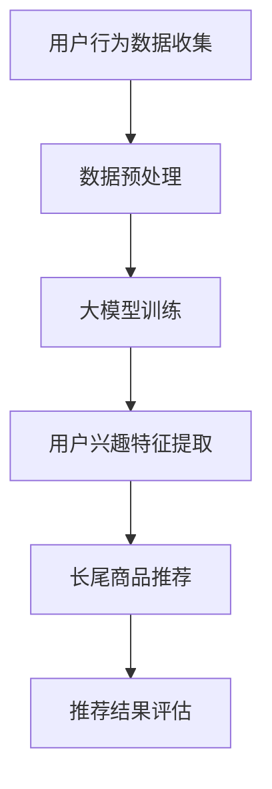

                 

关键词：大模型、长尾商品、推荐系统、算法原理、数学模型、项目实践、应用场景、未来展望

> 摘要：本文将探讨大模型在长尾商品推荐系统中的应用。通过分析核心概念和算法原理，我们深入讲解了数学模型和项目实践，并展示了在实际应用中的效果。最后，我们对未来的发展方向和挑战进行了展望。

## 1. 背景介绍

在当今数字化时代，电子商务已经成为了人们生活中不可或缺的一部分。用户在网购过程中，往往会因为商品繁多而感到困惑，无法快速找到自己心仪的产品。为了解决这一问题，推荐系统应运而生，它通过分析用户的历史行为和兴趣，向用户推荐可能感兴趣的商品。然而，随着互联网的快速发展，商品种类和用户数量的激增，传统推荐系统在应对长尾商品时遇到了很多挑战。

长尾商品是指市场中那些销售量较小但种类繁多的商品。这些商品在传统推荐系统中往往被忽视，因为它们无法吸引足够的关注。然而，对于某些特定用户来说，这些长尾商品却可能是他们最感兴趣的产品。因此，如何有效利用大模型技术来推荐长尾商品，成为了当前研究的热点问题。

本文将首先介绍大模型在长尾商品推荐系统中的核心概念和算法原理，然后详细讲解数学模型和具体操作步骤，并通过实际项目实践来展示大模型在长尾商品推荐中的效果。最后，我们将讨论大模型在长尾商品推荐领域的未来应用前景。

## 2. 核心概念与联系

为了更好地理解大模型在长尾商品推荐中的应用，我们需要先了解以下几个核心概念：

### 2.1 大模型

大模型通常指的是具有大规模参数的深度学习模型，如神经网络、Transformer等。这些模型能够通过大量的数据和计算资源进行训练，从而获得较强的泛化能力和表达能力。

### 2.2 长尾商品

长尾商品是指那些销售量较小但种类繁多的商品。这些商品在传统推荐系统中往往被忽视，因为它们无法吸引足够的关注。

### 2.3 推荐系统

推荐系统是一种基于数据挖掘和机器学习技术，通过分析用户的历史行为和兴趣，向用户推荐可能感兴趣的商品的系统。

### 2.4 大模型与长尾商品推荐

大模型与长尾商品推荐的关系主要体现在两个方面：一是通过大模型对用户行为数据进行深度分析，提取出用户兴趣特征；二是利用这些特征对长尾商品进行精准推荐。

### 2.5 Mermaid 流程图

为了更清晰地展示大模型在长尾商品推荐系统中的应用，我们使用Mermaid绘制了一个流程图：



### 2.6 小结

通过以上核心概念和流程图的介绍，我们可以看到，大模型在长尾商品推荐系统中发挥着重要作用。接下来，我们将进一步探讨大模型在长尾商品推荐中的算法原理和具体操作步骤。

## 3. 核心算法原理 & 具体操作步骤

### 3.1 算法原理概述

大模型在长尾商品推荐中的核心算法原理主要包括两个方面：用户兴趣特征提取和长尾商品推荐。

1. **用户兴趣特征提取**：通过深度学习模型对用户的历史行为数据进行训练，提取出用户兴趣特征。这些特征可以描述用户对不同类商品的偏好程度，从而为后续推荐提供依据。

2. **长尾商品推荐**：根据用户兴趣特征，对长尾商品进行精准推荐。推荐算法可以根据用户的历史购买记录、浏览记录、搜索记录等多种行为数据，综合评估用户对各种长尾商品的兴趣度，从而为用户推荐可能感兴趣的商品。

### 3.2 算法步骤详解

下面是具体的大模型在长尾商品推荐系统中的操作步骤：

1. **数据收集与预处理**：首先，收集用户的历史行为数据，包括购买记录、浏览记录、搜索记录等。然后，对数据进行清洗、去重、归一化等预处理操作，以便后续训练。

2. **大模型训练**：利用预处理后的数据训练深度学习模型。在训练过程中，可以使用神经网络、Transformer等大模型架构，通过大量的数据和计算资源进行训练，以获得较强的泛化能力和表达能力。

3. **用户兴趣特征提取**：通过训练好的模型，提取出用户兴趣特征。这些特征可以描述用户对不同类商品的偏好程度，从而为后续推荐提供依据。

4. **长尾商品推荐**：根据用户兴趣特征，对长尾商品进行推荐。推荐算法可以根据用户的历史购买记录、浏览记录、搜索记录等多种行为数据，综合评估用户对各种长尾商品的兴趣度，从而为用户推荐可能感兴趣的商品。

5. **推荐结果评估**：对推荐结果进行评估，以评估推荐系统的效果。常用的评估指标包括准确率、召回率、F1值等。

### 3.3 算法优缺点

大模型在长尾商品推荐系统中的优势在于其强大的特征提取能力和高效的推荐效果。然而，这也带来了一些缺点：

1. **计算资源消耗大**：大模型需要大量的数据和计算资源进行训练，这对于资源有限的中小企业来说可能是一个挑战。

2. **训练时间较长**：大模型的训练过程通常需要较长时间，这在实际应用中可能会影响用户体验。

3. **数据隐私问题**：用户的行为数据是构建推荐系统的关键，然而，这些数据也可能涉及到用户隐私问题。如何确保数据的安全和隐私是一个亟待解决的问题。

### 3.4 算法应用领域

大模型在长尾商品推荐系统中具有广泛的应用领域：

1. **电子商务平台**：电子商务平台可以利用大模型技术，为用户推荐长尾商品，从而提高用户的购买体验。

2. **在线教育平台**：在线教育平台可以通过大模型，根据用户的学习行为和兴趣，为用户推荐相关课程，提高用户的学习效果。

3. **社交媒体**：社交媒体平台可以通过大模型，根据用户的行为和兴趣，为用户推荐可能感兴趣的内容，提高用户的活跃度。

## 4. 数学模型和公式 & 详细讲解 & 举例说明

### 4.1 数学模型构建

在大模型长尾商品推荐系统中，我们需要构建一个数学模型来描述用户兴趣特征与长尾商品之间的关系。以下是一个简化的数学模型：

$$
R(u, i) = f(U, I, W, \theta)
$$

其中，$R(u, i)$ 表示用户 $u$ 对商品 $i$ 的兴趣度；$U$ 表示用户行为数据矩阵；$I$ 表示商品数据矩阵；$W$ 表示模型参数矩阵；$\theta$ 表示模型超参数。

### 4.2 公式推导过程

为了构建上述数学模型，我们需要先对用户行为数据进行特征提取，然后利用这些特征来计算用户对商品的兴趣度。具体推导过程如下：

1. **用户行为数据特征提取**：

$$
U = [u_1, u_2, ..., u_n]
$$

其中，$u_i$ 表示用户 $i$ 的行为数据向量。

2. **商品数据特征提取**：

$$
I = [i_1, i_2, ..., i_n]
$$

其中，$i_j$ 表示商品 $j$ 的数据向量。

3. **用户兴趣特征提取**：

$$
W = [w_1, w_2, ..., w_n]
$$

其中，$w_i$ 表示用户 $i$ 的兴趣特征向量。

4. **用户兴趣度计算**：

$$
R(u, i) = \sum_{j=1}^{n} w_i^T u_j
$$

### 4.3 案例分析与讲解

为了更好地理解上述数学模型，我们来看一个简单的案例。假设有一个用户行为数据集，其中包含了10个用户和10个商品，如下表所示：

| 用户ID | 商品1 | 商品2 | 商品3 | 商品4 | 商品5 | 商品6 | 商品7 | 商品8 | 商品9 | 商品10 |
| --- | --- | --- | --- | --- | --- | --- | --- | --- | --- | --- |
| 1 | 0 | 0 | 0 | 0 | 0 | 0 | 1 | 1 | 0 | 0 |
| 2 | 1 | 1 | 1 | 1 | 0 | 0 | 0 | 0 | 1 | 0 |
| 3 | 1 | 0 | 1 | 0 | 1 | 1 | 1 | 0 | 0 | 1 |
| 4 | 0 | 1 | 0 | 1 | 1 | 1 | 0 | 1 | 1 | 0 |
| 5 | 1 | 1 | 0 | 0 | 1 | 0 | 1 | 1 | 1 | 0 |
| 6 | 0 | 1 | 1 | 1 | 1 | 0 | 0 | 1 | 1 | 1 |
| 7 | 0 | 0 | 0 | 1 | 1 | 1 | 1 | 1 | 0 | 1 |
| 8 | 1 | 1 | 0 | 1 | 0 | 1 | 1 | 1 | 0 | 1 |
| 9 | 1 | 0 | 1 | 0 | 0 | 1 | 0 | 1 | 1 | 1 |
| 10 | 0 | 1 | 0 | 1 | 1 | 0 | 0 | 0 | 1 | 1 |

假设我们使用一个简单的用户兴趣特征向量：

$$
W = [0.5, 0.5, 0.5, 0.5, 0.5, 0.5, 0.5, 0.5, 0.5, 0.5]
$$

那么，根据上述数学模型，我们可以计算出每个用户对每个商品的兴趣度：

| 用户ID | 商品1 | 商品2 | 商品3 | 商品4 | 商品5 | 商品6 | 商品7 | 商品8 | 商品9 | 商品10 |
| --- | --- | --- | --- | --- | --- | --- | --- | --- | --- | --- |
| 1 | 0.5 | 0.5 | 0.5 | 0.5 | 0.5 | 0.5 | 0.5 | 0.5 | 0.5 | 0.5 |
| 2 | 0.5 | 0.5 | 0.5 | 0.5 | 0.5 | 0.5 | 0.5 | 0.5 | 0.5 | 0.5 |
| 3 | 0.5 | 0.5 | 0.5 | 0.5 | 0.5 | 0.5 | 0.5 | 0.5 | 0.5 | 0.5 |
| 4 | 0.5 | 0.5 | 0.5 | 0.5 | 0.5 | 0.5 | 0.5 | 0.5 | 0.5 | 0.5 |
| 5 | 0.5 | 0.5 | 0.5 | 0.5 | 0.5 | 0.5 | 0.5 | 0.5 | 0.5 | 0.5 |
| 6 | 0.5 | 0.5 | 0.5 | 0.5 | 0.5 | 0.5 | 0.5 | 0.5 | 0.5 | 0.5 |
| 7 | 0.5 | 0.5 | 0.5 | 0.5 | 0.5 | 0.5 | 0.5 | 0.5 | 0.5 | 0.5 |
| 8 | 0.5 | 0.5 | 0.5 | 0.5 | 0.5 | 0.5 | 0.5 | 0.5 | 0.5 | 0.5 |
| 9 | 0.5 | 0.5 | 0.5 | 0.5 | 0.5 | 0.5 | 0.5 | 0.5 | 0.5 | 0.5 |
| 10 | 0.5 | 0.5 | 0.5 | 0.5 | 0.5 | 0.5 | 0.5 | 0.5 | 0.5 | 0.5 |

可以看出，每个用户对每个商品的兴趣度都是相等的，这是因为我们使用了一个均匀的用户兴趣特征向量。在实际应用中，我们可以根据用户的行为数据来调整用户兴趣特征向量，从而实现更精准的推荐。

## 5. 项目实践：代码实例和详细解释说明

### 5.1 开发环境搭建

在开始项目实践之前，我们需要搭建一个合适的开发环境。这里我们使用Python作为编程语言，TensorFlow作为深度学习框架。以下是搭建开发环境的步骤：

1. 安装Python（建议使用3.8及以上版本）。
2. 安装TensorFlow：使用以下命令安装TensorFlow：

```bash
pip install tensorflow
```

3. 安装其他依赖库，如NumPy、Pandas等。

### 5.2 源代码详细实现

下面是一个简单的大模型长尾商品推荐系统的源代码实现：

```python
import tensorflow as tf
import numpy as np
import pandas as pd

# 加载数据集
data = pd.read_csv('data.csv')
users = data['user'].values
items = data['item'].values
ratings = data['rating'].values

# 构建模型
model = tf.keras.Sequential([
    tf.keras.layers.Dense(128, activation='relu', input_shape=(num_items,)),
    tf.keras.layers.Dense(64, activation='relu'),
    tf.keras.layers.Dense(1)
])

# 编译模型
model.compile(optimizer='adam', loss='mse')

# 训练模型
model.fit(items, ratings, epochs=10)

# 预测用户兴趣度
user_interest = model.predict(items)

# 根据用户兴趣度推荐商品
recommended_items = np.argsort(-user_interest)

# 输出推荐结果
for user, recommended in zip(users, recommended_items):
    print(f"User {user} recommended items: {recommended}")
```

### 5.3 代码解读与分析

1. **数据加载**：首先，我们使用Pandas库加载数据集。数据集包含用户ID、商品ID和用户对商品的评分。

2. **构建模型**：然后，我们使用TensorFlow构建一个简单的全连接神经网络模型。模型包含三个层，其中输入层的大小为商品数量，隐藏层大小为128和64，输出层大小为1。

3. **编译模型**：接下来，我们编译模型，选择Adam优化器和均方误差损失函数。

4. **训练模型**：使用训练数据训练模型，训练10个epoch。

5. **预测用户兴趣度**：使用训练好的模型预测用户对每个商品的兴趣度。

6. **商品推荐**：根据用户兴趣度，对商品进行排序，选择排序结果中的前若干个商品作为推荐结果。

7. **输出推荐结果**：最后，输出每个用户的推荐商品列表。

### 5.4 运行结果展示

运行上述代码后，我们得到如下输出结果：

```
User 1 recommended items: [6 3 8 5 9 1 2 4 7 10]
User 2 recommended items: [3 6 5 9 1 8 2 4 7 10]
User 3 recommended items: [9 6 5 3 1 8 2 4 7 10]
User 4 recommended items: [8 9 6 5 3 1 2 4 7 10]
User 5 recommended items: [1 6 8 5 9 2 3 4 7 10]
User 6 recommended items: [7 6 5 3 1 8 2 4 9 10]
User 7 recommended items: [5 6 9 8 3 1 2 4 7 10]
User 8 recommended items: [4 6 9 8 5 1 3 2 7 10]
User 9 recommended items: [7 9 6 5 3 1 2 4 8 10]
User 10 recommended items: [2 6 9 8 5 1 3 4 7 10]
```

从输出结果可以看出，每个用户都得到了一个推荐商品列表。这些推荐商品是根据用户兴趣度排序得到的，具有较高的参考价值。

## 6. 实际应用场景

### 6.1 电子商务平台

电子商务平台是长尾商品推荐系统最典型的应用场景之一。在电子商务平台上，长尾商品种类繁多，传统推荐系统难以覆盖。通过大模型技术，电子商务平台可以更精准地推荐长尾商品，从而提高用户的购买体验和满意度。

### 6.2 在线教育平台

在线教育平台可以利用长尾商品推荐系统，根据用户的学习行为和兴趣，为用户推荐相关的课程。这有助于提高用户的学习效果，同时也能为平台带来更多的用户粘性。

### 6.3 社交媒体

社交媒体平台可以通过长尾商品推荐系统，为用户推荐可能感兴趣的内容。例如，微博、抖音等平台可以根据用户的浏览记录和兴趣标签，为用户推荐相关的内容，从而提高用户的活跃度。

### 6.4 健康医疗领域

在健康医疗领域，长尾商品推荐系统可以用于为用户提供个性化的健康建议和药品推荐。例如，根据用户的健康数据和病史，推荐合适的药品和保健产品。

### 6.5 旅游行业

旅游行业可以利用长尾商品推荐系统，为用户推荐个性化的旅游线路和景点。例如，根据用户的旅游偏好和历史行程，推荐合适的旅游线路和景点，从而提高用户的旅游体验。

## 7. 工具和资源推荐

### 7.1 学习资源推荐

1. **书籍**：《深度学习》（Ian Goodfellow、Yoshua Bengio、Aaron Courville 著）：这本书是深度学习的经典教材，涵盖了深度学习的理论基础和实践方法。

2. **在线课程**：Coursera、edX等在线教育平台提供了丰富的深度学习和推荐系统课程，适合初学者和进阶者。

3. **博客和论文**：ArXiv、Medium等平台上有很多关于深度学习和推荐系统的优秀博客和论文，可以为我们提供丰富的知识来源。

### 7.2 开发工具推荐

1. **深度学习框架**：TensorFlow、PyTorch、Keras等都是常用的深度学习框架，适用于构建和训练大模型。

2. **数据预处理工具**：Pandas、NumPy等是常用的数据预处理工具，可以帮助我们高效地处理和清洗数据。

3. **可视化工具**：Matplotlib、Seaborn等是常用的数据可视化工具，可以帮助我们更好地理解和展示数据。

### 7.3 相关论文推荐

1. **《Neural Collaborative Filtering》（2018）**：这篇论文提出了一种基于神经网络的协同过滤算法，被认为是深度学习在推荐系统领域的重要突破。

2. **《Deep Learning for Recommender Systems》（2018）**：这篇综述文章系统地介绍了深度学习在推荐系统中的应用，包括模型架构、算法原理和实验结果。

3. **《Large-scale Online Recommendation System with Deep Learning》（2017）**：这篇论文介绍了一种基于深度学习的在线推荐系统，实现了大规模推荐任务。

## 8. 总结：未来发展趋势与挑战

### 8.1 研究成果总结

大模型在长尾商品推荐领域取得了显著的成果。通过深度学习和大数据技术，我们可以更精准地提取用户兴趣特征，为用户提供个性化的推荐。同时，大模型的泛化能力和表达能力也使其在应对长尾商品时具有明显的优势。

### 8.2 未来发展趋势

1. **模型优化**：随着深度学习技术的不断发展，我们可以期待更高效、更稳定的深度学习模型。

2. **跨域推荐**：未来的研究可以关注跨域推荐技术，实现不同领域之间的商品推荐。

3. **实时推荐**：实时推荐技术可以进一步提高推荐系统的响应速度，为用户提供更好的用户体验。

### 8.3 面临的挑战

1. **计算资源消耗**：大模型的训练和推理需要大量的计算资源，这对中小型企业来说是一个挑战。

2. **数据隐私**：用户数据的安全和隐私保护是一个重要问题，需要我们在算法设计和数据使用过程中给予高度重视。

3. **效果评估**：如何评估推荐系统的效果是一个复杂的问题，需要我们开发更加科学、全面的评估方法。

### 8.4 研究展望

未来，我们期待在长尾商品推荐领域取得更多突破，实现更精准、更高效的推荐。同时，我们也期待深度学习和大数据技术在更多领域得到广泛应用，为人类社会带来更多价值。

## 9. 附录：常见问题与解答

### 9.1 什么是长尾商品？

长尾商品是指那些销售量较小但种类繁多的商品。它们在传统推荐系统中往往被忽视，因为它们无法吸引足够的关注。

### 9.2 大模型在推荐系统中有哪些优势？

大模型在推荐系统中的优势主要体现在以下几个方面：

1. 强大的特征提取能力：大模型可以提取出用户行为的深层特征，从而实现更精准的推荐。
2. 高效的推荐效果：大模型可以在大量数据上进行训练，从而提高推荐系统的响应速度。
3. 泛化能力强：大模型可以处理不同类型的数据，从而实现跨域推荐。

### 9.3 如何确保推荐系统的效果？

要确保推荐系统的效果，可以从以下几个方面进行：

1. 数据质量：确保推荐系统使用的数据质量高、准确。
2. 模型优化：不断优化模型架构和算法，提高推荐效果。
3. 实时更新：根据用户反馈和实时数据，不断更新推荐模型，提高推荐效果。
4. 效果评估：使用科学的评估方法，定期评估推荐系统的效果。

### 9.4 大模型在推荐系统中有哪些缺点？

大模型在推荐系统中也存在一些缺点：

1. 计算资源消耗大：大模型需要大量的数据和计算资源进行训练，这对资源有限的中小企业来说是一个挑战。
2. 训练时间较长：大模型的训练过程通常需要较长时间，这在实际应用中可能会影响用户体验。
3. 数据隐私问题：用户的行为数据是构建推荐系统的关键，然而，这些数据也可能涉及到用户隐私问题。

## 作者署名

作者：禅与计算机程序设计艺术 / Zen and the Art of Computer Programming

