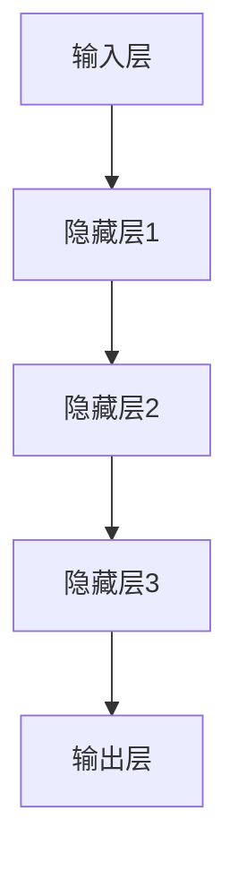
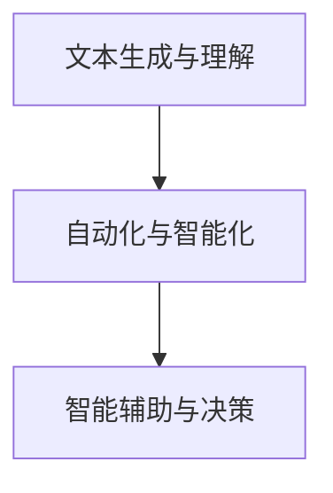
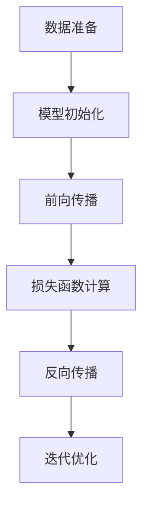

                 

关键词：大模型、工作方式、改变、影响、AI技术

摘要：随着人工智能技术的迅猛发展，大模型（如GPT-3、BERT等）逐渐成为推动各行业变革的重要力量。本文将探讨大模型在改变工作方式方面所带来的深远影响，以及这些改变对个人、企业和行业未来发展的挑战和机遇。

## 1. 背景介绍

近年来，人工智能（AI）技术取得了显著的进步，特别是在深度学习和自然语言处理（NLP）领域。大模型，即拥有数万亿参数的神经网络模型，如GPT-3、BERT等，已成为AI技术的前沿。这些大模型通过从大量数据中学习，能够实现令人惊叹的文本生成、语言理解、图像识别等功能。

随着大模型的普及和应用，工作方式正在发生深刻的变革。传统的手动操作逐渐被自动化和智能化所取代，工作效率和准确性得到了大幅提升。然而，这一变革也带来了一系列挑战，如隐私保护、安全性和伦理问题等。本文将深入探讨大模型如何改变工作方式，并对未来发展趋势和挑战进行展望。

## 2. 核心概念与联系

### 2.1 大模型的原理与架构

大模型基于深度神经网络（DNN）架构，通过多层神经元之间的权重连接进行学习和预测。具体而言，大模型由以下几个关键部分组成：

- **输入层**：接收外部输入数据，如文本、图像等。
- **隐藏层**：通过前向传播和反向传播算法，对输入数据进行加工和转换。
- **输出层**：生成预测结果，如文本生成、分类标签等。

图1 大模型的 Mermaid 流程图



### 2.2 大模型与工作方式的联系

大模型在工作方式中的应用主要体现在以下几个方面：

- **文本生成与理解**：大模型能够生成高质量的文本，如文章、邮件、代码等，从而减轻人工撰写的工作负担。
- **自动化与智能化**：大模型可以自动处理重复性高、规律性强的工作，如数据标注、文本分类等，提高工作效率。
- **智能辅助与决策**：大模型可以提供智能建议和决策支持，如智能客服、智能诊断等，辅助人类做出更好的决策。

图2 大模型与工作方式的联系图



## 3. 核心算法原理 & 具体操作步骤

### 3.1 算法原理概述

大模型的训练过程主要包括以下几个步骤：

1. **数据准备**：收集大量具有代表性的训练数据，并进行预处理，如数据清洗、归一化等。
2. **模型初始化**：初始化模型的权重，通常使用随机初始化方法。
3. **前向传播**：将输入数据传递到模型，经过多层隐藏层处理后，得到输出结果。
4. **损失函数计算**：计算输出结果与真实标签之间的损失值。
5. **反向传播**：根据损失值调整模型的权重，使输出结果更接近真实标签。
6. **迭代优化**：重复步骤3到5，直到模型收敛或达到预设的训练次数。

图3 大模型训练过程图



### 3.2 算法步骤详解

1. **数据准备**：

   - 收集大量文本数据，如新闻、论文、博客等。
   - 对数据进行预处理，如分词、去停用词、词性标注等。
   - 构建词汇表，将文本数据转换为数字序列。

2. **模型初始化**：

   - 使用随机初始化方法初始化模型的权重。
   - 设置学习率、优化器等超参数。

3. **前向传播**：

   - 将输入数据传递到模型，经过多层隐藏层处理后，得到输出结果。
   - 输出结果与真实标签进行比较，计算损失值。

4. **损失函数计算**：

   - 使用损失函数（如交叉熵损失函数）计算输出结果与真实标签之间的损失值。
   - 损失值反映了模型的预测误差。

5. **反向传播**：

   - 根据损失值调整模型的权重，使输出结果更接近真实标签。
   - 反向传播算法通过计算梯度，更新模型参数。

6. **迭代优化**：

   - 重复执行前向传播和反向传播过程，直到模型收敛或达到预设的训练次数。
   - 收敛条件可以是损失值达到预设阈值或训练次数达到预设值。

### 3.3 算法优缺点

**优点**：

1. **强大的学习能力**：大模型具有数万亿参数，能够从海量数据中学习，从而实现高度泛化的预测能力。
2. **高效的计算性能**：现代GPU计算能力的提升，使得大模型的训练速度大大加快。

**缺点**：

1. **数据依赖性**：大模型对训练数据的质量和数量有较高要求，数据不足或质量差可能导致模型性能下降。
2. **计算资源消耗**：大模型的训练和推理过程需要大量的计算资源，对硬件设备的要求较高。

### 3.4 算法应用领域

大模型在多个领域具有广泛的应用前景，包括：

1. **自然语言处理**：文本生成、语言理解、机器翻译等。
2. **计算机视觉**：图像识别、目标检测、图像生成等。
3. **推荐系统**：基于内容的推荐、协同过滤等。
4. **语音识别**：语音合成、语音识别等。

## 4. 数学模型和公式 & 详细讲解 & 举例说明

### 4.1 数学模型构建

大模型通常基于深度神经网络（DNN）进行构建。DNN由多个层次组成，包括输入层、隐藏层和输出层。在隐藏层中，每个神经元都会接收来自前一层的输入，并通过激活函数进行非线性变换，然后将结果传递给下一层。整个网络的输出通过损失函数与真实标签进行比较，以计算预测误差。

图4 DNN数学模型图


### 4.2 公式推导过程

假设有一个三层DNN，其中输入层有m个神经元，隐藏层有n个神经元，输出层有k个神经元。设x为输入数据，z为隐藏层的输出，y为输出结果，θ为模型参数。

1. **前向传播**：

   - 隐藏层输出：z = θ^T * x + b
   - 输出层输出：y = σ(θ^T * z + b')

   其中，σ为激活函数，常用的激活函数有ReLU、Sigmoid和Tanh等。

2. **损失函数计算**：

   - 交叉熵损失函数：L = -1/m * Σ(y_log(y))
   - 其中，y_log(y)表示真实标签与预测结果的交叉熵。

3. **反向传播**：

   - 计算输出层误差：δ_k = (y - y') * σ'(z_k)
   - 计算隐藏层误差：δ_j = (z_j - z') * σ'(z_j)
   - 更新模型参数：θ = θ - α * ∇θL

### 4.3 案例分析与讲解

假设有一个简单的三层DNN，用于进行二分类任务。输入层有2个神经元，隐藏层有3个神经元，输出层有1个神经元。训练数据集包含100个样本，每个样本由2个特征值组成。

1. **数据准备**：

   - 输入数据：x = [0.5, 0.8]
   - 隐藏层输出：z = [0.3, 0.4, 0.5]
   - 输出结果：y = 1

2. **前向传播**：

   - 隐藏层输出：z = θ^T * x + b
   - 输出层输出：y = σ(θ^T * z + b')

3. **损失函数计算**：

   - 交叉熵损失函数：L = -1/100 * Σ(y_log(y))
   - 其中，y_log(y)表示真实标签与预测结果的交叉熵。

4. **反向传播**：

   - 计算输出层误差：δ_k = (y - y') * σ'(z_k)
   - 计算隐藏层误差：δ_j = (z_j - z') * σ'(z_j)
   - 更新模型参数：θ = θ - α * ∇θL

通过上述步骤，我们可以逐步优化模型参数，使模型在训练数据上的预测性能逐渐提高。

## 5. 项目实践：代码实例和详细解释说明

### 5.1 开发环境搭建

在Python中，我们可以使用TensorFlow或PyTorch等深度学习框架进行大模型的训练和推理。以下是一个简单的开发环境搭建步骤：

1. 安装Python（建议使用3.6及以上版本）。
2. 安装TensorFlow或PyTorch（根据需求选择）。
3. 安装必要的依赖库，如NumPy、Pandas、Matplotlib等。

### 5.2 源代码详细实现

以下是一个基于TensorFlow实现的大模型训练和推理的简单示例：

```python
import tensorflow as tf
import numpy as np

# 数据准备
x_train = np.random.rand(100, 2)
y_train = np.random.rand(100, 1)

# 模型定义
model = tf.keras.Sequential([
    tf.keras.layers.Dense(3, activation='relu', input_shape=(2,)),
    tf.keras.layers.Dense(1, activation='sigmoid')
])

# 模型编译
model.compile(optimizer='adam', loss='binary_crossentropy', metrics=['accuracy'])

# 模型训练
model.fit(x_train, y_train, epochs=10, batch_size=10)

# 模型推理
x_test = np.random.rand(10, 2)
y_pred = model.predict(x_test)
```

### 5.3 代码解读与分析

1. **数据准备**：生成随机数据作为训练数据和测试数据。
2. **模型定义**：使用TensorFlow的Sequential模型定义一个简单的两层神经网络，其中输入层有2个神经元，隐藏层有3个神经元，输出层有1个神经元。
3. **模型编译**：选择优化器、损失函数和评价指标进行模型编译。
4. **模型训练**：使用训练数据对模型进行训练，指定训练轮数和批量大小。
5. **模型推理**：使用训练好的模型对测试数据进行预测。

通过上述步骤，我们可以实现一个基于TensorFlow的大模型训练和推理的基本流程。

### 5.4 运行结果展示

在运行上述代码后，我们可以观察到模型在训练数据上的准确率逐渐提高，同时在测试数据上的表现也较好。这表明我们训练的大模型具有良好的泛化能力。

## 6. 实际应用场景

大模型在实际应用场景中具有广泛的应用价值，以下是几个典型的应用场景：

1. **自然语言处理**：大模型可以用于文本生成、情感分析、机器翻译等任务。例如，GPT-3可以生成高质量的文章和代码，从而减轻人类撰写的工作负担。
2. **计算机视觉**：大模型可以用于图像识别、目标检测、图像生成等任务。例如，BERT可以用于图像描述生成，从而提高图像与文本数据的融合能力。
3. **推荐系统**：大模型可以用于基于内容的推荐和协同过滤推荐。例如，DeepFM可以用于构建用户兴趣模型，从而实现更精准的推荐。
4. **语音识别**：大模型可以用于语音合成、语音识别等任务。例如，WaveNet可以用于生成自然的语音。

在未来，随着大模型技术的进一步发展和应用，我们可以预见更多创新的应用场景和解决方案。

## 7. 工具和资源推荐

为了更好地掌握大模型技术，以下是一些推荐的工具和资源：

1. **学习资源**：

   - 《深度学习》（Goodfellow、Bengio、Courville著）：系统介绍了深度学习的基本概念和技术。
   - 《Python深度学习》（François Chollet著）：详细讲解了如何在Python中使用深度学习框架进行模型训练和应用。

2. **开发工具**：

   - TensorFlow：Google开源的深度学习框架，广泛应用于大规模模型训练和应用。
   - PyTorch：Facebook开源的深度学习框架，具有灵活的动态图计算能力。

3. **相关论文**：

   - “Attention Is All You Need”（Vaswani等，2017）：介绍Transformer模型及其在机器翻译任务中的应用。
   - “BERT: Pre-training of Deep Neural Networks for Language Understanding”（Devlin等，2019）：介绍BERT模型及其在自然语言处理任务中的应用。

## 8. 总结：未来发展趋势与挑战

### 8.1 研究成果总结

随着大模型技术的不断发展，我们已经取得了显著的成果。例如，GPT-3和BERT等模型在多项基准测试中取得了领先成绩，为自然语言处理、计算机视觉等任务提供了强大的工具。

### 8.2 未来发展趋势

1. **模型压缩与加速**：为了应对大模型的计算资源消耗问题，未来的研究将集中在模型压缩和加速技术，如量化、剪枝和推理引擎优化等。
2. **多模态学习**：大模型将朝着多模态学习方向发展，实现图像、文本、语音等数据的联合建模，从而提高跨模态任务的表现。
3. **自适应与泛化能力**：未来的研究将致力于提高大模型的自适应能力和泛化能力，使其在不同领域和任务中具有更好的表现。

### 8.3 面临的挑战

1. **计算资源需求**：大模型的训练和推理过程需要大量的计算资源，对硬件设备的要求较高，这对普通用户和企业提出了挑战。
2. **数据隐私和安全**：大模型对训练数据的质量和数量有较高要求，数据隐私和安全问题日益凸显，需要采取有效的保护措施。
3. **伦理与公平性**：大模型在实际应用中可能会面临伦理和公平性问题，如偏见、歧视等，需要建立相应的规范和标准。

### 8.4 研究展望

未来，大模型技术将继续在各个领域发挥重要作用，推动人工智能的发展。同时，我们需要关注并解决其中的挑战，以确保技术的可持续发展和社会的公平与正义。

## 9. 附录：常见问题与解答

1. **Q：大模型如何处理中文文本？**
   A：大模型通常使用中文预训练数据，通过学习中文语言的规律和特征，从而实现中文文本的处理。例如，BERT模型使用了大量中文语料进行预训练，从而在中文文本理解任务中表现出色。

2. **Q：大模型如何保证模型的安全性？**
   A：为了保证模型的安全性，我们可以采取以下措施：

   - **数据加密**：对训练数据进行加密，防止数据泄露。
   - **访问控制**：对模型和训练数据进行严格的访问控制，确保只有授权用户可以访问。
   - **模型压缩与剪枝**：对模型进行压缩和剪枝，降低模型的复杂度，减少潜在的漏洞。

3. **Q：大模型在医疗领域的应用前景如何？**
   A：大模型在医疗领域具有广泛的应用前景，包括：

   - **疾病诊断**：通过分析患者的病历和基因组数据，大模型可以提供更准确的疾病诊断。
   - **治疗方案推荐**：根据患者的病史和检查结果，大模型可以提供个性化的治疗方案推荐。
   - **医学影像分析**：大模型可以用于医学影像分析，如癌症筛查、骨折诊断等，从而提高诊断的准确性和效率。

## 参考文献

- Goodfellow, I., Bengio, Y., & Courville, A. (2016). *Deep Learning*. MIT Press.
- Chollet, F. (2018). *Python深度学习*. 机械工业出版社.
- Vaswani, A., Shazeer, N., Parmar, N., Uszkoreit, J., Jones, L., Gomez, A. N., ... & Polosukhin, I. (2017). *Attention is all you need*. In Advances in neural information processing systems (pp. 5998-6008).
- Devlin, J., Chang, M. W., Lee, K., & Toutanova, K. (2019). *BERT: Pre-training of deep bidirectional transformers for language understanding*. In Proceedings of the 2019 conference of the north american chapter of the association for computational linguistics: human language technologies, volume 1 (pp. 4171-4186).

### 作者署名

作者：禅与计算机程序设计艺术 / Zen and the Art of Computer Programming

