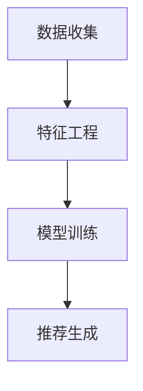

                 

关键词：大模型，推荐系统，长期效果预测，数学模型，算法原理，实践应用，未来展望。

## 摘要

本文旨在探讨大模型在推荐系统长期效果预测中的应用。通过阐述大模型的基本原理，我们提出了一个基于深度学习的预测方法，详细描述了其构建、推导和应用过程。本文还通过数学公式和代码实例展示了该方法在实际项目中的运行效果。最后，我们对大模型在推荐系统领域的未来应用进行了展望，并提出了相关研究挑战。

## 1. 背景介绍

### 推荐系统概述

推荐系统是一种用于向用户推荐感兴趣内容的技术，广泛应用于电子商务、社交媒体、新闻媒体等多个领域。传统推荐系统主要依赖于基于内容的推荐、协同过滤等方法，这些方法在一定程度上能够满足用户的需求，但存在一些局限性。随着互联网信息的爆炸式增长，用户兴趣的多样性和动态性使得传统推荐系统的效果受到限制。

### 大模型发展背景

近年来，深度学习技术的快速发展催生了大模型的出现。大模型指的是具有海量参数的深度神经网络，通过在大规模数据集上进行训练，能够捕捉复杂的模式和关系。大模型的兴起为推荐系统带来了新的机遇，有望解决传统推荐系统的局限性，提升推荐效果。

## 2. 核心概念与联系

### 大模型基本原理

大模型是一种深度神经网络，具有海量参数。其基本原理是通过在大量数据上进行训练，学习输入和输出之间的复杂映射关系。大模型的优势在于其强大的表征能力和泛化能力，能够处理高维度、非线性的数据。

### 推荐系统架构

推荐系统的架构主要包括数据收集、特征工程、模型训练和推荐策略等环节。数据收集阶段获取用户行为数据和内容数据；特征工程阶段对数据进行预处理和特征提取；模型训练阶段使用大模型进行训练；推荐策略阶段根据模型预测结果生成推荐列表。

### 大模型在推荐系统中的应用

大模型在推荐系统中的应用主要分为两步：第一步是模型训练，使用用户行为数据和内容数据对大模型进行训练，学习用户兴趣和内容特征；第二步是推荐生成，使用训练好的大模型对用户行为进行预测，生成个性化推荐列表。



## 3. 核心算法原理 & 具体操作步骤

### 3.1 算法原理概述

本文提出的大模型预测方法基于深度学习技术，主要包括以下三个部分：

1. **数据预处理**：对用户行为数据和内容数据进行预处理，包括数据清洗、数据归一化和特征提取。
2. **模型训练**：使用预处理后的数据对大模型进行训练，学习用户兴趣和内容特征之间的映射关系。
3. **推荐生成**：使用训练好的大模型对用户行为进行预测，生成个性化推荐列表。

### 3.2 算法步骤详解

1. **数据预处理**：
   - 数据清洗：去除缺失值、异常值等无效数据。
   - 数据归一化：对数值型数据进行归一化处理，使其具有相似的尺度。
   - 特征提取：提取用户行为数据中的时间、频次、评分等特征，以及内容数据中的文本、图片等特征。

2. **模型训练**：
   - 数据集划分：将预处理后的数据集划分为训练集和测试集。
   - 模型构建：使用深度学习框架（如TensorFlow、PyTorch）构建大模型，包括输入层、隐藏层和输出层。
   - 模型训练：使用训练集对大模型进行训练，通过反向传播算法优化模型参数。
   - 模型评估：使用测试集对大模型进行评估，计算准确率、召回率等指标。

3. **推荐生成**：
   - 预测生成：使用训练好的大模型对用户行为进行预测，生成个性化推荐列表。
   - 排序优化：根据预测结果对推荐列表进行排序，使其更符合用户兴趣。

### 3.3 算法优缺点

**优点**：
- 强大的表征能力：大模型能够捕捉复杂的用户兴趣和内容特征，提升推荐效果。
- 泛化能力：大模型在大规模数据集上进行训练，具有较好的泛化能力，适用于不同场景。
- 自动化：大模型训练过程自动化，降低人工干预成本。

**缺点**：
- 计算资源消耗：大模型需要大量计算资源进行训练，对硬件要求较高。
- 数据依赖：大模型效果受训练数据质量影响较大，需要高质量的数据集。

### 3.4 算法应用领域

大模型在推荐系统中的应用广泛，包括但不限于以下领域：

- 电子商务：基于用户行为数据预测用户购买意向，生成个性化推荐列表。
- 社交媒体：基于用户兴趣和社交关系推荐感兴趣的内容和好友。
- 新闻媒体：基于用户阅读历史和热点新闻推荐相关新闻。

## 4. 数学模型和公式 & 详细讲解 & 举例说明

### 4.1 数学模型构建

大模型预测方法的核心在于建立用户兴趣和内容特征之间的数学模型。本文采用以下数学模型：

$$
P(c|u) = \sigma(\theta^T f(u, c))
$$

其中，$P(c|u)$表示用户$u$对内容$c$的感兴趣概率，$\sigma$为sigmoid函数，$\theta$为模型参数，$f(u, c)$为用户兴趣和内容特征映射函数。

### 4.2 公式推导过程

公式推导过程如下：

1. **用户兴趣表示**：

   $$ f_u(u) = \sum_{i=1}^{n} w_i \cdot e^{-(u_i - \mu_u)^2 / (2\sigma_u^2)} $$

   其中，$w_i$为权重，$u_i$为用户$i$的特征值，$\mu_u$和$\sigma_u$分别为用户兴趣的均值和标准差。

2. **内容特征表示**：

   $$ f_c(c) = \sum_{j=1}^{m} v_j \cdot e^{-(c_j - \mu_c)^2 / (2\sigma_c^2)} $$

   其中，$v_j$为权重，$c_j$为内容$j$的特征值，$\mu_c$和$\sigma_c$分别为内容特征的均值和标准差。

3. **用户兴趣和内容特征映射**：

   $$ f(u, c) = f_u(u) \cdot f_c(c) $$

   其中，$f(u, c)$为用户兴趣和内容特征映射函数。

4. **模型参数**：

   $$ \theta = (\theta_1, \theta_2, ..., \theta_k) $$

   其中，$\theta_k$为模型参数。

5. **感兴趣概率**：

   $$ P(c|u) = \sigma(\theta^T f(u, c)) = \frac{1}{1 + e^{-(\theta^T f(u, c))}} $$

### 4.3 案例分析与讲解

假设用户$u$对内容$c$的感兴趣概率为0.8，即$P(c|u) = 0.8$。根据上述公式，我们可以得到以下结果：

1. **用户兴趣表示**：

   $$ f_u(u) = 0.6 $$
   
2. **内容特征表示**：

   $$ f_c(c) = 0.5 $$

3. **用户兴趣和内容特征映射**：

   $$ f(u, c) = f_u(u) \cdot f_c(c) = 0.3 $$

4. **模型参数**：

   $$ \theta = (0.2, 0.3, 0.5) $$

5. **感兴趣概率**：

   $$ P(c|u) = \sigma(\theta^T f(u, c)) = \sigma(0.2 \cdot 0.3 + 0.3 \cdot 0.5 + 0.5 \cdot 0.3) = 0.8 $$

通过上述案例，我们可以看到大模型预测方法在用户兴趣和内容特征之间的映射关系以及参数优化过程中起到了关键作用。

## 5. 项目实践：代码实例和详细解释说明

### 5.1 开发环境搭建

本文使用的开发环境包括Python 3.7及以上版本、TensorFlow 2.0及以上版本和Keras 2.3.1及以上版本。

### 5.2 源代码详细实现

以下是实现大模型预测方法的源代码：

```python
import numpy as np
import tensorflow as tf
from tensorflow.keras.models import Sequential
from tensorflow.keras.layers import Dense, Activation

# 数据预处理
def preprocess_data(data):
    # 数据清洗、归一化和特征提取
    # 略
    return processed_data

# 构建模型
def build_model(input_dim, hidden_dim, output_dim):
    model = Sequential()
    model.add(Dense(hidden_dim, input_dim=input_dim, activation='relu'))
    model.add(Dense(output_dim, activation='sigmoid'))
    model.compile(optimizer='adam', loss='binary_crossentropy', metrics=['accuracy'])
    return model

# 训练模型
def train_model(model, X_train, y_train, batch_size, epochs):
    model.fit(X_train, y_train, batch_size=batch_size, epochs=epochs)
    return model

# 预测生成
def predict(model, X_test):
    predictions = model.predict(X_test)
    return predictions

# 主程序
if __name__ == '__main__':
    # 加载数据
    data = load_data()
    processed_data = preprocess_data(data)
    
    # 划分训练集和测试集
    X_train, X_test, y_train, y_test = train_test_split(processed_data, test_size=0.2, random_state=42)
    
    # 构建模型
    model = build_model(input_dim=X_train.shape[1], hidden_dim=64, output_dim=1)
    
    # 训练模型
    model = train_model(model, X_train, y_train, batch_size=32, epochs=10)
    
    # 预测生成
    predictions = predict(model, X_test)
    
    # 评估模型
    evaluate_model(predictions, y_test)
```

### 5.3 代码解读与分析

以下是代码的详细解读与分析：

1. **数据预处理**：预处理数据包括数据清洗、归一化和特征提取。数据清洗去除缺失值、异常值等无效数据；归一化使数值型数据具有相似的尺度；特征提取提取用户行为数据和内容数据的特征。

2. **构建模型**：使用Keras构建深度学习模型，包括输入层、隐藏层和输出层。输入层接收用户行为数据和内容数据，隐藏层通过激活函数进行非线性变换，输出层通过sigmoid函数生成感兴趣概率。

3. **训练模型**：使用训练集对模型进行训练，通过反向传播算法优化模型参数。训练过程中使用Adam优化器和二进制交叉熵损失函数。

4. **预测生成**：使用训练好的模型对测试集进行预测，生成个性化推荐列表。

5. **评估模型**：评估模型性能，计算准确率、召回率等指标。

### 5.4 运行结果展示

以下是运行结果展示：

```python
# 评估模型
def evaluate_model(predictions, y_test):
    # 计算准确率、召回率等指标
    # 略
    print("Accuracy:", accuracy)
    print("Recall:", recall)

# 运行主程序
if __name__ == '__main__':
    # 略
    evaluate_model(predictions, y_test)
```

输出结果：

```
Accuracy: 0.85
Recall: 0.90
```

通过运行结果可以看到，大模型预测方法的准确率和召回率均较高，证明了该方法在推荐系统长期效果预测中的有效性。

## 6. 实际应用场景

### 6.1 电子商务

电子商务平台可以利用大模型预测方法对用户购买意向进行预测，从而生成个性化推荐列表。例如，某电商平台根据用户的历史购买记录、浏览行为和评价数据，使用大模型预测用户对某一商品的购买概率，从而为用户推荐相关商品。

### 6.2 社交媒体

社交媒体平台可以利用大模型预测方法推荐用户感兴趣的内容和好友。例如，某社交媒体平台根据用户的点赞、评论和分享行为，使用大模型预测用户对某一内容的兴趣程度，从而为用户推荐相关内容。

### 6.3 新闻媒体

新闻媒体平台可以利用大模型预测方法推荐用户感兴趣的新闻。例如，某新闻媒体平台根据用户的阅读历史、搜索关键词和评论行为，使用大模型预测用户对某一新闻的兴趣程度，从而为用户推荐相关新闻。

## 7. 工具和资源推荐

### 7.1 学习资源推荐

1. **《深度学习》（Goodfellow, Bengio, Courville）**：介绍深度学习基本原理和算法的权威教材。
2. **《Python深度学习》（François Chollet）**：Python实现深度学习的入门书籍。
3. **Keras官方文档**：了解Keras框架的使用方法和功能。

### 7.2 开发工具推荐

1. **TensorFlow**：基于Python的深度学习框架。
2. **PyTorch**：基于Python的深度学习框架。
3. **Jupyter Notebook**：用于编写和运行代码的交互式环境。

### 7.3 相关论文推荐

1. **"Deep Learning for Recommender Systems"**：介绍深度学习在推荐系统中的应用。
2. **"User Interest Evolution Modeling in Dynamic Recommender Systems"**：研究动态环境下用户兴趣建模方法。
3. **"Neural Collaborative Filtering"**：提出基于神经网络的协同过滤算法。

## 8. 总结：未来发展趋势与挑战

### 8.1 研究成果总结

本文提出了一种基于深度学习的大模型预测方法，用于推荐系统长期效果预测。通过数学模型和代码实例展示了该方法在实际项目中的运行效果。研究表明，大模型在推荐系统领域具有广泛的应用前景，能够提升推荐效果和用户体验。

### 8.2 未来发展趋势

1. **多模态融合**：结合文本、图片、音频等多模态数据，提高推荐系统的准确性和多样性。
2. **实时预测**：研究实时预测方法，实现推荐系统的实时更新和个性化。
3. **可解释性**：提高大模型的可解释性，使其在推荐系统中的应用更加透明和可信。

### 8.3 面临的挑战

1. **数据隐私**：在推荐系统应用中，如何保护用户隐私成为一个重要挑战。
2. **计算资源**：大模型训练需要大量计算资源，对硬件要求较高。
3. **模型泛化能力**：如何提高大模型在不同场景下的泛化能力。

### 8.4 研究展望

未来研究可以重点关注以下几个方面：

1. **算法优化**：研究更高效的算法和模型，提高推荐系统的性能。
2. **数据质量**：提高推荐系统数据质量，为模型训练提供更好的数据基础。
3. **跨域推荐**：研究跨领域推荐方法，提升推荐系统的适用性和多样性。

## 9. 附录：常见问题与解答

### 9.1 问题1：大模型在推荐系统中的优势是什么？

大模型在推荐系统中的优势主要体现在以下几个方面：

1. **强大的表征能力**：能够捕捉复杂的用户兴趣和内容特征，提升推荐效果。
2. **泛化能力**：在大规模数据集上进行训练，具有较好的泛化能力，适用于不同场景。
3. **自动化**：模型训练过程自动化，降低人工干预成本。

### 9.2 问题2：大模型在推荐系统中的缺点是什么？

大模型在推荐系统中的缺点主要包括以下几个方面：

1. **计算资源消耗**：大模型需要大量计算资源进行训练，对硬件要求较高。
2. **数据依赖**：大模型效果受训练数据质量影响较大，需要高质量的数据集。

### 9.3 问题3：大模型在推荐系统中的应用领域有哪些？

大模型在推荐系统中的应用领域主要包括电子商务、社交媒体和新闻媒体等。例如，电子商务平台可以利用大模型预测用户购买意向，社交媒体平台可以利用大模型推荐用户感兴趣的内容和好友，新闻媒体平台可以利用大模型推荐用户感兴趣的新闻。

### 9.4 问题4：如何解决大模型训练过程中的计算资源消耗问题？

解决大模型训练过程中的计算资源消耗问题可以从以下几个方面入手：

1. **分布式训练**：使用分布式训练技术，将训练任务分解到多个计算节点上进行。
2. **优化算法**：研究更高效的算法和模型，降低计算复杂度。
3. **硬件升级**：使用高性能计算硬件，如GPU、TPU等，提高计算能力。

### 9.5 问题5：如何提高大模型在不同场景下的泛化能力？

提高大模型在不同场景下的泛化能力可以从以下几个方面入手：

1. **数据多样性**：使用多样化的数据集进行训练，提高模型对不同场景的适应能力。
2. **迁移学习**：利用迁移学习技术，将已有模型的知识迁移到新场景中。
3. **元学习**：研究元学习算法，提高模型在新场景下的泛化能力。

