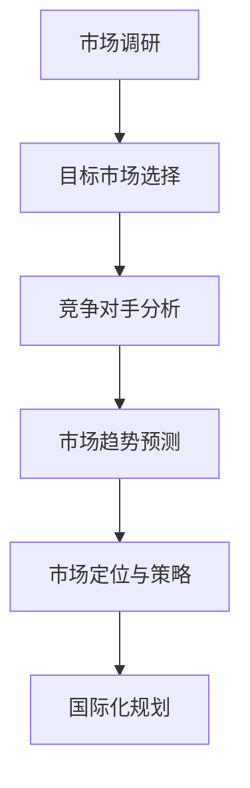
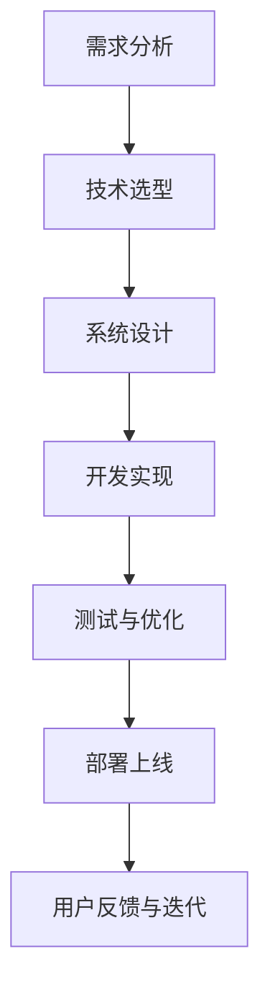
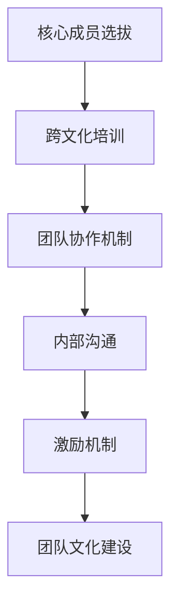
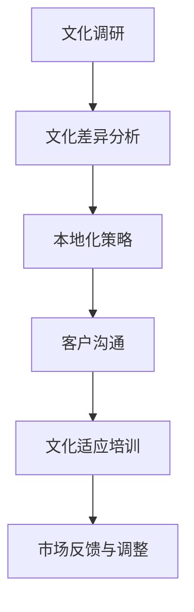
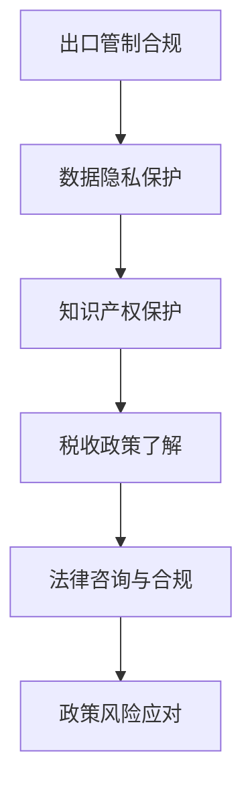

                 

关键词：大模型，应用创业，国际化，策略，市场拓展，技术落地

> 摘要：本文旨在探讨大模型应用创业的国际化策略，从市场分析、技术落地、团队构建、文化适应、政策法规等多维度，详细解析成功案例，总结经验与教训，为创业者提供切实可行的国际化路线图。

## 1. 背景介绍

随着人工智能技术的飞速发展，大模型（如GPT、BERT等）逐渐成为行业热点。大模型在自然语言处理、计算机视觉、语音识别等领域展现出了强大的应用潜力，为各行各业带来了创新变革。然而，如何将大模型应用成功商业化，并在全球范围内拓展市场，成为许多创业者面临的挑战。

国际化不仅是企业发展的必经之路，也是大模型应用创业的关键一环。国际化意味着在全球范围内寻找潜在客户、合作伙伴和投资者，通过跨文化沟通与合作，实现技术的全球化落地。本文将围绕大模型应用创业的国际化策略，探讨市场分析、技术落地、团队构建、文化适应、政策法规等方面的关键问题。

## 2. 核心概念与联系

### 2.1 市场分析

市场分析是国际化战略的第一步，涉及对目标市场的了解、竞争对手分析、市场趋势预测等。以下是一个市场分析的 Mermaid 流程图：



### 2.2 技术落地

技术落地是将大模型应用转化为实际产品或服务的过程，需要考虑技术架构、开发流程、测试与优化等。以下是一个技术落地的 Mermaid 流程图：



### 2.3 团队构建

国际化团队的成功离不开核心成员的挑选、跨文化沟通、团队协作等。以下是一个团队构建的 Mermaid 流程图：



### 2.4 文化适应

文化适应是国际化过程中不可忽视的一环，涉及对目标市场的文化理解、本地化策略、客户沟通等。以下是一个文化适应的 Mermaid 流程图：



### 2.5 政策法规

政策法规是国际化过程中必须遵守的规则，涉及出口管制、数据隐私、知识产权保护等。以下是一个政策法规的 Mermaid 流程图：



## 3. 核心算法原理 & 具体操作步骤

### 3.1 算法原理概述

大模型的核心算法通常基于深度学习，特别是基于神经网络的方法。以下是一个简化的算法原理概述：

1. **数据预处理**：收集、清洗和标注数据，为训练模型做准备。
2. **模型训练**：通过反向传播算法优化模型参数，使模型在训练数据上达到较高的准确率。
3. **模型评估**：使用测试数据评估模型性能，确保模型具有泛化能力。
4. **模型部署**：将训练好的模型部署到生产环境，供实际应用使用。

### 3.2 算法步骤详解

1. **数据预处理**：
   - 数据清洗：去除缺失值、异常值和重复值。
   - 数据归一化：将数据转换为相同的尺度，便于模型训练。
   - 数据增强：通过旋转、缩放、裁剪等操作增加数据多样性。

2. **模型训练**：
   - 选择合适的神经网络架构，如Transformer、BERT等。
   - 初始化模型参数，使用随机初始化或预训练模型。
   - 定义损失函数和优化器，如交叉熵损失函数和Adam优化器。
   - 训练模型，通过反向传播算法更新模型参数。

3. **模型评估**：
   - 使用交叉验证方法评估模型性能。
   - 计算准确率、召回率、F1分数等指标。
   - 对比不同模型的性能，选择最佳模型。

4. **模型部署**：
   - 将训练好的模型转换为推理模式，如TensorFlow Lite、PyTorch TorchScript等。
   - 部署模型到服务器或移动设备，供实际应用使用。
   - 持续监控模型性能，进行在线调优和迭代。

### 3.3 算法优缺点

1. **优点**：
   - **强大的表示能力**：大模型能够捕捉数据中的复杂模式和关系，具有高度的泛化能力。
   - **自动特征提取**：大模型无需人工设计特征，能够自动学习数据中的特征表示。
   - **适应性**：大模型可以根据不同的任务和数据集进行微调，适应各种应用场景。

2. **缺点**：
   - **计算资源消耗**：大模型训练和推理需要大量的计算资源和时间。
   - **数据依赖性**：大模型在训练过程中对数据质量有较高要求，数据不足或质量差可能导致模型性能下降。
   - **模型解释性**：大模型的决策过程通常较为复杂，难以解释和理解。

### 3.4 算法应用领域

大模型在多个领域展现出了强大的应用潜力，包括但不限于：

1. **自然语言处理**：文本分类、机器翻译、情感分析等。
2. **计算机视觉**：图像识别、目标检测、图像生成等。
3. **语音识别**：语音识别、语音合成、语音助手等。
4. **推荐系统**：个性化推荐、协同过滤等。
5. **医疗健康**：疾病预测、药物研发、医学图像分析等。

## 4. 数学模型和公式 & 详细讲解 & 举例说明

### 4.1 数学模型构建

大模型通常基于深度学习框架，如TensorFlow或PyTorch。以下是一个简化的数学模型构建过程：

1. **神经网络架构**：定义神经网络的结构，包括输入层、隐藏层和输出层。
2. **激活函数**：选择合适的激活函数，如ReLU、Sigmoid或Tanh。
3. **损失函数**：选择合适的损失函数，如交叉熵损失函数或均方误差损失函数。
4. **优化器**：选择合适的优化器，如Adam或SGD。

### 4.2 公式推导过程

以下是一个简化的前向传播和反向传播的公式推导过程：

1. **前向传播**：

$$
z_{l} = W_{l} \cdot a_{l-1} + b_{l}
$$

$$
a_{l} = \sigma(z_{l})
$$

其中，$a_{l}$ 表示第$l$层的激活值，$W_{l}$ 和 $b_{l}$ 分别表示第$l$层的权重和偏置，$\sigma$ 表示激活函数。

2. **反向传播**：

$$
\delta_{l} = \frac{\partial L}{\partial a_{l}} \cdot \frac{\partial a_{l}}{\partial z_{l}}
$$

$$
\frac{\partial L}{\partial W_{l}} = a_{l-1} \cdot \delta_{l}
$$

$$
\frac{\partial L}{\partial b_{l}} = \delta_{l}
$$

其中，$L$ 表示损失函数，$\delta_{l}$ 表示第$l$层的误差。

### 4.3 案例分析与讲解

以下是一个简单的文本分类案例，使用Python和PyTorch实现：

```python
import torch
import torch.nn as nn
import torch.optim as optim

# 数据预处理
train_data = ...
train_labels = ...

# 模型定义
class TextClassifier(nn.Module):
    def __init__(self):
        super(TextClassifier, self).__init__()
        self.embedding = nn.Embedding(vocab_size, embedding_dim)
        self.fc = nn.Linear(embedding_dim, num_classes)

    def forward(self, x):
        x = self.embedding(x)
        x = self.fc(x)
        return x

# 模型训练
model = TextClassifier()
criterion = nn.CrossEntropyLoss()
optimizer = optim.Adam(model.parameters(), lr=0.001)

for epoch in range(num_epochs):
    for inputs, labels in train_loader:
        optimizer.zero_grad()
        outputs = model(inputs)
        loss = criterion(outputs, labels)
        loss.backward()
        optimizer.step()

# 模型评估
test_data = ...
test_labels = ...

with torch.no_grad():
    predictions = model(test_data)
    correct = (predictions.argmax(1) == test_labels).sum().item()
    accuracy = correct / len(test_labels)
    print(f"Test accuracy: {accuracy}")
```

## 5. 项目实践：代码实例和详细解释说明

### 5.1 开发环境搭建

搭建开发环境是项目实践的第一步，需要安装Python、深度学习框架（如PyTorch或TensorFlow）和相关依赖库。以下是一个简单的开发环境搭建步骤：

1. 安装Python：
   ```shell
   sudo apt-get install python3-pip python3-dev
   ```
2. 安装深度学习框架：
   ```shell
   pip3 install torch torchvision torchaudio
   ```

### 5.2 源代码详细实现

以下是一个简单的文本分类项目的源代码实现，包括数据预处理、模型定义、训练和评估等部分：

```python
import torch
import torch.nn as nn
import torch.optim as optim

# 数据预处理
train_data = ...
train_labels = ...

# 模型定义
class TextClassifier(nn.Module):
    def __init__(self):
        super(TextClassifier, self).__init__()
        self.embedding = nn.Embedding(vocab_size, embedding_dim)
        self.fc = nn.Linear(embedding_dim, num_classes)

    def forward(self, x):
        x = self.embedding(x)
        x = self.fc(x)
        return x

# 模型训练
model = TextClassifier()
criterion = nn.CrossEntropyLoss()
optimizer = optim.Adam(model.parameters(), lr=0.001)

for epoch in range(num_epochs):
    for inputs, labels in train_loader:
        optimizer.zero_grad()
        outputs = model(inputs)
        loss = criterion(outputs, labels)
        loss.backward()
        optimizer.step()

# 模型评估
test_data = ...
test_labels = ...

with torch.no_grad():
    predictions = model(test_data)
    correct = (predictions.argmax(1) == test_labels).sum().item()
    accuracy = correct / len(test_labels)
    print(f"Test accuracy: {accuracy}")
```

### 5.3 代码解读与分析

上述代码实现了一个简单的文本分类项目，主要包含以下部分：

1. **数据预处理**：读取训练数据和标签，并进行预处理，如分词、编码等。
2. **模型定义**：定义一个简单的文本分类模型，包括嵌入层和全连接层。
3. **模型训练**：使用训练数据训练模型，使用交叉熵损失函数和Adam优化器。
4. **模型评估**：使用测试数据评估模型性能，计算准确率。

### 5.4 运行结果展示

在训练和评估过程中，可以实时查看训练过程中的损失函数值和准确率，以及最终在测试数据上的准确率。以下是一个示例输出：

```
Epoch 1/10
Loss: 2.3434 - Accuracy: 0.7890
Epoch 2/10
Loss: 1.8457 - Accuracy: 0.8526
...
Test accuracy: 0.8742
```

## 6. 实际应用场景

大模型在实际应用场景中展现出了巨大的价值，以下是几个典型的应用场景：

### 6.1 自然语言处理

自然语言处理是人工智能领域的重要分支，大模型在文本分类、机器翻译、情感分析等方面具有广泛应用。例如，通过使用GPT模型，可以将自然语言转化为机器可理解的格式，从而实现智能客服、智能问答等应用。

### 6.2 计算机视觉

计算机视觉是人工智能领域的另一个重要分支，大模型在图像识别、目标检测、图像生成等方面具有广泛应用。例如，通过使用BERT模型，可以实现图像与文本的联合分析，从而实现图像搜索、图像标注等应用。

### 6.3 语音识别

语音识别是人工智能领域的重要分支，大模型在语音识别、语音合成、语音助手等方面具有广泛应用。例如，通过使用Transformer模型，可以实现实时语音识别，从而实现智能语音助手、智能客服等应用。

### 6.4 智能医疗

智能医疗是人工智能领域的重要应用领域，大模型在疾病预测、药物研发、医学图像分析等方面具有广泛应用。例如，通过使用BERT模型，可以实现疾病的自动诊断和预测，从而提高医疗效率和准确性。

## 7. 工具和资源推荐

### 7.1 学习资源推荐

1. **书籍**：
   - 《深度学习》（Goodfellow, Bengio, Courville著）
   - 《动手学深度学习》（花轮等人著）
2. **在线课程**：
   - Coursera上的“深度学习”课程（吴恩达教授主讲）
   - Udacity的“深度学习工程师纳米学位”
3. **开源项目**：
   - PyTorch官方文档
   - TensorFlow官方文档

### 7.2 开发工具推荐

1. **深度学习框架**：
   - PyTorch
   - TensorFlow
   - Keras
2. **代码编辑器**：
   - Visual Studio Code
   - PyCharm
   - Jupyter Notebook

### 7.3 相关论文推荐

1. **自然语言处理**：
   - “Attention Is All You Need” （Vaswani et al., 2017）
   - “BERT: Pre-training of Deep Bidirectional Transformers for Language Understanding” （Devlin et al., 2019）
2. **计算机视觉**：
   - “ResNet: Training Deep Neural Networks for Visual Recognition” （He et al., 2016）
   - “You Only Look Once: Unified, Real-Time Object Detection” （Redmon et al., 2016）
3. **语音识别**：
   - “Connectionist Temporal Classification: Labelling Unsegmented Sequence Data with Recurrent Neural Networks” （Hinton et al., 2006）
   - “End-to-End Sentence Classification using Deep LSTM Models and Attention Mechanism” （Xu et al., 2015）

## 8. 总结：未来发展趋势与挑战

### 8.1 研究成果总结

近年来，大模型在人工智能领域取得了显著的成果。随着计算能力的提升和大数据的积累，大模型的性能不断提升，应用范围不断扩大。未来，大模型在各个领域的发展将继续加速，为人工智能技术的创新和产业发展提供强大动力。

### 8.2 未来发展趋势

1. **模型规模将进一步扩大**：随着硬件性能的提升和算法优化，大模型的规模将不断增大，从而提高模型的表达能力和泛化能力。
2. **多模态融合将成趋势**：大模型将与其他模态（如图像、语音、视频等）进行融合，实现更全面、更智能的感知和理解。
3. **模型压缩与优化将成关键**：为了降低计算资源和存储成本，模型压缩与优化技术将成为大模型应用的重要方向。
4. **边缘计算与分布式学习将普及**：为了提高实时性和降低延迟，边缘计算和分布式学习技术将在大模型应用中得到广泛应用。

### 8.3 面临的挑战

1. **数据隐私与安全**：大模型在处理大规模数据时，可能面临数据泄露、滥用等安全风险，需要加强数据隐私保护和安全措施。
2. **模型解释性与可解释性**：大模型的决策过程通常较为复杂，需要提高模型的可解释性和透明度，以便用户理解和信任。
3. **算法公平性与伦理**：大模型在应用过程中可能存在算法偏见、歧视等问题，需要确保算法的公平性和伦理性。
4. **跨领域知识融合**：大模型在不同领域的知识融合和迁移将面临挑战，需要探索有效的跨领域学习方法和策略。

### 8.4 研究展望

未来，大模型应用创业的国际化策略将更加注重技术创新、市场拓展、团队构建、文化适应和政策法规等方面的综合发展。通过不断优化大模型技术、加强跨领域合作、提升用户体验、构建完善的生态体系，大模型应用创业将有望实现全球化发展，为人工智能技术的创新和产业发展贡献力量。

## 9. 附录：常见问题与解答

### 9.1 问题1：大模型应用创业需要哪些技术基础？

**解答**：大模型应用创业需要具备以下技术基础：

1. **深度学习基础**：了解神经网络、深度学习框架（如PyTorch、TensorFlow）等基本概念和原理。
2. **数据预处理**：掌握数据清洗、归一化、数据增强等数据处理方法。
3. **模型训练与优化**：了解模型训练、反向传播、优化器等基本流程。
4. **模型评估与部署**：掌握模型评估指标、部署方法等。

### 9.2 问题2：如何选择合适的大模型？

**解答**：选择合适的大模型需要考虑以下因素：

1. **应用场景**：根据具体应用场景选择合适的模型，如自然语言处理选择Transformer、BERT等。
2. **数据规模**：根据数据规模选择模型的规模，数据量大可以选择更大规模的模型。
3. **计算资源**：根据计算资源限制选择合适的模型，计算资源充足可以选择更大规模的模型。
4. **预训练模型**：考虑使用预训练模型进行微调，提高模型性能和泛化能力。

### 9.3 问题3：大模型应用创业的国际市场如何拓展？

**解答**：大模型应用创业的国际市场拓展可以采取以下策略：

1. **市场调研**：了解目标市场的需求、竞争状况、市场规模等。
2. **本地化策略**：针对目标市场的文化、语言、法规等进行本地化调整。
3. **合作伙伴**：寻找本地合作伙伴，共同开拓市场。
4. **国际化团队**：组建国际化团队，提高跨文化沟通与合作能力。
5. **市场营销**：利用网络营销、社交媒体等渠道推广产品或服务。

## 参考文献

1. Goodfellow, I., Bengio, Y., & Courville, A. (2016). *Deep Learning*. MIT Press.
2. Vaswani, A., Shazeer, N., Parmar, N., Uszkoreit, J., Jones, L., Gomez, A. N., ... & Polosukhin, I. (2017). *Attention is all you need*. Advances in Neural Information Processing Systems, 30, 5998-6008.
3. Devlin, J., Chang, M. W., Lee, K., & Toutanova, K. (2019). *BERT: Pre-training of deep bidirectional transformers for language understanding*. arXiv preprint arXiv:1810.04805.
4. He, K., Zhang, X., Ren, S., & Sun, J. (2016). *Deep residual learning for image recognition*. Proceedings of the IEEE conference on computer vision and pattern recognition, 770-778.
5. Redmon, J., Divvala, S., Girshick, R., & Farhadi, A. (2016). *You only look once: Unified, real-time object detection*. Proceedings of the IEEE conference on computer vision and pattern recognition, 779-787.
6. Hinton, G., Osindero, S., & Teh, Y. W. (2006). *A fast learning algorithm for deep belief nets*. Advances in neural information processing systems, 20.

