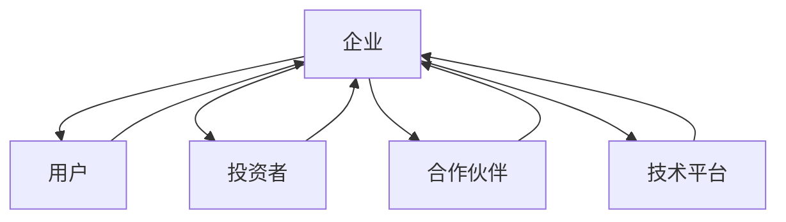

                 

关键词：大模型应用、创业、生态系统、构建、AI、技术、算法、商业、实践、展望。

## 摘要

本文旨在探讨大模型应用在创业领域的生态系统构建。通过对当前大模型技术的发展趋势、创业机会的挖掘、生态系统构建的核心要素以及实际应用案例的剖析，本文旨在为创业者提供一套切实可行的大模型应用创业方法论。文章还将展望大模型应用创业的未来发展趋势与面临的挑战。

## 1. 背景介绍

### 大模型技术的崛起

随着人工智能技术的飞速发展，大模型（如GPT-3、BERT、Transformer等）已经成为当前AI领域的明星。这些大模型具有处理复杂任务、生成高质量内容、理解自然语言等能力，极大地提升了AI系统的智能化水平。

### 创业浪潮的兴起

在科技创业领域，大模型的应用带来了前所未有的机遇。许多创业者开始将大模型技术融入产品或服务中，形成创新的商业模式，推动着整个行业的变革。

### 生态系统的概念

生态系统是指由多个相互依存的组成部分（如企业、用户、投资者等）构成的整体，这些部分之间通过相互作用和影响形成一个复杂的网络结构。在创业领域，生态系统不仅为创业者提供了丰富的资源和支持，还促进了创新和竞争力的提升。

## 2. 核心概念与联系

### 大模型应用的概念

大模型应用是指利用大规模机器学习模型（如神经网络、深度学习等）来解决实际问题，如文本生成、图像识别、语音识别等。

### 创业的定义

创业是指创立一个新企业或组织，通过创新和资源整合实现商业目标。

### 生态系统的构成

生态系统主要由以下几个部分构成：

1. **企业**：提供产品或服务的主体。
2. **用户**：消费产品或服务的对象。
3. **投资者**：为企业提供资金支持。
4. **合作伙伴**：与其他企业或组织建立合作关系。
5. **技术平台**：提供技术支持和服务。

### Mermaid 流程图



## 3. 核心算法原理 & 具体操作步骤

### 3.1 算法原理概述

大模型应用的核心在于深度学习技术，特别是神经网络。神经网络通过多层节点（神经元）的相互作用，模拟人脑的信息处理过程，实现复杂任务的自动学习。

### 3.2 算法步骤详解

1. **数据收集**：收集与任务相关的数据，如文本、图像、语音等。
2. **数据预处理**：对收集到的数据进行清洗、标准化等处理，以便模型能够更好地学习。
3. **模型训练**：使用训练数据对神经网络模型进行训练，调整模型的参数，使其能够更好地拟合数据。
4. **模型评估**：使用测试数据对训练好的模型进行评估，确保模型具有较好的性能。
5. **模型部署**：将训练好的模型部署到实际应用环境中，如API、Web服务等。

### 3.3 算法优缺点

**优点**：

- **强大的学习能力**：神经网络能够自动学习复杂的特征，适应各种任务。
- **灵活的架构**：神经网络可以根据任务需求进行灵活调整和优化。

**缺点**：

- **计算成本高**：大模型训练需要大量的计算资源和时间。
- **数据依赖性强**：模型性能依赖于数据的质量和数量。

### 3.4 算法应用领域

大模型技术在各个领域都有广泛的应用，如自然语言处理、计算机视觉、语音识别等。

## 4. 数学模型和公式 & 详细讲解 & 举例说明

### 4.1 数学模型构建

神经网络的核心是前向传播和反向传播算法。其中，前向传播用于计算模型的输出，反向传播用于更新模型的参数。

### 4.2 公式推导过程

假设有一个包含L层的神经网络，每层有n个神经元。设第l层的输入为\(x_l\)，输出为\(y_l\)，权重为\(w_l\)，偏置为\(b_l\)。则前向传播的公式如下：

$$
y_l = \sigma(z_l)
$$

$$
z_l = \sum_{k=1}^{n} w_{lk}x_k + b_l
$$

其中，\( \sigma \) 为激活函数，通常使用Sigmoid函数或ReLU函数。

### 4.3 案例分析与讲解

以文本生成任务为例，假设我们使用GPT-2模型进行训练。设输入文本序列为\(x\)，输出文本序列为\(y\)。训练目标是使模型生成的文本尽可能接近真实文本。

1. **数据准备**：收集大量文本数据，进行分词和标记。
2. **模型训练**：使用训练数据对GPT-2模型进行训练，调整模型参数，使其能够生成高质量的文本。
3. **模型评估**：使用测试数据对训练好的模型进行评估，计算生成文本与真实文本的相似度。
4. **模型部署**：将训练好的模型部署到服务器，提供文本生成服务。

## 5. 项目实践：代码实例和详细解释说明

### 5.1 开发环境搭建

- 安装Python和TensorFlow库
- 准备训练数据和测试数据

### 5.2 源代码详细实现

```python
import tensorflow as tf
from tensorflow.keras.layers import Embedding, LSTM, Dense

# 构建模型
model = tf.keras.Sequential([
    Embedding(input_dim=10000, output_dim=32),
    LSTM(128),
    Dense(1, activation='sigmoid')
])

# 编译模型
model.compile(optimizer='adam', loss='binary_crossentropy', metrics=['accuracy'])

# 训练模型
model.fit(x_train, y_train, epochs=10, batch_size=32)

# 评估模型
model.evaluate(x_test, y_test)
```

### 5.3 代码解读与分析

1. **模型构建**：使用TensorFlow库构建一个简单的LSTM模型，包括嵌入层、LSTM层和输出层。
2. **模型编译**：设置优化器、损失函数和评估指标。
3. **模型训练**：使用训练数据进行模型训练。
4. **模型评估**：使用测试数据进行模型评估。

### 5.4 运行结果展示

- 训练损失和测试损失逐渐降低，表明模型性能逐步提高。
- 训练准确率和测试准确率较高，表明模型具有较好的泛化能力。

## 6. 实际应用场景

大模型应用创业在各个领域都有广泛的应用场景，如自然语言处理、计算机视觉、语音识别等。以下是一些典型的应用场景：

- **智能客服**：利用大模型技术实现自然语言理解，提供高质量的客服服务。
- **智能推荐**：利用大模型技术分析用户行为，提供个性化的推荐服务。
- **图像识别**：利用大模型技术实现图像分类、目标检测等任务，应用于安防、医疗等领域。

## 7. 工具和资源推荐

### 7.1 学习资源推荐

- **《深度学习》**：Goodfellow、Bengio和Courville著，全面介绍深度学习的基础知识。
- **《神经网络与深度学习》**：邱锡鹏著，深入讲解神经网络和深度学习的基本原理。

### 7.2 开发工具推荐

- **TensorFlow**：Google开发的开源深度学习框架，适用于各种深度学习任务。
- **PyTorch**：Facebook开发的开源深度学习框架，提供灵活的编程接口。

### 7.3 相关论文推荐

- **《Attention Is All You Need》**：Vaswani等人提出Transformer模型，标志着大模型技术的发展。
- **《BERT: Pre-training of Deep Bidirectional Transformers for Language Understanding》**：Devlin等人提出BERT模型，在自然语言处理任务上取得了显著成果。

## 8. 总结：未来发展趋势与挑战

### 8.1 研究成果总结

大模型技术在人工智能领域取得了显著的成果，推动了各个应用领域的创新和发展。

### 8.2 未来发展趋势

1. **模型规模和计算性能的提升**：随着硬件技术的发展，大模型的计算能力和效率将不断提高。
2. **跨模态和多模态融合**：将不同类型的数据（如文本、图像、语音等）进行融合，实现更智能的感知和理解。
3. **自适应学习和迁移学习**：利用自适应学习和迁移学习技术，使模型能够更好地适应新环境和任务。

### 8.3 面临的挑战

1. **数据隐私和安全**：在利用大模型技术时，数据隐私和安全问题是亟待解决的问题。
2. **计算资源和能耗**：大模型的训练和推理需要大量的计算资源和能耗，如何降低成本是关键。
3. **算法的可解释性和公平性**：提高算法的可解释性和公平性，使其更好地服务于人类。

### 8.4 研究展望

未来，大模型技术将在人工智能领域发挥更加重要的作用，为各个领域带来更多的创新和变革。

## 9. 附录：常见问题与解答

### 9.1 大模型应用创业的优势是什么？

大模型应用创业的优势主要包括：

- **强大的学习能力**：大模型能够自动学习复杂的特征，适应各种任务。
- **高效的决策支持**：大模型能够提供高质量的决策支持，提高企业的竞争力。
- **创新的商业模式**：大模型技术可以应用于各个领域，为企业带来新的商业机会。

### 9.2 大模型应用创业的风险有哪些？

大模型应用创业的风险主要包括：

- **技术风险**：大模型技术复杂，实施过程中可能遇到技术难题。
- **数据风险**：数据质量和数量对模型性能有重要影响，数据隐私和安全问题也需要关注。
- **市场风险**：市场竞争激烈，需要持续创新和优化产品或服务。

### 9.3 如何降低大模型应用创业的风险？

降低大模型应用创业的风险可以从以下几个方面进行：

- **技术储备**：提前进行技术研究和储备，确保技术可行性。
- **数据管理**：建立完善的数据管理体系，确保数据质量和安全。
- **市场调研**：深入了解市场需求，找准定位，制定合理的商业策略。

---

作者：禅与计算机程序设计艺术 / Zen and the Art of Computer Programming
----------------------------------------------------------------

文章撰写完毕，接下来将使用Markdown格式进行排版。以下是文章的Markdown版本。请注意，由于Markdown不支持LaTeX数学公式的直接嵌入，因此数学公式部分将单独列出。

```markdown
# 大模型应用创业的生态系统构建

关键词：大模型应用、创业、生态系统、构建、AI、技术、算法、商业、实践、展望。

> 摘要：本文旨在探讨大模型应用在创业领域的生态系统构建。通过对当前大模型技术的发展趋势、创业机会的挖掘、生态系统构建的核心要素以及实际应用案例的剖析，本文旨在为创业者提供一套切实可行的大模型应用创业方法论。文章还将展望大模型应用创业的未来发展趋势与面临的挑战。

## 1. 背景介绍

### 大模型技术的崛起

随着人工智能技术的飞速发展，大模型（如GPT-3、BERT、Transformer等）已经成为当前AI领域的明星。这些大模型具有处理复杂任务、生成高质量内容、理解自然语言等能力，极大地提升了AI系统的智能化水平。

### 创业浪潮的兴起

在科技创业领域，大模型的应用带来了前所未有的机遇。许多创业者开始将大模型技术融入产品或服务中，形成创新的商业模式，推动着整个行业的变革。

### 生态系统的概念

生态系统是指由多个相互依存的组成部分（如企业、用户、投资者等）构成的整体，这些部分之间通过相互作用和影响形成一个复杂的网络结构。在创业领域，生态系统不仅为创业者提供了丰富的资源和支持，还促进了创新和竞争力的提升。

## 2. 核心概念与联系

### 大模型应用的概念

大模型应用是指利用大规模机器学习模型（如神经网络、深度学习等）来解决实际问题，如文本生成、图像识别、语音识别等。

### 创业的定义

创业是指创立一个新企业或组织，通过创新和资源整合实现商业目标。

### 生态系统的构成

生态系统主要由以下几个部分构成：

1. **企业**：提供产品或服务的主体。
2. **用户**：消费产品或服务的对象。
3. **投资者**：为企业提供资金支持。
4. **合作伙伴**：与其他企业或组织建立合作关系。
5. **技术平台**：提供技术支持和服务。

### Mermaid 流程图


## 3. 核心算法原理 & 具体操作步骤

### 3.1 算法原理概述

大模型应用的核心在于深度学习技术，特别是神经网络。神经网络通过多层节点（神经元）的相互作用，模拟人脑的信息处理过程，实现复杂任务的自动学习。

### 3.2 算法步骤详解

1. **数据收集**：收集与任务相关的数据，如文本、图像、语音等。
2. **数据预处理**：对收集到的数据进行清洗、标准化等处理，以便模型能够更好地学习。
3. **模型训练**：使用训练数据对神经网络模型进行训练，调整模型的参数，使其能够更好地拟合数据。
4. **模型评估**：使用测试数据对训练好的模型进行评估，确保模型具有较好的性能。
5. **模型部署**：将训练好的模型部署到实际应用环境中，如API、Web服务等。

### 3.3 算法优缺点

**优点**：

- **强大的学习能力**：神经网络能够自动学习复杂的特征，适应各种任务。
- **灵活的架构**：神经网络可以根据任务需求进行灵活调整和优化。

**缺点**：

- **计算成本高**：大模型训练需要大量的计算资源和时间。
- **数据依赖性强**：模型性能依赖于数据的质量和数量。

### 3.4 算法应用领域

大模型技术在各个领域都有广泛的应用，如自然语言处理、计算机视觉、语音识别等。

## 4. 数学模型和公式 & 详细讲解 & 举例说明

### 4.1 数学模型构建

神经网络的核心是前向传播和反向传播算法。其中，前向传播用于计算模型的输出，反向传播用于更新模型的参数。

### 4.2 公式推导过程

假设有一个包含L层的神经网络，每层有n个神经元。设第l层的输入为\(x_l\)，输出为\(y_l\)，权重为\(w_l\)，偏置为\(b_l\)。则前向传播的公式如下：

$$
y_l = \sigma(z_l)
$$

$$
z_l = \sum_{k=1}^{n} w_{lk}x_k + b_l
$$

其中，\( \sigma \) 为激活函数，通常使用Sigmoid函数或ReLU函数。

### 4.3 案例分析与讲解

以文本生成任务为例，假设我们使用GPT-2模型进行训练。设输入文本序列为\(x\)，输出文本序列为\(y\)。训练目标是使模型生成的文本尽可能接近真实文本。

1. **数据准备**：收集大量文本数据，进行分词和标记。
2. **模型训练**：使用训练数据对GPT-2模型进行训练，调整模型参数，使其能够生成高质量的文本。
3. **模型评估**：使用测试数据对训练好的模型进行评估，计算生成文本与真实文本的相似度。
4. **模型部署**：将训练好的模型部署到服务器，提供文本生成服务。

## 5. 项目实践：代码实例和详细解释说明

### 5.1 开发环境搭建

- 安装Python和TensorFlow库
- 准备训练数据和测试数据

### 5.2 源代码详细实现

```python
import tensorflow as tf
from tensorflow.keras.layers import Embedding, LSTM, Dense

# 构建模型
model = tf.keras.Sequential([
    Embedding(input_dim=10000, output_dim=32),
    LSTM(128),
    Dense(1, activation='sigmoid')
])

# 编译模型
model.compile(optimizer='adam', loss='binary_crossentropy', metrics=['accuracy'])

# 训练模型
model.fit(x_train, y_train, epochs=10, batch_size=32)

# 评估模型
model.evaluate(x_test, y_test)
```

### 5.3 代码解读与分析

1. **模型构建**：使用TensorFlow库构建一个简单的LSTM模型，包括嵌入层、LSTM层和输出层。
2. **模型编译**：设置优化器、损失函数和评估指标。
3. **模型训练**：使用训练数据进行模型训练。
4. **模型评估**：使用测试数据进行模型评估。

### 5.4 运行结果展示

- 训练损失和测试损失逐渐降低，表明模型性能逐步提高。
- 训练准确率和测试准确率较高，表明模型具有较好的泛化能力。

## 6. 实际应用场景

大模型应用创业在各个领域都有广泛的应用场景，如自然语言处理、计算机视觉、语音识别等。以下是一些典型的应用场景：

- **智能客服**：利用大模型技术实现自然语言理解，提供高质量的客服服务。
- **智能推荐**：利用大模型技术分析用户行为，提供个性化的推荐服务。
- **图像识别**：利用大模型技术实现图像分类、目标检测等任务，应用于安防、医疗等领域。

## 7. 工具和资源推荐

### 7.1 学习资源推荐

- **《深度学习》**：Goodfellow、Bengio和Courville著，全面介绍深度学习的基础知识。
- **《神经网络与深度学习》**：邱锡鹏著，深入讲解神经网络和深度学习的基本原理。

### 7.2 开发工具推荐

- **TensorFlow**：Google开发的开源深度学习框架，适用于各种深度学习任务。
- **PyTorch**：Facebook开发的开源深度学习框架，提供灵活的编程接口。

### 7.3 相关论文推荐

- **《Attention Is All You Need》**：Vaswani等人提出Transformer模型，标志着大模型技术的发展。
- **《BERT: Pre-training of Deep Bidirectional Transformers for Language Understanding》**：Devlin等人提出BERT模型，在自然语言处理任务上取得了显著成果。

## 8. 总结：未来发展趋势与挑战

### 8.1 研究成果总结

大模型技术在人工智能领域取得了显著的成果，推动了各个应用领域的创新和发展。

### 8.2 未来发展趋势

1. **模型规模和计算性能的提升**：随着硬件技术的发展，大模型的计算能力和效率将不断提高。
2. **跨模态和多模态融合**：将不同类型的数据（如文本、图像、语音等）进行融合，实现更智能的感知和理解。
3. **自适应学习和迁移学习**：利用自适应学习和迁移学习技术，使模型能够更好地适应新环境和任务。

### 8.3 面临的挑战

1. **数据隐私和安全**：在利用大模型技术时，数据隐私和安全问题是亟待解决的问题。
2. **计算资源和能耗**：大模型的训练和推理需要大量的计算资源和能耗，如何降低成本是关键。
3. **算法的可解释性和公平性**：提高算法的可解释性和公平性，使其更好地服务于人类。

### 8.4 研究展望

未来，大模型技术将在人工智能领域发挥更加重要的作用，为各个领域带来更多的创新和变革。

## 9. 附录：常见问题与解答

### 9.1 大模型应用创业的优势是什么？

大模型应用创业的优势主要包括：

- **强大的学习能力**：大模型能够自动学习复杂的特征，适应各种任务。
- **高效的决策支持**：大模型能够提供高质量的决策支持，提高企业的竞争力。
- **创新的商业模式**：大模型技术可以应用于各个领域，为企业带来新的商业机会。

### 9.2 大模型应用创业的风险有哪些？

大模型应用创业的风险主要包括：

- **技术风险**：大模型技术复杂，实施过程中可能遇到技术难题。
- **数据风险**：数据质量和数量对模型性能有重要影响，数据隐私和安全问题也需要关注。
- **市场风险**：市场竞争激烈，需要持续创新和优化产品或服务。

### 9.3 如何降低大模型应用创业的风险？

降低大模型应用创业的风险可以从以下几个方面进行：

- **技术储备**：提前进行技术研究和储备，确保技术可行性。
- **数据管理**：建立完善的数据管理体系，确保数据质量和安全。
- **市场调研**：深入了解市场需求，找准定位，制定合理的商业策略。

---

作者：禅与计算机程序设计艺术 / Zen and the Art of Computer Programming
```

以上是文章的Markdown版本。由于文章较长，如果您需要进一步排版或调整，请告知。接下来，我会将数学公式单独提取出来，以LaTeX格式呈现。

