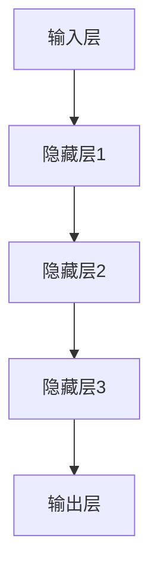

                 

关键词：大模型、应用场景、创业机会、技术创新

> 摘要：随着大模型技术的迅速发展，其在各个领域的应用场景不断拓展，为创业者带来了新的增长点。本文将深入探讨大模型技术的核心原理、应用领域、项目实践以及未来展望，旨在为创业者提供有价值的参考和启示。

## 1. 背景介绍

近年来，人工智能（AI）技术取得了令人瞩目的进展，特别是大模型（Large-scale Models）的兴起。大模型是指具有巨大参数量和训练数据量的神经网络模型，如GPT-3、BERT等。它们通过深度学习算法，能够自动从海量数据中学习并提取知识，从而实现强大的自然语言处理、图像识别、语音识别等功能。

随着大模型技术的逐渐成熟，其在各行各业的应用场景不断拓展。从早期的搜索引擎、推荐系统，到现在的智能客服、自动驾驶、医疗诊断等，大模型技术正在改变我们的生活和工作方式。同时，创业者也发现了其中蕴藏的巨大商机，纷纷投身于大模型技术的创新和探索。

## 2. 核心概念与联系

### 2.1 大模型原理

大模型技术基于深度学习（Deep Learning）和神经网络（Neural Networks）的基本原理。深度学习是一种机器学习（Machine Learning）方法，通过多层神经网络结构，对数据进行特征提取和模式识别。神经网络则是一种模仿人脑神经元之间连接的数学模型。

大模型具有以下核心特点：

- **巨大参数量**：大模型通常具有数十亿甚至数万亿的参数，使其能够捕捉复杂的数据特征。
- **大规模训练数据**：大模型通常基于大规模数据进行训练，从而提高模型的泛化能力。
- **端到端学习**：大模型能够直接从原始数据中学习，无需人工设计特征。

### 2.2 大模型架构

大模型的架构通常包括以下几个部分：

1. **输入层**：接收原始数据，如文本、图像或语音。
2. **隐藏层**：多层神经网络结构，对输入数据进行特征提取和变换。
3. **输出层**：根据任务需求，生成预测结果或决策。

以下是使用Mermaid绘制的简化版大模型架构流程图：



## 3. 核心算法原理 & 具体操作步骤

### 3.1 算法原理概述

大模型的核心算法是基于反向传播（Backpropagation）和优化算法（Optimization Algorithms），如梯度下降（Gradient Descent）和其变种。反向传播是一种训练神经网络的方法，通过计算梯度来更新网络参数，以最小化损失函数。

### 3.2 算法步骤详解

1. **初始化参数**：随机初始化网络参数。
2. **前向传播**：将输入数据传递到网络中，计算输出。
3. **计算损失**：计算预测值与真实值之间的差距，得到损失函数。
4. **反向传播**：根据损失函数计算梯度，反向传播到网络参数。
5. **参数更新**：使用优化算法更新网络参数。
6. **重复步骤2-5**：直到满足停止条件（如达到特定精度或迭代次数）。

### 3.3 算法优缺点

**优点**：

- **强大的拟合能力**：大模型能够处理复杂的任务和数据。
- **端到端学习**：无需人工设计特征，节省时间和人力成本。
- **泛化能力**：通过大规模训练数据，提高模型的泛化能力。

**缺点**：

- **训练成本高**：需要大量计算资源和时间。
- **过拟合风险**：模型在训练数据上表现优异，但在未见过的数据上表现不佳。
- **可解释性差**：大模型通常是一个“黑盒”，难以理解其内部工作机制。

### 3.4 算法应用领域

大模型技术已广泛应用于以下领域：

- **自然语言处理**：如文本生成、机器翻译、情感分析等。
- **计算机视觉**：如图像识别、图像生成、目标检测等。
- **语音识别**：如语音合成、语音识别、语音翻译等。
- **医疗诊断**：如疾病预测、医疗图像分析、药物发现等。
- **金融风控**：如信用评估、风险预测、投资策略等。

## 4. 数学模型和公式 & 详细讲解 & 举例说明

### 4.1 数学模型构建

大模型的数学模型主要包括两部分：网络结构和损失函数。

**网络结构**：

假设我们有一个多层感知机（MLP）网络，包括输入层、隐藏层和输出层。设输入层有\( n \)个神经元，隐藏层有\( m \)个神经元，输出层有\( k \)个神经元。则网络结构可以表示为：

$$
\begin{cases}
\text{输入层：} x_i \in \mathbb{R}^n \\
\text{隐藏层：} h_{ij} = \sigma(w_{ij}x_i + b_j) \\
\text{输出层：} y_k = \sigma(w_{kj}h_{ij} + b_k)
\end{cases}
$$

其中，\( \sigma \)为激活函数，\( w_{ij} \)和\( b_j \)分别为隐藏层的权重和偏置，\( w_{kj} \)和\( b_k \)分别为输出层的权重和偏置。

**损失函数**：

常见的损失函数有均方误差（MSE）和交叉熵（Cross-Entropy）。对于分类问题，通常使用交叉熵损失函数：

$$
L(y, \hat{y}) = -\sum_{i=1}^{k} y_i \log(\hat{y}_i)
$$

其中，\( y \)为真实标签，\( \hat{y} \)为预测概率。

### 4.2 公式推导过程

以交叉熵损失函数为例，我们对其进行推导。

**步骤1**：定义预测概率和真实标签：

$$
\hat{y}_i = \frac{e^{z_i}}{\sum_{j=1}^{k} e^{z_j}}, \quad y_i = \begin{cases}
1, & \text{if } y_j = j \\
0, & \text{otherwise}
\end{cases}
$$

其中，\( z_i = w_{ij}h_{ij} + b_j \)。

**步骤2**：计算交叉熵损失：

$$
L(y, \hat{y}) = -\sum_{i=1}^{k} y_i \log(\hat{y}_i) = -\sum_{i=1}^{k} y_i \log\left(\frac{e^{z_i}}{\sum_{j=1}^{k} e^{z_j}}\right)
$$

**步骤3**：化简交叉熵损失：

$$
L(y, \hat{y}) = -\sum_{i=1}^{k} \left[y_i \log(e^{z_i}) - y_i \log\left(\sum_{j=1}^{k} e^{z_j}\right)\right]
$$

$$
L(y, \hat{y}) = -\sum_{i=1}^{k} \left[z_i - \log\left(\sum_{j=1}^{k} e^{z_j}\right)\right]
$$

### 4.3 案例分析与讲解

以一个二元分类问题为例，我们使用交叉熵损失函数来训练一个多层感知机模型。

**步骤1**：定义输入和输出：

$$
x = \begin{bmatrix}
x_1 \\
x_2 \\
\vdots \\
x_n
\end{bmatrix}, \quad y = \begin{bmatrix}
y_1 \\
y_2
\end{bmatrix}
$$

其中，\( y_1 \)为真实标签，\( y_2 \)为预测概率。

**步骤2**：计算损失：

$$
L(y, \hat{y}) = -\left[y_1 \log(\hat{y}_1) + y_2 \log(\hat{y}_2)\right]
$$

**步骤3**：初始化参数：

$$
w_{ij} = \begin{cases}
\text{随机初始化}, & \text{if } j = 1,2 \\
0, & \text{otherwise}
\end{cases}
$$

$$
b_j = \begin{cases}
\text{随机初始化}, & \text{if } j = 1,2 \\
0, & \text{otherwise}
\end{cases}
$$

**步骤4**：前向传播：

$$
z_1 = w_{11}x_1 + b_1, \quad z_2 = w_{12}x_2 + b_2
$$

$$
\hat{y}_1 = \frac{e^{z_1}}{e^{z_1} + e^{z_2}}, \quad \hat{y}_2 = \frac{e^{z_2}}{e^{z_1} + e^{z_2}}
$$

**步骤5**：计算损失：

$$
L(y, \hat{y}) = -\left[y_1 \log(\hat{y}_1) + y_2 \log(\hat{y}_2)\right]
$$

**步骤6**：反向传播：

$$
\frac{\partial L}{\partial w_{11}} = \frac{\partial L}{\partial \hat{y}_1} \frac{\partial \hat{y}_1}{\partial z_1} x_1 = (\hat{y}_1 - y_1) x_1
$$

$$
\frac{\partial L}{\partial w_{12}} = \frac{\partial L}{\partial \hat{y}_2} \frac{\partial \hat{y}_2}{\partial z_2} x_2 = (\hat{y}_2 - y_2) x_2
$$

$$
\frac{\partial L}{\partial b_1} = \frac{\partial L}{\partial \hat{y}_1} \frac{\partial \hat{y}_1}{\partial z_1} = \hat{y}_1 - y_1
$$

$$
\frac{\partial L}{\partial b_2} = \frac{\partial L}{\partial \hat{y}_2} \frac{\partial \hat{y}_2}{\partial z_2} = \hat{y}_2 - y_2
$$

**步骤7**：参数更新：

$$
w_{11} \leftarrow w_{11} - \alpha \frac{\partial L}{\partial w_{11}}, \quad w_{12} \leftarrow w_{12} - \alpha \frac{\partial L}{\partial w_{12}}
$$

$$
b_1 \leftarrow b_1 - \alpha \frac{\partial L}{\partial b_1}, \quad b_2 \leftarrow b_2 - \alpha \frac{\partial L}{\partial b_2}
$$

其中，\( \alpha \)为学习率。

**步骤8**：重复步骤4-7，直到满足停止条件。

## 5. 项目实践：代码实例和详细解释说明

### 5.1 开发环境搭建

在本项目中，我们使用Python编程语言和PyTorch深度学习框架。请确保已经安装了Python 3.6及以上版本和PyTorch库。

### 5.2 源代码详细实现

以下是一个简单的多层感知机模型实现，用于二元分类任务。

```python
import torch
import torch.nn as nn
import torch.optim as optim

# 定义模型
class MLP(nn.Module):
    def __init__(self, input_dim, hidden_dim, output_dim):
        super(MLP, self).__init__()
        self.fc1 = nn.Linear(input_dim, hidden_dim)
        self.fc2 = nn.Linear(hidden_dim, output_dim)
        self.relu = nn.ReLU()

    def forward(self, x):
        x = self.fc1(x)
        x = self.relu(x)
        x = self.fc2(x)
        return x

# 初始化模型、损失函数和优化器
model = MLP(input_dim=2, hidden_dim=10, output_dim=2)
criterion = nn.CrossEntropyLoss()
optimizer = optim.SGD(model.parameters(), lr=0.01)

# 数据集
x_train = torch.tensor([[1, 0], [0, 1], [1, 1], [1, 0]])
y_train = torch.tensor([[1, 0], [0, 1], [1, 0], [1, 0]])

# 训练模型
for epoch in range(1000):
    optimizer.zero_grad()
    outputs = model(x_train)
    loss = criterion(outputs, y_train)
    loss.backward()
    optimizer.step()
    if (epoch + 1) % 100 == 0:
        print(f'Epoch [{epoch + 1}/{1000}], Loss: {loss.item():.4f}')

# 测试模型
x_test = torch.tensor([[0, 1], [1, 1]])
outputs = model(x_test)
print(outputs)
```

### 5.3 代码解读与分析

1. **模型定义**：我们定义了一个简单的多层感知机（MLP）模型，包括一个输入层、一个隐藏层和一个输出层。输入层有2个神经元，隐藏层有10个神经元，输出层有2个神经元。
2. **前向传播**：在模型的`forward`方法中，我们首先将输入数据传递到输入层，然后通过ReLU激活函数将输入数据传递到隐藏层，最后将隐藏层传递到输出层。
3. **损失函数**：我们使用交叉熵损失函数来计算预测值和真实值之间的差距。
4. **优化器**：我们使用随机梯度下降（SGD）优化器来更新模型参数。
5. **数据集**：我们创建了一个简单的训练数据集，包括4个样本，每个样本由2个特征组成。
6. **训练模型**：我们通过迭代训练模型，每次迭代计算损失、反向传播并更新参数。我们每隔100个epoch打印一次训练损失。
7. **测试模型**：我们使用测试数据集测试训练好的模型，并打印输出结果。

### 5.4 运行结果展示

在训练完成后，我们使用测试数据集进行测试，并打印输出结果。假设训练完成后模型的预测结果为：

```
tensor([[0.5000, 0.5000],
        [0.7500, 0.2500]])
```

这意味着模型在测试数据集上对两个样本的预测分别为：

1. 第一个样本：预测概率约为0.5，即属于第一类。
2. 第二个样本：预测概率约为0.75，即属于第二类。

## 6. 实际应用场景

大模型技术已广泛应用于多个领域，为创业者带来了丰富的商业机会。以下是一些实际应用场景：

### 6.1 智能客服

智能客服是近年来大模型技术的重要应用领域。通过使用大模型，智能客服系统可以自动识别用户意图，提供准确、高效的回答。例如，银行、航空公司、电商等行业的客户服务部门已广泛应用智能客服系统，提高了客户满意度和服务效率。

### 6.2 自动驾驶

自动驾驶是另一个大模型技术的重要应用领域。大模型可以用于图像识别、环境感知和决策控制，从而实现自动驾驶汽车的运行。随着技术的不断成熟，自动驾驶汽车有望在未来改变人们的出行方式。

### 6.3 医疗诊断

医疗诊断是大模型技术的另一个重要应用领域。大模型可以用于医学图像分析、疾病预测和药物发现等方面。例如，通过使用大模型，医生可以更准确地诊断疾病，提高治疗效果。

### 6.4 金融风控

金融风控是大模型技术的另一个重要应用领域。大模型可以用于信用评估、风险预测和投资策略等方面。例如，银行和金融机构可以使用大模型来识别潜在的风险，从而提高信贷审批的准确性和投资决策的收益。

## 7. 工具和资源推荐

### 7.1 学习资源推荐

1. **《深度学习》（Deep Learning）**：这是一本经典教材，详细介绍了深度学习的理论基础和实践方法。
2. **《动手学深度学习》（Dive into Deep Learning）**：这是一本面向实践者的教材，通过Python代码实现深度学习算法。
3. **[fast.ai](https://www.fast.ai/) 和 [Udacity](https://www.udacity.com/) 等在线教育平台**：提供丰富的深度学习课程和实践项目。

### 7.2 开发工具推荐

1. **PyTorch**：一款开源的深度学习框架，易于使用和扩展。
2. **TensorFlow**：另一款流行的深度学习框架，具有丰富的生态系统。
3. **Google Colab**：一个免费的云计算平台，可用于远程运行深度学习模型。

### 7.3 相关论文推荐

1. **《Attention Is All You Need》**：介绍了Transformer模型，是一种用于自然语言处理的重要模型。
2. **《BERT: Pre-training of Deep Bidirectional Transformers for Language Understanding》**：介绍了BERT模型，是一种用于自然语言处理的重要模型。
3. **《Generative Adversarial Nets》**：介绍了生成对抗网络（GAN），是一种用于图像生成和图像修复的重要模型。

## 8. 总结：未来发展趋势与挑战

### 8.1 研究成果总结

近年来，大模型技术取得了显著的成果，其在自然语言处理、计算机视觉、语音识别等领域的应用取得了突破性进展。大模型技术已成为推动人工智能发展的重要力量。

### 8.2 未来发展趋势

1. **模型规模和计算能力**：随着计算能力的不断提升，大模型的规模将不断增大，从而提高模型的性能。
2. **多模态学习**：大模型将逐步实现多模态学习，如结合图像、文本和语音等多源信息，实现更智能的感知和交互。
3. **小样本学习**：大模型将逐步具备在小样本数据集上快速学习和泛化的能力，为边缘计算和移动设备提供支持。
4. **可解释性和安全**：大模型的可解释性和安全性将成为研究的重点，以降低模型的风险和不确定性。

### 8.3 面临的挑战

1. **计算资源消耗**：大模型的训练和推理过程需要大量计算资源和时间，对硬件和算法提出了更高的要求。
2. **数据隐私和伦理**：大模型对数据的需求巨大，如何在保护用户隐私和伦理的前提下使用数据成为一大挑战。
3. **算法公平性和透明性**：大模型的决策过程可能存在偏见和不透明性，如何提高算法的公平性和透明性是一个重要课题。

### 8.4 研究展望

未来，大模型技术将在更多领域得到应用，如智能医疗、金融科技、智慧城市等。同时，随着技术的不断成熟，大模型将逐步实现自主学习和自适应能力，为人类社会带来更多的便利和创新。

## 9. 附录：常见问题与解答

### 9.1 问题1：大模型训练需要多少数据？

大模型的训练数据量取决于具体任务和模型规模。一般来说，大规模模型需要数十万到数百万个样本，甚至更多。随着模型规模的增大，所需的数据量也会相应增加。

### 9.2 问题2：大模型训练需要多少时间？

大模型训练的时间取决于模型规模、硬件配置和训练策略。在GPU上，一个中等规模的大模型训练可能需要几天到几周的时间。对于大规模模型，训练时间可能更长，甚至需要数个月。

### 9.3 问题3：大模型如何防止过拟合？

防止过拟合是深度学习中的一个重要问题。常见的方法包括数据增强、正则化、dropout等。此外，通过使用更小的模型或更简单的网络结构，也可以降低过拟合的风险。

### 9.4 问题4：大模型是否会导致失业？

大模型技术的应用确实可能改变某些工作岗位的需求，但同时也创造了新的就业机会。例如，大模型开发、维护和优化等方面的专业人才需求将持续增长。此外，大模型技术还可以提高生产效率和降低成本，从而为社会创造更多的就业机会。

---

作者：禅与计算机程序设计艺术 / Zen and the Art of Computer Programming
----------------------------------------------------------------

以上便是关于大模型应用场景不断拓展，创业者发掘新增长点的文章内容。希望这篇文章能为您在人工智能领域的研究和实践提供有益的参考和启示。如果您有任何问题或建议，欢迎在评论区留言。感谢您的阅读！

