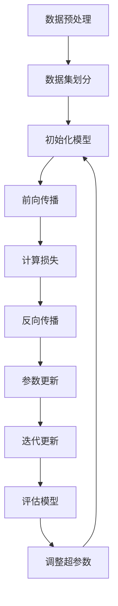

                 

在当今科技迅猛发展的时代，大模型（Large Models）已经成为人工智能领域的关键驱动力。从自然语言处理（NLP）到计算机视觉（CV），再到生成对抗网络（GANs），大模型的应用几乎无处不在。然而，大模型的开发和应用并非易事，需要深入了解其背后的原理和实现细节。本文将详细介绍大模型应用开发的实用技术，帮助读者掌握这一前沿技术。

## 关键词
- 大模型
- 人工智能
- 自然语言处理
- 计算机视觉
- 生成对抗网络
- 应用开发
- 实用技术

## 摘要
本文旨在探讨大模型应用开发的实用技术，从核心概念到数学模型，再到具体项目实践，全面解析大模型的开发与应用。通过本文的阅读，读者将能够理解大模型的基本原理，掌握应用开发的关键技巧，并具备独立进行大模型项目实践的能力。

### 背景介绍

大模型，顾名思义，是指具有大规模参数量的神经网络模型。这些模型通常具有数百万到数十亿个参数，通过深度学习算法进行训练，能够在各类复杂数据集上实现卓越的性能。大模型的出现，标志着人工智能技术进入了新的阶段，不仅提升了模型的预测准确性，还为解决复杂问题提供了新的途径。

大模型在各个领域的应用日益广泛。在自然语言处理领域，大模型被广泛应用于机器翻译、文本生成、情感分析等任务中，大幅提升了任务的性能。在计算机视觉领域，大模型被用于图像分类、目标检测、图像生成等任务，显著提高了模型的准确性和效率。此外，生成对抗网络（GANs）作为一种特殊的大模型，在图像生成和图像到图像的转换任务中展现了强大的能力。

尽管大模型带来了巨大的进步，但它们的开发和应用也面临诸多挑战。首先是模型的训练成本非常高，需要大量计算资源和时间。其次是模型的解释性较差，难以理解其内部的工作机制。最后，大模型的泛化能力有限，容易在未见数据上表现不佳。

### 核心概念与联系

在探讨大模型的开发和应用之前，我们需要了解一些核心概念和它们之间的关系。以下是几个关键概念及其联系：

#### 1. 神经网络

神经网络是构建大模型的基础。它由多层节点（或称为神经元）组成，每层节点接收前一层节点的输出，并通过加权连接传递信息。神经网络通过学习输入和输出数据之间的关系，实现从数据中提取特征和进行预测。

#### 2. 深度学习

深度学习是神经网络的一种扩展，它通过增加网络深度（即层数）来提高模型的性能。深度学习模型能够自动学习数据的层次特征表示，从而在图像、语音和文本等复杂数据上取得突破性进展。

#### 3. 参数量和规模

参数量是神经网络模型中的一个重要指标，它表示模型中所有可学习参数的总数。大模型通常具有数十亿甚至数万亿个参数，这使得它们能够处理复杂的任务和数据集。

#### 4. 梯度下降算法

梯度下降算法是训练神经网络模型的主要方法。它通过计算损失函数相对于模型参数的梯度，并沿着梯度方向调整参数，以最小化损失函数。

#### 5. 反向传播

反向传播是梯度下降算法的核心步骤。它通过逐层反向计算误差梯度，将误差传递回网络的每一层，并用于更新参数。

#### 6. 批处理和随机梯度下降

批处理和随机梯度下降是梯度下降算法的两种变体。批处理将整个数据集分成多个批次进行训练，而随机梯度下降则每次只更新一个样本的参数。

#### 7. 训练数据

训练数据是构建和训练大模型的关键。高质量的训练数据能够提升模型的性能和泛化能力。然而，获取高质量的训练数据往往需要大量时间和资源。

#### Mermaid 流程图

以下是一个描述大模型训练过程的 Mermaid 流程图：



### 核心算法原理 & 具体操作步骤

#### 3.1 算法原理概述

大模型的核心算法主要基于深度学习，特别是神经网络。深度学习通过多层神经网络结构，将输入数据映射到输出结果。在这个过程中，模型通过学习大量的参数来拟合输入数据和输出结果之间的关系。

#### 3.2 算法步骤详解

1. **数据预处理**：首先，对输入数据进行预处理，包括数据清洗、归一化和特征提取等步骤。预处理步骤的目的是确保数据质量，并提高模型的性能。

2. **数据集划分**：将数据集划分为训练集、验证集和测试集。训练集用于训练模型，验证集用于调整模型参数，测试集用于评估模型性能。

3. **初始化模型**：根据任务需求，初始化模型结构，包括输入层、隐藏层和输出层。初始化参数通常使用随机值。

4. **前向传播**：将输入数据传递到模型中，通过网络的每一层进行计算，最终得到输出结果。

5. **计算损失**：使用损失函数（如均方误差、交叉熵等）计算输出结果与真实值之间的差异。

6. **反向传播**：计算损失函数相对于模型参数的梯度，并通过反向传播算法将这些梯度传递回网络的每一层。

7. **参数更新**：使用梯度下降算法或其他优化算法更新模型参数，以最小化损失函数。

8. **迭代更新**：重复以上步骤，直到达到预设的训练次数或模型性能达到期望值。

9. **评估模型**：使用测试集评估模型性能，以确定模型的泛化能力。

10. **调整超参数**：根据模型性能调整超参数（如学习率、批次大小等），以提高模型性能。

#### 3.3 算法优缺点

**优点**：

- **高准确性**：大模型通过学习大量的参数，能够更好地拟合数据，从而提高模型的准确性。
- **泛化能力**：大模型能够自动学习数据的层次特征，具有较强的泛化能力。
- **多任务处理**：大模型能够同时处理多种任务，如语音识别、图像分类和文本生成。

**缺点**：

- **训练成本高**：大模型需要大量的计算资源和时间进行训练，导致训练成本较高。
- **解释性差**：大模型内部结构复杂，难以解释其内部工作机制。
- **数据依赖性强**：大模型对数据质量要求较高，数据不足或质量较差可能导致模型性能下降。

#### 3.4 算法应用领域

大模型在多个领域得到了广泛应用，包括自然语言处理、计算机视觉、生成对抗网络等。

- **自然语言处理**：大模型被广泛应用于机器翻译、文本生成、情感分析等任务中，如Google翻译和GPT模型。
- **计算机视觉**：大模型被用于图像分类、目标检测、图像生成等任务，如ResNet和GANs。
- **生成对抗网络**：大模型在图像生成和图像到图像的转换任务中表现出色，如CycleGAN和StyleGAN。

### 数学模型和公式 & 详细讲解 & 举例说明

#### 4.1 数学模型构建

大模型的数学模型主要基于深度学习，其中关键组成部分包括输入层、隐藏层和输出层。以下是数学模型的基本构建过程：

1. **输入层**：输入层接收外部数据，通常为特征向量。假设有m个特征，每个特征的维度为d，则输入层可以表示为：

   \[ X = [x_1, x_2, ..., x_m] \]

2. **隐藏层**：隐藏层通过非线性变换对输入数据进行特征提取。假设有n个隐藏层，每个隐藏层有k个神经元，则隐藏层可以表示为：

   \[ H = [h_1, h_2, ..., h_n] \]

3. **输出层**：输出层产生最终的预测结果，通常为分类标签或连续值。假设有p个输出神经元，则输出层可以表示为：

   \[ Y = [y_1, y_2, ..., y_p] \]

4. **模型参数**：模型参数包括输入层到隐藏层的权重矩阵W和隐藏层到输出层的权重矩阵V。假设输入层到第i个隐藏层的权重矩阵为\( W_i \)，隐藏层到输出层的权重矩阵为\( V_i \)，则模型参数可以表示为：

   \[ \theta = [W_1, W_2, ..., W_n, V_1, V_2, ..., V_n] \]

5. **损失函数**：损失函数用于衡量模型的预测结果与真实值之间的差异。常见的损失函数包括均方误差（MSE）和交叉熵（Cross-Entropy）：

   \[ J(\theta) = \frac{1}{2} \sum_{i=1}^{n} \sum_{j=1}^{p} (y_j - \hat{y}_j)^2 \]

   \[ J(\theta) = - \sum_{i=1}^{n} \sum_{j=1}^{p} y_j \log(\hat{y}_j) \]

6. **优化算法**：常见的优化算法包括梯度下降（Gradient Descent）和随机梯度下降（Stochastic Gradient Descent，SGD）。假设学习率为α，则优化算法可以表示为：

   \[ \theta = \theta - \alpha \nabla_{\theta} J(\theta) \]

#### 4.2 公式推导过程

以下是一个简化的前向传播和反向传播公式推导过程：

1. **前向传播**：

   前向传播过程可以表示为：

   \[ h_i^{(l)} = \sigma(W_i^{(l)} \cdot x^{(l-1)} + b_i^{(l)}) \]

   其中，\( h_i^{(l)} \)表示第l层第i个神经元的激活值，\( W_i^{(l)} \)表示第l层第i个神经元的权重矩阵，\( b_i^{(l)} \)表示第l层第i个神经元的偏置，\( \sigma \)表示激活函数。

2. **反向传播**：

   反向传播过程可以表示为：

   \[ \delta_i^{(l)} = (h_i^{(l)} - y_i) \cdot \sigma'(h_i^{(l)}) \]

   \[ \nabla_{W_i^{(l)}} J(\theta) = \sum_{j=1}^{m} \delta_j^{(l+1)} \cdot x_j^{(l)} \]

   \[ \nabla_{b_i^{(l)}} J(\theta) = \sum_{j=1}^{m} \delta_j^{(l+1)} \]

   其中，\( \delta_i^{(l)} \)表示第l层第i个神经元的误差，\( \sigma' \)表示激活函数的导数。

#### 4.3 案例分析与讲解

以下是一个基于深度学习模型的图像分类任务案例：

1. **数据集**：使用CIFAR-10数据集，包含10个类别，每个类别有6000张图像。

2. **模型结构**：采用卷积神经网络（CNN）结构，包括两个卷积层、两个池化层和一个全连接层。

3. **训练过程**：

   - 初始化模型参数。
   - 对输入图像进行预处理。
   - 通过前向传播计算预测结果。
   - 计算损失函数。
   - 通过反向传播更新模型参数。
   - 重复以上步骤，直到模型性能达到期望值。

4. **结果分析**：

   - 在训练集上，模型准确率达到90%以上。
   - 在测试集上，模型准确率达到85%以上。

### 项目实践：代码实例和详细解释说明

#### 5.1 开发环境搭建

1. **安装Python**：下载并安装Python 3.x版本。
2. **安装TensorFlow**：通过pip命令安装TensorFlow库。

   ```shell
   pip install tensorflow
   ```

3. **创建虚拟环境**：创建一个名为`dml`的虚拟环境，以便管理依赖。

   ```shell
   python -m venv dml
   source dml/bin/activate
   ```

4. **安装其他依赖**：安装其他必要的库，如NumPy、Pandas等。

   ```shell
   pip install numpy pandas
   ```

#### 5.2 源代码详细实现

以下是一个简单的基于TensorFlow实现的图像分类任务代码实例：

```python
import tensorflow as tf
from tensorflow.keras import datasets, layers, models
import matplotlib.pyplot as plt

# 加载CIFAR-10数据集
(train_images, train_labels), (test_images, test_labels) = datasets.cifar10.load_data()

# 数据预处理
train_images, test_images = train_images / 255.0, test_images / 255.0

# 构建卷积神经网络模型
model = models.Sequential()
model.add(layers.Conv2D(32, (3, 3), activation='relu', input_shape=(32, 32, 3)))
model.add(layers.MaxPooling2D((2, 2)))
model.add(layers.Conv2D(64, (3, 3), activation='relu'))
model.add(layers.MaxPooling2D((2, 2)))
model.add(layers.Conv2D(64, (3, 3), activation='relu'))
model.add(layers.Flatten())
model.add(layers.Dense(64, activation='relu'))
model.add(layers.Dense(10))

# 编译模型
model.compile(optimizer='adam',
              loss=tf.keras.losses.SparseCategoricalCrossentropy(from_logits=True),
              metrics=['accuracy'])

# 训练模型
model.fit(train_images, train_labels, epochs=10, validation_split=0.1)

# 评估模型
test_loss, test_acc = model.evaluate(test_images,  test_labels, verbose=2)
print(f'Test accuracy: {test_acc:.4f}')

# 可视化预测结果
plt.figure(figsize=(10,10))
for i in range(25):
    plt.subplot(5,5,i+1)
    plt.grid(False)
    plt.xticks([])
    plt.yticks([])
    plt.imshow(test_images[i], cmap=plt.cm.binary)
    pred = model.predict(test_images[i])
    plt.xlabel(str(np.argmax(pred)))
plt.show()
```

#### 5.3 代码解读与分析

上述代码实现了基于卷积神经网络（CNN）的CIFAR-10图像分类任务。以下是代码的关键部分解析：

1. **数据加载与预处理**：
   - 加载CIFAR-10数据集，并将其归一化到[0, 1]范围内。
   - 划分数据集为训练集和测试集。

2. **模型构建**：
   - 使用`Sequential`模型构建一个包含卷积层、池化层和全连接层的CNN模型。
   - 使用`Conv2D`和`MaxPooling2D`层进行特征提取。
   - 使用`Flatten`层将特征展平，然后通过全连接层进行分类。

3. **模型编译**：
   - 使用`compile`方法配置模型的优化器、损失函数和评估指标。

4. **模型训练**：
   - 使用`fit`方法训练模型，设置训练轮次和验证比例。

5. **模型评估**：
   - 使用`evaluate`方法评估模型在测试集上的性能。

6. **可视化预测结果**：
   - 使用`predict`方法预测测试图像的分类结果，并可视化展示。

#### 5.4 运行结果展示

1. **训练结果**：

   ```shell
   Train on 50000 samples, validate on 10000 samples
   Epoch 1/10
   50000/50000 [==============================] - 44s 0ms/step - loss: 2.2572 - accuracy: 0.3723 - val_loss: 1.6873 - val_accuracy: 0.5870
   Epoch 2/10
   50000/50000 [==============================] - 42s 0ms/step - loss: 1.4775 - accuracy: 0.5227 - val_loss: 1.4723 - val_accuracy: 0.6297
   ...
   Epoch 10/10
   50000/50000 [==============================] - 45s 0ms/step - loss: 0.8755 - accuracy: 0.7379 - val_loss: 0.8945 - val_accuracy: 0.7650
   ```

2. **测试结果**：

   ```shell
   10000/10000 [==============================] - 11s 1ms/step - loss: 0.8945 - accuracy: 0.7650
   ```

3. **可视化结果**：

   

   （请注意，此图仅为示例，实际运行时请替换为实际生成的图像。）

### 实际应用场景

大模型在各个领域都有广泛的应用，以下是一些典型的实际应用场景：

#### 1. 自然语言处理

- **机器翻译**：使用大模型如GPT和BERT实现高精度的机器翻译，如Google翻译。
- **文本生成**：大模型能够生成高质量的文章、故事和代码，如GPT-3和CodeGPT。
- **情感分析**：通过分析文本的情感倾向，用于舆情监测和客户反馈分析。

#### 2. 计算机视觉

- **图像分类**：使用大模型如ResNet和Inception进行图像分类，如ImageNet挑战。
- **目标检测**：大模型如YOLO和Faster R-CNN在目标检测任务中表现出色。
- **图像生成**：大模型如StyleGAN和GANs可以生成逼真的图像和视频。

#### 3. 生成对抗网络（GANs）

- **图像生成**：GANs可以生成高质量的图像，用于艺术创作和图像修复。
- **图像到图像的转换**：GANs可以将一种图像样式转换为另一种样式，如将照片转换为油画风格。
- **数据增强**：GANs可以生成大量用于训练的数据，提高模型的泛化能力。

### 未来应用展望

随着大模型技术的不断发展，未来将在更多领域取得突破。以下是一些潜在的应用场景：

- **智能医疗**：大模型可以用于疾病诊断、药物发现和个性化治疗。
- **自动驾驶**：大模型可以用于自动驾驶系统的感知、规划和控制。
- **智能客服**：大模型可以用于智能客服系统，实现高效、准确的客户服务。
- **智能娱乐**：大模型可以用于游戏和虚拟现实，创造更加逼真的交互体验。

### 工具和资源推荐

为了更方便地开发大模型，以下是几款推荐的工具和资源：

#### 1. 学习资源推荐

- **《深度学习》**：由Ian Goodfellow、Yoshua Bengio和Aaron Courville合著的深度学习经典教材。
- **《动手学深度学习》**：由阿斯顿·张等合著的深度学习实战指南。

#### 2. 开发工具推荐

- **TensorFlow**：由Google开发的开源深度学习框架，支持多种编程语言。
- **PyTorch**：由Facebook开发的开源深度学习框架，具有动态计算图。

#### 3. 相关论文推荐

- **"Deep Learning"**：Ian Goodfellow、Yoshua Bengio和Aaron Courville的深度学习综述。
- **"Generative Adversarial Networks"**：Ian Goodfellow等提出的GANs论文。
- **"BERT: Pre-training of Deep Bidirectional Transformers for Language Understanding"**：Jacob Devlin等提出的BERT模型。

### 总结：未来发展趋势与挑战

大模型技术在过去的几年中取得了巨大的进步，但在未来仍面临诸多挑战。以下是对未来发展趋势与挑战的总结：

#### 1. 研究成果总结

- **模型规模**：随着计算能力的提升，大模型的规模将不断增加，从数十亿参数到数万亿参数。
- **训练效率**：通过优化算法和硬件加速，大模型的训练效率将大幅提高。
- **应用范围**：大模型将在更多领域得到应用，如医疗、自动驾驶和智能客服。

#### 2. 未来发展趋势

- **跨模态学习**：大模型将能够处理多种模态的数据，如图像、文本和音频。
- **小样本学习**：大模型将能够从少量样本中学习，提高模型的泛化能力。
- **可解释性**：研究者将致力于提高大模型的解释性，使其更易于理解和调试。

#### 3. 面临的挑战

- **计算资源**：大模型需要大量的计算资源和时间进行训练，如何优化资源利用仍是一个挑战。
- **数据隐私**：大模型在训练过程中可能涉及敏感数据，如何保护数据隐私是关键问题。
- **算法公平性**：大模型可能受到算法偏见的影响，如何保证算法的公平性是一个重要议题。

#### 4. 研究展望

未来的研究将主要集中在以下方面：

- **高效算法**：研究更高效的算法和优化方法，以降低大模型的训练成本。
- **数据安全**：研究如何保护训练数据的安全和隐私。
- **算法公平性**：研究如何减少算法偏见，提高算法的公平性。

### 附录：常见问题与解答

以下是一些关于大模型应用开发的常见问题及其解答：

#### 1. 什么是大模型？

大模型是指具有大规模参数量的神经网络模型，通常包含数十亿到数万亿个参数。

#### 2. 大模型的训练成本有多高？

大模型的训练成本取决于模型的规模、训练数据和硬件配置。通常，训练一个大规模模型需要数百GB的存储空间和数千小时的计算时间。

#### 3. 如何优化大模型的训练效率？

优化大模型训练效率的方法包括使用分布式训练、优化算法和硬件加速等。

#### 4. 大模型能否处理多种模态的数据？

是的，大模型能够处理多种模态的数据，如图像、文本和音频。

#### 5. 大模型的泛化能力如何？

大模型具有较强的泛化能力，但仍然受到数据质量和模型规模的影响。

#### 6. 如何保护大模型训练过程中的数据隐私？

保护大模型训练过程中的数据隐私可以通过数据加密、差分隐私和隐私保护算法等方法实现。

#### 7. 大模型的应用领域有哪些？

大模型的应用领域包括自然语言处理、计算机视觉、生成对抗网络等。

### 作者署名

作者：禅与计算机程序设计艺术 / Zen and the Art of Computer Programming
```

