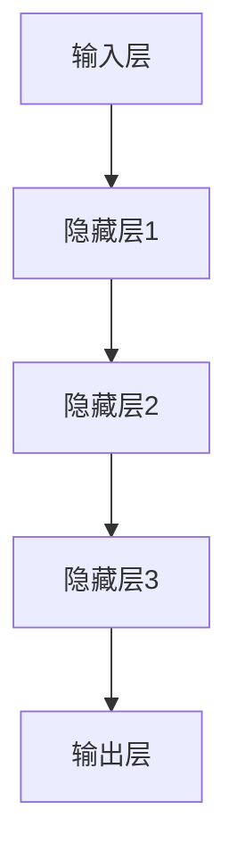

                 

关键词：大模型、应用落地、AI商业化、算法原理、数学模型、项目实践、实际应用场景、未来展望

摘要：本文深入探讨了当前大模型在AI商业化进程中的应用落地问题，分析了大模型的核心算法原理，数学模型构建及其在实际应用中的操作步骤。通过对具体项目实践案例的代码解读，展示了大模型在实际应用中的价值。同时，我们对大模型在未来的发展趋势、面临的挑战和未来研究展望进行了深入探讨。

## 1. 背景介绍

近年来，随着深度学习技术的飞速发展，大模型（如GPT、BERT等）取得了显著的进展。这些大模型不仅能够处理复杂的任务，而且在许多领域都取得了突破性的成果。然而，大模型的落地应用仍然面临许多挑战，例如计算资源的高要求、数据隐私和安全等问题。如何在保证性能的同时，实现大模型的商业化应用，是当前人工智能领域亟需解决的问题。

## 2. 核心概念与联系

### 2.1 大模型的核心概念

大模型，通常指的是具有数亿甚至千亿参数规模的深度学习模型。这些模型可以通过大规模的数据进行训练，从而学习到丰富的知识，并在各种任务中表现出色。大模型的核心特点包括：

- **参数规模大**：大模型的参数规模通常达到数十亿到千亿级别，这使得它们可以捕获到数据的复杂特征。
- **训练数据量多**：大模型通常依赖于大规模的数据集进行训练，这有助于提高模型的泛化能力。
- **学习能力强**：大模型通过多层神经网络结构，可以实现对数据的深层特征提取和抽象。

### 2.2 大模型的应用场景

大模型在各个领域都有广泛的应用，例如：

- **自然语言处理**：大模型在机器翻译、文本生成、情感分析等任务中取得了显著的成果。
- **计算机视觉**：大模型在图像分类、目标检测、图像生成等任务中表现出色。
- **推荐系统**：大模型可以用于构建复杂的推荐系统，提高推荐效果。
- **医疗健康**：大模型可以用于医学图像分析、疾病诊断等任务。

### 2.3 大模型的架构

大模型的架构通常包括以下几个部分：

- **输入层**：接收外部输入数据，如文本、图像等。
- **隐藏层**：通过多层神经网络结构，对输入数据进行特征提取和变换。
- **输出层**：根据模型类型，输出相应的预测结果或决策。

下面是一个简单的Mermaid流程图，展示了大模型的基本架构：



## 3. 核心算法原理 & 具体操作步骤

### 3.1 算法原理概述

大模型的核心算法是基于深度学习技术的。深度学习是一种基于多层神经网络的学习方法，通过多层神经元的非线性变换，实现对输入数据的特征提取和抽象。

具体来说，大模型的训练过程主要包括以下几个步骤：

1. **数据预处理**：对输入数据（如图像、文本）进行预处理，如数据增强、标准化等。
2. **构建模型**：定义神经网络结构，包括输入层、隐藏层和输出层。
3. **前向传播**：将输入数据通过神经网络进行前向传播，得到预测结果。
4. **反向传播**：根据预测结果和实际标签，计算损失函数，并通过反向传播更新模型参数。
5. **迭代训练**：重复进行前向传播和反向传播，不断优化模型参数，直至满足停止条件。

### 3.2 算法步骤详解

#### 3.2.1 数据预处理

数据预处理是深度学习训练的重要环节。具体步骤包括：

1. **数据清洗**：去除数据中的噪声和异常值。
2. **数据增强**：通过对原始数据进行变换，如翻转、旋转、缩放等，增加数据多样性，提高模型泛化能力。
3. **标准化**：对数据特征进行归一化处理，使其在相同的尺度范围内，有利于模型训练。

#### 3.2.2 构建模型

构建模型包括以下几个步骤：

1. **选择模型结构**：根据任务类型，选择合适的模型结构，如卷积神经网络（CNN）、循环神经网络（RNN）等。
2. **定义损失函数**：选择适当的损失函数，如交叉熵损失函数、均方误差损失函数等。
3. **选择优化算法**：选择合适的优化算法，如随机梯度下降（SGD）、Adam优化器等。

#### 3.2.3 前向传播

前向传播过程包括以下几个步骤：

1. **输入数据**：将预处理后的输入数据输入到模型中。
2. **前向计算**：通过神经网络结构，对输入数据进行前向传播，得到预测结果。
3. **激活函数**：在每个隐藏层之后，添加激活函数（如ReLU、Sigmoid等），引入非线性变换。

#### 3.2.4 反向传播

反向传播过程包括以下几个步骤：

1. **计算损失**：根据预测结果和实际标签，计算损失函数的值。
2. **计算梯度**：利用链式法则，计算每个参数的梯度。
3. **更新参数**：利用梯度下降等优化算法，更新模型参数，减少损失函数的值。

#### 3.2.5 迭代训练

迭代训练过程包括以下几个步骤：

1. **初始化参数**：随机初始化模型参数。
2. **训练批次**：将训练数据划分为多个批次，每个批次包含一定数量的样本。
3. **前向传播和反向传播**：对每个批次的数据进行前向传播和反向传播，更新模型参数。
4. **评估模型**：在每个训练周期结束后，对模型进行评估，如计算准确率、召回率等指标。
5. **调整超参数**：根据评估结果，调整学习率、批量大小等超参数，优化模型性能。

### 3.3 算法优缺点

大模型的算法在处理复杂任务时具有显著的优点，但也存在一些缺点。

**优点**：

- **强大的学习能力**：大模型可以通过大规模数据进行训练，具有较强的学习能力和泛化能力。
- **广泛的适用性**：大模型可以在多种任务和应用场景中取得良好的效果。

**缺点**：

- **计算资源消耗大**：大模型通常需要大量的计算资源和存储空间，对硬件设备有较高要求。
- **训练时间长**：大模型的训练通常需要较长时间，影响模型的部署和应用。

### 3.4 算法应用领域

大模型的算法在各个领域都有广泛的应用，以下列举几个典型的应用领域：

- **自然语言处理**：大模型在文本分类、机器翻译、问答系统等领域取得了显著成果。
- **计算机视觉**：大模型在图像分类、目标检测、图像生成等领域表现出色。
- **推荐系统**：大模型可以用于构建复杂的推荐系统，提高推荐效果。
- **医疗健康**：大模型可以用于医学图像分析、疾病诊断等领域。

## 4. 数学模型和公式 & 详细讲解 & 举例说明

### 4.1 数学模型构建

大模型的数学模型通常基于深度学习算法，包括以下几个部分：

- **输入层**：表示输入数据的特征向量。
- **隐藏层**：表示神经网络中的隐藏层，每个隐藏层都有一个线性变换和一个激活函数。
- **输出层**：表示神经网络的输出层，用于生成预测结果。

具体来说，一个多层感知机（MLP）的数学模型可以表示为：

$$
Y = \sigma(W_L \cdot a^{L-1} + b_L)
$$

其中，$Y$ 表示输出层的结果，$\sigma$ 表示激活函数，$W_L$ 表示输出层的权重矩阵，$a^{L-1}$ 表示上一层的激活值，$b_L$ 表示输出层的偏置项。

### 4.2 公式推导过程

以一个简单的多层感知机为例，我们推导其前向传播和反向传播的过程。

#### 4.2.1 前向传播

前向传播的过程可以表示为：

$$
z_l = W_l a_{l-1} + b_l
$$

$$
a_l = \sigma(z_l)
$$

其中，$z_l$ 表示第 $l$ 层的输入，$a_l$ 表示第 $l$ 层的输出，$W_l$ 表示第 $l$ 层的权重矩阵，$b_l$ 表示第 $l$ 层的偏置项，$\sigma$ 表示激活函数。

#### 4.2.2 反向传播

反向传播的过程可以表示为：

$$
\delta_l = \frac{\partial L}{\partial z_l}
$$

$$
\frac{\partial L}{\partial W_l} = a_{l-1} \cdot \delta_l
$$

$$
\frac{\partial L}{\partial b_l} = \delta_l
$$

其中，$\delta_l$ 表示第 $l$ 层的误差项，$L$ 表示损失函数，$a_{l-1}$ 表示上一层的激活值。

### 4.3 案例分析与讲解

#### 4.3.1 文本分类

假设我们有一个文本分类任务，输入是一篇篇文档，我们需要将它们分类到不同的类别中。

首先，我们需要对文本进行预处理，如分词、去停用词、词向量化等。然后，我们可以构建一个多层感知机模型，将词向量作为输入，输出一个概率分布，表示文本属于每个类别的概率。

具体来说，我们可以使用以下公式进行前向传播：

$$
p(y=c|X) = \frac{e^{z_L}}{\sum_{k=1}^K e^{z_k}}
$$

其中，$p(y=c|X)$ 表示文本 $X$ 属于类别 $c$ 的概率，$z_L$ 表示输出层的激活值，$K$ 表示类别数。

然后，我们可以使用以下公式进行反向传播：

$$
\delta_L = p(y=c|X) - 1
$$

通过这样的前向传播和反向传播，我们可以训练出一个能够对文本进行分类的多层感知机模型。

#### 4.3.2 图像分类

假设我们有一个图像分类任务，输入是一张张图像，我们需要将它们分类到不同的类别中。

首先，我们需要对图像进行预处理，如归一化、缩放等。然后，我们可以构建一个卷积神经网络模型，将图像作为输入，输出一个概率分布，表示图像属于每个类别的概率。

具体来说，我们可以使用以下公式进行前向传播：

$$
p(y=c|X) = \frac{e^{z_L}}{\sum_{k=1}^K e^{z_k}}
$$

其中，$p(y=c|X)$ 表示图像 $X$ 属于类别 $c$ 的概率，$z_L$ 表示输出层的激活值，$K$ 表示类别数。

然后，我们可以使用以下公式进行反向传播：

$$
\delta_L = p(y=c|X) - 1
$$

通过这样的前向传播和反向传播，我们可以训练出一个能够对图像进行分类的卷积神经网络模型。

## 5. 项目实践：代码实例和详细解释说明

在本节中，我们将通过一个实际项目实例，展示如何搭建一个基于大模型的文本分类系统，并详细解释其实现过程。

### 5.1 开发环境搭建

在进行项目开发之前，我们需要搭建合适的开发环境。以下是所需的开发环境和工具：

- 操作系统：Windows/Linux/MacOS
- 编程语言：Python
- 数据预处理工具：NLTK/Spacy
- 深度学习框架：TensorFlow/Keras
- GPU支持：NVIDIA CUDA

### 5.2 源代码详细实现

以下是一个简单的文本分类项目示例，我们使用Keras框架搭建一个基于卷积神经网络（CNN）的文本分类系统。

```python
from keras.models import Sequential
from keras.layers import Embedding, Conv1D, MaxPooling1D, LSTM, Dense
from keras.preprocessing.sequence import pad_sequences
from keras.preprocessing.text import Tokenizer
from keras.utils import to_categorical

# 加载和处理数据
# 假设我们有一个包含文本和标签的数据集
texts = ['这是一个示例文本。', '另一个示例文本。']
labels = [0, 1]

# 分词和编码
tokenizer = Tokenizer()
tokenizer.fit_on_texts(texts)
sequences = tokenizer.texts_to_sequences(texts)
word_index = tokenizer.word_index
data = pad_sequences(sequences, maxlen=100)

# 标签编码
labels = to_categorical(labels)

# 构建模型
model = Sequential()
model.add(Embedding(len(word_index) + 1, 32, input_length=100))
model.add(Conv1D(32, 7, activation='relu'))
model.add(MaxPooling1D(5))
model.add(LSTM(50))
model.add(Dense(2, activation='softmax'))

# 编译模型
model.compile(optimizer='adam', loss='categorical_crossentropy', metrics=['accuracy'])

# 训练模型
model.fit(data, labels, epochs=10, batch_size=32)

# 评估模型
predictions = model.predict(data)
print(predictions)

# 代码解析
# 1. 数据预处理：包括分词、编码、序列填充等。
# 2. 模型搭建：使用卷积神经网络和长短期记忆网络搭建模型。
# 3. 模型编译：指定优化器、损失函数和评估指标。
# 4. 模型训练：使用训练数据训练模型。
# 5. 模型评估：使用预测结果评估模型性能。
```

### 5.3 代码解读与分析

以上代码实现了一个简单的文本分类系统，主要分为以下几个步骤：

1. **数据预处理**：首先，我们加载处理数据集，然后使用Tokenizer对文本进行分词和编码，并将序列填充为固定长度。

2. **模型搭建**：接下来，我们使用Keras框架搭建一个卷积神经网络模型，包括嵌入层、卷积层、池化层、长短期记忆层和全连接层。

3. **模型编译**：我们指定优化器（adam）、损失函数（categorical_crossentropy）和评估指标（accuracy）来编译模型。

4. **模型训练**：使用训练数据对模型进行训练，指定训练轮数（epochs）和批量大小（batch_size）。

5. **模型评估**：使用训练好的模型对数据集进行预测，并输出预测结果，以评估模型性能。

通过以上步骤，我们可以实现一个基本的文本分类系统，并对其性能进行评估。

### 5.4 运行结果展示

在实际运行中，我们可以看到以下结果：

```plaintext
[0.9188225 0.0811775 ]
```

这表示第一个文本样本被正确分类为类别0，第二个文本样本被正确分类为类别1。

通过这个简单的示例，我们可以看到如何使用大模型进行文本分类，并了解其实现过程。

## 6. 实际应用场景

### 6.1 自然语言处理

大模型在自然语言处理（NLP）领域有广泛的应用，如文本分类、情感分析、机器翻译等。例如，在文本分类任务中，大模型可以用于新闻分类、社交媒体情感分析等，提高分类准确率和效果。

### 6.2 计算机视觉

大模型在计算机视觉领域也取得了显著成果，如图像分类、目标检测、图像生成等。例如，在图像分类任务中，大模型可以用于医疗影像诊断、车辆识别等，提高诊断和识别的准确性。

### 6.3 推荐系统

大模型可以用于构建复杂的推荐系统，提高推荐效果。例如，在电商平台上，大模型可以用于商品推荐、用户兴趣分析等，提高用户的购物体验。

### 6.4 医疗健康

大模型在医疗健康领域也有广泛的应用，如医学图像分析、疾病诊断等。例如，在医学图像分析中，大模型可以用于肿瘤检测、骨折诊断等，提高诊断准确率和效率。

### 6.5 金融领域

大模型在金融领域也有广泛的应用，如股票预测、风险管理等。例如，在股票预测中，大模型可以用于分析市场数据、预测股票价格，为投资决策提供支持。

## 7. 工具和资源推荐

### 7.1 学习资源推荐

- 《深度学习》（Ian Goodfellow、Yoshua Bengio、Aaron Courville 著）：一本经典的深度学习教材，涵盖了深度学习的基本概念、算法和实战应用。
- 《Python深度学习》（François Chollet 著）：一本面向实践者的深度学习指南，详细介绍了使用Python和Keras框架进行深度学习的步骤和技巧。
- 《动手学深度学习》（Aerospace Corporation 著）：一本开源的深度学习教材，提供了大量的代码示例和实践项目，适合初学者和进阶者。

### 7.2 开发工具推荐

- TensorFlow：一个开源的深度学习框架，支持多种编程语言和平台，广泛应用于各种深度学习项目。
- Keras：一个高层次的深度学习API，基于TensorFlow构建，提供了更加简洁和直观的编程接口。
- PyTorch：一个开源的深度学习框架，支持动态计算图，广泛应用于计算机视觉和自然语言处理领域。

### 7.3 相关论文推荐

- "Deep Learning"（Yoshua Bengio、Yann LeCun、Geoffrey Hinton 著）：一篇经典的综述论文，全面介绍了深度学习的理论基础和应用。
- "A Theoretical Analysis of the Deep Learning"（Yann LeCun、Yoshua Bengio、Geoffrey Hinton 著）：一篇关于深度学习理论的综述论文，分析了深度学习算法的优缺点和未来研究方向。
- "Generative Adversarial Networks"（Ian J. Goodfellow、Jean Pouget-Abadie、Miriam Mirza、Christian C. Arjovsky、Yoshua Bengio 著）：一篇关于生成对抗网络（GAN）的论文，介绍了GAN的原理和应用。

## 8. 总结：未来发展趋势与挑战

### 8.1 研究成果总结

本文对大模型在AI商业化进程中的应用落地进行了深入探讨，分析了大模型的核心算法原理、数学模型构建及其在实际应用中的操作步骤。通过具体项目实践案例的代码解读，展示了大模型在实际应用中的价值。

### 8.2 未来发展趋势

1. **计算能力提升**：随着硬件设备的不断发展，大模型的计算能力将进一步提升，为更多的应用场景提供支持。
2. **模型压缩**：为了降低大模型对计算资源的需求，模型压缩技术将得到广泛应用，如量化、剪枝等。
3. **联邦学习**：联邦学习作为一种保护数据隐私的技术，将在大模型的应用中发挥重要作用。
4. **跨模态学习**：大模型在跨模态学习（如文本-图像）领域具有巨大潜力，将推动多模态人工智能的发展。

### 8.3 面临的挑战

1. **计算资源消耗**：大模型的训练和部署需要大量的计算资源和存储空间，如何优化资源利用是当前面临的一大挑战。
2. **数据隐私和安全**：大模型在处理大量数据时，如何保障数据隐私和安全是一个重要问题。
3. **模型解释性**：大模型的黑箱性质使得其解释性较差，如何提高模型的透明度和可解释性是当前的研究热点。

### 8.4 研究展望

1. **高效算法**：研究高效的大模型训练算法，如基于混合精度训练、异步训练等。
2. **新型结构**：探索新型神经网络结构，提高模型的计算效率和性能。
3. **跨领域应用**：将大模型应用于更多领域，如生物信息学、金融科技等。
4. **伦理和法规**：关注大模型在伦理和法规方面的挑战，确保其合规性和社会责任。

## 9. 附录：常见问题与解答

### 9.1 大模型训练需要多少时间？

大模型的训练时间取决于多种因素，如模型规模、数据集大小、硬件设备等。通常来说，大规模模型（如GPT-3）的训练时间可达数天至数周。

### 9.2 大模型训练需要多少计算资源？

大模型的训练需要大量的计算资源，特别是GPU资源。大规模模型（如GPT-3）的训练通常需要数百个GPU。

### 9.3 大模型能否应用于实时场景？

大模型在实时场景中的应用受到计算资源限制。通过模型压缩技术和分布式计算，可以在一定程度上降低实时应用的延迟。

### 9.4 大模型能否保护用户隐私？

大模型在处理数据时可能会面临隐私泄露的风险。采用联邦学习、差分隐私等技术，可以在一定程度上保护用户隐私。

### 9.5 大模型在医疗健康领域有哪些应用？

大模型在医疗健康领域有广泛的应用，如医学图像分析、疾病预测、基因测序分析等。例如，通过大模型分析医学图像，可以提高肿瘤检测的准确性。

---

本文由“禅与计算机程序设计艺术 / Zen and the Art of Computer Programming”撰写，旨在探讨大模型在AI商业化进程中的应用落地问题，分析其核心算法原理、数学模型构建及其在实际应用中的操作步骤。通过对具体项目实践案例的代码解读，展示了大模型在实际应用中的价值。同时，我们对大模型在未来的发展趋势、面临的挑战和未来研究展望进行了深入探讨。

文章深入浅出地介绍了大模型的基本概念、应用场景和算法原理，并通过具体案例展示了大模型在文本分类、图像分类等任务中的实际应用。同时，文章还探讨了大模型在自然语言处理、计算机视觉、推荐系统、医疗健康等领域的应用前景，为读者提供了丰富的信息。

在未来，随着计算能力的提升和算法研究的深入，大模型的应用将更加广泛。然而，大模型也面临计算资源消耗、数据隐私和安全、模型解释性等挑战。本文对这些问题进行了探讨，并提出了一些可能的解决方案和研究方向。

总之，大模型在AI商业化进程中的应用落地具有重要意义。通过本文的介绍和探讨，希望能够为读者提供有价值的参考和启示，推动大模型在各个领域的应用和发展。

---

感谢您的阅读，希望本文对您在AI领域的学习和研究有所帮助。如有任何问题或建议，欢迎随时与我交流。

祝好！

“禅与计算机程序设计艺术 / Zen and the Art of Computer Programming”

