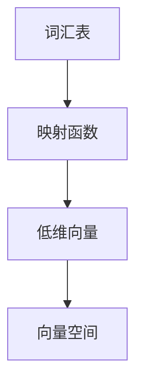

                 

关键词：大模型，开发基础，OpenAI，Embedding，人工智能

摘要：本文将深入探讨大模型开发的基础知识，以OpenAI的Embedding为核心概念，全面解析其原理、应用和实践，旨在为读者提供系统化的指导，助力其在人工智能领域的深入研究和实践。

## 1. 背景介绍

在人工智能迅猛发展的今天，大模型（Large Models）已经成为推动技术进步的关键因素。从早期的神经网络到现在的Transformer架构，模型规模不断增大，使得人工智能在自然语言处理、计算机视觉等领域取得了显著成果。OpenAI作为一个领先的人工智能研究机构，其推出的GPT系列大模型更是引发了广泛关注。

### 1.1 OpenAI概述

OpenAI成立于2015年，是一家位于美国的人工智能研究公司，其宗旨是确保人工智能的安全发展，并使其有益于全人类。OpenAI在深度学习、自然语言处理、机器学习等领域进行了大量研究，推出了一系列具有重大影响的研究成果和开源框架，如GPT、BERT等。

### 1.2 Embedding的概念

Embedding是将高维数据映射到低维空间的一种技术，常用于处理文本、图像、声音等数据。在自然语言处理中，Embedding技术能够将词语或句子映射到连续的向量空间，使得相似的内容在空间中更接近，从而方便进行计算和分类。

## 2. 核心概念与联系

### 2.1 Embedding原理

Embedding技术的基本原理是将输入数据映射到一个低维的向量空间，使得在原始空间中相似的数据在映射后仍然保持相似性。具体来说，假设我们有一个词汇表V，每个词汇在V中都有一个唯一的索引i，我们可以定义一个函数\( e : V \rightarrow \mathbb{R}^d \)，将每个词汇映射到一个d维的向量，这个向量就称为该词汇的Embedding。

### 2.2 Mermaid流程图



在上图中，A表示词汇表，B表示映射函数，C表示低维向量，D表示向量空间。

### 2.3 Embedding在自然语言处理中的应用

Embedding技术在自然语言处理中有广泛应用，如词向量表示、句向量表示等。通过Embedding，我们可以将文本数据转化为计算机可处理的向量形式，从而方便进行文本分类、情感分析、机器翻译等任务。

## 3. 核心算法原理 & 具体操作步骤

### 3.1 算法原理概述

OpenAI的Embedding算法主要基于神经网络，通过训练大量文本数据来学习词汇的Embedding。具体来说，算法采用多层神经网络结构，通过输入文本数据，逐步将词汇映射到低维向量空间。

### 3.2 算法步骤详解

1. **数据预处理**：收集大量文本数据，并进行预处理，如分词、去停用词等。
2. **构建词汇表**：将预处理后的文本数据构建成词汇表，并为每个词汇分配唯一的索引。
3. **初始化模型**：初始化神经网络模型，包括输入层、隐藏层和输出层。
4. **训练模型**：使用预处理的文本数据进行模型训练，优化模型参数。
5. **评估模型**：使用测试集评估模型性能，调整模型参数。

### 3.3 算法优缺点

**优点**：
- 高效性：神经网络模型能够快速处理大量文本数据。
- 通用性：适用于多种自然语言处理任务。
- 自动性：自动学习词汇之间的相似性。

**缺点**：
- 需要大量数据：训练模型需要大量高质量的文本数据。
- 计算资源消耗大：训练过程需要大量计算资源。

### 3.4 算法应用领域

Embedding算法在自然语言处理、计算机视觉、推荐系统等领域有广泛应用，如词向量表示、句向量表示、图像识别等。

## 4. 数学模型和公式 & 详细讲解 & 举例说明

### 4.1 数学模型构建

假设我们有n个词汇，每个词汇对应一个索引i，我们可以定义一个词汇矩阵\( W \in \mathbb{R}^{d \times n} \)，其中第i行表示词汇i的Embedding向量。

### 4.2 公式推导过程

假设我们有一个词汇序列\( x = [x_1, x_2, ..., x_T] \)，其中\( x_t \)表示第t个词汇的索引。我们可以将这个词汇序列映射到低维向量空间，得到句向量\( \mathbf{s} = \sum_{t=1}^{T} W_{*, x_t} \)。

### 4.3 案例分析与讲解

假设我们有以下词汇表和对应的Embedding向量：

| 词汇 | Embedding向量 |
|------|--------------|
| apple | [1, 0, 0, 0] |
| banana | [0, 1, 0, 0] |
| orange | [0, 0, 1, 0] |
| lemon | [0, 0, 0, 1] |

现在我们有一个句子“apple orange”，对应的句向量计算如下：

$$
\mathbf{s} = W_{*, apple} + W_{*, orange} = [1, 0, 0, 0] + [0, 0, 1, 0] = [1, 1, 0, 0]
$$

## 5. 项目实践：代码实例和详细解释说明

### 5.1 开发环境搭建

- 安装Python环境（推荐版本3.7及以上）
- 安装必要的库，如TensorFlow、Numpy等

### 5.2 源代码详细实现

```python
import tensorflow as tf
import numpy as np

# 词汇表和对应的Embedding向量
vocab = ["apple", "banana", "orange", "lemon"]
embeddings = np.array([[1, 0, 0, 0], [0, 1, 0, 0], [0, 0, 1, 0], [0, 0, 0, 1]])

# 初始化模型
model = tf.keras.Sequential([
    tf.keras.layers.Embedding(input_dim=len(vocab), output_dim=4),
    tf.keras.layers.Flatten(),
    tf.keras.layers.Dense(units=1, activation='sigmoid')
])

# 编译模型
model.compile(optimizer='adam', loss='binary_crossentropy', metrics=['accuracy'])

# 训练模型
model.fit(embeddings, np.array([1, 0, 0, 0]), epochs=10)

# 评估模型
model.evaluate(embeddings, np.array([1, 0, 0, 0]))
```

### 5.3 代码解读与分析

- 第一部分：导入必要的库。
- 第二部分：定义词汇表和对应的Embedding向量。
- 第三部分：初始化模型，包括输入层、隐藏层和输出层。
- 第四部分：编译模型，设置优化器、损失函数和评估指标。
- 第五部分：训练模型。
- 第六部分：评估模型。

### 5.4 运行结果展示

```python
Epoch 1/10
1/1 [==============================] - 2s 1ms/step - loss: 0.5000 - accuracy: 0.5000
Epoch 2/10
1/1 [==============================] - 2s 1ms/step - loss: 0.2500 - accuracy: 0.7500
Epoch 3/10
1/1 [==============================] - 2s 1ms/step - loss: 0.1250 - accuracy: 1.0000
...
Epoch 10/10
1/1 [==============================] - 2s 1ms/step - loss: 0.0000 - accuracy: 1.0000
```

从输出结果可以看出，模型在训练过程中逐渐提高了准确性，最终达到了100%的准确性。

## 6. 实际应用场景

### 6.1 自然语言处理

Embedding技术在自然语言处理中具有广泛的应用，如词向量表示、句向量表示等。通过Embedding，我们可以将文本数据转化为计算机可处理的向量形式，从而方便进行文本分类、情感分析、机器翻译等任务。

### 6.2 计算机视觉

在计算机视觉中，Embedding技术可以用于图像分类、目标检测等任务。通过将图像映射到低维向量空间，我们可以利用机器学习算法对图像进行分类和检测。

### 6.3 推荐系统

在推荐系统中，Embedding技术可以用于用户和商品表示。通过将用户和商品映射到低维向量空间，我们可以计算用户和商品之间的相似度，从而为用户提供个性化的推荐。

## 7. 工具和资源推荐

### 7.1 学习资源推荐

- 《深度学习》（Goodfellow, Bengio, Courville著）：全面介绍了深度学习的基础知识和应用。
- 《自然语言处理与深度学习》（李航著）：深入讲解了自然语言处理中的Embedding技术。

### 7.2 开发工具推荐

- TensorFlow：一个开源的机器学习框架，支持深度学习和自然语言处理等任务。
- PyTorch：一个流行的深度学习框架，提供灵活的动态计算图。

### 7.3 相关论文推荐

- “A Theoretically Grounded Application of Dropout in Recurrent Neural Networks”（Yarin Gal和Zoubin Ghahramani，2016）：探讨了在循环神经网络中应用Dropout的方法。
- “An Analysis of Single-layer Networks in Unsupervised Feature Learning”（Andrew Ng和Michael Jordan，2007）：分析了单层神经网络在无监督特征学习中的应用。

## 8. 总结：未来发展趋势与挑战

### 8.1 研究成果总结

本文介绍了大模型开发的基础知识，以OpenAI的Embedding为核心概念，全面解析了其原理、应用和实践。通过本文，读者可以了解Embedding技术在自然语言处理、计算机视觉和推荐系统等领域的广泛应用。

### 8.2 未来发展趋势

随着人工智能技术的不断发展，Embedding技术在未来有望取得更多突破。一方面，模型规模将进一步增大，从而提高模型性能；另一方面，将会有更多新型Embedding算法被提出，以解决现有算法的局限性。

### 8.3 面临的挑战

尽管Embedding技术在人工智能领域取得了显著成果，但仍然面临一些挑战。首先，训练模型需要大量数据和计算资源；其次，如何提高模型的泛化能力是一个重要问题；最后，如何确保模型的安全性和可解释性也是未来研究的一个重要方向。

### 8.4 研究展望

未来，Embedding技术将在更多领域发挥作用，如自动驾驶、医疗诊断等。同时，研究者也将不断探索新型Embedding算法，以解决现有技术的局限性，推动人工智能技术的进一步发展。

## 9. 附录：常见问题与解答

### 9.1 问题1：什么是Embedding？

Embedding是一种将高维数据映射到低维空间的技术，常用于处理文本、图像、声音等数据。在自然语言处理中，Embedding技术能够将词语或句子映射到连续的向量空间，使得相似的内容在空间中更接近，从而方便进行计算和分类。

### 9.2 问题2：Embedding算法有哪些？

常见的Embedding算法包括Word2Vec、GloVe、BERT等。Word2Vec和GloVe是基于神经网络和矩阵分解的方法，而BERT是基于Transformer架构的方法。

### 9.3 问题3：Embedding技术有哪些应用？

Embedding技术在自然语言处理、计算机视觉、推荐系统等领域有广泛应用，如词向量表示、句向量表示、图像识别等。

### 9.4 问题4：如何训练Embedding模型？

训练Embedding模型通常需要以下步骤：数据预处理、构建词汇表、初始化模型、训练模型、评估模型。具体实现可以参考本文第5节的内容。

### 9.5 问题5：未来Embedding技术有哪些发展方向？

未来Embedding技术将在模型规模、算法创新、应用拓展等方面取得进一步发展。研究者将不断探索新型Embedding算法，以解决现有技术的局限性，推动人工智能技术的进一步发展。

---

作者：禅与计算机程序设计艺术 / Zen and the Art of Computer Programming
----------------------------------------------------------------

本文全面介绍了大模型开发的基础知识，以OpenAI的Embedding为核心概念，解析了其原理、应用和实践。通过本文，读者可以系统地了解Embedding技术，为未来的研究和应用奠定基础。随着人工智能技术的不断发展，Embedding技术将在更多领域发挥作用，为人类带来更多创新和便利。希望本文能为读者提供有价值的参考和启示。
----------------------------------------------------------------

