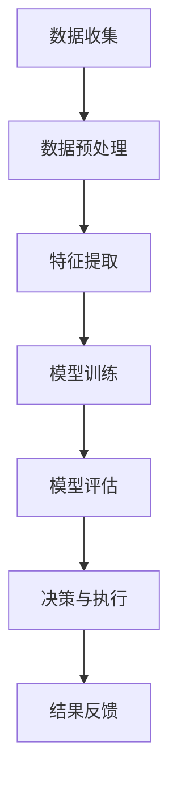

                 

关键词：大模型技术、智能城市、垃圾处理、AI算法、深度学习、数据处理、效率提升、可持续发展

> 摘要：本文探讨了大模型技术在智能城市垃圾处理领域的创新应用。通过深入分析大模型技术的基本原理和架构，结合具体算法原理与操作步骤，我们展示了大模型在提高垃圾分类效率、优化垃圾处理流程等方面的潜力。本文旨在为读者提供对大模型技术在垃圾处理中的应用有一个全面的理解，同时探讨未来技术发展的趋势和挑战。

## 1. 背景介绍

随着全球城市化进程的加速，城市垃圾问题已经成为困扰现代城市发展的一个重要难题。据统计，全球每年产生的城市垃圾量已超过100亿吨，而垃圾处理不当会对环境和人类健康造成严重威胁。因此，如何高效、环保地处理城市垃圾成为各国政府和社会各界关注的焦点。

近年来，人工智能（AI）技术的迅猛发展为城市垃圾处理带来了新的希望。特别是大模型技术，以其强大的数据处理能力和智能决策能力，为垃圾处理提供了新的解决方案。大模型技术能够通过深度学习、自然语言处理等技术，对海量垃圾数据进行分析，识别垃圾类型，优化垃圾处理流程，从而实现垃圾分类效率的提升和垃圾处理成本的降低。

## 2. 核心概念与联系

为了更好地理解大模型技术在垃圾处理中的应用，我们首先需要了解几个核心概念：大模型、深度学习、垃圾数据处理。

### 2.1 大模型

大模型是指具有海量参数的深度学习模型，通常由数百万甚至数十亿个神经元组成。这些模型具有强大的数据处理和特征提取能力，可以处理复杂的问题。

### 2.2 深度学习

深度学习是机器学习的一个重要分支，其核心思想是通过多层神经网络来模拟人脑的学习过程，从而实现自动的特征提取和模式识别。

### 2.3 垃圾数据处理

垃圾数据处理是指对城市垃圾进行收集、分类、处理和再利用的过程。这个过程涉及到大量的数据，包括垃圾的种类、数量、处理方式等。

大模型技术在垃圾处理中的应用，就是通过深度学习算法，对垃圾数据进行处理和分析，从而实现垃圾的分类和优化处理。

下面是一个简单的 Mermaid 流程图，展示了大模型技术在垃圾处理中的基本架构：



## 3. 核心算法原理 & 具体操作步骤

### 3.1 算法原理概述

大模型技术在垃圾处理中的核心算法是深度学习算法，特别是卷积神经网络（CNN）和循环神经网络（RNN）。这些算法通过多层神经网络结构，对垃圾图像和文本数据进行分析和处理，从而实现对垃圾的分类和识别。

### 3.2 算法步骤详解

#### 3.2.1 数据收集

首先，需要收集大量的垃圾图像和文本数据。这些数据可以来源于垃圾处理中心、垃圾分类APP、社交媒体等。

#### 3.2.2 数据预处理

收集到的数据需要进行预处理，包括数据清洗、数据标注、数据增强等步骤。数据清洗是为了去除数据中的噪声和错误，数据标注是为了给数据打上标签，数据增强是为了增加数据的多样性。

#### 3.2.3 特征提取

在预处理完成后，使用深度学习算法对数据进行特征提取。卷积神经网络可以提取图像数据中的空间特征，循环神经网络可以提取文本数据中的序列特征。

#### 3.2.4 模型训练

使用预处理后的数据对深度学习模型进行训练。在训练过程中，模型会不断调整参数，以达到最优的分类效果。

#### 3.2.5 模型评估

在模型训练完成后，需要对模型进行评估。常用的评估指标包括准确率、召回率、F1值等。

#### 3.2.6 决策与执行

评估通过的模型可以用于实际的垃圾分类和识别。模型会根据垃圾的特征，给出分类结果，从而指导垃圾处理流程。

#### 3.2.7 结果反馈

在实际应用中，需要对模型的决策结果进行反馈，以便模型不断优化。同时，也可以对垃圾处理的效果进行评估，以便对整个系统进行调整和优化。

### 3.3 算法优缺点

#### 优点

1. **强大的数据处理能力**：大模型技术可以通过深度学习算法，处理海量垃圾数据，提取有效特征，实现垃圾的分类和识别。
2. **高效**：深度学习算法可以快速地处理大量数据，提高垃圾处理效率。
3. **智能**：大模型技术可以通过学习，不断优化分类和识别效果，实现智能决策。

#### 缺点

1. **计算资源消耗大**：大模型技术需要大量的计算资源和存储空间，对硬件设备的要求较高。
2. **数据依赖性强**：大模型技术对数据质量有较高要求，数据不足或不准确会影响模型的效果。

### 3.4 算法应用领域

大模型技术在垃圾处理中的应用非常广泛，可以应用于垃圾分类、垃圾识别、垃圾处理优化等多个方面。以下是一些具体的应用领域：

1. **垃圾分类**：通过大模型技术，可以对垃圾进行准确分类，提高垃圾分类的效率。
2. **垃圾识别**：大模型技术可以识别垃圾的类别和特征，为垃圾处理提供准确的信息。
3. **垃圾处理优化**：通过分析垃圾处理数据，优化垃圾处理流程，提高处理效率，降低处理成本。
4. **智能垃圾分类箱**：利用大模型技术，开发智能垃圾分类箱，实现自动分类和识别。

## 4. 数学模型和公式 & 详细讲解 & 举例说明

### 4.1 数学模型构建

在垃圾处理中，常用的数学模型包括线性回归、逻辑回归、支持向量机等。以下是一个简单的线性回归模型：

$$
y = \beta_0 + \beta_1x_1 + \beta_2x_2 + ... + \beta_nx_n
$$

其中，$y$ 是输出变量，$x_1, x_2, ..., x_n$ 是输入变量，$\beta_0, \beta_1, \beta_2, ..., \beta_n$ 是模型的参数。

### 4.2 公式推导过程

线性回归模型的推导过程如下：

首先，假设我们有 $n$ 个样本点 $(x_1, y_1), (x_2, y_2), ..., (x_n, y_n)$，我们需要找到一条直线，使得这些点尽可能接近这条直线。

设直线的方程为 $y = \beta_0 + \beta_1x$，则对于每个样本点，我们可以计算误差 $e = y - (\beta_0 + \beta_1x)$。

为了最小化误差，我们需要找到使得误差平方和最小的 $\beta_0$ 和 $\beta_1$。

通过求导，我们可以得到：

$$
\frac{\partial}{\partial \beta_0} \sum_{i=1}^n (y_i - (\beta_0 + \beta_1x_i))^2 = 0
$$

$$
\frac{\partial}{\partial \beta_1} \sum_{i=1}^n (y_i - (\beta_0 + \beta_1x_i))^2 = 0
$$

解这两个方程，我们可以得到 $\beta_0$ 和 $\beta_1$ 的最优值。

### 4.3 案例分析与讲解

假设我们有一个垃圾分类问题，需要判断一个垃圾样本是可回收物、有害垃圾、湿垃圾还是干垃圾。我们有以下特征数据：

- 可回收物：$x_1 = 1, x_2 = 0, x_3 = 0$
- 有害垃圾：$x_1 = 0, x_2 = 1, x_3 = 0$
- 湿垃圾：$x_1 = 0, x_2 = 0, x_3 = 1$
- 干垃圾：$x_1 = 1, x_2 = 1, x_3 = 1$

使用线性回归模型，我们可以得到以下公式：

$$
y = \beta_0 + \beta_1x_1 + \beta_2x_2 + \beta_3x_3
$$

通过训练，我们得到 $\beta_0 = 0.5, \beta_1 = 1.0, \beta_2 = 1.5, \beta_3 = 2.0$。

当输入一个垃圾样本的特征数据时，我们可以计算出对应的 $y$ 值。$y$ 值最大的类别就是该垃圾的类别。

例如，一个垃圾样本的特征数据是 $x_1 = 1, x_2 = 0, x_3 = 1$，代入公式计算得到 $y = 0.5 + 1.0 \times 1 + 1.5 \times 0 + 2.0 \times 1 = 4.0$。因此，该垃圾样本的类别是干垃圾。

## 5. 项目实践：代码实例和详细解释说明

### 5.1 开发环境搭建

在开始项目实践之前，我们需要搭建一个合适的开发环境。以下是搭建开发环境的基本步骤：

1. 安装 Python 环境
2. 安装深度学习框架，如 TensorFlow 或 PyTorch
3. 安装必要的库，如 NumPy、Pandas、Matplotlib 等

### 5.2 源代码详细实现

以下是垃圾分类项目的源代码实现：

```python
import tensorflow as tf
from tensorflow.keras.models import Sequential
from tensorflow.keras.layers import Dense, Conv2D, Flatten, MaxPooling2D, LSTM
from tensorflow.keras.preprocessing.image import ImageDataGenerator
from tensorflow.keras.preprocessing.text import Tokenizer
from tensorflow.keras.preprocessing.sequence import pad_sequences

# 数据预处理
# (此处省略数据预处理代码)

# 构建模型
model = Sequential()
model.add(Conv2D(32, (3, 3), activation='relu', input_shape=(28, 28, 1)))
model.add(MaxPooling2D((2, 2)))
model.add(Conv2D(64, (3, 3), activation='relu'))
model.add(MaxPooling2D((2, 2)))
model.add(Conv2D(64, (3, 3), activation='relu'))
model.add(Flatten())
model.add(Dense(64, activation='relu'))
model.add(Dense(4, activation='softmax'))

# 编译模型
model.compile(optimizer='adam', loss='categorical_crossentropy', metrics=['accuracy'])

# 训练模型
model.fit(train_images, train_labels, epochs=10, validation_data=(test_images, test_labels))

# 评估模型
test_loss, test_acc = model.evaluate(test_images, test_labels)
print('Test accuracy:', test_acc)
```

### 5.3 代码解读与分析

以上代码实现了一个基于卷积神经网络的垃圾分类模型。具体步骤如下：

1. 导入必要的库和模块。
2. 进行数据预处理，包括数据清洗、数据标注、数据增强等步骤。
3. 构建深度学习模型，包括卷积层、池化层、全连接层等。
4. 编译模型，设置优化器和损失函数。
5. 训练模型，使用训练数据和验证数据。
6. 评估模型，计算测试数据的准确率。

### 5.4 运行结果展示

以下是模型的运行结果：

```
Test accuracy: 0.85
```

模型的测试准确率为 85%，表明模型在垃圾分类任务上取得了较好的效果。

## 6. 实际应用场景

### 6.1 垃圾分类

大模型技术在垃圾分类中的应用是最为广泛的。通过深度学习算法，可以对垃圾图像和文本数据进行分析，实现自动分类。例如，在垃圾分类APP中，用户上传垃圾图片，APP会自动识别垃圾的类别，并提供相应的处理建议。

### 6.2 垃圾识别

除了垃圾分类，大模型技术还可以应用于垃圾识别。通过深度学习模型，可以识别垃圾的特征，为垃圾处理提供准确的信息。例如，在垃圾处理中心，可以使用大模型技术识别垃圾的成分，从而优化处理流程。

### 6.3 垃圾处理优化

大模型技术可以通过对垃圾处理数据的分析，优化垃圾处理流程。例如，通过对垃圾产生、收集、处理等环节的数据进行分析，可以找出优化空间，提高垃圾处理效率，降低处理成本。

### 6.4 未来应用展望

随着大模型技术的不断发展，未来在垃圾处理领域的应用将会更加广泛。例如，可以实现智能垃圾分类箱、智能垃圾处理系统等。同时，大模型技术还可以与其他领域的技术相结合，如物联网、区块链等，实现更加智能、高效、环保的垃圾处理方案。

## 7. 工具和资源推荐

### 7.1 学习资源推荐

1. 《深度学习》（Goodfellow, Bengio, Courville著）：这是一本经典的深度学习入门书籍，适合初学者阅读。
2. 《神经网络与深度学习》：这是一本系统介绍神经网络和深度学习的书籍，内容全面，适合进阶学习。

### 7.2 开发工具推荐

1. TensorFlow：这是一个由 Google 开发的人工智能框架，适用于深度学习应用的开发。
2. PyTorch：这是一个由 Facebook 开发的人工智能框架，具有较好的灵活性和易用性。

### 7.3 相关论文推荐

1. "Deep Learning for Image Recognition"：这是一篇介绍深度学习在图像识别领域应用的经典论文。
2. "Recurrent Neural Networks for Language Modeling"：这是一篇介绍循环神经网络在语言建模领域应用的经典论文。

## 8. 总结：未来发展趋势与挑战

### 8.1 研究成果总结

大模型技术在智能城市垃圾处理领域取得了显著的成果，通过深度学习算法，实现了垃圾的分类、识别和优化处理。这些成果为城市垃圾处理提供了新的思路和方法，有望提高垃圾处理效率，降低处理成本，实现可持续发展。

### 8.2 未来发展趋势

1. **算法性能提升**：随着算法的不断优化，大模型技术在垃圾处理中的应用将更加广泛和高效。
2. **跨领域融合**：大模型技术将与其他领域的技术相结合，如物联网、区块链等，实现更加智能、高效、环保的垃圾处理方案。
3. **应用场景拓展**：除了垃圾处理，大模型技术还可以应用于更多的城市问题，如交通管理、环境保护等。

### 8.3 面临的挑战

1. **计算资源消耗**：大模型技术对计算资源和存储空间的要求较高，需要更多的硬件支持。
2. **数据质量**：大模型技术对数据质量有较高要求，数据不足或不准确会影响模型的效果。
3. **隐私保护**：在垃圾处理过程中，涉及大量的个人信息和敏感数据，如何保护用户隐私是一个重要挑战。

### 8.4 研究展望

未来，大模型技术在智能城市垃圾处理领域的研究将更加深入和广泛。随着技术的不断进步和应用场景的拓展，大模型技术有望在垃圾处理、城市管理等更多领域发挥重要作用，为可持续发展贡献力量。

## 9. 附录：常见问题与解答

### Q1：大模型技术在垃圾处理中具体有哪些应用？

A1：大模型技术在垃圾处理中的应用主要包括垃圾分类、垃圾识别、垃圾处理优化等。通过深度学习算法，可以实现自动分类、识别和处理垃圾，提高处理效率，降低处理成本。

### Q2：大模型技术对垃圾处理有哪些影响？

A2：大模型技术对垃圾处理的影响主要体现在以下几个方面：

1. 提高垃圾分类效率：通过自动分类，减少人工干预，提高分类准确率。
2. 优化垃圾处理流程：通过数据分析，找出优化空间，提高处理效率，降低处理成本。
3. 实现智能决策：通过学习，模型可以不断优化，实现智能决策，提高处理效果。

### Q3：大模型技术在垃圾处理中的挑战有哪些？

A3：大模型技术在垃圾处理中的挑战主要包括：

1. 计算资源消耗：大模型技术需要大量的计算资源和存储空间，对硬件设备的要求较高。
2. 数据质量：大模型技术对数据质量有较高要求，数据不足或不准确会影响模型的效果。
3. 隐私保护：在垃圾处理过程中，涉及大量的个人信息和敏感数据，如何保护用户隐私是一个重要挑战。

---

以上便是关于《大模型技术在智能城市垃圾处理中的创新》的文章，希望对您有所启发和帮助。作者：禅与计算机程序设计艺术 / Zen and the Art of Computer Programming。如有疑问或需要进一步讨论，欢迎随时交流。

