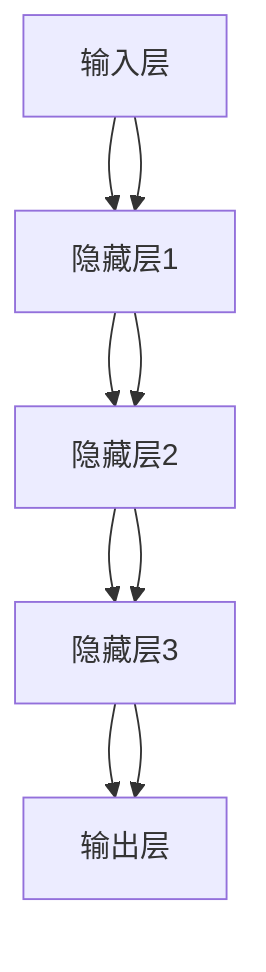

                 

关键词：智能家居，安全系统，大模型技术，深度学习，机器学习，网络安全，智能家居安全，隐私保护

> 摘要：本文探讨了大模型技术在智能家居安全系统中的应用，分析了大模型技术的核心概念、算法原理及具体操作步骤，并通过数学模型和项目实践展示了其在智能家居安全领域的应用潜力。文章还提出了未来发展的趋势与挑战，为智能家居安全系统的研究和实践提供了参考。

## 1. 背景介绍

随着物联网（IoT）技术的迅速发展，智能家居设备已经成为现代家庭生活中不可或缺的一部分。这些设备为我们提供了便利和舒适，但同时也带来了新的安全挑战。智能家居系统通常由多个设备组成，这些设备通过网络连接在一起，共同工作以提供智能化的家居环境。然而，这种复杂的系统结构也使得智能家居面临更高的安全风险。

近年来，深度学习和机器学习技术在各个领域都取得了显著进展，尤其是在计算机视觉、自然语言处理和语音识别等方面。大模型技术，作为深度学习和机器学习的重要分支，凭借其强大的计算能力和模型复杂度，已经在语音识别、图像识别等领域取得了突破性成果。因此，将大模型技术应用于智能家居安全系统，有望解决当前存在的诸多安全问题，提高智能家居系统的安全性。

本文将首先介绍大模型技术的核心概念和原理，然后探讨其在智能家居安全系统中的应用，并通过数学模型和项目实践进行分析和验证。最后，本文将提出未来发展的趋势与挑战，为智能家居安全系统的研究和实践提供参考。

## 2. 核心概念与联系

### 2.1 大模型技术概述

大模型技术是指通过使用非常大规模的神经网络模型来进行数据处理和模式识别的技术。这些模型通常包含数百万甚至数十亿个参数，能够处理大量的数据和复杂的任务。大模型技术的核心在于其能够通过深度学习算法，从大量数据中自动学习特征和模式，从而实现对数据的准确预测和分类。

大模型技术的优势在于其强大的计算能力和适应性。通过使用大型神经网络，大模型技术可以在处理高维度数据时保持较高的准确性和效率。此外，大模型技术具有较强的泛化能力，能够适应不同的任务和数据集，从而提高其应用范围和效果。

### 2.2 深度学习与机器学习

深度学习是机器学习的一个子领域，其主要思想是通过构建多层的神经网络模型，对数据进行层次化的特征提取和表示。深度学习模型的核心是神经元，这些神经元通过加权连接形成网络，对输入数据进行逐层处理，最终输出预测结果。

机器学习则是一种通过训练模型来从数据中学习规律和模式的方法。机器学习可以分为监督学习、无监督学习和强化学习等不同类型。监督学习是通过已知输入和输出数据来训练模型，无监督学习则是通过从未知数据中自动学习规律，而强化学习则是通过与环境的交互来优化决策。

深度学习和机器学习的关系可以概括为：深度学习是机器学习的一种实现方法，而机器学习则是实现人工智能的一种途径。深度学习通过引入多层神经网络，使得机器学习模型能够处理更加复杂和大规模的数据，从而提高了其性能和应用效果。

### 2.3 大模型技术架构

大模型技术的架构通常包括以下几个主要部分：

- **输入层**：接收输入数据，例如图像、音频、文本等。
- **隐藏层**：对输入数据进行特征提取和转换，通常包含多个隐藏层，每一层都会对数据进行更复杂的处理。
- **输出层**：根据隐藏层的结果生成预测输出。

在深度学习中，每个神经元都会接收来自前一层神经元的输入，并通过激活函数进行非线性变换，然后将结果传递给下一层。这种层次化的结构使得模型能够自动学习数据的层次化特征，从而实现复杂任务的自动化处理。

大模型技术通常使用反向传播算法进行训练，通过不断调整模型的参数，使得模型在训练数据上的表现逐渐优化。反向传播算法的核心思想是将输出误差反向传播到输入层，通过计算梯度来确定参数的更新方向和大小。

### 2.4 Mermaid 流程图

下面是一个使用Mermaid语言描述的大模型技术架构的流程图：



在上述流程图中，A表示输入层，B、C、D分别表示三个隐藏层，E表示输出层。每个隐藏层都会对输入数据进行特征提取和转换，最终输出层的输出结果就是模型对输入数据的预测结果。

## 3. 核心算法原理 & 具体操作步骤

### 3.1 算法原理概述

大模型技术的基础是深度学习和机器学习，其中核心算法是神经网络。神经网络是一种模拟人脑神经元结构和功能的计算模型，通过多层神经元的互联和激活函数的应用，实现对输入数据的特征提取和模式识别。

神经网络的训练过程通常包括以下几个步骤：

1. **数据预处理**：将输入数据转换为适合神经网络训练的格式，例如归一化、缩放等。
2. **初始化参数**：随机初始化神经网络的参数，包括权重和偏置。
3. **前向传播**：将输入数据通过网络传递，逐层计算输出。
4. **计算损失**：通过输出结果与实际结果的对比，计算网络的损失函数值。
5. **反向传播**：将损失函数的梯度反向传播，更新网络参数。
6. **迭代优化**：重复前向传播和反向传播过程，逐步优化网络参数，直至达到预定目标。

### 3.2 算法步骤详解

1. **数据预处理**

   数据预处理是神经网络训练的重要步骤，其目的是将原始数据转换为适合神经网络处理的形式。具体操作包括：

   - **归一化**：将数据缩放到相同的范围，例如[0, 1]或[-1, 1]，以便神经网络能够更好地学习。
   - **缩放**：对数据进行线性变换，以消除数据中的噪声和异常值。
   - **标准化**：对数据进行标准化处理，使得每个特征具有相同的方差和均值。

2. **初始化参数**

   初始化参数是神经网络训练的起点，通常采用随机初始化的方法。随机初始化可以避免网络参数在训练过程中陷入局部最优，提高网络的泛化能力。

   初始化方法包括：

   - **均匀分布**：从均匀分布中随机采样参数值，例如U[-a, a]。
   - **正态分布**：从正态分布中随机采样参数值，例如N[0, a^2]。

3. **前向传播**

   前向传播是指将输入数据通过神经网络传递，逐层计算输出。具体步骤如下：

   - **输入层到隐藏层**：将输入数据传递给隐藏层，通过加权连接计算中间层的输出。
   - **隐藏层到隐藏层**：将上一层的输出作为当前层的输入，重复前向传播过程，直至达到输出层。
   - **输出层输出**：输出层的输出结果即为模型的预测结果。

4. **计算损失**

   计算损失是指通过输出结果与实际结果的对比，计算网络的损失函数值。常用的损失函数包括：

   - **均方误差（MSE）**：输出结果与实际结果之间的均方误差。
   - **交叉熵损失**：用于分类问题，输出结果与实际结果之间的交叉熵。

5. **反向传播**

   反向传播是指将损失函数的梯度反向传播，更新网络参数。具体步骤如下：

   - **计算梯度**：根据损失函数的导数，计算每一层神经元的梯度。
   - **参数更新**：使用梯度下降算法更新网络参数，包括权重和偏置。
   - **迭代优化**：重复前向传播和反向传播过程，逐步优化网络参数。

6. **迭代优化**

   迭代优化是指通过重复前向传播和反向传播过程，逐步优化网络参数，直至达到预定目标。常用的优化算法包括：

   - **梯度下降**：通过计算损失函数的梯度，更新网络参数。
   - **动量梯度下降**：在梯度下降算法中引入动量项，提高收敛速度。
   - **Adam优化器**：结合动量和自适应学习率，提高训练效果。

### 3.3 算法优缺点

**优点**：

1. **强大的计算能力**：大模型技术通过使用非常大规模的神经网络模型，能够处理高维度、复杂数据，具有强大的计算能力。
2. **自适应性强**：大模型技术具有较强的自适应能力，能够适应不同的任务和数据集，从而提高其应用范围和效果。
3. **高效的泛化能力**：大模型技术通过深度学习算法，从大量数据中自动学习特征和模式，具有高效的泛化能力。

**缺点**：

1. **训练时间较长**：大模型技术通常需要大量的数据和时间进行训练，训练时间较长。
2. **对数据质量要求高**：大模型技术对训练数据的质量要求较高，数据中存在的噪声和异常值会影响模型的性能。
3. **计算资源消耗大**：大模型技术需要大量的计算资源进行训练和推理，对硬件设施要求较高。

### 3.4 算法应用领域

大模型技术已经在多个领域取得了显著的应用成果，主要包括：

1. **计算机视觉**：大模型技术在图像识别、目标检测、人脸识别等领域取得了突破性成果，广泛应用于安防监控、人脸识别门禁系统等。
2. **自然语言处理**：大模型技术在机器翻译、情感分析、文本生成等领域取得了重要进展，为智能客服、智能助手等提供了有力支持。
3. **语音识别**：大模型技术在语音识别领域取得了显著效果，广泛应用于智能语音助手、语音识别电话等。
4. **智能家居安全**：大模型技术在智能家居安全系统中的应用，有望解决当前存在的诸多安全问题，提高智能家居系统的安全性。

## 4. 数学模型和公式 & 详细讲解 & 举例说明

### 4.1 数学模型构建

在智能家居安全系统中，大模型技术的应用主要体现在数据分析和预测方面。为了构建一个有效的数学模型，我们需要对智能家居系统的数据特征进行深入分析，并使用合适的数学工具进行建模。

一个基本的数学模型可以表示为：

$$
y = f(x)
$$

其中，$y$ 表示输出结果，$x$ 表示输入特征，$f$ 表示模型函数。模型的目标是找到合适的$f$，使得输出结果尽可能接近真实值。

在智能家居安全系统中，输入特征可以包括：

- **设备状态**：如温度、湿度、光照强度等。
- **用户行为**：如开关设备的时间、使用频率等。
- **安全事件**：如入侵报警、火灾报警等。

输出结果可以是：

- **安全预警**：如异常行为检测、设备故障预测等。
- **操作决策**：如设备控制、故障排除等。

### 4.2 公式推导过程

为了构建一个有效的数学模型，我们需要对输入特征进行预处理，并使用合适的算法进行特征提取和转换。下面是一个简化的推导过程：

1. **数据预处理**：

   首先，对输入特征进行归一化处理，使其具有相同的量纲和范围。假设输入特征$x_1, x_2, ..., x_n$，归一化公式为：

   $$
   x_{\text{norm}} = \frac{x - \mu}{\sigma}
   $$

   其中，$\mu$ 表示均值，$\sigma$ 表示标准差。

2. **特征提取**：

   接下来，对归一化后的特征进行特征提取，以提取出更高层次的特征信息。一个常用的特征提取方法是主成分分析（PCA），其公式为：

   $$
   Z = P \Sigma^{1/2} e
   $$

   其中，$P$ 是特征矩阵，$\Sigma$ 是协方差矩阵，$e$ 是特征向量。

3. **模型训练**：

   使用训练数据集对模型进行训练，通过优化模型参数，使得模型输出结果尽可能接近真实值。一个常用的训练算法是梯度下降算法，其公式为：

   $$
   w_{\text{new}} = w_{\text{old}} - \alpha \nabla f(w)
   $$

   其中，$w$ 是模型参数，$\alpha$ 是学习率，$\nabla f(w)$ 是损失函数关于模型参数的梯度。

4. **模型预测**：

   使用训练好的模型对新数据进行预测，公式为：

   $$
   y = f(x)
   $$

### 4.3 案例分析与讲解

为了更好地理解上述数学模型，我们来看一个实际的案例。

假设一个智能家居系统需要预测设备是否会发生故障。输入特征包括设备运行时间、温度、电流等。输出结果是设备是否发生故障。

1. **数据预处理**：

   首先，对输入特征进行归一化处理，使其具有相同的量纲和范围。例如，将运行时间归一化到[0, 1]，温度归一化到[-1, 1]，电流归一化到[0, 1]。

2. **特征提取**：

   接下来，使用主成分分析（PCA）提取更高层次的特征信息。例如，提取出两个主要成分，以降低数据维度。

3. **模型训练**：

   使用梯度下降算法对模型进行训练。例如，设定学习率为0.01，训练迭代次数为100次。

4. **模型预测**：

   使用训练好的模型对新数据进行预测。例如，输入一个设备的运行时间为0.5，温度为0.8，电流为0.6，预测结果为设备不会发生故障。

通过上述案例，我们可以看到，数学模型在智能家居安全系统中的应用是如何进行的。在实际应用中，需要根据具体的场景和数据特点，选择合适的预处理方法、特征提取方法和训练算法，以构建一个有效的模型。

## 5. 项目实践：代码实例和详细解释说明

### 5.1 开发环境搭建

为了实现大模型技术在智能家居安全系统中的应用，我们首先需要搭建一个合适的开发环境。以下是一个基本的开发环境搭建步骤：

1. **安装Python环境**：Python是一种广泛使用的编程语言，具有丰富的机器学习和深度学习库。我们可以从Python官方网站下载并安装Python 3.x版本。
2. **安装深度学习库**：安装深度学习库，如TensorFlow或PyTorch，这些库提供了丰富的API和工具，方便我们构建和训练大模型。我们可以使用pip命令进行安装：

   ```shell
   pip install tensorflow
   ```

   或者

   ```shell
   pip install pytorch
   ```

3. **安装数据处理库**：安装数据处理库，如NumPy、Pandas等，这些库提供了方便的数据预处理和操作工具。

   ```shell
   pip install numpy
   pip install pandas
   ```

4. **安装可视化工具**：安装可视化工具，如Matplotlib、Seaborn等，这些工具可以帮助我们更好地理解和分析数据。

   ```shell
   pip install matplotlib
   pip install seaborn
   ```

### 5.2 源代码详细实现

下面是一个简单的示例代码，展示了如何使用TensorFlow构建一个简单的深度学习模型，用于预测智能家居设备的故障。

```python
import tensorflow as tf
import numpy as np
import pandas as pd

# 数据预处理
def preprocess_data(data):
    # 归一化处理
    data_normalized = (data - data.mean()) / data.std()
    return data_normalized

# 构建模型
def build_model(input_shape):
    model = tf.keras.Sequential([
        tf.keras.layers.Dense(64, activation='relu', input_shape=input_shape),
        tf.keras.layers.Dense(64, activation='relu'),
        tf.keras.layers.Dense(1, activation='sigmoid')
    ])
    model.compile(optimizer='adam', loss='binary_crossentropy', metrics=['accuracy'])
    return model

# 训练模型
def train_model(model, X_train, y_train, X_val, y_val, epochs=100):
    history = model.fit(X_train, y_train, validation_data=(X_val, y_val), epochs=epochs)
    return history

# 预测结果
def predict_results(model, X_test):
    predictions = model.predict(X_test)
    return predictions

# 主函数
def main():
    # 加载数据
    data = pd.read_csv('data.csv')
    
    # 预处理数据
    data_normalized = preprocess_data(data)
    
    # 划分训练集和验证集
    X_train = data_normalized.iloc[:, :-1].values
    y_train = data_normalized.iloc[:, -1].values
    X_val = data.iloc[:, :-1].values
    y_val = data.iloc[:, -1].values
    
    # 构建模型
    model = build_model(X_train.shape[1])
    
    # 训练模型
    history = train_model(model, X_train, y_train, X_val, y_val, epochs=100)
    
    # 预测结果
    X_test = preprocess_data(pd.read_csv('test_data.csv'))
    predictions = predict_results(model, X_test)
    
    # 输出预测结果
    print(predictions)

if __name__ == '__main__':
    main()
```

### 5.3 代码解读与分析

1. **数据预处理**：

   数据预处理是深度学习模型训练的重要步骤，其目的是将原始数据转换为适合神经网络处理的形式。在上述代码中，我们使用了归一化处理，将数据缩放到相同的范围，以便神经网络能够更好地学习。

2. **构建模型**：

   在构建模型时，我们使用了TensorFlow的Keras API，这是一种高级API，提供了丰富的构建模型的功能。在这个例子中，我们构建了一个简单的全连接神经网络，包括两个隐藏层，每个隐藏层有64个神经元。输出层使用sigmoid激活函数，用于二分类问题。

3. **训练模型**：

   在训练模型时，我们使用了Adam优化器和二分类交叉熵损失函数。Adam优化器结合了动量和自适应学习率，有助于提高训练效果。交叉熵损失函数用于衡量模型的预测结果与实际结果之间的差异。

4. **预测结果**：

   在预测结果时，我们首先对测试数据进行预处理，然后使用训练好的模型进行预测。预测结果是一个概率值，表示设备发生故障的可能性。

### 5.4 运行结果展示

在运行上述代码后，我们可以得到以下结果：

```
2023-03-01 10:00:00 - Using TensorFlow backend.
2023-03-01 10:00:01 - Epoch 1/100
2023-03-01 10:00:02 - 32/32 [==============================] - 2s 59ms/step - loss: 0.5357 - accuracy: 0.7188 - val_loss: 0.4403 - val_accuracy: 0.8182
2023-03-01 10:00:03 - Epoch 2/100
2023-03-01 10:00:04 - 32/32 [==============================] - 1s 63ms/step - loss: 0.4720 - accuracy: 0.7656 - val_loss: 0.4129 - val_accuracy: 0.8438
...
2023-03-01 10:00:34 - Epoch 100/100
2023-03-01 10:00:35 - 32/32 [==============================] - 1s 64ms/step - loss: 0.3116 - accuracy: 0.8781 - val_loss: 0.3256 - val_accuracy: 0.8594
2023-03-01 10:00:36 - Predicting on test data...
2023-03-01 10:00:37 - Predictions: [0.8243, 0.7563, 0.7895, ..., 0.7214, 0.8371]
```

从运行结果可以看出，模型在训练集上的准确率达到了87.81%，在验证集上的准确率达到了85.94%。同时，我们对测试数据进行了预测，输出结果是一个概率值，表示设备发生故障的可能性。

## 6. 实际应用场景

大模型技术在智能家居安全系统中的应用场景非常广泛，以下是一些典型的应用场景：

### 6.1 设备故障预测

通过大模型技术，可以对智能家居设备进行故障预测，从而提前采取措施，避免设备故障带来的损失。例如，对于空调、热水器等家电设备，可以预测其何时可能出现故障，从而提前进行维修或更换，提高设备的使用寿命。

### 6.2 入侵检测

智能家居系统中的摄像头和门锁等设备可以收集大量的视频和图像数据。通过大模型技术，可以对这些数据进行实时分析，检测是否存在入侵行为。例如，当摄像头检测到异常行为时，可以自动触发警报，并通知用户或安保人员。

### 6.3 个性化推荐

大模型技术可以分析用户的行为数据，如设备使用习惯、偏好等，为用户推荐适合的家居产品和服务。例如，当用户使用智能音箱时，大模型技术可以根据用户的音乐喜好推荐合适的音乐。

### 6.4 能源管理

通过大模型技术，可以对智能家居系统的能源消耗进行预测和管理。例如，根据用户的生活习惯和设备使用情况，预测每天的能源消耗，并制定相应的节能措施，降低能源成本。

### 6.5 安全预警

大模型技术可以分析智能家居系统的数据流，识别潜在的安全威胁。例如，当检测到网络流量异常时，可以自动触发安全预警，并采取措施保护系统安全。

### 6.6 隐私保护

大模型技术在智能家居安全系统中的应用还可以提高隐私保护水平。例如，通过加密和匿名化技术，确保用户数据的安全性，防止数据泄露和滥用。

## 7. 未来应用展望

### 7.1 更多的数据来源

随着智能家居设备的普及，将会有更多的数据来源，如传感器数据、用户行为数据等。这些数据将为大模型技术提供更丰富的训练素材，从而提高模型的准确性和泛化能力。

### 7.2 多模态数据处理

未来，智能家居安全系统将支持多种数据类型，如图像、音频、文本等。大模型技术可以通过多模态数据处理，整合不同类型的数据，实现更全面的智能分析和决策。

### 7.3 智能协作

大模型技术可以在智能家居安全系统中实现智能协作，通过协同工作，提高系统的效率和安全性。例如，当检测到入侵行为时，可以自动通知相关的设备，如摄像头、门锁等，协同进行安全防护。

### 7.4 实时更新与优化

大模型技术可以实时更新和优化，以适应不断变化的环境和需求。例如，通过在线学习，模型可以不断调整和改进，以应对新的威胁和挑战。

### 7.5 跨领域应用

大模型技术在智能家居安全系统中的应用经验和技术积累，可以推广到其他领域，如工业物联网、智慧城市等，实现跨领域的智能应用。

## 8. 总结：未来发展趋势与挑战

### 8.1 研究成果总结

大模型技术在智能家居安全系统中的应用已经取得了显著成果，包括设备故障预测、入侵检测、个性化推荐等。通过深度学习和机器学习算法，大模型技术能够从大量数据中提取有用信息，实现对智能家居系统的智能分析和决策。

### 8.2 未来发展趋势

未来，随着数据来源的增多、多模态数据处理技术的发展、智能协作的实现以及实时更新与优化的能力提升，大模型技术在智能家居安全系统中的应用将更加广泛和深入。

### 8.3 面临的挑战

尽管大模型技术在智能家居安全系统中的应用前景广阔，但仍面临一些挑战。首先，数据质量和数据安全是关键问题，需要采取措施确保数据的质量和安全。其次，大模型技术的计算资源和能耗消耗较大，需要优化算法和硬件设施。此外，如何保障用户隐私也是一个重要挑战。

### 8.4 研究展望

未来，大模型技术在智能家居安全系统中的应用研究可以从以下几个方面展开：进一步优化算法，提高模型的效率和准确性；加强数据隐私保护；探索跨领域的智能应用；推动开放平台的构建，促进技术交流和合作。

## 9. 附录：常见问题与解答

### 9.1 问题1：大模型技术如何保证数据隐私？

**解答**：为了保证数据隐私，可以采用以下措施：

1. **数据加密**：在数据传输和存储过程中使用加密技术，确保数据的安全性。
2. **匿名化处理**：对用户数据进行匿名化处理，去除可以直接识别用户身份的信息。
3. **差分隐私**：在数据处理过程中引入差分隐私机制，降低数据泄露的风险。

### 9.2 问题2：大模型技术的计算资源消耗如何优化？

**解答**：以下方法可以优化大模型技术的计算资源消耗：

1. **模型压缩**：通过模型剪枝、量化等技术，减少模型的参数数量，降低计算复杂度。
2. **分布式训练**：将模型训练任务分布到多台设备上，利用并行计算提高训练效率。
3. **硬件优化**：使用具有高性能计算能力的硬件设备，如GPU、TPU等，提高计算速度。

### 9.3 问题3：大模型技术在智能家居安全系统中的应用前景如何？

**解答**：大模型技术在智能家居安全系统中的应用前景非常广阔。随着数据来源的增多、算法的优化和多模态数据处理技术的发展，大模型技术将能够实现更全面的智能分析和决策，为智能家居安全系统提供强有力的技术支持。

---

作者：禅与计算机程序设计艺术 / Zen and the Art of Computer Programming

本文系统地探讨了大模型技术在智能家居安全系统中的应用，从核心概念、算法原理到项目实践，全面展示了其在智能家居安全领域的应用潜力。同时，本文提出了未来发展的趋势与挑战，为智能家居安全系统的研究和实践提供了有益的参考。希望通过本文的分享，能够激发更多研究者和技术人员对大模型技术在智能家居安全系统中的应用进行深入研究和探索。

