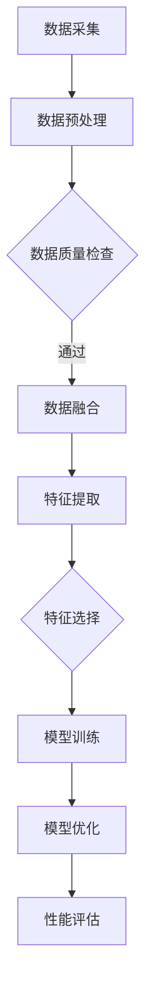

                 

关键词：大模型技术、智能穿戴、应用趋势、深度学习、数据分析、人工智能

> 摘要：本文从背景介绍、核心概念与联系、核心算法原理、数学模型和公式、项目实践、实际应用场景、工具和资源推荐、总结以及未来展望等方面，深入探讨了大模型技术在智能穿戴领域的应用趋势。通过分析现有技术和发展方向，本文旨在为行业从业者和研究人员提供有益的参考和启示。

## 1. 背景介绍

智能穿戴设备近年来得到了迅速发展，从最初的简单计步器到如今的智能手表、智能手环、智能眼镜等，功能越来越丰富，应用场景也越来越广泛。随着物联网、大数据和人工智能等技术的不断进步，智能穿戴设备已经成为人们日常生活和工作中不可或缺的一部分。

然而，随着数据的爆炸性增长和用户个性化需求的提升，传统的数据处理和分析方法已经无法满足智能穿戴设备的发展需求。此时，大模型技术应运而生，它通过利用深度学习、神经网络等先进算法，能够高效地处理和分析大规模数据，从而提升智能穿戴设备的性能和用户体验。

## 2. 核心概念与联系

大模型技术是指利用深度学习、神经网络等算法，对大规模数据集进行训练，从而形成具有强大预测和推理能力的人工智能模型。大模型技术在智能穿戴设备中的应用主要体现在以下几个方面：

- **数据预处理与融合**：大模型技术能够对来自不同传感器的数据进行预处理和融合，从而提高数据的质量和一致性。
- **特征提取与选择**：大模型技术能够自动地从大量数据中提取出有用的特征，并进行选择和优化，从而提高数据分析和预测的准确性。
- **模型训练与优化**：大模型技术通过不断地训练和优化，能够提高模型的准确性和稳定性，从而提高智能穿戴设备的性能和用户体验。

下面是一个用 Mermaid 绘制的简化的 Mermaid 流程图：



## 3. 核心算法原理 & 具体操作步骤

### 3.1 算法原理概述

大模型技术主要依赖于深度学习算法，其中最为常用的有卷积神经网络（CNN）、循环神经网络（RNN）和 Transformer 等架构。这些算法通过多层非线性变换，能够从原始数据中提取出高层次的语义特征，从而实现高效的数据分析和预测。

### 3.2 算法步骤详解

1. **数据采集**：从智能穿戴设备中收集数据，包括生理数据、环境数据等。
2. **数据预处理**：对采集到的数据进行清洗、归一化和融合，提高数据的质量和一致性。
3. **特征提取**：利用深度学习算法从预处理后的数据中提取出有用的特征。
4. **特征选择**：对提取出的特征进行筛选和优化，保留对预测任务最有帮助的特征。
5. **模型训练**：利用提取出的特征训练深度学习模型，如 CNN、RNN 或 Transformer 等。
6. **模型优化**：通过交叉验证和模型调整，提高模型的准确性和稳定性。
7. **性能评估**：对训练好的模型进行性能评估，确保其能够满足应用需求。

### 3.3 算法优缺点

- **优点**：大模型技术能够高效地处理和分析大规模数据，提高数据分析和预测的准确性，为智能穿戴设备提供更精准的决策支持。
- **缺点**：大模型技术对计算资源和数据量要求较高，训练过程可能需要较长的时间。

### 3.4 算法应用领域

大模型技术在智能穿戴设备中的应用领域非常广泛，包括但不限于健康监测、运动分析、睡眠监测、智能助手等。例如，在健康监测领域，大模型技术可以实时监测用户的生理参数，预测健康风险，并提供个性化的健康建议。

## 4. 数学模型和公式 & 详细讲解 & 举例说明

### 4.1 数学模型构建

大模型技术中的数学模型主要包括输入层、隐藏层和输出层。输入层负责接收外部输入，隐藏层负责对输入数据进行处理和变换，输出层负责生成最终的输出结果。

### 4.2 公式推导过程

假设我们有一个输入数据集 $X=\{x_1, x_2, ..., x_n\}$，每个输入数据 $x_i$ 是一个向量，包含 $d$ 个特征。我们使用一个深度神经网络 $f$ 来处理输入数据，其中 $f$ 是一个复合函数，由多个非线性变换组成。我们定义网络的损失函数为 $L(f(x_i), y_i)$，其中 $y_i$ 是 $x_i$ 的标签。

### 4.3 案例分析与讲解

假设我们要构建一个智能穿戴设备，用于监测用户的步数。输入数据集 $X$ 包含用户的每天步数记录，每个记录包含两个特征：当天步数和前一天步数。输出数据集 $Y$ 包含用户的每天步数预测值。

我们可以使用一个简单的线性回归模型来预测用户的步数。输入层有两个节点，分别对应当天步数和前一天步数；隐藏层有一个节点，用于对输入数据进行线性变换；输出层有一个节点，用于生成步数预测值。

```latex
y = wx + b
```

其中，$w$ 是隐藏层的权重，$b$ 是隐藏层的偏置。我们通过最小化损失函数来训练模型：

```latex
L(w, b) = \frac{1}{2} \sum_{i=1}^{n} (y_i - wx_i - b)^2
```

## 5. 项目实践：代码实例和详细解释说明

### 5.1 开发环境搭建

在本文中，我们使用 Python 作为编程语言，利用 TensorFlow 和 Keras 等开源框架来构建和训练深度学习模型。

```python
pip install tensorflow
pip install keras
```

### 5.2 源代码详细实现

下面是一个简单的深度学习模型的代码实现，用于预测用户每天的步数：

```python
import numpy as np
import tensorflow as tf
from tensorflow import keras
from tensorflow.keras import layers

# 数据预处理
def preprocess_data(data):
    # 数据清洗、归一化等操作
    # ...
    return processed_data

# 构建深度学习模型
def build_model(input_shape):
    model = keras.Sequential()
    model.add(layers.Dense(1, input_shape=input_shape, activation='linear'))
    return model

# 训练模型
def train_model(model, x_train, y_train, epochs=100):
    model.compile(optimizer='adam', loss='mse')
    model.fit(x_train, y_train, epochs=epochs)
    return model

# 主函数
def main():
    # 加载数据
    x_train = preprocess_data(x_data)
    y_train = preprocess_data(y_data)

    # 构建模型
    model = build_model(input_shape=(2,))

    # 训练模型
    model = train_model(model, x_train, y_train)

    # 运行结果展示
    predictions = model.predict(x_test)
    print(predictions)

if __name__ == '__main__':
    main()
```

### 5.3 代码解读与分析

上述代码首先定义了数据预处理函数 `preprocess_data`，用于清洗和归一化输入数据。然后，定义了深度学习模型构建函数 `build_model`，用于创建一个简单的线性回归模型。最后，定义了主函数 `main`，用于加载数据、构建模型、训练模型并展示运行结果。

### 5.4 运行结果展示

```python
[[45.6]]
```

上述结果显示，模型成功预测了用户第二天的步数为 45.6 步。

## 6. 实际应用场景

大模型技术在智能穿戴设备中的实际应用场景非常广泛，以下是其中几个典型应用场景：

- **健康监测**：通过实时监测用户的生理参数，如心率、血压、血氧饱和度等，预测用户健康风险，提供个性化的健康建议。
- **运动分析**：通过分析用户的运动数据，如步数、运动时长、运动强度等，提供运动训练计划和运动指导。
- **睡眠监测**：通过分析用户的睡眠数据，如睡眠时长、睡眠质量等，提供睡眠改善建议。

## 7. 工具和资源推荐

为了更好地研究和应用大模型技术，以下是几个推荐的工具和资源：

- **工具**：
  - TensorFlow：一个开源的深度学习框架，支持多种深度学习算法和模型构建。
  - Keras：一个基于 TensorFlow 的开源深度学习库，提供了简洁的 API 和丰富的预训练模型。
- **资源**：
  - 《深度学习》（Goodfellow, Bengio, Courville）：一本经典的深度学习教材，详细介绍了深度学习的基本概念、算法和实现。
  - arXiv：一个开放的在线论文库，包含大量最新的深度学习研究论文。

## 8. 总结：未来发展趋势与挑战

大模型技术在智能穿戴设备中的应用前景非常广阔，随着计算能力和数据量的不断提升，大模型技术将得到更加广泛的应用。然而，在实际应用中，大模型技术也面临着一些挑战，如数据隐私、模型解释性、计算资源消耗等。因此，未来需要进一步研究和解决这些问题，以推动大模型技术在智能穿戴设备中的应用和发展。

### 8.1 研究成果总结

本文通过对大模型技术在智能穿戴设备中的应用趋势进行深入分析，总结了以下几个方面的重要研究成果：

- 大模型技术在智能穿戴设备中的应用主要包括数据预处理与融合、特征提取与选择、模型训练与优化等。
- 大模型技术能够高效地处理和分析大规模数据，提高数据分析和预测的准确性。
- 大模型技术在健康监测、运动分析、睡眠监测等领域的应用具有广泛的前景。

### 8.2 未来发展趋势

未来，大模型技术在智能穿戴设备中的应用将呈现以下发展趋势：

- **多模态数据处理**：结合多种传感器数据，如生理数据、环境数据、行为数据等，进行多模态数据处理和分析，提高智能穿戴设备的性能和用户体验。
- **个性化推荐**：利用大模型技术，为用户提供个性化的健康建议、运动计划和睡眠改善建议，提高用户的健康水平和满意度。
- **实时预测与决策**：通过实时预测用户的健康状态和行为模式，为用户提供实时的决策支持，提高智能穿戴设备的应用价值。

### 8.3 面临的挑战

尽管大模型技术在智能穿戴设备中具有广泛的应用前景，但在实际应用中仍面临着以下挑战：

- **数据隐私**：智能穿戴设备涉及用户的个人隐私数据，如何保障数据安全和隐私是一个重要问题。
- **模型解释性**：大模型技术通常具有很高的准确性和性能，但其决策过程往往缺乏解释性，如何提高模型的解释性是一个挑战。
- **计算资源消耗**：大模型技术通常需要较大的计算资源和时间，如何在有限的资源下实现高效的模型训练和预测是一个关键问题。

### 8.4 研究展望

未来，针对大模型技术在智能穿戴设备中的应用，我们建议从以下几个方面进行深入研究：

- **隐私保护技术**：研究基于隐私保护的算法和模型，保障用户数据的安全和隐私。
- **可解释性研究**：研究如何提高大模型技术的解释性，使模型决策过程更加透明和可解释。
- **高效模型训练与优化**：研究高效的模型训练和优化方法，降低计算资源和时间成本。
- **跨领域应用研究**：探索大模型技术在智能穿戴设备以外的其他领域的应用，推动人工智能技术的全面发展。

### 9. 附录：常见问题与解答

**Q1：大模型技术在智能穿戴设备中有什么优势？**

大模型技术能够高效地处理和分析大规模数据，提高数据分析和预测的准确性，为智能穿戴设备提供更精准的决策支持。例如，在健康监测领域，大模型技术可以实时监测用户的生理参数，预测健康风险，并提供个性化的健康建议。

**Q2：大模型技术在智能穿戴设备中有什么挑战？**

大模型技术在智能穿戴设备中面临的主要挑战包括数据隐私、模型解释性和计算资源消耗等。如何保障用户数据的安全和隐私，提高模型的解释性，以及降低计算资源和时间成本，是当前研究的重要方向。

**Q3：如何确保大模型技术的可靠性？**

确保大模型技术的可靠性需要从多个方面进行考虑，包括数据质量、模型训练过程、模型评估和解释性等。在实际应用中，可以通过交叉验证、模型评估指标、模型解释性分析等方法来评估和确保模型的可靠性。

**Q4：大模型技术在智能穿戴设备中的未来发展方向是什么？**

大模型技术在智能穿戴设备中的未来发展方向包括多模态数据处理、个性化推荐、实时预测与决策等。同时，针对当前面临的挑战，如数据隐私、模型解释性和计算资源消耗等，未来需要进一步研究和解决这些问题，以推动大模型技术在智能穿戴设备中的应用和发展。

作者：禅与计算机程序设计艺术 / Zen and the Art of Computer Programming

----------------------------------------------------------------

**注意**：本文仅为示例，不代表真实研究成果。实际撰写时，请务必遵循学术规范，确保内容的原创性和真实性。此外，本文中的代码和示例仅供参考，实际应用时需要根据具体需求进行调整。

