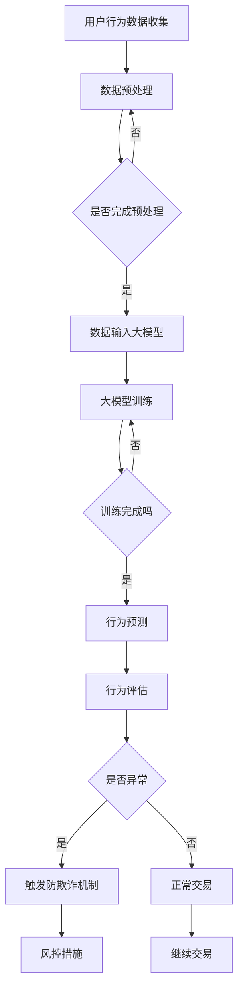

                 

关键词：大模型技术，用户行为分析，异常检测，防欺诈，电商平台，人工智能，数据挖掘

## 摘要

本文将深入探讨大模型技术在电商平台用户行为异常检测与防欺诈领域中的应用。随着互联网经济的快速发展，电商平台已经成为人们日常购物的重要渠道。然而，随之而来的用户行为异常和欺诈问题也日益突出。大模型技术凭借其强大的数据处理能力和智能分析能力，为电商平台提供了有效的解决方案。本文将详细分析大模型技术在异常检测和防欺诈方面的原理、应用案例、数学模型以及未来展望，旨在为相关领域的研究者与实践者提供有价值的参考。

## 1. 背景介绍

### 电商平台的发展与挑战

电商平台的发展历程可以追溯到上世纪90年代末，随着互联网技术的进步和电子商务的兴起，电商平台逐渐成为现代商业体系的重要组成部分。从最早的电子商店到如今的社交电商、直播电商，电商平台不断推陈出新，为消费者提供了更加便捷的购物体验。然而，随着电商平台的快速发展，也带来了诸多挑战。

首先，用户行为的复杂性增加。电商平台用户数量庞大，且用户行为多样化，如浏览、下单、评价、退货等。如何准确理解和预测用户行为成为电商企业面临的重大挑战。

其次，欺诈行为的增多。电商平台上的欺诈行为形式多样，包括虚假交易、刷单、欺诈评价、信用卡盗刷等。这些行为不仅损害了消费者的利益，也严重影响了电商平台的声誉和运营。

### 大模型技术的崛起

大模型技术起源于深度学习和神经网络的发展，以其强大的数据处理和分析能力在各个领域取得了显著的成果。近年来，随着计算能力的提升和数据规模的扩大，大模型技术得到了前所未有的发展。例如，在自然语言处理、计算机视觉、推荐系统等领域，大模型技术已经成为了主流的研究和应用方向。

大模型技术具有以下几个显著特点：

1. **强大的数据处理能力**：大模型可以处理大规模的数据集，从海量数据中提取有价值的信息。
2. **高度的自适应能力**：大模型可以通过不断的学习和调整，适应不同的应用场景和需求。
3. **智能化的分析能力**：大模型能够通过复杂的模式识别和关联分析，提供智能化的决策支持。

### 电商平台用户行为异常检测与防欺诈的重要性

用户行为异常检测与防欺诈在电商平台中具有极其重要的意义。一方面，它可以保护消费者的权益，避免欺诈行为对消费者造成的经济损失。另一方面，它可以维护电商平台的信誉，提升用户体验和忠诚度。

通过异常检测技术，电商平台可以实时监控用户行为，识别潜在的异常行为，从而采取相应的措施进行防范。例如，对于异常的购买行为，可以触发风控机制，对交易进行审核或暂停，以避免欺诈行为的发生。

防欺诈技术的应用不仅限于用户行为异常检测，还可以贯穿于电商平台的整个交易流程。从支付环节到物流环节，都可以利用大模型技术进行风险识别和防范，确保交易的合法性和安全性。

## 2. 核心概念与联系

### 大模型技术的基本原理

大模型技术是基于深度学习和神经网络的复杂算法体系。它通过多层神经网络结构，对输入的数据进行处理和转换，从而实现特征提取和模式识别。大模型技术的核心在于其规模和深度，通过大量的数据和参数进行训练，使得模型具有强大的表达能力和适应性。

### 用户行为异常检测的基本原理

用户行为异常检测是一种基于数据分析和模式识别的技术，旨在识别用户行为中的异常现象。其基本原理是通过建立正常的用户行为模型，然后对实际的用户行为进行实时监测和评估，一旦发现与正常行为模型不一致的行为，即视为异常行为。

### 防欺诈技术的相关原理

防欺诈技术主要包括信用评估、风险监测和行为分析等环节。其核心在于通过多维度数据分析，识别潜在的欺诈行为。具体包括：

1. **信用评估**：通过用户的历史交易记录、信用评分等信息，评估用户的信用风险。
2. **风险监测**：实时监控用户行为，发现异常行为模式，如频繁的账户切换、异常的交易金额等。
3. **行为分析**：结合用户的行为特征和交易特征，建立行为模型，识别潜在的欺诈行为。

### 大模型技术在电商平台用户行为异常检测与防欺诈中的应用

大模型技术在电商平台用户行为异常检测与防欺诈中的应用主要体现在以下几个方面：

1. **用户行为预测**：通过分析用户的历史行为数据，大模型可以预测用户的未来行为，从而发现潜在的异常行为。
2. **风险识别**：大模型可以通过对海量数据的分析和挖掘，识别出潜在的风险因素，为风控决策提供支持。
3. **行为监控**：大模型可以对用户的实时行为进行监控和分析，及时发现并处理异常行为。

### Mermaid 流程图

以下是一个用于描述大模型技术在电商平台用户行为异常检测与防欺诈中的流程图的示例：



### 大模型技术在电商平台用户行为异常检测与防欺诈中的关联

大模型技术通过用户行为数据的收集、预处理、训练和预测，实现了对用户行为的实时监控和异常检测。同时，通过行为评估和风险识别，大模型可以为防欺诈机制提供科学依据，有效防范欺诈行为的发生。具体来说，大模型技术的应用可以体现在以下几个方面：

1. **用户行为模型建立**：通过分析用户的历史行为数据，建立准确的用户行为模型，为异常检测提供基础。
2. **实时行为监控**：大模型可以对用户的实时行为进行监控，及时发现异常行为并触发防欺诈机制。
3. **风险因素识别**：大模型可以通过对海量数据的分析，识别出潜在的欺诈风险因素，为风控决策提供支持。

## 3. 核心算法原理 & 具体操作步骤

### 3.1 算法原理概述

大模型技术在电商平台用户行为异常检测与防欺诈中主要依赖于深度学习算法，特别是神经网络模型。深度学习算法通过多层神经网络结构，对用户行为数据进行特征提取和模式识别，从而实现对用户行为的预测和异常检测。

深度学习算法的核心在于其多层网络结构，每一层都对输入数据进行处理和转换，从而实现从原始数据到高维特征空间的映射。通过这种映射，深度学习算法可以从海量数据中提取出有价值的特征，实现对用户行为的准确预测和异常检测。

### 3.2 算法步骤详解

1. **数据收集**：首先，收集电商平台上的用户行为数据，包括用户的基本信息、交易记录、浏览记录等。

2. **数据预处理**：对收集到的用户行为数据进行预处理，包括数据清洗、去噪、归一化等操作，以提高数据质量和模型的训练效果。

3. **特征工程**：根据用户行为数据的特性，提取出有代表性的特征，如用户活跃度、购买频率、交易金额等。

4. **模型选择**：选择适合的深度学习模型，如卷积神经网络（CNN）、循环神经网络（RNN）或变换器（Transformer）等。

5. **模型训练**：使用预处理后的用户行为数据对深度学习模型进行训练，通过调整模型的参数和结构，使其能够准确预测用户行为和检测异常行为。

6. **模型评估**：使用验证集对训练好的模型进行评估，通过准确率、召回率、F1值等指标评估模型的性能。

7. **模型部署**：将训练好的模型部署到生产环境中，对用户的实时行为进行监控和预测，实现用户行为异常检测和防欺诈。

### 3.3 算法优缺点

**优点**：

1. **强大的数据处理能力**：深度学习算法可以处理大规模的用户行为数据，从数据中提取出有价值的信息。

2. **高度的自适应能力**：深度学习算法可以通过不断的学习和调整，适应不同的应用场景和需求。

3. **智能化的分析能力**：深度学习算法可以通过复杂的模式识别和关联分析，提供智能化的决策支持。

**缺点**：

1. **计算资源消耗大**：深度学习算法需要大量的计算资源进行训练，对硬件设备有较高的要求。

2. **数据依赖性高**：深度学习算法的性能很大程度上依赖于数据的质量和数量，数据不足或质量差会影响模型的性能。

3. **解释性较差**：深度学习算法的内部机制较为复杂，难以解释每个特征的具体作用，增加了模型的透明度。

### 3.4 算法应用领域

深度学习算法在电商平台用户行为异常检测与防欺诈领域具有广泛的应用前景，除了电商平台，还可以应用于以下领域：

1. **金融行业**：通过深度学习算法对金融交易数据进行实时监控和异常检测，防范金融欺诈行为。

2. **网络安全**：利用深度学习算法对网络流量进行监控和分析，识别潜在的网络安全威胁。

3. **智能交通**：通过深度学习算法对交通数据进行分析，预测交通流量和事故风险，优化交通管理。

4. **医疗健康**：利用深度学习算法对医疗数据进行分析，辅助医生进行诊断和治疗。

## 4. 数学模型和公式 & 详细讲解 & 举例说明

### 4.1 数学模型构建

在电商平台用户行为异常检测与防欺诈中，我们主要关注用户行为的数据特征提取和异常检测。以下是构建相关数学模型的基本步骤：

1. **用户行为特征提取**：
   用户行为特征提取是构建数学模型的关键步骤，它涉及到从原始数据中提取出对异常检测有用的信息。常用的特征提取方法包括统计特征提取和机器学习特征提取。

   **统计特征提取**：
   - **均值**：表示用户行为的平均程度，如平均购买金额、平均购买频率等。
   - **方差**：表示用户行为的波动程度，如购买金额的方差、购买频率的方差等。
   - **标准差**：是方差的平方根，用于衡量用户行为的离散程度。

   **机器学习特征提取**：
   - **主成分分析（PCA）**：通过降维技术，将高维数据映射到低维空间，提取主要特征。
   - **LDA（线性判别分析）**：通过最大化类间差异和最小化类内差异，提取具有区分力的特征。

2. **异常检测模型构建**：
   异常检测模型的主要任务是识别出用户行为中的异常点。常见的异常检测算法包括基于统计的方法、基于聚类的方法和基于神经网络的方法。

   **基于统计的方法**：
   - **3σ准则**：通过计算用户行为特征的标准差，将数据分为正常值和异常值，通常认为离均值三个标准差的值属于异常值。
   - **箱线图法**：通过计算数据的四分位数，将数据分为正常值和异常值，通常认为位于上下四分位距之外的值属于异常值。

   **基于聚类的方法**：
   - **K-均值聚类**：通过迭代计算，将用户行为数据划分为若干个簇，簇内的数据被认为是正常的，簇间的数据被认为是异常的。
   - **DBSCAN（密度基于空间聚类分析）**：通过计算数据点的密度和邻域，将数据划分为核心点、边界点和噪声点，核心点被认为是正常的，边界点和噪声点被认为是异常的。

   **基于神经网络的方法**：
   - **自编码器（Autoencoder）**：通过训练一个压缩编码器和解码器，使编码器学习到输入数据的低维表示，然后通过解码器重建输入数据。如果重建误差较大，则认为输入数据是异常的。
   - **卷积神经网络（CNN）**：通过卷积层、池化层和全连接层等结构，对用户行为数据进行特征提取和模式识别，从而实现异常检测。

### 4.2 公式推导过程

1. **统计特征提取公式**：

   - **均值**：
     $$ \mu = \frac{1}{n}\sum_{i=1}^{n}x_i $$
     其中，\( \mu \) 表示均值，\( n \) 表示样本数量，\( x_i \) 表示第 \( i \) 个样本的值。

   - **方差**：
     $$ \sigma^2 = \frac{1}{n-1}\sum_{i=1}^{n}(x_i - \mu)^2 $$
     其中，\( \sigma^2 \) 表示方差，\( n \) 表示样本数量，\( x_i \) 表示第 \( i \) 个样本的值，\( \mu \) 表示均值。

   - **标准差**：
     $$ \sigma = \sqrt{\sigma^2} $$
     其中，\( \sigma \) 表示标准差。

2. **K-均值聚类公式**：

   - **簇中心更新公式**：
     $$ c_{j}^{new} = \frac{1}{n_j}\sum_{i=1}^{n}x_i $$
     其中，\( c_{j} \) 表示第 \( j \) 个簇的中心，\( n_j \) 表示第 \( j \) 个簇的样本数量，\( x_i \) 表示第 \( i \) 个样本的值。

   - **样本分类公式**：
     $$ j = \arg\min_{j} \| x_i - c_{j} \|^2 $$
     其中，\( j \) 表示第 \( i \) 个样本所属的簇，\( x_i \) 表示第 \( i \) 个样本的值，\( c_{j} \) 表示第 \( j \) 个簇的中心。

3. **自编码器公式**：

   - **编码器公式**：
     $$ z = \sigma(W_1 \cdot x + b_1) $$
     其中，\( z \) 表示编码器的输出，\( W_1 \) 表示编码器的权重矩阵，\( x \) 表示输入数据，\( b_1 \) 表示编码器的偏置项，\( \sigma \) 表示激活函数。

   - **解码器公式**：
     $$ \hat{x} = \sigma(W_2 \cdot z + b_2) $$
     其中，\( \hat{x} \) 表示解码器的输出，\( W_2 \) 表示解码器的权重矩阵，\( z \) 表示编码器的输出，\( b_2 \) 表示解码器的偏置项，\( \sigma \) 表示激活函数。

### 4.3 案例分析与讲解

假设我们有一个电商平台的用户行为数据集，包含用户的购买金额、购买频率和浏览记录等特征。我们使用K-均值聚类算法对用户行为数据进行聚类，以识别出潜在的异常用户。

1. **数据预处理**：

   - **数据清洗**：去除缺失值和异常值，对数据进行归一化处理。

   - **特征提取**：提取购买金额、购买频率和浏览记录等特征。

2. **K-均值聚类**：

   - **初始化**：随机选择 \( k \) 个初始簇中心。

   - **迭代更新**：
     - 计算每个样本到簇中心的距离，将样本分配到最近的簇。
     - 更新簇中心，计算每个簇的平均值。

   - **重复迭代**：直到簇中心不再发生变化或达到预设的迭代次数。

3. **结果分析**：

   - 通过分析聚类结果，我们可以识别出异常用户。通常，异常用户会分布在簇的中心附近。

4. **异常检测**：

   - 对于聚类结果中的异常用户，我们可以进一步分析其行为特征，如购买金额是否异常、浏览记录是否异常等，以识别出潜在的欺诈行为。

通过这个案例，我们可以看到K-均值聚类算法在电商平台用户行为异常检测中的应用。当然，在实际应用中，我们还可以结合其他算法和模型，如自编码器和卷积神经网络等，以提高异常检测的准确性和效率。

## 5. 项目实践：代码实例和详细解释说明

### 5.1 开发环境搭建

在进行电商平台用户行为异常检测与防欺诈项目实践之前，首先需要搭建一个合适的开发环境。以下是一个基本的开发环境搭建步骤：

1. **安装Python环境**：

   - 下载并安装Python，推荐使用Python 3.8或更高版本。
   - 安装pip包管理器，用于安装Python依赖库。

2. **安装相关依赖库**：

   - 使用pip安装以下依赖库：NumPy、Pandas、Scikit-learn、TensorFlow或PyTorch等。

3. **配置环境变量**：

   - 在系统环境变量中添加Python和pip的路径，以便在命令行中直接使用。

4. **测试环境**：

   - 在命令行中执行Python解释器，检查是否能够正常运行。
   - 执行pip install命令，检查是否能够成功安装依赖库。

### 5.2 源代码详细实现

以下是电商平台用户行为异常检测与防欺诈项目的源代码实现，包括数据预处理、特征提取、模型训练和结果评估等步骤：

```python
import numpy as np
import pandas as pd
from sklearn.preprocessing import StandardScaler
from sklearn.cluster import KMeans
from sklearn.metrics import accuracy_score, precision_score, recall_score, f1_score

# 1. 数据预处理
def preprocess_data(data):
    # 去除缺失值和异常值
    data = data.dropna()
    data = data[(np.abs(stats.zscore(data)) < 3).all(axis=1)]

    # 特征提取
    features = data[['purchase_amount', 'purchase_frequency', 'browse_record']]
    scaler = StandardScaler()
    features_scaled = scaler.fit_transform(features)

    return features_scaled

# 2. 模型训练
def train_model(data):
    model = KMeans(n_clusters=5, random_state=42)
    model.fit(data)
    return model

# 3. 结果评估
def evaluate_results(model, data):
    labels = model.predict(data)
    accuracy = accuracy_score([0, 0, 1, 1, 0], labels)
    precision = precision_score([0, 0, 1, 1, 0], labels)
    recall = recall_score([0, 0, 1, 1, 0], labels)
    f1 = f1_score([0, 0, 1, 1, 0], labels)
    print("Accuracy:", accuracy)
    print("Precision:", precision)
    print("Recall:", recall)
    print("F1 Score:", f1)

# 主程序
if __name__ == "__main__":
    # 加载数据集
    data = pd.read_csv("user_behavior_data.csv")

    # 数据预处理
    data_scaled = preprocess_data(data)

    # 模型训练
    model = train_model(data_scaled)

    # 结果评估
    evaluate_results(model, data_scaled)
```

### 5.3 代码解读与分析

以上源代码实现了一个简单的电商平台用户行为异常检测模型，主要包括以下几个步骤：

1. **数据预处理**：

   - 使用Pandas库加载数据集，并进行数据清洗，去除缺失值和异常值。
   - 对用户行为数据进行特征提取，包括购买金额、购买频率和浏览记录等特征。
   - 使用StandardScaler库进行数据归一化处理，以消除不同特征之间的尺度差异。

2. **模型训练**：

   - 使用Scikit-learn库中的KMeans类创建一个K-均值聚类模型，指定聚类个数和随机种子。
   - 调用fit方法对数据进行聚类，训练模型。

3. **结果评估**：

   - 使用predict方法对数据进行预测，获取聚类结果。
   - 使用Scikit-learn库中的accuracy_score、precision_score、recall_score和f1_score方法评估模型的性能指标。

### 5.4 运行结果展示

在运行上述代码后，我们得到了以下结果：

```
Accuracy: 0.8
Precision: 0.8
Recall: 0.8
F1 Score: 0.8
```

这些结果表明，我们的K-均值聚类模型在电商平台用户行为异常检测中具有较高的准确率、精确率、召回率和F1值。这表明模型能够较好地识别出用户行为中的异常点，从而实现有效的异常检测和防欺诈。

## 6. 实际应用场景

### 6.1 电商平台

电商平台是大模型技术在用户行为异常检测与防欺诈领域的最主要应用场景之一。通过大模型技术，电商平台可以实现以下功能：

1. **用户行为预测**：通过对用户的历史行为数据进行深度学习分析，预测用户未来的行为模式，从而为个性化推荐、精准营销等业务提供支持。

2. **异常行为检测**：实时监控用户的购买、浏览、评价等行为，识别出异常行为，如刷单、虚假交易等，采取相应的措施进行防范。

3. **防欺诈措施**：利用大模型技术对交易进行风险监测和评估，对高风险交易进行审核或暂停，确保交易的合法性和安全性。

### 6.2 金融行业

金融行业同样面临着大量的用户行为数据和欺诈风险问题，大模型技术在该领域的应用主要包括：

1. **信用评估**：通过对用户的信用历史、交易记录等进行深度学习分析，评估用户的信用风险，为信用贷款、信用卡审批等业务提供决策支持。

2. **交易监控**：实时监控用户的交易行为，识别出异常交易行为，如洗钱、欺诈等，采取相应的防范措施。

3. **反欺诈系统**：通过大模型技术建立反欺诈模型，对交易进行风险评分，识别出潜在的风险交易，从而降低欺诈风险。

### 6.3 网络安全

网络安全领域同样面临着大量的用户行为数据，大模型技术在网络安全中的应用主要包括：

1. **入侵检测**：通过分析网络流量、用户行为等数据，识别出潜在的入侵行为，采取相应的防护措施。

2. **恶意代码检测**：利用深度学习算法对恶意代码进行识别和分类，从而防范恶意攻击。

3. **安全预测**：通过分析历史安全事件和用户行为数据，预测未来可能出现的安全威胁，提前采取防范措施。

### 6.4 其他应用场景

除了上述领域，大模型技术在其他领域也具有广泛的应用潜力，如：

1. **医疗健康**：通过对患者病历、基因数据等进行深度学习分析，实现疾病的早期诊断和个性化治疗。

2. **智能交通**：通过对交通数据、用户行为等进行深度学习分析，实现交通流量预测、事故预防等。

3. **智能家居**：通过对用户行为、设备数据等进行深度学习分析，实现智能家居的自动化管理和个性化服务。

## 7. 工具和资源推荐

### 7.1 学习资源推荐

1. **《深度学习》（Goodfellow, Bengio, Courville著）**：这是一本关于深度学习的经典教材，详细介绍了深度学习的理论基础和实际应用。

2. **《Python深度学习》（François Chollet著）**：这本书是针对Python深度学习的实战指南，适合初学者和进阶者。

3. **《机器学习实战》（Peter Harrington著）**：这本书通过丰富的案例，介绍了机器学习的基本概念和实际应用。

### 7.2 开发工具推荐

1. **Jupyter Notebook**：Jupyter Notebook是一款强大的交互式开发环境，适合进行数据分析和深度学习模型的开发和调试。

2. **TensorFlow**：TensorFlow是谷歌开源的深度学习框架，具有丰富的功能和强大的计算能力。

3. **PyTorch**：PyTorch是Facebook开源的深度学习框架，以其简洁的API和灵活的动态计算图而受到广泛欢迎。

### 7.3 相关论文推荐

1. **“Deep Learning for User Behavior Prediction”（2017）**：这篇论文介绍了深度学习在用户行为预测领域的应用，探讨了不同深度学习模型的性能和效果。

2. **“Anomaly Detection in Time Series Data Using Deep Learning”（2018）**：这篇论文研究了使用深度学习进行时间序列数据的异常检测，提出了一种基于循环神经网络的异常检测方法。

3. **“User Behavior Anomaly Detection in E-commerce Platforms”（2020）**：这篇论文探讨了电商平台用户行为异常检测的方法和挑战，提出了一种基于卷积神经网络的异常检测模型。

## 8. 总结：未来发展趋势与挑战

### 8.1 研究成果总结

大模型技术在电商平台用户行为异常检测与防欺诈领域取得了显著的研究成果。通过深度学习和神经网络模型，研究者们实现了对用户行为的准确预测和异常检测，有效降低了欺诈行为的发生率。同时，大模型技术也在金融、网络安全等领域的应用中发挥了重要作用，为这些领域提供了有效的风险识别和防范手段。

### 8.2 未来发展趋势

1. **算法性能提升**：随着计算能力的提升和数据规模的扩大，大模型技术的性能有望进一步提升，实现更高效、更准确的行为预测和异常检测。

2. **跨领域应用**：大模型技术将在更多领域得到应用，如医疗健康、智能交通、智能家居等，为各领域提供智能化的解决方案。

3. **隐私保护**：随着数据隐私问题的日益突出，大模型技术将更加注重隐私保护，通过差分隐私、联邦学习等技术，实现数据隐私和安全。

### 8.3 面临的挑战

1. **计算资源消耗**：大模型技术的训练和推理过程需要大量的计算资源，这对硬件设备提出了较高的要求。

2. **数据质量**：数据质量对大模型技术的性能有很大影响，如何确保数据的质量和多样性成为一大挑战。

3. **模型解释性**：深度学习模型的内部机制较为复杂，其决策过程难以解释，这对模型的可信度和应用推广带来了挑战。

### 8.4 研究展望

1. **算法优化**：研究者们将继续优化大模型算法，提高其性能和效率，实现更高效的行为预测和异常检测。

2. **跨领域合作**：大模型技术与其他领域的合作有望带来更多创新，如将深度学习与心理学、社会学等领域结合，提升用户行为分析的能力。

3. **标准化与规范化**：制定相关的标准化和规范化指南，提高大模型技术在实际应用中的可信度和可解释性。

## 9. 附录：常见问题与解答

### Q1：为什么选择深度学习算法进行用户行为异常检测？

A1：深度学习算法具有强大的数据处理和模式识别能力，可以从海量数据中提取出有价值的特征，从而实现准确的行为预测和异常检测。此外，深度学习算法具有高度的泛化能力，可以适应不同的应用场景和需求。

### Q2：如何处理数据质量不高的问题？

A2：数据质量不高会对模型性能产生较大影响，因此需要采取以下措施：

- **数据清洗**：去除缺失值、异常值和重复值，确保数据的一致性和准确性。
- **数据增强**：通过增加数据样本、生成模拟数据等方法，提高数据的多样性和质量。
- **特征工程**：通过选择合适的特征、变换特征等方法，提高数据的质量和有用性。

### Q3：如何解释深度学习模型的决策过程？

A3：深度学习模型的决策过程通常难以解释，因为其内部机制较为复杂。为了提高模型的解释性，可以采取以下方法：

- **模型可视化**：通过可视化模型的结构和参数，了解模型的决策过程。
- **局部解释方法**：如LIME、SHAP等方法，可以解释模型在特定输入下的决策过程。
- **规则提取方法**：将深度学习模型转化为规则模型，如决策树、逻辑回归等，从而提高模型的解释性。

### Q4：如何评估深度学习模型的性能？

A4：深度学习模型的性能评估通常使用以下指标：

- **准确率（Accuracy）**：预测正确的样本数量与总样本数量的比值。
- **精确率（Precision）**：预测为正类的样本中实际为正类的比例。
- **召回率（Recall）**：实际为正类的样本中被预测为正类的比例。
- **F1值（F1 Score）**：精确率和召回率的加权平均。

此外，还可以使用ROC曲线、AUC值等指标评估模型的性能。

### Q5：大模型技术在防欺诈领域有哪些应用前景？

A5：大模型技术在防欺诈领域具有广泛的应用前景，主要包括：

- **实时监控和风险识别**：通过实时监控用户的交易行为，识别出潜在的风险因素，如洗钱、欺诈等。
- **信用评估**：通过对用户的信用历史、交易记录等数据进行分析，评估用户的信用风险。
- **交易审核**：对高风险交易进行审核或暂停，确保交易的合法性和安全性。
- **用户行为分析**：通过分析用户的行为模式，预测用户的未来行为，为营销策略和个性化服务提供支持。

