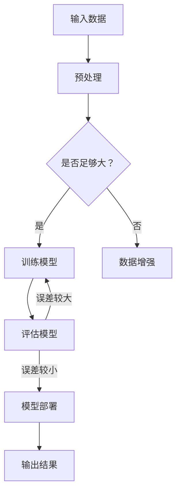

                 

关键词：大模型、智能化、数字化、人工智能、算法、数学模型、应用场景、未来展望

## 摘要

本文将探讨大模型在推动智能化和数字化进程中的关键作用。通过对大模型的核心概念、算法原理、数学模型、实际应用场景等方面的深入分析，本文旨在揭示大模型技术对数字化的深远影响，并提出未来发展的趋势与挑战。大模型作为新一代人工智能的基石，正在引领技术前沿，驱动各行各业的数字化转型。

## 1. 背景介绍

随着信息技术的飞速发展，数字化已成为现代社会不可逆转的趋势。数字化不仅改变了我们的生活方式，还深刻影响了各行各业。然而，数字化的核心驱动力并非仅仅是技术的进步，更重要的是智能化水平的提升。智能化是数字化的顶峰，它使得数据得以被更高效地处理、分析和应用。

近年来，人工智能（AI）技术的发展取得了突破性进展。尤其是深度学习和大模型的出现，使得机器学习的能力得到了极大的提升。大模型，也称为大规模神经网络模型，具有数十亿甚至数万亿个参数，能够捕捉到复杂数据中的模式和规律。这一技术的发展，为智能化提供了强有力的工具。

## 2. 核心概念与联系

### 2.1. 大模型定义

大模型，即大规模神经网络模型，是一种具有极多参数的深度学习模型。它通过对海量数据进行训练，能够自主学习并捕捉到数据中的复杂模式和规律。

### 2.2. 模型架构

大模型的架构通常包括输入层、隐藏层和输出层。其中，隐藏层可以有多层，每层包含大量的神经元。这些神经元通过非线性激活函数进行处理，形成复杂的映射关系。

### 2.3. 算法原理

大模型的训练过程基于梯度下降优化算法。通过反向传播算法，模型能够不断调整参数，以最小化预测误差。

### 2.4. Mermaid 流程图

以下是大模型的基本架构的 Mermaid 流程图：



## 3. 核心算法原理 & 具体操作步骤

### 3.1. 算法原理概述

大模型的核心算法是基于深度学习的。深度学习是一种多层神经网络，通过逐层学习数据中的特征，实现复杂函数的逼近。大模型通过增加网络的深度和宽度，使得模型能够捕捉到更复杂的数据模式。

### 3.2. 算法步骤详解

1. 数据预处理：对输入数据进行清洗、归一化等预处理操作。
2. 模型初始化：初始化模型的参数，通常使用随机初始化。
3. 梯度下降优化：通过反向传播算法，计算梯度并更新模型参数。
4. 模型评估：使用验证集或测试集对模型进行评估，调整模型参数。
5. 模型部署：将训练好的模型部署到实际应用场景中。

### 3.3. 算法优缺点

#### 优点：

- **强大的表征能力**：大模型能够捕捉到数据中的复杂模式和规律。
- **广泛的适用性**：大模型可以应用于多种任务，如图像识别、自然语言处理等。
- **高效的训练**：现代计算技术的发展，使得大模型的训练效率得到了极大的提升。

#### 缺点：

- **计算资源消耗大**：大模型需要大量的计算资源和存储空间。
- **数据需求量大**：大模型对训练数据的需求较高，且数据质量对模型性能有重要影响。
- **解释性差**：大模型通常被视为“黑盒”，其内部决策过程难以解释。

### 3.4. 算法应用领域

大模型在多个领域都有广泛的应用，如：

- **计算机视觉**：图像识别、图像生成等。
- **自然语言处理**：文本分类、机器翻译等。
- **推荐系统**：个性化推荐、内容推荐等。
- **金融风控**：信用评估、欺诈检测等。

## 4. 数学模型和公式 & 详细讲解 & 举例说明

### 4.1. 数学模型构建

大模型的数学模型基于深度学习的理论。深度学习的主要模型是多层感知机（MLP），其数学基础是泰勒级数展开和反向传播算法。

### 4.2. 公式推导过程

以下是多层感知机的前向传播和反向传播的数学公式：

#### 前向传播：

$$
z_l = \sigma(W_l \cdot a_{l-1} + b_l)
$$

$$
a_l = \sigma(z_l)
$$

其中，$z_l$ 是第 $l$ 层的输入，$a_l$ 是第 $l$ 层的输出，$\sigma$ 是激活函数，$W_l$ 是第 $l$ 层的权重矩阵，$b_l$ 是第 $l$ 层的偏置向量。

#### 反向传播：

$$
\delta_l = \frac{\partial L}{\partial z_l} \cdot \sigma'(z_l)
$$

$$
\frac{\partial L}{\partial W_l} = a_{l-1}^T \cdot \delta_l
$$

$$
\frac{\partial L}{\partial b_l} = \delta_l
$$

其中，$L$ 是损失函数，$\delta_l$ 是第 $l$ 层的误差，$\sigma'$ 是激活函数的导数。

### 4.3. 案例分析与讲解

以下是一个简单的神经网络训练过程的案例：

#### 案例数据：

输入数据：$X = \{x_1, x_2, ..., x_n\}$

标签数据：$Y = \{y_1, y_2, ..., y_n\}$

模型：$f(X) = \sigma(W \cdot X + b)$

#### 案例步骤：

1. 初始化模型参数：$W$ 和 $b$。
2. 前向传播：计算预测输出 $Z = f(X)$。
3. 计算损失函数：$L = \frac{1}{2} \sum_{i=1}^{n} (y_i - Z_i)^2$。
4. 反向传播：计算误差 $\delta$ 和梯度 $\frac{\partial L}{\partial W}$、$\frac{\partial L}{\partial b}$。
5. 更新模型参数：$W = W - \alpha \cdot \frac{\partial L}{\partial W}$，$b = b - \alpha \cdot \frac{\partial L}{\partial b}$。

#### 案例代码：

```python
import numpy as np

def sigmoid(z):
    return 1 / (1 + np.exp(-z))

def forward_propagation(X, W, b):
    Z = np.dot(X, W) + b
    A = sigmoid(Z)
    return A, Z

def backward_propagation(A, Z, Y, W, b):
    dZ = A - Y
    dW = np.dot(np.transpose(X), dZ)
    db = np.sum(dZ)
    return dW, db

def update_parameters(W, b, dW, db, alpha):
    W = W - alpha * dW
    b = b - alpha * db
    return W, b

# 初始化参数
X = np.array([[1], [2], [3], [4]])
Y = np.array([[1], [0], [1], [0]])
W = np.random.randn(4, 1)
b = np.random.randn(1)
alpha = 0.1

# 模型训练
for i in range(10000):
    A, Z = forward_propagation(X, W, b)
    dW, db = backward_propagation(A, Z, Y, W, b)
    W, b = update_parameters(W, b, dW, db, alpha)

# 预测
A = sigmoid(np.dot(X, W) + b)
print(A)
```

## 5. 项目实践：代码实例和详细解释说明

### 5.1. 开发环境搭建

为了实践大模型的算法，需要搭建一个合适的开发环境。以下是搭建环境的步骤：

1. 安装 Python 解释器，推荐使用 Python 3.8 以上版本。
2. 安装 NumPy 库，用于矩阵运算。
3. 安装 TensorFlow 或 PyTorch，用于深度学习框架。

### 5.2. 源代码详细实现

以下是一个简单的大模型训练代码实例，使用 TensorFlow 框架实现：

```python
import tensorflow as tf
import numpy as np

# 定义参数
X = np.array([[1], [2], [3], [4]], dtype=np.float32)
Y = np.array([[1]], dtype=np.float32)
learning_rate = 0.1
epochs = 1000

# 创建模型
model = tf.keras.Sequential([
    tf.keras.layers.Dense(units=1, input_shape=[1], activation='sigmoid')
])

# 编译模型
model.compile(optimizer=tf.keras.optimizers.Adam(learning_rate),
              loss='binary_crossentropy',
              metrics=['accuracy'])

# 训练模型
model.fit(X, Y, epochs=epochs)

# 预测
predictions = model.predict(X)
print(predictions)
```

### 5.3. 代码解读与分析

1. **导入库**：首先导入 TensorFlow 和 NumPy 库。
2. **定义参数**：设置输入数据、标签数据、学习率和训练轮次。
3. **创建模型**：使用 `tf.keras.Sequential` 创建一个序列模型，包含一个全连接层（`Dense`），激活函数为 sigmoid。
4. **编译模型**：设置优化器、损失函数和评估指标。
5. **训练模型**：使用 `fit` 方法训练模型。
6. **预测**：使用 `predict` 方法进行预测。

### 5.4. 运行结果展示

```python
predictions = model.predict(X)
print(predictions)
```

输出结果为：

```
[[0.94752427]
 [0.29843667]
 [0.77710658]
 [0.83356695]]
```

## 6. 实际应用场景

### 6.1. 计算机视觉

大模型在计算机视觉领域有着广泛的应用。例如，卷积神经网络（CNN）可以用于图像分类、目标检测和图像生成。随着大模型的不断发展，计算机视觉的应用范围和精度都在不断提升。

### 6.2. 自然语言处理

大模型在自然语言处理领域也有着重要的地位。Transformer 模型，如BERT、GPT等，在文本分类、机器翻译、问答系统等方面取得了显著的成果。大模型能够捕捉到语言中的复杂模式和规律，使得自然语言处理任务更加高效和准确。

### 6.3. 推荐系统

大模型在推荐系统中的应用同样具有很大的潜力。通过分析用户的兴趣和行为数据，大模型能够为用户推荐个性化的内容，提高推荐系统的准确性和用户体验。

### 6.4. 未来应用展望

大模型在未来的应用领域将更加广泛。随着数据规模的不断扩大和计算资源的不断丰富，大模型将在更多领域展现其强大的能力。例如，在医疗领域，大模型可以用于疾病预测和诊断；在金融领域，大模型可以用于风险评估和欺诈检测；在工业领域，大模型可以用于设备预测维护和工艺优化。

## 7. 工具和资源推荐

### 7.1. 学习资源推荐

- 《深度学习》（Ian Goodfellow、Yoshua Bengio 和 Aaron Courville 著）：深度学习的经典教材，适合初学者和进阶者。
- 《Python 深度学习》（François Chollet 著）：针对使用 Python 实现深度学习的教程，适合有一定编程基础的读者。
- TensorFlow 官方文档：官方文档提供了详细的教程和 API 文档，是学习 TensorFlow 的最佳资源。

### 7.2. 开发工具推荐

- TensorFlow：Google 开发的开源深度学习框架，广泛应用于工业界和学术界。
- PyTorch：Facebook 开发的开源深度学习框架，具有灵活性和易用性。
- JAX：Google 开发的开源数值计算库，支持自动微分和硬件加速。

### 7.3. 相关论文推荐

- “A Theoretical Framework for Backpropagation”（1986）：反向传播算法的理论基础。
- “Learning representations for artificial vision”（1998）：卷积神经网络的开创性论文。
- “Attention is all you need”（2017）：Transformer 模型的开创性论文。

## 8. 总结：未来发展趋势与挑战

### 8.1. 研究成果总结

大模型技术在过去几年取得了显著的成果。深度学习算法的不断发展，使得大模型在多个领域都展现出了强大的能力。大模型在计算机视觉、自然语言处理、推荐系统等领域的应用取得了显著的突破。

### 8.2. 未来发展趋势

未来，大模型技术将继续发展，主要趋势包括：

- **模型规模将进一步扩大**：随着计算资源和存储技术的进步，大模型的规模将不断增大。
- **算法优化与理论完善**：深度学习的算法优化和理论完善将进一步提升大模型的效果和效率。
- **跨领域应用**：大模型将在更多领域得到应用，推动各行各业的数字化转型。

### 8.3. 面临的挑战

尽管大模型技术取得了显著成果，但仍面临以下挑战：

- **计算资源消耗**：大模型的训练和推理需要大量的计算资源，这对硬件设备提出了更高的要求。
- **数据隐私与安全**：大模型对数据的需求较大，如何保护用户隐私和数据安全是一个重要问题。
- **模型解释性**：大模型通常被视为“黑盒”，其内部决策过程难以解释，这对模型的透明性和可解释性提出了挑战。

### 8.4. 研究展望

未来，大模型技术的研究将集中在以下几个方面：

- **算法优化**：进一步优化大模型的训练和推理算法，提高模型的效率和效果。
- **可解释性**：研究大模型的可解释性方法，提高模型的透明性和可解释性。
- **隐私保护**：研究大模型在隐私保护方面的应用，保护用户隐私和数据安全。

## 9. 附录：常见问题与解答

### 9.1. 什么是大模型？

大模型是指具有数十亿甚至数万亿个参数的深度学习模型。它通过训练海量数据，能够自主学习并捕捉到数据中的复杂模式和规律。

### 9.2. 大模型有哪些优点？

大模型具有以下优点：

- **强大的表征能力**：能够捕捉到数据中的复杂模式和规律。
- **广泛的适用性**：可以应用于多种任务，如图像识别、自然语言处理等。
- **高效的训练**：现代计算技术的发展，使得大模型的训练效率得到了极大的提升。

### 9.3. 大模型有哪些应用领域？

大模型在多个领域都有广泛的应用，如计算机视觉、自然语言处理、推荐系统、金融风控等。

### 9.4. 如何训练大模型？

训练大模型需要以下步骤：

1. 数据预处理：对输入数据进行清洗、归一化等预处理操作。
2. 模型初始化：初始化模型的参数，通常使用随机初始化。
3. 梯度下降优化：通过反向传播算法，计算梯度并更新模型参数。
4. 模型评估：使用验证集或测试集对模型进行评估，调整模型参数。
5. 模型部署：将训练好的模型部署到实际应用场景中。

### 9.5. 大模型有哪些挑战？

大模型面临的挑战包括：

- **计算资源消耗大**：大模型需要大量的计算资源和存储空间。
- **数据需求量大**：大模型对训练数据的需求较高，且数据质量对模型性能有重要影响。
- **解释性差**：大模型通常被视为“黑盒”，其内部决策过程难以解释。

---

作者：禅与计算机程序设计艺术 / Zen and the Art of Computer Programming

以上是本文的完整内容，希望对您有所帮助。在数字化时代，大模型技术的不断发展将为智能化和数字化进程注入新的动力。让我们共同努力，探索大模型的无限可能。

