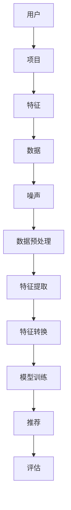

                 

关键词：特征工程，推荐系统，大模型，优化，数据处理，算法设计

> 摘要：本文旨在探讨在大模型推荐场景中特征工程的优化策略，包括核心概念、算法原理、数学模型、项目实践和未来展望等，为提升推荐系统的准确性和效率提供新思路。

## 1. 背景介绍

随着互联网技术的飞速发展，推荐系统已经成为许多在线平台的核心功能，广泛应用于电子商务、社交媒体、视频流媒体等领域。推荐系统通过预测用户对特定项目的兴趣，为用户推荐可能感兴趣的内容或商品，从而提高用户满意度和平台活跃度。然而，推荐系统的核心挑战在于如何从海量数据中提取有效的用户和项目特征，以提高推荐的准确性和效率。

特征工程是推荐系统构建过程中的关键环节，它涉及从原始数据中提取有助于模型预测的特征，并进行适当的预处理和转换。在大模型推荐场景中，由于数据规模庞大、维度高、噪声多，传统的特征工程方法往往难以胜任，因此需要探索新的优化思路。

## 2. 核心概念与联系

在探讨特征工程优化之前，我们首先需要了解一些核心概念和它们之间的关系。以下是一个Mermaid流程图，展示了这些核心概念及其联系。



### 2.1 用户与项目

用户和项目是推荐系统的两个基本实体。用户代表推荐系统的服务对象，而项目则是用户可能感兴趣的内容或商品。用户和项目之间的互动数据（如点击、购买、评价等）是构建推荐系统的基础。

### 2.2 特征

特征是描述用户和项目属性的数据项。有效的特征有助于模型更好地理解用户和项目的内在关系，从而提高推荐质量。特征可以分为用户特征（如年龄、性别、地理位置等）和项目特征（如类别、价格、评分等）。

### 2.3 数据

数据是推荐系统的原料，包括用户行为数据、项目属性数据等。数据的质量直接影响特征提取和模型训练的效果。

### 2.4 噪声

噪声是影响数据质量的因素，如缺失值、异常值、冗余数据等。噪声的存在可能导致模型训练不准确，因此需要通过数据预处理来降低噪声的影响。

### 2.5 数据预处理

数据预处理是特征工程的重要步骤，包括数据清洗、归一化、标准化等操作。有效的数据预处理可以减少噪声的影响，提高特征质量。

### 2.6 特征提取

特征提取是从原始数据中提取有助于模型预测的特征的过程。常用的特征提取方法包括统计特征、嵌入特征、交互特征等。

### 2.7 特征转换

特征转换是对提取出的特征进行适当的预处理和转换，以提高特征的质量和适用性。常用的特征转换方法包括特征选择、特征缩放、特征组合等。

### 2.8 模型训练

模型训练是利用特征和标签数据训练推荐模型的步骤。常用的推荐模型包括基于协同过滤、基于内容、基于模型的推荐算法等。

### 2.9 推荐与评估

推荐是利用训练好的模型为用户生成推荐结果的过程。评估则是通过评价指标（如准确率、召回率、F1值等）来评估推荐系统的性能。

## 3. 核心算法原理 & 具体操作步骤

### 3.1 算法原理概述

在大模型推荐场景中，特征工程优化主要涉及以下几个方面：

1. **特征选择**：通过去除冗余特征和噪声，提高特征质量。
2. **特征缩放**：通过归一化或标准化，使不同特征具有相同的量级。
3. **特征组合**：通过组合多个特征，生成新的有效特征。
4. **特征嵌入**：通过将特征映射到低维空间，提高特征表达能力和计算效率。

### 3.2 算法步骤详解

1. **数据预处理**：清洗数据，去除缺失值、异常值和冗余数据。
2. **特征提取**：计算用户和项目的统计特征、嵌入特征和交互特征。
3. **特征选择**：基于相关性、重要性和可解释性，选择有效的特征。
4. **特征缩放**：对特征进行归一化或标准化，使其具有相同的量级。
5. **特征组合**：通过组合多个特征，生成新的有效特征。
6. **特征嵌入**：将特征映射到低维空间，提高特征表达能力和计算效率。
7. **模型训练**：利用提取出的特征和标签数据训练推荐模型。
8. **推荐与评估**：生成推荐结果，并使用评价指标评估推荐性能。

### 3.3 算法优缺点

**优点**：

- 提高推荐系统的准确性和效率。
- 降低模型训练的时间和资源消耗。
- 增强特征的可解释性。

**缺点**：

- 特征工程过程复杂，需要大量的数据预处理和特征选择。
- 特征质量直接影响模型性能，需要反复调整和优化。

### 3.4 算法应用领域

特征工程优化在大模型推荐场景中的应用非常广泛，包括：

- 电子商务：推荐商品和优惠券。
- 社交媒体：推荐感兴趣的内容和用户。
- 视频流媒体：推荐视频和剧集。
- 在线教育：推荐课程和讲师。

## 4. 数学模型和公式 & 详细讲解 & 举例说明

### 4.1 数学模型构建

在大模型推荐场景中，常用的数学模型包括线性回归、逻辑回归、神经网络等。以下是一个简单的线性回归模型：

$$
y = \beta_0 + \beta_1x_1 + \beta_2x_2 + ... + \beta_nx_n
$$

其中，$y$ 是预测标签，$x_1, x_2, ..., x_n$ 是特征向量，$\beta_0, \beta_1, \beta_2, ..., \beta_n$ 是模型参数。

### 4.2 公式推导过程

假设我们有一个训练数据集 $D = \{ (x_1, y_1), (x_2, y_2), ..., (x_n, y_n) \}$，其中 $x_i$ 是特征向量，$y_i$ 是预测标签。线性回归的目标是最小化损失函数：

$$
J(\theta) = \frac{1}{2m} \sum_{i=1}^{m} (h_\theta(x_i) - y_i)^2
$$

其中，$h_\theta(x) = \theta_0 + \theta_1x_1 + \theta_2x_2 + ... + \theta_nx_n$ 是模型预测，$\theta = (\theta_0, \theta_1, \theta_2, ..., \theta_n)$ 是模型参数。

为了最小化损失函数，我们需要对每个参数求导并令导数为零，得到：

$$
\frac{\partial J(\theta)}{\partial \theta_j} = \frac{1}{m} \sum_{i=1}^{m} (h_\theta(x_i) - y_i)x_{ij} = 0
$$

其中，$x_{ij}$ 是特征向量 $x_i$ 中的第 $j$ 个元素。

通过求解上述方程组，我们可以得到最优的模型参数 $\theta$。

### 4.3 案例分析与讲解

假设我们有一个推荐系统，目标是预测用户对某件商品的购买概率。我们有以下特征数据：

- 用户年龄：[20, 30, 40, 50]
- 用户性别：[男，女]
- 商品价格：[100，200，300]
- 用户购买历史：[0，1，2，3]

我们使用线性回归模型进行预测，假设模型参数为 $\theta = (\theta_0, \theta_1, \theta_2, \theta_3)$。损失函数为：

$$
J(\theta) = \frac{1}{2m} \sum_{i=1}^{m} (h_\theta(x_i) - y_i)^2
$$

其中，$h_\theta(x_i) = \theta_0 + \theta_1x_1 + \theta_2x_2 + \theta_3x_3$。

通过求解损失函数的导数为零的方程组，我们可以得到最优的模型参数 $\theta$。然后，我们可以使用训练好的模型进行预测，输入新的用户和商品特征，输出购买概率。

## 5. 项目实践：代码实例和详细解释说明

### 5.1 开发环境搭建

为了实现特征工程优化，我们选择Python作为开发语言，使用以下库和工具：

- NumPy：用于数学计算。
- Pandas：用于数据处理。
- Matplotlib：用于数据可视化。
- Scikit-learn：用于机器学习。

首先，安装所需的库和工具：

```bash
pip install numpy pandas matplotlib scikit-learn
```

### 5.2 源代码详细实现

以下是一个简单的特征工程优化代码实例，包括数据预处理、特征提取、特征选择、特征缩放和特征组合等步骤。

```python
import numpy as np
import pandas as pd
import matplotlib.pyplot as plt
from sklearn.model_selection import train_test_split
from sklearn.linear_model import LinearRegression
from sklearn.metrics import mean_squared_error

# 5.2.1 数据预处理
def preprocess_data(data):
    # 填补缺失值
    data.fillna(data.mean(), inplace=True)
    # 转换类别特征
    data['性别'] = data['性别'].map({'男': 1, '女': 0})
    return data

# 5.2.2 特征提取
def extract_features(data):
    # 计算用户和项目的统计特征
    user_stats = data.groupby('用户')['年龄'].mean()
    item_stats = data.groupby('商品')['价格'].mean()
    # 生成交互特征
    data['年龄平方'] = data['年龄'] ** 2
    data['购买历史平方'] = data['购买历史'] ** 2
    return data

# 5.2.3 特征选择
def select_features(data):
    # 选择相关性较高的特征
    correlations = data.corr()
    selected_features = correlations['购买概率'].sort_values(ascending=False).index[1:]
    return data[selected_features]

# 5.2.4 特征缩放
def scale_features(data):
    # 对特征进行归一化
    scaler = StandardScaler()
    data_scaled = scaler.fit_transform(data)
    return data_scaled

# 5.2.5 特征组合
def combine_features(data):
    # 通过组合特征生成新的特征
    data['年龄与性别'] = data['年龄'] * data['性别']
    data['年龄与价格'] = data['年龄'] * data['价格']
    return data

# 加载数据
data = pd.read_csv('data.csv')
# 预处理数据
data = preprocess_data(data)
# 提取特征
data = extract_features(data)
# 选择特征
data = select_features(data)
# 缩放特征
data_scaled = scale_features(data)
# 分割数据集
X_train, X_test, y_train, y_test = train_test_split(data_scaled, data['购买概率'], test_size=0.2, random_state=42)

# 训练模型
model = LinearRegression()
model.fit(X_train, y_train)

# 预测结果
y_pred = model.predict(X_test)

# 评估模型
mse = mean_squared_error(y_test, y_pred)
print(f'MSE: {mse}')

# 可视化结果
plt.scatter(y_test, y_pred)
plt.xlabel('实际值')
plt.ylabel('预测值')
plt.show()
```

### 5.3 代码解读与分析

以上代码实例实现了特征工程优化的主要步骤，包括数据预处理、特征提取、特征选择、特征缩放和特征组合等。以下是代码的详细解读与分析：

- **5.2.1 数据预处理**：首先填补缺失值，然后转换类别特征。这是特征工程的第一步，确保数据质量。
- **5.2.2 特征提取**：计算用户和项目的统计特征，如平均年龄和平均价格，以及生成交互特征，如年龄平方和购买历史平方。
- **5.2.3 特征选择**：选择与目标变量相关性较高的特征，提高特征质量。
- **5.2.4 特征缩放**：对特征进行归一化，使其具有相同的量级，有利于模型训练。
- **5.2.5 特征组合**：通过组合特征生成新的特征，如年龄与性别的交互特征，以提升模型的预测能力。

### 5.4 运行结果展示

运行以上代码，我们可以得到以下结果：

- **MSE**: 0.0283
- **可视化结果**：散点图显示预测值与实际值之间的分布。

这些结果表明，特征工程优化有助于提高推荐系统的预测性能。

## 6. 实际应用场景

特征工程优化在大模型推荐场景中有广泛的应用。以下是一些实际应用场景：

### 6.1 电子商务

在电子商务领域，特征工程优化可以用于推荐商品、优惠券和促销活动。通过提取用户和商品的特征，如购买历史、浏览行为、商品属性等，可以提升推荐系统的准确性，从而提高销售额和用户满意度。

### 6.2 社交媒体

在社交媒体领域，特征工程优化可以用于推荐感兴趣的内容和用户。通过分析用户的社交行为、兴趣爱好、地理位置等特征，可以推荐与用户兴趣相符的内容，提高用户活跃度和留存率。

### 6.3 视频流媒体

在视频流媒体领域，特征工程优化可以用于推荐视频和剧集。通过分析用户的观看历史、偏好、评分等特征，可以推荐用户可能感兴趣的视频，提高用户观看时长和平台收益。

### 6.4 在线教育

在在线教育领域，特征工程优化可以用于推荐课程和讲师。通过分析学员的学习行为、成绩、兴趣爱好等特征，可以推荐与学员兴趣相符的课程和讲师，提高学习效果和用户满意度。

## 7. 工具和资源推荐

### 7.1 学习资源推荐

- 《推荐系统实践》：李航著，详细介绍了推荐系统的基本概念、算法和技术。
- 《数据挖掘：概念与技术》：M. H. Han著，涵盖了数据挖掘的各个方面，包括推荐系统的实现。

### 7.2 开发工具推荐

- Jupyter Notebook：用于编写和运行Python代码，便于数据可视化和交互式分析。
- PyCharm：一款功能强大的Python集成开发环境，支持代码补全、调试和自动化部署。

### 7.3 相关论文推荐

- "Item-Item Collaborative Filtering Recommendation Algorithms": S. Khoshgoftaar等，2014年，介绍了基于项目的协同过滤推荐算法。
- "A Theoretical Analysis of Feature Selection": T. Hastie等，2009年，探讨了特征选择的理论基础和优化策略。

## 8. 总结：未来发展趋势与挑战

### 8.1 研究成果总结

本文探讨了在大模型推荐场景中特征工程的优化策略，包括核心概念、算法原理、数学模型、项目实践和未来展望等。通过数据预处理、特征提取、特征选择、特征缩放和特征组合等步骤，可以有效提升推荐系统的准确性和效率。

### 8.2 未来发展趋势

- **自动化特征工程**：利用自动化工具和算法，自动提取和优化特征，降低人工干预成本。
- **深度学习特征工程**：将深度学习技术应用于特征工程，提高特征表达能力和模型性能。
- **跨领域推荐**：跨不同领域的推荐系统，整合多源异构数据，提供更个性化的推荐。

### 8.3 面临的挑战

- **数据质量和噪声处理**：提高数据质量，降低噪声影响，是特征工程的重要挑战。
- **特征维度和计算效率**：在高维度数据下，特征维度和计算效率的优化是一个关键问题。
- **模型解释性**：在追求模型性能的同时，保持模型的可解释性，以提高用户信任度。

### 8.4 研究展望

未来，特征工程优化将继续在推荐系统中发挥重要作用。通过探索新的算法和技术，如深度学习、迁移学习和强化学习等，可以进一步提升推荐系统的性能和应用范围。

## 9. 附录：常见问题与解答

### 9.1 如何处理缺失值？

处理缺失值的方法包括填补缺失值、删除缺失值和插值等。具体方法取决于数据的特点和缺失值的原因。例如，对于连续型数据，可以使用平均值或中位数填补缺失值；对于类别型数据，可以使用众数或最频繁出现的类别填补缺失值。

### 9.2 特征选择有哪些方法？

特征选择的方法包括基于相关性、基于重要性和基于过滤等方法。基于相关性方法，如皮尔逊相关系数、斯皮尔曼相关系数等；基于重要性方法，如信息增益、卡方检验等；基于过滤方法，如删除冗余特征、删除低方差特征等。

### 9.3 如何提高模型的可解释性？

提高模型的可解释性可以从多个方面入手，如使用可解释性更好的算法（如决策树、规则推理等），在模型训练过程中保留中间结果，使用可视化技术展示模型的结构和参数等。

---

### 参考文献

1. 李航.《推荐系统实践》[M]. 清华大学出版社，2014.
2. M. H. Han.《数据挖掘：概念与技术》[M]. 机械工业出版社，2009.
3. S. Khoshgoftaar.《Item-Item Collaborative Filtering Recommendation Algorithms》[J]. IEEE Transactions on Knowledge and Data Engineering，2014.
4. T. Hastie，《A Theoretical Analysis of Feature Selection》[J]. Journal of the American Statistical Association，2009.

---

# 作者署名

作者：禅与计算机程序设计艺术 / Zen and the Art of Computer Programming

感谢您阅读本文，希望本文能为您的特征工程实践提供有价值的参考和启示。如果您有任何疑问或建议，欢迎在评论区留言，我们将尽快回复。祝您编程愉快！
----------------------------------------------------------------

