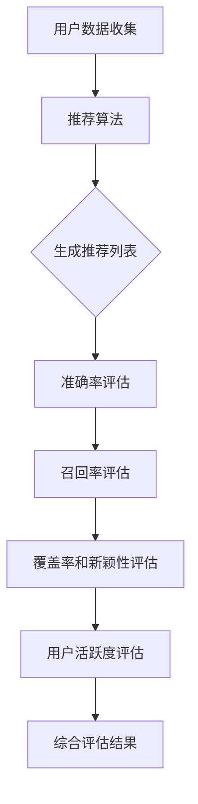

                 

关键词：推荐系统、评估指标、大模型、准确率、召回率、F1分数、覆盖率、新颖性、用户活跃度、模型性能优化

> 摘要：本文深入探讨了推荐系统在大模型应用中的关键评估指标，包括准确率、召回率、F1分数、覆盖率、新颖性和用户活跃度等。通过详细分析这些指标的理论基础和实际应用，本文为推荐系统的优化提供了指导性的思路，并展望了未来的发展趋势和面临的挑战。

## 1. 背景介绍

推荐系统已经成为互联网时代的重要应用之一，从电商购物到视频流媒体，再到社交媒体，无处不在。随着大数据和人工智能技术的发展，推荐系统的规模和复杂度不断提升，尤其在大模型（如深度学习模型）的驱动下，推荐系统的表现得到了显著的提升。

然而，评价推荐系统的性能是一个复杂且关键的问题。传统的评估指标如准确率、召回率等虽然在理论上简单易懂，但在实际应用中却面临着诸多挑战。首先，这些指标往往偏向于单方面的优化，例如提升准确率可能会降低召回率。其次，这些指标通常无法全面反映推荐系统的实际效果，如用户满意度、用户活跃度等。

因此，研究推荐系统的多维度评估指标，不仅有助于提高推荐系统的性能，还能够为实际应用中的决策提供有力支持。本文将详细介绍推荐系统的核心评估指标，包括准确率、召回率、F1分数、覆盖率、新颖性和用户活跃度等，并探讨其在实际应用中的适用性和局限性。

## 2. 核心概念与联系

### 2.1 推荐系统的基本概念

推荐系统是指通过某种算法或模型，向用户推荐他们可能感兴趣的商品、信息或服务。它通常包括以下几个关键组件：

- **用户数据收集**：包括用户的行为数据、偏好数据等。
- **推荐算法**：根据用户数据和物品特征，生成推荐列表。
- **推荐结果评估**：通过评估指标来衡量推荐系统的性能。

### 2.2 推荐系统的评估指标

评估推荐系统性能的关键指标包括：

- **准确率**（Accuracy）：预测正确的样本数占总样本数的比例。
- **召回率**（Recall）：实际感兴趣的样本中被正确推荐的样本数占总感兴趣样本数的比例。
- **F1分数**（F1 Score）：准确率和召回率的调和平均，用于平衡两者之间的矛盾。
- **覆盖率**（Coverage）：推荐列表中包含的物品数量与总物品数量的比例。
- **新颖性**（Novelty）：推荐列表中的物品与用户已知的或常见的物品的差异程度。
- **用户活跃度**（User Engagement）：用户对推荐结果的互动程度，如点击率、转化率等。

### 2.3 评估指标之间的联系与比较

- **准确率**和**召回率**是评价推荐系统最基本且最常用的两个指标。准确率关注的是推荐结果的正确性，而召回率关注的是推荐结果的完整性。
- **F1分数**则是准确率和召回率的平衡指标，当两者之间存在矛盾时，F1分数能够提供一个统一的评估标准。
- **覆盖率**和**新颖性**则更多地关注推荐列表的多样性和独特性。
- **用户活跃度**则是评价推荐系统对用户吸引力的直接指标。

### 2.4 Mermaid 流程图

下面是一个推荐系统评估指标的基本流程图：

## 3. 核心算法原理 & 具体操作步骤

### 3.1 算法原理概述

推荐系统的核心在于构建用户和物品之间的关联模型，并基于此模型生成推荐列表。常用的算法包括基于协同过滤的推荐算法、基于内容的推荐算法和基于模型的推荐算法。

- **协同过滤推荐算法**：通过分析用户的行为数据，找出相似的用户或物品，从而生成推荐列表。
- **基于内容的推荐算法**：根据用户过去的偏好和物品的特征，计算相似度，生成推荐列表。
- **基于模型的推荐算法**：使用机器学习模型（如深度学习模型）来预测用户对物品的偏好，生成推荐列表。

### 3.2 算法步骤详解

1. **数据收集与预处理**：收集用户行为数据和物品特征数据，并进行预处理，如数据清洗、数据降维等。
2. **构建用户-物品矩阵**：基于用户行为数据，构建用户-物品矩阵，用于后续的模型训练。
3. **模型训练**：使用机器学习算法（如矩阵分解、神经网络等）训练用户-物品矩阵，得到预测模型。
4. **生成推荐列表**：根据训练好的模型，对未评分的物品进行预测，生成推荐列表。
5. **评估推荐结果**：使用准确率、召回率、F1分数等评估指标对推荐结果进行评估。

### 3.3 算法优缺点

- **协同过滤推荐算法**：优点在于能够根据用户行为预测用户的偏好，缺点是当用户行为数据较少时，推荐效果较差。
- **基于内容的推荐算法**：优点在于能够根据物品的特征进行推荐，缺点是当物品特征不够丰富时，推荐效果较差。
- **基于模型的推荐算法**：优点在于能够通过模型训练得到更好的预测效果，缺点是训练过程较为复杂，对数据质量要求较高。

### 3.4 算法应用领域

推荐系统广泛应用于多个领域，如：

- **电子商务**：根据用户的购买历史和浏览记录，推荐相关商品。
- **社交媒体**：根据用户的兴趣和行为，推荐相关的帖子或用户。
- **视频流媒体**：根据用户的观看历史和偏好，推荐相关的视频。

## 4. 数学模型和公式 & 详细讲解 & 举例说明

### 4.1 数学模型构建

推荐系统的核心在于构建用户和物品之间的关联模型，常用的模型包括矩阵分解模型、因子分解机模型等。

#### 矩阵分解模型

矩阵分解模型将用户-物品矩阵分解为两个低秩矩阵，分别表示用户特征和物品特征。具体公式如下：

$$
\textbf{U} = \textbf{UV}^T
$$

其中，$\textbf{U}$表示用户特征矩阵，$\textbf{V}$表示物品特征矩阵。

#### 因子分解机模型

因子分解机模型是一种基于机器学习的矩阵分解算法，通过最小化损失函数来训练模型。具体公式如下：

$$
L(\theta) = \frac{1}{2m}\sum_{i=1}^m \sum_{j=1}^n (r_{ij} - \textbf{u}_i^T \textbf{v}_j)^2
$$

其中，$r_{ij}$表示用户$i$对物品$j$的评分，$\textbf{u}_i$和$\textbf{v}_j$分别表示用户$i$和物品$j$的特征向量。

### 4.2 公式推导过程

#### 矩阵分解模型推导

假设用户-物品矩阵为$\textbf{R}$，其维度为$m \times n$，其中$m$为用户数，$n$为物品数。我们希望将$\textbf{R}$分解为两个低秩矩阵$\textbf{U}$和$\textbf{V}$，使得$\textbf{R} \approx \textbf{UV}^T$。

首先，我们考虑最小化损失函数：

$$
L(\textbf{U}, \textbf{V}) = \frac{1}{2m}\sum_{i=1}^m \sum_{j=1}^n (r_{ij} - \textbf{u}_i^T \textbf{v}_j)^2
$$

对$\textbf{U}$和$\textbf{V}$分别求偏导并令其等于零，得到：

$$
\frac{\partial L}{\partial \textbf{U}} = 0 \quad \text{和} \quad \frac{\partial L}{\partial \textbf{V}} = 0
$$

解得：

$$
\textbf{U} = \frac{1}{\sqrt{m}} \textbf{R}\textbf{V}^T \quad \text{和} \quad \textbf{V} = \frac{1}{\sqrt{n}} \textbf{R}^T\textbf{U}
$$

#### 因子分解机模型推导

假设用户-物品矩阵为$\textbf{R}$，其维度为$m \times n$。我们希望使用因子分解机模型来最小化损失函数。

首先，定义用户特征向量为$\textbf{u}_i \in \mathbb{R}^k$，物品特征向量为$\textbf{v}_j \in \mathbb{R}^k$。预测用户$i$对物品$j$的评分为：

$$
\hat{r}_{ij} = \textbf{u}_i^T \textbf{v}_j
$$

损失函数定义为：

$$
L(\theta) = \frac{1}{2m}\sum_{i=1}^m \sum_{j=1}^n (r_{ij} - \hat{r}_{ij})^2
$$

其中，$\theta = (\textbf{u}_1, \textbf{u}_2, ..., \textbf{u}_m, \textbf{v}_1, \textbf{v}_2, ..., \textbf{v}_n)$为模型参数。

对$\theta$求偏导并令其等于零，得到：

$$
\nabla_{\theta} L = \frac{1}{m}\sum_{i=1}^m \sum_{j=1}^n (r_{ij} - \hat{r}_{ij})(-\textbf{v}_j + \textbf{u}_i\textbf{v}_j\textbf{v}_j^T)
$$

设$\textbf{W} = \textbf{V}^T$，则：

$$
\nabla_{\theta} L = \frac{1}{m}\sum_{i=1}^m \sum_{j=1}^n (r_{ij} - \hat{r}_{ij})(-\textbf{v}_j + \textbf{u}_i\textbf{W}\textbf{v}_j)
$$

### 4.3 案例分析与讲解

#### 案例一：矩阵分解模型在电影推荐中的应用

假设有100个用户和1000个电影，用户对电影的评分数据构成一个100x1000的矩阵$\textbf{R}$。我们使用矩阵分解模型来生成用户和电影的低秩特征矩阵$\textbf{U}$和$\textbf{V}$。

首先，我们选择一个合适的因子数$k$（例如$k=10$），然后通过优化损失函数来训练模型。具体步骤如下：

1. **数据预处理**：对用户和电影进行编码，生成用户-物品矩阵$\textbf{R}$。
2. **初始化**：随机初始化用户特征矩阵$\textbf{U}$和物品特征矩阵$\textbf{V}$。
3. **模型训练**：通过梯度下降法最小化损失函数$L(\textbf{U}, \textbf{V})$，更新用户和物品的特征向量。
4. **评估模型**：使用准确率、召回率、F1分数等评估指标评估模型性能。

#### 案例二：因子分解机模型在商品推荐中的应用

假设有1000个商品和100个用户，用户对商品的评分数据构成一个100x1000的矩阵$\textbf{R}$。我们使用因子分解机模型来生成用户和商品的低秩特征矩阵$\textbf{U}$和$\textbf{V}$。

具体步骤如下：

1. **数据预处理**：对用户和商品进行编码，生成用户-商品矩阵$\textbf{R}$。
2. **初始化**：随机初始化用户特征矩阵$\textbf{U}$和商品特征矩阵$\textbf{V}$。
3. **模型训练**：通过梯度下降法最小化损失函数$

