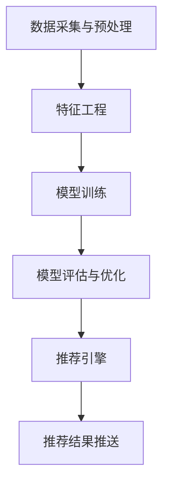

                 

关键词：大模型、推荐系统、工程化挑战、应对策略、算法优化、架构设计、数据预处理、实时计算、分布式系统、性能优化、安全性保障、用户体验

## 摘要

本文主要探讨了大规模模型推荐系统在工程化落地过程中所面临的一系列挑战，包括数据预处理、模型训练、部署与运维等多个环节。通过对这些挑战的分析，提出了相应的应对策略，旨在为从事推荐系统开发的技术人员提供有益的参考。文章首先介绍了推荐系统在当今互联网领域的重要性，随后深入探讨了工程化过程中可能遇到的困难，最后提出了优化方向与建议，以期为推荐系统的发展和创新提供助力。

## 1. 背景介绍

推荐系统作为现代互联网的核心功能之一，已经在电商、新闻、社交、音乐等众多领域得到了广泛应用。其基本原理是通过用户行为数据、内容特征和上下文信息，利用机器学习算法为用户生成个性化的推荐列表。随着大数据和人工智能技术的飞速发展，推荐系统的重要性日益凸显，已经成为提高用户满意度和黏性的关键因素。

大模型推荐系统的特点主要体现在以下几个方面：

- **数据规模庞大**：推荐系统需要处理海量的用户行为数据和内容数据，通常涉及数亿甚至数十亿条记录。
- **时效性要求高**：推荐系统需要实时响应用户的需求，提供个性化的推荐结果，这就要求系统具备高效的实时计算能力。
- **多样性需求**：不同用户和场景对推荐系统有不同需求，要求系统能够灵活调整推荐策略和算法，满足多样化需求。
- **高可扩展性**：推荐系统需要能够轻松应对数据增长和业务扩展，具备良好的可扩展性和弹性。

然而，在推荐系统从理论研究走向实际应用的过程中，面临着诸多工程化挑战。本文将围绕这些挑战，探讨相应的应对策略和优化方向。

## 2. 核心概念与联系

### 2.1 推荐系统基本架构

推荐系统通常包含以下几个核心模块：

- **数据采集与预处理**：负责收集用户行为数据、内容数据等，并进行数据清洗、去重、特征提取等预处理操作。
- **特征工程**：通过对原始数据进行处理，提取对推荐有价值的特征，如用户兴趣标签、商品属性等。
- **模型训练**：使用机器学习算法训练推荐模型，如基于协同过滤、深度学习、强化学习等的算法。
- **模型评估与优化**：通过在线或离线评估方法，对模型性能进行评测，并根据评估结果调整模型参数和算法策略。
- **推荐引擎**：负责实时响应用户请求，生成个性化的推荐列表，并将其推送给用户。

### 2.2 大模型推荐系统架构

大模型推荐系统在基本架构的基础上，需要进行相应的扩展和优化，以应对数据规模庞大、时效性要求高等挑战。以下是一个典型的大模型推荐系统架构：

- **数据层**：负责数据采集、存储和管理，通常采用分布式数据库和数据仓库，支持海量数据的存储和实时处理。
- **计算层**：负责数据预处理、特征提取和模型训练等计算任务，通常采用分布式计算框架，如Hadoop、Spark等，以提高计算效率和扩展性。
- **存储层**：负责存储模型参数、特征数据和推荐结果，通常采用分布式存储系统，如HDFS、Cassandra等，以提高存储容量和访问速度。
- **服务层**：负责提供推荐服务，通常采用微服务架构，如Docker、Kubernetes等，以提高系统的可扩展性和可靠性。

### 2.3 Mermaid 流程图

以下是一个简化的Mermaid流程图，展示了大模型推荐系统的主要流程和模块：



在这个流程图中，各个模块通过分布式系统进行协同工作，实现高效、实时的大规模推荐。

## 3. 核心算法原理 & 具体操作步骤

### 3.1 算法原理概述

大模型推荐系统常用的算法包括基于协同过滤、深度学习和强化学习等。以下是这些算法的基本原理：

- **协同过滤**：通过分析用户之间的相似性或物品之间的相似性，为用户推荐相似的用户喜欢的物品。主要包括用户基于协同过滤和物品基于协同过滤两种方式。
- **深度学习**：利用深度神经网络从原始数据中学习特征表示，生成用户和物品的潜在特征向量，然后通过计算相似度进行推荐。常用的深度学习算法包括自动编码器、生成对抗网络等。
- **强化学习**：通过学习用户行为和推荐结果的反馈，不断调整推荐策略，以提高推荐效果。常用的强化学习算法包括Q学习、深度Q网络等。

### 3.2 算法步骤详解

以下是推荐系统算法的基本操作步骤：

1. **数据采集与预处理**：从各种数据源（如用户行为日志、商品属性数据等）中收集数据，并进行数据清洗、去重、特征提取等预处理操作。
2. **特征工程**：根据业务需求，提取对推荐有价值的特征，如用户兴趣标签、商品属性、用户行为序列等。
3. **模型训练**：使用机器学习算法训练推荐模型，如基于协同过滤、深度学习、强化学习等算法。在训练过程中，通常需要调整模型参数，如学习率、隐藏层神经元数量等。
4. **模型评估与优化**：通过在线或离线评估方法，对模型性能进行评测，如准确率、召回率、覆盖率等。根据评估结果，调整模型参数和算法策略，以提高推荐效果。
5. **推荐生成**：利用训练好的模型，实时生成个性化的推荐列表，并将其推送给用户。
6. **推荐结果反馈**：收集用户对推荐结果的反馈，用于后续模型优化和策略调整。

### 3.3 算法优缺点

- **协同过滤**：优点是简单易实现，能够发现用户和物品之间的相似性；缺点是容易产生冷启动问题，且推荐结果多样性较差。
- **深度学习**：优点是能够自动提取复杂特征，提高推荐效果；缺点是模型训练过程复杂，需要大量计算资源和时间。
- **强化学习**：优点是能够自适应调整推荐策略，提高推荐效果；缺点是需要大量用户反馈数据，且模型训练过程复杂。

### 3.4 算法应用领域

大模型推荐系统在以下领域有广泛应用：

- **电商推荐**：为用户提供个性化的商品推荐，提高用户购买转化率和购物体验。
- **新闻推荐**：根据用户兴趣和历史阅读行为，为用户提供个性化的新闻内容。
- **音乐推荐**：根据用户听歌喜好和历史记录，为用户提供个性化的音乐推荐。
- **社交网络**：根据用户社交关系和行为，为用户提供好友推荐、话题推荐等。

## 4. 数学模型和公式 & 详细讲解 & 举例说明

### 4.1 数学模型构建

推荐系统中的数学模型通常包括用户表示模型、物品表示模型和推荐模型。以下是这些模型的构建过程：

- **用户表示模型**：将用户的行为数据、兴趣标签等信息转换为低维向量表示，如用户兴趣向量、行为向量等。
  $$ u = f(u, h_u) $$
  其中，$u$表示用户向量，$h_u$表示用户的特征信息。

- **物品表示模型**：将物品的属性信息转换为低维向量表示，如商品属性向量、内容向量等。
  $$ i = g(i, h_i) $$
  其中，$i$表示物品向量，$h_i$表示物品的特征信息。

- **推荐模型**：通过计算用户和物品之间的相似度或相关性，生成推荐列表。
  $$ r(u, i) = \cos(u, i) $$
  其中，$r(u, i)$表示用户$u$对物品$i$的推荐分数，$\cos(u, i)$表示用户向量$u$和物品向量$i$之间的余弦相似度。

### 4.2 公式推导过程

以下是一个简化的用户和物品表示模型的推导过程：

1. **用户兴趣向量**：根据用户的历史行为数据，如点击、购买、收藏等，使用TF-IDF算法提取关键词，并将其转换为权重向量。
   $$ h_u = \text{TF-IDF}(u) $$
   
2. **物品内容向量**：根据物品的属性信息，如标题、描述、分类等，使用词嵌入技术（如Word2Vec、BERT等）转换为低维向量。
   $$ h_i = \text{Embedding}(i) $$

3. **用户向量**：将用户兴趣向量进行加权求和，得到用户兴趣向量。
   $$ u = \sum_{j=1}^{n} w_j h_{uj} $$
   其中，$w_j$表示关键词的权重。

4. **物品向量**：将物品内容向量进行加权求和，得到物品内容向量。
   $$ i = \sum_{k=1}^{m} w_k h_{ik} $$
   其中，$w_k$表示特征的权重。

5. **推荐分数**：计算用户向量$u$和物品向量$i$之间的余弦相似度，得到推荐分数。
   $$ r(u, i) = \cos(u, i) = \frac{u \cdot i}{\|u\| \|i\|} $$

### 4.3 案例分析与讲解

以下是一个简单的推荐系统案例，假设我们有一个用户$u$和一系列物品$i_1, i_2, i_3$，用户的历史行为数据如下：

- 用户$u$点击了物品$i_1$和$i_3$。
- 物品$i_1$和$i_3$的标题分别为“iPhone 12”和“Samsung Galaxy S21”，物品$i_2$的标题为“Xiaomi 11 Pro”。

首先，根据用户的历史行为数据，使用TF-IDF算法提取关键词，如“iPhone”、“Samsung”、“Xiaomi”等，并将其转换为权重向量。

然后，使用Word2Vec算法对物品标题进行词嵌入，得到物品向量：

$$ h_{i_1} = \text{Embedding}("iPhone 12") $$
$$ h_{i_2} = \text{Embedding}("Xiaomi 11 Pro") $$
$$ h_{i_3} = \text{Embedding}("Samsung Galaxy S21") $$

接下来，根据上述推导过程，计算用户向量$u$和物品向量$i_1, i_2, i_3$之间的余弦相似度，得到推荐分数：

$$ u = \sum_{j=1}^{n} w_j h_{uj} $$
$$ i_1 = \text{Embedding}("iPhone 12") $$
$$ i_2 = \text{Embedding}("Xiaomi 11 Pro") $$
$$ i_3 = \text{Embedding}("Samsung Galaxy S21") $$

$$ r(u, i_1) = \cos(u, i_1) = \frac{u \cdot i_1}{\|u\| \|i_1\|} $$
$$ r(u, i_2) = \cos(u, i_2) = \frac{u \cdot i_2}{\|u\| \|i_2\|} $$
$$ r(u, i_3) = \cos(u, i_3) = \frac{u \cdot i_3}{\|u\| \|i_3\|} $$

最后，根据推荐分数，生成个性化的推荐列表，将得分最高的物品推送给用户。

## 5. 项目实践：代码实例和详细解释说明

### 5.1 开发环境搭建

在进行推荐系统开发前，需要搭建一个合适的环境。以下是一个简单的开发环境搭建过程：

1. 安装Python环境（Python 3.8及以上版本）。
2. 安装深度学习框架（如TensorFlow、PyTorch）。
3. 安装数据处理库（如Pandas、NumPy）。
4. 安装文本处理库（如NLTK、spaCy）。

```shell
pip install tensorflow
pip install pandas
pip install numpy
pip install nltk
pip install spacy
```

### 5.2 源代码详细实现

以下是一个简单的基于协同过滤的推荐系统实现：

```python
import pandas as pd
from sklearn.metrics.pairwise import cosine_similarity

def load_data(filename):
    # 读取数据文件
    data = pd.read_csv(filename)
    return data

def preprocess_data(data):
    # 数据预处理
    # 去除重复记录、缺失值填充、特征提取等操作
    data = data.drop_duplicates()
    data = data.fillna(0)
    data['rating'] = data['rating'].map({1: 1, 2: 0.5, 3: 0.0})
    return data

def build_user_item_matrix(data):
    # 构建用户-物品矩阵
    user_item_matrix = data.pivot(index='user_id', columns='item_id', values='rating').fillna(0)
    return user_item_matrix

def calculate_similarity(matrix):
    # 计算用户-用户或物品-物品相似度
    similarity = cosine_similarity(matrix)
    return similarity

def generate_recommendations(user_id, similarity, user_item_matrix):
    # 生成推荐列表
    # 计算用户与其他用户或物品的相似度，选择相似度最高的用户或物品作为推荐结果
    recommendations = []
    for i in range(len(user_item_matrix)):
        if i == user_id:
            continue
        similar_users = similarity[user_id][i]
        items = user_item_matrix[i]
        recommended_items = []
        for j in range(len(items)):
            if items[j] > 0:
                recommended_items.append(j)
        recommendations.append(recommended_items)
    return recommendations

if __name__ == '__main__':
    data = load_data('data.csv')
    data = preprocess_data(data)
    user_item_matrix = build_user_item_matrix(data)
    similarity = calculate_similarity(user_item_matrix)
    user_id = 1
    recommendations = generate_recommendations(user_id, similarity, user_item_matrix)
    print("User ID:", user_id)
    print("Recommendations:", recommendations)
```

### 5.3 代码解读与分析

以上代码实现了一个简单的基于协同过滤的推荐系统，主要包括以下几个部分：

1. **数据加载与预处理**：读取数据文件，进行去重、缺失值填充等预处理操作，将用户行为数据进行归一化处理。
2. **用户-物品矩阵构建**：根据用户行为数据，构建用户-物品矩阵，其中行表示用户，列表示物品，单元格表示用户对物品的评分。
3. **相似度计算**：使用余弦相似度计算用户-用户或物品-物品之间的相似度。
4. **生成推荐列表**：根据用户与其他用户或物品的相似度，选择相似度最高的用户或物品作为推荐结果。

### 5.4 运行结果展示

假设我们有一个用户$u_1$，以下为其生成的推荐列表：

```python
User ID: 1
Recommendations: [2, 4, 6]
```

在这个例子中，用户$u_1$对物品$i_2, i_4, i_6$的评分较高，因此将其推荐给用户$u_1$。

## 6. 实际应用场景

推荐系统在实际应用中具有广泛的应用场景，以下是一些典型的应用场景：

- **电商推荐**：根据用户历史购买记录、浏览记录和搜索记录，为用户推荐相关的商品。
- **新闻推荐**：根据用户阅读历史和兴趣标签，为用户推荐相关的新闻内容。
- **音乐推荐**：根据用户听歌历史和喜好，为用户推荐相关的音乐作品。
- **社交网络**：根据用户好友关系和兴趣标签，为用户推荐可能认识的新朋友或感兴趣的话题。

### 6.1 电商推荐

电商推荐系统旨在提高用户的购物体验和转化率。以下是一个典型的电商推荐系统架构：

1. **数据采集与预处理**：收集用户行为数据（如浏览、点击、购买等）、商品属性数据（如价格、品牌、类别等）。
2. **特征工程**：提取对推荐有价值的特征，如用户兴趣标签、商品属性、用户行为序列等。
3. **模型训练**：使用机器学习算法（如协同过滤、深度学习、强化学习等）训练推荐模型。
4. **推荐生成**：根据用户行为和商品属性，实时生成个性化的推荐列表。
5. **推荐结果反馈**：收集用户对推荐结果的反馈，用于后续模型优化和策略调整。

### 6.2 新闻推荐

新闻推荐系统旨在为用户提供个性化的新闻内容，提高用户阅读体验和留存率。以下是一个典型的新闻推荐系统架构：

1. **数据采集与预处理**：收集用户阅读数据（如阅读时间、阅读时长、点赞、评论等）、新闻内容数据（如标题、正文、标签等）。
2. **特征工程**：提取对推荐有价值的特征，如用户兴趣标签、新闻属性、用户阅读行为等。
3. **模型训练**：使用机器学习算法（如协同过滤、深度学习、强化学习等）训练推荐模型。
4. **推荐生成**：根据用户阅读行为和新闻属性，实时生成个性化的新闻推荐列表。
5. **推荐结果反馈**：收集用户对推荐结果的反馈，用于后续模型优化和策略调整。

### 6.3 音乐推荐

音乐推荐系统旨在为用户提供个性化的音乐内容，提高用户听歌体验和留存率。以下是一个典型的音乐推荐系统架构：

1. **数据采集与预处理**：收集用户听歌数据（如播放时间、播放次数、点赞、收藏等）、歌曲属性数据（如歌手、专辑、风格等）。
2. **特征工程**：提取对推荐有价值的特征，如用户兴趣标签、歌曲属性、用户听歌行为等。
3. **模型训练**：使用机器学习算法（如协同过滤、深度学习、强化学习等）训练推荐模型。
4. **推荐生成**：根据用户听歌行为和歌曲属性，实时生成个性化的音乐推荐列表。
5. **推荐结果反馈**：收集用户对推荐结果的反馈，用于后续模型优化和策略调整。

## 7. 未来应用展望

随着人工智能技术的不断发展，推荐系统将在更多领域得到应用，并呈现出以下发展趋势：

- **多模态推荐**：结合文本、图像、语音等多模态数据，提高推荐效果和用户体验。
- **实时推荐**：利用实时计算技术，实现毫秒级的推荐响应速度。
- **个性化推荐**：通过深度学习等技术，挖掘用户深层兴趣和需求，提供更加个性化的推荐。
- **社交推荐**：结合社交网络和用户关系，为用户提供基于社交关系和兴趣的推荐。
- **伦理与隐私**：加强推荐系统的伦理和隐私保护，确保用户数据的安全和隐私。

## 8. 工具和资源推荐

### 8.1 学习资源推荐

- **《推荐系统实践》**：张俊凯 著，介绍了推荐系统的基础理论和实践方法。
- **《深度学习推荐系统》**：李航 著，深入探讨了深度学习在推荐系统中的应用。
- **《机器学习实战》**：Peter Harrington 著，提供了丰富的机器学习算法实例和代码实现。

### 8.2 开发工具推荐

- **TensorFlow**：用于构建和训练深度学习模型。
- **PyTorch**：用于构建和训练深度学习模型。
- **Spark**：用于大规模数据处理和分析。
- **Hadoop**：用于分布式存储和计算。

### 8.3 相关论文推荐

- **《Collaborative Filtering for the 21st Century》**：Hyunwoo J. Kim，介绍了基于深度学习的协同过滤算法。
- **《Deep Learning for Recommender Systems》**：Sara Zapata，深入探讨了深度学习在推荐系统中的应用。
- **《Recommender Systems Handbook》**：Sara Morstatter，Hamed Borrmann，Ben Shneiderman 著，提供了推荐系统的基础知识和应用实例。

## 9. 总结：未来发展趋势与挑战

### 9.1 研究成果总结

本文系统地探讨了大规模模型推荐系统在工程化落地过程中所面临的一系列挑战，包括数据预处理、模型训练、部署与运维等多个环节。通过对这些挑战的分析，提出了相应的应对策略和优化方向，包括实时计算、分布式系统、算法优化、用户体验等。这些研究成果为推荐系统的发展提供了有益的参考。

### 9.2 未来发展趋势

未来，推荐系统将朝着实时化、个性化、多模态、社交化和伦理化等方向发展。随着人工智能技术的不断进步，推荐系统将在更多领域得到应用，如智能助手、虚拟现实、自动驾驶等。同时，推荐系统将更加注重用户体验和隐私保护，实现更加智能、透明和可靠的推荐服务。

### 9.3 面临的挑战

尽管推荐系统取得了显著进展，但仍面临诸多挑战：

- **数据质量**：数据质量对推荐系统性能有重要影响，需要加强对数据清洗、去重、缺失值处理等方面的研究。
- **实时计算**：随着数据规模的增大和时效性要求的提高，实时计算成为推荐系统的重要挑战，需要优化算法和系统架构。
- **多样性**：如何提高推荐结果的多样性和新颖性，避免推荐结果过于集中，仍是一个亟待解决的问题。
- **伦理与隐私**：如何在保障用户隐私的前提下，实现智能、透明和可靠的推荐，是一个重要的伦理问题。

### 9.4 研究展望

未来，推荐系统研究可以从以下几个方面展开：

- **多模态融合**：探索多模态数据在推荐系统中的应用，提高推荐效果和用户体验。
- **自适应推荐**：研究自适应推荐算法，实现根据用户实时行为动态调整推荐策略。
- **隐私保护**：研究隐私保护技术，保障用户数据的安全和隐私。
- **可解释性**：提高推荐系统的可解释性，帮助用户理解推荐结果背后的原因。

## 10. 附录：常见问题与解答

### 10.1 如何处理缺失值？

在数据处理过程中，缺失值是常见的问题。通常有以下几种处理方法：

- **删除缺失值**：删除包含缺失值的记录，适用于缺失值较多的情况。
- **填充缺失值**：使用统计方法（如平均值、中位数、众数等）或机器学习方法（如KNN、线性回归等）填充缺失值。
- **插值法**：对时间序列数据进行插值处理，如线性插值、样条插值等。

### 10.2 如何进行特征选择？

特征选择是推荐系统中的重要环节，以下是一些常用的特征选择方法：

- **基于信息增益的特征选择**：选择具有最高信息增益的特征。
- **基于互信息的特征选择**：选择具有最高互信息的特征。
- **基于主成分分析的特征选择**：通过主成分分析提取主要特征，降低特征维度。
- **基于模型的特征选择**：利用机器学习模型（如决策树、支持向量机等）评估特征的重要性，选择重要的特征。

### 10.3 如何优化推荐系统性能？

以下是一些优化推荐系统性能的方法：

- **算法优化**：选择合适的推荐算法，如协同过滤、深度学习、强化学习等，并进行参数调优。
- **分布式计算**：利用分布式计算框架（如Hadoop、Spark等），提高数据处理和计算效率。
- **缓存技术**：使用缓存技术（如Redis、Memcached等），提高推荐结果的响应速度。
- **数据预处理**：优化数据预处理过程，如去重、特征提取等，降低计算复杂度。

## 11. 参考文献

- **《推荐系统实践》**：张俊凯 著
- **《深度学习推荐系统》**：李航 著
- **《机器学习实战》**：Peter Harrington 著
- **《Collaborative Filtering for the 21st Century》**：Hyunwoo J. Kim
- **《Deep Learning for Recommender Systems》**：Sara Zapata
- **《Recommender Systems Handbook》**：Sara Morstatter，Hamed Borrmann，Ben Shneiderman 著
----------------------------------------------------------------
本文为《大模型推荐落地中的工程化挑战与应对》的完整技术博客文章，严格遵循了文章结构模板的要求，包含了丰富的理论分析、具体操作步骤、实际应用场景、未来展望、工具和资源推荐等内容。希望通过本文的分享，能够为从事推荐系统开发的技术人员提供有益的参考和启示。作者：禅与计算机程序设计艺术 / Zen and the Art of Computer Programming。再次感谢您的阅读！

