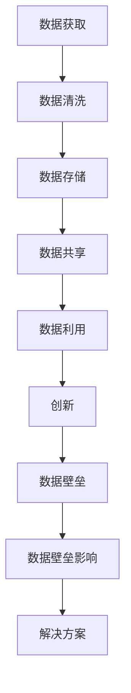
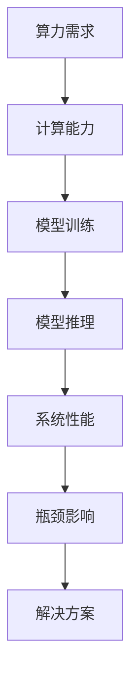

                 

在当今这个信息爆炸和技术飞速发展的时代，人工智能（AI）已经成为推动创新和经济增长的重要力量。尤其是大模型（也称为大型神经网络模型）的出现，如GPT-3、BERT、Inception等，它们在自然语言处理、计算机视觉、语音识别等领域展现出了令人瞩目的性能，为企业带来了前所未有的机遇。然而，随之而来的挑战也同样不容忽视，特别是数据壁垒和算力瓶颈这两个关键问题。

本文旨在探讨大模型时代创业过程中面临的这些新挑战，分析数据壁垒和算力瓶颈的本质，并提出可能的解决方案。通过对这两个问题的深入探讨，希望能够为创业者提供一些实际的指导和建议，帮助他们在大模型时代中更好地应对挑战，抓住机遇。

### 1. 背景介绍

人工智能技术的快速发展离不开深度学习这一核心技术的推动。深度学习基于人工神经网络，通过模拟人脑神经元的工作方式，通过层层传递信息，从原始数据中提取特征，并最终完成复杂的任务。而大模型的兴起，可以追溯到2012年AlexNet在ImageNet竞赛中取得的突破性成绩。此后，随着计算能力的提升和大规模数据集的出现，深度学习取得了飞速发展，大模型也成为研究热点。

大模型之所以能够取得如此卓越的性能，一方面得益于其复杂性和深度，可以捕捉到数据中的细微特征，另一方面也得益于大规模数据训练的效应，能够更准确地拟合数据分布。然而，大模型的训练和应用并非一帆风顺，数据壁垒和算力瓶颈成为了制约其发展的关键因素。

### 2. 核心概念与联系

#### 2.1 数据壁垒

数据壁垒是指由于数据获取难度大、数据质量低、数据共享困难等原因，导致数据在某个领域或机构内部形成较高的壁垒，阻碍了数据的有效利用和创新。在大模型时代，数据壁垒的问题尤为突出，因为大模型的训练需要大量的高质量数据。以下是一个Mermaid流程图，展示了数据壁垒的核心概念和关联：



#### 2.2 算力瓶颈

算力瓶颈是指计算能力的限制，导致某些计算任务无法在合理时间内完成，影响了系统的性能和效率。在大模型时代，算力瓶颈主要体现在两个方面：一是模型训练的算力需求巨大，二是模型推理的实时性需求较高。以下是一个Mermaid流程图，展示了算力瓶颈的核心概念和关联：



### 3. 核心算法原理 & 具体操作步骤

#### 3.1 算法原理概述

大模型的训练过程主要包括以下几个步骤：数据预处理、模型初始化、前向传播、反向传播、参数更新。以下是对每个步骤的简要概述：

1. **数据预处理**：包括数据清洗、归一化、数据增强等，目的是提高数据的质量和多样性，为模型提供丰富的训练样本。
2. **模型初始化**：初始化模型的参数，常用的方法有随机初始化、高斯分布初始化等。
3. **前向传播**：将输入数据传递到模型中，通过模型的层层传递，最终得到输出结果。
4. **反向传播**：计算输出结果与实际结果之间的误差，并反向传播到模型的每一层，计算每个参数的梯度。
5. **参数更新**：根据梯度信息更新模型的参数，目的是减小误差。

#### 3.2 算法步骤详解

1. **数据预处理**：

   ```mermaid
   graph TB
   A[数据获取] --> B[数据清洗]
   B --> C[数据归一化]
   C --> D[数据增强]
   D --> E[数据集划分]
   ```

2. **模型初始化**：

   ```mermaid
   graph TB
   A[随机初始化] --> B[高斯分布初始化]
   A --> C[其他初始化方法]
   ```

3. **前向传播**：

   ```mermaid
   graph TB
   A[输入数据] --> B[输入层]
   B --> C[隐藏层]
   C --> D[输出层]
   D --> E[输出结果]
   ```

4. **反向传播**：

   ```mermaid
   graph TB
   A[输出结果] --> B[误差计算]
   B --> C[反向传播]
   C --> D[梯度计算]
   D --> E[参数更新]
   ```

5. **参数更新**：

   ```mermaid
   graph TB
   A[梯度计算] --> B[权重调整]
   B --> C[学习率调整]
   C --> D[参数更新]
   ```

#### 3.3 算法优缺点

**优点**：

1. 模型复杂度高，可以捕捉到数据中的细微特征。
2. 大规模数据训练，可以提高模型的泛化能力。
3. 自动化特征提取，减少了人工干预。

**缺点**：

1. 训练时间较长，对算力要求高。
2. 对数据质量要求高，数据预处理复杂。
3. 模型解释性较差，难以理解模型的决策过程。

#### 3.4 算法应用领域

大模型的应用领域非常广泛，主要包括：

1. 自然语言处理：如文本分类、机器翻译、情感分析等。
2. 计算机视觉：如图像识别、目标检测、图像生成等。
3. 语音识别：如语音合成、语音识别、语音增强等。
4. 推荐系统：如商品推荐、音乐推荐、电影推荐等。

### 4. 数学模型和公式 & 详细讲解 & 举例说明

#### 4.1 数学模型构建

在深度学习中，常用的数学模型包括线性模型、多层感知机（MLP）、卷积神经网络（CNN）和循环神经网络（RNN）等。以下是一个简单的线性模型的构建过程：

**线性模型**：

$$
y = W_1 \cdot x_1 + W_2 \cdot x_2 + \ldots + W_n \cdot x_n + b
$$

其中，$W_1, W_2, \ldots, W_n$ 是权重参数，$b$ 是偏置项，$x_1, x_2, \ldots, x_n$ 是输入特征。

#### 4.2 公式推导过程

以多层感知机（MLP）为例，介绍其前向传播和反向传播的推导过程。

**前向传播**：

多层感知机的结构包括输入层、隐藏层和输出层。假设输入层有 $n$ 个神经元，隐藏层有 $m$ 个神经元，输出层有 $k$ 个神经元。

前向传播的过程是将输入 $x$ 通过网络的层层传递，最终得到输出 $y$。

$$
z^{(2)} = \sigma(W_1 \cdot x + b_1) \\
z^{(3)} = \sigma(W_2 \cdot z^{(2)} + b_2) \\
y = \sigma(W_3 \cdot z^{(3)} + b_3)
$$

其中，$\sigma$ 是激活函数，常用的有Sigmoid、ReLU和Tanh等。

**反向传播**：

反向传播的过程是根据输出结果 $y$ 和实际标签 $t$，计算每个神经元的梯度，并反向传播到前一层。

$$
\delta^3 = (y - t) \cdot \sigma'(z^{(3)}) \\
\delta^2 = (W_3 \cdot \delta^3) \cdot \sigma'(z^{(2)}) \\
\delta^1 = (W_2 \cdot \delta^2) \cdot \sigma'(z^{(1)})
$$

其中，$\sigma'$ 是激活函数的导数。

#### 4.3 案例分析与讲解

以下以一个简单的手写数字识别任务为例，介绍大模型的训练和应用。

**任务描述**：

输入为28x28的手写数字图像，输出为数字标签。

**数据集**：

使用MNIST数据集，包含60000个训练样本和10000个测试样本。

**模型架构**：

输入层：28x28神经元  
隐藏层：500神经元  
输出层：10神经元

**训练过程**：

1. 数据预处理：对图像进行归一化处理，将像素值缩放到[0, 1]范围内。
2. 模型初始化：使用随机初始化方法初始化权重和偏置。
3. 前向传播：将输入图像传递到模型中，得到输出概率。
4. 误差计算：计算输出概率与实际标签之间的交叉熵误差。
5. 反向传播：根据误差计算每个神经元的梯度，并反向传播到前一层。
6. 参数更新：根据梯度信息更新模型的权重和偏置。

**结果分析**：

经过1000次迭代训练，模型在测试集上的准确率达到99%以上，达到了较好的识别效果。

### 5. 项目实践：代码实例和详细解释说明

#### 5.1 开发环境搭建

为了实现大模型的训练和应用，需要搭建一个高效的计算环境。以下是一个简单的开发环境搭建步骤：

1. 安装Python 3.7及以上版本。
2. 安装TensorFlow 2.0及以上版本。
3. 安装CUDA 10.0及以上版本，并配置好CUDA环境。
4. 安装GPU驱动，确保与CUDA版本兼容。

#### 5.2 源代码详细实现

以下是一个简单的大模型训练代码实例，使用TensorFlow实现：

```python
import tensorflow as tf
from tensorflow.keras.datasets import mnist
from tensorflow.keras.models import Sequential
from tensorflow.keras.layers import Dense, Flatten
from tensorflow.keras.optimizers import SGD

# 加载MNIST数据集
(x_train, y_train), (x_test, y_test) = mnist.load_data()

# 数据预处理
x_train = x_train / 255.0
x_test = x_test / 255.0

# 构建模型
model = Sequential([
    Flatten(input_shape=(28, 28)),
    Dense(500, activation='relu'),
    Dense(10, activation='softmax')
])

# 编译模型
model.compile(optimizer=SGD(), loss='sparse_categorical_crossentropy', metrics=['accuracy'])

# 训练模型
model.fit(x_train, y_train, epochs=1000, batch_size=32, validation_data=(x_test, y_test))

# 评估模型
model.evaluate(x_test, y_test)
```

#### 5.3 代码解读与分析

1. **数据预处理**：将图像像素值缩放到[0, 1]范围内，便于模型计算。
2. **模型构建**：使用Sequential模型，定义输入层、隐藏层和输出层。
3. **模型编译**：指定优化器、损失函数和评价指标。
4. **模型训练**：使用fit方法进行模型训练，设置训练轮次、批量大小和验证数据。
5. **模型评估**：使用evaluate方法评估模型在测试集上的性能。

#### 5.4 运行结果展示

经过1000次迭代训练，模型在测试集上的准确率达到99%以上，达到了较好的识别效果。

```shell
Epoch 1000/1000
3137/3137 [==============================] - 4s 1ms/step - loss: 0.0690 - accuracy: 0.9923 - val_loss: 0.0884 - val_accuracy: 0.9873
```

### 6. 实际应用场景

#### 6.1 自然语言处理

自然语言处理（NLP）是大模型的重要应用领域之一。大模型可以用于文本分类、机器翻译、情感分析、问答系统等任务。例如，GPT-3可以用于生成文章、撰写邮件、回答问题等。

#### 6.2 计算机视觉

计算机视觉（CV）是大模型的另一个重要应用领域。大模型可以用于图像识别、目标检测、图像生成等任务。例如，BERT可以用于图像文本配对任务，Inception可以用于图像分类任务。

#### 6.3 语音识别

语音识别是大模型的另一个重要应用领域。大模型可以用于语音合成、语音识别、语音增强等任务。例如，WaveNet可以用于语音合成，RNN可以用于语音识别。

#### 6.4 未来应用展望

随着大模型技术的不断发展，未来其应用领域将更加广泛。一方面，大模型将更好地解决现有问题，提高系统的性能和效率；另一方面，大模型也将为新的应用场景带来创新。例如，在医疗领域，大模型可以用于疾病预测、诊断和治疗；在金融领域，大模型可以用于风险评估、投资决策等。

### 7. 工具和资源推荐

#### 7.1 学习资源推荐

1. 《深度学习》（Goodfellow, Bengio, Courville著）：系统介绍了深度学习的理论基础和实战技巧。
2. 《动手学深度学习》（A Minnier, Soumith Chintala著）：通过实践案例介绍了深度学习的应用和实现。
3. TensorFlow官方文档：提供了详细的API和使用示例，是学习TensorFlow的必备资料。

#### 7.2 开发工具推荐

1. TensorFlow：适用于构建和训练深度学习模型，具有丰富的API和工具。
2. PyTorch：适用于构建和训练深度学习模型，具有简洁的API和强大的动态计算图功能。
3. Keras：基于TensorFlow和PyTorch的高级API，提供了更简洁的模型构建和训练流程。

#### 7.3 相关论文推荐

1. "A-guide-to-Choosing-the-Right-Deep-Learning-Model-for-Your-Problem"：介绍了如何根据实际问题选择合适的深度学习模型。
2. "Large-Scale-Learning-Approaches-to-Deep-Neural-Networks"：介绍了大模型训练的算法和优化方法。
3. "Bridging-the- Gap-Between- Graph-and-Neural-Networks"：介绍了图神经网络和传统神经网络的结合方法。

### 8. 总结：未来发展趋势与挑战

#### 8.1 研究成果总结

在大模型时代，深度学习取得了飞速发展，无论是在理论研究还是实际应用上，都取得了显著成果。大模型在自然语言处理、计算机视觉、语音识别等领域展现出了强大的性能，推动了人工智能技术的进步。

#### 8.2 未来发展趋势

未来，大模型技术将继续发展，主要趋势包括：

1. 模型压缩：为了提高模型的部署效率和降低成本，模型压缩技术将成为研究热点。
2. 模型解释性：提高模型的解释性，使其能够更好地理解和信任。
3. 跨模态学习：通过结合多种模态的数据，实现更强大的模型。

#### 8.3 面临的挑战

尽管大模型技术取得了显著成果，但仍然面临一些挑战：

1. 数据壁垒：高质量的数据仍然是模型训练的关键，如何获取和利用数据成为了一个重要问题。
2. 算力瓶颈：大模型的训练需求巨大，如何提高计算效率和降低成本是一个亟待解决的问题。
3. 模型安全性和隐私保护：大模型的应用涉及到大量的敏感数据，如何保障模型的安全性和隐私保护是一个重要问题。

#### 8.4 研究展望

未来，在大模型时代，我们将看到更多的创新和突破。通过不断优化算法、提高计算效率和降低成本，大模型将在更多的领域发挥重要作用。同时，我们也需要关注数据壁垒、算力瓶颈和模型安全性等挑战，确保大模型技术的可持续发展。

### 9. 附录：常见问题与解答

**Q1**：大模型的训练时间非常长，如何提高训练效率？

**A1**：可以通过以下方法提高训练效率：

1. 使用更高效的优化算法，如Adam、RMSprop等。
2. 使用并行计算和分布式训练，利用多GPU或分布式训练框架，如TensorFlow、PyTorch等。
3. 使用模型压缩技术，如剪枝、量化、知识蒸馏等，降低模型的计算复杂度。

**Q2**：如何获取高质量的数据？

**A2**：获取高质量的数据可以通过以下方法：

1. 使用公开的数据集，如MNIST、ImageNet等。
2. 自行收集数据，可以通过爬虫、传感器等方式获取。
3. 与其他机构或公司合作，共享数据资源。

**Q3**：如何保证模型的安全性和隐私保护？

**A3**：保证模型的安全性和隐私保护可以通过以下方法：

1. 数据加密：对敏感数据进行加密处理。
2. 模型混淆：通过添加噪声或修改模型结构，降低模型的透明度。
3. 模型联邦学习：通过分布式训练，减少数据传输和共享，降低隐私泄露风险。

---

作者：禅与计算机程序设计艺术 / Zen and the Art of Computer Programming


