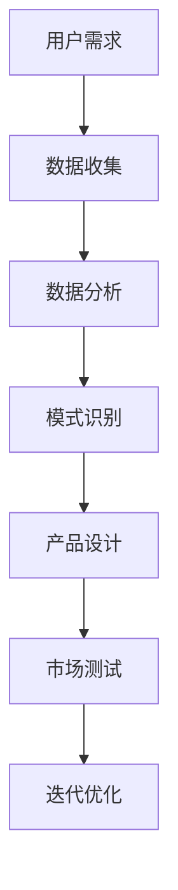

                 

在当今的世界，人工智能（AI）已经从科幻小说的想象变成了日常生活中的实际应用。从自动驾驶汽车到智能语音助手，从推荐算法到自动化生产线，AI 正在深刻地改变着我们的生活方式和工作方式。而在这个大模型时代，创业产品设计中的创新已经离不开 AI 的深度融合。本文将探讨大模型时代创业产品设计中的 AI 融合，以及如何在这种背景下实现创新。

## 文章关键词

- 大模型
- 创业产品设计
- AI 融合
- 创新策略
- 应用案例

## 文章摘要

本文首先介绍了大模型时代的背景和特点，然后探讨了创业产品设计中的创新需求，接着详细分析了 AI 融合在创业产品设计中的具体应用，最后对未来创业产品设计的发展趋势进行了展望。

## 1. 背景介绍

### 1.1 大模型时代的到来

大模型时代的到来，源于深度学习技术的飞速发展。深度学习使得计算机能够通过大规模数据学习复杂的模式和特征，从而实现高度自动化的决策和预测。以 GPT-3、BERT、BERT-4 等为代表的大模型，其参数规模已经达到数十亿甚至千亿级别，这些模型能够处理和理解复杂的人类语言，进行智能对话、文本生成等任务。

### 1.2 创业设计中的创新需求

在创业领域，产品的设计不仅仅是技术的实现，更是商业模式的创新。随着用户需求的不断变化和市场竞争的加剧，创业设计者需要不断地寻找创新点，以提升产品的竞争力。在 AI 大模型时代，AI 的深度融合为创业产品设计提供了新的可能性，使得创业设计者能够以更加智能和高效的方式进行创新。

## 2. 核心概念与联系

### 2.1 大模型

大模型是指具有数十亿、甚至千亿级参数的深度学习模型。这些模型通过大量数据进行训练，可以处理和理解复杂的信息，实现智能化的决策和预测。

### 2.2 AI 融合

AI 融合是指将人工智能技术与其他技术（如物联网、大数据等）相结合，实现跨领域的创新应用。在创业设计中，AI 融合可以帮助创业团队快速实现产品的智能化和自动化，提升产品的竞争力。

### 2.3 创业产品设计

创业产品设计是指从用户需求出发，通过创新的方式设计出具有市场竞争力的产品。在 AI 大模型时代，创业产品设计需要充分利用 AI 技术进行数据分析和模式识别，以实现产品的智能化和个性化。

### 2.4 Mermaid 流程图



## 3. 核心算法原理 & 具体操作步骤

### 3.1 算法原理概述

在创业产品设计过程中，AI 的核心算法主要包括深度学习算法、自然语言处理算法和推荐算法等。这些算法通过数据驱动的方式，实现产品的智能化和个性化。

### 3.2 算法步骤详解

1. 数据收集：收集用户行为数据、市场数据等，为后续分析提供数据基础。
2. 数据预处理：对收集到的数据进行清洗、转换等预处理，以便于后续的分析。
3. 数据分析：利用机器学习算法，对预处理后的数据进行分析，提取用户特征和市场特征。
4. 模式识别：利用深度学习算法，对分析结果进行模式识别，找出用户需求和市场趋势。
5. 产品设计：根据识别出的模式和趋势，设计出满足用户需求的产品。
6. 市场测试：将设计出的产品推向市场，进行测试和反馈。
7. 迭代优化：根据市场反馈，对产品进行迭代优化，提升产品的竞争力。

### 3.3 算法优缺点

- **优点**：AI 算法能够高效地处理海量数据，快速识别用户需求和趋势，提高产品的设计效率。
- **缺点**：算法需要大量的数据支持，且模型的训练和优化过程复杂，对计算资源和时间有较高的要求。

### 3.4 算法应用领域

AI 算法在创业产品设计中的应用非常广泛，包括但不限于以下领域：

- **智能推荐系统**：根据用户行为数据，为用户推荐个性化产品。
- **智能客服**：利用自然语言处理技术，实现智能化的客户服务。
- **智能数据分析**：对海量市场数据进行分析，为企业决策提供支持。
- **自动化生产**：利用机器人技术，实现生产线的自动化。

## 4. 数学模型和公式 & 详细讲解 & 举例说明

### 4.1 数学模型构建

在创业产品设计中，常用的数学模型包括线性回归、逻辑回归、支持向量机等。以下是线性回归模型的构建过程：

$$
y = \beta_0 + \beta_1x_1 + \beta_2x_2 + ... + \beta_nx_n + \epsilon
$$

其中，$y$ 为因变量，$x_1, x_2, ..., x_n$ 为自变量，$\beta_0, \beta_1, ..., \beta_n$ 为模型的参数，$\epsilon$ 为误差项。

### 4.2 公式推导过程

线性回归模型的推导过程如下：

1. 模型假设：假设因变量 $y$ 与自变量 $x_1, x_2, ..., x_n$ 之间存在线性关系。
2. 模型表示：将线性关系表示为 $y = \beta_0 + \beta_1x_1 + \beta_2x_2 + ... + \beta_nx_n + \epsilon$。
3. 误差项：引入误差项 $\epsilon$，表示实际观测值与预测值之间的差异。
4. 最小二乘法：利用最小二乘法，求解模型的参数 $\beta_0, \beta_1, ..., \beta_n$。

### 4.3 案例分析与讲解

假设我们要预测一家电商平台的销售额，已知影响销售额的因素有广告投放费用、促销活动次数、店铺评分等。我们可以利用线性回归模型进行预测。

1. 数据收集：收集过去一年的销售额、广告投放费用、促销活动次数和店铺评分数据。
2. 数据预处理：对数据集进行清洗、转换等预处理操作。
3. 模型构建：利用预处理后的数据，构建线性回归模型。
4. 模型训练：利用训练集数据，训练线性回归模型。
5. 预测：利用训练好的模型，对新的数据进行预测。

## 5. 项目实践：代码实例和详细解释说明

### 5.1 开发环境搭建

为了进行创业产品设计的 AI 融合，我们需要搭建一个合适的开发环境。以下是开发环境的搭建步骤：

1. 安装 Python 解释器：下载并安装 Python 解释器，版本建议为 3.8 或以上。
2. 安装深度学习框架：安装 TensorFlow 或 PyTorch 深度学习框架，这两个框架都是目前最受欢迎的深度学习框架。
3. 安装数据处理库：安装 Pandas、NumPy 等数据处理库，用于数据收集和预处理。

### 5.2 源代码详细实现

以下是一个简单的线性回归模型实现的示例代码：

```python
import pandas as pd
import numpy as np
from sklearn.linear_model import LinearRegression

# 数据收集
data = pd.read_csv('sales_data.csv')

# 数据预处理
X = data[['ad_cost', 'promotion_count', 'store_rating']]
y = data['sales']

# 模型构建
model = LinearRegression()

# 模型训练
model.fit(X, y)

# 预测
new_data = pd.DataFrame({'ad_cost': [1000], 'promotion_count': [5], 'store_rating': [4.5]})
prediction = model.predict(new_data)
print(prediction)
```

### 5.3 代码解读与分析

1. 导入必要的库：导入 Pandas、NumPy、sklearn 等库，用于数据收集、预处理和模型构建。
2. 数据收集：读取 sales_data.csv 文件，获取销售额、广告投放费用、促销活动次数和店铺评分数据。
3. 数据预处理：将数据分为自变量 X 和因变量 y，进行必要的预处理操作。
4. 模型构建：创建 LinearRegression 模型对象。
5. 模型训练：利用训练集数据，训练线性回归模型。
6. 预测：利用训练好的模型，对新的数据进行预测，输出预测结果。

## 6. 实际应用场景

### 6.1 智能推荐系统

智能推荐系统是 AI 融合在创业产品设计中的一个典型应用场景。通过分析用户行为数据，智能推荐系统可以为用户提供个性化的产品推荐，提升用户的购买体验和平台的销售额。

### 6.2 智能客服

智能客服是另一个重要的应用场景。通过自然语言处理技术，智能客服可以自动回答用户的常见问题，提高客户服务的效率和满意度。

### 6.3 智能数据分析

智能数据分析可以帮助创业团队快速获取市场数据，分析用户行为和市场趋势，为企业决策提供支持。

### 6.4 未来应用展望

随着 AI 技术的不断发展和应用场景的拓展，AI 融合在创业产品设计中的应用将越来越广泛。未来，我们可以期待更多基于 AI 技术的创新产品和服务。

## 7. 工具和资源推荐

### 7.1 学习资源推荐

- 《深度学习》：由 Ian Goodfellow 等人撰写的深度学习经典教材，适合初学者深入学习。
- 《Python 机器学习》：由 Sebastian Raschka 撰写的 Python 机器学习入门书籍，内容全面且实用。
- 《自然语言处理综合教程》：由 Peter Norvig 撰写的自然语言处理入门书籍，适合初学者了解 NLP 的基本概念和应用。

### 7.2 开发工具推荐

- TensorFlow：由 Google 开发的开源深度学习框架，适合进行复杂的深度学习模型开发。
- PyTorch：由 Facebook AI Research 开发的开源深度学习框架，具有较高的灵活性和易用性。
- Jupyter Notebook：一款流行的交互式开发环境，适合进行数据分析和模型训练。

### 7.3 相关论文推荐

- “Generative Adversarial Nets” (2014)：Ian Goodfellow 等人提出的生成对抗网络（GAN）论文，是深度学习领域的经典之作。
- “BERT: Pre-training of Deep Bidirectional Transformers for Language Understanding” (2018)：Google 研究团队提出的 BERT 模型论文，对自然语言处理领域产生了重大影响。
- “Deep Learning for Text Classification” (2017)：由 Keras 团队撰写的关于文本分类的深度学习论文，详细介绍了深度学习在文本分类中的应用。

## 8. 总结：未来发展趋势与挑战

### 8.1 研究成果总结

随着深度学习、自然语言处理等技术的不断进步，AI 融合在创业产品设计中的应用已经取得了显著的成果。通过利用 AI 技术进行数据分析和模式识别，创业团队可以更加高效地设计出满足用户需求的产品。

### 8.2 未来发展趋势

未来，AI 融合在创业产品设计中的应用将更加广泛，特别是在个性化推荐、智能客服、智能数据分析等领域。同时，随着计算能力的提升和算法的优化，AI 融合将更加智能化和自动化。

### 8.3 面临的挑战

尽管 AI 融合在创业产品设计中的应用前景广阔，但同时也面临一些挑战。首先，算法模型的训练和优化需要大量的数据和计算资源，这对创业团队提出了较高的要求。其次，AI 技术的应用需要遵循伦理和法律规范，确保数据的隐私保护和合理使用。

### 8.4 研究展望

未来，我们需要进一步探索 AI 融合在创业产品设计中的应用，特别是在小数据和动态环境下的应用。同时，我们也需要加强对 AI 技术的伦理和法律研究，确保 AI 技术的应用符合社会和伦理规范。

## 9. 附录：常见问题与解答

### 9.1 什么是大模型？

大模型是指具有数十亿、甚至千亿级参数的深度学习模型。这些模型通过大量数据进行训练，可以处理和理解复杂的信息，实现智能化的决策和预测。

### 9.2 AI 融合在创业产品设计中的具体应用有哪些？

AI 融合在创业产品设计中的具体应用包括智能推荐系统、智能客服、智能数据分析等。这些应用可以帮助创业团队更好地理解用户需求，提升产品的竞争力和用户体验。

### 9.3 如何在创业产品设计中实现 AI 融合？

在创业产品设计中实现 AI 融合，首先需要收集和分析用户数据，然后利用机器学习算法进行数据分析和模式识别，最后将分析结果应用于产品设计。此外，还需要考虑数据隐私保护和合规性等问题。

### 9.4 如何选择合适的 AI 算法？

选择合适的 AI 算法需要根据具体的应用场景和数据特点进行判断。常见的算法包括线性回归、逻辑回归、支持向量机、深度学习等。在选择算法时，需要考虑算法的性能、复杂度、可解释性等因素。

### 9.5 AI 技术在创业产品设计中的应用前景如何？

AI 技术在创业产品设计中的应用前景非常广阔。随着技术的不断进步和应用场景的拓展，AI 技术将在创业设计中发挥越来越重要的作用，为创业团队提供更多的创新可能性。

## 参考文献

1. Goodfellow, I., Bengio, Y., & Courville, A. (2016). Deep Learning. MIT Press.
2. Raschka, S. (2015). Python Machine Learning. Packt Publishing.
3. Norvig, P., & Hafner, J. (2017). Natural Language Processing with Python. O'Reilly Media.
4. Goodfellow, I. J., Pouget-Abadie, J., Mirza, M., Xu, B., Warde-Farley, D., Ozair, S., ... & Bengio, Y. (2014). Generative adversarial nets. Advances in Neural Information Processing Systems, 27.
5. Devlin, J., Chang, M. W., Lee, K., & Toutanova, K. (2018). BERT: Pre-training of deep bidirectional transformers for language understanding. Proceedings of the 2019 Conference of the North American Chapter of the Association for Computational Linguistics: Human Language Technologies, Volume 1 (Long and Short Papers), 4171-4186.

